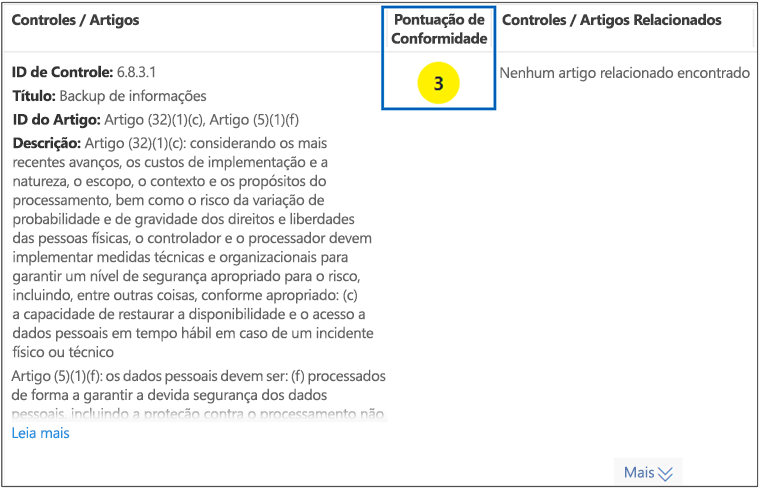
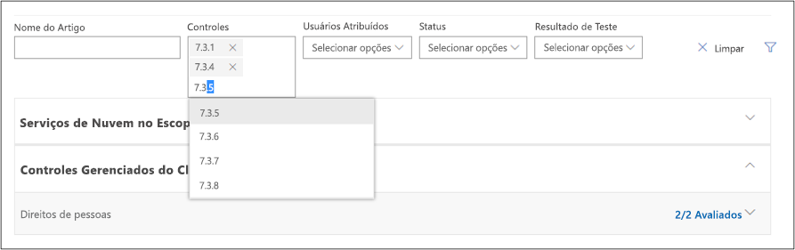
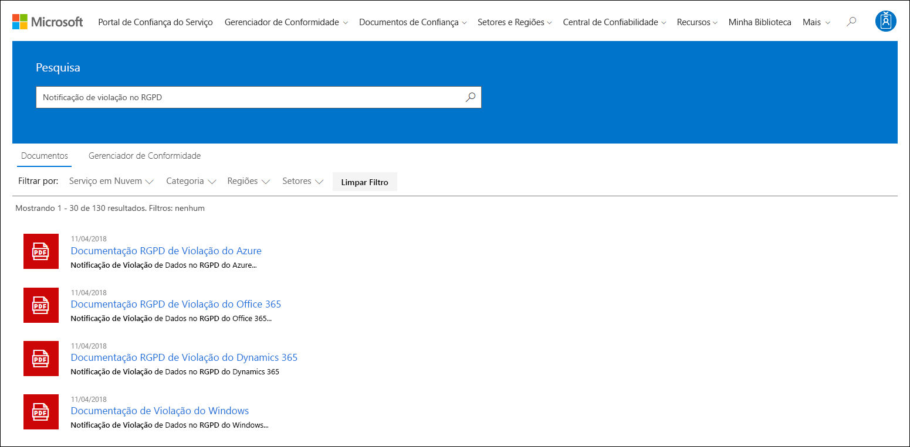
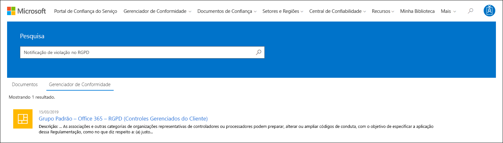

# Gerenciador de conformidade da Microsoft (Clássico)

> [!NOTE]
> Esta documentação descreve uma versão anterior deste produto. Os usuários *são fortemente desencorajados a usar esta versão do Gerenciador de conformidade*. **Se você estiver usando a versão de visualização atual do Gerenciador de conformidade, confira a documentação do [Gerenciador de conformidade (visualização)](working-with-compliance-manager.md).**

 *O Gerenciador de Conformidade não está disponível no Office 365 operado pela 21Vianet, Office 365 Germany, Office 365 US Government Community High (GCC High) ou Office 365 Department of Defense.*
  
O Gerenciador de Conformidade, uma ferramenta de avaliação de risco baseada no [Portal de Confiança do Serviço](https://docs.microsoft.com/microsoft-365/compliance/get-started-with-service-trust-portal) da Microsoft, permite monitorar, atribuir e verificar as atividades de conformidade normativas da sua organização relacionadas aos Serviços Profissionais e aos serviços em nuvem da Microsoft, como o Microsoft Office 365, o Microsoft Dynamics 365 e o Microsoft Azure. 

Gerenciador de Conformidade:
  
- Combina as informações detalhadas fornecidas pela Microsoft para auditores e reguladores como parte de várias auditorias de terceiros dos serviços em nuvem da Microsoft em relação a vários padrões (por exemplo, ISO 27001, ISO 27018 e NIST) e as informações que a Microsoft compila internamente para sua conformidade com as regulamentações (como HIPAA ou o RGPD – Regulamento Geral sobre a Proteção de Dados da UE) com sua própria avaliação de conformidade da organização com esses padrões e regulamentações.
    
- Permite atribuir, controlar e registrar as atividades relacionadas à avaliação e conformidade, o que pode ajudar sua organização a cruzar as barreiras de equipe para alcançar as metas de conformidade da sua organização.
    
- Fornece uma Pontuação de Conformidade para ajudar a controlar o andamento e a priorizar os controles de auditoria que ajudam a reduzir a exposição ao risco da organização.
    
- Fornece um repositório seguro para carregar e gerenciar evidências e outros artefatos relacionados às suas atividades de conformidade.
    
- Produz relatórios ricos e detalhados no Microsoft Excel que documentam as atividades de conformidade executadas pela Microsoft e por sua organização, que podem ser fornecidos aos auditores, reguladores e outros participantes de conformidade.

Uma breve demonstração do Gerenciador de conformidade, confira esse vídeo [gerente de conformidade](https://www.youtube.com/watch?v=r1vs8NdSXKQ).

    
> [!IMPORTANT]
> Compliance Manager is a dashboard that provides a summary of your data protection and compliance stature and recommendations to improve data protection and compliance. The Customer Actions provided in Compliance Manager are recommendations; it is up to each organization to evaluate the effectiveness of these recommendations in their respective regulatory environment prior to implementation. Recommendations found in Compliance Manager should not be interpreted as a guarantee of compliance.

    
## O que é o Gerenciador de Conformidade?

Compliance Manager is a workflow-based risk assessment tool designed to help you manage regulatory compliance within the shared responsibility model of the cloud. Compliance Manager provides you with a dashboard view of standards and regulations and assessments that contain Microsoft's control implementation details and test results and customer control implementation guidance and tracking for your organization to enter. Compliance Manager provides certification assessment control definitions, guidance on implementation and testing of controls, risk-weighted scoring of controls, role-based access management, and an in-place control action assignment workflow to track control implementation, testing status and evidence management. Compliance Manager optimizes compliance workload by enabling customers to logically group assessments together and apply assessment control testing to identical or related controls, reducing the duplication of effort that might otherwise be required to satisfy identical control requirements across different certifications.

## Avaliações no Gerenciador de Conformidade

The core component of Compliance Manager is called an *Assessment*. An Assessment is an assessment of a Microsoft service against a certification standard or data protection regulation (such as ISO 27001:2013, and the GDPR). Assessments help you to discern your organization's data protection and compliance posture against the selected industry standard for the selected Microsoft cloud service. Assessments are completed by the implementation of the controls that map to the certification standard being assessed. 
  
A estrutura de uma Avaliação baseia-se na responsabilidade que é compartilhada entre a Microsoft e a sua organização para avaliar os riscos de segurança e conformidade na nuvem e implementar as garantias de proteção de dados especificadas por um padrão de conformidade, um padrão de proteção de dados, uma regulamentação ou uma lei.
  
Uma Avaliação tem vários componentes, que são:
  
- **Serviços no Escopo** – cada avaliação se aplica a um conjunto específico de serviços Microsoft, que são listados na seção Serviços em nuvem no escopo. 
    
- **Microsoft-Managed Controls** - For each cloud service, Microsoft implements and manages a set of  *controls*  as part of Microsoft's compliance with various standards and regulations. These controls are organized into  *control families*  that align with the structure from the corresponding certification or regulation that the Assessment is aligned to. For each Microsoft-managed control, Compliance Manager provides details about how Microsoft implemented the control, along with how and when that implementation was tested and validated by an independent third-party auditor. 
    
    Aqui está um exemplo de três controles gerenciados pela Microsoft na família de controle **Segurança** de uma Avaliação do Office 365 e do RGPD. 

    
  
  a. Specifies the following information from the certification or regulation that maps to the Microsoft-managed control.

  - **ID de Controle** – o número do artigo ou seção da certificação ou regulamentação mapeada pelo controle.
    
  - **Título** – o título da regulamentação ou certificação correspondente.
    
  - **ID do artigo** – esse campo é incluído somente para avaliações do RGPD, pois especifica o número do artigo correspondente do RGPD.
    
  - **Descrição** – texto do padrão ou regulamentação mapeado pelo Controle de gerenciado da Microsoft selecionado.

  b. The Compliance Score for the control, which indicates the level of risk (due to non-compliance or control failure) associated with each Microsoft-managed control. See [Understanding the Compliance Score](#understanding-the-compliance-score) for more information. Note that Compliance Scores are rated from 1 to 10 and are color-coded. Yellow indicates low risk controls, orange indicates medium-risk controls, and red indicated high-risk controls. 
    
  c. Information about the implementation status of a control, the date the control was tested, who performed the test, and the test result.
    
  d. For each control, you can click **More** to see additional information, including details about Microsoft's implementation of the control and details about how the control was tested and validated by an independent third-party auditor. 
    
- **Customer-Managed Controls** - This is the collection of controls that are managed by your organization. Your organization is responsible for implementing these controls as part of your compliance process for a given standard or regulation. Customer-managed controls are also organized into control families for the corresponding certification or regulation. Use the customer-managed controls to implement the recommended actions suggested by Microsoft as part of your compliance activities. Your organization can use the prescriptive guidance and recommended Customer Actions in each customer-managed control to manage the implementation and assessment process for that control.
    
    Customer-managed controls in Assessments also have built-in workflow management functionality that you can use to manage and track your organization's progress towards completing the Assessment. For example, a Compliance Officer in your organization can assign an Action Item to an IT admin who has the responsibility and necessary permissions to perform the actions that are recommended for the control. When that work is complete, the IT admin can upload evidence of their implementation tasks (for example, screenshots of configuration or policy settings) and then assign the Action Item back to the Compliance Officer to evaluate the collected evidence, test the implementation of the control, and record the implementation date and test results in Compliance Manager. For more information, see the [Managing the assessment process](#managing-the-assessment-process) section in the article. 
  
## Permissões e controle de acesso baseado na função

O Gerenciador de Conformidade usa um modelo de permissão de controle de acesso baseado em função. Somente usuários aos quais é atribuída uma função de usuário podem acessar o Gerenciador de Conformidade, e as ações permitidas por cada usuário são restritas por tipo de função.
  
Observe que não há mais uma função padrão **Acesso do Convidado**. Cada usuário deve ter uma função atribuída para acessar e trabalhar no Gerenciador de Conformidade.
  
The following table describes each Compliance Manager permission and what it allows the user do. The table also indicates the role that each permission is assigned to.
  
||**Leitor do Gerenciador de Conformidade**|**Colaborador do Gerenciador de Conformidade**|**Consultor do Gerenciador de Conformidade**|**Administrador do Gerenciador de Conformidade**|**Administrador do Portal**|
|:-----|:-----|:-----|:-----|:-----|:-----|
|**Ler dados** – os usuários podem ler, mas não podem editar os dados.    |             |             |             |             |            |
|**Editar dados** – os usuários podem editar todos os campos, exceto os campos Resultado e Data do teste.    ||            |             |             |             |
|**Editar resultados do teste** – os usuários podem editar os campos Resultado e Data do teste.    ||  |             |             |             |
|**Gerenciar avaliações** – os usuários podem criar, arquivar e excluir as Avaliações.    |||  |             |             |
|**Manage users** - Users can add other users in their organization to the Reader, Contributor, Assessor, and Administrator roles. Only those users with the Global Administrator role in your organization can add or remove users from the Portal Admin role.    ||||  |             |
   
## Noções básicas sobre a Pontuação de Conformidade

No Painel, o Gerenciador de Conformidade exibe uma pontuação total das avaliações do Office 365 no canto superior direito do bloco. Esta é a Pontuação de Conformidade total geral da Avaliação e representa o acúmulo de pontos recebidos de cada avaliação de controle que foi marcada como Implementada e Testada na Avaliação. Ao adicionar uma Avaliação, você verá que a Pontuação de Conformidade já está a caminho da conclusão porque os pontos para os controles gerenciados pela Microsoft que foram implementados pela Microsoft e testados por terceiros independentes já estão aplicados.
  

  
Os pontos restantes vêm da avaliação bem-sucedida do controle do cliente, desde a implementação e teste dos controles gerenciados pelo cliente, cada um com um valor específico que contribui para a pontuação geral de conformidade. 
  
Cada Avaliação exibe uma Pontuação de Conformidade com base em risco para ajudá-lo a avaliar o nível de risco (devido a reprovação por falta de conformidade ou controle) associado a cada controle (inclusive os controles gerenciados pela Microsoft e pelo cliente) em uma Avaliação. A cada controle gerenciado pelo cliente é atribuído um número de pontos possíveis (chamado de *classificação de gravidade), em uma escala de 1 a 10, onde mais pontos serão concedidos para controles associados a um fator de risco mais alto se o controle falhar e menos pontos serão concedidos para controles de risco menores. 
  
Por exemplo, o controle de avaliação do Gerenciamento de acesso do usuário mostrado abaixo tem uma classificação de risco de gravidade muito alta e exibe um valor atribuído de 10.
  

  
 Em comparação, o controle de avaliação de Backup de informações mostrado abaixo tem uma classificação de risco de gravidade baixa e exibe um valor atribuído de 3. 
  

  
The Compliance Manager assigns a default severity ranking to each control. Risk rankings are calculated based on the following criteria:
  
- Se um controle impede a ocorrência de incidentes (classificação mais alta), detecta incidentes que ocorreram ou corrige o impacto de um incidente (classificação mais baixa). Em termos de classificação de gravidade, um controle obrigatório que impede uma ameaça recebe o número mais alto de pontos; os controles que são detetivos ou corretivos (independentemente de serem obrigatórios ou facultativos) recebem o número menor de pontos.
    
- Se for um controle obrigatório (depois que for implementado) e, portanto, não pode ser ignorado pelos usuários (por exemplo, os usuários tem que redefinir a senha e atender aos requisitos de comprimento e caracteres da senha) ou se for opcional e os usuários podem ignorá-lo (por exemplo, as regras de negócios que exigem que os usuários bloqueiem suas telas quando os computadores estão sem supervisão).
    
- Controls related to risks to data confidentiality, integrity, and availability, whether these risks come from internal or external threats, and whether the threat is malicious or accidental. For example, controls that would help prevent an external attacker from breaching that network and gaining access to personally identifiable information would be assigned more points than a control related to preventing an employee from accidentally mis-configuring a network router setting that results in a network outage).
    
- Os riscos relacionados a gatilhos legais e externos, como contratos, regulamentos e compromissos públicos, para cada controle.
    
The displayed Compliance Score values for the control are applied  *in their entirety*  to the Total Compliance Score on a pass/fail basis--either the control is implemented and passes the subsequent assessment test or it does not; there is no partial credit for a partial implementation. Only when the control has its **Implementation Status** set to **Implemented** or **Alternative Implementation** and the **Test Result** is set to **Passed** are the assigned points added to the Total Compliance Score. 
  
O mais importante é que a Pontuação de Conformidade pode ajudar a priorizar em quais controles você deve se concentrar na implementação porque ela indica os controles cujo potencial de risco é maior, caso ocorra uma falha relacionada a um controle. Além da priorização baseada em risco, quando os controles de avaliação estão relacionados a outros controles (na mesma avaliação ou em outra avaliação no mesmo agrupamento de avaliações), a conclusão de um único controle com sucesso pode resultar em uma redução significativa do esforço com base na sincronização dos resultados de testes de controle.
  
Por exemplo, na imagem abaixo vemos que a Avaliação de RGPD no Office 365 atualmente está com 46% concluído, com 51 de 111 avaliações de controle concluídas para uma Pontuação total de conformidade de 289 em um máximo de 600.
  

  
Na avaliação, o controle GDPR 7.5.5 está relacionado a 5 outros controles (7.4.1, 7.4.3, 7.4.4, 7.4.8 e 7.4.9), cada um com uma pontuação de classificação de risco de severidade de moderada a alta - 6 ou 8). Por meio do filtro de avaliação, marcamos todos esses controles, tornando-os visíveis no modo de exibição de avaliação e podemos ver abaixo que nenhum deles foi avaliado. 
  
 As those 6 controls are related, the completion of any one them will result in a synchronization of those test results across the related controls within this assessment (just as it will for any related controls in an assessment that is in the same assessment grouping). Upon completion of the implementation and testing of GDPR control 7.5.5, the control detail area refreshes to show that all 6 controls have been assessed, with a corresponding increase in the number of assessed controls to 57 and 51% assessed, and a change in total Compliance Score of +40. 
  

  
Essa caixa de diálogo de atualização de confirmação será exibida se você tentar alterar o Status de implementação de um controle relacionado de maneira que afete os outros controles relacionados.
  

  
> [!NOTE]
> Currently, only Assessments for Office 365 cloud services include a Compliance Score. Assessments for Azure and Dynamics show an assessment status. 

## Metodologia da Pontuação de Conformidade

A Pontuação de Conformidade, como a Microsoft Secure Score, é semelhante a outros sistemas de pontuação com base no comportamento; as atividades da sua organização podem aumentar a Pontuação de Conformidade executando atividades relacionadas à segurança, privacidade e proteção de dados.
  
> [!NOTE]
> The Compliance Score does not express an absolute measure of organizational compliance with any particular standard or regulation. It expresses the extent to which you have adopted controls which can reduce the risks to personal data and individual privacy. No service can guarantee that you are compliant with a standard or regulation, and the Compliance Score should not be interpreted as a guarantee in any way. 
  
Assessments in Compliance Manager are based on the shared responsibility model for cloud computing. In the shared responsibility model, Microsoft and each customer share responsibility for the protection of the customer's data when that data is stored in our cloud.
  
Como se vê na Avaliação de RGPD do Office 365 abaixo, tanto a Microsoft como os clientes são responsáveis por executar diversas Ações projetadas para atender aos requisitos do padrão ou da regulamentação em avaliação. Para racionalizar e compreender o necessário. Ações em uma variedade de padrões e regulamentos, o Gerenciador de Conformidade trata todos os padrões e regulamentos como se fossem estruturas de controle. Desse modo, as Ações realizadas pela Microsoft e pelos clientes para cada Avaliação envolvem a implementação e a validação de diversos controles.
  

  
Aqui está o fluxo de trabalho básico de uma Ação típica:
  
1. The Compliance, Risk, Privacy, and/or Data Protection Officer of an organization assigns the task to someone in the organization to implement a control. That person could be:

    - Um proprietário de política da empresa
    
    - Um implementador de TI
    
    - Outra pessoa na organização que seja responsável por executar a tarefa
    
2. That individual performs the tasks necessary to implement the control, uploads evidence of implementation into Compliance Manager, and marks the control(s) tied to the Action as implemented. Once these tasks are completed, they assign the Action to an Assessor for validation. Assessors can be:
    
    - Consultores internos que executam a validação de controles na organização
    
    - Consultores externos que examinam, verificam e certificam a conformidade, como as organizações independentes de terceiros que auditam os serviços em nuvem da Microsoft
    
3. O Consultor valida o controle, examina a evidência e marca os controles como avaliados e os resultados da avaliação (por exemplo, aprovado).
    
Depois que todos os controles associados com uma Avaliação foram avaliados, a Avaliação é considerado concluída.
  
Every Assessment in Compliance Manager comes pre-loaded with information that provides details about the Actions taken by Microsoft to satisfy the requirements of the controls for which Microsoft is responsible. This information includes details about how Microsoft has implemented each control and how and when Microsoft's implementation was assessed and verified by a third-party auditor. For this reason, the Microsoft Managed Controls for each Assessment are marked as Assessed, and the Compliance Score for the Assessment reflects this.
  
Each Assessment includes a total Compliance Score based on the shared responsibility model. Microsoft's implementation and testing of controls for Office 365 contributes a portion of the total possible points associated with a GDPR assessment. As the customer implements and tests each of the customer Actions, the Compliance Score for the Assessment will increase by the value assigned to the control. 
  
 ### Metodologia de pontuação com base em risco
  
Compliance Manager uses a risk-based scoring methodology with a scale from 1-10 that assigns a higher value to controls that represent a higher risk in the event the control fails or is non-compliant. The scoring system used by Compliance Score is based on several key factors, such as:
  
- A essência do controle
    
- O nível de risco do controle baseado nos tipos de ameaças
    
- Os gatilhos externos do controle
    

  
 ### Essência do controle
  
A essência do controle se baseia no fato do controle ser obrigatório ou opcional e se é do tipo Preventivo, Detector ou Corretivo.
  
 ### Obrigatório ou opcional
  
 *Mandatory controls*  are controls that cannot be bypassed either intentionally or accidentally. An example of a common mandatory control is a centrally-managed password policy that sets requirements for password length, complexity, and expiration. Users must comply with these requirements in order to access the system. 
  
 *Discretionary controls*  rely upon users to understand policy and act accordingly. For example, a policy requiring users to lock their computer when they leave it is a discretionary control because it relies on the user. 
  
 ### Preventivo, detector ou corretivo
  
 *Preventative controls*  are those that prevent specific risks. For example, protecting information at rest using encryption is a preventative control against attacks, breaches, etc. Separation of duties is a preventative control to manage conflict of interest and to guard against fraud. 
  
 *Detective controls*  are those that actively monitor systems to identify irregular conditions or behaviors that represent risk or that can be used to detect intrusions or determine if a breach has occurred. System access auditing and privileged administrative actions auditing are types of detective monitoring controls; regulatory compliance audits are a type of detective control used to find process issues. 
  
 *Corrective controls*  are those that try to keep the adverse effects of a security incident to a minimum, take corrective action to reduce the immediate effect, and reverse the damage, if possible. Privacy incident response is a corrective control to limit damage and restore systems to an operational state after a breach. 
  
Ao avaliar cada controle usando esses fatores, determinamos a essência do controle e atribuímos a eles um valor relativo ao risco que representam.
  
 **Ameaça**
  
| | | |
|:-----|:-----|:-----|
||**Obrigatório**   |**Opcional**   |
|**Preventivo**   |Alto risco    |Médio risco    |
|**Detector**   |Médio risco    |Baixo risco    |
|**Corretivo**   |Médio risco    |Baixo risco    |
   
Ameaça refere-se a qualquer coisa que represente um risco ao padrão fundamental de segurança aceito universalmente, conhecido como tríade CIA de dados: Confidencialidade, Integridade e Disponibilidade:
  
- Confidencialidade significa que as informações podem ser lidas e compreendidas apenas por fornecedores confiáveis, autorizados.
    
- Integridade significa que as informações não foram modificadas ou destruídas por terceiros.
    
- Disponibilidade significa que as informações podem ser facilmente acessadas com um alto nível de qualidade do serviço.
    
A failure of any of these characteristics is considered a compromise of the system as a whole. Threats can come from both internal and external sources, and an actor's intent can be accidental or malicious. These factors are estimated in a threat matrix that assigns threat levels of either High, Moderate, or Low to each combination of scenarios.

| |**Interno** | |**Externo** | | | |
|:-----|:-----|:-----|:-----|:-----|:-----|:-----|
||*Mal-intencionado* |*Acidental* |*Mal-intencionado* |*Acidental* |||
|**Confidencialidade** |(A, M ou B)    |(A, M ou B)    |(A, M ou B)    |(A, M ou B)|
|**Integridade** |(A, M ou B)    |(A, M ou B)    |(A, M ou B)    |(A, M ou B)|
|**Disponibilidade** |(A, M ou B)    |(A, M ou B)    |(A, M ou B)    |(A, M ou B)|
   
 **Gatilhos externos**
  
|**Contratos**|**Regulamentos**|**Compromissos públicos**|
|:-----|:-----|:-----|
|(A, M ou B)    |(A, M ou B)    |(A, M ou B)    |
   
Fatores externos como regulamentos aplicáveis, contratos e compromissos públicos podem influenciar controles desenvolvidos para proteger dados e evitar violações de dados, e cada um desses fatores são valores de risco atribuídos, seja alto, moderado ou baixo.
  
A quantidade estimada de ocorrências desses valores de risco Alto, Moderado ou Baixo nos 15 cenários possíveis de riscos representados na CIA/ameaças e Gatilhos Jurídicos/Externos é combinada para fornecer uma ponderação de risco que considera a probabilidade e o número de ocorrências de riscos em um determinado valor como significativo e é considerado ao calcular a classificação de gravidade do controle.
  
Com base na classificação da gravidade do controle, o controle recebe seu valor de pontuação de conformidade, um número entre 1 (baixo) e 10 (alto), agrupado nas seguintes categorias de risco:
  
|**Nível de risco**|**Valor do controle**|
|:-----|:-----|
|Baixo    |1 a 3    |
|Moderado    |6    |
|Alto    |8    |
|Grave    |10    |
   
Ao priorizar os controles de avaliação com os valores mais altos de pontuação de conformidade, a organização se concentra nos itens de maior risco e recebe um retorno positivo proporcionalmente maior na forma de mais pontos adicionados à pontuação total de conformidade para a avaliação de cada avaliação de controle concluída.
  
### Resumo da metodologia de pontuação
  
The Compliance Score is a core component of the way that Compliance Manager helps organizations understand and manage their compliance. The Compliance Score for an assessment is an expression of the company's compliance with a given standard or regulation as a number, where the higher the score (up to the maximum number of points allocated for the Assessment), the better the company's compliance posture. Understanding the compliance scoring methodology in which assessment controls are assigned risk severity values between 1- 10 (low to high), and how completed control assessments add to the total compliance score is crucial to organizations for prioritizing their actions.

## Agrupamento de avaliações

Ao criar uma nova Avaliação, você é solicitado a criar um grupo ao qual ela será atribuída ou a atribuir a Avaliação a um grupo existente. Grupos permitem organizar Avaliações de forma lógica e compartilhar informações comuns e tarefas de fluxo de trabalho entre Avaliações com os controles gerenciados pelo cliente iguais ou relacionados.
  
For example, you could group Assessments by year or teams, departments, or agencies within your organization or group them by year. Here are some examples of groups and the Assessments they might contain.
  
- Avaliações de RGPD – 2018
    
  - Office 365 + RGPD
    
  - Azure + RGPD
    
  - Dynamics + RGPD
    
- Avaliações do Azure – 2018
    
  - Azure + RGPD
    
  - Azure + ISO 27001:2013
    
  - Azure + ISO 27018:2014
    
- As avaliações de privacidade e segurança de dados
    
  - Office 365 + ISO 27001:2013
    
  - Office 365 + ISO 27018:2014
    
  - Azure + ISO 27001:2013
    
  - Azure + ISO 27018:2014
    
> [!TIP]
> Recomendamos determinar uma estratégia de agrupamento para sua organização antes de adicionar novas avaliações. 
  
Estes são os requisitos para agrupar Avaliações:
  
- Os nomes de grupo (também chamado de *IDs de grupo) devem ser exclusivos em sua organização. 
    
- Groups can contain Assessments for the same certification/regulation, but each group can only contain one Assessment for a specific cloud service/certification pair. For example, a group can't contain two Assessments for Office 365 and GDPR. Similarly, a group can contain multiple Assessments for the same cloud service as long as the corresponding certification/regulation for each one is different.
    
Após uma avaliação ser adicionada a um agrupamento de avaliações, o agrupamento não poderá ser alterado. Você pode renomear o grupo de avaliação, mas isso alterará o nome do agrupamento de avaliações de todas as avaliações associadas a esse grupo. Você pode criar uma avaliação e um novo grupo de avaliação e copiar informações de uma avaliação existente, o que efetivamente criará uma duplicata dessa avaliação em um grupo de avaliação diferente. O arquivamento de uma avaliação interrompe a relação entre ela e o grupo de avaliação. Quaisquer atualizações posteriores de outras avaliações relacionadas não serão mais refletidas na avaliação arquivada.
  
Como explicado anteriormente, a principal vantagem de usar grupos é que, quando duas Avaliações diferentes do mesmo grupo compartilharem o mesmo controle gerenciado pelo cliente (e, portanto, as ações do cliente seriam as mesmas para cada controle), então a conclusão dos detalhes da implementação, as informações do teste e os status do controle de uma Avaliação serão sincronizados para o mesmo controle em qualquer outra Avaliação do grupo. Em outras palavras, se essas Avaliações compartilham o mesmo controle e estão no mesmo grupo, você só precisa gerenciar o processo de avaliação desse controle em uma Avaliação. Os resultados desse controle serão automaticamente sincronizados com outras Avaliações. Por exemplo, os sistemas ISO 27001 e ISO 27018 têm um controle relacionado a políticas de senha. Se o Status do Teste do controle de uma avaliação estiver definido como “Aprovado”, o controle será atualizado (e marcado como “Aprovado”) na outra Avaliação desde que ambas sejam parte do mesmo Grupo de avaliação.
  
Como um exemplo disso, considere esses dois controles de avaliação relacionados, cada um relacionado à criptografia de dados em redes públicas, controle 6.10.1.2 na avaliação RGPD – Office 365 e controle SC-13 na avaliação Office 365 – NIST 800–53. Esses são os controles de avaliação relacionados, em duas avaliações diferentes, ambas no Grupo Padrão. Inicialmente, nenhuma avaliação concluiu as avaliações de controle do cliente, conforme exibido no Painel do Gerenciador de Conformidade que mostra uma dessas duas Avaliações.
  

  
Ao clicar na avaliação **Office 365 – RGPD** e usar os controles de filtro para exibir o controle RGPD 6.10.1.2, podemos ver que o controle NIST 800-53 SC-13 está listado como um controle relacionado.
  

  
 Aqui mostramos a conclusão da implementação e testes do controle RGPD 6.10.1.2. 
  

  
Ao navegar até o controle relacionado na avaliação agrupada, podemos ver que NIST 800-53 SC-13 também foi marcada como concluída com a mesma data e hora, sem a necessidade de implementação adicional ou teste.
  

  
Novamente no Painel, podemos ver que cada avaliação tem uma avaliação de controle concluída e que a Pontuação total de conformidade de cada avaliação aumentou em oito (o valor de pontuação de conformidade do controle compartilhado).
  

## Funções administrativas

Há funções administrativas específicas disponíveis apenas para a conta de administrador do locatário e que só ficam visíveis após login como administrador global.
  
> [!NOTE]
> The Access to Restricted Documents permission in the drop-down list will allow administrators to give users access to restricted documents that Microsoft shares on the Service Trust Portal. The Restricted Documents feature isn't available, but is coming soon. 
  
### Atribuir funções do Gerenciador de Conformidade aos usuários

Each Compliance Manager role has slightly different permissions. You can view the permissions assigned to each role, see which users are in which roles, and add or remove users from that role through the Service Trust Portal by selecting the **Admin** menu item, and then choosing **Settings**. 
  

  
Para adicionar ou remover usuários das funções do Gerenciador de Conformidade.
  
1. Acesse [https://servicetrust.microsoft.com](https://servicetrust.microsoft.com).
    
2. Entre com sua conta de administrador global do Azure Active Directory.
    
3. Na barra de menus superior do Portal de Confiança do Serviço, clique em **Administração** e, em seguida, escolha **Configurações**. 
    
4. Na lista suspensa **Selecionar Função**, clique na função que deseja gerenciar. 
    
5. Os usuários adicionados a cada função estão listados na página **Selecionar função**. 
    
6. To add users to this role, click **Add**. In the **Add Users** dialog, click the user field. You can scroll through the list of available users or begin typing the user name to filter the list based on your search term. Click the user to add that account to the **Add Users** list to be provisioned with that role. If you would like to add multiple users concurrently, begin typing a user name to filter the list, and then click the user to add to the list. Click **Save** to provision the selected role to these users. 
    
    
  
7. Para remover os usuários dessa função, selecione-os e clique em **Excluir**. 
    
    
 
## Configurações de privacidade do usuário

Certain regulations require that an organization must be able to delete user history data. To enable this, Compliance Manager provides the **User Privacy Settings** functions, that allow administrators to: 
  
- [Procurar um usuário](#search-for-a-user)

- [Exportar um relatório do histórico de dados da conta](#export-a-report-of-account-data-history)

- [Reatribuir os itens de ação](#reassign-action-items)

- [Excluir o histórico de dados do usuário](#delete-user-data-history)
    

  
### Procurar um usuário

Para procurar uma conta de usuário:
  
1. Insira o endereço de email do usuário digitando o alias (isto é, a informação que fica à esquerda do símbolo @) e escolhendo o nome do domínio clicando na lista de sufixos de domínios à direita. Se o locatário tiver vários domínios registrados, verifique novamente o sufixo do nome de domínio do endereço de email para garantir que é o correto.
    
2. Assim que o nome de usuário for inserido corretamente, clique em **Pesquisar**. 
    
3. If the user account is not found, the error message 'User not found' will be displayed on the page. Check the user's email address information, make corrections as necessary and click **Search** to try again. 
    
4. Se a conta de usuário for encontrada, o texto do botão mudará de **Pesquisar** para **Limpar**, o que indica que a conta de usuário retornada é o contexto operacional para as funções adicionais que serão exibidas abaixo e que a execução dessas funções será aplicada a essa conta de usuário. 
    
5. Para limpar os resultados da pesquisa e pesquisar um usuário diferente, clique em **Limpar**. 
    
### Exportar um relatório do histórico de dados da conta

Depois de identificar a conta do usuário, convém gerar um relatório das dependências vinculadas a essa conta. Essa informação permite reatribuir itens de ação abertos ou garantir o acesso a evidências carregadas anteriormente. 
  
 Para gerar e exportar um relatório:
  
1. Clique em **Exportar** para gerar e baixar um relatório dos itens de ação de controle do Gerenciador de Conformidade atribuídos atualmente à conta do usuário retornada e à lista de documentos carregados pelo usuário. Se não surgirem ações atribuídas ou documentos carregados, uma mensagem de erro informará “Não há dados para esse usuário”. 
    
2. O relatório é baixado em segundo plano na janela ativa do navegador, assim, se você não vir um pop-up, verifique o histórico de download do navegador.
    
3. Abra o documento para verificar os dados do relatório.
    
> [!NOTE]
> This is not a historical report that retains and displays state changes to action item assignment history. The generated report is a snapshot of the control action items assigned at the time that the report is run (date and time stamp written into the report). For instance, any subsequent reassignment of action items will result in different snapshot report data if this report is generated again for the same user. 
  
### Reatribuir os itens de ação

This function enables an organization to remove any active or outstanding dependencies on the user account by reassigning all action item ownership (which includes both active and completed action items) from the returned user account to a new user selected below. This action does not change document upload history for the returned user account. 
  
 Para reatribuir itens de ação para outro usuário:
  
1. Clique na caixa de entrada para procurar e selecionar outro usuário na organização para o qual os itens de ação do usuário retornado devem ser atribuídos.
    
2. Selecione **Substituir** para reatribuir todos os itens de ação de controle do usuário retornado ao usuário recém-selecionado. 
    
3. Uma caixa de diálogo de confirmação será exibida com a mensagem “Isso reatribuirá todos os itens de ação de controle do usuário atual ao usuário selecionado. Não é possível desfazer a ação. Tem certeza de que deseja continuar?
    
4. Para continuar, clique em **OK**, senão clique em **Cancelar**. 
    
> [!NOTE]
> All action items (both active and completed) will be assigned to the newly selected user. However, this action does not affect the document upload history; any documents uploaded by the previously assigned user will still show the date/time and name of the previously assigned user. 
  
Changing the document upload history to remove the previously assigned user will have to be done as a manual process. In that case, the administrator will need to:
  
1. Abrir o relatório de exportação baixado anteriormente.
  
2. Identificar e navegar até o item de ação de controle desejado.
  
3. Clicar em **Gerenciar Documentos** para navegar até o repositório de evidências daquele controle. 
  
4. Baixar o documento.
  
5. Excluir o documento no repositório de evidências.
  
6. Re-upload the document. The document will now have a new upload date, time and Uploaded By username. 
  
### Excluir o histórico de dados do usuário

This sets control action items to 'unassigned' for all action items assigned to the returned user. This also sets uploaded by value to 'user removed' for any documents uploaded by the returned user
  
 Para excluir o item de ação de conta de usuário e o histórico de carregamento de documento:
  
1. Clique em **Excluir**. 

    A confirmation dialog will be displayed, stating "This will remove all control action item assignments and the document upload history for the selected user. This action cannot be undone. Are you sure you want to continue?"
    
3. Para continuar, clique em **OK**, senão clique em **Cancelar**. 
  
## Como usar o Gerenciador de Conformidade

O Gerenciador de Conformidade fornece ferramentas para atribuir, controlar e registrar as atividades relacionadas à avaliação e conformidade, e ajuda sua organização a cruzar as barreiras de equipe para alcançar as metas de conformidade da sua organização.
  

## Como acessar o Gerenciador de Conformidade

You access Compliance Manager from the Service Trust Portal. Anyone with a Microsoft account or Azure Active Directory organizational account can access Compliance Manager.
  

  
1. Acesse [https://servicetrust.microsoft.com](https://servicetrust.microsoft.com/).
    
2. Entre com sua conta de usuário do Azure Active Directory (Azure AD).
    
3. No Portal de Confiança do Serviço, clique em **Gerenciador de Conformidade**. 
    
4. When the Non-Disclosure Agreement is displayed, read it, and then click **Agree** to continue. You'll only have to do this once, and then the Compliance Manager dashboard is displayed. 

    Para começar, adicionamos as Avaliações a seguir por padrão:
    
    
    
5. Clique no  **Ajuda** para fazer um tour rápido no Gerenciador de Conformidade. 
  
## Exibir os itens de ação

O Gerenciador de Conformidade oferece uma visão conveniente de todos os itens de ação de avaliação dos controle atribuídos, permitindo que você tome ações rápidas e fáceis sobre eles. É possível exibir todos os itens de ação ou escolher aqueles que correspondam a uma certificação específica clicando na guia associada a essa avaliação. Por exemplo, na imagem abaixo, a guia RGPD foi selecionada e ela exibe controles relacionados à avaliação de RGPD.
  

  
Para exibir seus itens de ação:
  
1. Acesse o painel do Gerenciador de Conformidade
    
2. Clique no link **Itens de Ação** e a página será atualizada para mostrar os itens de ação atribuídos a você. 
    
    By default, all action items are shown. If you have action items across multiple certifications, the names of the certifications will be listed in tabs across the top of the assessment control. To see the action items for a specific certification, click that tab.

## Adicionar uma avaliação

Para adicionar uma avaliação ao Gerenciador de Conformidade:
  
1. No painel Gerenciador de Conformidade, clique em  **Adicionar Avaliação**. 
    
2. In the **Add an Assessment** window, you can create a new group to add the Assessment to or you can add it to an existing group (the built-in group is named "Initial Group".) Depending on the option you choose, either type the name of a new group or select an existing group from the drop-down list. For more information, see [Grouping Assessments](#grouping-assessments).
    
    Se você criar um grupo, também terá a opção de copiar informações de um grupo existente para a nova Avaliação. Isso significa que as informações adicionadas aos campos Detalhes da implementação, Plano do teste e Resposta de gerenciamento dos controles gerenciados pelo cliente nas Avaliações do grupo que você está copiando serão copiadas para os mesmos controles gerenciados pelo cliente (ou relacionados) da nova Avaliação. Se você estiver adicionando uma nova Avaliação a um grupo existente, as informações comuns das Avaliações desse grupo serão copiadas para a nova Avaliação. Saiba mais em [Copiar informações de Avaliações existentes](#copying-information-from-existing-assessments).
    
3. Clique em **Avançar** e faça o seguinte:
    
    a. Escolha um serviço em nuvem da Microsoft para avaliar a conformidade na lista suspensa **Selecionar um produto**. 
    
    b. Escolha uma certificação de referência para avaliar o serviço em nuvem selecionado na lista suspensa **Selecionar uma certificação**. 
    
4. Clique em **Adicionar ao Painel** para criar a avaliação, que será adicionada ao painel Gerenciador de Conformidade como um novo bloco no final da lista de blocos existentes. 
    
    O **bloco Avaliação** do painel Gerenciador de Conformidade exibe o agrupamento de avaliações, o nome da avaliação (criado automaticamente como uma combinação da certificação selecionado e do nome do serviço), a data da criação e a data da última modificação, a pontuação total de conformidade (que é a soma de todos os valores de risco de controles atribuídos que foram implementados, testados e aprovados) e, na parte inferior, o andamento dos indicadores que mostram o número de controles avaliados. 
    
5. Clique no nome da avaliação para abri-la e exibir seus detalhes.
    
6. Clique no menu **Ações** para ver seus itens de ações atribuídas, renomear o grupo de avaliação, exportar o relatório de avaliação ou arquivar a avaliação. 
    
    

## Copiar informações de avaliações existentes

Como explicado anteriormente, ao criar um grupo de avaliação, você tem a opção de copiar informações de Avaliações em um grupo existente para a nova Avaliação no grupo novo. Assim, é possível aplicar a avaliação e a tarefa de teste que já foi concluída aos mesmos controles gerenciados pelo clientes na nova Avaliação. Por exemplo, se você tem um grupo para todas as Avaliações relacionadas ao RGPD na sua organização, pode copiar as informações comuns da tarefa de avaliação existente ao adicionar uma nova Avaliação ao grupo.
  
Você pode copiar as seguintes informações de cliente para uma nova Avaliação:
  
- Assessment Users. An Assessment user is a user who the control is assigned to.
    
- Status, Data de Teste e Resultados de Teste.
    
- Os detalhes da implementação e informações do plano de testes.
    
De modo semelhantes, as informações de controles gerenciados pelo cliente compartilhadas no mesmo grupo de Avaliação são sincronizadas. E as informações relacionadas de controles gerenciados pelo cliente que estejam no mesmo grupo de Avaliação também são sincronizadas.

## Exibir avaliações

1. Localize o bloco Avaliação correspondente à Avaliação que deseja exibir e clique no nome de avaliação para abri-la e exibir os controles gerenciados da Microsoft e do cliente associados à Avaliação, incluindo uma lista dos serviços em nuvem que estão no escopo da Avaliação. Aqui está um exemplo da Avaliação do Office 365 e RGPD.
    
    
  
1. Esta seção mostra as informações do resumo da Avaliação, incluindo o nome de agrupamento, o produto, o nome e o número de controles da Avaliação
    
2. This section shows the Assessment Filter controls. For a more detailed explanation of how to use the Assessment Filter controls see the [Managing the assessment process](#managing-the-assessment-process) section. 
    
3. Esta seção mostra os serviços em nuvem individuais no escopo da avaliação.
    
4. Esta seção contém controles gerenciados da Microsoft. Controles relacionados são organizados por famílias de controles. Clique em uma família de controles para expandi-la e exibir os controles individuais.
    
5. Esta seção contém controles gerenciados pelo cliente, que também são organizados por famílias de controles. Clique em uma família de controles para expandi-la e exibir os controles individuais.
    
6. Exibe o número total de controles na família de controle e quantos deles foram avaliados. Um dos principais recursos do Gerenciador de Conformidade é acompanhar o andamento da sua organização quanto à avaliação dos controles gerenciados pelo cliente. Para obter mais informações, confira a seção [Noções básicas sobre a pontuação de conformidade](#understanding-the-compliance-score). 

## Gerenciar o processo de avaliação

Inicialmente, o criador de uma Avaliação é o único Usuário da Avaliação. Para cada controle gerenciado pelo cliente, é possível atribuir um Item de Ação a uma pessoa da sua organização para que ela se torne um Usuário da Avaliação autorizado a executar as Ações do Cliente recomendadas, além de reunir e carregar evidências. Ao atribuir um Item de Ação, é possível optar por enviar para a pessoa um email com detalhes como as Ações do Cliente recomendadas e a prioridade do Item de Ação. A notificação por email incluirá um link para o painel **Itens de Ação**, que lista todos os Itens de Ação atribuídos a essa pessoa. 
  
Aqui está uma lista de tarefas a executar usando os recursos do fluxo de trabalho do Gerenciador de Conformidade.
  

  
1. **Use as opções de filtragem para encontrar os controles de avaliação específicos** – o Gerenciador de Conformidade fornece **Opções de filtro**, que proporcionam critérios de seleção altamente precisos para exibir os controles de avaliação, ajudando a visar com precisão as áreas de destino específicas dos esforços de conformidade. 
    
    Clique no ícone de funil no lado direito da página para mostrar ou ocultar os controles das **Opções de Filtro **. Esses controles permitem especificar critérios de filtro, e somente os controles de avaliação que atenderem a esses critério serão exibidos abaixo. 
  
    - **Artigos** – filtra o nome do artigo e retorna os controles de avaliação associados a esse artigo. Por exemplo, se você digitar “Artigo (5)”, uma lista de seleção de artigos cujos nomes incluem essa cadeia de caracteres será retornada, ou seja, Artigo (5)(1)(a), Artigo (5)(1)(b), Artigo (5)(1)(c), etc. Se você selecionar o Artigo (5)(1)(c), os controles associados ao Artigo (5)(1)(c) serão retornados. Esse é um campo de seleção múltipla que usa um operador OR com vários valores. Por exemplo, se você escolher o Artigo (5)(1)(a) e depois adicionar o Artigo (5)(1)(c), o filtro retornará controles associados ao Artigo (5)(1)(a) ou ao Artigo (5)(1)(c). 
    
      
  
    - **Controles** – retorna a lista de controles cujos nomes se encaixam no filtro, por exemplo, digitar em 7.3 retorna uma lista de seleção de itens como 7.3.1, 7.3.4, 7.3.5, etc. Esse campo de seleções múltiplas usa um operador OR com vários valores; por exemplo, se você selecionar 7.3.1 e depois adicionar 7.3.4, o filtro retornará controles associados a 7.3.1 ou a 7.3.4. 
    
      
  
    - **Usuários atribuídos** – retorna a lista de controles atribuídos ao usuário selecionado. 
    
    - **Status** – retorna a lista de controles com o status selecionado. 
    
    - **Resultado do teste** – retorna a lista de controles do resultado de teste selecionado. 
    
    As you apply filter conditions, the view of applicable controls will change to correspond to your filter conditions. Expand the control family sections to show the control details below. 
    
    
  
2. If after selecting the desired filters no results are shown, that means there are no controls that correspond to the specified filter conditions. For instance, if you select a particular **Assigned User** and then choose a **Control** name that does correspond to the control assigned to that user, no assessments will be shown in the page below. 
    
3. **Assign an Action Item to a user** - You can assign an Action Item to a person to implement the requirements of a certification/regulation, or to test, verify, and document your organization's implementation requirements. When you assign an Action Item, you can choose to send an email to the person that contains details including the recommended Customer Actions and the Action Item priority. You can also unassign or reassign an Action Item to a different person. 
    
4. **Gerenciar documentos** – os controles gerenciados pelo cliente também têm um local para gerenciar documentos relacionados à execução de tarefas de implementação, teste e validação. Qualquer pessoa com permissões para editar dados no Gerenciador de Conformidade pode carregar documentos clicando em **Gerenciar Documentos**. Depois que um documentadas é carregado, é possível clicar em **Gerenciar Documentos** para exibir e baixar arquivos. 
    
5. **Fornecer detalhes de implementações e testes** – cada controle gerenciado pelo cliente tem um campo editável em que os usuários podem adicionar os detalhes da implementação que documentam as etapas executadas pela sua organização para atender aos requisitos da certificação/regulamento e para validar e documentar como sua organização atendeu a esses requisitos.
    
6. **Set Status** - Set the Status for each item as part of the assessment process. Available status values are **Implemented**, **Alternative Implementation**, **Planned**, and **Not in Scope**. 
    
7. **Inserir a data do teste e o resultado do teste** – a pessoa com a função de Avaliador do Gerenciador de Conformidade pode verificar se os testes adequados foram realizados, examinar os detalhes da implementação, o plano do teste, os resultados do teste e as evidências carregadas e depois definir a Data do teste e o Resultado do teste. Os valores de resultado do teste disponíveis são **Aprovado**, **Reprovado-Baixo Risco**, **Reprovado-Médio Risco** e **Reprovado-Alto Risco**. 

## Gerenciar itens de ação

As pessoas envolvidas no processo de avaliação da sua organização podem usar o Gerenciador de Conformidade para revisar controles gerenciados pelo cliente de todas as Avaliações das quais são usuários. Quando o usuário entra no Gerenciador de Conformidade e abre o painel **Itens de Ação**, é exibida uma lista de Itens de Ação que foram atribuídos a ela. Dependendo da função do Gerenciador de Conformidade atribuída ao usuário, ele pode fornecer detalhes da implementação ou dos testes, atualizar o Status ou atribuir Itens de Ação. 
  
As certification controls are generally implemented by one person and tested by another, the control action item can be initially assigned to one person for implementation, and once that is complete, that person can reassign the control action item to the next person for control testing and uploading of evidence. This assignment/reassignment of control actions can be performed by any users who have a Compliance Manager role with sufficient permissions, allowing for central management of control assignments, or decentralized routing of control action items, from implementer to tester as appropriate.
  
Para atribuir um item de ação:
  
1. No painel do Gerenciador de Conformidade, localize o bloco da avaliação com o qual você deseja trabalhar e clique no nome da avaliação para acessar a página de detalhes da avaliação.
    
2. Você pode clicar em **Filtrar** e usar os controles de filtros para localizar o controle de avaliação específico que você deseja atribuir ou 
    
3. Role para baixo até a seção Controles Gerenciados pelo Cliente, expanda a família de controle e role pela lista de controles até localizar o controle de avaliação a ser atribuído
    
4. Na coluna **Usuário Atribuído**, clique em **Atribuir**. 
    
5. In the Assign Action Item dialog box, click the **Assign To** field to populate the list of users to whom the action can be assigned. You can scroll through the list to find the target user or start typing in the field to search for the username. 
    
6. Clique no usuário para atribuir este item de ação a ele.
    
7. Se quiser enviar uma notificação por email para o usuário, certifique-se de marcar a caixa de seleção **Enviar notificação por email**. 
    
8. Digite as anotações que você deseja exibir para esse usuário e clique em **Atribuir**. 
 
    O usuário receberá as notificações sobre a atribuição de itens de ação e as anotações que você forneceu.
    
The notes that are associated with the action item are persisted in the notes section, available for the next time the action item is assigned. These notes are not read-only, can be edited, replaced or removed by the person assigning the action item.

## Exportar informações de uma avaliação

É possível exportar uma Avaliação para um arquivo do Excel, que pode ser revisado por interessados na conformidade da sua organização e fornecido para auditores e reguladores. Este relatório de avaliação é um instantâneo da avaliação a partir da data e da hora em que o relatório foi criado e contém os detalhes dos controles gerenciados pela Microsoft e dos controles gerenciados pelo cliente para essa avaliação, incluindo o status da implementação do controle e a data do teste de controle e os resultados do teste, além disso, fornece links para os documentos de provas carregados. É recomendável que você exporte o relatório de avaliação antes de arquivar uma avaliação já que as avaliações arquivadas não retêm seus links para documentos carregados.
  
Para exportar um relatório de Avaliação:
  
- No painel do Gerenciador de conformidade, clique em **Ações** no bloco de avaliação que deseja exportar e, em seguida, escolha **Exportar para Excel**

  Ou
    
- Se você estiver exibindo a página de detalhes da Avaliação, clique no botão **Exportar para Excel** localizado no canto superior direito da página, acima da Pontuação de Conformidade da avaliação.
    
The assessment report will be downloaded in your browser session. If you don't see a popup informing you of this, you may wish to check your browser's downloads folder.

## Arquivar uma avaliação

When you have completed an Assessment and no longer need it for compliance purposes, you can archive it. When an Assessment is archived, it is removed from Assessments dashboard.
  
> [!NOTE]
> When an Assessment is Archived, it cannot be 'unarchived' or restored to a read-write in progress state. Please note that Archived Assessments do not retain their links to uploaded evidence documents, so it is highly recommended that you perform an Export of the Assessment before archiving it, as the exported assessment report will contain links to the evidence documents, enabling you to continue to access them. 
  
Para arquivar uma avaliação:
  
1. No bloco do painel de avaliação desejado, clique em **Ações**. 
    
2. Selecione **Arquivar Avaliação**. 
 
    A caixa de diálogo **Arquivar Avaliações** é exibida, solicitando que você confirme que deseja arquivar a avaliação.
    
4. Para continuar com o arquivamento, clique em **Arquivar** ou clique em **Cancelar**. 
    
Para exibir as avaliações arquivadas:
  
1. No painel do Gerenciador de conformidade, marque a caixa de seleção **Mostrar arquivados**. 
    
    As avaliações arquivadas serão exibidas em uma nova seção abaixo do restante das avaliações ativas, abaixo da barra de título **Avaliações Arquivadas**.
    
3. Clique no nome de avaliação que deseja exibir.
    
Ao exibir uma avaliação arquivada, nenhum dos controles normalmente editáveis (ou seja, Implementação, Resultados de testes) estarão ativos e o botão **Documentos gerenciados** estará ausente.

## Usar a pesquisa

  
Click the magnifying glass in the upper right-hand corner of the page by to expand the Search input field, enter your search terms and press Enter. The Search control will appear, with the search term in the search pane input field, and search results will appear beneath.
  
By default, Search returns Document results, and you can use the Filter By dropdown lists to refine the list of documents displayed, to add or remove search results from view. You can use multiple filter attributes at the same time to narrow the returned documents to specific cloud services, categories of compliance or security practices, regions of the world, or industries. Click the document name link to download the document.
  

  
Clique no link Gerenciador de Conformidade para exibir os resultados de Pesquisa para controles de gerenciamento do Gerenciador de Conformidade. Os resultados da pesquisa listados mostram a data em que a avaliação foi criada, o nome da do agrupamento de avaliação, o serviço de nuvem aplicável, e se os controles são da Microsoft ou gerenciados pelo cliente.
  

  
> [!NOTE]
> Os relatórios e documentos do Portal de Confiança do Serviço ficam disponíveis para baixar durante pelo menos doze meses após a publicação ou até uma nova versão do documento ficar disponível. 
 
## Suporte de localização

Service Trust Portal enables you to view the page content in different languages. To change the page language, simply click on the globe icon in the lower left corner of the page and select the language of your choice. 
  

## Alterar log para Controles gerenciados pelo cliente

O Gerenciador de Conformidade foi desenvolvido para ser atualizado regularmente para acompanhar as alterações nos requisitos de regulamentação, bem como as alterações em nossos serviços de nuvem. Essas atualizações incluem alterações nos controles gerenciados pelo cliente. Um Log de Alterações é fornecido para você entender o impacto dessas alterações, inclusive os detalhes do conteúdo adicionado ou alterado e orientações sobre o efeito das alterações nas Avaliações existentes. Em geral, há dois tipos de alterações:
  
- A **Major** change is a significant change to a Customer Action, such as the addition or removal of a control or specific numbered steps, or a change in the guidance around responsibilities, recommendations, or evidence. For Major changes, we recommend that you re-evaluate your implementation and/or assessment of the affected control.
    
- A **Minor** change is an insignificant change to a Customer Actions, such as fixing a typo or formatting issues, or updating or correcting hyperlinks. Minor changes generally do not require the control to be re-evaluated; however, we do recommend that you review the updated Customer Action.
  
### Controles gerenciados pelo cliente – Log de Alterações de julho de 2018

|**ID de Controle**|**Avaliação**|**Tipo de alteração**|**Descrição da alteração**|**Ações recomendadas para clientes**|
|:-----|:-----|:-----|:-----|:-----|:-----|:-----|:-----|:-----|
|45 C.F.R. § 164.308(a)(7)(ii)(A)  |Office 365: HIPAA|Principal|Controle HITECH adicionado à avaliação de HIPAA do Office 365 |Revise o controle adicionado e as ações recomendadas ao cliente  |
|45 C.F.R.  164.312(a)(6)(ii)|Office 365: HIPAA|Principal|Controle HITECH adicionado à avaliação de HIPAA do Office 365|Revise o controle adicionado e as ações recomendadas ao cliente |
45 C.F.R. § 164.312(c)(1)| Office 365: HIPAA|Principal| Controle HITECH adicionado à avaliação de HIPAA do Office 365 |Revise o controle adicionado e as ações recomendadas ao cliente  |
45 C.F.R.  § 164.316(b)(2)(iii)| Office 365: HIPAA|Principal|Controle HITECH adicionado à avaliação de HIPAA do Office 365|Revise o controle adicionado e as ações recomendadas ao cliente |
|

### Controles gerenciados pelo cliente – Log de Alterações de abril de 2018

|**RGPD**|**HIPAA**|**ISO 27001**|**ISO 27018**|**NIST 800-53**|**NIST 800-171**|**Tipo de alteração**|**Descrição da alteração**|**Ações recomendadas para clientes**|
|:-----|:-----|:-----|:-----|:-----|:-----|:-----|:-----|:-----|
|6.13.2    |||C.16.1.1    |||Principal    |Anteriormente numerada como 6.12.1.1.    Detalhes adicionados a recomendações.    |Avaliar o controle novamente: examine as instruções atualizadas nas Ações do cliente e siga as etapas recomendadas para implementar e avaliar o controle.    |
||||||3.1.6    |Principal    |Etapas adicionais da orientação que incluem habilitar auditoria e pesquisar os logs de auditoria.    |Revise as recomendações atualizadas nas ações do cliente.    |
|6.8.2    |||A.10.2    |||Principal    |Anteriormente numerada como 6.7.2.9.    Orientação atualizada com recomendações e itens de ação adicionais.    |Avaliar o controle novamente: examine as instruções atualizadas nas Ações do cliente e siga as etapas recomendadas para implementar e avaliar o controle.    |
|6.6.4    |45 C.F.R. § 164.312(a)(2)(i)              45 C.F.R. § 164.312(d)    |A.9.4.2    ||IA-2    |3.5.1    |Principal    |Anteriormente numerada como 6.5.2.3.    Orientação atualizada com recomendações e itens de ação adicionais.    |Avaliar o controle novamente: examine as instruções atualizadas nas Ações do cliente e siga as etapas recomendadas para implementar e avaliar o controle.    |
|6.13.1    |45 C.F.R. § 164.308(a)(1)(i)    |A.16.1    |C.16.1    |IR-4(a)    |3.6.1    |Principal    |Anteriormente numerada como 6.12.1.    Orientação atualizada com recomendações e itens de ação adicionais.    |Avaliar o controle novamente: examine as instruções atualizadas nas Ações do cliente e siga as etapas recomendadas para implementar e avaliar o controle.    |
|6.7    ||||||Principal    |Anteriormente numerada como 6.6.1.1.    Orientação atualizada com recomendações e itens de ação adicionais.    |Avaliar o controle novamente: examine as instruções atualizadas nas Ações do cliente e siga as etapas recomendadas para implementar e avaliar o controle.    |
|6.6.5    |||A.10.8    |IA-3    |3.5.2    |Principal    |Anteriormente numerada como 6.5.4.2.    Orientação atualizada com recomendações e itens de ação adicionais.    |Avaliar o controle novamente: examine as instruções atualizadas nas Ações do cliente e siga as etapas recomendadas para implementar e avaliar o controle.    |
|6.15.1    ||||||Principal    |Anteriormente numerada como 6.14.1.3.    Orientação atualizada com recomendações e itens de ação adicionais.    |Avaliar o controle novamente: examine as instruções atualizadas nas Ações do cliente e siga as etapas recomendadas para implementar e avaliar o controle.    |
|||||AC-2(h)(2)    ||Secundária    |Link adicionado à folha Habilitar Auditoria.    |Nenhuma ação necessária.    |
|||||AC-2(7)(b)    ||Secundária    |Link adicionado à folha Habilitar Auditoria.    |Nenhuma ação necessária.    |
|||||AC-2(h)(1)    ||Secundária    |Link adicionado à folha Habilitar Auditoria.    |Nenhuma ação necessária.    |
||45 C.F.R. § 164.308(a)(5)(ii)(C)    |||AC-2(g)    ||Secundária    |Link adicionado à folha Habilitar Auditoria.    |Nenhuma ação necessária.    |
|||||AC-2(12)    ||Secundária    |Link adicionado à folha Habilitar Auditoria.    |Nenhuma ação necessária.    |
||45 C.F.R. § 164.312(b)    |A.12.4.3    ||AU-2(d)    ||Secundária    |Link adicionado à folha Habilitar Auditoria.    |Nenhuma ação necessária.    |
|||||AC-2(4)    ||Secundária    |Link adicionado à folha Habilitar Auditoria.    |Nenhuma ação necessária.    |
||||||3.1.7    |Secundária    |Link adicionado à folha Habilitar Auditoria.    |Nenhuma ação necessária.    |
|||A.16.1.7    |C.12.4.2, parte 2    |||Secundária    |Link adicionado à folha Habilitar Auditoria.    |Nenhuma ação necessária.    |
|||||AC-2(h)(3)    ||Secundária    |Link adicionado à folha Habilitar Auditoria.    |Nenhuma ação necessária.    |
|||A.12.4.2    ||||Secundária    |Link adicionado à folha Habilitar Auditoria.    |Nenhuma ação necessária.    |
|||A.7.2.8    ||||Secundária    |Links adicionados à folha Pesquisa de Conteúdo e ao portal DSR.    |Nenhuma ação necessária.    |
||45 C.F.R. § 164.308(a)(3)(ii)(C)    |||||Secundária    |Links adicionados à folha Habilitar Auditoria e aos tópicos de suporte de função de administrador do Office 365.    |Nenhuma ação necessária.    |
|5.2.1    ||||||Secundária    |Anteriormente numerada como 5.2.2.    Responsabilidades do cliente esclarecidas em orientação.    |Revise as recomendações atualizadas nas ações do cliente.    |
|6.11.1    |45 C.F.R. § 164.312(e)(2)(ii)    |A.10.1.1          A.10.1.2          A.18.1.5    |C.10.1.1    |SC-13    |3.13.11    |Secundária    |Anteriormente numerada como 6.10.1.2.    Corrigido erro de digitação.    |Nenhuma ação necessária.    |
|7.5.1    ||||||Secundária    |Anteriormente numerada como A.7.4.1.    Corrigido erro de digitação.    |Nenhuma ação necessária.    |
|||A.8.2.3    |||3.1.3    |Secundária    |Removidas frases adicionais desnecessárias.    |Nenhuma ação necessária.    |
||45 C.F.R. § 164.308(a)(4)(i)    |A.6.1.2    ||AC-5(a)    |3.1.2          3.1.4    |Secundária    |Orientação atualizada com recomendações e itens de ação adicionais.    |Revise as recomendações atualizadas nas ações do cliente.    |
||45 C.F.R. § 164.308(a)(7)(ii)(E)    |||RA-2(a)    ||Secundária    |Atualizado link de tópico da Ajuda de serviço de importação para usar FWLink.    |Nenhuma ação necessária.    |
|

### Referência de alteração de ID de controle de avaliação RGPD – alterar Log de fevereiro de 2018 

|**ID do controle anterior (Visualização de novembro de 2017)**|**Nova ID de controle (versão de fevereiro de 2018 GA)**|
|:-----|:-----|
|5.2.2    |5.2.1    |
|5.2.3    |5.2.2    |
|5.2.4    |5.2.3    |
|6.1.1.1    |6.2    |
|6.10.1.2    |6.11.1    |
|6.10.2.5    |6.11.2    |
|6.11.1.2    |6.12    |
|6.12.1    |6.13.1    |
|6.12.1.1    |6.13.2    |
|6.12.1.5    |6.13.3    |
|6.14.1.3    |6.15.1    |
|6.14.2.1    |6.15.2    |
|6.14.2.3    |6.15.3    |
|6.2.1.1    |6.3    |
|6.3.2.2    |6.4    |
|6.4.3.1    |6.5.2    |
|6.4.3.2    |6.8.1    |
|6.4.3.3    |6.5.3    |
|6.5.2    |6.6.1    |
|6.5.2.1    |6.6.2    |
|6.5.2.2    |6.6.3    |
|6.5.2.3    |6.6.4    |
|6.5.4.2    |6.6.5    |
|6.6.1.1    |6.7      |
|6.7.2.7    |6.8.1    |
|6.7.2.9    |6.8.2    |
|6.8.1.4    |6.9.1    |
|6.8.4.1    |6.9.3    |
|6.8.4.2    |6.9.4    |
|6.9.2.1    |6.10.1   |
|6.9.2.3    |6.10.2   |
|A.7.1.1    |7.2.1    |
|A.7.1.2    |7.2.2    |
|A.7.1.3    |7.2.3    |
|A.7.1.4    |7.2.4    |
|A.7.1.5    |7.2.5    |
|A.7.1.6    |7.2.6    |
|A.7.1.7    |7.2.7    |
|A.7.2.1    |7.3.1    |
|A.7.2.10   |7.3.9    |
|A.7.2.11   |7.3.10   |
|A.7.2.2    |7.3.2    |
|A.7.2.3    |7.3.3    |
|A.7.2.4    |7.3.4    |
|A.7.2.5    |7.3.5    |
|A.7.2.6    |7.3.6    |
|A.7.2.7    |7.3.7    |
|A.7.2.8    |7.3.8    |
|A.7.3.1    |7.4.1    |
|A.7.3.10   |7.4.10   |
|A.7.3.2    |7.4.2    |
|A.7.3.3    |7.4.3    |
|A.7.3.4    |7.4.4    |
|A.7.3.5    |7.4.5    |
|A.7.3.6    |7.4.6    |
|A.7.3.7    |7.4.7    |
|A.7.3.8    |7.4.8    |
|A.7.3.9    |7.4.9    |
|A.7.4.1    |7.5.1    |
|A.7.4.2    |7.5.2    |
|A.7.4.3    |7.5.3    |
|A.7.4.4    |7.5.4    |
|A.7.4.5    |7.5.5    |
|B.8.1.1    |8.2.1    |
|B.8.1.2    |8.2.2    |
|B.8.1.3    |8.2.3    |
|B.8.1.4    |8.2.4    |
|B.8.1.5    |8.2.5    |
|B.8.1.6    |8.2.6    |
|B.8.2.1    |8.3.1    |
|B.8.3.1    |8.4.1    |
|B.8.3.2    |8.4.2    |
|B.8.3.3    |8.4.3    |
|B.8.4.1    |8.5.1    |
|B.8.4.2    |8.5.2    |
|B.8.4.3    |8.5.4    |
|B.8.4.4    |8.5.5    |
|B.8.4.5    |8.5.3    |
|B.8.4.6    |8.5.6    |
|B.8.4.7    |8.5.7    |
|B.8.4.8    |8.5.8    |
|
   
## Confira também

- [Guia interativo do Gerenciador de Conformidade](https://content.cloudguides.com/guides/Compliance%20Manager)

- [Anúncio da disponibilidade geral do Gerenciador de Conformidade](https://techcommunity.microsoft.com/t5/Security-Privacy-and-Compliance/Announcing-Compliance-Manager-general-availability/ba-p/161922)

- [O Microsoft 365 oferece uma estratégia de proteção de informações para ajudar com o RGPD](https://blogs.office.com/2018/02/22/microsoft-365-provides-an-information-protection-strategy-to-help-with-the-gdpr)
