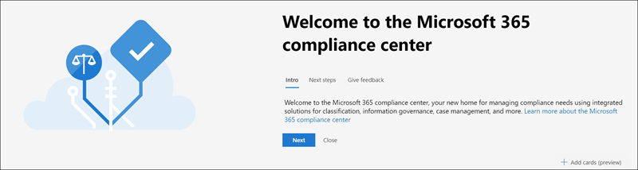
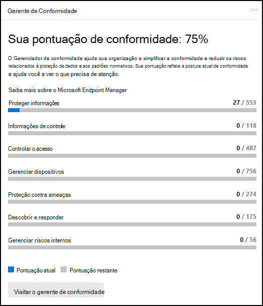
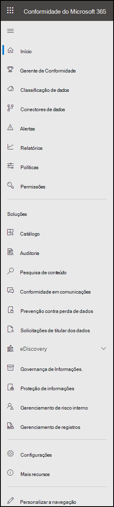

# Centro de conformidade do Microsoft 365Microsoft 365 compliance center

Se você estiver interessado na postura de conformidade da sua organização, você vai adorar o Microsoft 365 [de conformidade.](https://compliance.microsoft.com)If you're interested in your organization's compliance posture, you're going to love the [Microsoft 365 compliance center](https://compliance.microsoft.com). O Centro de conformidade do Microsoft 365 fornece fácil acesso aos dados e ferramentas que você precisa para gerenciar as necessidades de conformidade de sua organização.The Microsoft 365 compliance center provides easy access to the data and tools you need to manage to your organization's compliance needs.

Leia este artigo para conhecer o centro de conformidade [Microsoft 365,](#how-do-i-get-the-compliance-center)como obter [,](#frequently-asked-questions)perguntas frequentes e suas [próximas etapas.](#next-steps)Read this article to get acquainted with the Microsoft 365 compliance center, [how to get it](#how-do-i-get-the-compliance-center), [frequently asked questions](#frequently-asked-questions), and your [next steps](#next-steps).

## Bem-vindo Microsoft 365 conformidadeWelcome to Microsoft 365 compliance

Quando você vai para seu Microsoft 365 de conformidade pela primeira vez, é recebido com a seguinte mensagem de boas-vindas:When you go to your Microsoft 365 compliance center for the first time, you're greeted with the following welcome message:

A faixa de boas-vindas fornece algumas dicas sobre como começar, com as próximas etapas e um convite para você nos dar comentários.The welcome banner gives you some pointers on how to get started, with next steps, and an invitation for you to give us feedback.

## Seção do cartãoCard section

Quando você visita pela primeira vez o centro de conformidade do Microsoft 365, a seção de cartão na home page mostra rapidamente como sua organização está fazendo com a conformidade de dados, quais soluções estão disponíveis para sua organização e um resumo de todos os alertas ativos.When you first visit the Microsoft 365 compliance center, the card section on the home page shows you at a glance how your organization is doing with data compliance, what solutions are available for your organization, and a summary of any active alerts.

A partir daqui, você pode:From here, you can:

- Revise o cartão do Gerenciador de Conformidade da **Microsoft,** que o leva à solução [do Gerenciador de](compliance-manager.md) Conformidade.Review the **Microsoft Compliance Manager** card, which leads you to the [Compliance Manager](compliance-manager.md) solution. O Gerenciador de Conformidade ajuda a simplificar a maneira como você gerencia a conformidade.Compliance Manager helps simplify the way you manage compliance. Ele calcula uma pontuação baseada em risco que mede seu progresso em direção à conclusão de ações recomendadas que ajudam a reduzir os riscos em relação à proteção de dados e aos padrões regulatórios.It calculates a risk-based score measuring your progress toward completing recommended actions that help reduce risks around data protection and regulatory standards. Ele também fornece recursos de fluxo de trabalho e mapeamento de controle integrado para ajudá-lo a realizar ações de melhoria com eficiência.It also provides workflow capabilities and built-in control mapping to help you efficiently carry out improvement actions.

    

- Revise o novo **cartão de catálogo** de  soluções, que vincula a coleções de soluções integradas que você pode usar para ajudá-lo a gerenciar cenários de conformidade de ponta a ponta.Review the new **Solution catalog** card, which links to collections of [integrated solutions](microsoft-365-solution-catalog.md) you can use to help you manage end-to-end compliance scenarios. As capacidades e ferramentas de uma solução podem incluir uma combinação de políticas, alertas, relatórios e muito mais.A solution's capabilities and tools might include a combination of policies, alerts, reports, and more.

    

- Revise o **cartão de alertas** ativos, que inclui um resumo dos alertas mais ativos e inclui um link onde você pode exibir informações mais [detalhadas,](alert-policies.md) como Severidade, Status, Categoria e muito mais.Review the **Active alerts** card, which includes a summary of the most [active alerts](alert-policies.md) and includes a link where you can view more detailed information, such as Severity, Status, Category, and more.

    

Você também pode  usar o recurso Adicionar cartões para adicionar cartões adicionais, como um mostrando a conformidade do  aplicativo na nuvem da sua organização e outro mostrando dados sobre usuários com arquivos compartilhados, com links para Cloud App Security ou outras ferramentas onde você pode explorar dados.You can also use the **Add cards** feature to add additional cards, such as one showing your organization's cloud app compliance, and another showing data about users with shared files, with links to [Cloud App Security](/cloud-app-security/) or other tools where you can explore data.

## Navegação fácil para mais recursos e recursos de conformidadeEasy navigation to more compliance features and capabilities

Além de links em cartões na home page, você verá um painel de navegação no lado esquerdo da tela que oferece acesso fácil aos seus [alertas,](../security/office-365-security/alerts.md) [relatórios,](reports-in-security-and-compliance.md) [políticas,](alert-policies.md)soluções de conformidade e muito mais.In addition to links in cards on the home page, you'll see a navigation pane on the left side of the screen that gives you easy access to your [alerts](../security/office-365-security/alerts.md), [reports](reports-in-security-and-compliance.md), [policies](alert-policies.md), compliance solutions, and more. Para adicionar ou remover opções para um painel de navegação personalizado, use o **controle de** navegação Personalizar no painel de navegação.To add or remove options for a customized navigation pane, use the **Customize navigation** control on the navigation pane. Isso abre **as configurações Personalizar seu painel** de navegação para que você possa configurar quais itens aparecem no painel de navegação.This opens the **Customize your navigation pane** settings so you can configure which items appear in the navigation pane.

|  |  |
|---------|---------|
|  | Selecione **Home** para retornar à página principal Microsoft 365 centro de conformidade.Select **Home** to return to the Microsoft 365 compliance center main page.   Visite **o Gerenciador de Conformidade** para verificar sua pontuação de conformidade e começar a gerenciar a [conformidade](compliance-manager.md) para sua organização.Visit **Compliance Manager** to check your compliance score and start [managing compliance](compliance-manager.md) for your organization.    Selecione a **seção Classificação de** dados para acessar [classificadores](classifier-learn-about.md)treináveis, definições de entidade de tipo de informação confidenciais, exploradores de conteúdo [e](data-classification-activity-explorer.md) atividades.Select the **Data classification** section to access [trainable classifiers](classifier-learn-about.md), [Sensitive information type entity definitions](sensitive-information-type-entity-definitions.md), content and [activity](data-classification-activity-explorer.md) explorers.    Selecione **Conectores de dados** para configurar [conectores para](archiving-third-party-data.md) importar e arquivar dados em sua Microsoft 365 assinatura.Select **Data connectors** to [configure connectors](archiving-third-party-data.md) to import and archive data in your Microsoft 365 subscription.    Vá para **Alertas para** exibir e resolver [alertas](alert-policies.md)Go to **Alerts** to view and resolve [alerts](alert-policies.md)   Visite **Relatórios para** exibir dados sobre o uso e retenção de rótulos, a política DLP corresponde e [substitui,](/cloud-app-security/file-filters)arquivos [compartilhados,](view-the-dlp-reports.md)aplicativos de terceiros em [uso](/cloud-app-security/discovered-apps)e muito mais.Visit **Reports** to view data about [label usage and retention](sensitivity-labels.md), [DLP policy matches and overrides](view-the-dlp-reports.md), [shared files](/cloud-app-security/file-filters), [third-party apps in use](/cloud-app-security/discovered-apps), and more.    Acesse **Políticas para** configurar políticas para controlar dados, gerenciar dispositivos e receber [alertas.](../security/office-365-security/alerts.md)Go to **Policies** to set up policies to govern data, manage devices, and receive [alerts](../security/office-365-security/alerts.md). Você também pode acessar suas políticas de retenção [e](retention.md) [DLP.](dlp-learn-about-dlp.md)You can also access your [DLP](dlp-learn-about-dlp.md) and [retention](retention.md) policies.   Selecione **Permissões para** gerenciar quem na sua organização tem acesso ao centro de conformidade Microsoft 365 para exibir conteúdo e realizar tarefas.Select **Permissions** to manage who in your organization has access to the Microsoft 365 compliance center to view content and complete tasks.    Use os links na seção **Soluções** para acessar as soluções de conformidade da sua organização.Use the links in the **Solutions** section to access your organization's compliance solutions. Entre eles:These include:    [CatálogoCatalog](microsoft-365-solution-catalog.md)   Descubra, aprenda e comece a usar as soluções inteligentes de gerenciamento de riscos e conformidade disponíveis para sua organização.Discover, learn about, and start using the intelligent compliance and risk management solutions available to your organization.    [AuditoriaAudit](search-the-audit-log-in-security-and-compliance.md)   Use o log de auditoria para investigar problemas comuns de suporte e conformidade.Use the Audit log to investigate common support and compliance issues.    [Pesquisa de conteúdoContent search](search-for-content.md)   Use a pesquisa de conteúdo para encontrar rapidamente emails Exchange caixas de correio, documentos em sites SharePoint e OneDrive locais e conversas de mensagens instantâneas em Microsoft Teams e Skype for Business.Use Content search to quickly find email in Exchange mailboxes, documents in SharePoint sites and OneDrive locations, and instant messaging conversations in Microsoft Teams and Skype for Business.    [Conformidade em comunicaçõesCommunication compliance](communication-compliance.md)   Minimize os riscos de comunicação capturando automaticamente mensagens inadequadas, investigando possíveis violações de política e tomando medidas para correção.Minimize communication risks by automatically capturing inappropriate messages, investigating possible policy violations, and taking steps to remediate.    [Saiba mais sobre a prevenção contra perda de dados do ponto de extremidadeLearn about data loss prevention](dlp-learn-about-dlp.md)   Detecte conteúdos confidenciais como ele é usado e compartilhado em toda a sua organização, na nuvem e em dispositivos, e ajuda a evitar a perda acidental de dados.Detect sensitive content as it's used and shared throughout your organization, in the cloud and on devices, and helps prevent accidental data loss.    [Solicitações de entidades de dadosData subject requests](/compliance/regulatory/gdpr-manage-gdpr-data-subject-requests-with-the-dsr-case-tool)   Encontre e exporte os dados pessoais de um usuário para ajudá-lo a responder a solicitações de assunto de dados para o RGPD (Regulamento Geral de Proteção de Dados).Find and export a user's personal data to help you respond to data subject requests for the General Data Protection Regulation (GDPR).    [Descoberta eletrônicaeDiscovery](overview-ediscovery-20.md)   Expanda esta seção para usar o núcleo e Advanced eDiscovery para preservar, coletar, revisar, analisar e exportar conteúdo que responde às investigações internas e externas da sua organização.Expand this section to use the core and Advanced eDiscovery for preserving, collecting, reviewing, analyzing, and exporting content that's responsive to your organization's internal and external investigations.    [Governança de informaçõesInformation governance](manage-information-governance.md)   Gerencie seu ciclo de vida de conteúdo usando recursos para importar, armazenar e classificar dados críticos para os negócios para que você possa manter o que precisa e excluir o que não precisa.Manage your content lifecycle using features to import, store, and classify business-critical data so you can keep what you need and delete what you don't.    [Proteção de informaçõesInformation protection](information-protection.md)   Descubra, classifique e proteja conteúdos confidenciais e críticos para os negócios em todo o ciclo de vida em toda a sua organização.Discover, classify, and protect sensitive and business-critical content throughout its lifecycle across your organization.    [Gerenciamento de risco internoInsider risk management](insider-risk-management.md)   Detecte atividades arriscadas em toda a sua organização para ajudá-lo a identificar, investigar e tomar medidas sobre riscos e ameaças insider.Detect risky activity across your organization to help you quickly identify, investigate, and take action on insider risks and threats.    [Gerenciamento de registrosRecords management](records-management.md)   Automatize e simplifique o cronograma de retenção para registros regulatórios, legais e críticos para os negócios em sua organização.Automate and simplify the retention schedule for regulatory, legal and business-critical records in your organization.

## Como faço para obter o centro de conformidade?How do I get the compliance center?

- Se você ainda não tiver o novo Microsoft 365 de conformidade, você o terá em breve.If you don't have the new Microsoft 365 compliance center already, you'll have it soon. O Microsoft 365 de conformidade geralmente está disponível agora para Microsoft 365 clientes SKU.The Microsoft 365 compliance center is generally available now to Microsoft 365 SKU customers.

- Para visitar o Microsoft 365 de conformidade, como administrador global, administrador de conformidade ou administrador de dados de conformidade, entre [https://compliance.microsoft.com](https://compliance.microsoft.com) e entre.To visit the Microsoft 365 compliance center, as a global administrator, compliance administrator, or compliance data administrator go to [https://compliance.microsoft.com](https://compliance.microsoft.com) and sign in.

## Perguntas frequentesFrequently asked questions

**Por que sou levado para o Centro de Conformidade & segurança para concluir algumas tarefas, como a definição de determinadas políticas?****Why am I taken to the Security & Compliance Center to complete some tasks, such as defining certain policies?**

Ainda estamos desenvolvendo o Microsoft 365 de conformidade e adicionamos mais funcionalidades e soluções nos próximos meses.We're still developing the Microsoft 365 compliance center, and we add more functionality and solutions over the coming months. Entretanto, há algumas tarefas que devem ser concluídas no Centro de Conformidade e Segurança ([https://protection.office.com](https://protection.office.com)).In the meantime, there are a few tasks that must be completed in the Security & Compliance Center ([https://protection.office.com](https://protection.office.com)). Nesses casos, você será direcionado automaticamente para o local onde poderá concluir a tarefa em mãos, como criar ou editar uma política de supervisão.In those cases, you'll be directed automatically to the location where you can complete the task at hand, such as creating or editing a supervision policy.

**Por que ainda não vejo o novo Microsoft 365 de conformidade?****Why don't I see the new Microsoft 365 compliance center yet?**

Primeiro, certifique-se de ter as licenças e permissões apropriadas.First, make sure that you have the appropriate licenses and permissions. Em seguida, entre em [https://compliance.microsoft.com](https://compliance.microsoft.com) .Then, sign in at [https://compliance.microsoft.com](https://compliance.microsoft.com). Se você ainda não vir o novo centro de conformidade, você o terá em breve.If you don't see the new compliance center yet, you'll have it soon.

**Alguns dos meus recursos de conformidade não estão disponíveis no Microsoft 365 de conformidade. O que faço?****Some of my compliance features aren't available in the Microsoft 365 compliance center. What do I do?**

Ainda estamos adicionando funcionalidade ao Microsoft 365 de conformidade.We're still adding functionality to the Microsoft 365 compliance center. Se você não conseguir encontrar algo, como a pesquisa de log de auditoria, use o Centro de Conformidade & Segurança ( [https://protection.office.com](https://protection.office.com) ).If you can't find something, such as audit log search, use the Security & Compliance Center ([https://protection.office.com](https://protection.office.com)). Suas configurações são salvas no Centro de Conformidade & Segurança e no novo centro de conformidade Microsoft 365 de segurança automaticamente.Your configurations are saved in both the existing Security & Compliance Center and in the new Microsoft 365 compliance center automatically.

Para ir até lá, no centro de conformidade do Microsoft 365, no painel de navegação no lado esquerdo da tela, escolha Mais recursos **e,** em Office 365 **Centro** de Conformidade & Segurança, escolha **Abrir**.To go there, in the Microsoft 365 compliance center, in the navigation pane on the left side of the screen, choose **More resources**, and then, under **Office 365 Security & Compliance Center**, choose **Open**.

## Próximas etapasNext steps

- **Visite o Microsoft Compliance Manager** para ver sua pontuação de conformidade e começar a gerenciar a conformidade para sua organização.**Visit Microsoft Compliance Manager** to see your compliance score and start managing compliance for your organization. Para saber mais, confira [Gerenciador de Conformidade](compliance-manager.md).To learn more, see [Compliance Manager](compliance-manager.md).

- **Configure políticas de gerenciamento de** riscos internos para ajudar a minimizar riscos internos e permitir que você detecte, investigue e tome medidas para atividades arriscadas em sua organização.**Configure insider risk management policies** to help minimize internal risks and enable you to detect, investigate, and take action for risky activities in your organization. Consulte [Insider risk management](insider-risk-management.md).See [Insider risk management](insider-risk-management.md).

- **Revise as políticas de prevenção** contra perda de dados da sua organização e faça as alterações necessárias conforme necessário.**Review your organization's data loss prevention policies** and make required changes as necessary. Para saber mais sobre, confira [Saiba mais sobre prevenção contra perda de dados.](dlp-learn-about-dlp.md)To learn more about, see [Learn about data loss prevention](dlp-learn-about-dlp.md).

- **Familiarizar-se com e configurar Microsoft Cloud App Security**.**Get acquainted with and set up Microsoft Cloud App Security**. Consulte [Início rápido: começar com Microsoft Cloud App Security](/cloud-app-security/getting-started-with-cloud-app-security).See [Quickstart: Get started with Microsoft Cloud App Security](/cloud-app-security/getting-started-with-cloud-app-security).

- **Saiba mais sobre e crie políticas de conformidade de** comunicação para identificar e remediar rapidamente violações de política de código de conduta corporativas.**Learn about and create communication compliance policies** to quickly identify and remediate corporate code-of-conduct policy violations. Consulte [Conformidade de comunicação em Microsoft 365](communication-compliance.md).See [Communication compliance in Microsoft 365](communication-compliance.md).

- **Visite seu Microsoft 365 de conformidade** com frequência e revise todos os alertas ou possíveis riscos que surgirem.**Visit your Microsoft 365 compliance center often**, and make sure to review any alerts or potential risks that arise. Vá para [https://compliance.microsoft.com](https://compliance.microsoft.com) e entre.Go to [https://compliance.microsoft.com](https://compliance.microsoft.com) and sign in.