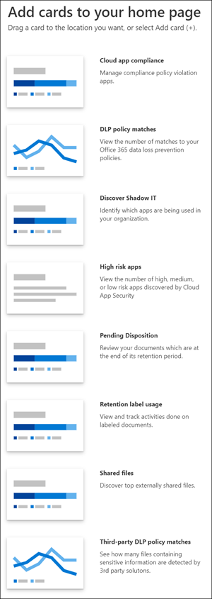

# Visão geral do centro de conformidade da Microsoft 365

## Visão Geral

Se você estiver interessado na postura de conformidade da sua organização, você vai adorar o [centro de conformidade da Microsoft 365](https://compliance.microsoft.com). O centro de conformidade da Microsoft 365 fornece acesso fácil aos dados e ferramentas que você precisa gerenciar para as necessidades de conformidade da sua organização.

Leia este artigo para familiarizar-se com o centro de conformidade da Microsoft 365, [como obtê-lo](#how-do-i-get-the-compliance-center), [perguntas frequentes](#frequently-asked-questions)e suas [próximas etapas](#next-steps).

## Bem-vindo à conformidade do Microsoft 365

Ao ir para o centro de conformidade da Microsoft 365 pela primeira vez, você será saudado com a seguinte mensagem de boas-vindas:

O banner de boas-vindas fornece algumas dicas sobre como começar, com as próximas etapas e um convite para você nos enviar seus comentários.

## Seção do cartão

Quando você visita o centro de conformidade da Microsoft 365 pela primeira vez, a seção cartão na Home Page mostra rapidamente como sua organização está fazendo a conformidade dos dados, quais soluções estão disponíveis para sua organização e um resumo de todos os alertas ativos.

A partir daqui, você pode:

- Revise o cartão de **Pontuação de conformidade da Microsoft** , que o levará para a nova solução de Pontuação de [conformidade](compliance-score.md) . Ele calcula uma pontuação baseada em risco que mede seu progresso para concluir as ações recomendadas que ajudam a reduzir os riscos relacionados à proteção de dados e aos padrões normativos. Ele também fornece recursos de fluxo de trabalho e mapeamento de controle interno para ajudá-lo a realizar as ações com eficiência.

    

- Revise o novo cartão de **Catálogo de soluções** , que vincula a conjuntos de [soluções integradas](microsoft-365-solution-catalog.md) que você pode usar para ajudá-lo a gerenciar cenários de conformidade de ponta a ponta. As ferramentas e os recursos de uma solução podem incluir uma combinação de políticas, alertas, relatórios e muito mais.

    

- Revise o cartão de **alertas ativos** , que inclui um resumo dos [alertas mais ativos](alert-policies.md) e inclui um link onde você pode exibir informações mais detalhadas, como gravidade, status, categoria e muito mais.

    

Você também pode usar o recurso **Adicionar cartões** para adicionar outros cartões, como um mostrando a conformidade do aplicativo na nuvem da sua organização e outro mostrando dados sobre usuários com arquivos compartilhados, com links para o [Cloud app Security](https://docs.microsoft.com/cloud-app-security/) ou outras ferramentas onde você pode explorar dados.

## Navegação fácil para mais recursos e recursos de conformidade

Além de links em cartões na Home Page, você verá um painel de navegação no lado esquerdo da tela que oferece acesso fácil aos [alertas](../security/office-365-security/alerts.md), [relatórios](reports-in-security-and-compliance.md), [políticas](alert-policies.md), soluções de conformidade e muito mais.

|  |  |
|---------|---------|
|  | Selecione **Home** para retornar à página principal do centro de conformidade da Microsoft 365.    Selecione a seção **classificação de dados** para acessar [classificadores estagiários](classifier-getting-started-with.md), [tipos de informações confidenciais](what-the-sensitive-information-types-look-for.md), gerenciadores de conteúdo e [atividade](data-classification-activity-explorer.md) .    Selecione **conectores de dados** para [configurar conectores](archiving-third-party-data.md) para importar e arquivar dados em sua assinatura do Microsoft 365.    Ir para **alertas** para exibir e resolver [alertas](alert-policies.md)   Visite os **relatórios** para exibir dados sobre o [uso e a retenção de etiquetas](sensitivity-labels.md), [correspondências de política de DLP e substituições](view-the-dlp-reports.md), [arquivos compartilhados](https://docs.microsoft.com/cloud-app-security/file-filters), [aplicativos de terceiros em uso](https://docs.microsoft.com/cloud-app-security/discovered-apps)e muito mais.    Vá até **políticas** para configurar políticas para controlar dados, gerenciar dispositivos e receber [alertas](../security/office-365-security/alerts.md). Você também pode acessar suas políticas de [DLP](data-loss-prevention-policies.md) e [retenção](retention-policies.md) .   Selecione **permissões** para gerenciar quem em sua organização tem acesso ao centro de conformidade da Microsoft 365 para exibir conteúdo e tarefas completas.    Use os links na seção **soluções** para acessar as soluções de conformidade da sua organização. Entre eles:    [Catálogo](microsoft-365-solution-catalog.md)   Descubra, aprenda e comece a usar as soluções inteligentes de conformidade e gerenciamento de riscos disponíveis para sua organização.    [Faça](search-the-audit-log-in-security-and-compliance.md)   Use o log de auditoria para investigar problemas comuns de conformidade e suporte.    [Pesquisa de conteúdo](search-for-content.md)   Use a pesquisa de conteúdo para localizar rapidamente emails em caixas de correio do Exchange, documentos em sites do SharePoint e locais do OneDrive e conversas de mensagens instantâneas no Microsoft Teams e no Skype for Business.    [Conformidade em comunicações](communication-compliance.md)   Minimize os riscos de comunicação, capturando automaticamente as mensagens inadequadas, investigando possíveis violações de política e tomando medidas para corrigir.    [Investigações de dados](overview-data-investigations.md)   Pesquise em locais de conteúdo para identificar dados sigilosos, mal-intencionados ou incorretos no Microsoft 365, de modo que você possa investigar e corrigir quaisquer incidentes, como os dados derramamento.    [Proteção contra perda de dados](data-loss-prevention-policies.md)   Detectar conteúdo confidencial à medida que ele é usado e compartilhado em toda a organização, na nuvem e nos dispositivos e ajuda a evitar perda acidental de dados.    [Solicitações de entidades de dados](manage-gdpr-data-subject-requests-with-the-dsr-case-tool.md)   Encontre e exporte os dados pessoais de um usuário para ajudá-lo a responder a solicitações de entidades de dados para a regulamentação geral de proteção de dados (RGPD).    [Descoberta eletrônica](overview-ediscovery-20.md)   Expanda esta seção para usar a descoberta eletrônica básica e avançada para preservar, coletar, analisar, analisar e exportar conteúdo que responde às investigações internas e externas da sua organização.    [Governança de informações](manage-information-governance.md)   Gerencie o ciclo de vida do conteúdo usando recursos para importar, armazenar e classificar dados críticos para os negócios, para que você possa manter o que precisa e excluir o que não deseja.    [Proteção de informações](protect-information.md)   Descubra, classifique e proteja conteúdo confidencial e crítico para os negócios em todo o seu ciclo de vida em sua organização.    [Gerenciamento de risco do insider](insider-risk-management.md)   Detectar atividades arriscadas em toda a sua organização para ajudá-lo a identificar, investigar e realizar ações rapidamente sobre riscos e ameaças do insider.    [Records management](records-management.md)   Automatize e simplifique o agendamento de retenção para registros regulatórios, legais e críticos de negócios em sua organização.

## Como obtenho o centro de conformidade?

- Se você ainda não tem o novo centro de conformidade do Microsoft 365, você o terá em breve. O centro de conformidade da Microsoft 365 geralmente está disponível para os clientes do Microsoft 365 SKU.

- Para visitar o centro de conformidade da Microsoft 365, como administrador global, administrador de conformidade ou administrador de dados de [https://compliance.microsoft.com](https://compliance.microsoft.com) conformidade, acesse e entre.

## Perguntas frequentes

**Por que estou direcionado para o centro de conformidade de & de segurança do Office 365 para concluir algumas tarefas, como definir determinadas políticas?**

Ainda estamos desenvolvendo o centro de conformidade da Microsoft 365 e adicionamos mais funcionalidades e soluções nos próximos meses. Enquanto isso, há algumas tarefas que devem ser concluídas no centro de conformidade & segurança do Office 365 ([https://protection.office.com](https://protection.office.com)). Nesses casos, você será direcionado automaticamente para o local onde você pode concluir a tarefa em mãos, como criar ou editar uma política de supervisão.

**Por que não vejo o novo centro de conformidade da Microsoft 365 ainda?**

Primeiro, verifique se você tem as licenças e permissões apropriadas. Em seguida, entre em [https://compliance.microsoft.com](https://compliance.microsoft.com). Se você ainda não vir o novo centro de conformidade, você o terá em breve.

**Alguns dos meus recursos de conformidade não estão disponíveis no centro de conformidade da Microsoft 365. O que devo fazer?**

Ainda estamos adicionando funcionalidade ao centro de conformidade da Microsoft 365. Se não for possível localizar algo, como pesquisa de log de auditoria, use o centro de conformidade & segurança[https://protection.office.com](https://protection.office.com)do Office 365 (). Suas configurações são salvas no centro de conformidade & segurança do Office 365 existente e no novo centro de conformidade da Microsoft 365 automaticamente.

Para ir para lá, no centro de conformidade da Microsoft 365, no painel de navegação no lado esquerdo da tela, escolha **mais recursos**e, em centro de **conformidade & segurança do Office 365**, escolha **abrir**.

## Próximas etapas

- **Revise sua pontuação de conformidade da Microsoft** para melhorar sua pontuação de conformidade. Para saber mais, confira [Pontuação de conformidade (visualização)](compliance-score.md).

- **Configure as políticas de gerenciamento de risco do insider** para ajudar a minimizar os riscos internos e permitir que você detecte, investigue e execute ações para atividades arriscadas em sua organização. Confira [Gerenciamento de risco do insider](insider-risk-management.md).

- **Revise as políticas de prevenção de perda de dados da sua organização** e faça as alterações necessárias conforme necessário. Para saber mais sobre o, confira [visão geral das políticas de prevenção contra perda de dados](data-loss-prevention-policies.md).

- **Familiarize-se com e configure o Microsoft Cloud app Security**. Veja [início rápido: introdução ao Microsoft Cloud app Security](https://docs.microsoft.com/cloud-app-security/getting-started-with-cloud-app-security).

- **Saiba mais e crie políticas de conformidade de comunicação** para identificar e corrigir rapidamente as violações de política de código de conduta corporativo. Consulte [conformidade de comunicação no Microsoft 365](communication-compliance.md).

- **Visite o centro de conformidade da Microsoft 365 com frequência**e certifique-se de revisar todos os alertas ou possíveis riscos que surgirem. Vá para [https://compliance.microsoft.com](https://compliance.microsoft.com) e entre.