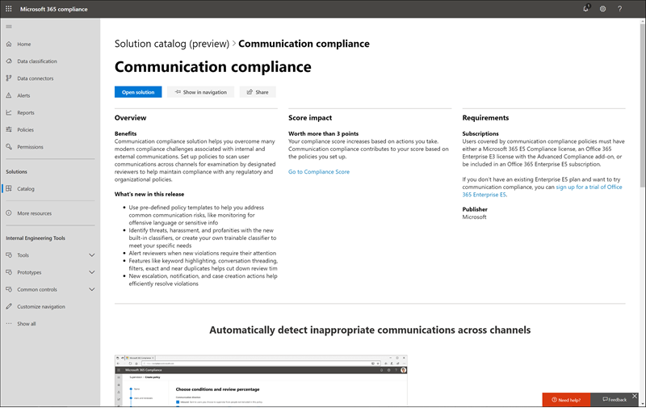

# Catálogo de soluções do Microsoft 365Microsoft 365 solution catalog

Você está procurando uma maneira de começar rapidamente com tarefas de conformidade no Microsoft 365?Are you looking for a way to quickly get started with compliance tasks in Microsoft 365? Confira o [Catálogo de soluções do Microsoft 365](https://compliance.microsoft.com/solutioncatalog) para descobrir, aprender e rapidamente começar a usar soluções de gerenciamento de riscos e conformidade.Check out the [Microsoft 365 solution catalog](https://compliance.microsoft.com/solutioncatalog) to discover, learn, and quickly get started with compliance and risk management solutions.

As soluções de conformidade no Microsoft 365 são conjuntos de recursos integrados que você pode usar para ajudá-lo a gerenciar cenários de conformidade de ponta a ponta.Compliance solutions in Microsoft 365 are collections of integrated capabilities you can use to help you manage end-to-end compliance scenarios. As ferramentas e os recursos de uma solução podem incluir uma combinação de políticas, alertas, relatórios e muito mais.A solution's capabilities and tools might include a combination of policies, alerts, reports, and more.

Leia este artigo para familiarizar-se com o novo catálogo de soluções no centro de conformidade do Microsoft 365, [como obtê-lo](#how-do-i-get-this), [perguntas frequentes](#frequently-asked-questions)e suas [próximas etapas](#next-steps).Read this article to get acquainted with the new solution catalog in the Microsoft 365 compliance center, [how to get it](#how-do-i-get-this), [frequently asked questions](#frequently-asked-questions), and your [next steps](#next-steps).

## Organização de catálogoCatalog organization

O catálogo de soluções é organizado em seções que contêm cartões de informações para cada solução de conformidade disponível na sua assinatura do Microsoft 365.The solution catalog is organized into sections that contain information cards for each compliance solution available in your Microsoft 365 subscription. Cada seção contém cartões para soluções agrupadas por área de conformidade.Each section contains cards for solutions grouped by compliance area.

Ao selecionar **Exibir** para um cartão de solução, você verá informações detalhadas sobre a solução de conformidade e como começar.When you select **View** for a solution card, you'll see detailed information about the compliance solution and how to get started. Essas informações incluem uma visão geral, requisitos de configuração, recursos de aprendizado, controles que permitem que você fixe o cartão ao painel de navegação e uma opção para compartilhar a solução como um link, email ou mensagem do Microsoft Teams.This information includes an overview, pre-configuration requirements, learning resources, controls that allow you to pin the card to the navigation pane, and an option to share the solution as a link, email, or Microsoft Teams message.

## Seção de governança de & de proteção de informaçõesInformation protection & governance section

A seção de **governança de & de proteção de informações** mostra rapidamente como você pode usar as soluções de conformidade da Microsoft 365 para proteger e controlar os dados em sua organização.The **Information protection & governance** section shows you at a glance how you can use Microsoft 365 compliance solutions to protect and govern data in your organization.

Aqui, você verá cartões para as seguintes soluções:From here, you'll see cards for the following solutions:

- [Prevenção contra perda de dados](data-loss-prevention-policies.md): detecta conteúdo confidencial conforme é usado e compartilhado em toda a sua organização, na nuvem e nos dispositivos e ajuda a evitar a perda acidental de dados.[Data loss prevention](data-loss-prevention-policies.md): Detects sensitive content as it's used and shared throughout your organization, in the cloud and on devices, and helps prevent accidental data loss.
- [Governança de informações](manage-information-governance.md): gerencia seu ciclo de vida do conteúdo usando soluções para importar, armazenar e classificar dados críticos para os negócios, para que você possa manter o que precisa e excluir o que não faz.[Information governance](manage-information-governance.md): Manages your content lifecycle using solutions to import, store, and classify business-critical data so you can keep what you need and delete what you don’t.
- [Proteção de informações](protect-information.md): descobre, classifica e protege conteúdo confidencial e crítico de negócios em todo o ciclo de vida em toda a organização.[Information protection](protect-information.md): Discovers, classifies, and protects sensitive and business-critical content throughout its lifecycle across your organization.
- [Gerenciamento de registros](records-management.md): usa a classificação inteligente para automatizar e simplificar o agendamento de retenção para registros regulatórios, legais e críticos de negócios em sua organização.[Records management](records-management.md): Uses intelligent classification to automate and simplify the retention schedule for regulatory, legal, and business-critical records in your organization.

## Seção Gerenciamento de riscos do insiderInsider risk management section

A seção de **Gerenciamento de riscos do insider** na Home Page mostra rapidamente como sua organização pode identificar, analisar e tomar medidas sobre riscos internos antes que eles causem danos.The **Insider risk management** section on the home page shows you at a glance how your organization can identify, analyze, and take action on internal risks before they cause harm.

Aqui, você verá cartões para as seguintes soluções:From here, you'll see cards for the following solutions:

- [Conformidade de Comunicação](communication-compliance.md): minimiza os riscos de comunicação ajudando você a capturar automaticamente mensagens inadequadas, investigar possíveis violações de política e tomar medidas para minimizar os danos.[Communication compliance](communication-compliance.md): Minimizes communication risks by helping you automatically capture inappropriate messages, investigate possible policy violations, and take steps to minimize harm.
- [Gerenciamento de risco do insider](insider-risk-management.md): detectar atividades arriscadas em toda a organização para ajudá-lo a identificar, investigar e realizar ações rapidamente em riscos e ameaças do insider.[Insider risk management](insider-risk-management.md): Detect risky activity across your organization to help you quickly identify, investigate, and take action on insider risks and threats.

## Seção de resposta & de descobertaDiscovery & response section

A seção **descoberta & resposta** da página inicial mostra rapidamente como sua organização pode encontrar, investigar e responder rapidamente aos problemas de conformidade com os dados relevantes.The **Discovery & response** section on the home page shows you at a glance how your organization can quickly find, investigate, and respond to compliance issues with relevant data.

Aqui, você verá cartões para as seguintes soluções:From here, you'll see cards for the following solutions:

- [Auditoria](search-the-audit-log-in-security-and-compliance.md): registra a atividade do usuário e do administrador da sua organização para que você possa Pesquisar o log de auditoria e investigar uma lista abrangente de atividades em todos os locais e serviços.[Audit](search-the-audit-log-in-security-and-compliance.md): Records user and admin activity from your organization so you can search the audit log and investigate a comprehensive list of activities across all locations and services.
- [Investigações de dados](overview-data-investigations.md): pesquisa entre locais de conteúdo para identificar dados confidenciais, mal-intencionados ou incorretos em locais do Microsoft 365, para que você possa investigar e corrigir quaisquer incidentes, como os dados derramamento.[Data investigations](overview-data-investigations.md): Searches across content locations to identify sensitive, malicious, or misplaced data across Microsoft 365 locations so you can investigate and remediate any incidents, such as data spillage.
- [Solicitações de entidades de dados](manage-gdpr-data-subject-requests-with-the-dsr-case-tool.md): localiza e exporta dados pessoais de um usuário para ajudá-lo a responder a solicitações de entidades de dados para o rgpd.[Data subject requests](manage-gdpr-data-subject-requests-with-the-dsr-case-tool.md): Finds and exports a user’s personal data to help you respond to data subject requests for GDPR.
- [Descoberta eletrônicaeDiscovery](manage-legal-investigations.md)
    - [Central de descoberta eletrônica](ediscovery-cases.md): pesquisa entre locais de conteúdo para identificar, preservar e exportar dados em resposta a solicitações de descoberta legal e casos de descoberta eletrônica.[Core eDiscovery](ediscovery-cases.md): Searches across content locations to identify, preserve, and export data in response to legal discovery requests and eDiscovery cases.
    - [Descoberta eletrônica avançada](overview-ediscovery-20.md): cria recursos de descoberta eletrônica fornecendo análises inteligentes e aprendizado de máquina para ajudá-lo a analisar os dados relevantes para solicitações de descoberta.[Advanced eDiscovery](overview-ediscovery-20.md): Builds on eDiscovery capabilities by providing intelligent analytics and  machine learning to help you further analyze data that’s relevant to discovery requests.

## Como posso obter isso?How do I get this?

Para visitar o catálogo de soluções do Microsoft 365, [https://compliance.microsoft.com](https://compliance.microsoft.com) acesse e entre como administrador global, administrador de conformidade ou administrador de dados de conformidade.To visit the Microsoft 365 solution catalog, go to [https://compliance.microsoft.com](https://compliance.microsoft.com) and sign in as a global administrator, compliance administrator, or compliance data administrator. Selecione **Catálogo** no painel de navegação no lado esquerdo da tela para abrir a home page do catálogo.Select **Catalog** in the navigation pane on the left side of the screen to open the catalog home page.

## Perguntas frequentesFrequently asked questions

**Por que não vejo o catálogo de soluções do Microsoft 365?****Why don't I see the Microsoft 365 solution catalog?**

Primeiro, verifique se você tem as licenças e permissões apropriadas.First, make sure that you have the appropriate licenses and permissions. Em seguida, entre [https://compliance.microsoft.com](https://compliance.microsoft.com) como administrador global, administrador de conformidade ou administrador de dados de conformidade.Then, sign in at [https://compliance.microsoft.com](https://compliance.microsoft.com) as a global administrator, compliance administrator, or compliance data administrator.

**Alguns dos recursos de conformidade listados na página catálogo de soluções não estão disponíveis no centro de conformidade da Microsoft 365. O que devo fazer?****Some of the compliance features listed on the solution catalog page aren't available in the Microsoft 365 compliance center. What do I do?**

Estamos sempre trabalhando para adicionar novas funcionalidades ao centro de conformidade do Microsoft 365 e ao catálogo de soluções.We're always working to add new functionality to the Microsoft 365 compliance center and the solution catalog. Se você não conseguir encontrar uma solução específica na área de navegação, ela estará acessível quando a solução estiver disponível em sua assinatura.If you can't find a specific solution in the navigation area, it will be accessible when the solution is available in your subscription.

Se você estiver procurando por uma solução de conformidade existente e ela ainda não estiver disponível no centro de conformidade da Microsoft 365, você sempre poderá acessar soluções no centro de segurança e conformidade do Office 365 existente [https://protection.office.com](https://protection.office.com), acessando.If you are looking for an existing compliance solution and it’s not available in the Microsoft 365 compliance center yet, you can always access solutions in the existing Office 365 security and compliance center by going to [https://protection.office.com](https://protection.office.com). Como alternativa, você pode clicar na guia **mais recursos** , na navegação à esquerda do centro de conformidade da Microsoft 365, e selecionar o cartão central de segurança e conformidade do Office 365.Alternatively, you can click on the **More resources** tab in the left navigation of the Microsoft 365 compliance center and select the Office 365 security and compliance center card.  

## Próximas etapasNext steps

- **Revise sua pontuação de conformidade da Microsoft**, uma pontuação personalizada e baseada em riscos para ajudá-lo a entender o estado de conformidade da sua organização com normas e padrões principais.**Review your Microsoft Compliance Score**, a personalized, risk-based score to help you understand your organization's state of compliance with key standards and regulations. Ele fornece ações recomendadas que você pode tomar para reforçar sua postura geral de conformidade e fornece recursos de fluxo de trabalho para ajudá-lo a realizar essas ações com eficiência.It provides recommended actions you can take to strengthen your overall compliance posture, and provides workflow capabilities to help you efficiently carry out those actions. Para saber mais, confira [Pontuação de conformidade (visualização)](compliance-score.md).To learn more, see [Compliance Score (preview)](compliance-score.md).

- **Configure as políticas de gerenciamento de risco do insider** para ajudar a minimizar os riscos internos e permitir que você detecte, investigue e execute ações para atividades arriscadas em sua organização.**Configure insider risk management policies** to help minimize internal risks and enable you to detect, investigate, and take action for risky activities in your organization. Confira [Gerenciamento de risco do Insider (versão prévia)](insider-risk-management.md).See [Insider risk management (preview)](insider-risk-management.md).

- **Saiba mais e crie políticas de conformidade de comunicação** para identificar e corrigir rapidamente as violações de política de código de conduta corporativo.**Learn about and create Communication compliance policies** to quickly identify and remediate corporate code-of-conduct policy violations. Consulte [conformidade de comunicação](communication-compliance.md).See [Communication compliance](communication-compliance.md).

- **Microsoft Information Protection**, saiba como a Microsoft 365 Solutions ajuda você a descobrir, classificar e proteger informações confidenciais onde elas se encontram ou viajam.**Microsoft Information Protection**, learn how Microsoft 365 solutions help you discover, classify, and protect sensitive information wherever it lives or travels.
    - **Familiarize-se com e configure o Microsoft Cloud app Security**.**Get acquainted with and set up Microsoft Cloud App Security**. Veja [início rápido: introdução ao Microsoft Cloud app Security](https://docs.microsoft.com/cloud-app-security/getting-started-with-cloud-app-security).See [Quickstart: Get started with Microsoft Cloud App Security](https://docs.microsoft.com/cloud-app-security/getting-started-with-cloud-app-security).
    - **Introdução aos classificadores**.**Get started with classifiers**. Classificar conteúdo e, em seguida, rotulá-lo para que possa ser protegido e manipulado adequadamente é o local inicial da disciplina de proteção de informações.Classifying content and then labeling it so it can be protected and handled properly is the starting place for the information protection discipline. Confira [introdução aos classificadores destreinados](classifier-getting-started-with.md).See [Getting started with trainable classifiers](classifier-getting-started-with.md).

- **Visite seu catálogo de soluções do Microsoft 365 com frequência**e Leia novas soluções para ajudá-lo com suas necessidades de conformidade.**Visit your Microsoft 365 solution catalog often**, and make sure to review new solutions to help you with your compliance needs. Entre em [https://compliance.microsoft.com](https://compliance.microsoft.com) e selecione **Catálogo** no painel de navegação esquerdo.Sign in at [https://compliance.microsoft.com](https://compliance.microsoft.com) and then select **Catalog** in the left navigation pane.
