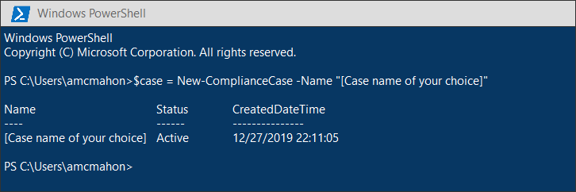

# <a name="migrate-legacy-ediscovery-searches-and-holds-to-the-microsoft-365-compliance-center"></a><span data-ttu-id="754d1-102">Migrar pesquisas de descoberta eletrônica herdadas e isenções para o centro de conformidade da Microsoft 365</span><span class="sxs-lookup"><span data-stu-id="754d1-102">Migrate legacy eDiscovery searches and holds to the Microsoft 365 compliance center</span></span>

<span data-ttu-id="754d1-103">O centro de conformidade da Microsoft 365 oferece uma experiência aprimorada para uso da descoberta eletrônica, incluindo: maior confiabilidade, melhor desempenho e vários recursos adaptados para fluxos de trabalho de descoberta eletrônica, incluindo casos para organizar seu conteúdo por questão, revisar conjuntos para Revise o conteúdo e a análise para ajudar a analisar dados para revisão, como agrupamento Near-Duplicate, encadeamento de email, análise de temas e codificação de previsão.</span><span class="sxs-lookup"><span data-stu-id="754d1-103">The Microsoft 365 compliance center provides an improved experience for eDiscovery usage, including: higher reliability, better performance and many features tailored to eDiscovery workflows including cases to organize your content by matter, review sets to review content and analytics to help cull data for review such as near-duplicate grouping, email threading, themes analysis, and predictive coding.</span></span>

<span data-ttu-id="754d1-104">Para ajudar os clientes a aproveitar as funcionalidades novas e aprimoradas, este artigo fornece orientação básica sobre como migrar pesquisas de descoberta eletrônica in-loco e bloqueios do centro de administração do Exchange para o centro de conformidade do Microsoft 365.</span><span class="sxs-lookup"><span data-stu-id="754d1-104">To help customers take advantage of the new and improved functionality, this article provides basic guidance on how to migrate In-Place eDiscovery searches and holds from the Exchange admin center to the Microsoft 365 compliance center.</span></span>

> [!NOTE]
> <span data-ttu-id="754d1-105">Como há muitos cenários diferentes, este artigo fornece orientação geral para fazer a transição de pesquisas e se comporta para uma caixa de descoberta eletrônica principal no centro de conformidade da Microsoft 365.</span><span class="sxs-lookup"><span data-stu-id="754d1-105">Because there are many different scenarios, this article provides general guidance to transition searches and holds to a core eDiscovery case in the Microsoft 365 compliance center.</span></span> <span data-ttu-id="754d1-106">O uso de casos de descoberta eletrônica nem sempre é necessário, mas eles adicionam uma camada extra de segurança, permitindo que você atribua permissões para controlar quem tem acesso aos casos de descoberta eletrônica em sua organização.</span><span class="sxs-lookup"><span data-stu-id="754d1-106">Using eDiscovery cases aren't always required, but they add an extra layer of security by letting you assign permissions to control who has access to the eDiscovery cases in your organization.</span></span>

## <a name="before-you-begin"></a><span data-ttu-id="754d1-107">Antes de começar</span><span class="sxs-lookup"><span data-stu-id="754d1-107">Before you begin</span></span>

- <span data-ttu-id="754d1-108">Você precisa ser membro do grupo de função Gerenciador de descoberta eletrônica no centro de conformidade & segurança do Office 365 para executar os comandos do PowerShell descritos neste artigo.</span><span class="sxs-lookup"><span data-stu-id="754d1-108">You have to be a member of the eDiscovery Manager role group in the Office 365 Security & Compliance Center to run the PowerShell commands described in this article.</span></span> <span data-ttu-id="754d1-109">Você também precisa ser membro do grupo de função gerenciamento de descoberta no centro de administração do Exchange.</span><span class="sxs-lookup"><span data-stu-id="754d1-109">You also have to be a member of the Discovery Management role group in the Exchange admin center.</span></span>

- <span data-ttu-id="754d1-110">Este artigo fornece orientação sobre como criar um controle de descoberta eletrônica.</span><span class="sxs-lookup"><span data-stu-id="754d1-110">This article provides guidance on how to create an eDiscovery hold.</span></span> <span data-ttu-id="754d1-111">A política de retenção será aplicada às caixas de correio por meio de um processo assíncrono.</span><span class="sxs-lookup"><span data-stu-id="754d1-111">The hold policy will be applied to mailboxes through an asynchronous process.</span></span> <span data-ttu-id="754d1-112">Ao criar um bloqueio de descoberta eletrônica, você deve criar um CaseHoldPolicy e um CaseHoldRule, caso contrário, a isenção não será criada e os locais de conteúdo não serão colocados em espera.</span><span class="sxs-lookup"><span data-stu-id="754d1-112">When creating an eDiscovery hold, you must create both a CaseHoldPolicy and CaseHoldRule, otherwise the hold will not be created and content locations will not be placed on hold.</span></span>

## <a name="step-1-connect-to-exchange-online-powershell-and-office-365-security--compliance-center-powershell"></a><span data-ttu-id="754d1-113">Etapa 1: conectar-se ao PowerShell do centro de conformidade & segurança do Exchange Online e do Office 365</span><span class="sxs-lookup"><span data-stu-id="754d1-113">Step 1: Connect to Exchange Online PowerShell and Office 365 Security & Compliance Center PowerShell</span></span>

<span data-ttu-id="754d1-114">A primeira etapa é conectar-se ao PowerShell do centro de conformidade & segurança do Exchange Online e do Office 365.</span><span class="sxs-lookup"><span data-stu-id="754d1-114">The first step is to connect to Exchange Online PowerShell and Office 365 Security & Compliance Center PowerShell.</span></span> <span data-ttu-id="754d1-115">Você pode copiar o script a seguir, colá-lo em uma janela do PowerShell e executá-lo.</span><span class="sxs-lookup"><span data-stu-id="754d1-115">You can copy the following script, paste it into a PowerShell window and then run it.</span></span> <span data-ttu-id="754d1-116">Você será solicitado a fornecer credenciais para a organização à qual você deseja se conectar.</span><span class="sxs-lookup"><span data-stu-id="754d1-116">You'll be prompted for credentials for the organization that you want to connect to.</span></span> 

```powershell
$UserCredential = Get-Credential
$sccSession = New-PSSession -ConfigurationName Microsoft.Exchange -ConnectionUri https://ps.compliance.protection.outlook.com/powershell-liveid -Credential $UserCredential -Authentication Basic -AllowRedirection
Import-PSSession $sccSession -DisableNameChecking
$exoSession = New-PSSession -ConfigurationName Microsoft.Exchange -ConnectionUri https://ps.outlook.com/powershell-liveid/ -Credential $UserCredential -Authentication Basic -AllowRedirection
Import-PSSession $exoSession -AllowClobber -DisableNameChecking
```

<span data-ttu-id="754d1-117">Você precisa executar os comandos nas etapas a seguir nesta sessão do PowerShell.</span><span class="sxs-lookup"><span data-stu-id="754d1-117">You need to run the commands in the following steps in this PowerShell session.</span></span>

## <a name="step-2-get-a-list-of-in-place-ediscovery-searches-by-using-get-mailboxsearch"></a><span data-ttu-id="754d1-118">Etapa 2: obter uma lista de pesquisas de descoberta eletrônica in-loco usando Get-MailboxSearch</span><span class="sxs-lookup"><span data-stu-id="754d1-118">Step 2: Get a list of In-Place eDiscovery searches by using Get-MailboxSearch</span></span>

<span data-ttu-id="754d1-119">Depois de autenticar, você pode obter uma lista de pesquisas de descoberta eletrônica in-loco executando o cmdlet **Get-MailboxSearch** .</span><span class="sxs-lookup"><span data-stu-id="754d1-119">After you've authenticated, you can get a list of In-Place eDiscovery searches by running the **Get-MailboxSearch** cmdlet.</span></span> <span data-ttu-id="754d1-120">Copie e cole o seguinte comando no PowerShell e execute-o.</span><span class="sxs-lookup"><span data-stu-id="754d1-120">Copy and paste the following command into PowerShell and then run it.</span></span> <span data-ttu-id="754d1-121">Uma lista de pesquisas será listada com seus nomes e o status de qualquer bloqueio in-loco.</span><span class="sxs-lookup"><span data-stu-id="754d1-121">A list of searches will be listed with their names and the status of any In-Place Holds.</span></span>

```powershell
Get-MailboxSearch
```

<span data-ttu-id="754d1-122">A saída do cmdlet será semelhante à seguinte:</span><span class="sxs-lookup"><span data-stu-id="754d1-122">The cmdlet output will be similar to the following:</span></span>


## <a name="step-3-get-information-about-the-in-place-ediscovery-searches-and-in-place-holds-you-want-to-migrate"></a><span data-ttu-id="754d1-124">Etapa 3: obter informações sobre as pesquisas de descoberta eletrônica in-loco e bloqueios in-loco que você deseja migrar</span><span class="sxs-lookup"><span data-stu-id="754d1-124">Step 3: Get information about the In-Place eDiscovery searches and In-Place Holds you want to migrate</span></span>

<span data-ttu-id="754d1-125">Novamente, você usará o cmdlet **Get-MailboxSearch** , mas desta vez para obter as propriedades da pesquisa.</span><span class="sxs-lookup"><span data-stu-id="754d1-125">Again you will use the **Get-MailboxSearch** cmdlet, but this time to get the properties of the search.</span></span> <span data-ttu-id="754d1-126">Você pode armazenar essas propriedades em uma variável para uso posterior.</span><span class="sxs-lookup"><span data-stu-id="754d1-126">You can store these properties in a variable for use later.</span></span> <span data-ttu-id="754d1-127">O exemplo a seguir armazena os resultados do cmdlet **Get-MailboxSearch** em uma variável e, em seguida, exibe as propriedades da pesquisa.</span><span class="sxs-lookup"><span data-stu-id="754d1-127">The following example stores the results of the **Get-MailboxSearch** cmdlet in a variable and then displays the properties of the search.</span></span>

```powershell
$search = Get-MailboxSearch -Identity "Search 1"
```

```powershell
$search | FL
```

<span data-ttu-id="754d1-128">A saída desses dois comandos será semelhante à seguinte:</span><span class="sxs-lookup"><span data-stu-id="754d1-128">The output of these two commands will be similar to the following:</span></span>


> [!NOTE]
> <span data-ttu-id="754d1-130">A duração do bloqueio in-loco neste exemplo está indefinida (*ItemHoldPeriod: Unlimited*).</span><span class="sxs-lookup"><span data-stu-id="754d1-130">The duration of the In-Place Hold in this example is indefinite (*ItemHoldPeriod: Unlimited*).</span></span> <span data-ttu-id="754d1-131">Isso é típico para cenários de descoberta eletrônica e investigação legal.</span><span class="sxs-lookup"><span data-stu-id="754d1-131">This is typical for eDiscovery and legal investigation scenarios.</span></span> <span data-ttu-id="754d1-132">Se a duração da retenção tiver um valor diferente de indefinido, o motivo provavelmente será que a retenção está sendo usada para reter o conteúdo em um cenário de retenção.</span><span class="sxs-lookup"><span data-stu-id="754d1-132">If the hold duration has is different value than indefinite, the reason is likely because the hold is being used to retain content in a retention scenario.</span></span> <span data-ttu-id="754d1-133">Em vez de usar os cmdlets de descoberta eletrônica no PowerShell do centro de conformidade & segurança do Office 365 para cenários de retenção, recomendamos que você use [New-RetentionCompliancePolicy](https://docs.microsoft.com/powershell/module/exchange/policy-and-compliance-retention/new-retentioncompliancepolicy) e [New-RetentionComplianceRule](https://docs.microsoft.com/powershell/module/exchange/policy-and-compliance-retention/new-retentioncompliancerule) para reter conteúdo.</span><span class="sxs-lookup"><span data-stu-id="754d1-133">Instead of using the eDiscovery cmdlets in Office 365 Security & Compliance Center PowerShell for retention scenarios, we recommend that you use [New-RetentionCompliancePolicy](https://docs.microsoft.com/powershell/module/exchange/policy-and-compliance-retention/new-retentioncompliancepolicy) and [New-RetentionComplianceRule](https://docs.microsoft.com/powershell/module/exchange/policy-and-compliance-retention/new-retentioncompliancerule) to retain content.</span></span> <span data-ttu-id="754d1-134">O resultado do uso desses cmdlets será semelhante ao uso de **New-CaseHoldPolicy** e **New-CaseHoldRule**, mas você poderá especificar um período de retenção e uma ação de retenção, como excluir o conteúdo depois que o período de retenção expirar.</span><span class="sxs-lookup"><span data-stu-id="754d1-134">The result of using these cmdlets will be similar to using **New-CaseHoldPolicy** and **New-CaseHoldRule**, but you'll able to specify a retention period and a retention action, such as deleting content after the retention period expires.</span></span> <span data-ttu-id="754d1-135">Além disso, usar os cmdlets de retenção não exige que você associe o bloqueio de retenção a uma ocorrência de descoberta eletrônica.</span><span class="sxs-lookup"><span data-stu-id="754d1-135">Also, using the retention cmdlets don't require you to associate the retention holds with an eDiscovery case.</span></span>

## <a name="step-4-create-a-case-in-the-microsoft-365-compliance-center"></a><span data-ttu-id="754d1-136">Etapa 4: criar um caso no centro de conformidade da Microsoft 365</span><span class="sxs-lookup"><span data-stu-id="754d1-136">Step 4: Create a case in the Microsoft 365 Compliance center</span></span>

<span data-ttu-id="754d1-137">Para criar um bloqueio de descoberta eletrônica, você precisa criar uma ocorrência de descoberta eletrônica para associar a isenção.</span><span class="sxs-lookup"><span data-stu-id="754d1-137">To create an eDiscovery hold, you have to create an eDiscovery case to associate the hold with.</span></span> <span data-ttu-id="754d1-138">O exemplo a seguir cria uma ocorrência de descoberta eletrônica usando um nome de sua escolha.</span><span class="sxs-lookup"><span data-stu-id="754d1-138">The following example creates an eDiscovery case using a name of your choice.</span></span> <span data-ttu-id="754d1-139">Armazenaremos as propriedades do novo caso em uma variável para uso posterior.</span><span class="sxs-lookup"><span data-stu-id="754d1-139">We will store the properties of the new case in a variable for use later.</span></span> <span data-ttu-id="754d1-140">Você pode exibir essas propriedades executando o `$case | FL` comando após criar o caso.</span><span class="sxs-lookup"><span data-stu-id="754d1-140">You can view those properties by running the `$case | FL` command after you create the case.</span></span>

```powershell
$case = New-ComplianceCase -Name "[Case name of your choice]"
```


## <a name="step-5-create-the-ediscovery-hold"></a><span data-ttu-id="754d1-142">Etapa 5: criar o bloqueio de descoberta eletrônica</span><span class="sxs-lookup"><span data-stu-id="754d1-142">Step 5: Create the eDiscovery hold</span></span>

<span data-ttu-id="754d1-143">Depois que o caso é criado, você pode criar a isenção e associá-la ao caso que você criou na etapa anterior.</span><span class="sxs-lookup"><span data-stu-id="754d1-143">After the case is created, you can create the hold and associate it with the case that you created in the previous step.</span></span> <span data-ttu-id="754d1-144">É importante lembrar que você deve criar uma política de bloqueio de caso e uma regra de bloqueio de caso.</span><span class="sxs-lookup"><span data-stu-id="754d1-144">It's important to remember that you must create both a case hold policy and a case hold rule.</span></span> <span data-ttu-id="754d1-145">Se a regra de bloqueio de caso não for criada após a criação da política de retenção de caso, a descoberta eletrônica não será criada e qualquer conteúdo não será colocado em espera.</span><span class="sxs-lookup"><span data-stu-id="754d1-145">If the case hold rule isn't created after you created case hold policy, the eDiscovery hold will not be created and any content won't be placed on hold.</span></span>

<span data-ttu-id="754d1-146">Execute os comandos a seguir para recriar a descoberta eletrônica suspensa que você deseja migrar.</span><span class="sxs-lookup"><span data-stu-id="754d1-146">Run the following commands to re-create the eDiscovery hold that you want to migrate.</span></span> <span data-ttu-id="754d1-147">Estes exemplos usam as propriedades de bloqueio in-loco da etapa 3 que você deseja migrar.</span><span class="sxs-lookup"><span data-stu-id="754d1-147">These examples use the properties from In-Place Hold from Step 3 that you want to migrate.</span></span> <span data-ttu-id="754d1-148">O primeiro comando cria uma nova política de bloqueio de caso e salva as propriedades em uma variável.</span><span class="sxs-lookup"><span data-stu-id="754d1-148">The first command creates a new case hold policy and saves the properties to a variable.</span></span> <span data-ttu-id="754d1-149">O segundo comando cria a regra de bloqueio de caso correspondente.</span><span class="sxs-lookup"><span data-stu-id="754d1-149">The second command creates the corresponding case hold rule.</span></span>

```powershell
$policy = New-CaseHoldPolicy -Name $search.Name -Case $case.Identity -ExchangeLocation $search.SourceMailboxes
```

```powershell
New-CaseHoldRule -Name $search.Name -Policy $policy.Identity
```


## <a name="step-6-verify-the-ediscovery-hold"></a><span data-ttu-id="754d1-151">Etapa 6: verificar a retenção de descoberta eletrônica</span><span class="sxs-lookup"><span data-stu-id="754d1-151">Step 6: Verify the eDiscovery hold</span></span>

<span data-ttu-id="754d1-152">Para garantir que não houve problemas na criação da isenção, é bom verificar se o status da distribuição de retenção foi bem-sucedido.</span><span class="sxs-lookup"><span data-stu-id="754d1-152">To make sure there were no issues in creating the hold, it's good to check that the hold distribution status is successful.</span></span> <span data-ttu-id="754d1-153">Distribuição significa que a retenção foi aplicada a todos os locais de conteúdo especificados no parâmetro *ExchangeLocation* na etapa anterior.</span><span class="sxs-lookup"><span data-stu-id="754d1-153">Distribution means that the hold has been applied to all the content locations specified in the *ExchangeLocation* parameter in the previous step.</span></span> <span data-ttu-id="754d1-154">Para fazer isso, você pode executar o cmdlet **Get-CaseHoldPolicy** .</span><span class="sxs-lookup"><span data-stu-id="754d1-154">To do this, you can run the **Get-CaseHoldPolicy** cmdlet.</span></span> <span data-ttu-id="754d1-155">Como as propriedades salvas na variável *$Policy* que você criou na etapa anterior não são atualizadas automaticamente na variável, é necessário executar novamente o cmdlet para verificar se a distribuição foi bem-sucedida.</span><span class="sxs-lookup"><span data-stu-id="754d1-155">Because the properties saved to the *$policy* variable that you created in the previous step aren't automatically updated in the variable, you need to rerun the cmdlet to verify that distribution is successful.</span></span> <span data-ttu-id="754d1-156">Pode levar entre 5 minutos e 24 horas para que as políticas de bloqueio de caso sejam distribuídas com êxito.</span><span class="sxs-lookup"><span data-stu-id="754d1-156">It can take between 5 minutes and 24 hours for case hold policies to be successfully distributed.</span></span>

<span data-ttu-id="754d1-157">Execute o seguinte comando para verificar se a descoberta eletrônica foi distribuída com êxito.</span><span class="sxs-lookup"><span data-stu-id="754d1-157">Run the following command to verify that the eDiscovery hold has been successfully distributed.</span></span>

```powershell
Get-CaseHoldPolicy -Identity $policy.Identity | Select name, DistributionStatus
```

<span data-ttu-id="754d1-158">O valor de **Success** para a propriedade *DistributionStatus* indica que a retenção foi colocada com êxito nos locais de conteúdo.</span><span class="sxs-lookup"><span data-stu-id="754d1-158">The value of **Success** for the *DistributionStatus* property indicates the hold was successfully placed on the content locations.</span></span> <span data-ttu-id="754d1-159">Se a distribuição ainda não estiver concluída, um valor de **Pending** será exibido.</span><span class="sxs-lookup"><span data-stu-id="754d1-159">If the distribution is not yet complete, a value of **Pending** is displayed.</span></span>


## <a name="step-7-create-the-search"></a><span data-ttu-id="754d1-161">Etapa 7: criar a pesquisa</span><span class="sxs-lookup"><span data-stu-id="754d1-161">Step 7: Create the search</span></span>

<span data-ttu-id="754d1-162">A última etapa é recriar a pesquisa que você identificou na etapa 3 e associá-la ao caso.</span><span class="sxs-lookup"><span data-stu-id="754d1-162">The last step is to re-create the search that you identified in Step 3 and associate it with the case.</span></span> <span data-ttu-id="754d1-163">Após criar a pesquisa, você poderá executá-la usando o cmdlet **Start-ComplianceSearch** ou executar mais tarde.</span><span class="sxs-lookup"><span data-stu-id="754d1-163">After you create the search, you can run it by using the **Start-ComplianceSearch** cmdlet or run at a later time.</span></span>

```powershell
New-ComplianceSearch -Name $search.Name -ExchangeLocation $search.SourceMailboxes -ContentMatchQuery $search.SearchQuery -Case $case.name
```


## <a name="step-8-verify-the-case-hold-and-search-in-the-microsoft-365-compliance-center"></a><span data-ttu-id="754d1-165">Etapa 8: verificar a ocorrência, a retenção e a pesquisa no centro de conformidade da Microsoft 365</span><span class="sxs-lookup"><span data-stu-id="754d1-165">Step 8: Verify the case, hold, and search in the Microsoft 365 compliance center</span></span>

<span data-ttu-id="754d1-166">Para certificar-se de que tudo está configurado corretamente, vá para o centro de conformidade da [https://compliance.microsoft.com](https://compliance.microsoft.com)Microsoft 365 em e clique em **descoberta eletrônica > Core**.</span><span class="sxs-lookup"><span data-stu-id="754d1-166">To make sure that everything is set up correctly, go to the Microsoft 365 compliance center at [https://compliance.microsoft.com](https://compliance.microsoft.com), and click **eDiscovery > Core**.</span></span>


<span data-ttu-id="754d1-168">O caso que você criou na etapa 3 está listado na página de **descoberta eletrônica principal** .</span><span class="sxs-lookup"><span data-stu-id="754d1-168">The case that you created in Step 3 is listed on the **Core eDiscovery** page.</span></span> <span data-ttu-id="754d1-169">Abra o caso e, em seguida, observe a suspensão que você criou na etapa 4, listada na guia **isenções** . Você pode clicar na isenção para ver os detalhes, incluindo o número de caixas de correio em que a retenção é aplicada e o status da distribuição.</span><span class="sxs-lookup"><span data-stu-id="754d1-169">Open the case and then notice the hold that you created in Step 4 in listed on the **Holds** tab. You can click the hold to see details, including the number of mailboxes the hold is applied to and the distribution status.</span></span>


<span data-ttu-id="754d1-171">A pesquisa criada na etapa 7 está listada na guia **pesquisas** da ocorrência de descoberta eletrônica.</span><span class="sxs-lookup"><span data-stu-id="754d1-171">The search that you created in Step 7 is listed on the listed on the **Searches** tab of the eDiscovery case.</span></span>


<span data-ttu-id="754d1-173">Se você migrar uma pesquisa de descoberta eletrônica in-loco, mas não associá-la a uma ocorrência de descoberta eletrônica, ela será listada na página de pesquisa de conteúdo no centro de conformidade da Microsoft 365.</span><span class="sxs-lookup"><span data-stu-id="754d1-173">If you migrate an In-Place eDiscovery search but don't associate it with an eDiscovery case, it will be listed on the Content search page in the Microsoft 365 compliance center.</span></span>

## <a name="more-information"></a><span data-ttu-id="754d1-174">Mais informações</span><span class="sxs-lookup"><span data-stu-id="754d1-174">More information</span></span>

- <span data-ttu-id="754d1-175">Para obter mais informações sobre descoberta eletrônica in-loco & bloqueios no centro de administração do Exchange, consulte:</span><span class="sxs-lookup"><span data-stu-id="754d1-175">For more information about In-Place eDiscovery & Holds in the Exchange admin center, see:</span></span>
  
  - [<span data-ttu-id="754d1-176">Descoberta Eletrônica In-loco</span><span class="sxs-lookup"><span data-stu-id="754d1-176">In-Place eDiscovery</span></span>](https://docs.microsoft.com/exchange/security-and-compliance/in-place-ediscovery/in-place-ediscovery)

  - [<span data-ttu-id="754d1-177">Bloqueio In-loco e Retenção de Litígio</span><span class="sxs-lookup"><span data-stu-id="754d1-177">In-Place Hold and Litigation Hold</span></span>](https://docs.microsoft.com/exchange/security-and-compliance/in-place-and-litigation-holds)

- <span data-ttu-id="754d1-178">Para obter mais informações sobre os cmdlets do PowerShell usados no artigo, consulte:</span><span class="sxs-lookup"><span data-stu-id="754d1-178">For more information about the PowerShell cmdlets used in the article, see:</span></span>

  - [<span data-ttu-id="754d1-179">Get-MailboxSearch</span><span class="sxs-lookup"><span data-stu-id="754d1-179">Get-MailboxSearch</span></span>](https://docs.microsoft.com/powershell/module/exchange/policy-and-compliance-content-search/get-mailboxsearch)
  
  - [<span data-ttu-id="754d1-180">New-ComplianceCase</span><span class="sxs-lookup"><span data-stu-id="754d1-180">New-ComplianceCase</span></span>](https://docs.microsoft.com/powershell/module/exchange/policy-and-compliance-ediscovery/new-compliancecase)

  - [<span data-ttu-id="754d1-181">New-CaseHoldPolicy</span><span class="sxs-lookup"><span data-stu-id="754d1-181">New-CaseHoldPolicy</span></span>](https://docs.microsoft.com/powershell/module/exchange/policy-and-compliance-ediscovery/new-caseholdpolicy)
  
  - [<span data-ttu-id="754d1-182">New-CaseHoldRule</span><span class="sxs-lookup"><span data-stu-id="754d1-182">New-CaseHoldRule</span></span>](https://docs.microsoft.com/powershell/module/exchange/policy-and-compliance-ediscovery/new-caseholdrule)

  - [<span data-ttu-id="754d1-183">Get-CaseHoldPolicy</span><span class="sxs-lookup"><span data-stu-id="754d1-183">Get-CaseHoldPolicy</span></span>](https://docs.microsoft.com/powershell/module/exchange/policy-and-compliance-ediscovery/get-caseholdpolicy)
  
  - [<span data-ttu-id="754d1-184">New-ComplianceSearch</span><span class="sxs-lookup"><span data-stu-id="754d1-184">New-ComplianceSearch</span></span>](https://docs.microsoft.com/powershell/module/exchange/policy-and-compliance-content-search/new-compliancesearch)

  - [<span data-ttu-id="754d1-185">Start-ComplianceSearch</span><span class="sxs-lookup"><span data-stu-id="754d1-185">Start-ComplianceSearch</span></span>](https://docs.microsoft.com/powershell/module/exchange/policy-and-compliance-content-search/start-compliancesearch)

- <span data-ttu-id="754d1-186">Para obter mais informações sobre o centro de conformidade da Microsoft 365, consulte [visão geral do centro de conformidade da microsoft 365](microsoft-365-compliance-center.md).</span><span class="sxs-lookup"><span data-stu-id="754d1-186">For more information about the Microsoft 365 compliance center, see [Overview of the Microsoft 365 compliance center](microsoft-365-compliance-center.md).</span></span>
