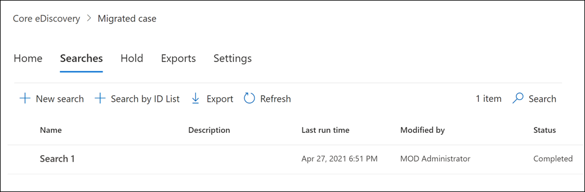

# <a name="migrate-legacy-ediscovery-searches-and-holds-to-the-microsoft-365-compliance-center"></a>Migrar pesquisas de Descobertas e Retês legadas para o centro de conformidade do Microsoft 365

O centro de conformidade do Microsoft 365 oferece uma experiência aprimorada para o uso de Descobertas Eletrônicos, incluindo: maior confiabilidade, melhor desempenho e muitos recursos adaptados para fluxos de trabalho de Descoberta Eletrônico, incluindo casos para organizar seu conteúdo por questão, conjuntos de revisão para revisar o conteúdo e análises para ajudar a analisar dados como agrupamento quase duplicado, threading de email, análise de temas e codificação preditiva.

Para ajudar os clientes In-Place aproveitar as funcionalidades novas e aprimoradas, este artigo fornece orientações básicas sobre como migrar pesquisas e retém de Descobertas In-Place do Centro de administração do Exchange para o centro de conformidade do Microsoft 365.

> [!NOTE]
> Como há muitos cenários diferentes, este artigo fornece orientações gerais para fazer a transição de pesquisas e retém para um caso de Descoberta eDiscovery principal no centro de conformidade do Microsoft 365. O uso de ocorrências de Descoberta e nem sempre é necessário, mas eles adicionam uma camada extra de segurança, ao permitir que você atribua permissões para controlar quem tem acesso aos casos de Descoberta e na sua organização.

## <a name="before-you-begin"></a>Antes de começar

- Você precisa ser membro do grupo de função Gerente de Descobertas e-& no Centro de Conformidade e Segurança para executar os comandos do PowerShell descritos neste artigo. Você também precisa ser membro do grupo de função Gerenciamento de Descoberta no Centro de administração do Exchange.

- Este artigo fornece orientações sobre como criar uma espera de Descoberta eDiscovery. A política de espera será aplicada a caixas de correio por meio de um processo assíncrono. Ao criar um eDiscovery hold, você deve criar caseHoldPolicy e CaseHoldRule, caso contrário, a espera não será criada e os locais de conteúdo não serão colocados em espera.

## <a name="step-1-connect-to-exchange-online-powershell-and-security--compliance-center-powershell"></a>Etapa 1: Conectar-se ao PowerShell do Exchange Online e ao PowerShell do Centro de Conformidade & Segurança

A primeira etapa é conectar-se ao PowerShell do Exchange Online e ao PowerShell do Centro de Conformidade & Segurança. Você pode copiar o script a seguir, colar em uma janela do PowerShell e, em seguida, execute-o. Você será solicitado a solicitar credenciais para a organização à que deseja se conectar. 

```powershell
$UserCredential = Get-Credential
$sccSession = New-PSSession -ConfigurationName Microsoft.Exchange -ConnectionUri https://ps.compliance.protection.outlook.com/powershell-liveid -Credential $UserCredential -Authentication Basic -AllowRedirection
Import-PSSession $sccSession -DisableNameChecking
$exoSession = New-PSSession -ConfigurationName Microsoft.Exchange -ConnectionUri https://ps.outlook.com/powershell-liveid/ -Credential $UserCredential -Authentication Basic -AllowRedirection
Import-PSSession $exoSession -AllowClobber -DisableNameChecking
```

Você precisa executar os comandos nas etapas a seguir nesta sessão do PowerShell.

## <a name="step-2-get-a-list-of-in-place-ediscovery-searches-by-using-get-mailboxsearch"></a>Etapa 2: Obter uma lista de In-Place eDiscovery usando o Get-MailboxSearch

Depois de autenticar, você pode obter uma lista de In-Place eDiscovery executando o cmdlet **Get-MailboxSearch.** Copie e colar o seguinte comando no PowerShell e execute-o. Uma lista de pesquisas será listada com seus nomes e o status de qualquer In-Place Retém.

```powershell
Get-MailboxSearch
```

A saída do cmdlet será semelhante à seguinte:


## <a name="step-3-get-information-about-the-in-place-ediscovery-searches-and-in-place-holds-you-want-to-migrate"></a>Etapa 3: Obter informações sobre as In-Place de Descoberta In-Place EDiscovery que você deseja migrar

Novamente, você usará o cmdlet **Get-MailboxSearch,** mas desta vez para obter as propriedades da pesquisa. Você pode armazenar essas propriedades em uma variável para uso posterior. O exemplo a seguir armazena os resultados do cmdlet **Get-MailboxSearch** em uma variável e exibe as propriedades da pesquisa.

```powershell
$search = Get-MailboxSearch -Identity "Search 1"
```

```powershell
$search | FL
```

A saída desses dois comandos será semelhante à seguinte:


> [!NOTE]
> A duração do In-Place Reter neste exemplo é indefinida (*ItemHoldPeriod: Unlimited*). Isso é típico para cenários de descoberta e investigação legal. Se a duração da retenção tiver um valor diferente do indefinido, o motivo provavelmente é porque a retenção está sendo usada para reter o conteúdo em um cenário de retenção. Em vez de usar os cmdlet & s de Descoberta Eletrônica no PowerShell do Centro de Conformidade e Segurança para cenários de retenção, recomendamos usar [New-RetentionCompliancePolicy](https://docs.microsoft.com/powershell/module/exchange/new-retentioncompliancepolicy) e [New-RetentionComplianceRule](https://docs.microsoft.com/powershell/module/exchange/new-retentioncompliancerule) para reter o conteúdo. O resultado do uso desses cmdlets será semelhante ao uso de **New-CaseHoldPolicy** e **New-CaseHoldRule,** mas você poderá especificar um período de retenção e uma ação de retenção, como excluir conteúdo após o período de retenção expirar. Além disso, o uso dos cmdlets de retenção não exige que você associe as retenções de retenção a um caso de Descoberta Eletrônica.

## <a name="step-4-create-a-case-in-the-microsoft-365-compliance-center"></a>Etapa 4: Criar um caso no Centro de Conformidade do Microsoft 365

Para criar uma espera de Descoberta eDiscovery, você precisa criar uma ocorrência de Descoberta Descoberta para associar a responsabilidade. O exemplo a seguir cria uma ocorrência de Descoberta Bancária usando um nome de sua escolha. Armazenaremos as propriedades do novo caso em uma variável para uso posterior. Você pode exibir essas propriedades executando o `$case | FL` comando depois de criar a ocorrência.

```powershell
$case = New-ComplianceCase -Name "[Case name of your choice]"
```


## <a name="step-5-create-the-ediscovery-hold"></a>Etapa 5: Criar a espera de Descoberta eDiscovery

Após a criação do caso, você pode criar a iseção e associá-la ao caso criado na etapa anterior. É importante lembrar que você deve criar uma política de caso de espera e uma regra de espera de caso. Se a regra de espera de caso não for criada após a criação da política de responsabilidade de caso, a responsabilidade de Descoberta eDiscovery não será criada e nenhum conteúdo será colocado em espera.

Execute os seguintes comandos para reabrir a espera de Descoberta eDiscovery que você deseja migrar. Esses exemplos usam as propriedades da In-Place Da Etapa 3 que você deseja migrar. O primeiro comando cria uma nova política de caso de espera e salva as propriedades em uma variável. O segundo comando cria a regra de espera de caso correspondente.

```powershell
$policy = New-CaseHoldPolicy -Name $search.Name -Case $case.Identity -ExchangeLocation $search.SourceMailboxes
```

```powershell
New-CaseHoldRule -Name $search.Name -Policy $policy.Identity
```


## <a name="step-6-verify-the-ediscovery-hold"></a>Etapa 6: Verificar a espera de Descoberta eDiscovery

Para garantir que não haja problemas na criação da iseção, é bom verificar se o status de distribuição de espera foi bem-sucedido. Distribuição significa que a espera foi aplicada a todos os locais de conteúdo especificados no parâmetro *ExchangeLocation* na etapa anterior. Para fazer isso, você pode executar o cmdlet **Get-CaseHoldPolicy.** Como as propriedades salvas na *variável $policy* que você criou na etapa anterior não são atualizadas automaticamente na variável, você precisa reruncar o cmdlet para verificar se a distribuição foi bem-sucedida. Pode levar entre 5 e 24 horas para que as políticas de espera de caso sejam distribuídas com êxito.

Execute o seguinte comando para verificar se a espera da Descoberta eDiscovery foi distribuída com êxito.

```powershell
Get-CaseHoldPolicy -Identity $policy.Identity | Select name, DistributionStatus
```

O valor **success** para a *propriedade DistributionStatus* indica que a espera foi colocada com êxito nos locais de conteúdo. Se a distribuição ainda não estiver concluída, um valor **pendente** será exibido.


## <a name="step-7-create-the-search"></a>Etapa 7: Criar a pesquisa

A última etapa é criar a pesquisa que você identificou na Etapa 3 e associá-la à ocorrência. Depois de criar a pesquisa, você pode executar usando o cmdlet **Start-ComplianceSearch** ou executar posteriormente.

```powershell
New-ComplianceSearch -Name $search.Name -ExchangeLocation $search.SourceMailboxes -ContentMatchQuery $search.SearchQuery -Case $case.name
```


## <a name="step-8-verify-the-case-hold-and-search-in-the-microsoft-365-compliance-center"></a>Etapa 8: verificar o caso, a espera e a pesquisa no centro de conformidade do Microsoft 365

Para garantir que tudo está definido corretamente, vá para o centro de conformidade do Microsoft 365 em e clique em [https://compliance.microsoft.com](https://compliance.microsoft.com) **eDiscovery > Core**.


O caso que você criou na Etapa 3 está listado na **página Descobertas es Básicas.** Abra o caso e observe a espera que você criou na Etapa 4 listada **na** guia Retém. Você pode clicar na ise para ver detalhes, incluindo o número de caixas de correio às quais a espera é aplicada e o status de distribuição.


A pesquisa que você criou na Etapa 7 está listada na guia **Pesquisas** da ocorrência de Descoberta e.



Se você migrar uma pesquisa de Descoberta In-Place eDiscovery, mas não a associar a um caso de Descoberta eDiscovery, ela será listada na página Pesquisa de conteúdo no centro de conformidade do Microsoft 365.

## <a name="more-information"></a>Mais informações

- Para obter mais informações In-Place eDiscovery & Holds no Centro de administração do Exchange, consulte:
  
  - [Descoberta Eletrônica In-loco](https://docs.microsoft.com/exchange/security-and-compliance/in-place-ediscovery/in-place-ediscovery)

  - [Bloqueio In-loco e Retenção de Litígio](https://docs.microsoft.com/exchange/security-and-compliance/in-place-and-litigation-holds)

- Para obter mais informações sobre os cmdlets do PowerShell usados no artigo, consulte:

  - [Get-MailboxSearch](https://docs.microsoft.com/powershell/module/exchange/get-mailboxsearch)
  
  - [New-ComplianceCase](https://docs.microsoft.com/powershell/module/exchange/new-compliancecase)

  - [New-CaseHoldPolicy](https://docs.microsoft.com/powershell/module/exchange/new-caseholdpolicy)
  
  - [New-CaseHoldRule](https://docs.microsoft.com/powershell/module/exchange/new-caseholdrule)

  - [Get-CaseHoldPolicy](https://docs.microsoft.com/powershell/module/exchange/get-caseholdpolicy)
  
  - [New-ComplianceSearch](https://docs.microsoft.com/powershell/module/exchange/new-compliancesearch)

  - [Start-ComplianceSearch](https://docs.microsoft.com/powershell/module/exchange/start-compliancesearch)

- Para saber mais sobre o centro de conformidade do Microsoft 365, confira Visão geral do [centro de conformidade do Microsoft 365.](microsoft-365-compliance-center.md)
