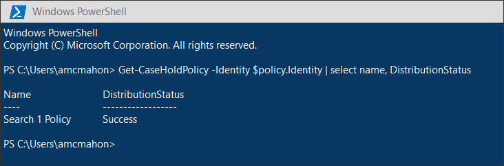

# <a name="migrate-legacy-ediscovery-searches-and-holds-to-the-microsoft-365-compliance-center"></a><span data-ttu-id="4afde-102">Migrar pesquisas e retês de Descobertas EDiscovery herdado para o Microsoft 365 de conformidade</span><span class="sxs-lookup"><span data-stu-id="4afde-102">Migrate legacy eDiscovery searches and holds to the Microsoft 365 compliance center</span></span>

<span data-ttu-id="4afde-103">O centro de conformidade do Microsoft 365 oferece uma experiência aprimorada para o uso de Descoberta Eletrônico, incluindo: maior confiabilidade, melhor desempenho e muitos recursos personalizados para fluxos de trabalho de Descoberta Eletrônico, incluindo casos para organizar seu conteúdo por questão, conjuntos de revisão para revisar conteúdo e análise para ajudar a analisar dados para revisão, como agrupação quase duplicada, threading de email, análise de temas e codificação preditiva.</span><span class="sxs-lookup"><span data-stu-id="4afde-103">The Microsoft 365 compliance center provides an improved experience for eDiscovery usage, including: higher reliability, better performance, and many features tailored to eDiscovery workflows including cases to organize your content by matter, review sets to review content and analytics to help cull data for review such as near-duplicate grouping, email threading, themes analysis, and predictive coding.</span></span>

<span data-ttu-id="4afde-104">Para ajudar os clientes In-Place aproveitar a funcionalidade nova e aprimorada, este artigo fornece orientações básicas sobre como migrar pesquisas e retês de descobertas e descobertas In-Place do centro de administração do Exchange para o centro de conformidade Microsoft 365.</span><span class="sxs-lookup"><span data-stu-id="4afde-104">To help customers take advantage of the new and improved functionality, this article provides basic guidance on how to migrate In-Place eDiscovery searches and holds from the Exchange admin center to the Microsoft 365 compliance center.</span></span>

> [!NOTE]
> <span data-ttu-id="4afde-105">Como há muitos cenários diferentes, este artigo fornece orientações gerais para fazer a transição de pesquisas e retém para um caso de Descoberta eDiscovery principal no centro de conformidade Microsoft 365 de segurança.</span><span class="sxs-lookup"><span data-stu-id="4afde-105">Because there are many different scenarios, this article provides general guidance to transition searches and holds to a core eDiscovery case in the Microsoft 365 compliance center.</span></span> <span data-ttu-id="4afde-106">O uso de casos de Descoberta Digital nem sempre é necessário, mas eles adicionam uma camada extra de segurança, ao permitir que você atribua permissões para controlar quem tem acesso aos casos de Descoberta Digital em sua organização.</span><span class="sxs-lookup"><span data-stu-id="4afde-106">Using eDiscovery cases aren't always required, but they add an extra layer of security by letting you assign permissions to control who has access to the eDiscovery cases in your organization.</span></span>

## <a name="before-you-begin"></a><span data-ttu-id="4afde-107">Antes de começar</span><span class="sxs-lookup"><span data-stu-id="4afde-107">Before you begin</span></span>

- <span data-ttu-id="4afde-108">Você precisa ser membro do grupo de funções do Gerenciador de Descobertas e no Centro de Conformidade & Segurança para executar os comandos do PowerShell descritos neste artigo.</span><span class="sxs-lookup"><span data-stu-id="4afde-108">You have to be a member of the eDiscovery Manager role group in the Security & Compliance Center to run the PowerShell commands described in this article.</span></span> <span data-ttu-id="4afde-109">Você também precisa ser membro do grupo de função Gerenciamento de Descoberta no centro de Exchange de administração.</span><span class="sxs-lookup"><span data-stu-id="4afde-109">You also have to be a member of the Discovery Management role group in the Exchange admin center.</span></span>

- <span data-ttu-id="4afde-110">Este artigo fornece orientações sobre como criar uma ressalto de Descoberta e.</span><span class="sxs-lookup"><span data-stu-id="4afde-110">This article provides guidance on how to create an eDiscovery hold.</span></span> <span data-ttu-id="4afde-111">A política de espera será aplicada a caixas de correio por meio de um processo assíncrono.</span><span class="sxs-lookup"><span data-stu-id="4afde-111">The hold policy will be applied to mailboxes through an asynchronous process.</span></span> <span data-ttu-id="4afde-112">Ao criar uma contenção de Descoberta eDiscovery, você deve criar um CaseHoldPolicy e CaseHoldRule, caso contrário, a responsabilidade não será criada e os locais de conteúdo não serão colocados em espera.</span><span class="sxs-lookup"><span data-stu-id="4afde-112">When creating an eDiscovery hold, you must create both a CaseHoldPolicy and CaseHoldRule, otherwise the hold will not be created and content locations will not be placed on hold.</span></span>

## <a name="step-1-connect-to-exchange-online-powershell-and-security--compliance-center-powershell"></a><span data-ttu-id="4afde-113">Etapa 1: Conexão para Exchange Online PowerShell e Segurança & Centro de Conformidade do PowerShell</span><span class="sxs-lookup"><span data-stu-id="4afde-113">Step 1: Connect to Exchange Online PowerShell and Security & Compliance Center PowerShell</span></span>

<span data-ttu-id="4afde-114">A primeira etapa é conectar-se Exchange Online powershell e segurança & Centro de Conformidade do PowerShell.</span><span class="sxs-lookup"><span data-stu-id="4afde-114">The first step is to connect to Exchange Online PowerShell and Security & Compliance Center PowerShell.</span></span> <span data-ttu-id="4afde-115">Você pode copiar o script a seguir, colar-o em uma janela do PowerShell e, em seguida, execute-o.</span><span class="sxs-lookup"><span data-stu-id="4afde-115">You can copy the following script, paste it into a PowerShell window and then run it.</span></span> <span data-ttu-id="4afde-116">Você será solicitado a solicitar credenciais para a organização à que deseja se conectar.</span><span class="sxs-lookup"><span data-stu-id="4afde-116">You'll be prompted for credentials for the organization that you want to connect to.</span></span> 

```powershell
$UserCredential = Get-Credential
$sccSession = New-PSSession -ConfigurationName Microsoft.Exchange -ConnectionUri https://ps.compliance.protection.outlook.com/powershell-liveid -Credential $UserCredential -Authentication Basic -AllowRedirection
Import-PSSession $sccSession -DisableNameChecking
$exoSession = New-PSSession -ConfigurationName Microsoft.Exchange -ConnectionUri https://ps.outlook.com/powershell-liveid/ -Credential $UserCredential -Authentication Basic -AllowRedirection
Import-PSSession $exoSession -AllowClobber -DisableNameChecking
```

<span data-ttu-id="4afde-117">Você precisa executar os comandos nas etapas a seguir nesta sessão do PowerShell.</span><span class="sxs-lookup"><span data-stu-id="4afde-117">You need to run the commands in the following steps in this PowerShell session.</span></span>

## <a name="step-2-get-a-list-of-in-place-ediscovery-searches-by-using-get-mailboxsearch"></a><span data-ttu-id="4afde-118">Etapa 2: obter uma lista de In-Place de Descoberta In-Place usando Get-MailboxSearch</span><span class="sxs-lookup"><span data-stu-id="4afde-118">Step 2: Get a list of In-Place eDiscovery searches by using Get-MailboxSearch</span></span>

<span data-ttu-id="4afde-119">Após a autenticação, você pode obter uma lista de In-Place de Descoberta Eletrônica executando o cmdlet **Get-MailboxSearch.**</span><span class="sxs-lookup"><span data-stu-id="4afde-119">After you've authenticated, you can get a list of In-Place eDiscovery searches by running the **Get-MailboxSearch** cmdlet.</span></span> <span data-ttu-id="4afde-120">Copie e colar o seguinte comando no PowerShell e execute-o.</span><span class="sxs-lookup"><span data-stu-id="4afde-120">Copy and paste the following command into PowerShell and then run it.</span></span> <span data-ttu-id="4afde-121">Uma lista de pesquisas será listada com seus nomes e o status de qualquer In-Place Holds.</span><span class="sxs-lookup"><span data-stu-id="4afde-121">A list of searches will be listed with their names and the status of any In-Place Holds.</span></span>

```powershell
Get-MailboxSearch
```

<span data-ttu-id="4afde-122">A saída do cmdlet será semelhante à seguinte:</span><span class="sxs-lookup"><span data-stu-id="4afde-122">The cmdlet output will be similar to the following:</span></span>


## <a name="step-3-get-information-about-the-in-place-ediscovery-searches-and-in-place-holds-you-want-to-migrate"></a><span data-ttu-id="4afde-124">Etapa 3: obter informações sobre as pesquisas In-Place descoberta e In-Place que você deseja migrar</span><span class="sxs-lookup"><span data-stu-id="4afde-124">Step 3: Get information about the In-Place eDiscovery searches and In-Place Holds you want to migrate</span></span>

<span data-ttu-id="4afde-125">Novamente, você usará o cmdlet **Get-MailboxSearch,** mas desta vez para obter as propriedades da pesquisa.</span><span class="sxs-lookup"><span data-stu-id="4afde-125">Again you will use the **Get-MailboxSearch** cmdlet, but this time to get the properties of the search.</span></span> <span data-ttu-id="4afde-126">Você pode armazenar essas propriedades em uma variável para uso posteriormente.</span><span class="sxs-lookup"><span data-stu-id="4afde-126">You can store these properties in a variable for use later.</span></span> <span data-ttu-id="4afde-127">O exemplo a seguir armazena os resultados do cmdlet **Get-MailboxSearch** em uma variável e exibe as propriedades da pesquisa.</span><span class="sxs-lookup"><span data-stu-id="4afde-127">The following example stores the results of the **Get-MailboxSearch** cmdlet in a variable and then displays the properties of the search.</span></span>

```powershell
$search = Get-MailboxSearch -Identity "Search 1"
```

```powershell
$search | FL
```

<span data-ttu-id="4afde-128">A saída desses dois comandos será semelhante à seguinte:</span><span class="sxs-lookup"><span data-stu-id="4afde-128">The output of these two commands will be similar to the following:</span></span>


> [!NOTE]
> <span data-ttu-id="4afde-130">A duração da In-Place neste exemplo é indefinida (*ItemHoldPeriod: Unlimited*).</span><span class="sxs-lookup"><span data-stu-id="4afde-130">The duration of the In-Place Hold in this example is indefinite (*ItemHoldPeriod: Unlimited*).</span></span> <span data-ttu-id="4afde-131">Isso é típico para cenários de Descoberta e Investigação Legal.</span><span class="sxs-lookup"><span data-stu-id="4afde-131">This is typical for eDiscovery and legal investigation scenarios.</span></span> <span data-ttu-id="4afde-132">Se a duração da retenção tiver um valor diferente do indefinido, o motivo provavelmente será porque a retenção está sendo usada para reter conteúdo em um cenário de retenção.</span><span class="sxs-lookup"><span data-stu-id="4afde-132">If the hold duration has is different value than indefinite, the reason is likely because the hold is being used to retain content in a retention scenario.</span></span> <span data-ttu-id="4afde-133">Em vez de usar os cmdlet & s de Descoberta Eletrônica no Centro de Conformidade e Segurança do PowerShell para cenários de retenção, recomendamos que você use [New-RetentionCompliancePolicy](/powershell/module/exchange/new-retentioncompliancepolicy) e [New-RetentionComplianceRule](/powershell/module/exchange/new-retentioncompliancerule) para reter conteúdo.</span><span class="sxs-lookup"><span data-stu-id="4afde-133">Instead of using the eDiscovery cmdlets in Security & Compliance Center PowerShell for retention scenarios, we recommend that you use [New-RetentionCompliancePolicy](/powershell/module/exchange/new-retentioncompliancepolicy) and [New-RetentionComplianceRule](/powershell/module/exchange/new-retentioncompliancerule) to retain content.</span></span> <span data-ttu-id="4afde-134">O resultado do uso desses cmdlets será semelhante ao uso de **New-CaseHoldPolicy** e **New-CaseHoldRule**, mas você poderá especificar um período de retenção e uma ação de retenção, como a exclusão de conteúdo após o período de retenção expirar.</span><span class="sxs-lookup"><span data-stu-id="4afde-134">The result of using these cmdlets will be similar to using **New-CaseHoldPolicy** and **New-CaseHoldRule**, but you'll able to specify a retention period and a retention action, such as deleting content after the retention period expires.</span></span> <span data-ttu-id="4afde-135">Além disso, o uso dos cmdlets de retenção não exige que você associe os retenções de retenção a um caso de Descoberta Eletrônica.</span><span class="sxs-lookup"><span data-stu-id="4afde-135">Also, using the retention cmdlets don't require you to associate the retention holds with an eDiscovery case.</span></span>

## <a name="step-4-create-a-case-in-the-microsoft-365-compliance-center"></a><span data-ttu-id="4afde-136">Etapa 4: Criar um caso no centro Microsoft 365 Conformidade</span><span class="sxs-lookup"><span data-stu-id="4afde-136">Step 4: Create a case in the Microsoft 365 Compliance center</span></span>

<span data-ttu-id="4afde-137">Para criar uma responsabilidade de Descoberta eDiscovery, você precisa criar um caso de Descoberta e Para associar a responsabilidade.</span><span class="sxs-lookup"><span data-stu-id="4afde-137">To create an eDiscovery hold, you have to create an eDiscovery case to associate the hold with.</span></span> <span data-ttu-id="4afde-138">O exemplo a seguir cria um caso de Descoberta E usando um nome de sua escolha.</span><span class="sxs-lookup"><span data-stu-id="4afde-138">The following example creates an eDiscovery case using a name of your choice.</span></span> <span data-ttu-id="4afde-139">Armazenaremos as propriedades do novo caso em uma variável para uso posteriormente.</span><span class="sxs-lookup"><span data-stu-id="4afde-139">We will store the properties of the new case in a variable for use later.</span></span> <span data-ttu-id="4afde-140">Você pode exibir essas propriedades executando o `$case | FL` comando depois de criar o caso.</span><span class="sxs-lookup"><span data-stu-id="4afde-140">You can view those properties by running the `$case | FL` command after you create the case.</span></span>

```powershell
$case = New-ComplianceCase -Name "[Case name of your choice]"
```


## <a name="step-5-create-the-ediscovery-hold"></a><span data-ttu-id="4afde-142">Etapa 5: Criar a espera de Descoberta e</span><span class="sxs-lookup"><span data-stu-id="4afde-142">Step 5: Create the eDiscovery hold</span></span>

<span data-ttu-id="4afde-143">Depois que o caso for criado, você poderá criar a iseção e associá-la ao caso que você criou na etapa anterior.</span><span class="sxs-lookup"><span data-stu-id="4afde-143">After the case is created, you can create the hold and associate it with the case that you created in the previous step.</span></span> <span data-ttu-id="4afde-144">É importante lembrar que você deve criar uma política de espera de caso e uma regra de ressarção de caso.</span><span class="sxs-lookup"><span data-stu-id="4afde-144">It's important to remember that you must create both a case hold policy and a case hold rule.</span></span> <span data-ttu-id="4afde-145">Se a regra de espera de caso não for criada depois que você criou a política de responsabilidade de caso, a responsabilidade de Descoberta eDiscovery não será criada e qualquer conteúdo não será colocado em espera.</span><span class="sxs-lookup"><span data-stu-id="4afde-145">If the case hold rule isn't created after you created case hold policy, the eDiscovery hold will not be created and any content won't be placed on hold.</span></span>

<span data-ttu-id="4afde-146">Execute os seguintes comandos para re-criar a reenconsução de Descoberta e que você deseja migrar.</span><span class="sxs-lookup"><span data-stu-id="4afde-146">Run the following commands to re-create the eDiscovery hold that you want to migrate.</span></span> <span data-ttu-id="4afde-147">Esses exemplos usam as propriedades In-Place a partir da Etapa 3 que você deseja migrar.</span><span class="sxs-lookup"><span data-stu-id="4afde-147">These examples use the properties from In-Place Hold from Step 3 that you want to migrate.</span></span> <span data-ttu-id="4afde-148">O primeiro comando cria uma nova política de espera de caso e salva as propriedades em uma variável.</span><span class="sxs-lookup"><span data-stu-id="4afde-148">The first command creates a new case hold policy and saves the properties to a variable.</span></span> <span data-ttu-id="4afde-149">O segundo comando cria a regra de espera de caso correspondente.</span><span class="sxs-lookup"><span data-stu-id="4afde-149">The second command creates the corresponding case hold rule.</span></span>

```powershell
$policy = New-CaseHoldPolicy -Name $search.Name -Case $case.Identity -ExchangeLocation $search.SourceMailboxes
```

```powershell
New-CaseHoldRule -Name $search.Name -Policy $policy.Identity
```


## <a name="step-6-verify-the-ediscovery-hold"></a><span data-ttu-id="4afde-151">Etapa 6: Verificar a espera de Descoberta e</span><span class="sxs-lookup"><span data-stu-id="4afde-151">Step 6: Verify the eDiscovery hold</span></span>

<span data-ttu-id="4afde-152">Para certificar-se de que não houve problemas na criação da espera, é bom verificar se o status de distribuição de espera é bem-sucedido.</span><span class="sxs-lookup"><span data-stu-id="4afde-152">To make sure there were no issues in creating the hold, it's good to check that the hold distribution status is successful.</span></span> <span data-ttu-id="4afde-153">Distribuição significa que a espera foi aplicada a todos os locais de conteúdo especificados no parâmetro *ExchangeLocation* na etapa anterior.</span><span class="sxs-lookup"><span data-stu-id="4afde-153">Distribution means that the hold has been applied to all the content locations specified in the *ExchangeLocation* parameter in the previous step.</span></span> <span data-ttu-id="4afde-154">Para fazer isso, você pode executar o cmdlet **Get-CaseHoldPolicy.**</span><span class="sxs-lookup"><span data-stu-id="4afde-154">To do this, you can run the **Get-CaseHoldPolicy** cmdlet.</span></span> <span data-ttu-id="4afde-155">Como as propriedades salvas na *variável* $policy que você criou na etapa anterior não são atualizadas automaticamente na variável, você precisa reprisar o cmdlet para verificar se a distribuição foi bem-sucedida.</span><span class="sxs-lookup"><span data-stu-id="4afde-155">Because the properties saved to the *$policy* variable that you created in the previous step aren't automatically updated in the variable, you need to rerun the cmdlet to verify that distribution is successful.</span></span> <span data-ttu-id="4afde-156">Pode levar entre 5 minutos e 24 horas para que as políticas de espera de caso sejam distribuídas com êxito.</span><span class="sxs-lookup"><span data-stu-id="4afde-156">It can take between 5 minutes and 24 hours for case hold policies to be successfully distributed.</span></span>

<span data-ttu-id="4afde-157">Execute o comando a seguir para verificar se a ressarção de Descoberta e Foi distribuída com êxito.</span><span class="sxs-lookup"><span data-stu-id="4afde-157">Run the following command to verify that the eDiscovery hold has been successfully distributed.</span></span>

```powershell
Get-CaseHoldPolicy -Identity $policy.Identity | Select name, DistributionStatus
```

<span data-ttu-id="4afde-158">O valor **de Success para** a propriedade *DistributionStatus* indica que a ressarção foi colocada com êxito nos locais de conteúdo.</span><span class="sxs-lookup"><span data-stu-id="4afde-158">The value of **Success** for the *DistributionStatus* property indicates the hold was successfully placed on the content locations.</span></span> <span data-ttu-id="4afde-159">Se a distribuição ainda não estiver concluída, um valor **de Pendente** será exibido.</span><span class="sxs-lookup"><span data-stu-id="4afde-159">If the distribution is not yet complete, a value of **Pending** is displayed.</span></span>



## <a name="step-7-create-the-search"></a><span data-ttu-id="4afde-161">Etapa 7: Criar a pesquisa</span><span class="sxs-lookup"><span data-stu-id="4afde-161">Step 7: Create the search</span></span>

<span data-ttu-id="4afde-162">A última etapa é criar a pesquisa que você identificou na Etapa 3 e associá-la ao caso.</span><span class="sxs-lookup"><span data-stu-id="4afde-162">The last step is to re-create the search that you identified in Step 3 and associate it with the case.</span></span> <span data-ttu-id="4afde-163">Depois de criar a pesquisa, você pode executar usando o cmdlet **Start-ComplianceSearch** ou executar posteriormente.</span><span class="sxs-lookup"><span data-stu-id="4afde-163">After you create the search, you can run it by using the **Start-ComplianceSearch** cmdlet or run at a later time.</span></span>

```powershell
New-ComplianceSearch -Name $search.Name -ExchangeLocation $search.SourceMailboxes -ContentMatchQuery $search.SearchQuery -Case $case.name
```


## <a name="step-8-verify-the-case-hold-and-search-in-the-microsoft-365-compliance-center"></a><span data-ttu-id="4afde-165">Etapa 8: Verificar o caso, a espera e a pesquisa no Microsoft 365 de conformidade</span><span class="sxs-lookup"><span data-stu-id="4afde-165">Step 8: Verify the case, hold, and search in the Microsoft 365 compliance center</span></span>

<span data-ttu-id="4afde-166">Para certificar-se de que tudo está definido corretamente, vá para o centro de conformidade Microsoft 365 em , e clique em [https://compliance.microsoft.com](https://compliance.microsoft.com) **Descoberta > Core**.</span><span class="sxs-lookup"><span data-stu-id="4afde-166">To make sure that everything is set up correctly, go to the Microsoft 365 compliance center at [https://compliance.microsoft.com](https://compliance.microsoft.com), and click **eDiscovery > Core**.</span></span>


<span data-ttu-id="4afde-168">O caso criado na Etapa 3 está listado na página **Descoberta Principal.**</span><span class="sxs-lookup"><span data-stu-id="4afde-168">The case that you created in Step 3 is listed on the **Core eDiscovery** page.</span></span> <span data-ttu-id="4afde-169">Abra a caixa e observe a espera que você criou na Etapa 4 listada na **guia** Espera. Você pode selecionar a espera para ver detalhes na página de sobrevoo, incluindo o número de caixas de correio às quais a 1000 caixas de correio é aplicada e o status de distribuição.</span><span class="sxs-lookup"><span data-stu-id="4afde-169">Open the case and then notice the hold that you created in Step 4 in listed on the **Hold** tab. You can select the hold to see details on the flyout page, including the number of mailboxes the hold is applied to and the distribution status.</span></span>


<span data-ttu-id="4afde-171">A pesquisa que você criou na Etapa 7 está listada na guia **Pesquisas** do caso.</span><span class="sxs-lookup"><span data-stu-id="4afde-171">The search that you created in Step 7 is listed on the **Searches** tab of the case.</span></span>


<span data-ttu-id="4afde-173">Se você migrar uma pesquisa de Descoberta In-Place eDiscovery, mas não associá-la a um caso de Descoberta eDiscovery, ela será listada na página de pesquisa de conteúdo no centro de conformidade Microsoft 365.</span><span class="sxs-lookup"><span data-stu-id="4afde-173">If you migrate an In-Place eDiscovery search but don't associate it with an eDiscovery case, it will be listed on the Content search page in the Microsoft 365 compliance center.</span></span>

## <a name="more-information"></a><span data-ttu-id="4afde-174">Mais informações</span><span class="sxs-lookup"><span data-stu-id="4afde-174">More information</span></span>

- <span data-ttu-id="4afde-175">Para obter mais informações sobre In-Place & eDiscovery no centro de administração Exchange, consulte:</span><span class="sxs-lookup"><span data-stu-id="4afde-175">For more information about In-Place eDiscovery & Holds in the Exchange admin center, see:</span></span>
  
  - [<span data-ttu-id="4afde-176">Descoberta Eletrônica In-loco</span><span class="sxs-lookup"><span data-stu-id="4afde-176">In-Place eDiscovery</span></span>](/exchange/security-and-compliance/in-place-ediscovery/in-place-ediscovery)

  - [<span data-ttu-id="4afde-177">Bloqueio In-loco e Retenção de Litígio</span><span class="sxs-lookup"><span data-stu-id="4afde-177">In-Place Hold and Litigation Hold</span></span>](/exchange/security-and-compliance/in-place-and-litigation-holds)

- <span data-ttu-id="4afde-178">Para obter mais informações sobre os cmdlets do PowerShell usados no artigo, consulte:</span><span class="sxs-lookup"><span data-stu-id="4afde-178">For more information about the PowerShell cmdlets used in the article, see:</span></span>

  - [<span data-ttu-id="4afde-179">Get-MailboxSearch</span><span class="sxs-lookup"><span data-stu-id="4afde-179">Get-MailboxSearch</span></span>](/powershell/module/exchange/get-mailboxsearch)
  
  - [<span data-ttu-id="4afde-180">New-ComplianceCase</span><span class="sxs-lookup"><span data-stu-id="4afde-180">New-ComplianceCase</span></span>](/powershell/module/exchange/new-compliancecase)

  - [<span data-ttu-id="4afde-181">New-CaseHoldPolicy</span><span class="sxs-lookup"><span data-stu-id="4afde-181">New-CaseHoldPolicy</span></span>](/powershell/module/exchange/new-caseholdpolicy)
  
  - [<span data-ttu-id="4afde-182">New-CaseHoldRule</span><span class="sxs-lookup"><span data-stu-id="4afde-182">New-CaseHoldRule</span></span>](/powershell/module/exchange/new-caseholdrule)

  - [<span data-ttu-id="4afde-183">Get-CaseHoldPolicy</span><span class="sxs-lookup"><span data-stu-id="4afde-183">Get-CaseHoldPolicy</span></span>](/powershell/module/exchange/get-caseholdpolicy)
  
  - [<span data-ttu-id="4afde-184">New-ComplianceSearch</span><span class="sxs-lookup"><span data-stu-id="4afde-184">New-ComplianceSearch</span></span>](/powershell/module/exchange/new-compliancesearch)

  - [<span data-ttu-id="4afde-185">Start-ComplianceSearch</span><span class="sxs-lookup"><span data-stu-id="4afde-185">Start-ComplianceSearch</span></span>](/powershell/module/exchange/start-compliancesearch)

- <span data-ttu-id="4afde-186">Para obter mais informações sobre o Microsoft 365 de conformidade, consulte [Overview of the Microsoft 365 compliance center](microsoft-365-compliance-center.md).</span><span class="sxs-lookup"><span data-stu-id="4afde-186">For more information about the Microsoft 365 compliance center, see [Overview of the Microsoft 365 compliance center](microsoft-365-compliance-center.md).</span></span>