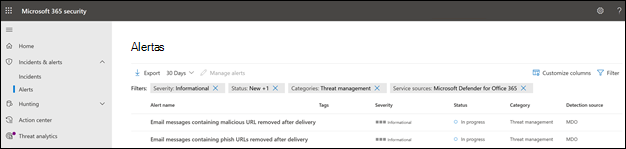
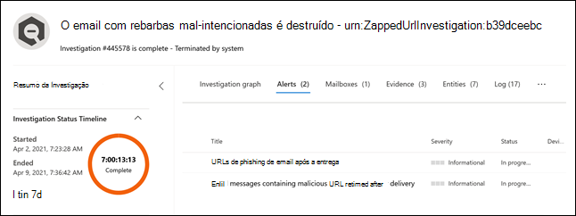
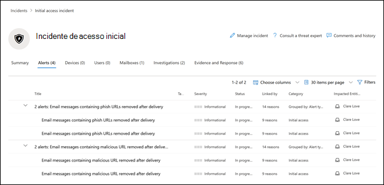

# Novas políticas de alerta no Microsoft Defender para Office 365

O Microsoft Defender para Office 365 apresenta as novas e melhoradas políticas de alerta relacionadas às detecções pós-entrega. Isso inclui o aperfeiçoamento dos guias estratégicos de AIR (Investigação e Resposta Automatizadas) associados a elas. Além disso, modificamos a classificação de severidade de seis políticas de alerta padrão para alinhar melhor os alertas gerados por essas políticas e seus impactos na organização.

## Detecções pós-entrega

Apresentaremos quatro novas políticas de alerta padrão relacionadas às detecções pós-entrega depois que a ZAP (Limpeza Automática Zero Hora do Microsoft) do Defender para Office 365 remove mensagens da caixa de entrada. Essas quatro novas políticas de alerta substituirão duas políticas de alerta padrão existentes que cobrem cenários de ZAP, além de fornecerem às organizações detalhes aprimorados sobre a detecção subjacente e indicadores relacionados. Esses alertas (e os guias estratégicos de AIR que serão acionados a partir desses alertas) capturam com precisão as ameaças aos emails e entidades, inclusive se a URL aponta para um arquivo mal-intencionado ou se o arquivo contiver uma URL mal-intencionada.

A tabela a seguir lista as novas políticas de alerta e as políticas de alerta existentes que serão removidas. Confira a seção [Como isso afetará a sua organização](#how-this-will-affect-your-organization) para obter detalhes sobre a distribuição.

| Política de alerta nova ou existente | Nome da política de alerta | ID da política de alerta|
|:-----------------------------|:----------------|:--------------|
| Novo| **Mensagens de email contendo URL mal-intencionada removida após a entrega**   | 0179B3F7-3FDA-40C3-8F24-278563978DBB |
| Novo| **Mensagens de email contendo arquivo mal-intencionado removido após a entrega**  | 8E6BA277-EF39-404E-AAF1-294F6D9A2B88 |
| Novo| **Mensagens de email de uma campanha foram entregues e removidas posteriormente** | ef850570-5624-42b2-ff0a-08d8d899d578 |
| Novo|**Emails mal-intencionados foram entregues e removidos posteriormente**                | a1f563cc-fb1f-466b-1fb5-08d8d71a3050 |
| Existente (será removido)| **Mensagens de email contendo URLs de phishing removidas após a entrega**| EA8169FA-0678-4751-8854-AEBEA7ADECEB |
| Existente (será removido)| **Mensagens de email contendo malware removido após a entrega**| 0179B3F7-3FDA-40C3-8F24-278563978DBB |
||||

## Aprimoramentos na severidade do alerta

A tabela a seguir identifica as políticas de alerta padrão cujas classificações de gravidade estão sendo modificadas. Estamos alterando a classificação de severidade dessas políticas de alerta para nos alinharmos melhor com o risco potencial e o impacto na organização, e para ajudar as equipes de segurança a priorizar os alertas gerados por essas políticas.

| Alerta| ID da política de alerta| Severidade antiga| Nova severidade  |
|:----------|:---------------|:------------|:--------------|
| **Atividade suspeita do encaminhamento de email**| BFD48F06-0865-41A6-85FF-ADB746423EBF | Médio| Alto|
| **Email relatado pelo usuário como malware ou pishing** | B26A5770-0C38-434A-9380-3A3C2C27BBB3 | Informativo | Baixo|
| **Aumento incomum de emails relatados como pishing**  | A00D8C62-9320-4EEA-A7E5-966B9AC09558 | Alto| Média |
| **Resultado do Envio de Administrador concluído** | AE9B83DD-6039-4EA9-B675-6B0AC3BF4A41 | Baixo| Informativo |
| **Criação de regra de encaminhamento/redirecionamento** | D59A8FD4-1272-41EE-9408-86F7BCF72479 | Baixo| Informativo |
| **Pesquisa de Descoberta Eletrônica iniciada ou exportada**| 6FDC5710-3998-47F0-AFBB-57CEFD7378AE | Médio| Informativo |
|||||

## Quando as alterações ocorrerão

A tabela a seguir identifica quando as novas políticas de alerta começarão a disparar alertas pós-entrega. A tabela também identifica quando as duas políticas de alerta existentes serão removidas.

| Política de alerta| Data |
|:------------|:-----|
| **Mensagens de email contendo URL mal-intencionada removida após a entrega** (novo) | Os alertas começarão a ser disparados em 11 de abril de 2021|
| **Mensagens de email contendo arquivo mal-intencionado removido após a entrega** (novo) | Os alertas começarão a ser disparados em 11 de abril de 2021 |
| **Mensagens de email de uma campanha foram entregues e removidas posteriormente** (novo) | Os alertas começarão a ser disparados em 14 de maio de 2021|
| **Emails mal-intencionados foram entregues e removidos posteriormente** (novo) | Os alertas começarão a ser disparados em 14 de maio de 2021|
| **Mensagens de email contendo URLs de phishing removidas após a entrega** (existentes, serão removidas)| A política de alerta será removida em 14 de maio de 2021. Confira a seção [O que você precisa fazer para se preparar para estas alterações](#what-you-need-to-do-to-prepare-for-these-changes).|
| **Mensagens de email contendo malware removidos após a entrega** (existentes, serão removidas) | A política de alerta será removida em 14 de maio de 2021. Confira a seção [O que você precisa fazer para se preparar para estas alterações](#what-you-need-to-do-to-prepare-for-these-changes). |
|||

As alterações na severidade do alerta serão estendidas a todas organizações até 14 de maio de 2021.

## Como isso afetará sua organização

Os novos alertas começarão a ser acionados, disparando investigações de AIR na organização nas datas listadas acima. Para reduzir o impacto nas organizações de segurança que operacionalizaram os dois alertas que serão removidos, você verá os alertas disparados pelas políticas de alerta existentes *e* os alertas disparados pelas novas políticas de alerta entre 5 de abril de 2021 e 14 de maio de 2021. Isso proporcionará às equipes de segurança tempo para lidar com as alterações necessárias. Para ajudar as equipes de segurança com o aumento do volume de alerta durante esta curta duração, os alertas existentes e os novos serão correlacionados na mesma investigação de AIR, e correlacionados em um mesmo Incidente. Mais especificamente, isso inclui o seguinte comportamento para alertas, investigações de AIR e Incidentes:

- **Alertas**: Por padrão, você verá os seguintes pares de alerta nos alertas novos e existentes:

  - **Mensagens de email contendo URLs de pishing removidas após a entrega** E **Mensagens de email contendo URLs mal-intencionadas removidas após a entrega** 

  - **Mensagens de email contendo malware removido após a entrega** E **Mensagens de email contendo arquivo mal-intencionado removido após a entrega** 

  

   Para mais informações sobre o gerenciamento desses pares de alerta, confira a seção [O que você precisa fazer para se preparar para essas alterações](#what-you-need-to-do-to-prepare-for-these-changes).

- **Investigações de AIR**: Os alertas serão correlacionados em uma única investigação de AIR, com um dos alertas classificados como "disparando" e o outro como "repetido".

  

- **Incidentes**: Os dois alertas se correlacionam com o mesmo Incidente

  

## O que você precisa fazer para se preparar para essas alterações

A forma como sua organização usa esses alertas determinará o que precisa ser feito para se preparar. Se você operacionalizou os alertas, e os está usando ou consumindo através de uma API, uma notificação de alerta por email, ou no Centro de Segurança e Conformidade do Office 365 (`https://protection.office.com/viewalerts`) ou no Centro de segurança da Microsoft (`https://security.microsoft.com/viewalerts`), será necessário modificar seus fluxos de trabalho.

**Se você ainda não operacionalizou esses alertas, faça um dos seguintes procedimentos:**

- Desabilite as seguintes políticas de alerta (que estão sendo removidas) para reduzir o volume de alertas na organização:

  - **Mensagens de email contendo URLs de phishing removidas após a entrega**

  - **Mensagens de email contendo malware removido após a entrega**

- Não faça nada. As políticas de alerta existentes serão desabilitadas em 14 de maio de 2021.

**Se você tiver operacionalizado esses alertas:**

- Comece a consumir os novos alertas como parte dos fluxos de trabalho, em antecipação à remoção da política de alerta existente em 14 de maio de 2021. Se você tiver uma lógica personalizada no sistema de emissão de tíquetes, uma caixa de correio de segurança onde você recebe notificações de alerta por email, ou uma solução SIEM que depende do nome do alerta ou da Id da política de alerta (CorrelationId), será necessário modificar a lógica para acomodar a alteração.

  > [!NOTE]
  > As informações nos alertas, investigações e incidentes não foram alteradas. Na verdade, essas informações foram aprimoradas com detalhes adicionais sobre as ameaças associadas a elas.

- Depois de fazer as modificações, desabilite as políticas de alerta existentes para reduzir o volume de alertas na organização:

  - **Mensagens de email contendo URLs de phishing removidas após a entrega**

  - **Mensagens de email contendo malware removido após a entrega**

  Como alternativa, deixe estas políticas de alerta habilitadas até elas serem excluídas em 14 de maio de 2021.
