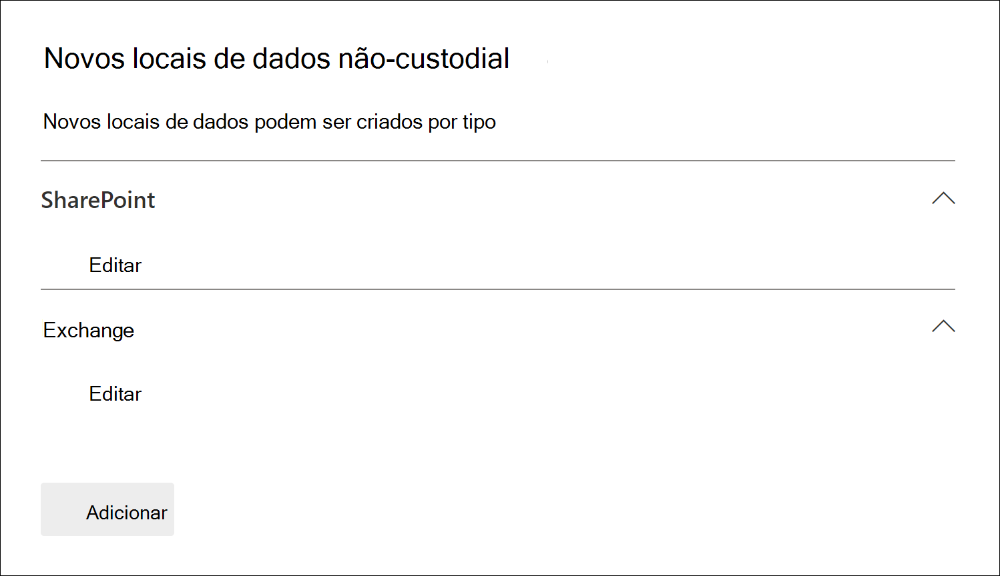
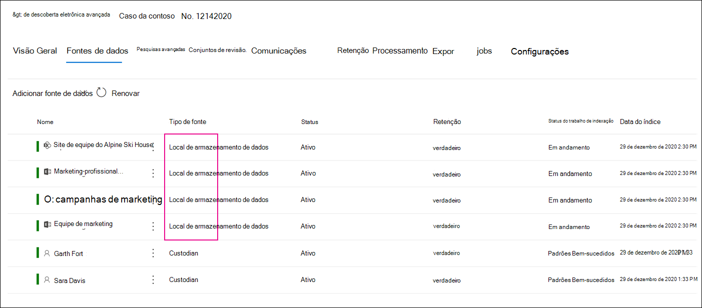

# Adicionar fontes de dados não custodial a um caso de Descoberta AvançadaAdd non-custodial data sources to an Advanced eDiscovery case

Em casos de Descoberta Avançada, nem sempre ela atenderá às suas necessidades de associar uma fonte de dados do Microsoft 365 a um custodiante no caso.In Advanced eDiscovery cases, it doesn't always meet your needs to associate a Microsoft 365 data source with a custodian in the case. Mas talvez ainda seja necessário associar esses dados a uma ocorrência para que você possa pesquisá-los, adicioná-los a um conjunto de revisão e analisá-los e revisá-los.But you may still need to associate that data with a case so that you can search it, add it to a review set, and analyze and review it. O recurso na Descoberta Avançada  é chamado de fontes de dados não custodial e permite adicionar dados a uma ocorrência sem precisar associá-los a um custodiante.The feature in Advanced eDiscovery is called *non-custodial data sources* and lets you add data to a case without having to associate it to a custodian. Também se aplica a mesma funcionalidade de Descoberta Avançada a dados não custodial que estão disponíveis para dados associados ao custodiante.It also applies the same Advanced eDiscovery functionality to non-custodial data that's available for data associated with custodian. Duas das coisas mais úteis que você pode aplicar a dados não custodial é colocá-los em espera e processá-los usando [indexação avançada.](indexing-custodian-data.md)Two of the most useful things that you can apply to non-custodial data is placing it on hold and processing it using [Advanced indexing](indexing-custodian-data.md).

## Adicionar uma fonte de dados não custodialAdd a non-custodial data source

Siga estas etapas para adicionar e gerenciar fontes de dados não custodial em um caso de Descoberta Avançada.Follow these steps to add and manage non-custodial data sources in an Advanced eDiscovery case.

1. Na home page **Da Descoberta Avançada,** clique na ocorrência à que você deseja adicionar os dados.On the **Advanced eDiscovery** home page, click the case that you want to add the data to.

2. Clique na **guia Fontes de dados** e clique em Adicionar fonte de **dados** Adicionar locais  >  **de dados.**Click the **Data sources** tab and then click **Add data source** > **Add data locations**.

3. Na página do sub-subconsiência Novos locais de dados sem custodiante, escolha as fontes de dados que você deseja adicionar à ocorrência. On the **New non-custodial data locations** flyout page, choose the data sources that you want to add to the case. Você pode adicionar várias caixas de correio e sites expandindo as seções **do SharePoint** ou **do Exchange** e clicando em **Editar.**You can add multiple mailboxes and sites by expanding the **SharePoint** or **Exchange** sections and then clicking **Edit**.

   

   - **SharePoint** - Clique **em Editar** para adicionar sites.**SharePoint** - Click **Edit** to add sites. Selecione um site na lista ou pesquise um site digitando a URL do site na barra de pesquisa.Select a site in the list or you can search for a site by typing the URL of the site in the search bar. Selecione os sites que você deseja adicionar como fontes de dados não custodiante e clique em **Adicionar**.Select the sites that you want to add as non-custodian data sources and click **Add**.

   - **Exchange** - Clique **em Editar** para adicionar caixas de correio.**Exchange** - Click **Edit** to add mailboxes. Digite um nome ou alias (no mínimo três caracteres) na caixa de pesquisa para caixas de correio ou grupos de distribuição.Type a name or alias (a minimum of three characters) in the search box for mailboxes or distribution groups. Selecione as caixas de correio que você deseja adicionar como fontes de dados não custodiante e clique em **Adicionar**.Select the mailboxes that you want to add as non-custodian data sources and click **Add**.

   > [!NOTE]
   > Você pode usar as seções do **SharePoint** e do **Exchange** para adicionar sites e caixas de correio associadas a uma equipe ou grupo do Yammer como fontes de dados não custodial.You can use the **SharePoint** and **Exchange** sections to add sites and mailboxes associated with a Team or Yammer group as non-custodial data sources. Você precisa adicionar separadamente a caixa de correio e o site associados a uma equipe ou grupo do Yammer.You have to separately add the mailbox and site associated with a Team or Yammer group.

4. Depois de adicionar fontes de dados não custodial, você tem a opção de colocar esses locais em espera ou não.After you add non-custodial data sources, you have the option to place those locations on hold or not. Marque ou desmarque a **caixa de** seleção De espera ao lado da fonte de dados para mantê-la em espera.Select or unselect the **Hold** checkbox next to the data source to place it on hold.

5. Clique **em Adicionar** na parte inferior da página **do** sub-menu Novos locais de dados sem custodiante para adicionar as fontes de dados à ocorrência.Click **Add** at the bottom of the **New non-custodial data locations** flyout page to add the data sources to the case.

   Cada fonte de dados não custodial que você adicionou está listada na **página Fontes de** dados.Each non-custodial data source that you added is listed on the **Data sources** page. As fontes de dados não custodial são identificadas pelo valor **do** local dos dados na coluna **Tipo de** origem.Non-custodial data sources are identified by the **Data location** value in the **Source type** column.

   

Depois de adicionar fontes de dados não custodial ao caso, um trabalho chamado *Reindexação* de dados não custodial é criado e exibido na guia Trabalhos do caso. After you add non-custodial data sources to the case, a job named *Reindexing non-custodial data* is created and displayed on the **Jobs** tab of the case. Depois que o trabalho é criado, o processo de indexação Avançada é iniciado e as fontes de dados são reindexadas.After the job is created, the Advanced indexing process in initiated and the data sources are reindexed.

## Gerenciar a responsabilidade por fontes de dados não custodialManage the hold for non-custodial data sources

Depois de colocar em espera uma fonte de dados não custodial, uma política de suspensão que contém as fontes de dados não custodial para o caso é criada automaticamente.After you place a hold on a non-custodial data source, a hold policy that contains the non-custodial data sources for the case is automatically created. Quando você coloca outras fontes de dados não custodial em espera, elas são adicionadas a essa política de espera.When you place other non-custodial data sources on hold, they are added to this hold policy.

1. Abra a ocorrência de Descoberta Avançada e selecione **a** guia Espera.Open the Advanced eDiscovery case and select the **Hold** tab.

2. Clique **em NCDSHold- \<GUID\>**, onde o valor de GUID é exclusivo para a ocorrência.Click **NCDSHold-\<GUID\>**, where the GUID value is unique to the case.

   A página de subconsiência exibe informações e estatísticas sobre as fontes de dados não custodial em espera.The flyout page display information and statistics about the non-custodial data sources on hold.

   

3. Clique **em Editar espera** para exibir as fontes de dados não custodial colocadas em espera e executar as seguintes tarefas de gerenciamento:Click **Edit hold** to view the non-custodial data sources placed on hold and perform the following management tasks:

   - Na página **Locais,** você pode liberar uma fonte de dados não custodial removendo-a da espera.On the **Locations** page, you can release a non-custodial data source by removing it from the hold. Liberar uma fonte de dados não remove a fonte de dados não custodial do caso.Releasing a data source doesn't remove the non-custodial data source from the case. Ela apenas remove a espera que foi colocada na fonte de dados.It only removes the hold that was placed on the data source.

   - Na página **Consulta,** você pode editar a isenção para criar uma isenção baseada em consulta que é aplicada a todas as fontes de dados não custodial no caso.On the **Query** page, you can edit the hold to create a query-based hold that is applied to all tha non-custodial data sources in the case.
