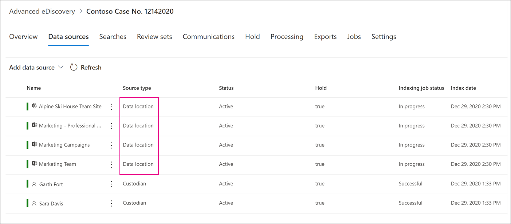

# Adicionar fontes de dados não custodiais a um Advanced eDiscovery caso

Em Advanced eDiscovery, nem sempre ele atendem às suas necessidades para associar uma fonte Microsoft 365 de dados a um custodiante no caso. Mas você ainda pode precisar associar esses dados a um caso para poder pesquisá-los, adicioná-los a um conjunto de revisão e analisá-los e revisá-los. O recurso no Advanced eDiscovery é  chamado de fontes de dados não custodiais e permite adicionar dados a uma ocorrência sem precisar associá-los a um custodiante. Ele também aplica a mesma Advanced eDiscovery a dados não custodiais que estão disponíveis para dados associados ao custodiante. Duas das coisas mais úteis que você pode aplicar a dados não custodiais é colocá-los em espera e processá-los usando [indexação avançada](indexing-custodian-data.md).

## Adicionar uma fonte de dados não custodiada

Siga estas etapas para adicionar e gerenciar fontes de dados não custodiais em um Advanced eDiscovery caso.

1. Na home **page Advanced eDiscovery,** clique no caso ao que deseja adicionar os dados.

2. Clique na **guia Fontes de** dados e clique em Adicionar fonte de **dados** Adicionar locais  >  **de dados**.

3. Na página **Sub-subsisão** Novos locais de dados não custodiados, escolha as fontes de dados que você deseja adicionar ao caso. Você pode adicionar várias caixas de correio e sites expandindo as seções **SharePoint** ou **Exchange** e clicando em **Editar**.

   

   - **SharePoint** - Clique **em Editar** para adicionar sites. Selecione um site na lista ou você pode pesquisar um site digitando a URL do site na barra de pesquisa. Selecione os sites que você deseja adicionar como fontes de dados não custodiadas e clique em **Adicionar**.

   - **Exchange** - Clique em **Editar** para adicionar caixas de correio. Digite um nome ou alias (no mínimo três caracteres) na caixa de pesquisa para caixas de correio ou grupos de distribuição. Selecione as caixas de correio que você deseja adicionar como fontes de dados não custodiadas e clique em **Adicionar**.

   > [!NOTE]
   > Você pode usar as seções **SharePoint** e **Exchange** para adicionar sites e caixas de correio associadas a uma equipe ou grupo Yammer como fontes de dados não custodiais. Você precisa adicionar separadamente a caixa de correio e o site associados a uma equipe ou Yammer grupo.

4. Depois de adicionar fontes de dados não custodiais, você tem a opção de colocar esses locais em espera ou não. Selecione ou desmarque a caixa de seleção **De** espera ao lado da fonte de dados para mantê-la em espera.

5. Clique **em Adicionar** na parte inferior da página **sub-subsisão** Novos locais de dados não custodiados para adicionar as fontes de dados ao caso.

   Cada fonte de dados não custodiada adicionada está listada na página **Fontes de** dados. Fontes de dados não custodiais são identificadas pelo valor **de local** de dados na coluna **Tipo de** origem.

   

Depois de adicionar fontes de dados não custodiais ao caso, um trabalho chamado *Reindexando* dados não custodiais é criado e exibido na guia **Trabalhos** do caso. Após a criação do trabalho, o processo de indexação avançada é iniciado e as fontes de dados são reindexadas.

## Gerenciar a responsabilidade para fontes de dados não custodiais

Depois de colocar uma suspensão em uma fonte de dados não custodial, uma política de suspensão que contém as fontes de dados não custodiadas para o caso é criada automaticamente. Quando você coloca outras fontes de dados não custodiais em espera, elas são adicionadas a essa política de ressaltou.

1. Abra a Advanced eDiscovery e selecione a **guia** Segurar.

2. Clique **em NCDSHold- \<GUID\>**, onde o valor GUID é exclusivo da ocorrência.

   A página do sub-uso exibe informações e estatísticas sobre as fontes de dados não custodiadas em espera.

   

3. Clique **em Editar espera** para exibir as fontes de dados não custodiais colocadas em espera e executar as seguintes tarefas de gerenciamento:

   - Na página **Locais,** você pode liberar uma fonte de dados não custodiada removendo-a da espera. Liberar uma fonte de dados não remove a fonte de dados não custodiada do caso. Ele remove apenas a espera que foi colocada na fonte de dados.

   - Na página **Consulta,** você pode editar a isenção para criar uma isenção baseada em consulta aplicada a todas as fontes de dados não custodiais no caso.
