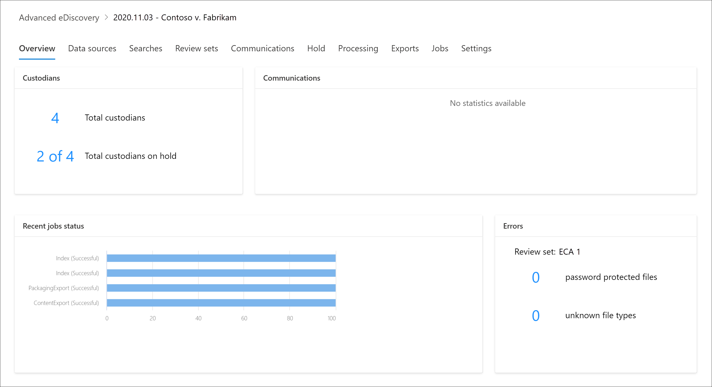

# Visão geral da Descoberta Avançada do Microsoft 365Overview of Microsoft 365 Advanced eDiscovery

A solução de Descoberta Técnica Avançada no Microsoft 365 se baseia nos recursos existentes de Descoberta e análise da Microsoft.The Advanced eDiscovery solution in Microsoft 365 builds on the existing Microsoft eDiscovery and analytics capabilities. A Descoberta Externa Avançada fornece um fluxo de trabalho de ponta a ponta para preservar, coletar, analisar, analisar, analisar e exportar conteúdo que responde às investigações internas e externas da sua organização.Advanced eDiscovery provides an end-to-end workflow to preserve, collect, analyze, review, analyze, and export content that's responsive to your organization's internal and external investigations. Ele também permite que as equipes legais gerenciem todo o fluxo de trabalho de notificação de responsabilidade legal para se comunicar com os custodiantes envolvidos em um caso.It also lets legal teams manage the entire legal hold notification workflow to communicate with custodians involved in a case.

A Descoberta Secreta Avançada pode ajudar sua organização a responder a questões legais ou investigações internas, descobrindo dados onde ela mora.Advanced eDiscovery can help your organization respond to legal matters or internal investigations by discovering data where it lives. Você pode gerenciar perfeitamente fluxos de trabalho de Descoberta Eletrônico identificando pessoas de interesse e suas fontes de dados, aplicar retém perfeitamente para preservar dados e gerenciar o processo de comunicação de responsabilidade legal.You can seamlessly manage eDiscovery workflows by identifying persons of interest and their data sources, seamlessly apply holds to preserve data, and then manage the legal hold communication process. Coletando dados da fonte, você pode pesquisar a plataforma do Microsoft 365 ao vivo para encontrar rapidamente o que precisa.By collecting data from the source, you can search the live Microsoft 365 platform to quickly find what you need. Recursos inteligentes de aprendizado de máquina, como indexação profunda, threading de email e detecção quase duplicada também ajudam a reduzir grandes volumes de dados para um conjunto de dados relevante.Intelligent, machine learning capabilities such as deep indexing, email threading, and near duplicate detection also help you reduce large volumes of data to a relevant data set.

As seções a seguir descrevem como esses recursos de Descoberta Avançada podem ajudar sua organização.The following sections describe how these Advanced eDiscovery capabilities can help your organization.

## Descobrir e coletar dados no localDiscover and collect data in-place

Tradicionalmente, as organizações que dependem de várias soluções de Descoberta EDiscover de terceiros exigem copiar grandes volumes de dados do Microsoft 365 para processar e ter que hospedar dados duplicados.Traditionally, organizations that rely on multiple third-party eDiscovery solutions require copying large volumes of data out of Microsoft 365 to process and having to host duplicate data. Essa necessidade aumenta o tempo para encontrar dados relevantes e o risco, o custo e a complexidade do gerenciamento de várias soluções.This necessity increases the time to find relevant data and the risk, cost, and complexity of managing multiple solutions.

A Descoberta Digital Avançada no Microsoft 365 permite que você descubra dados na origem e fique dentro do limite de segurança e conformidade do Microsoft 365.Advanced eDiscovery in Microsoft 365 lets you discover data at the source and staying within your Microsoft 365 security and compliance boundary.  Coletando dados in-loco do sistema ao vivo, a Descoberta Externa Avançada reduz o atrito de voltar à origem e reduz o trabalho desnecessário de ter que encontrar conteúdo ausente, o que geralmente acontece quando o diário atrasa em soluções tradicionais de Descoberta e.By collecting data in-place from the live system, Advanced eDiscovery reduces the friction of going back to the source and reduces unnecessary work of having to find missing content, which often happens when journaling lags in traditional eDiscovery solutions.

Recursos nativos de pesquisa e coleta de dados no Teams, Yammer, SharePoint Online, OneDrive for Business e Exchange Online aprimora ainda mais a descoberta de dados.Native search and collection capabilities for data in Teams, Yammer, SharePoint Online, OneDrive for Business, and Exchange Online further enhances data discovery. Por exemplo, Descoberta Avançada de EDiscovery:For example,  Advanced eDiscovery:

- Reconstrói conversas do Teams (em vez de retornar mensagens individuais de conversas).Reconstructs Teams conversations (instead of returning individual messages from conversations).

- Coleta conteúdo baseado em nuvem compartilhado com usuários por meio de links ou anexos modernos em mensagens de email e chats do Teams.Collects cloud-based content shared with users by use of links or modern attachments in email message and Teams chats.

- Tem suporte integrado para centenas de tipos de arquivos que não são do Microsoft 365.Has built-in support for hundreds of non-Microsoft 365 file types.

- Coleta dados de fontes de terceiros (como Bloomberg, Facebook, Slack e Reuniões de Zoom) que são importados e arquivados no Microsoft 365 por conectores [de dados.](archiving-third-party-data.md)Collects data from third-party sources (such as Bloomberg, Facebook, Slack, and Zoom Meetings) that's imported and archived in Microsoft 365 by [data connectors](archiving-third-party-data.md).

## Gerenciar fluxo de trabalho de Descoberta Eletrônico em uma plataformaManage eDiscovery workflow in one platform

A Descoberta Avançada pode ajudá-lo a reduzir o número de soluções de Descoberta eDiscovery em que você precisa confiar.Advanced eDiscovery can help you reduce the number of eDiscovery solutions you need to rely on. Ele fornece um fluxo de trabalho simplificado e de ponta a ponta, tudo o que ocorre no Microsoft 365.It provides a streamlined, end-to-end workflow, all which occurs within Microsoft 365. *A* Descoberta Automática Avançada ajuda a reduzir o atrito de identificar e coletar possíveis fontes de informações relevantes, mapeando automaticamente fontes de dados exclusivas e compartilhadas para a pessoa de interesse (conhecida como custodiante) e fornecendo relatórios e análises sobre dados potencialmente relevantes antes de colecioná-los para análise e revisão.Advanced eDiscovery helps reduce the friction of identifying and collecting potential sources of relevant information by automatically mapping unique and shared data sources to the person of interest (known as a *custodian*), and by providing reporting and analytics on potentially relevant data prior to collecting it for analysis and review.

Além disso, as APIs do Microsoft Graph podem ajudá-lo a automatizar o fluxo de trabalho de Descoberta Eletrônico e estender a Descoberta Automática Avançada para soluções personalizadas.Additionally, Microsoft Graph APIs can help you automate the eDiscovery workflow and extend Advanced eDiscovery for custom solutions.

## Fazer a coleta de dados de forma inteligenteCull data intelligently

Recursos inteligentes e de aprendizado de máquina na Descoberta Eletrônica Avançada ajudam a reduzir a quantidade de dados a ser revisto.Intelligent, machine learning capabilities in Advanced eDiscovery help you reduce the amount of data to review. Esses recursos inteligentes ajudam você a reduzir e a reduzir grandes volumes de dados para um conjunto relevante.These intelligent capabilities help you reduce and cull large volumes of data to a relevant set. Por exemplo, uma consulta de conjunto de revisão integrado ajuda a filtrar somente conteúdo exclusivo identificando quase duplicatas.For example, a built-in review set query helps filter only for unique content by identifying near duplicates. Essa funcionalidade pode reduzir substancialmente a quantidade de dados a ser revistada.This capability can substantially reduce the amount of data to review.

Recursos adicionais de aprendizado de máquina podem refinar e identificar dados relevantes usando marcas inteligentes e ferramentas de revisão assistidas por tecnologia, como os módulos de relevância.Additional machine learning capabilities can further refine and identify relevant data using smart tags and technology assisted review tools like the Relevance modules.

## Arquitetura avançada de Descoberta DesdiscoveryAdvanced eDiscovery architecture

Aqui está um diagrama de arquitetura de Descoberta Eletrônica Avançada que mostra o fluxo de trabalho de ponta a ponta em um ambiente de geo  único e em um ambiente multi-geo, e o fluxo de dados de ponta a ponta alinhado com o Modelo de Referência de Descoberta Eletrônica (EDRM).Here's an Advanced eDiscovery architecture diagram that shows the end-to-end workflow in a single-geo environment and in a multi-geo environment, and the end-to-end data flow that's aligned with the [Electronic Discovery Reference Model](advanced-ediscovery-edrm.md) (EDRM).

[Exibir como uma imagemView as an image](../media/solutions-architecture-center/m365-advanced-ediscovery-architecture.png)

[Baixar como um arquivo PDFDownload as a PDF file](https://download.microsoft.com/download/d/1/c/d1ce536d-9bcf-4d31-b75b-fcf0dc560665/m365-advanced-ediscovery-architecture.pdf)

[Baixar como um arquivo do VisioDownload as a Visio file](https://download.microsoft.com/download/d/1/c/d1ce536d-9bcf-4d31-b75b-fcf0dc560665/m365-advanced-ediscovery-architecture.vsdx)

Para obter mais informações sobre o fluxo de trabalho de ponta a ponta na Descoberta Digital Avançada, consulte este [vídeo do Microsoft Mechanics](https://go.microsoft.com/fwlink/?linkid=2066133).For more information about the end-to-end workflow in Advanced eDiscovery, see this [Microsoft Mechanics video](https://go.microsoft.com/fwlink/?linkid=2066133).

## Fluxo de trabalho avançado de Descoberta EletrônicoAdvanced eDiscovery workflow

As seções a seguir descrevem cada etapa do fluxo de trabalho integrado na ferramenta Descoberta Avançada da Descoberta Eletrônico no centro de conformidade do Microsoft 365.The following sections describe each step in the built-in workflow in the Advanced eDiscovery tool in the Microsoft 365 compliance center. A captura de tela a seguir mostra a guia **Visão** geral de um caso chamado *2020.11.03 - Contoso v. Fabrikam*.The following screenshot shows the **Overview** tab of a case named *2020.11.03 - Contoso v. Fabrikam*.

Para obter informações mais detalhadas, consulte [Manage the Advanced eDiscovery workflow](create-and-manage-advanced-ediscoveryv2-case.md#manage-the-workflow).For more detailed information, see [Manage the Advanced eDiscovery workflow](create-and-manage-advanced-ediscoveryv2-case.md#manage-the-workflow).

### Gerenciando custodiantes e fontes de dados não custodiaisManaging custodians and non-custodial data sources

Use a **guia** Fontes de dados para adicionar e gerenciar as pessoas que você identificou como pessoas de interesse no caso e outras fontes de dados que podem não estar associadas a um custodiante.Use the **Data sources** tab to add and manage the people that you've identified as persons of interest in the case and other data sources that may not be associated with a custodian. Quando você adiciona custodiantes ou fontes de dados não custodiais, você pode executar rapidamente ações como colocar uma reter legalidade em fontes de dados custodiantes e não custodiais, se comunicar com custodiantes e pesquisar fontes de dados custodiantes e não custodiais para coletar conteúdo relevante para o caso.When you add custodians or non-custodial data sources, you can quickly perform actions like placing a legal hold on custodian and non-custodial data sources, communicating with custodians, and searching custodian and non-custodial data sources to collect content that's relevant to the case. À medida que o caso progride, é fácil adicionar novos custodiantes ou fontes de data não custodiadas ou liberá-los do caso.As the case progresses, it's easy to add new custodians or non-custodial date sources or release them from the case. Para obter mais informações, consulte [Trabalhar com custodiantes](managing-custodians.md).For more information, see [Work with custodians](managing-custodians.md).

### Gerenciando notificações de espera legalManaging legal hold notifications

Use a **guia Comunicações** para gerenciar o processo de comunicação com os custodiantes no caso.Use the **Communications** tab to manage the process of communicating with the custodians in the case. Uma notificação de responsabilidade legal instrui os custodiantes a preservar qualquer conteúdo relevante para o caso.A legal hold notice instructs custodians to preserve any content that's relevant to the case. As equipes jurídicas devem ser capazes de rastrear os avisos que foram recebidos, lidos e reconhecidos pelos custodiantes.Legal teams must be able to track the notices that have been received, read, and acknowledged by custodians. O fluxo de trabalho de comunicações na Descoberta Eletrônica Avançada permite que você crie e envie notificações iniciais, lembretes, avisos de versão e escalonamentos se os custodiantes não confirmarem uma notificação de espera.The communications workflow in Advanced eDiscovery allows you to create and send initial notifications, reminders, release notices, and escalations if custodians fail to acknowledge a hold notification. Para obter mais informações, consulte [Trabalhar com comunicações](managing-custodian-communications.md).For more information, see [Work with communications](managing-custodian-communications.md).

### Gerenciando a preservação de conteúdoManaging content preservation

Quando você adiciona um custodiante a um caso, você pode colocar uma espera em dados de custodia.When you add a custodian to a case, you can place a hold on custodial data. Use a **guia De** espera para gerenciar a espera criada ao adicionar custodiantes e gerenciar outras ressarcições legais associadas ao caso; por exemplo, você pode identificar e colocar uma responsabilidade em fontes de dados não custodiais.Use the **Hold** tab to manage the hold created when you add custodians, and to manage other legal holds associated with the case; for example, you can identify and place a hold on non-custodial data sources. Você também pode editar qualquer ressarte no caso e torná-lo uma responsabilidade baseada em consulta para preservar apenas o conteúdo que corresponde à consulta.You can also edit any hold in the case and make it a query-based hold to preserve only the content that matches the query. Por exemplo, você pode adicionar um intervalo de datas à espera para que somente o conteúdo criado dentro de uma data específica seja preservado.For example, you could add a date range to the hold so that only content created within a specific date ranged in preserved. Você também pode obter estatísticas sobre o conteúdo que está em espera, remover a espera depois que ele não for mais relevante para o caso ou excluí-lo.You can also get statistics on content that's on hold, remove the hold after it's no longer relevant to the case, or delete it. Para obter mais informações, consulte [Gerenciar retém](managing-holds.md).For more information, see [Manage holds](managing-holds.md).

### Indexação de dados custodiadosIndexing custodian data

Quando você adiciona um custodiante e as fontes de dados custodiais correspondentes a um caso, qualquer item parcialmente indexado de uma fonte de dados custodiante é reindexado por um processo chamado *indexação avançada*.When you add a custodian and the corresponding custodial data sources to a case, any partially indexed item from a custodian data source is reindexed by a process called *Advanced indexing*. Isso permite que o conteúdo de custodia, como imagens, tipos de arquivos sem suporte e outro conteúdo potencialmente não índicedo, seja totalmente pesquisável quando você executar pesquisas para coletar dados para o caso.This allows custodial content such as images, unsupported file types, and other potentially unindexed content to be fully searchable when you run searches to collect data for the case. Use a **guia Processamento para** monitorar o status da indexação avançada e corrigir erros de processamento usando um processo chamado *correção de erro*.Use the **Processing** tab to monitor the status of Advanced indexing and fix processing errors by using a process called *error remediation*. Para obter mais informações, consulte [Corrigir erros de processamento.](processing-data-for-case.md)For more information, see [Fix processing errors](processing-data-for-case.md).

### Coletar dados de ocorrênciaCollecting case data

Use a **guia Pesquisas para** criar pesquisas para pesquisar as fontes de dados locais de custodia e não custodiante para conteúdo relevante para o caso.Use the **Searches** tab to create searches to search the in-place custodial and non-custodial data sources for content relevant to the case. Você pode criar e executar pesquisas baseadas em consulta (usando palavras-chave e condições) para identificar um conjunto de mensagens de email e documentos que são relevantes para o caso e que você deseja revisar e analisar mais adiante nas etapas subsequentes no fluxo de trabalho de Descoberta Eletrônico.You can create and run query-based searches (using keywords and conditions) to identify a set of email messages and documents that are relevant to the case and that you want to further review and analyze in subsequent steps in the eDiscovery workflow. Você pode criar uma ou mais pesquisas associadas ao caso.You can create one or more searches associated with the case. Você também pode usar a ferramenta de pesquisa para visualizar documentos de exemplo e exibir estatísticas de pesquisa para ajudá-lo a refinar e melhorar os resultados da pesquisa.You can also use the search tool to preview sample documents and view search statistics to help you refine and improve the search results. Depois de satisfeito, os resultados da pesquisa contêm todos os dados relevantes para o caso, você adiciona os resultados da pesquisa a um conjunto de revisão para revisão, análise e avaliação adicionais.After you're satisfied the search results contain the all data relevant to the case, you add the search results to a review set for further review, analysis, and culling. Para obter mais informações, consulte [Coletar dados para um caso](collecting-data-for-ediscovery.md).For more information, see [Collect data for a case](collecting-data-for-ediscovery.md).

### Analisar e analisar dados de casoReviewing and analyzing case data

Use a **guia Conjuntos de** revisão para analisar e analisar o conteúdo coletado do sistema ao vivo e adicionado a um conjunto de revisão.Use the **Review sets** tab to review and analyze the content you've collected from the live system and added to a review set. Um *conjunto* de revisão é uma coleção estática desses dados (em outras palavras, uma cópia offline de dados) de dados custodiais (e, se aplicável, dados não custodiais) coletados na fase anterior do fluxo de trabalho de Descoberta Eletrônico.A *review set* is a static collection of that data (in other words, an offline copy of data) of custodial data (and, if applicable, non-custodial data) that you collected in the previous phase of the eDiscovery workflow. Quando você adiciona resultados de pesquisa a um conjunto de revisão, um processo é disparado para extrair arquivos de contêineres, extrair metadados e extrair texto.When you add search results to a review set, a process is triggered to extract files from containers, extract metadata, and extract text. Quando esse processo é concluído, o sistema cria um novo índice de todos os dados coletados dos custodiantes e os adiciona ao conjunto de revisão.When this process is complete, the system builds a new index of all the data collected from custodians and adds it to the review set. Depois que os dados são adicionados ao conjunto de revisão, você pode executar mais consultas para restringir os dados de caso, exibir dados como texto ou no formato de arquivo nativo e anotar, redactar e marcar documentos no conjunto de revisão.After the data is added to the review set, you can run more queries to narrow the case data, view data as text or in the native file format, and annotate, redact, and tag documents in the review set. Você também pode executar análises avançadas, como identificar duplicação de documentos, threading de email e temas.You can also perform advanced analytics, such as identifying document duplication, email threading, and themes. Depois de ter coletado os dados apenas para o que é relevante para o caso, você pode baixar documentos diretamente ou exportá-los junto com metadados de arquivo, anotações e todas as marcas.After you've culled the data to only what is relevant to the case, you can either download documents directly or export them along with file metadata, annotations, and any tags. Para mais informações, confira:For more information, see:

- [Exibir documentos em um conjunto de revisãoView documents in a review set](view-documents-in-review-set.md)

- [Consultar os dados em um conjunto de revisãoQuery the data in a review set](review-set-search.md)

- [Marcar documentos em um conjunto de revisãoTag documents in a review set](tagging-documents.md)

- [Analisar dados em um conjunto de revisãoAnalyze data in a review set](analyzing-data-in-review-set.md)

### Exportando dados para revisão e apresentaçãoExporting data for review and presentation

Depois de exportar os dados de um conjunto de revisão, use a guia **Exportações** para gerenciar um trabalho de exportação e baixar dados de um conjunto de revisão.After you export the data from a review set, use the **Exports** tab to manage an export job and download data from a review set. Quando você exporta um conjunto de revisão, os dados são carregados para um local de Armazenamento do Azure fornecido pela Microsoft (ou um local de Armazenamento do Azure gerenciado pela sua organização).When you export a review set, the data is uploaded to a Microsoft-provided Azure Storage location (or an Azure Storage location managed by your organization). Depois de carregado no Azure, ele estará disponível para download em um computador local.After it's uploaded to Azure, it's then and available to download to a local computer. Você pode obter a chave de avaliação de armazenamento necessária para baixar os dados exportados na **guia Exportações.** Para obter mais informações, consulte [Exportar dados de caso](exporting-data-ediscover20.md).You can obtain the storage assess key necessary to download the exported data on the **Exports** tab. For more information, see [Export case data](exporting-data-ediscover20.md).

### Gerenciando trabalhosManaging jobs

Use a **guia Trabalhos** para monitorar processos de execução longa para tarefas relacionadas a caso iniciadas.Use the **Jobs** tab to monitor long-running processes for case-related tasks that you've initiated. Exemplos de trabalhos incluem aqueles relacionados à reindexação, pesquisa e exportação de dados de caso.Examples of jobs include ones related to reindexing, searching, and exporting case data. Por exemplo, se você criar  uma pesquisa na guia Pesquisas que inclui muitas fontes de dados, o status desse processo de pesquisa será exibido na guia **Trabalhos.** Para obter mais informações, consulte [Gerenciar trabalhos](managing-jobs-ediscovery20.md).For example, if you create a search on the **Searches** tab that includes many data sources, the status of this search process will be displayed on the **Jobs** tab. For more information, see [Manage jobs](managing-jobs-ediscovery20.md).

### Configurando configurações de casoConfiguring case settings

Use a **guia Configurações** para definir configurações em toda a ocorrência.Use the **Settings** tab to configure case-wide settings. Isso inclui adicionar membros a uma ocorrência, fechar ou excluir uma ocorrência e configurar configurações de pesquisa e análise.This includes adding members to a case, closing or deleting a case, and configuring search and analytics settings. Para mais informações, confira:For more information, see:

- [Adicionar membros a uma ocorrênciaAdd members to a case](add-or-remove-members-from-a-case-in-advanced-ediscovery.md)

- [Fechar ou excluir uma ocorrênciaClose or delete a case](close-or-delete-case.md)

- [Definir configurações de pesquisa e análiseConfigure search and analytics settings](configure-search-and-analytics-settings-in-advanced-ediscovery.md)
