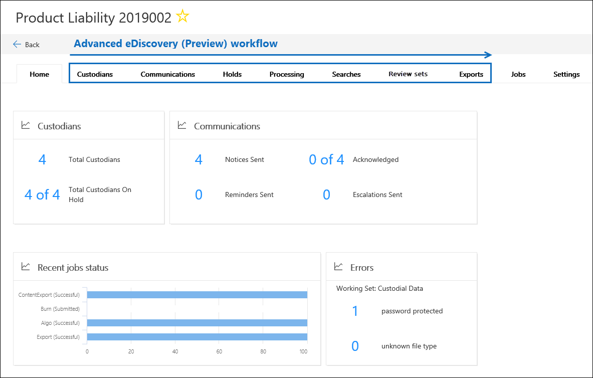

# Visão geral da solução de descoberta eletrônica avançada no Microsoft 365Overview of the Advanced eDiscovery solution in Microsoft 365

A solução de descoberta eletrônica avançada no Microsoft 365 baseia-se nos recursos de descoberta eletrônica e análise existentes no Office 365.The Advanced eDiscovery solution in Microsoft 365 builds on the existing eDiscovery and analytics capabilities in Office 365. Essa nova solução, chamada de *descoberta eletrônica avançada*, fornece um fluxo de trabalho de ponta a ponta para preservar, coletar, analisar, analisar e exportar conteúdo que responde às investigações internas e externas da sua organização.This new solution, called *Advanced eDiscovery*, provides an end-to-end workflow to preserve, collect, review, analyze, and export content that's responsive to your organization's internal and external investigations. Também permite que as equipes jurídicas gerenciem todo o fluxo de trabalho de notificação de retenção legal para se comunicarem com os responsáveis envolvidos em um caso.It also lets legal teams manage the entire legal hold notification workflow to communicate with custodians involved in a case. 

## Alinhamento com EDRMAlignment with EDRM

O fluxo de trabalho interno de descoberta eletrônica avançada se alinha com o processo de descoberta eletrônica descrito pelo modelo de referência de descoberta eletrônica (EDRM).The built-in workflow of Advanced eDiscovery aligns with the eDiscovery process outlined by the Electronic Discovery Reference Model (EDRM). 

(Imagem de origem cortesia de edrm.net.(Image source courtesy of edrm.net. A imagem de origem foi disponibilizada sob a licença do Creative Commons 3,0 Unported License.)The source image was made available under Creative Commons Attribution 3.0 Unported License.)

Em um nível alto, veja como a descoberta eletrônica avançada é compatível com o fluxo de trabalho do EDRM:At a high level, here's how Advanced eDiscovery supports the EDRM workflow:

- **Identificador.****Identification.** Após identificar as possíveis pessoas de interesse em uma investigação, você poderá adicioná-las como responsáveis (também chamados de *responsáveis por dados*, pois elas podem ter informações relevantes para a investigação) a uma ocorrência de descoberta eletrônica avançada.After you identify potential persons of interest in an investigation, you can add them as custodians (also called *data custodians*, because they may possess information that's relevant to the investigation) to an Advanced eDiscovery case. Depois que os usuários são adicionados como responsáveis, é fácil preservar, coletar e revisar documentos de responsáveis.After users are added as custodians, it's easy to preserve, collect, and review custodian documents.

- **Preservação.****Preservation.** Para preservar e proteger dados relevantes para uma investigação, a descoberta eletrônica avançada permite que você coloque um controle legal nas fontes de dados associadas aos responsáveis em um caso.To preserve and protect data that's relevant to an investigation, Advanced eDiscovery lets you place a legal hold on the data sources associated with the custodians in a case. Você também pode colocar dados não custodial em espera.You can also place non-custodial data on hold. A descoberta eletrônica avançada também tem um fluxo de trabalho de comunicações interno para que você possa enviar notificações de retenção legal para os responsáveis e controlar suas confirmações.Advanced eDiscovery also has a built-in communications workflow so you can send legal hold notifications to custodians and track their acknowledgments.

- **Coletânea.****Collection.** Depois de identificar (e preservar) as fontes de dados relevantes para a investigação, você pode usar a ferramenta de pesquisa interna na pesquisa de descoberta eletrônica avançada e coletar dados ao vivo das fontes de dados do custodial (e fontes de dados não-custodial, se aplicável) que pode ser relevante para o caso.After you identified (and preserved) the data sources relevant to the investigation, you can use the built-in search tool in Advanced eDiscovery search for and collect live data from the custodial data sources (and non-custodial data sources, if applicable) that may be relevant to the case.

- **Processe.****Processing.** Após coletar todos os dados relevantes para o caso, a próxima etapa será processá-lo para revisão e análise mais detalhada.After you've collected all data relevant to the case, the next step is process it for further review and analysis. Na descoberta eletrônica avançada, os dados no local que você identificou na fase de coleta são copiados para um local de armazenamento do Azure (chamado de *conjunto de revisão*), que fornece uma exibição estática dos dados de caso.In Advanced eDiscovery, the in-place data that you identified in the collection phase is copied to an Azure Storage location (called a *review set*), which provides you with a static view of the case data. 
 
- **Exame.****Review.** Depois que os dados forem adicionados a um conjunto de revisão, você poderá exibir documentos específicos e executar outras consultas para reduzir os dados para o que é mais relevante para o caso.After data has been added to a review set, you can view specific documents and run another queries to reduce the data to what is most relevant to the case. Além disso, pode anotar e marcar documentos específicos.Also, can annotate and tag specific documents.
 
- **Analisa.****Analysis.** A descoberta eletrônica avançada fornece uma ferramenta de análise integrada que ajuda você a buscar mais dados do conjunto de revisão que você determinar não é relevante para a investigação.Advanced eDiscovery provides integrated analytics tool that helps you further cull data from the review set that you determine isn't relevant to the investigation. Além de reduzir o volume de dados relevantes, a descoberta eletrônica avançada também ajuda você a salvar os custos de análise jurídica, permitindo que você organize o conteúdo para tornar o processo de revisão mais fácil e eficiente.In addition to reducing the volume of relevant data, Advance eDiscovery also helps you save legal review costs by letting you organize content to make the review process easier and more efficient.

- **Produção** e **apresentação.****Production** and **Presentation.** Quando estiver pronto, você pode exportar documentos de um conjunto de revisão para análise jurídica.When you're ready, you can export documents from a review set for legal review. Você pode exportar documentos em seu formato nativo ou em um formato especificado pelo EDRM para que eles possam ser importados para aplicativos de revisão de terceiros.You can export documents in their native format or in an EDRM-specified format so they can be imported into third-party review applications.

## Fluxo de trabalho de descoberta eletrônica avançadaAdvanced eDiscovery workflow

As seções a seguir descrevem cada etapa no fluxo de trabalho interno na descoberta eletrônica avançada.The following sections describe each step in the built-in workflow in Advanced eDiscovery. A captura de tela a seguir mostra a guia **página inicial** de uma ocorrência chamada *responsabilidade do produto 2019002*.The following screenshot shows the **Home** tab of a case named *Product Liability 2019002*. Observação as guias de fluxo de trabalho na parte superior da página são sequenciadas para alinhar-se com o processo EDRM.Note the workflow tabs at the top of the page are sequenced to align with the EDRM process. 

Para obter mais informações sobre o fluxo de trabalho de ponta a ponta na descoberta eletrônica avançada, consulte este [vídeo da Microsoft mecânica](https://go.microsoft.com/fwlink/?linkid=2066133).For more information about the end-to-end workflow in Advanced eDiscovery, see this [Microsoft Mechanics video](https://go.microsoft.com/fwlink/?linkid=2066133). 

## Gerenciando os responsáveisManaging custodians

Use a guia **responsáveis** para adicionar e gerenciar as pessoas que você identificou como pessoas de interesse no caso.Use the **Custodians** tab to add and manage the people that you've identified as persons of interest in the case. Ao adicionar os responsáveis, você pode executar rapidamente ações relacionadas a responsáveis, como colocar um controle legal nas fontes de dados do Object, comunicar-se com os responsáveis e Pesquisar fontes de dados do mesmo para coletar conteúdo relevante para o caso.When you add custodians, you can quickly perform custodian-related actions like placing a legal hold on custodian data sources, communicating with custodians, and searching custodian data sources to collect content that's relevant to the case. À medida que o caso avança, é fácil adicionar novos responsáveis ou liberar responsáveis da ocorrência.As the case progresses, it's easy to add new custodians or release custodians from the case. Para obter mais informações, consulte [trabalhar com os responsáveis na descoberta eletrônica avançada](managing-custodians.md).For more information, see [Work with custodians in Advanced eDiscovery](managing-custodians.md).

## Gerenciando notificações de retenção legalManaging legal hold notifications

Use a guia **comunicações** para gerenciar o processo de comunicação com os responsáveis no caso.Use the **Communications** tab to manage the process of communicating with the custodians in the case. Um aviso de retenção legal instrui os responsáveis a preservar qualquer conteúdo que seja relevante para o caso.A legal hold notice instructs custodians to preserve any content that's relevant to the case. As equipes jurídicas devem ser capazes de rastrear os avisos que foram recebidos, lidos e confirmados por responsáveis.Legal teams must be able to track the notices that have been received, read, and acknowledged by custodians. O fluxo de trabalho de comunicações em descoberta eletrônica avançada permite que você crie e envie notificações iniciais, lembretes, avisos de lançamento e escalonamentos se os responsáveis não conseguirem confirmar uma notificação de bloqueio.The communications workflow in Advanced eDiscovery allows you to create and send initial notifications, reminders, release notices, and escalations if custodians fail to acknowledge a hold notification. Para obter mais informações, consulte [trabalhar com comunicações na descoberta eletrônica avançada](managing-custodian-communications.md).For more information, see [Work with communications in Advanced eDiscovery](managing-custodian-communications.md).

## Gerenciando preservação de conteúdoManaging content preservation

Ao adicionar um membro a um caso, você pode colocar uma retenção em dados de custodial.When you add a custodian to a case, you can place a hold on custodial data. Use a guia **isenções** para gerenciar a retenção criada ao adicionar os responsáveis e para gerenciar outros bloqueios legais associados ao caso; por exemplo, você pode identificar e colocar uma retenção em fontes de dados não custodial.Use the **Holds** tab to manage the hold created when you add custodians, and to manage other legal holds associated with the case; for example, you can identify and place a hold on non-custodial data sources. Você também pode editar qualquer isenção no caso e torná-lo um bloqueio baseado em consulta para preservar apenas o conteúdo que corresponde à consulta.You can also edit any hold in the case and make it a query-based hold to preserve only the content that matches the query. Por exemplo, você pode adicionar um intervalo de datas à isenção para que apenas o conteúdo criado em uma data específica seja rangedo em preservado.For example, you could add a date range to the hold so that only content created within a specific date ranged in preserved. Você também pode obter estatísticas sobre o conteúdo que está em espera, remover a retenção após ela não ser mais relevante para o caso ou excluí-la.You can also get statistics on content that's on hold, remove the hold after it's no longer relevant to the case, or delete it. Para obter mais informações, consulte [gerenciar isenções na descoberta eletrônica avançada](managing-holds.md).For more information, see [Manage holds in Advanced eDiscovery](managing-holds.md).

## Indexando dados de responsáveisIndexing custodian data

Quando você adiciona um Objecte as fontes de dados do custodial correspondentes a um caso, qualquer item parcialmente indexado de uma fonte de dados do responsáveis é re-indexado por um processo chamado *indexação avançada*.When you add a custodian and the corresponding custodial data sources to a case, any partially indexed item from a custodian data source is re-indexed by a process called *Advanced indexing*. Isso permite que o conteúdo do custodial, como imagens, tipos de arquivo não suportados, e outro conteúdo potencialmente não indexado seja totalmente pesquisável quando você executar pesquisas para coletar dados para o caso.This allows custodial content such as images, unsupported file types, and other potentially unindexed content to be fully searchable when you run searches to collect data for the case. Use a guia **processamento** para monitorar o status de erros de indexação avançada e de processamento de correção usando um processo chamado *correção de erros*.Use the **Processing** tab to monitor the status of Advanced indexing and fix processing errors by using a process called *error remediation*. Para obter mais informações, consulte [corrigir erros de processamento em descoberta eletrônica avançada](processing-data-for-case.md).For more information, see [Fix processing errors in Advanced eDiscovery](processing-data-for-case.md).

## Coletar dados de ocorrênciaCollecting case data

Use a guia **pesquisas** para criar pesquisas para pesquisar as fontes de dados custodial e não-custodial no local no Office 365 para o conteúdo relevante para o caso.Use the **Searches** tab to create searches to search the in-place custodial and non-custodial data sources in Office 365 for content relevant to the case. Você pode criar e executar pesquisas baseadas em consulta (usando palavras-chave e condições) para identificar um conjunto de mensagens e documentos de email que são relevantes para o caso e que você deseja revisar e analisar em etapas subsequentes no fluxo de trabalho de descoberta eletrônica.You can create and run query-based searches (using keywords and conditions) to identify a set of email messages and documents that are relevant to the case and that you want to further review and analyze in subsequent steps in the eDiscovery workflow. Você pode criar uma ou mais pesquisas associadas à ocorrência.You can create one or more searches associated with the case. Você também pode usar a ferramenta de pesquisa para visualizar documentos de amostra e exibir estatísticas de pesquisa para ajudá-lo a refinar e aprimorar os resultados da pesquisa.You can also use the search tool to preview sample documents and view search statistics to help you refine and improve the search results. Depois que você estiver satisfeito com os resultados da pesquisa contiver todos os dados relevantes para o caso, adicione os resultados da pesquisa a um conjunto de revisão para análise, análise e remoção posterior.After you're satisfied the search results contain the all data relevant to the case, you add the search results to a review set for further review, analysis, and culling. Para obter mais informações, consulte [coletar dados por um caso na descoberta eletrônica avançada](collecting-data-for-ediscovery.md).For more information, see [Collect data for a case in Advanced eDiscovery](collecting-data-for-ediscovery.md).

## Revisando e analisando dados de casoReviewing and analyzing case data

Use a guia **conjuntos de revisão** para analisar e analisar o conteúdo que você coletou do sistema em tempo real e adicionado a um conjunto de revisão.Use the **Review sets** tab to review and analyze the content that you've collected from the live system and added to a review set. Um *conjunto de revisão* é uma coleção estática desses dados (em outras palavras, uma cópia offline de dados) de dados do custodial (e, se aplicável, dados não custodial) que você coletou na fase anterior do fluxo de trabalho de descoberta eletrônica.A *review set* is a static collection of that data (in other words, an offline copy of data) of custodial data (and if applicable, non-custodial data) that you collected in the previous phase of the eDiscovery workflow. Quando você adiciona resultados de pesquisa a um conjunto de revisão, um processo é disparado que extrai arquivos de contêineres, extrai metadados e extrai texto.When you add search results to a review set, a process is triggered that extracts files from containers, extracts metadata, and extracts text. Quando esse processo é concluído, o sistema cria um novo índice de todos os dados coletados de responsáveis e os adiciona ao conjunto de revisão.When this process is complete, the system builds a new index of all the data collected from custodians and adds it to the review set. Depois que os dados são adicionados ao conjunto de revisão, você pode executar mais consultas para restringir os dados de caso, exibir dados como texto ou no formato de arquivo nativo, e anotar, redigir e marcar documentos no conjunto de revisão.After the data is added to the review set, you can run more queries to narrow the case data, view data as text or in the native file format, and annotate, redact, and tag documents in the review set. Você também pode executar análises avançadas, como identificar duplicação de documentos, threads de email e temas.You can also perform advanced analytics such as identify document duplication, email threading, and themes. Após a remoção dos dados para o que for relevante para o caso, você pode baixar documentos diretamente ou exportá-los junto com metadados, anotações e marcas de arquivo.After you've culled the data to only what is relevant to the case, you can either download documents directly or export them along with file metadata, annotations, and any tags. Para saber mais, veja:For more information, see:

- [Exibir documentos em um conjunto de revisãoView documents in a review set](view-documents-in-review-set.md)

- [Consultar os dados em um conjunto de revisãoQuery the data in a review set](review-set-search.md)

- [Marcar documentos em um conjunto de revisãoTag documents in a review set](tagging-documents.md)

- [Analisar dados em um conjunto de revisãoAnalyze data in a review set](analyzing-data-in-review-set.md)

## Exportando dados para revisão e apresentaçãoExporting data for review and presentation

Depois de exportar os dados de um conjunto de revisão, use a guia **exportações** para gerenciar um trabalho de exportação e baixar dados de um conjunto de revisão.After you export the data from a review set, use the **Exports** tab to manage an export job and download data from a review set. Quando um conjunto de análise é exportado, os dados são carregados para um local de armazenamento fornecido pela Microsoft (ou um local de armazenamento do Azure gerenciado por sua organização).When you export a review set, the data is uploaded to a Microsoft-provided Azure Storage location (or an Azure Storage location managed by your organization). Após ser carregado para o Azure, ele é e está disponível para download para um computador local.After it's uploaded to Azure, it's then and available to download to a local computer. Você pode obter a chave de avaliação de armazenamento necessária para baixar os dados exportados **na guia exportações** . Para obter mais informações, consulte [exportar dados de caso na descoberta eletrônica avançada](exporting-data-ediscover20.md).You can obtain the storage assess key necessary to download the exported data on the **Exports** tab. For more information, see [Export case data in Advanced eDiscovery](exporting-data-ediscover20.md).

## Gerenciando trabalhosManaging jobs

Use a guia **trabalhos** para monitorar processos de execução longa para tarefas relacionadas a casos que você tenha iniciado.Use the **Jobs** tab to monitor long-running processes for case-related tasks that you've initiated. Entre os exemplos de trabalhos estão relacionados à reindexação, pesquisa e exportação de dados de caso.Examples of jobs include ones related to reindexing, searching, and exporting case data. Por exemplo, se você criar uma pesquisa na guia **pesquisas** que inclui várias fontes de dados, o status desse processo de pesquisa será exibido na guia **trabalhos** . Para obter mais informações, consulte [gerenciar trabalhos na descoberta eletrônica avançada](managing-jobs-ediscovery20.md).For example, if you create a search on the **Searches** tab that includes many data sources, the status of this search process will be displayed on the **Jobs** tab. For more information, see [Manage jobs in Advanced eDiscovery](managing-jobs-ediscovery20.md).

## Configurando as configurações de casoConfiguring case settings

Use a guia **configurações** para definir as configurações em todo o caso.Use the **Settings** tab to configure case-wide settings. Isso inclui adicionar membros a um caso, fechar ou excluir uma ocorrência e definir as configurações de pesquisa e análise.This includes adding members to a case, closing or deleting a case, and configuring search and analytics settings.

## Relatórios de descoberta eletrônica avançadaAdvanced eDiscovery reports

Você pode usar os relatórios de descoberta eletrônica avançada na home page para ajudar sua organização a controlar a atividade e o status em todos os casos de descoberta eletrônica avançada.You can use the Advanced eDiscovery reports on the home page to help your organization track activity and status across all Advanced eDiscovery cases. O recurso relatórios de descoberta eletrônica avançada agrega informações sobre casos, responsáveis, fontes de dados e comunicações.The Advanced eDiscovery reports feature aggregates information about cases, custodians, data sources, and communications. Você pode filtrar os dados do relatório com base em vários critérios e exportar as informações agregadas para um arquivo CSV para análise adicional.You can filter the report data based on various criteria and export the aggregated information to a CSV file for further analysis.  Para obter mais informações, consulte [relatórios de descoberta eletrônica avançados](advanced-ediscovery-reports.md).For more information, see [Advanced eDiscovery reports](advanced-ediscovery-reports.md).
