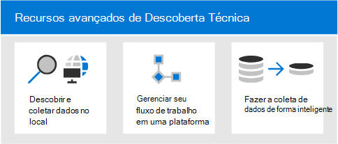
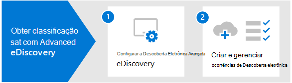

# Visão geral do Microsoft 365 Advanced eDiscovery

A Advanced eDiscovery em Microsoft 365 se baseia nos recursos existentes de Descoberta e análise da Microsoft. Advanced eDiscovery fornece um fluxo de trabalho de ponta a ponta para preservar, coletar, analisar, revisar e exportar conteúdo que responde às investigações internas e externas da sua organização. Ele também permite que sua equipe jurídica gerencie todo o fluxo de trabalho de notificação de responsabilidade para se comunicar com pessoas envolvidas no caso.

## Advanced eDiscovery recursos

Advanced eDiscovery pode ajudar sua organização a responder a questões legais ou investigações internas, descobrindo dados onde ela mora. Você pode gerenciar perfeitamente fluxos de trabalho de Descoberta Eletrônico identificando pessoas de interesse e suas fontes de dados, aplicar retém perfeitamente para preservar dados e gerenciar o processo de comunicação de responsabilidade legal. Coletando dados da fonte, você pode pesquisar a plataforma Microsoft 365 live para encontrar rapidamente o que precisa. Recursos inteligentes de aprendizado de máquina, como indexação profunda, threading de email e detecção quase duplicada também ajudam a reduzir grandes volumes de dados para um conjunto de dados relevante.

As seções a seguir descrevem como esses recursos Advanced eDiscovery podem ajudar sua organização.

### Descobrir e coletar dados no local

Tradicionalmente, as organizações que dependem de várias soluções de Descoberta eDiscovery de terceiros exigem copiar grandes volumes de dados de Microsoft 365 para processar e ter que hospedar dados duplicados. Essa necessidade aumenta o tempo para encontrar dados relevantes e o risco, o custo e a complexidade do gerenciamento de várias soluções.

Advanced eDiscovery em Microsoft 365 permite que você descubra dados na origem e fique dentro do limite Microsoft 365 segurança e conformidade.  Coletando dados in-loco do sistema ao vivo, o Advanced eDiscovery reduz o atrito de voltar para a origem e reduz o trabalho desnecessário de ter que encontrar conteúdo ausente, o que geralmente acontece quando o diário atrasa em soluções tradicionais de Descoberta e.

Recursos nativos de pesquisa e coleta de dados em Teams, Yammer, SharePoint Online, OneDrive for Business e Exchange Online aprimora ainda mais a descoberta de dados. Por exemplo, Advanced eDiscovery:

- Reconstrói Teams conversas (em vez de retornar mensagens individuais de conversas).

- Coleta conteúdo baseado em nuvem compartilhado com usuários por meio de links ou anexos modernos em mensagens de email e Teams chats.

- Tem suporte integrado para centenas de tipos de arquivos que não Microsoft 365 de uso.

- Coleta dados de fontes de terceiros (como Bloomberg, Facebook, Slack e Reuniões de Zoom) que são importados e arquivados no Microsoft 365 por conectores [de dados](archiving-third-party-data.md).

### Gerenciar fluxo de trabalho de Descoberta Eletrônico em uma plataforma

Advanced eDiscovery pode ajudá-lo a reduzir o número de soluções de Descoberta De eDiscovery em que você precisa confiar. Ele fornece um fluxo de trabalho simplificado, de ponta a ponta, tudo o que ocorre dentro Microsoft 365. Advanced eDiscovery ajuda *a* reduzir o atrito de identificar e coletar possíveis fontes de informações relevantes, mapeando automaticamente fontes de dados exclusivas e compartilhadas para a pessoa de interesse (conhecida como custodiante) e fornecendo relatórios e análises sobre dados potencialmente relevantes antes de colecioná-los para análise e revisão.

Além disso, as APIs Graph Microsoft podem ajudá-lo a automatizar o fluxo de trabalho de Descoberta Eletrônico e estender Advanced eDiscovery para soluções personalizadas.

### Fazer a coleta de dados de forma inteligente

Recursos inteligentes e de aprendizado de máquina em Advanced eDiscovery ajudar você a reduzir a quantidade de dados a revisar. Esses recursos inteligentes ajudam você a reduzir e a reduzir grandes volumes de dados para um conjunto relevante. Por exemplo, uma consulta de conjunto de revisão integrado ajuda a filtrar somente conteúdo exclusivo identificando quase duplicatas. Essa funcionalidade pode reduzir substancialmente a quantidade de dados a ser revistada.

Recursos adicionais de aprendizado de máquina podem refinar e identificar dados relevantes usando marcas inteligentes e ferramentas de revisão assistidas por tecnologia, como os módulos de relevância.

## Advanced eDiscovery alinhamento com o Modelo de Referência de Descoberta Eletrônica

O fluxo de trabalho integrado de Advanced eDiscovery em Microsoft 365 se alinha ao processo de Descoberta Eletrônica descrito pelo Modelo de Referência de Descoberta Eletrônica (EDRM).

(Fonte de imagem cortesia da edrm.net. A imagem de origem foi disponibilizada em Creative Commons Attribution 3.0 Unported License.)

Em um nível alto, veja como a Descoberta Eletrônico Avançada dá suporte ao fluxo de trabalho de EDRM:

- **Identificação.** Depois de identificar possíveis pessoas de interesse em uma investigação, você poderá adicioná-las como custodiantes (também chamadas de *custodiantes de dados*, pois elas podem possuir informações relevantes para a investigação) a um caso de Descoberta Pública Avançada. Depois que os usuários são adicionados como custodiantes, é fácil preservar, coletar e revisar documentos sob medida.

- **Preservação.** Para preservar e proteger os dados relevantes a uma investigação, a Descoberta Avançada e o 2016 permite colocar um ponto de espera legal nas fontes de dados associadas aos custodiantes de um caso. Você também pode colocar dados não custodiais em espera. A Descoberta Eletrônica Avançada também tem um fluxo de trabalho de comunicações internas para que você possa enviar notificações de responsabilidade para custodiantes e controlar suas confirmações.

- **Coleção.** Depois de ter identificado (e preservado) as fontes de dados relevantes para a investigação, você poderá usar a ferramenta de pesquisa interna na Pesquisa Avançada de Descoberta Online e coletar dados em tempo vivo das fontes de dados custodiais (e de fontes de dados não custodiais, se aplicável) que possam ser relevantes para o caso.

- **Processamento.** Depois de coletar todos os dados relevantes para o caso, a próxima etapa é processá-los para revisão e análise posteriores. Na Descoberta Avançada, os dados in-loco identificados na fase de coleta são copiados para um local de Armazenamento do Azure (chamado de *conjunto de revisão*), que fornece uma exibição estática dos dados do caso. 

- **Revisão.** Depois que os dados foram adicionados a um conjunto de revisão, você pode exibir documentos específicos e executar consultas adicionais para reduzir os dados ao que é mais relevante para o caso. Além disso, pode fazer anotações e marcar documentos específicos.

- **Análise.** A Descoberta Eletrônica Avançada Online fornece uma ferramenta de análise integrada que ajuda você a se basear ainda mais nos dados do conjunto de revisão que você determina que não são relevantes para a investigação. Além de reduzir o volume de dados relevantes, a Descoberta Eletrônica Avançada também ajuda a economizar custos de revisão legal, deixando-o organizar o conteúdo para tornar o processo de revisão mais fácil e eficiente.

- **Produção** e **Apresentação.** Quando estiver pronto, você poderá exportar documentos de uma revisão definida para revisão legal. Você pode exportar documentos no formato nativo ou em um formato especificado pelo EDRM para que possam ser importados para aplicativos de revisão de terceiros.

## Assinaturas e licenciamento

O licenciamento para Advanced eDiscovery requer a assinatura da organização apropriada e o licenciamento por usuário.

- **Assinatura da organização:** Para acessar Advanced eDiscovery no Centro de conformidade do Microsoft 365, sua organização deve ter um dos seguintes:

  - Assinatura do Microsoft 365 E5 ou do Office 365 E5
  
  - Assinatura do Microsoft 365 E3 com complemento de Conformidade E5

  - Microsoft 365 E3 assinatura com o complemento E5 eDiscovery and Audit

  - Microsoft 365 Education Assinatura A5 ou Office 365 Education A5

   Se você não tiver um plano de Microsoft 365 E5 existente e quiser tentar  Advanced eDiscovery, poderá adicionar Microsoft 365 à  sua assinatura existente ou inscrever-se para uma avaliação de Microsoft 365 E5.

- **Licenciamento por usuário:** Para adicionar um usuário como um custodiante em um caso de Descoberta Antecipada, esse usuário deve ter uma das seguintes licenças, dependendo da assinatura da sua organização:

  - Microsoft 365: os usuários devem ter uma licença de Microsoft 365 E5, uma licença de complemento de Conformidade E5 ou uma licença de complemento de Descoberta E5 e Auditoria. Microsoft 365 Education os usuários devem ter uma licença A5.

  - Office 365: os usuários devem ter uma licença Office 365 E5 ou Office 365 Education A5.

   Para obter informações sobre como atribuir licenças, consulte [Assign licenses to users](/microsoft-365/admin/manage/assign-licenses-to-users).

> [!NOTE]
> Os usuários só precisam de uma licença E5 ou A5 (ou a licença de complemento apropriada) para serem adicionados como custodiantes a uma Advanced eDiscovery caso. Os administradores de TIs, gerentes de Descoberta De eDiscovery, advogados, paralegales ou investigadores que usam o Advanced eDiscovery para gerenciar casos e revisar dados de caso não precisam de uma licença E5, A5 ou complemento.

## Introdução à Descoberta Eletrônica Avançada

Há duas etapas rápidas e fáceis para começar a Advanced eDiscovery.

|Etapas  |Descrição  |
|:---------|:---------|
|[Configurar a Descoberta Eletrônica Avançada](get-started-with-advanced-ediscovery.md)| Depois de verificar os requisitos de assinatura e licenciamento, você pode atribuir permissões e configurar configurações em toda a organização para começar a usar Advanced eDiscovery.|
|[Criar e gerenciar casos](create-and-manage-advanced-ediscoveryv2-case.md) | Crie casos para gerenciar o fluxo Advanced eDiscovery fluxo de trabalho de todos os tipos legais e outros tipos de investigações em sua organização.|
|||

## Advanced eDiscovery arquitetura

Aqui está um diagrama de arquitetura Advanced eDiscovery que mostra o fluxo de trabalho de ponta a ponta em um ambiente de geo único e em um ambiente multi-geo, e o fluxo de dados de ponta a ponta alinhado com o [EDRM](#advanced-ediscovery-alignment-with-the-electronic-discovery-reference-model).

[Exibir como uma imagem](../media/solutions-architecture-center/m365-advanced-ediscovery-architecture.png)

[Baixar como um arquivo PDF](https://download.microsoft.com/download/d/1/c/d1ce536d-9bcf-4d31-b75b-fcf0dc560665/m365-advanced-ediscovery-architecture.pdf)

[Baixar como um arquivo Visio arquivo](https://download.microsoft.com/download/d/1/c/d1ce536d-9bcf-4d31-b75b-fcf0dc560665/m365-advanced-ediscovery-architecture.vsdx)

## Treinamento

O treinamento de administradores de IT, gerentes de Descoberta e equipes de investigação de conformidade nas noções básicas para Advanced eDiscovery pode ajudar sua organização a começar mais rapidamente usando ferramentas de Descoberta Microsoft 365 eDiscovery. Microsoft 365 fornece o recurso a seguir para ajudar esses usuários em sua organização a começar com a Descoberta eDiscovery: Descreva os recursos de descoberta e auditoria do [Microsoft 365](/learn/modules/describe-ediscovery-capabilities-of-microsoft-365).
