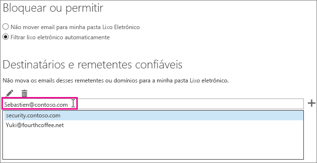

# <a name="how-to-prevent-real-email-from-being-marked-as-spam-in-office-365"></a><span data-ttu-id="3e6fe-103">Como impedir que emails reais sejam marcados como spam no Office 365</span><span class="sxs-lookup"><span data-stu-id="3e6fe-103">How to prevent real email from being marked as spam in Office 365</span></span>

 <span data-ttu-id="3e6fe-104">**Seu email real está sendo marcado como spam no Office 365? Faça isso.**</span><span class="sxs-lookup"><span data-stu-id="3e6fe-104">**Is your real email getting marked as spam in Office 365? Do this.**</span></span>

<span data-ttu-id="3e6fe-p101">Se você receber um falso positivo, relate a mensagem à Microsoft usando [o suplemento de mensagem de relatório ](https://support.office.com/article/b5caa9f1-cdf3-4443-af8c-ff724ea719d2). Além disso, você pode encaminhar a mensagem usando [Explorador de Envios](/security/office-365-security/admin-submission.md).</span><span class="sxs-lookup"><span data-stu-id="3e6fe-p101">If you get a false positive, you should report the message to Microsoft by using the [Use the Report Message add-in](https://support.office.com/article/b5caa9f1-cdf3-4443-af8c-ff724ea719d2). Additionally, you can forward the message [as an attachment](/security/office-365-security/admin-submission.md) to not_junk@office365.microsoft.com.</span></span>

## <a name="determine-the-reason-why-the-message-was-marked-as-spam"></a><span data-ttu-id="3e6fe-107">Determinar o motivo pelo qual a mensagem foi marcada como spam</span><span class="sxs-lookup"><span data-stu-id="3e6fe-107">Determine the reason why the message was marked as spam</span></span>

<span data-ttu-id="3e6fe-p102">Para resolver muitos problemas de spam no Office 365, confira o artigo [Exibir cabeçalhos de mensagens de email](https://support.office.com/article/cd039382-dc6e-4264-ac74-c048563d212c) e determine o que deu errado. Procure um cabeçalho chamado X-Forefront-Antispam-Report. [Saiba mais sobre cabeçalhos de mensagem antispam](https://technet.microsoft.com/library/dn205071%28v=exchg.150%29.aspx).</span><span class="sxs-lookup"><span data-stu-id="3e6fe-p102">Many issues with spam in Office 365 can be resolved by [View e-mail message headers](https://support.office.com/article/cd039382-dc6e-4264-ac74-c048563d212c) and determining what went wrong. You will need to look for a header named X-Forefront-Antispam-Report. You can [learn more about anti-spam message headers](https://technet.microsoft.com/library/dn205071%28v=exchg.150%29.aspx).</span></span>

<span data-ttu-id="3e6fe-111">No cabeçalho, procure os cabeçalhos e os valores a seguir.</span><span class="sxs-lookup"><span data-stu-id="3e6fe-111">In the header, look for the following headings and values.</span></span>

### <a name="x-forefront-antispam-report"></a><span data-ttu-id="3e6fe-112">X-Forefront-Antispam-Report</span><span class="sxs-lookup"><span data-stu-id="3e6fe-112">X-Forefront-Antispam-Report</span></span>

- <span data-ttu-id="3e6fe-113">\*\* SFV:SPM\*\*: indica que a mensagem foi marcada como spam devido aos filtros de spam da Proteção do Exchange Online. </span><span class="sxs-lookup"><span data-stu-id="3e6fe-113">**SFV:SPM** Indicates that the message was marked as spam because of the EOP spam filters.</span></span>

- <span data-ttu-id="3e6fe-114">**SFV:BLK**: indica que a mensagem foi marcada como spam porque o endereço de envio está na lista de Remetentes Bloqueados do destinatário.</span><span class="sxs-lookup"><span data-stu-id="3e6fe-114">**SFV:BLK** Indicates that the message was marked as spam because the sending address is on the recipient's Blocked Senders List.</span></span>

- <span data-ttu-id="3e6fe-115">**SFV:SKS**: indica que a mensagem foi marcada como spam antes do filtro de conteúdo.</span><span class="sxs-lookup"><span data-stu-id="3e6fe-115">**SFV:SKS**: Indicates that the message was marked as spam prior to the content filter.</span></span> <span data-ttu-id="3e6fe-116">Pode incluir uma regra de fluxo de email (também conhecida como regra de transporte) marcando a mensagem como spam.</span><span class="sxs-lookup"><span data-stu-id="3e6fe-116">This could include a mail flow rule (also known as a transport rule) marking the message as spam.</span></span> <span data-ttu-id="3e6fe-117">Execute um rastreamento de mensagens para ver se uma regra de fluxo de email acionada pode ter definido um SCL (nível de confiança de spam) alto.</span><span class="sxs-lookup"><span data-stu-id="3e6fe-117">Run a message trace to see if a mail flow rule triggered which may have set a high spam confidence level (SCL).</span></span>

- <span data-ttu-id="3e6fe-118">**SFV:SKB**: indica que a mensagem foi marcada como spam porque correspondeu a uma lista de bloqueios na política de filtro de spam.</span><span class="sxs-lookup"><span data-stu-id="3e6fe-118">**SFV:SKB** Indicates that the message was marked as spam because it matched a block list in the spam filter policy.</span></span>

- <span data-ttu-id="3e6fe-119">**SFV:BULK**: indica que o valor de nível de reclamação em massa (BCL) localizado no cabeçalho x-microsoft-antispam está acima do limite em massa definido para o filtro de conteúdo.</span><span class="sxs-lookup"><span data-stu-id="3e6fe-119">**SFV:BULK**: Indicates that the Bulk Complaint Level (BCL) value located in the x-microsoft-antispam header is above the Bulk threshold that has been set for the content filter.</span></span> <span data-ttu-id="3e6fe-120">Email em massa é o email no qual os usuários podem ter se inscrito, mas ainda são indesejados.</span><span class="sxs-lookup"><span data-stu-id="3e6fe-120">Bulk email is email which users may have signed up for, but may still be undesirable.</span></span> <span data-ttu-id="3e6fe-121">No cabeçalho da mensagem, encontre a propriedade BCL (Nível de Confiança em Massa) no cabeçalho X-Microsoft-Antispam.</span><span class="sxs-lookup"><span data-stu-id="3e6fe-121">In the message header find the BCL (Bulk Confidence Level) property in the X-Microsoft-Antispam header.</span></span> <span data-ttu-id="3e6fe-122">Se o BCL for menor que o limite definido no Filtro de Spam, ajuste o limite para marcar esses tipos de mensagens em massa como spam.</span><span class="sxs-lookup"><span data-stu-id="3e6fe-122">If the BCL value is less than the threshold set in the Spam Filter, you may want to adjust the threshold to instead mark these types of bulk messages as spam.</span></span> <span data-ttu-id="3e6fe-123">Usuários diferentes têm tolerâncias e preferências diferentes para [como o email em massa é tratado](https://docs.microsoft.com/microsoft-365/security/office-365-security/bulk-complaint-level-values).</span><span class="sxs-lookup"><span data-stu-id="3e6fe-123">Different users have different tolerances and preferences for [how bulk email is handled](https://docs.microsoft.com/microsoft-365/security/office-365-security/bulk-complaint-level-values).</span></span> <span data-ttu-id="3e6fe-124">É possível criar regras ou políticas diferentes para as preferências de usuários diferentes.</span><span class="sxs-lookup"><span data-stu-id="3e6fe-124">You can create different policies or rules for different user preferences.</span></span>

- <span data-ttu-id="3e6fe-125">**CAT:SPOOF** ou **CAT:PHISH**: indica que a mensagem aparenta ser falsa, o que significa que a origem da mensagem não pode ser validada e pode ser suspeita.</span><span class="sxs-lookup"><span data-stu-id="3e6fe-125">**CAT:SPOOF** or **CAT:PHISH**: Indicates that the message appears to be spoofed, meaning that the message source cannot be validated and could be suspicious.</span></span> <span data-ttu-id="3e6fe-126">Se for válida, o remetente precisará garantir que as configurações DKIM e SPF estejam corretas.</span><span class="sxs-lookup"><span data-stu-id="3e6fe-126">If valid, the sender will need to make sure that they have proper SPF and DKIM configuration.</span></span> <span data-ttu-id="3e6fe-127">Consulte o cabeçalho Authentication-Results para obter mais informações.</span><span class="sxs-lookup"><span data-stu-id="3e6fe-127">Check the Authentication-Results header for more information.</span></span> <span data-ttu-id="3e6fe-128">Embora possa ser difícil conseguir que todos os remetentes usem os métodos adequados de autenticação de email, ignorar essas verificações pode ser muito perigoso e é a maior causa de comprometimentos.</span><span class="sxs-lookup"><span data-stu-id="3e6fe-128">Although it may be difficult to get all senders to use proper email authentication methods, bypassing these checks can be extremely dangerous and is the top cause of compromises.</span></span>

### <a name="x-customspam"></a><span data-ttu-id="3e6fe-129">x-customspam</span><span class="sxs-lookup"><span data-stu-id="3e6fe-129">x-customspam</span></span>

- <span data-ttu-id="3e6fe-p106">A presença desse cabeçalho indica que a mensagem foi marcada como spam porque uma das [opções avançadas de spam está habilitada](https://technet.microsoft.com/library/jj200750%28v=exchg.150%29.aspx) no filtro de spam. A menos que você precise desses recursos, recomendamos usar as configurações padrão.</span><span class="sxs-lookup"><span data-stu-id="3e6fe-p106">The presence of this header indicates that the message was marked as spam because one of the [advanced spam options is enabled](https://technet.microsoft.com/library/jj200750%28v=exchg.150%29.aspx) in your spam filter. Unless you need these features, we recommend that you use the default settings.</span></span>

## <a name="solutions-to-additional-causes-of-too-much-spam"></a><span data-ttu-id="3e6fe-132">Soluções para outras causas de excesso de spam</span><span class="sxs-lookup"><span data-stu-id="3e6fe-132">Solutions to additional causes of too much spam</span></span>

<span data-ttu-id="3e6fe-p107">Para trabalhar com eficiência, a Proteção do Exchange Online (EOP) exige que os administradores concluam algumas tarefas. Se você não for o administrador do locatário do Office 365 e estiver recebendo muito spam, fale com seu administrador sobre essas tarefas. Caso contrário, ignore e vá até a seção do usuário.</span><span class="sxs-lookup"><span data-stu-id="3e6fe-p107">In order to work effectively, Exchange Online Protection (EOP) requires that administrators complete a few tasks. If you are not the administrator for your Office 365 tenant and you are getting too much spam, then you may want to work with your administrator on these tasks. Otherwise, you can skip to the user section.</span></span>

### <a name="for-admins"></a><span data-ttu-id="3e6fe-136">Para administradores</span><span class="sxs-lookup"><span data-stu-id="3e6fe-136">For admins</span></span>

- <span data-ttu-id="3e6fe-137">**Aponte seus registros DNS para o Office 365**: para que o EOP ofereça proteção, os registros DNS do MX (servidor de mensagens) de todos os domínios devem estar apontados para o Office 365, e somente para ele.</span><span class="sxs-lookup"><span data-stu-id="3e6fe-137">**Point your DNS records to Office 365** In order for EOP to provide the best protection, your mail exchanger (MX) DNS record(s) for all domains must be pointed to Office 365 -- and only to Office 365. See Create DNS records for Office 365 when you manage your DNS records.</span></span> <span data-ttu-id="3e6fe-138">Se o MX não aponta para o Office 365, então o EOP não fornece proteção de filtro de spam aos seus usuários.</span><span class="sxs-lookup"><span data-stu-id="3e6fe-138">If your MX does not point to Office 365, then EOP will not provide spam filtering for your users.</span></span> <span data-ttu-id="3e6fe-139">Na situação em que deseja usar outro serviço ou dispositivo para fornecer filtragem de spam para o seu domínio, considere desativar a proteção contra spam no EOP.</span><span class="sxs-lookup"><span data-stu-id="3e6fe-139">In the situation where you wish to use another service or appliance to provide spam filtering for your domain, you should consider disabling the spam protection in EOP.</span></span> <span data-ttu-id="3e6fe-140">Para isso, crie uma regra de transporte que defina o valor SCL em -1.</span><span class="sxs-lookup"><span data-stu-id="3e6fe-140">You can do this by creating a mail flow rule that sets the SCL value to -1.</span></span> <span data-ttu-id="3e6fe-141">Se decidir mais tarde usar o EOP, remova esta regra de fluxo de email.</span><span class="sxs-lookup"><span data-stu-id="3e6fe-141">If you later decide to use EOP, make sure to remove this mail flow rule.</span></span>

- <span data-ttu-id="3e6fe-142">**Habilitar um suplemento de mensagem de relatório para usuários**: recomendamos [habilitar o suplemento de mensagem de relatório para os seus usuários](/security/office-365-security/enable-the-report-message-add-in.md).</span><span class="sxs-lookup"><span data-stu-id="3e6fe-142">**Turn on the report message add-in for users** We strongly recommend that you [enable the report message add-in for your users](/security/office-365-security/enable-the-report-message-add-in.md). As an administrator, you may also be able to view the feedback your users are sending and use any patterns to adjust any settings that may be causing problems.</span></span>

- <span data-ttu-id="3e6fe-143">**Use [o Explorador de envios](/security/office-365-security/admin-submission.md)** Agora os administradores podem enviar emails usando a ID, URLs e arquivos da mensagem de arquivo ou rede, para verificação pela Microsoft no Office 365.</span><span class="sxs-lookup"><span data-stu-id="3e6fe-143">**Use [Submissions Explorer](/security/office-365-security/admin-submission.md)**: Admins can now send emails by using file or network message ID, URLs, and files for scanning by Microsoft in Office 365.</span></span> <span data-ttu-id="3e6fe-144">Como administrador, você também pode visualizar o comentário enviado por seus usuários e usar qualquer padrão para ajustar as configurações que podem causar problemas.</span><span class="sxs-lookup"><span data-stu-id="3e6fe-144">Turn on the report message add-in for users We strongly recommend that you enable the report message add-in for your users. As an administrator, you may also be able to view the feedback your users are sending and use any patterns to adjust any settings that may be causing problems.</span></span>

- <span data-ttu-id="3e6fe-145">**Verifique se os usuários estão dentro dos limites permitidos** para enviar e receber emails como mostrou [aqui](https://docs.microsoft.com/pt-BR/office365/servicedescriptions/exchange-online-service-description/exchange-online-limits).</span><span class="sxs-lookup"><span data-stu-id="3e6fe-145">**Make sure that your users are inside the allowed limits** for sending and receiving emails as showed [here](https://docs.microsoft.com/pt-BR/office365/servicedescriptions/exchange-online-service-description/exchange-online-limits).</span></span>

- <span data-ttu-id="3e6fe-146">**Verifique os níveis em massa** conforme especificado [aqui](/security/office-365-security/bulk-complaint-level-values.md).</span><span class="sxs-lookup"><span data-stu-id="3e6fe-146">**Double-check the bulk levels** as specified [here](/security/office-365-security/bulk-complaint-level-values.md)</span></span>

### <a name="for-users"></a><span data-ttu-id="3e6fe-147">Para usuários</span><span class="sxs-lookup"><span data-stu-id="3e6fe-147">For users</span></span>

- <span data-ttu-id="3e6fe-p110">**Crie uma lista de remetentes confiáveis** Os usuários podem adicionar endereços de remetentes seguros em sua lista de remetentes confiáveis no [Outlook](https://go.microsoft.com/fwlink/p/?LinkId=270065) ou [Outlook na Web](https://go.microsoft.com/fwlink/p/?LinkId=294862). Para começar no Outlook na Web, escolha **Configurações** \> **Opções** \> **Bloquear ou permitir**. O diagrama a seguir mostra um exemplo de como adicionar alguém a uma lista de remetentes confiáveis.</span><span class="sxs-lookup"><span data-stu-id="3e6fe-p110">**Create a safe sender list** Users can add addresses from senders that they trust to their safe sender list in [Outlook](https://go.microsoft.com/fwlink/p/?LinkId=270065) or [Outlook on the Web](https://go.microsoft.com/fwlink/p/?LinkId=294862). To get started in Outlook on the Web, choose **Settings** \> **Options** \> **Block or allow**. The following diagram shows an example of adding something to a safe sender list.</span></span>



<span data-ttu-id="3e6fe-p111">O EOP aceita os Remetentes e Destinatários confiáveis dos seus usuários, mas não aceita Domínios confiáveis. Isso acontece independentemente do domínio ser adicionado através do Outlook na web ou adicionado no Outlook e sincronizado usando o Diretório de Sincronização.</span><span class="sxs-lookup"><span data-stu-id="3e6fe-p111">EOP will honor your users' Safe Senders and Recipients, but not Safe Domains. This is true regardless of whether the domain is added through the Outlook on the Web, or added in Outlook and synchronized using Directory Sync.</span></span>

- <span data-ttu-id="3e6fe-p112">**Desabilitar a filtragem de SmartScreen no Outlook**: se estiver usando o antigo cliente da área de trabalho do Outlook, desabilite a funcionalidade de filtragem do SmartScreen, que foi descontinuada. Se estiver habilitada, ela poderá causar falsos positivos. Isso não será necessário se o cliente de área de trabalho do Outlook estiver atualizado.</span><span class="sxs-lookup"><span data-stu-id="3e6fe-p112">**Disable SmartScreen filtering in Outlook** If you are using an older Outlook desktop client, you should disable the SmartScreen filtering functionality, which has been discontinued. If enabled, it can cause false positives. This should not be required if running an updated desktop Outlook client.</span></span>

## <a name="troubleshooting-a-message-ends-up-in-the-junk-folder-even-though-eop-marked-the-message-as-non-spam"></a><span data-ttu-id="3e6fe-157">Solução de problemas: Uma mensagem termina na pasta de Lixo eletrônico embora EOP tenha marcado a mensagem como não spam</span><span class="sxs-lookup"><span data-stu-id="3e6fe-157">Troubleshooting: A message ends up in the Junk folder even though EOP marked the message as non-spam</span></span>

<span data-ttu-id="3e6fe-p113">Se os usuários tem o Outlook habilitado para “Somente listas seguras: Somente emails de pessoas ou domínios na sua lista de Remetentes e destinatários confiáveis serão entregues na sua caixa de entrada”, todos os outros emails irão para a pasta de lixo eletrônico. Isso acontecerá independentemente do EOP marcar a mensagem como não spam, ou de você ter configurado uma regra no EOP para marcar uma mensagem como não spam.</span><span class="sxs-lookup"><span data-stu-id="3e6fe-p113">If your users have the option in Outlook enabled for "Safe Lists Only: Only mail from people or domains on your Safe Senders list or Safe Recipients List will be delivered to your Inbox", then all email will go to the junk folder for a sender unless the sender is on the recipient's Safe Sender list. This will happen regardless of whether EOP marks a message as non-spam, or if you have set up a rule in EOP to mark a message as non-spam.</span></span>

<span data-ttu-id="3e6fe-160">Você pode desabilitar a opção Apenas Listas de Confiança para seus usuários do Outlook seguindo as instruções em [Outlook: política de configuração para desabilitar a UI do lixo eletrônico e do mecanismo de filtragem](https://support.microsoft.com/pt-BR/kb/2180568).</span><span class="sxs-lookup"><span data-stu-id="3e6fe-160">You can disable the Safe Lists Only option for your Outlook users by following the instructions in [Outlook: Policy setting to disable the Junk E-mail UI and filtering mechanism](https://support.microsoft.com/pt-BR/kb/2180568).</span></span>

<span data-ttu-id="3e6fe-161">Se visualizar a mensagem no Outlook na Web, será exibido um aviso de segurança em amarelo indicando que a mensagem está na pasta Lixo eletrônico porque o remetente não está na lista de remetentes confiáveis do destinatário.</span><span class="sxs-lookup"><span data-stu-id="3e6fe-161">If you view the message in Outlook on the Web, there will be a yellow safety tip that indicates that the message is in the Junk folder because the sender is not on the recipient's Safe Senders list.</span></span>

<span data-ttu-id="3e6fe-p114">Se você observar o cabeçalho de uma mensagem verá que ela pode incluir o carimbo SFV:SKN  (permissões de IP ou permissões ETR) ou SFV:NSPM (não spam), mas ela ainda estará na pasta Lixo eletrônico do usuário. Não há nada no cabeçalho da mensagem que indica que o usuário tenha  "Apenas listas de confiança" habilitado. Isso acontece porque a opção "Apenas listas de confiança" definida pelos usuários no Outlook substituem a configuração do EOP.</span><span class="sxs-lookup"><span data-stu-id="3e6fe-p114">If you look at the header of a message, it may include the stamp SFV:SKN (IP Allow or ETR Allow) or SFV:NSPM (non-spam), but the message is still placed in the user's junk folder. There is nothing in the message header that indicates that the user has "Safe Lists Only" enabled. This happens because the "Safe Lists Only" option set by users in Outlook overrides the EOP setting.</span></span>

### <a name="to-verify-why-a-message-from-a-safe-sender-is-marked-as-non-spam-in-the-message-header-but-still-ends-up-in-the-users-junk-folder"></a><span data-ttu-id="3e6fe-165">Para verificar por que uma mensagem de um remetente seguro é marcada como não spam no cabeçalho da mensagem mas ainda assim termina na pasta de lixo eletrônico do usuário</span><span class="sxs-lookup"><span data-stu-id="3e6fe-165">To verify why a message from a safe sender is marked as non-spam in the message header, but still ends up in the user's Junk folder</span></span>

1. <span data-ttu-id="3e6fe-166">Para aprender a se conectar ao Exchange Online PowerShell, confira [Conectar ao Exchange Online PowerShell](https://go.microsoft.com/fwlink/p/?LinkId=396554).</span><span class="sxs-lookup"><span data-stu-id="3e6fe-166">To learn how to connect to Exchange Online PowerShell, see [Connect to Exchange Online PowerShell](https://go.microsoft.com/fwlink/p/?LinkId=396554).</span></span>

2. <span data-ttu-id="3e6fe-167">Execute o seguinte comando para exibir as configurações de lixo eletrônico do usuário:</span><span class="sxs-lookup"><span data-stu-id="3e6fe-167">Run the following command to view the user's junk email configuration settings:</span></span>

  ```Powershell
  Get-MailboxJunkEmailConfiguration example@contoso.com | Format-List TrustedListsOnly,ContactsTrusted,TrustedSendersAndDomains
  ```

- <span data-ttu-id="3e6fe-168">Se TrustedListsOnly é definido como verdadeiro, significa que essa configuração está ativada.</span><span class="sxs-lookup"><span data-stu-id="3e6fe-168">If TrustedListsOnly is set to True, it means that this setting is enabled</span></span>

- <span data-ttu-id="3e6fe-169">Se ContactsTrusted é definido como verdadeiro, isso significa que o usuário confia nos remetentes e nos contatos confiáveis.</span><span class="sxs-lookup"><span data-stu-id="3e6fe-169">If ContactsTrusted is set to True, it means that the user trusts both Contacts and Safe Senders</span></span>

- <span data-ttu-id="3e6fe-170">O TrustedSendersAndDomains lista o conteúdo da lista de remetentes confiáveis do usuário.</span><span class="sxs-lookup"><span data-stu-id="3e6fe-170">The TrustedSendersAndDomains lists the contents of the user's Safe Senders list</span></span>

## <a name="eop-only-customers-use-directory-synchronization"></a><span data-ttu-id="3e6fe-171">Clientes somente EOP: usar a sincronização de diretório</span><span class="sxs-lookup"><span data-stu-id="3e6fe-171">EOP-only customers: use directory synchronization</span></span>

<span data-ttu-id="3e6fe-p115">Se você for um cliente somente EOP, ou seja inscrito no serviço EOP para uso com o servidor de email (Exchange) no local, você deve sincronizar as configurações de usuário com o serviço usando a sincronização de diretórios. Isso garante que sua lista de remetentes confiáveis seja respeitada pelo EOP. Para saber mais, confira "Utilizar a sincronização de diretórios para gerenciar usuários de email" em [Gerenciar usuários de email no EOP](https://go.microsoft.com/fwlink/?LinkId=534098).</span><span class="sxs-lookup"><span data-stu-id="3e6fe-p115">If you're an EOP-only customer, that is, you subscribe to the EOP service for use with your on-premises (Exchange) email server, you should sync user settings with the service by using directory synchronization. Doing this ensures that your safe senders lists are respected by EOP. For more information, see "Use directory synchronization to manage mail users" in [Manage Mail Users in EOP](https://go.microsoft.com/fwlink/?LinkId=534098).</span></span>
