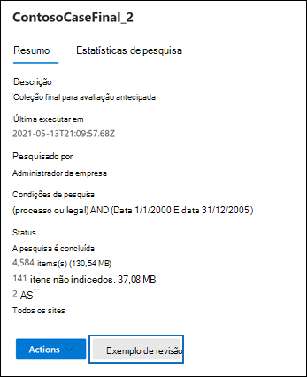

# Visualização de resultados de pesquisa da Descoberta Eletrônica

Depois de executar uma pesquisa de Conteúdo ou uma pesquisa associada a um caso de Descoberta eletrônica principal, você pode visualizar uma amostra dos resultados retornados pela pesquisa. A visualização de itens retornados pela consulta de pesquisa pode ajudá-lo a determinar se a pesquisa está retornando os resultados que você espera ou se você precisa alterar a consulta de pesquisa e realizar a pesquisa outra vez.

Para visualizar um exemplo de resultados retornados por uma pesquisa:

1. No Centro de Conformidade do Microsoft 365, vá para a página de Pesquisa de conteúdo ou um caso de Descoberta eletrônica principal.

2. Selecione a pesquisa para exibir a página de sobrevoo.

3. Na parte inferior da página de sobrevoo, clique em **Revisar exemplo**.

   

   É exibida uma página contendo um exemplo dos resultados da pesquisa.

4. Selecione um item para exibir seu conteúdo no painel de leitura.

   

   Na captura de tela anterior, observe que as palavras-chave da consulta de pesquisa são realçadas quando você visualiza itens.

## Como são selecionados os exemplos dos resultados da pesquisa

No máximo 1.000 itens selecionados aleatoriamente estão disponíveis para visualização. Além de serem selecionados aleatoriamente, os itens disponíveis para visualização também devem atender aos seguintes critérios:

- É possível visualizar no máximo 100 itens de um único local de conteúdo (uma caixa de correio ou um site). Isso significa que é possível que menos de 1.000 itens possam estar disponíveis para visualização. Por exemplo, se você pesquisar quatro caixas de correio e a pesquisa retornar 1.500 itens estimados, apenas 400 estarão disponíveis para visualização porque somente 100 itens de cada caixa de correio podem ser visualizados.

- Para itens de caixa de correio, apenas as mensagens de email estão disponíveis para visualização. Itens como tarefas, itens de calendário e contatos não podem ser visualizados.

- Para itens de site, somente os documentos estão disponíveis para visualização. Itens como pastas, listas ou anexos de listas não podem ser visualizados.

## Tipos de arquivos com suporte durante a visualização de resultados da pesquisa

É possível visualizar os tipos de arquivo com suporte no painel de visualização. Se não há suporte para um tipo de arquivo, você precisa baixar uma cópia do arquivo no computador local (clicando em **Baixar o item original**). Para páginas da Web .aspx, a URL da página está incluída, mas pode ser que não haja permissões para acessar a página. Itens não indexados não estão disponíveis para visualização.

Os seguintes tipos de arquivo têm suporte e podem ser visualizados no painel de resultados da pesquisa.
  
- .txt, .html, .mhtml

- .eml

- .doc, .docx, .docm

- .pptm, .pptx

- .pdf

Além disso, os seguintes tipos de contêiner de arquivos possuem suporte. Você pode exibir a lista de arquivos no contêiner no painel de visualização.
  
- .zip

- .gzip