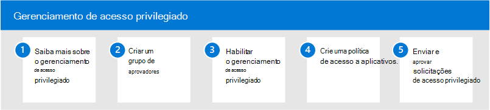

# Gerenciamento de acesso privilegiado no Microsoft 365Privileged access management in Microsoft 365

Ter acesso permanente de alguns usuários a informações confidenciais ou a definições críticas de configuração de rede no Microsoft Exchange Online é um caminho potencial para contas comprometidas ou atividades de ameaças internas.Having standing access by some users to sensitive information or critical network configuration settings in Microsoft Exchange Online is a potential pathway for compromised accounts or internal threat activities. O gerenciamento de acesso privilegiado ajuda a proteger sua organização contra violações e a atender às práticas recomendadas de conformidade, limitando o acesso permanente a dados confidenciais ou acesso a configurações críticas.Privileged access management helps protect your organization from breaches and helps to meet compliance best practices by limiting standing access to sensitive data or access to critical configuration settings. Em vez de os administradores terem acesso constante, as regras de acesso just-in-time são implementadas para tarefas que precisam de permissões elevadas.Instead of administrators having constant access, just-in-time access rules are implemented for tasks that need elevated permissions. A habilitação do gerenciamento de acesso privilegiado para o Exchange Online no Microsoft 365 permite que sua organização opere com zero privilégios permanentes e forneça uma camada de defesa contra vulnerabilidades permanentes de acesso administrativo.Enabling privileged access management for Exchange Online in Microsoft 365 allows your organization to operate with zero standing privileges and provide a layer of defense against standing administrative access vulnerabilities.

## Configurar o gerenciamento de acesso privilegiado para o Microsoft 365Configure privileged access management for Microsoft 365

Use as etapas a seguir para configurar o gerenciamento de acesso privilegiado para sua organização:Use the following steps to configure privileged access management for your organization:

1. Saiba mais sobre [o gerenciamento de acesso](privileged-access-management-overview.md) privilegiado no Microsoft 365Learn about [privileged access management](privileged-access-management-overview.md) in Microsoft 365
2. Criar um [grupo de aprovador](privileged-access-management-configuration.md#step-1-create-an-approvers-group)Create an [approver's group](privileged-access-management-configuration.md#step-1-create-an-approvers-group)
3. [Habilitar o gerenciamento de acesso privilegiado](privileged-access-management-configuration.md#step-2-enable-privileged-access)Enable [privileged access management](privileged-access-management-configuration.md#step-2-enable-privileged-access)
4. Criar uma política [de acesso](privileged-access-management-configuration.md#step-3-create-an-access-policy)Create an [access policy](privileged-access-management-configuration.md#step-3-create-an-access-policy)
5. Enviar/aprovar [solicitações de acesso privilegiado](privileged-access-management-configuration.md#step-4-submitapprove-privileged-access-requests)Submit/approve [privileged access requests](privileged-access-management-configuration.md#step-4-submitapprove-privileged-access-requests)

## Mais informações sobre o gerenciamento de acesso privilegiadoMore information about privileged access management

- [Perguntas frequentes sobre o gerenciamento de acesso privilegiadoFrequently asked questions about privileged access management](privileged-access-management-overview.md#frequently-asked-questions)