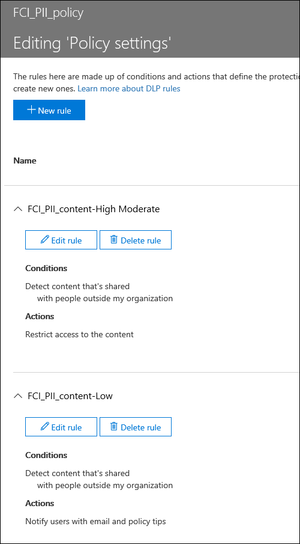

# <a name="create-a-dlp-policy-to-protect-documents-with-fci-or-other-properties"></a><span data-ttu-id="10f10-103">Criar uma política de DLP para proteger documentos com FCI ou outras propriedades</span><span class="sxs-lookup"><span data-stu-id="10f10-103">Create a DLP policy to protect documents with FCI or other properties</span></span>

<span data-ttu-id="10f10-104">As políticas de prevenção de perda de dados (DLP) da Microsoft 365 podem usar propriedades de classificação ou propriedades de item para identificar itens confidenciais.</span><span class="sxs-lookup"><span data-stu-id="10f10-104">Microsoft 365 data loss prevention (DLP) policies can use classification properties or item properties to identify sensitive items.</span></span> <span data-ttu-id="10f10-105">Por exemplo, você pode usar:</span><span class="sxs-lookup"><span data-stu-id="10f10-105">For example you can use:</span></span>

- <span data-ttu-id="10f10-106">Propriedades da infraestrutura de classificação de arquivos (FCI) do Windows Server</span><span class="sxs-lookup"><span data-stu-id="10f10-106">Windows Server File Classification infrastructure (FCI) properties</span></span>
- <span data-ttu-id="10f10-107">Propriedades do documento do SharePoint</span><span class="sxs-lookup"><span data-stu-id="10f10-107">SharePoint document properties</span></span>
- <span data-ttu-id="10f10-108">Propriedades do documento do sistema de terceiros</span><span class="sxs-lookup"><span data-stu-id="10f10-108">third-party system document properties</span></span>


<span data-ttu-id="10f10-110">Por exemplo, sua organização pode usar o Windows Server FCI para identificar itens com dados pessoais, como números de seguridade social, e classificar o documento definindo a propriedade de **informações de identificação pessoal** como **alta**, **moderada**, **baixa**, **pública** ou **não PII** com base no tipo e no número de ocorrências de dados pessoais encontradas no documento.</span><span class="sxs-lookup"><span data-stu-id="10f10-110">For example, your organization might use Windows Server FCI to identify items with personal data such as social security numbers, and then classify the document by setting the **Personally Identifiable Information** property to **High**, **Moderate**, **Low**, **Public**, or **Not PII** based on the type and number of occurrences of personal data found in the document.</span></span>

<span data-ttu-id="10f10-111">No Microsoft 365, você pode criar uma política de DLP que identifica documentos que tenham essa propriedade definida como valores específicos, como **alto** e **médio**, e, em seguida, executa uma ação como bloquear o acesso a esses arquivos.</span><span class="sxs-lookup"><span data-stu-id="10f10-111">In Microsoft 365, you can create a DLP policy that identifies documents that have that property set to specific values, such as **High** and **Medium**, and then takes an action such as blocking access to those files.</span></span> <span data-ttu-id="10f10-112">A mesma política pode ter outra regra que executa uma ação diferente se a propriedade for definida como **Baixa**, como o envio de uma notificação por email.</span><span class="sxs-lookup"><span data-stu-id="10f10-112">The same policy can have another rule that takes a different action if the property is set to **Low**, such as sending an email notification.</span></span> <span data-ttu-id="10f10-113">Dessa forma, a DLP se integra ao Windows Server FCI e pode ajudar a proteger os documentos do Office carregados ou compartilhados para o Microsoft 365 a partir de servidores de arquivos baseados no Windows Server.</span><span class="sxs-lookup"><span data-stu-id="10f10-113">In this way, DLP integrates with Windows Server FCI and can help protect Office documents uploaded or shared to Microsoft 365 from Windows Server-based file servers.</span></span>

<span data-ttu-id="10f10-114">Uma política de DLP simplesmente procura por um par de nome/valor de propriedade específico.</span><span class="sxs-lookup"><span data-stu-id="10f10-114">A DLP policy simply looks for a specific property name/value pair.</span></span> <span data-ttu-id="10f10-115">Qualquer propriedade de documento pode ser usada, contanto que a propriedade tenha uma propriedade gerenciada correspondente para a pesquisa do SharePoint.</span><span class="sxs-lookup"><span data-stu-id="10f10-115">Any document property can be used, as long as the property has a corresponding managed property for SharePoint search.</span></span> <span data-ttu-id="10f10-116">Por exemplo, um conjunto de sites do SharePoint pode usar um tipo de conteúdo chamado **Relatório de viagem** com um campo obrigatório chamado **Cliente**.</span><span class="sxs-lookup"><span data-stu-id="10f10-116">For example, a SharePoint site collection might use a content type named **Trip Report** with a required field named **Customer**.</span></span> <span data-ttu-id="10f10-117">Sempre que uma pessoa criar um relatório de viagem, ela deve digitar o nome do cliente.</span><span class="sxs-lookup"><span data-stu-id="10f10-117">Whenever a person creates a trip report, they must enter the customer name.</span></span> <span data-ttu-id="10f10-118">Este par de nome/valor da propriedade também pode ser usado em uma política de DLP — por exemplo, se você deseja uma regra que bloqueia o acesso ao documento para convidados quando o campo **cliente** contém **contoso**.</span><span class="sxs-lookup"><span data-stu-id="10f10-118">This property name/value pair can also be used in a DLP policy—for example, if you want a rule that blocks access to the document for guests when the **Customer** field contains **Contoso**.</span></span>

<span data-ttu-id="10f10-119">Se você quiser aplicar sua política de DLP ao conteúdo com rótulos do Microsoft 365, você não deve seguir as etapas aqui.</span><span class="sxs-lookup"><span data-stu-id="10f10-119">If you want to apply your DLP policy to content with specific Microsoft 365 labels, you should not follow the steps here.</span></span> <span data-ttu-id="10f10-120">Em vez disso, saiba como [usar um rótulo de retenção como uma condição em uma política de DLP](data-loss-prevention-policies.md#using-a-retention-label-as-a-condition-in-a-dlp-policy).</span><span class="sxs-lookup"><span data-stu-id="10f10-120">Instead, learn how to [Using a retention label as a condition in a DLP policy](data-loss-prevention-policies.md#using-a-retention-label-as-a-condition-in-a-dlp-policy).</span></span>

## <a name="before-you-create-the-dlp-policy"></a><span data-ttu-id="10f10-121">Antes de criar a política de DLP</span><span class="sxs-lookup"><span data-stu-id="10f10-121">Before you create the DLP policy</span></span>

<span data-ttu-id="10f10-122">Antes de usar uma propriedade de FCI do Windows Server ou outra propriedade em uma política de DLP, você precisa criar uma propriedade gerenciada no centro de administração do SharePoint.</span><span class="sxs-lookup"><span data-stu-id="10f10-122">Before you can use a Windows Server FCI property or other property in a DLP policy, you need to create a managed property in the SharePoint admin center.</span></span> <span data-ttu-id="10f10-123">Veja por quê.</span><span class="sxs-lookup"><span data-stu-id="10f10-123">Here's why.</span></span>

<span data-ttu-id="10f10-p106">Exemplos</span><span class="sxs-lookup"><span data-stu-id="10f10-p106">In SharePoint Online and OneDrive for Business, the search index is built up by crawling the content on your sites. The crawler picks up content and metadata from the documents in the form of crawled properties. The search schema helps the crawler decide what content and metadata to pick up. Examples of metadata are the author and the title of a document. However, to get the content and metadata from the documents into the search index, the crawled properties must be mapped to managed properties. Only managed properties are kept in the index. For example, a crawled property related to author is mapped to a managed property related to author.</span></span>

<span data-ttu-id="10f10-131">Isso é importante porque o DLP usa o rastreador de pesquisa para identificar e classificar informações confidenciais em seus sites e, em seguida, armazenar essas informações confidenciais em uma parte segura do índice de pesquisa.</span><span class="sxs-lookup"><span data-stu-id="10f10-131">This is important because DLP uses the search crawler to identify and classify sensitive information on your sites, and then store that sensitive information in a secure portion of the search index.</span></span> <span data-ttu-id="10f10-132">Quando você carregar um documento no Office 365, o SharePoint cria automaticamente propriedades rastreadas com base nas propriedades do documento.</span><span class="sxs-lookup"><span data-stu-id="10f10-132">When you upload a document to Office 365, SharePoint automatically creates crawled properties based on the document properties.</span></span> <span data-ttu-id="10f10-133">Mas, para usar uma FCI ou outra propriedade em uma política de DLP, essa propriedade rastreada precisa ser mapeada para uma propriedade gerenciada para que o conteúdo com essa propriedade seja mantido no índice.</span><span class="sxs-lookup"><span data-stu-id="10f10-133">But to use an FCI or other property in a DLP policy, that crawled property needs to be mapped to a managed property so that content with that property is kept in the index.</span></span>

<span data-ttu-id="10f10-134">Para obter mais informações sobre propriedades gerenciadas e pesquisa, consulte [gerenciar o esquema de pesquisa no SharePoint Online](https://go.microsoft.com/fwlink/p/?LinkID=627454).</span><span class="sxs-lookup"><span data-stu-id="10f10-134">For more information on search and managed properties, see [Manage the search schema in SharePoint Online](https://go.microsoft.com/fwlink/p/?LinkID=627454).</span></span>

### <a name="step-1-upload-a-document-with-the-needed-property-to-office-365"></a><span data-ttu-id="10f10-135">Etapa 1: Carregar um documento com a propriedade necessária para o Office 365</span><span class="sxs-lookup"><span data-stu-id="10f10-135">Step 1: Upload a document with the needed property to Office 365</span></span>

<span data-ttu-id="10f10-136">Primeiro você precisa carregar um documento com a propriedade à qual você deseja fazer referência em sua política de DLP.</span><span class="sxs-lookup"><span data-stu-id="10f10-136">You first need to upload a document with the property that you want to reference in your DLP policy.</span></span> <span data-ttu-id="10f10-137">O Microsoft 365 detectará a propriedade e criará automaticamente uma propriedade rastreada a partir dela.</span><span class="sxs-lookup"><span data-stu-id="10f10-137">Microsoft 365 will detect the property and automatically create a crawled property from it.</span></span> <span data-ttu-id="10f10-138">Na próxima etapa, você criará uma propriedade gerenciada e, em seguida, mapeará a propriedade gerenciada para essa propriedade rastreada.</span><span class="sxs-lookup"><span data-stu-id="10f10-138">In the next step, you'll create a managed property, and then map the managed property to this crawled property.</span></span>

### <a name="step-2-create-a-managed-property"></a><span data-ttu-id="10f10-139">Etapa 2: Criar uma propriedade gerenciada</span><span class="sxs-lookup"><span data-stu-id="10f10-139">Step 2: Create a managed property</span></span>

1. <span data-ttu-id="10f10-140">Acesse o centro de administração do Microsoft 365.</span><span class="sxs-lookup"><span data-stu-id="10f10-140">Sign in to the Microsoft 365 admin center.</span></span>

2. <span data-ttu-id="10f10-141">No painel de navegação à esquerda, escolha **central de administração** \> **do SharePoint**.</span><span class="sxs-lookup"><span data-stu-id="10f10-141">In the left navigation, choose **Admin centers** \> **SharePoint**.</span></span> <span data-ttu-id="10f10-142">Agora você está no centro de administração do SharePoint.</span><span class="sxs-lookup"><span data-stu-id="10f10-142">You're now in the SharePoint admin center.</span></span>

3. <span data-ttu-id="10f10-143">No painel de navegação à esquerda, escolha **Pesquisar** \> na página **Administração da pesquisa** \> **gerenciar esquema de pesquisa**.</span><span class="sxs-lookup"><span data-stu-id="10f10-143">In the left navigation, choose **search** \> on the **search administration** page \> **Manage Search Schema**.</span></span>

   

4. <span data-ttu-id="10f10-145">Na página **propriedades gerenciadas** \> **nova propriedade gerenciada**.</span><span class="sxs-lookup"><span data-stu-id="10f10-145">On the **Managed Properties** page \> **New Managed Property**.</span></span>

   

5. <span data-ttu-id="10f10-p110">Insira um nome e uma descrição para a propriedade. Esse nome é o que aparecerá em suas políticas de DLP.</span><span class="sxs-lookup"><span data-stu-id="10f10-p110">Enter a name and description for the property. This name is what will appear in your DLP policies.</span></span>

6. <span data-ttu-id="10f10-149">Para **Tipo**, escolha **Texto**.</span><span class="sxs-lookup"><span data-stu-id="10f10-149">For **Type**, choose **Text**.</span></span>

7. <span data-ttu-id="10f10-150">Em **Características principais**, selecione **Consultável** e **Recuperável**.</span><span class="sxs-lookup"><span data-stu-id="10f10-150">Under **Main characteristics**, select **Queryable** and **Retrievable**.</span></span>

8. <span data-ttu-id="10f10-151">Em **mapeamentos para propriedades rastreadas** , \> **adicione um mapeamento**.</span><span class="sxs-lookup"><span data-stu-id="10f10-151">Under **Mappings to crawled properties** \> **Add a mapping**.</span></span>

9. <span data-ttu-id="10f10-152">Na caixa de diálogo **seleção de propriedade rastreada** \> , localize e selecione a propriedade rastreada que corresponde à propriedade FCI do Windows Server, ou outra propriedade que você usará em sua política de DLP \> **OK**.</span><span class="sxs-lookup"><span data-stu-id="10f10-152">In the **crawled property selection** dialog box \> find and select the crawled property that corresponds to the Windows Server FCI property or other property that you will use in your DLP policy \> **OK**.</span></span>

   

10. <span data-ttu-id="10f10-154">Na parte inferior da página, \> **OK**.</span><span class="sxs-lookup"><span data-stu-id="10f10-154">At the bottom of the page \> **OK**.</span></span>

## <a name="create-a-dlp-policy-that-uses-an-fci-property-or-other-property"></a><span data-ttu-id="10f10-155">Criar uma política de DLP que usa uma propriedade FCI ou outra propriedade</span><span class="sxs-lookup"><span data-stu-id="10f10-155">Create a DLP policy that uses an FCI property or other property</span></span>

<span data-ttu-id="10f10-156">Neste exemplo, uma organização está usando o FCI em seus servidores de arquivos baseados em Windows Server; especificamente, eles estão usando a propriedade de classificação FCI chamada **informações de identificação pessoal** com possíveis valores de **alta**, **moderado**, **baixo**, **público** e **não PII**.</span><span class="sxs-lookup"><span data-stu-id="10f10-156">In this example, an organization is using FCI on its Windows Server-based file servers; specifically, they're using the FCI classification property named **Personally Identifiable Information** with possible values of **High**, **Moderate**, **Low**, **Public**, and **Not PII**.</span></span> <span data-ttu-id="10f10-157">Agora, eles desejam usar sua classificação existente do FCI em suas políticas de DLP no Office 365.</span><span class="sxs-lookup"><span data-stu-id="10f10-157">Now they want to use their existing FCI classification in their DLP policies in Office 365.</span></span>

<span data-ttu-id="10f10-158">Primeiro, ela segue as etapas acima para criar uma propriedade gerenciada no SharePoint Online, a qual mapeia para a propriedade rastreada criada automaticamente da propriedade FCI.</span><span class="sxs-lookup"><span data-stu-id="10f10-158">First, they follow the steps above to create a managed property in SharePoint Online, which maps to the crawled property created automatically from the FCI property.</span></span>

<span data-ttu-id="10f10-159">Em seguida, ele cria uma política de DLP com duas regras que usam as **Propriedades de documento de condição conter qualquer um destes valores**:</span><span class="sxs-lookup"><span data-stu-id="10f10-159">Next, they create a DLP policy with two rules that both use the condition **Document properties contain any of these values**:</span></span>

- <span data-ttu-id="10f10-160">**Conteúdo PII FCI-alto, moderado** A primeira regra restringe o acesso ao documento se as **informações de identificação pessoal** da propriedade de classificação FCI são iguais a **alta** ou **moderada** e o documento é compartilhado com pessoas de fora da organização.</span><span class="sxs-lookup"><span data-stu-id="10f10-160">**FCI PII content - High, Moderate** The first rule restricts access to the document if the FCI classification property **Personally Identifiable Information** equals **High** or **Moderate** and the document is shared with people outside the organization.</span></span>

- <span data-ttu-id="10f10-161">**Conteúdo de PII FCI-baixo** A segunda regra envia uma notificação ao proprietário do documento, se as informações de **identificação pessoal** da propriedade de classificação FCI forem **baixas** e o documento for compartilhado com pessoas de fora da organização.</span><span class="sxs-lookup"><span data-stu-id="10f10-161">**FCI PII content - Low** The second rule sends a notification to the document owner if the FCI classification property **Personally Identifiable Information** equals **Low** and the document is shared with people outside the organization.</span></span>

### <a name="create-the-dlp-policy-by-using-powershell"></a><span data-ttu-id="10f10-162">Criar a política de DLP usando o PowerShell</span><span class="sxs-lookup"><span data-stu-id="10f10-162">Create the DLP policy by using PowerShell</span></span>

<span data-ttu-id="10f10-163">As **Propriedades de documento de condição contêm qualquer um desses valores** temporariamente não estão disponíveis na interface do usuário do centro de conformidade de segurança &amp; , mas você ainda pode usar essa condição usando o PowerShell.</span><span class="sxs-lookup"><span data-stu-id="10f10-163">The condition **Document properties contain any of these values** is temporarily not available in the UI of the Security &amp; Compliance Center, but you can still use this condition by using PowerShell.</span></span> <span data-ttu-id="10f10-164">Você pode usar os  `New\Set\Get-DlpCompliancePolicy` cmdlets para trabalhar com uma política de DLP e usar os  `New\Set\Get-DlpComplianceRule` cmdlets com o  `ContentPropertyContainsWords` parâmetro para adicionar as propriedades de documento de condição que **contenham qualquer** um desses valores.</span><span class="sxs-lookup"><span data-stu-id="10f10-164">You can use the  `New\Set\Get-DlpCompliancePolicy` cmdlets to work with a DLP policy, and use the  `New\Set\Get-DlpComplianceRule` cmdlets with the  `ContentPropertyContainsWords` parameter to add the condition **Document properties contain any of these values**.</span></span>

<span data-ttu-id="10f10-165">Para obter mais informações sobre esses cmdlets, consulte [Security &amp; Compliance Center cmdlets](https://go.microsoft.com/fwlink/?LinkID=799772&amp;clcid=0x409).</span><span class="sxs-lookup"><span data-stu-id="10f10-165">For more information on these cmdlets, see [Security &amp; Compliance Center cmdlets](https://go.microsoft.com/fwlink/?LinkID=799772&amp;clcid=0x409).</span></span>

1. [<span data-ttu-id="10f10-166">Conectar-se ao &amp; centro de conformidade de segurança usando o PowerShell remoto</span><span class="sxs-lookup"><span data-stu-id="10f10-166">Connect to the Security &amp; Compliance Center using remote PowerShell</span></span>](https://go.microsoft.com/fwlink/?LinkID=799771&amp;clcid=0x409)

2. <span data-ttu-id="10f10-167">Crie a política usando o  `New-DlpCompliancePolicy` .</span><span class="sxs-lookup"><span data-stu-id="10f10-167">Create the policy by using  `New-DlpCompliancePolicy`.</span></span>

<span data-ttu-id="10f10-168">Este PowerShell cria uma política de DLP que se aplica a todos os locais.</span><span class="sxs-lookup"><span data-stu-id="10f10-168">This PowerShell creates a DLP policy that applies to all locations.</span></span>

   ```powershell
   New-DlpCompliancePolicy -Name FCI_PII_policy -ExchangeLocation All -SharePointLocation All -OneDriveLocation All -Mode Enable
   ```

3. <span data-ttu-id="10f10-169">Crie as duas regras descritas acima usando  `New-DlpComplianceRule` , onde uma regra é para o valor **baixo** e outra regra é para os valores **altos** e **moderados** .</span><span class="sxs-lookup"><span data-stu-id="10f10-169">Create the two rules described above by using  `New-DlpComplianceRule`, where one rule is for the **Low** value, and another rule is for the **High** and **Moderate** values.</span></span>

   <span data-ttu-id="10f10-170">Veja a seguir um exemplo do PowerShell que cria essas duas regras.</span><span class="sxs-lookup"><span data-stu-id="10f10-170">Here is a PowerShell example that creates these two rules.</span></span> <span data-ttu-id="10f10-171">Os pares nome/valor da propriedade são colocados entre aspas, e um nome de propriedade pode especificar vários valores separados por vírgulas sem espaços, como  `"<Property1>:<Value1>,<Value2>","<Property2>:<Value3>,<Value4>"....`</span><span class="sxs-lookup"><span data-stu-id="10f10-171">The property name/value pairs are enclosed in quotation marks, and a property name may specify multiple values separated by commas with no spaces, like  `"<Property1>:<Value1>,<Value2>","<Property2>:<Value3>,<Value4>"....`</span></span>

   ```powershell
   New-DlpComplianceRule -Name FCI_PII_content-High,Moderate -Policy FCI_PII_policy -AccessScope NotInOrganization -BlockAccess $true -ContentPropertyContainsWords "Personally Identifiable Information:High,Moderate" -Disabled $falseNew-DlpComplianceRule -Name FCI_PII_content-Low -Policy FCI_PII_policy -AccessScope NotInOrganization -BlockAccess $false -ContentPropertyContainsWords "Personally Identifiable Information:Low" -Disabled $false -NotifyUser Owner
   ```

   <span data-ttu-id="10f10-172">O Windows Server FCI inclui muitas propriedades internas, incluindo **informações de identificação pessoal** usadas neste exemplo.</span><span class="sxs-lookup"><span data-stu-id="10f10-172">Windows Server FCI includes many built-in properties, including **Personally Identifiable Information** used in this example.</span></span> <span data-ttu-id="10f10-173">Os valores possíveis para cada propriedade podem ser diferentes para cada organização.</span><span class="sxs-lookup"><span data-stu-id="10f10-173">The possible values for each property can be different for every organization.</span></span> <span data-ttu-id="10f10-174">Os valores **alto**, **moderado** e **baixo** usados aqui são apenas um exemplo.</span><span class="sxs-lookup"><span data-stu-id="10f10-174">The **High**, **Moderate**, and **Low** values used here are only an example.</span></span> <span data-ttu-id="10f10-175">Para sua organização, você pode exibir as propriedades de classificação do Windows Server FCI com seus valores possíveis no Gerenciador de recursos de servidor de arquivos no servidor de arquivos baseado no Windows Server.</span><span class="sxs-lookup"><span data-stu-id="10f10-175">For your organization, you can view the Windows Server FCI classification properties with their possible values in the file Server Resource Manager on the Windows Server-based file server.</span></span> <span data-ttu-id="10f10-176">Para obter mais informações, consulte [criar uma propriedade de classificação](https://go.microsoft.com/fwlink/p/?LinkID=627456).</span><span class="sxs-lookup"><span data-stu-id="10f10-176">For more information, see [Create a classification property](https://go.microsoft.com/fwlink/p/?LinkID=627456).</span></span>

<span data-ttu-id="10f10-177">Quando você terminar, a política deverá ter duas novas regras que usem as **Propriedades do documento contendo qualquer uma dessas** condições.</span><span class="sxs-lookup"><span data-stu-id="10f10-177">When you finish, your policy should have two new rules that both use the **Document properties contain any of these values** condition.</span></span> <span data-ttu-id="10f10-178">Essa condição não aparecerá na interface do usuário, embora as outras condições, ações e configurações apareçam.</span><span class="sxs-lookup"><span data-stu-id="10f10-178">This condition won't appear in the UI, though the other conditions, actions, and settings will appear.</span></span>

<span data-ttu-id="10f10-179">Uma regra bloqueia o acesso ao conteúdo em que a propriedade **Informações de identificação pessoal** é igual a **Alta** ou **Moderada**.</span><span class="sxs-lookup"><span data-stu-id="10f10-179">One rule blocks access to content where the **Personally Identifiable Information** property equals **High** or **Moderate**.</span></span> <span data-ttu-id="10f10-180">Uma segunda regra envia uma notificação sobre o conteúdo em que a propriedade **Informações de identificação pessoal** é igual a **Baixa**.</span><span class="sxs-lookup"><span data-stu-id="10f10-180">A second rule sends a notification about content where the **Personally Identifiable Information** property equals **Low**.</span></span>



## <a name="after-you-create-the-dlp-policy"></a><span data-ttu-id="10f10-182">Depois de criar a política de DLP</span><span class="sxs-lookup"><span data-stu-id="10f10-182">After you create the DLP policy</span></span>

<span data-ttu-id="10f10-183">Executar as etapas nas seções anteriores criará uma política de DLP que detectará rapidamente o conteúdo com essa propriedade, mas somente se o conteúdo for carregado recentemente (para que o conteúdo seja indexado) ou se esse conteúdo for antigo, mas apenas editado (para que o conteúdo seja indexado novamente).</span><span class="sxs-lookup"><span data-stu-id="10f10-183">Doing the steps in the previous sections will create a DLP policy that will quickly detect content with that property, but only if that content is newly uploaded (so that the content's indexed), or if that content is old but just edited (so that the content's re-indexed).</span></span>

<span data-ttu-id="10f10-p117">Para detectar o conteúdo com essa propriedade em todos os lugares, convém solicitar manualmente que sua biblioteca, site ou conjunto de sites seja reindexado, para que a política de DLP esteja ciente de todo o conteúdo com essa propriedade. No SharePoint Online, o conteúdo é rastreado automaticamente com base em um agendamento de rastreamento definido. O rastreador seleciona o conteúdo que foi alterado desde o último rastreamento e atualiza o índice. Se você precisar de sua política de DLP para proteger o conteúdo antes do próximo rastreamento agendado, você pode executar estas etapas.</span><span class="sxs-lookup"><span data-stu-id="10f10-p117">To detect content with that property everywhere, you may want to manually request that your library, site, or site collection be re-indexed, so that the DLP policy is aware of all the content with that property. In SharePoint Online, content is automatically crawled based on a defined crawl schedule. The crawler picks up content that has changed since the last crawl and updates the index. If you need your DLP policy to protect content before the next scheduled crawl, you can take these steps.</span></span>

> [!CAUTION]
> <span data-ttu-id="10f10-188">A reindexação de um site pode gerar uma grande carga no sistema de pesquisa.</span><span class="sxs-lookup"><span data-stu-id="10f10-188">Re-indexing a site can cause a massive load on the search system.</span></span> <span data-ttu-id="10f10-189">Não reindexe o site, a menos que o cenário o exija absolutamente.</span><span class="sxs-lookup"><span data-stu-id="10f10-189">Don't re-index your site unless your scenario absolutely requires it.</span></span>

<span data-ttu-id="10f10-190">Para saber mais, confira [Solicitar manualmente o rastreamento e a reindexação de um site, uma biblioteca ou uma lista](https://go.microsoft.com/fwlink/p/?LinkID=627457).</span><span class="sxs-lookup"><span data-stu-id="10f10-190">For more information, see [Manually request crawling and re-indexing of a site, a library or a list](https://go.microsoft.com/fwlink/p/?LinkID=627457).</span></span>

### <a name="reindex-a-site-optional"></a><span data-ttu-id="10f10-191">Reindexar um site (opcional)</span><span class="sxs-lookup"><span data-stu-id="10f10-191">Reindex a site (optional)</span></span>

1. <span data-ttu-id="10f10-192">No site, escolha **configurações** (ícone de engrenagem no canto superior direito) \> **configurações do site**.</span><span class="sxs-lookup"><span data-stu-id="10f10-192">On the site, choose **Settings** (gear icon in upper right) \> **Site Settings**.</span></span>

2. <span data-ttu-id="10f10-193">Em **Pesquisar**, escolha o site de reindexação **de pesquisa e disponibilidade offline** \> **Reindex site**.</span><span class="sxs-lookup"><span data-stu-id="10f10-193">Under **Search**, choose **Search and offline availability** \> **Reindex site**.</span></span>

## <a name="more-information"></a><span data-ttu-id="10f10-194">Mais informações</span><span class="sxs-lookup"><span data-stu-id="10f10-194">More information</span></span>

- [<span data-ttu-id="10f10-195">Visão geral das políticas de prevenção contra perda de dados</span><span class="sxs-lookup"><span data-stu-id="10f10-195">Overview of data loss prevention policies</span></span>](data-loss-prevention-policies.md)

- [<span data-ttu-id="10f10-196">Criar uma política DLP a partir de um modelo</span><span class="sxs-lookup"><span data-stu-id="10f10-196">Create a DLP policy from a template</span></span>](create-a-dlp-policy-from-a-template.md)

- [<span data-ttu-id="10f10-197">Enviar notificações e exibir dicas de políticas para as políticas DLP</span><span class="sxs-lookup"><span data-stu-id="10f10-197">Send notifications and show policy tips for DLP policies</span></span>](use-notifications-and-policy-tips.md)

- [<span data-ttu-id="10f10-198">O que os modelos de política DLP incluem</span><span class="sxs-lookup"><span data-stu-id="10f10-198">What the DLP policy templates include</span></span>](what-the-dlp-policy-templates-include.md)

- [<span data-ttu-id="10f10-199">Definições da entidade do tipo de informações confidenciais</span><span class="sxs-lookup"><span data-stu-id="10f10-199">Sensitive information type entity definitions</span></span>](sensitive-information-type-entity-definitions.md)
