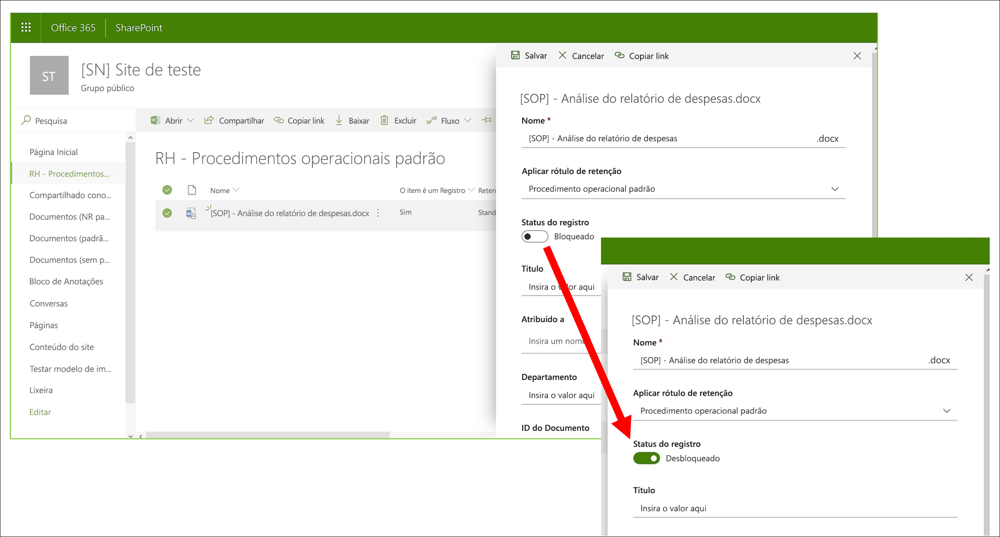
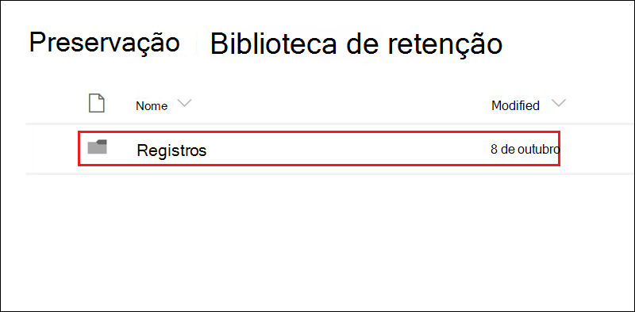

# Use o controle de versão de registro para atualizar os registros armazenados no SharePoint ou no OneDriveUse record versioning to update records stored in SharePoint or OneDrive

>*[Diretrizes de licenciamento do Microsoft 365 para segurança e conformidade](/office365/servicedescriptions/microsoft-365-service-descriptions/microsoft-365-tenantlevel-services-licensing-guidance/microsoft-365-security-compliance-licensing-guidance).**[Microsoft 365 licensing guidance for security & compliance](/office365/servicedescriptions/microsoft-365-service-descriptions/microsoft-365-tenantlevel-services-licensing-guidance/microsoft-365-security-compliance-licensing-guidance).*

>[!NOTE] 
> Como os registros regulatórios bloqueiam edição, a versão de registro não está disponível para registros regulatórios.Because regulatory records block editing, record versioning is not available for regulatory records.

A capacidade de marcar um documento como [registro](records-management.md#records) e restringir as ações que podem ser executadas no registro é uma meta essencial para qualquer solução de gerenciamento de registros.The ability to mark a document as a [record](records-management.md#records) and restrict actions that can be performed on the record is an essential goal for any records management solution. No entanto, a colaboração também pode ser necessária para as pessoas criarem versões posteriores.However, collaboration might also be needed for people to create subsequent versions.

Por exemplo, você pode marcar um contrato de vendas como registro, mas precisa atualizar o contrato com novos termos e marcar a versão mais recente como novo registro enquanto ainda mantém a versão do registro anterior.For example, you might mark a sales contract as a record, but then need to update the contract with new terms and mark the latest version as a new record while still retaining the previous record version. Para esses tipos de cenários, o SharePoint e o OneDrive oferecem suporte ao *controle de versão do registro*.For these types of scenarios, SharePoint and OneDrive support *record versioning*. As pastas do bloco de anotações do OneNote não oferecem suporte ao controle de versão do registro.OneNote notebook folders don't support record versioning.

Para usar o controle de versão de registro, primeiro [rotule o documento e marque-o como registro](declare-records.md).To use record versioning, you first [label the document and mark it as a record](declare-records.md). Nesse momento, uma propriedade do documento, chamada *Status do registro* será exibida ao lado do rótulo de retenção e o status inicial do registro será **Bloqueado**.At this point, a document property, called *Record status* is displayed next to the retention label, and the initial record status is **Locked**. 

Agora, você pode fazer o seguinte:You can now do the following things:

  - **Editar e reter continuamente versões individuais do documento como registros, desbloqueando e bloqueando a propriedade de Status do registro.****Continually edit and retain individual versions of the document as records, by unlocking and locking the Record status property.** Somente quando a propriedade **Status do registro** é definida como **Bloqueado** será mantida uma nova versão do registro.Only when the **Record status** property is set to **Locked** is a new version of the record retained. Essa alternância entre bloqueado e desbloqueado reduz o risco de manter versões e cópias desnecessárias do documento.This toggle of locked and unlocked reduces the risk of retaining unnecessary versions and copies of the document.

  - **Ter os registros armazenados automaticamente em um repositório de registros in-loco, localizado no conjunto de sites.****Have the records automatically stored in an in-place records repository located within the site collection.** Cada conjunto de sites no SharePoint e no OneDrive preserva o conteúdo em sua biblioteca de Retenção para Preservação.Each site collection in SharePoint and OneDrive preserves content in its Preservation Hold library. As versões de registro são armazenadas na pasta Registros nesta biblioteca.Record versions are stored in the Records folder in this library.

  - **Manter um documento perene que contenha todas as versões.****Maintain an evergreen document that contains all versions.** Por padrão, cada documento do SharePoint e do OneDrive têm um histórico de versão disponível no menu do item.By default, each SharePoint and OneDrive document has a version history available on the item menu. Nesse histórico de versão, você pode ver facilmente quais versões são registros e exibir esses documentos.In this version history, you can easily see which versions are records and view those documents.

O controle de versão do registro está disponível automaticamente para qualquer documento que tenha um rótulo de retenção que marque o item como registro.Record versioning is automatically available for any document that has a retention label that marks the item as a record. Quando um usuário exibe as propriedades do documento usando o painel de detalhes, eles podem alternar o **Status do registro** de **Bloqueado** para **Desbloqueado**.When a user views the document properties by using the details pane, they can toggle the **Record status** from **Locked** to **Unlocked**. Essa ação cria um registro na pasta Registros na Biblioteca de Retenção para Preservação, onde reside pelo restante do período de retenção.This action creates a record in the Records folder in the Preservation Hold library, where it resides for the remainder of its retention period. 

Enquanto o documento está desbloqueado, qualquer usuário com permissões de edição padrão pode editar o arquivo.While the document is unlocked, any user with standard edit permissions can edit the file. No entanto, os usuários não podem excluir o arquivo, porque ele continua sendo um registro.However, users can't delete the file, because it's still a record. Quando a edição estiver concluída, o usuário poderá alternar o **Status do registro** de **Desbloqueado** para **Bloqueado**, o que impede novas edições enquanto estiver nesse status.When editing is complete, a  user can then toggle the **Record status** from **Unlocked** to **Locked**, which prevents further edits while in this status.
  

## Bloqueando e desbloqueando um registroLocking and unlocking a record

Depois que um rótulo de retenção que marca o conteúdo como registro é aplicado a um documento, qualquer usuário com permissões de Contribuição ou com um nível de permissão mais restrito pode desbloquear um registro ou bloquear um registro desbloqueado.After a retention label that marks content as a record is applied to a document, any user with Contribute permissions or a narrower permission level can unlock a record or lock an unlocked record.
  

Quando um usuário desbloqueia um registro, as seguintes ações ocorrem:When a user unlocks a record, the following actions occur:

1. Se o conjunto de sites atual não tiver uma biblioteca de Retenção para Preservação, ela será criada.If the current site collection doesn't have a Preservation Hold library, one is created.

2. Se a biblioteca de Retenção para Preservação não tiver uma pasta Registros, ela será criada.If the Preservation Hold library doesn't have a Records folder, one is created.

3. Uma ação de **Copiar para** copia a versão mais recente do documento para a pasta Registros.A **Copy to** action copies the latest version of the document to the Records folder. A ação **Copiar para** inclui apenas a versão mais recente e nenhuma das versões anteriores.The **Copy to** action includes only the latest version and no prior versions. Este documento copiado agora é considerado uma versão de registro do documento e o nome do arquivo tem o formato: \[Versão GUID Título\#\]This copied document is now considered a record version of the document, and its file name has the format: \[Title GUID Version\#\]

4. A cópia criada na pasta Registros é adicionada ao histórico da versão do documento original, e esta versão mostra a palavra **Registro** no campo de comentários.The copy created in the Records folder is added to the version history of the original document, and this version shows the word **Record** in the comments field.

5. O documento original é uma nova versão que pode ser editada, mas não excluída.The original document is a new version that can be edited, but not deleted. A coluna da biblioteca de documentos **Item é um Registro** ainda mostra o valor **Sim** porque o documento continua sendo um registro, mesmo que agora possa ser editado.The document library column **Item is a Record** still shows the **Yes** value because the document is still a record, even if it can now be edited.

Quando um usuário bloqueia um registro, o documento original não poderá ser editado novamente.When a user locks a record, the original document again can't be edited. Mas é a ação de desbloquear um registro que copia uma versão para a pasta Registros na biblioteca de Retenção para Preservação.But it is the action of unlocking a record that copies a version to the Records folder in the Preservation Hold library.

## Versões de registroRecord versions

Sempre que um usuário desbloqueia um registro, a versão mais recente é copiada para a pasta Registros na biblioteca de Retenção para Preservação, e essa versão contém o valor de **Registro** no campo **Comentários** do histórico da versão.Each time a user unlocks a record, the latest version is copied to the Records folder in the Preservation Hold library, and that version contains the value of **Record** in the **Comments** field of the version history.
  

Para exibir o histórico da versão, escolha um documento na biblioteca de documentos e clique em **Histórico da Versão** no menu do item.To view the version history, select a document in the document library and then click **Version history** in the item menu.

## Onde os registros são armazenadosWhere records are stored

Os registros são armazenados na pasta Registros na biblioteca de Retenção para Preservação no site de nível superior do conjunto de sites.Records are stored in the Records folder in the Preservation Hold library in the top-level site in the site collection. Na barra de navegação à esquerda no site de nível superior, escolha **Conteúdos do site** \> **Biblioteca de Retenção para Preservação**.In the left navigation on the top-level site, choose **Site contents** \> **Preservation Hold Library**.
  

  

A biblioteca de Retenção para Preservação está visível somente para administradores de conjuntos de sites.The Preservation Hold library is visible only to site collection admins. Além disso, a biblioteca de Retenção para Preservação não existe por padrão.Also, the Preservation Hold library doesn't exist by default. Ela é criada apenas quando o conteúdo sujeito a um rótulo ou política de retenção é excluído pela primeira vez do conjunto de sites.It's created only when content subject to a retention label or retention policy is deleted for the first time in the site collection.

## Pesquisando o log de auditoria para eventos de controle de versão do registroSearching the audit log for record versioning events

As ações de bloqueio e desbloqueio de registros são registradas no log de auditoria.The actions of locking and unlocking records are logged in the audit log. Você pode pesquisar pelas atividades específicas **Status do registro alterado para bloqueado** e **Status do registro alterado para desbloqueado**, que estão localizadas na seção **Atividades de arquivo e página** na lista suspensa de **Atividades** na página de **Pesquisa de log de auditoria** no centro de conformidade e segurança.You can search for the specific activities **Changed record status to locked** and **Changed record status to unlocked**, which are located in the **File and page activities** section in the **Activities** dropdown list on the **Audit log search** page in the security and compliance center.
  

Para obter mais informações sobre a pesquisa desses eventos, confira a seção "Atividades de arquivo e página" em [Pesquisar o log de auditoria no Centro de Conformidade e Segurança](search-the-audit-log-in-security-and-compliance.md#file-and-page-activities).For more information about searching for these events, see the "File and page activities" section in [Search the audit log in the Security & Compliance Center](search-the-audit-log-in-security-and-compliance.md#file-and-page-activities).

## Próximas etapasNext steps

Para outros cenários com suporte para o gerenciamento de registros, confira [Cenários comuns de gerenciamento de registros](get-started-with-records-management.md#common-scenarios-for-records-management).For other scenarios supported by records management, see [Common scenarios for records management](get-started-with-records-management.md#common-scenarios-for-records-management).