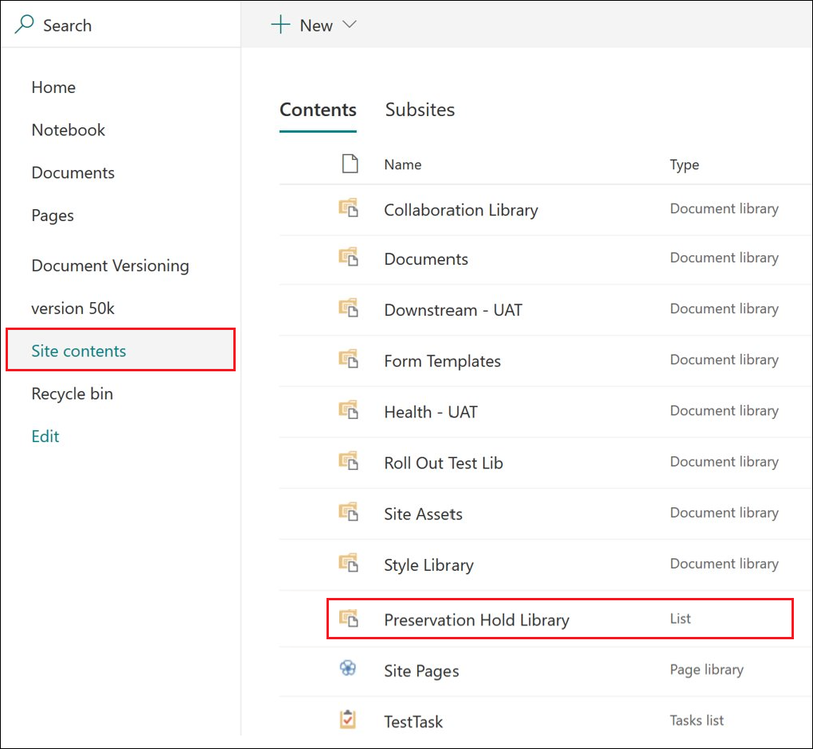

# Use o controle de versão de registro para atualizar os registros armazenados no SharePoint ou no OneDrive

>*[Diretrizes de licenciamento do Microsoft 365 para segurança e conformidade](https://aka.ms/ComplianceSD).*

A capacidade de marcar um documento como [registro](records-management.md#records) e restringir as ações que podem ser executadas no registro é uma meta essencial para qualquer solução de gerenciamento de registros. No entanto, a colaboração também pode ser necessária para as pessoas criarem versões posteriores.

Por exemplo, você pode marcar um contrato de vendas como registro, mas precisa atualizar o contrato com novos termos e marcar a versão mais recente como novo registro enquanto ainda mantém a versão do registro anterior. Para esses tipos de cenários, o SharePoint e o OneDrive oferecem suporte ao *controle de versão do registro*. As pastas do bloco de anotações do OneNote não oferecem suporte ao controle de versão do registro.

Para usar o controle de versão de registro, primeiro [rotule o documento e marque-o como registro](declare-records.md). Nesse momento, uma propriedade do documento, chamada *Status do registro* será exibida ao lado do rótulo de retenção e o status inicial do registro será **Bloqueado**. 

Agora, você pode fazer o seguinte:

  - **Editar e reter continuamente versões individuais do documento como registros, desbloqueando e bloqueando a propriedade de Status do registro.** Somente quando a propriedade **Status do registro** é definida como **Bloqueado** será mantida uma nova versão do registro. Essa alternância entre bloqueado e desbloqueado reduz o risco de manter versões e cópias desnecessárias do documento.

  - **Ter os registros armazenados automaticamente em um repositório de registros in-loco, localizado no conjunto de sites.** Cada conjunto de sites no SharePoint e no OneDrive preserva o conteúdo em sua biblioteca de Retenção para Preservação. As versões de registro são armazenadas na pasta Registros nesta biblioteca.

  - **Manter um documento perene que contenha todas as versões.** Por padrão, cada documento do SharePoint e do OneDrive têm um histórico de versão disponível no menu do item. Nesse histórico de versão, você pode ver facilmente quais versões são registros e exibir esses documentos.

O controle de versão do registro está disponível automaticamente para qualquer documento que tenha um rótulo de retenção que marque o item como registro. Quando um usuário exibe as propriedades do documento usando o painel de detalhes, eles podem alternar o **Status do registro** de **Bloqueado** para **Desbloqueado**. Essa ação cria um registro na pasta Registros na Biblioteca de Retenção para Preservação, onde reside pelo restante do período de retenção. 

Enquanto o documento está desbloqueado, qualquer usuário com permissões de edição padrão pode editar o arquivo. No entanto, os usuários não podem excluir o arquivo, porque ele continua sendo um registro. Quando a edição estiver concluída, o usuário poderá alternar o **Status do registro** de **Desbloqueado** para **Bloqueado**, o que impede novas edições enquanto estiver nesse status.
  

## Bloqueando e desbloqueando um registro

Depois que um rótulo de retenção que marca o conteúdo como registro é aplicado a um documento, qualquer usuário com permissões de Contribuição ou com um nível de permissão mais restrito pode desbloquear um registro ou bloquear um registro desbloqueado.
  

Quando um usuário desbloqueia um registro, as seguintes ações ocorrem:

1. Se o conjunto de sites atual não tiver uma biblioteca de Retenção para Preservação, ela será criada.

2. Se a biblioteca de Retenção para Preservação não tiver uma pasta Registros, ela será criada.

3. Uma ação de **Copiar para** copia a versão mais recente do documento para a pasta Registros. A ação **Copiar para** inclui apenas a versão mais recente e nenhuma das versões anteriores. Este documento copiado agora é considerado uma versão de registro do documento e o nome do arquivo tem o formato: \[Versão GUID Título\#\]

4. A cópia criada na pasta Registros é adicionada ao histórico da versão do documento original, e esta versão mostra a palavra **Registro** no campo de comentários.

5. O documento original é uma nova versão que pode ser editada, mas não excluída. A coluna da biblioteca de documentos **Item é um Registro** ainda mostra o valor **Sim** porque o documento continua sendo um registro, mesmo que agora possa ser editado.

Quando um usuário bloqueia um registro, o documento original não poderá ser editado novamente. Mas é a ação de desbloquear um registro que copia uma versão para a pasta Registros na biblioteca de Retenção para Preservação.

## Versões de registro

Sempre que um usuário desbloqueia um registro, a versão mais recente é copiada para a pasta Registros na biblioteca de Retenção para Preservação, e essa versão contém o valor de **Registro** no campo **Comentários** do histórico da versão.
  

Para exibir o histórico da versão, escolha um documento na biblioteca de documentos e clique em **Histórico da Versão** no menu do item.

## Onde os registros são armazenados

Os registros são armazenados na pasta Registros na biblioteca de Retenção para Preservação no site de nível superior do conjunto de sites. Na barra de navegação à esquerda no site de nível superior, escolha **Conteúdos do site** \> **Biblioteca de Retenção para Preservação**.
  

  

A biblioteca de Retenção para Preservação está visível somente para administradores de conjuntos de sites. Além disso, a biblioteca de Retenção para Preservação não existe por padrão. Ela é criada apenas quando o conteúdo sujeito a um rótulo ou política de retenção é excluído pela primeira vez do conjunto de sites.

## Pesquisando o log de auditoria para eventos de controle de versão do registro

As ações de bloqueio e desbloqueio de registros são registradas no log de auditoria. Você pode pesquisar pelas atividades específicas **Status do registro alterado para bloqueado** e **Status do registro alterado para desbloqueado**, que estão localizadas na seção **Atividades de arquivo e página** na lista suspensa de **Atividades** na página de **Pesquisa de log de auditoria** no centro de conformidade e segurança.
  

Para obter mais informações sobre a pesquisa desses eventos, confira a seção "Atividades de arquivo e página" em [Pesquisar o log de auditoria no Centro de Conformidade e Segurança](search-the-audit-log-in-security-and-compliance.md#file-and-page-activities).

## Próximas etapas

Para outros cenários com suporte para o gerenciamento de registros, confira [Cenários comuns de gerenciamento de registros](get-started-with-records-management.md#common-scenarios-for-records-management).
