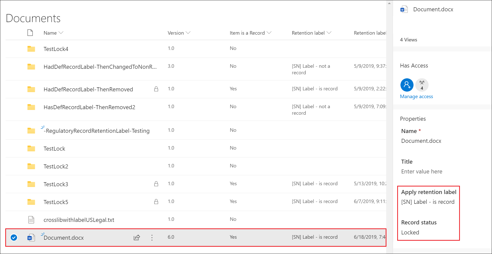
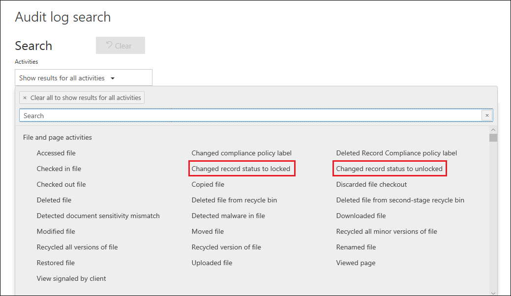

# Visão geral de registros

>*[Diretrizes de licenciamento do Microsoft 365 para segurança e conformidade](https://aka.ms/ComplianceSD).*

O gerenciamento de registros no Microsoft 365 ajuda a organização a cumprir suas políticas corporativas, obrigações legais e regulatórias, reduzindo o risco e a responsabilidade legal.

Em um nível alto, declarar o conteúdo como um registro significa que:

- O item se torna imutável (um registro não pode ser modificado ou excluído)

- Atividades adicionais sobre o item são registradas

- Os registros são descartados após o término do período de retenção indicado

Você pode usar [rótulos de retenção](labels.md) para classificar o conteúdo como um registro. Depois de criar rótulos de retenção que declaram registros, você pode [publicar](labels.md#how-retention-labels-work-with-retention-label-policies) esses rótulos (para que os usuários possam usá-los para classificar conteúdos como registros) ou [aplicar automaticamente esses rótulos](labels.md#applying-a-retention-label-automatically-based-on-conditions) ao conteúdo que você deseja classificar como um registro. Ao usar rótulos de retenção para declarar registros, você pode implementar uma estratégia gerenciamento de registros única e consistente no Office 365, enquanto outros recursos de gerenciamento de registros, como a Central de Registros, se aplicam apenas ao conteúdo do SharePoint Online.

Lembre-se do seguinte sobre os registros:

  - **Os registros são imutáveis.** Um rótulo de retenção que declara o conteúdo como um registro pode ser aplicado ao conteúdo do Exchange, além do SharePoint e do OneDrive for Business. No entanto, o [controle de versão do registro](#record-versioning) está disponível apenas no SharePoint e OneDrive, e não no Exchange.

    No Exchange, o conteúdo rotulado como registro é imutável até sua exclusão final. Quando um item do Exchange é rotulado como um registro, ocorren quatro coisas:

    - Não é possível excluir o item não permanentemente.

    - Não é possível editar o item.

    - Não é possível alterar o rótulo.

    - Não é possível remover o rótulo.

  - **Registros e pastas** Você pode aplicar um rótulo de retenção a uma pasta do Exchange, mas não do SharePoint ou do OneDrive. Se uma pasta for rotulada como um registro e você mover um item para a pasta, o item será rotulado como um registro. Ao mover o item para fora da pasta, o item permanecerá a ser rotulado como um registro.

    Além disso, caso altere o rótulo de registro aplicado a uma pasta (do SharePoint e do OneDrive) para um rótulo de retenção que não declare conteúdo como um registro, os itens da pasta manterão o rótulo de registro existente.

    Para saber mais sobre como aplicar rótulos de retenção às pastas do Sharepoint e do OneDrive, confira [Aplicando um rótulo de retenção padrão a todo o conteúdo de uma biblioteca, pasta ou de um conjunto de documentos do SharePoint](labels.md#applying-a-default-retention-label-to-all-content-in-a-sharepoint-library-folder-or-document-set).

  - **Não é possível excluir registros**. Se um usuário tentar excluir um registro no Exchange, o item será movido para a pasta Itens Recuperáveis, conforme descrito em [Como uma política de retenção funciona com o conteúdo in-loco](retention-policies.md#content-in-mailboxes-and-public-folders).

    Se um usuário tentar excluir um registro no SharePoint, verá um erro informando que o item não foi excluído e permanecerá na biblioteca.

    

    Se um usuário tentar excluir um registro no OneDrive, o item é movido para a biblioteca de Retenção para Preservação, conforme descrito em [Como funciona a política de retenção com conteúdo in-loco](retention-policies.md#content-in-onedrive-accounts-and-sharepoint-sites).

  - **Os rótulos de registros não podem ser removidos.** Depois que um rótulo de registro é aplicado a um item, somente o administrador desse local (por exemplo, um administrador de conjunto de sites de um site do SharePoint) poderá remover esse rótulo de registro.

## Usando rótulos de retenção para declarar registros

Quando você cria um rótulo de retenção, tem a opção de usar o rótulo de retenção para classificar o conteúdo como um registro. Para declarar o conteúdo como um registro, siga estas etapas:

1. Criar uma política de retenção. No centro de conformidade do Microsoft 365, vá para **Gerenciamento de Registros** \> **Plano de Arquivo**. Na página **Planejamento de arquivos**, clique em **Criar um rótulo**.

2. Na página **Configurações de rótulo** no Assistente, escolha a opção para definir o rótulo de retenção para declarar o conteúdo como um registro.
    
   

3. [Publicar](labels.md#how-retention-labels-work-with-retention-label-policies) ou [aplicar automaticamente](labels.md#applying-a-retention-label-automatically-based-on-conditions) o rótulo de retenção aos sites do SharePoint e/ou contas do OneDrive.

### Aplicando um rótulo de retenção ao conteúdo

Para o Exchange, qualquer usuário com acesso de gravação à caixa de correio pode aplicar um rótulo de registro a uma mensagem de email. Para conteúdo no SharePoint e OneDrive, qualquer usuário no grupo Membros padrão (o nível de permissão da Contribuição) poderá aplicar um rótulo de registro ao conteúdo. Somente um administrador do conjunto de sites pode alterar ou remover esse rótulo de registro depois de aplicado. Como explicado anteriormente, um rótulo de retenção que classifica o conteúdo como um registro pode ser aplicado automaticamente ao conteúdo.

Veja aqui como fica quando um rótulo de registro é aplicado a um documento em um site do SharePoint ou em uma conta do OneDrive.
  

## Controle de versão do registro

Uma parte essencial do gerenciamento de registros é a capacidade de declarar um documento como um registro e ter esse registro imutável. Ao mesmo tempo, a imutabilidade do registro impede a colaboração no documento, caso seja necessário criar versões subsequentes. Por exemplo, você pode declarar um contrato de vendas como um registro, mas precisa atualizar o contrato com novos termos e declarar a versão mais recente como um novo registro enquanto ainda mantém a versão do registro anterior. Para esses tipos de cenários, o SharePoint Online e o OneDrive for Business agora oferecem suporte ao *controle de versão do registro*. Não há suporte para pastas de bloco de anotações do OneNote.

Para usar o controle de versão do registro, a primeira etapa é usar o centro de conformidade do Microsoft 365 para criar e publicar rótulos de retenção que declarem registros a todos os sites do SharePoint e/ou contas do OneDrive, ou publicá-los em sites específicos do SharePoint e/ou contas do OneDrive. A próxima etapa é aplicar um rótulo de registro de retenção publicado a um documento. Quando isto estiver concluído, uma propriedade do documento, chamada *Status do registro*, será exibida ao lado do rótulo de retenção e o status inicial do registro será **Bloqueado**. Nesse momento, você poderá fazer as seguintes ações:

  - **Editar e declarar continuamente versões individuais do documento como registros, desbloqueando e bloqueando a propriedade de Status do registro.** Somente as versões declaradas como registros são mantidas quando a propriedade de **Status do registro** é configurada como **Bloqueado**. Isso reduz o risco de manter versões e cópias desnecessárias do documento.

  - **Ter os registros armazenados automaticamente em um repositório de registros in-loco, localizado no conjunto de sites.** Cada conjunto de sites no SharePoint e no OneDrive preserva o conteúdo em sua biblioteca de Retenção para Preservação. As versões de registro são armazenadas na pasta Registros nesta biblioteca.

  - **Manter um documento perene que contenha todas as versões.** Por padrão, cada documento do SharePoint e do OneDrive têm um histórico de versão disponível no menu do item. Nesse histórico de versão, você pode ver facilmente quais versões são registros e exibir esses documentos.

O controle de versão do registro está disponível automaticamente para qualquer documento que tenha um rótulo de retenção que declare o item como um registro. Quando um usuário exibe as propriedades do documento através do painel de detalhes, eles alternam o **Status do registro** de **Bloqueado** para **Desbloqueado**. Esse único clique cria um registro na pasta Registros na biblioteca de Retenção para Preservação, onde reside pelo restante do período de retenção. Enquanto o documento estiver desbloqueado, qualquer usuário com permissões poderá editar o arquivo. No entanto, os usuários não podem excluir o arquivo, porque ele é considerado um registro declarado. Depois de fazer as alterações necessárias, o usuário poderá alternar o **Status do registro** de **Desbloqueado** para **Bloqueado**, para que o documento seja novamente declarado um registro e não possa ser editado.
  

> [!NOTE]
> O controle de versão do registro requer uma licença do Office 365 Enterprise E5 para cada usuário que tenha permissão para editar o conteúdo que foi declarado como um registro em um site do SharePoint ou em uma conta do OneDrive. Os usuários que têm acesso somente leitura não precisam desta licença.

### Bloqueando e desbloqueando um registro

Depois que um rótulo de registro é atribuído a um documento, qualquer usuário com permissões de colaboração ou um nível de permissão mais estreito poderá desbloquear um registro ou bloquear um registro desbloqueado.
  

Quando um usuário desbloqueia um registro, as seguintes ações ocorrem:

1. Se o conjunto de sites atual não tiver uma biblioteca de Retenção para Preservação, ela será criada.

2. Se a biblioteca de Retenção para Preservação não tiver uma pasta Registros, ela será criada.

3. Uma ação de **Copiar para** copia a versão mais recente do documento para a pasta Registros. A ação **Copiar para** inclui apenas a versão mais recente e nenhuma das versões anteriores. Este documento copiado agora é considerado uma versão de registro do documento e o nome do arquivo tem o formato: \[Versão GUID Título\#\]

4. A cópia criada na pasta Registros foi adicionada ao histórico da versão do documento original, e esta versão mostra a palavra **Registro** no campo de comentários.

5. O documento original é uma nova versão que pode ser editada (mas não excluída). A coluna da biblioteca de documentos **Item é um Registro** ainda mostra o valor **Sim** porque o documento ainda é considerado um registro, mesmo que agora possa ser editado.

Quando um usuário bloqueia um registro, o documento original não poderá ser editado novamente. Mas é a ação de desbloquear um registro que copia uma versão para a pasta Registros na biblioteca de Retenção para Preservação.

### Versões de registro

Sempre que um usuário desbloqueia um registro, a versão mais recente é copiada para a pasta Registros na biblioteca de Retenção para Preservação, e essa versão contém o valor de **Registro** no campo **Comentários** do histórico da versão.
  

Para exibir o histórico da versão, escolha um documento na biblioteca de documentos e clique em **Histórico da Versão** no menu do item.

### Onde os registros são armazenados

Os registros são armazenados na pasta Registros na biblioteca de Retenção para Preservação no site de nível superior do conjunto de sites. Na barra de navegação à esquerda no site de nível superior, escolha **Conteúdos do site** \> **Biblioteca de Retenção para Preservação**.
  

  

A biblioteca de Retenção para Preservação está visível somente para administradores de conjuntos de sites. Além disso, a biblioteca de Retenção para Preservação não existe por padrão. Ela é criada apenas quando o conteúdo sujeito a um rótulo ou política de retenção é excluído pela primeira vez do conjunto de sites.

### Pesquisando o log de auditoria para eventos de controle de versão do registro

As ações de bloqueio e desbloqueio de registros são registradas no log de auditoria. Você pode pesquisar pelas atividades específicas **Status do registro alterado para bloqueado** e **Status do registro alterado para desbloqueado**, que estão localizadas na seção **Atividades de arquivo e página** na lista suspensa de **Atividades** na página de **Pesquisa de log de auditoria** no centro de conformidade e segurança.
  

Para obter mais informações sobre a pesquisa desses eventos, confira a seção "Atividades de arquivo e página" em [Pesquisar o log de auditoria no Centro de Conformidade e Segurança](search-the-audit-log-in-security-and-compliance.md#file-and-page-activities).
