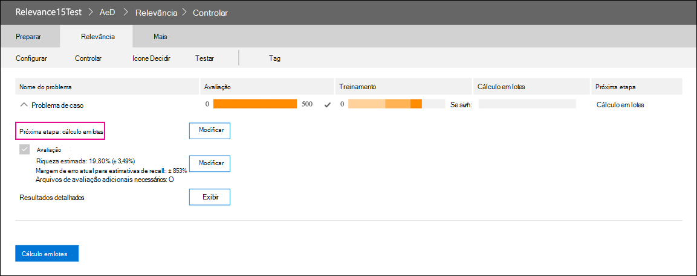

# Ressalção do módulo De relevância no Advanced eDiscoveryRetirement of the Relevance module in Advanced eDiscovery

Em 10 de março de 2021, estamos retirando o módulo De relevância no Advanced eDiscovery.On March 10, 2021, we are retiring the Relevance module in Advanced eDiscovery. Essa aposentadoria significa que as organizações não terão mais acesso ao módulo De relevância (indo para Gerenciar a relevância do conjunto de revisão em um caso Advanced eDiscovery) ou poderão acessar quaisquer modelos de  >   Relevância existentes.This retirement means that organizations will no longer have access to the Relevance module (by going to **Manage review set** > **Relevance** in an Advanced eDiscovery case) or be able to access any existing Relevance models. O módulo de Relevância atual que está sendo retirado será substituído por uma nova solução de codificação preditiva no 2º trimestre de 2021.The current Relevance module that is being retired will be replaced with a new predictive coding solution in Q2 CY 2021. Essa nova funcionalidade permitirá que as organizações criem seus próprios modelos de codificação preditivos em um fluxo de trabalho mais fácil e intuitivo.This new functionality will let organizations build their own predictive coding models in an easier and more intuitive workflow.

Para se preparar para essa próxima aposentadoria, recomendamos que as organizações que usam o módulo De relevância exportem a saída do modelo antes da data de aposentadoria executando um cálculo em lotes para todos os modelos existentes.To prepare for this upcoming retirement, we recommend that organizations who use the Relevance module export their model’s output before the retirement date by running a Batch calculation for all existing models. Todas as pontuações de Relevância do seu modelo serão armazenadas permanentemente no conjunto de revisão correspondente e acessíveis quando os documentos são exportados.All Relevance scores from your model will be permanently stored in the corresponding review set and accessible when documents are exported. As pontuações de relevância também são mantidas como metadados no arquivo de carga.Relevance scores are also retained as metadata in the load file. Além disso, você ainda poderá filtrar conteúdo no conjunto de revisão com base na pontuação de relevância e ter acesso a todos os metadados produzidos por seus modelos de Relevância.Also, you will still be able to filter content in the review set based on relevance score and have access to all metadata produced by your Relevance models.

## Concluir modelos não concluídosComplete unfinished models

Para quaisquer modelos de Relevância não concluídos, conclua a avaliação, o treinamento e o cálculo em lotes para que você possa aplicar o modelo aos documentos em um conjunto de revisão.For any unfinished Relevance models, please complete assessment, training, and Batch calculation so that you can apply the model to the documents in a review set. Concluir o cálculo em lotes preservará as informações após a data de aposentadoria do módulo De relevância.Completing the Batch calculation will preserve the information after the retirement date of the Relevance module.

Aqui estão as etapas para concluir quaisquer modelos não concluídos:Here are the steps to complete any unfinished models:

1. Treine seu modelo até que ele esteja estabilizado e pronto para cálculo em lotes.Train your model until it is stabilized and ready for Batch calculation. Consulte [Treinamento de marcação e relevância.](tagging-and-relevance-training-in-advanced-ediscovery.md)See [Tagging and Relevance training](tagging-and-relevance-training-in-advanced-ediscovery.md).

   A captura de tela a seguir mostra um módulo que está pronto para um cálculo batch.The following screenshot shows a module that is ready for a Batch calculation. Observe que a Avaliação e Treinamento está concluída e a próxima etapa é executar o cálculo em lotes.Notice that the Assessment and Training is complete, and the next step is to run Batch calculation.

   

2. Execute o cálculo batch.Run the Batch calculation. Consulte [Perform Batch calculation](track-relevance-analysis-in-advanced-ediscovery.md#performing-batch-calculation).See [Performing Batch calculation](track-relevance-analysis-in-advanced-ediscovery.md#performing-batch-calculation).

3. Verifique se o cálculo em lotes foi bem-sucedido.Verify that Batch calculation was successful. Consulte [Resultados de cálculo em lotes](track-relevance-analysis-in-advanced-ediscovery.md#batch-calculation-results).See [Batch calculation results](track-relevance-analysis-in-advanced-ediscovery.md#batch-calculation-results).

Para ajudar a concluir modelos de relevância não concluídos, entre em contato com o Suporte da Microsoft.For help with completing unfinished Relevance models, contact Microsoft Support.
