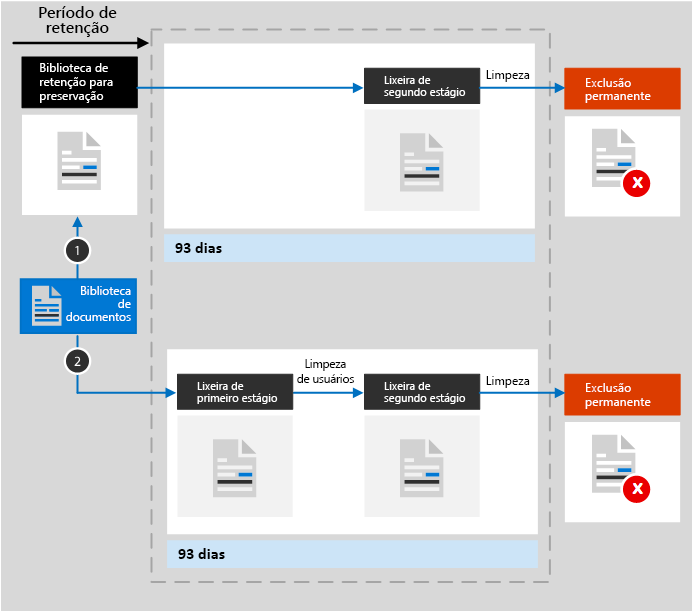

# Saiba mais sobre retenção para o SharePoint e o OneDrive

>*[Diretrizes de licenciamento do Microsoft 365 para segurança e conformidade](https://aka.ms/ComplianceSD).*

As informações contidas neste artigo complementam [Saiba mais sobre retenção](retention.md) porque são informações específicas para o SharePoint e o OneDrive.

Para outras cargas de trabalho, confira:

- [Saiba mais sobre retenção para o Microsoft Teams](retention-policies-teams.md)
- [Saiba mais sobre retenção no Yammer](retention-policies-yammer.md)
- [Saiba mais sobre a retenção para o Exchange](retention-policies-exchange.md)

## O que está incluído para retenção e exclusão

Todos os arquivos armazenados em sites do Microsoft Office SharePoint Online ou Microsoft OneDrive podem ser retidos aplicando uma política de retenção ou rótulo de retenção. 

Os seguintes arquivos podem ser excluídos:

- Quando você usa uma política de retenção: Todos os arquivos em bibliotecas de documentos, que incluem quaisquer bibliotecas de documentos do Microsoft Office SharePoint Online criadas automaticamente, como **Ativos de Sites**.
    
- Quando você usa rótulos de retenção: todos os arquivos em todas as bibliotecas de documentos e todos os arquivos no nível raiz que não estão em uma pasta.
    
> [!TIP]
> Ao usar uma [consulta com uma política de aplicação automática para um rótulo de retenção](apply-retention-labels-automatically.md#auto-apply-labels-to-content-with-keywords-or-searchable-properties), você pode excluir bibliotecas de documentos usando a seguinte entrada: `NOT(DocumentLink:"<URL to document library>")`

As configurações de retenção não se aplicam às estruturas de organização que incluem bibliotecas, listas e pastas. Nem para itens nas listas do sistema, que são listas ocultas usadas pelo SharePoint para gerenciar o sistema e incluem o catálogo de página mestra, o catálogo de soluções e as fontes de dados.

Para políticas de retenção e políticas de aplicação automática: sites do SharePoint devem ser indexados para que as configurações de retenção sejam aplicadas. No entanto, se os itens nas bibliotecas de documentos do Microsoft Office SharePoint Online forem configurados para não aparecer nos resultados da pesquisa, essa configuração não excluirá os itens das configurações de retenção.

## Como funciona a retenção para o SharePoint e o OneDrive

Para oferecer suporte à retenção, o Microsoft Office SharePoint Online e o Microsoft OneDrive criam uma Biblioteca de Retenção para Preservação, se não houver uma. Você pode ver essa biblioteca na página **Conteúdo do site** no site de nível superior do conjunto de sites. A maioria dos usuários não poderá ver a biblioteca de Retenção para Preservação porque ela só fica visível para os administradores do conjunto de sites.
  
Se alguém tentar alterar ou excluir um documento sujeito às configurações de retenção, será verificado se o conteúdo foi alterado desde que as configurações de retenção foram aplicadas. Se essa for a primeira alteração desde que as configurações de retenção foram aplicadas, o conteúdo é copiado para a Biblioteca de Retenção para Preservação, permitindo que a pessoa altere ou exclua o conteúdo original. Todo o conteúdo em um conjunto de sites pode ser copiado para a Biblioteca de Retenção para Preservação, independentemente das configurações de retenção.
  
Um trabalho do temporizador limpa periodicamente a Biblioteca de Retenção para Preservação. Esta tarefa compara todo o conteúdo da Biblioteca de Retenção para Preservação com todas as configurações de retenção para aquele conteúdo. O conteúdo anterior ao período de retenção configurado é excluído da Biblioteca de Retenção para Preservação e do local original, se ainda estiver lá. Este trabalho temporizado é executado a cada sete dias, o que significa que pode levar até sete dias para que o conteúdo seja apagado.
  
Esse comportamento se aplica ao conteúdo que existe quando as configurações de retenção foram aplicadas. Além disso, para políticas de retenção, qualquer conteúdo novo criado ou adicionado ao conjunto de sites depois que ele tiver sido incluído na política será retido após a exclusão. Entretanto, o novo conteúdo não será copiado para a Biblioteca de Retenção para Preservação na primeira vez em que for editado, somente quando for excluído. Para manter todas as versões de um arquivo, você deve ativar o [controle de versão](#how-retention-works-with-document-versions).
  
O usuário recebe um erro se tentar excluir uma biblioteca, lista, pasta ou um site sujeitos a uma política de retenção. Para excluir uma pasta, o usuário deve mover ou excluir todos os arquivos da pasta que estejam sujeitos à política. Além disso, a Biblioteca de Retenção para Preservação é criada nesse estágio, e não quando você cria uma política de retenção ou aplica um rótulo de retenção. Isso significa que, para testar a retenção, você deve primeiro editar ou excluir um documento em um site sujeito à política de retenção ou que tenha um rótulo de retenção aplicado, e, em seguida, navegar até a Biblioteca de Retenção para Preservação para exibir a cópia retida.
  
Depois de atribuir as configurações de retenção ao conteúdo em uma conta do OneDrive ou em um site do SharePoint, os caminhos que o conteúdo assume dependem se as configurações de retenção forem para reter e excluir, reter somente, ou excluir somente.

Quando as configurações de retenção são reter e excluir:

  
1. **Se o conteúdo for modificado ou excluído** durante o período de retenção, uma cópia do conteúdo original existente na ocasião em que a política de retenção foi atribuída será criada na Biblioteca de Retenção para Preservação. Lá, o trabalho do temporizador identifica itens cujo período de retenção expirou. Esses são movidos para a lixeira de segundo estágio, onde serão excluídos permanentemente após 93 dias. A lixeira de segundo estágio não está visível para os usuários finais (somente a lixeira de primeiro estágio está), mas os administradores de conjunto de sites podem exibir e restaurar o conteúdo de lá.

    > [!NOTE]
    > Para ajudar a evitar a perda de dados acidental, não excluímos mais permanentemente o conteúdo da biblioteca de Retenção para Preservação. Em vez disso, excluímos permanentemente somente o conteúdo da lixeira, portanto, todo o conteúdo da Biblioteca de Retenção para Preservação agora passará pela lixeira de segundo estágio.
    
2. **Se o conteúdo não for modificado ou excluído** durante o período de retenção, o trabalho do temporizador move o conteúdo para a lixeira de primeiro estágio no final do período de retenção. Se um usuário excluir o conteúdo da lixeira ou esvaziá-la (processo também conhecido como limpeza), o documento será movido para a lixeira de segundo estágio. Um período de retenção de 93 dias abrange as lixeiras do primeiro e do segundo estágio. No final de 93 dias, o documento é excluído permanentemente de onde estiver, na Lixeira de primeiro ou de segundo estágio. Como a lixeira não está indexada, ela não está disponível para pesquisa. Como resultado, uma pesquisa de descoberta eletrônica não encontra conteúdos da lixeira para colocar uma retenção.

Quando as configurações forem reter somente ou excluir somente, os caminhos de conteúdo serão variações de reter e excluir:

### Caminhos de conteúdo para as configurações de reter somente

1. **Se o conteúdo for modificado ou excluído** durante o período de retenção: uma cópia do documento original é criada na Biblioteca de Retenção para Preservação e retida até o fim do período de retenção, quando a cópia na Biblioteca de Retenção para Preservação é movida para a lixeira de segundo estágio e é excluída permanentemente após 93 dias.

2. **Se o conteúdo não for modificado ou excluído** durante o período de retenção: nada acontece antes e depois do período de retenção; o documento permanecerá no local original.

### Caminhos de conteúdo para as configurações de excluir somente

1. **Se o conteúdo for excluído** durante o período configurado: o documento será movido para a lixeira de primeiro estágio. Se um usuário excluir o documento da lixeira ou esvaziá-la, o documento será movido para a lixeira de segundo estágio. Um período de retenção de 93 dias abrange as lixeiras de primeiro e de segundo estágio. Após os 93 dias, o documento será excluído permanentemente de onde estiver, seja na lixeira de primeiro ou de segundo estágio. Se o conteúdo for modificado durante o período configurado, ele seguirá o mesmo caminho de exclusão depois do período configurado.

2. **Se o conteúdo não for excluído** durante o período configurado: no final do período configurado na política de retenção, o documento é movido para a lixeira de primeiro estágio. Se um usuário excluir o documento da lixeira ou esvaziá-la (processo também conhecido como limpeza), o documento será movido para a lixeira de segundo estágio. Um período de retenção de 93 dias abrange as lixeiras de primeiro e de segundo estágio. Após os 93 dias, o documento será excluído permanentemente de onde estiver, seja na lixeira de primeiro ou de segundo estágio. Como a lixeira não está indexada, ela não está disponível para pesquisa. Como resultado, uma pesquisa de descoberta eletrônica não encontra conteúdos da lixeira para colocar uma retenção.

## Como funciona a retenção para o conteúdo do Microsoft OneNote

Ao aplicar uma política de retenção a um local que inclui o conteúdo do Microsoft OneNote, nos bastidores, as diferentes seções do Microsoft OneNote são arquivos individuais. Isso significa que cada seção será retida e excluída individualmente, de acordo com as configurações de retenção que você especificar.

## Como funciona a retenção com versões de documentos

O controle de versão é um recurso de todas as listas de documentos e bibliotecas no Microsoft Office SharePoint Online e Microsoft OneDrive. Por padrão, o controle de versão mantém um mínimo de 500 versões principais, embora esse limite possa ser aumentado. Para saber mais, confira [Habilitar e configurar o controle de versão para uma lista ou biblioteca](https://support.office.com/article/1555d642-23ee-446a-990a-bcab618c7a37) e [Como funciona o controle de versão em listas e bibliotecas](https://support.microsoft.com/office/how-versioning-works-in-lists-and-libraries-0f6cd105-974f-44a4-aadb-43ac5bdfd247).
  
Quando um documento com versões está sujeito a configurações de retenção para reter esse conteúdo, as versões que são copiadas para a Biblioteca de Retenção de Preservação existem como um item separado. Se as configurações de retenção forem definidas para exclusão no final do período de retenção:

- Se o período de retenção se basear em quando o conteúdo foi criado, cada versão terá a mesma data de expiração do documento original. O documento original e suas versões expiram ao mesmo tempo.

- Se a período de retenção estiver baseado na data da última modificação do conteúdo, cada versão terá sua própria data de expiração com base em quando o documento original foi modificado para criar essa versão. O documento original e suas versões expiram independentemente um do outro.

> [!NOTE]
> As versões retidas desses documentos do Microsoft Office SharePoint Online e do Microsoft OneDrive não podem ser pesquisadas por ferramentas de descoberta eletrônica.

Quando a ação de retenção é excluir o documento, todas as versões que não estão na Biblioteca de Retenção para Preservação serão excluídas ao mesmo tempo, de acordo com a versão atual.

Para itens sujeitos a uma política de retenção (ou uma suspensão do descoberta eletrônica), os limites de versão da biblioteca de documentos são ignorados até que o período de retenção do documento seja atingido (ou a suspensão da descoberta eletrônica seja liberada). Nesse cenário, as versões antigas não são eliminadas automaticamente e os usuários são impedidos de excluir versões.

Esse não é o caso dos rótulos de retenção quando o conteúdo não está sujeito a uma política de retenção (ou uma retenção de descoberta eletrônica). Em vez disso, os limites de controle de versão são cumpridos, de modo que as versões mais antigas sejam automaticamente excluídas para acomodar novas versões, mas os usuários ainda poderão excluir versões.

## Quando um usuário sair da organização

**SharePoint** :

Quando um usuário sai organização, qualquer conteúdo criado por ele não será afetado porque o SharePoint é considerado um ambiente colaborativo, ao contrário da caixa de correio ou da conta OneDrive de um usuário.

**OneDrive** :

Se um usuário sair da organização, quaisquer arquivos sujeitos a uma política de retenção ou que tenham rótulos de retenção permanecerão pela duração da política ou do rótulo.  Durante esse período, todo o acesso à compartilhamentos continua a funcionar. Quando o período de retenção expira, o conteúdo é movido para a Lixeira de Conjuntos de Sites e não pode ser acessado por ninguém, exceto pelo administrador. Se um documento for marcado por um rótulo de retenção como um registro, o documento não será excluído até que o período de retenção termine, após o qual o conteúdo será permanentemente excluído.

## Instruções de configuração

Se você é novo na configuração de retenção no Microsoft 365, consulte [Começar com políticas e rótulos de retenção](get-started-with-retention.md).

Se você estiver pronto para configurar uma política de retenção ou rótulo de retenção do Exchange, consulte as instruções a seguir:
- [Criar e configurar políticas de retenção](create-retention-policies.md)
- [Criar rótulos de retenção e aplicá-los em aplicativos](create-apply-retention-labels.md)
- [Aplicar um rótulo de retenção automaticamente ao conteúdo](apply-retention-labels-automatically.md)
