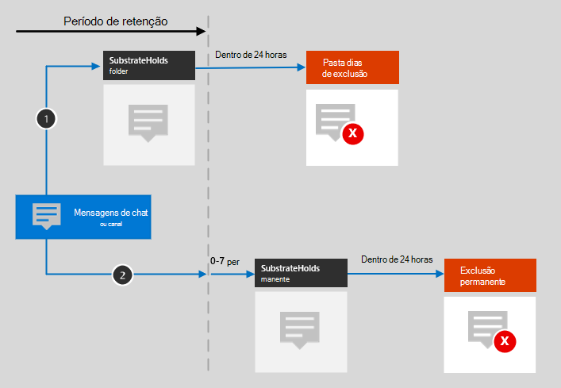

# Saiba mais sobre as políticas de retenção para o Microsoft TeamsLearn about retention policies for Microsoft Teams

>*[Diretrizes de licenciamento do Microsoft 365 para segurança e conformidade](https://aka.ms/ComplianceSD).**[Microsoft 365 licensing guidance for security & compliance](https://aka.ms/ComplianceSD).*

As informações contidas neste artigo complementam [Saiba mais sobre as políticas de retenção](retention-policies.md) porque são informações específicas para o Microsoft Teams.The information in this article supplements [Learn about retention policies](retention-policies.md) because it has information that's specific to Microsoft Teams.

## Como uma política de retenção funciona com o Microsoft TeamsHow a retention policy works with Microsoft Teams

Você pode usar uma política de retenção para reter chats e mensagens de canal no Teams.You can use a retention policy to retain chats and channel messages in Teams. Os chats do Teams são armazenados em uma pasta oculta na caixa de correio de cada usuário participante do chat, e as mensagens do canal do Teams são armazenadas em uma pasta oculta semelhante na caixa de correio do grupo da equipe.Teams chats are stored in a hidden folder in the mailbox of each user included in the chat, and Teams channel messages are stored in a similar hidden folder in the group mailbox for the team. 

No entanto, é importante compreender que o Teams usa um serviço de chat fornecido pelo Azure que também armazena esses dados e, por padrão, esse serviço armazena os dados para sempre.It's important to understand that Teams uses an Azure-powered chat service that also stores this data, and by default this service stores the data indefinitely. Por esse motivo, é altamente recomendável usar os locais do Teams para reter e excluir os dados do Teams.For this reason, we strongly recommend that you use the Teams locations to retain and delete Teams data. Usar os locais do Teams exclui permanentemente os dados da caixa de correio do Exchange e do serviço de chat subjacente fornecido pelo Azure.Using the Teams locations will permanently delete data from both the Exchange mailboxes and the underlying Azure-powered chat service. Para saber mais, confira [Segurança e conformidade no Microsoft Teams](https://go.microsoft.com/fwlink/?linkid=871258) e, especificamente, a seção [Arquitetura de Proteção de Informações](https://docs.microsoft.com/MicrosoftTeams/security-compliance-overview#information-protection-architecture).For more information, see [Security and compliance in Microsoft Teams](https://go.microsoft.com/fwlink/?linkid=871258) and specifically, the [Information Protection Architecture](https://docs.microsoft.com/MicrosoftTeams/security-compliance-overview#information-protection-architecture) section.

Os chats e mensagens do canal do Teams não são afetados pelas políticas de retenção aplicadas às caixas de correio de usuário ou de grupos.Teams chats and channel messages are not affected by retention policies that are configured for user or group mailboxes. Embora conversas de equipe e mensagens de canal do Teams sejam armazenadas no Exchange, estes dados do Teams só serão incluídos em uma política de retenção configurada para os locais das **mensagens de canal do Teams** e **chats do Teams**.Even though Teams chats and channel messages are stored in Exchange, this Teams data is included only by a retention policy that's configured for the **Teams channel messages** and **Teams chats** locations.

> [!NOTE]
> Se um usuário estiver incluído em uma política de retenção ativa que retém dados do Teams e você excluir uma caixa de correio de um usuário incluído nessa política, para reter os dados do Teams, a caixa de correio será convertida em uma [caixa de correio inativa](inactive-mailboxes-in-office-365.md).If a user is included in an active retention policy that retains Teams data and you a delete a mailbox of a user who is included in this policy, to retain the Teams data, the mailbox is converted into an [inactive mailbox](inactive-mailboxes-in-office-365.md). Se você não precisar reter esses dados do Teams para o usuário, exclua o usuário da política de retenção antes de excluir a caixa de correio.If you don't need to retain this Teams data for the user, exclude the user account from the retention policy before you delete their mailbox.

Depois que uma política de retenção for configurada para mensagens de chat ou canal, os caminhos que o conteúdo tomará vai depender se a política de retenção for para reter e excluir, somente reter ou somente excluir.After a retention policy is configured for chat and channel messages, the paths the content takes depend on whether the retention policy is to retain and delete, to retain only, or delete only.

Quando a política de retenção for reter e excluir:When the retention policy is to retain and delete:

1. **Se uma mensagem do chat ou do canal for modificada ou excluída** pelo usuário durante o período de retenção, a mensagem será movida (ou copiada, no caso de edição) para a pasta SubstrateHolds (que é uma pasta oculta em todas as caixas de correio de usuários ou grupos) e será armazenada nessa pasta até que o período de retenção expire.**If a chat or channel message is modified or deleted** by the user during the retention period, the message is moved (or copied, in the case of edit) to the SubstrateHolds folder (which is a hidden folder in every user or group mailbox) and is stored in this folder until the retention period expires. As mensagens são excluídas permanentemente no dia do término do período de retenção.Messages are permanently deleted on the day the retention period expires.

2. **Se uma mensagem do chat ou do canal não for excluída** durante o período de retenção, a mensagem será movida para a pasta SubstrateHolds dentro de um dia após o término do período de retenção (de 0 a 24 horas).**If a chat or channel message isn't deleted** during the retention period, the message is moved to the SubstrateHolds folder within one day after the retention period expires (it takes from 0 to 24 hours). A mensagem é permanentemente excluída um dia após ser movida para a pasta SubstrateHolds.The message is permanently deleted one day after it is moved to the SubstrateHolds folder. 

> [!NOTE]
> As mensagens na pasta SubstrateHolds são pesquisáveis por ferramentas de descoberta eletrônica.Messages in the SubstrateHolds folder are searchable by eDiscovery tools. Após a exclusão permanente de uma mensagem, ela não será exibida em uma pesquisa de descoberta eletrônica.After a message is permanently deleted, it won't be returned in an eDiscovery search.

Quando a política de retenção é somente retenção ou somente exclusão, os caminhos de conteúdo serão variações de reter e excluir.When the retention policy is retain-only, or delete-only, the content's paths are variations of retain and delete.

### Caminhos de conteúdo para a política de retenção reter somenteContent paths for retain-only retention policy

1. **Se uma mensagem de chat ou canal for modificada ou excluída** durante o período de retenção: uma cópia da mensagem original será criada na pasta SubstrateHolds e retida até o fim do período de retenção, quando a cópia dessa pasta será excluída permanentemente um dia após o item expirar.**If a chat or channel message is modified or deleted** during the retention period: A copy of the original message is created in the SubstrateHolds folder and retained until the end of the retention period, when the copy in the SubstrateHolds folder is permanently deleted one day after the item expires. 

2. **Se o item não for modificado ou excluído** durante o período de retenção: nada acontece antes e depois do período de retenção; o item permanecerá no local original.**If the item is not modified or deleted** during the retention period: Nothing happens before and after the retention period; the message remains in its original location.

### Caminhos de conteúdo para a política de retenção somente excluirContent paths for delete-only retention policy

1. **Se a mensagem não for excluída** durante o período de retenção: no final do período de retenção, a mensagem será movida para a pasta SubstrateHolds.**If the message is not deleted** during the retention period: At the end of the retention period, the message is moved to the SubstrateHolds folder. 

2. **Se o item for excluído pelo usuário** durante o período, o item será movido imediatamente para a pasta SubstrateHolds.**If the item is deleted by the user** during the period, the item is immediately moved to the SubstrateHolds folder. Se um usuário excluir a mensagem da pasta SubstrateHolds ou esvaziá-la, o item será excluído permanentemente.If a user deletes the message from there or empties the SubstrateHolds folder, the item is permanently deleted. A mensagem é permanentemente excluída um dia após ser movida para a pasta SubstrateHolds.Otherwise, the message is permanently deleted one day after being in the SubstrateHolds folder.

## Chats de Interoperabilidade entre Skype for Business e TeamsSkype for Business and Teams interop chats

O mesmo fluxo funciona para bate-papos de interoperabilidade entre Skype for Business Online e Teams.The same flow works for Skype for Business and Teams interop chats. Quando um chat do Skype for Business entra no Teams, ele se torna uma mensagem em um thread de chat do Teams e recebe uma caixa de correio adequada.When a Skype for Business chat comes into Teams, it becomes a message in a Teams chat thread and is ingested into the appropriate mailbox. As políticas de retenção do Teams vão excluir essas mensagens do thread do Teams.Teams retention policies will delete these messages from the Teams thread. 

No entanto, se o histórico de chats estiver ativado para o Skype for Business e, do lado do cliente do Skype for Business, estiverem sendo salvos em uma caixa de correio, esses dados de bate-papo não serão manejados por uma política de retenção do Teams.However, if conversation history is turned on for Skype for Business and from the Skype for Business client side that history is being saved into a mailbox, that chat data isn't handled by a Teams retention policy.

## Arquivos no Teams.Files in Teams

No Teams, os arquivos compartilhados no chat são armazenados na conta do OneDrive do usuário que compartilhou o arquivo.In Teams, files that are shared in chat are stored in the OneDrive account of the user who shared the file. Os arquivos carregados nos canais são armazenados no site do SharePoint usado pela equipe.Files that are uploaded to channels are stored in the SharePoint site for the team. Isso significa que para reter ou excluir arquivos no Teams, você deve configurar uma ou mais políticas de retenção que se aplicam ao OneDrive e SharePoint, além de quaisquer políticas de retenção configuradas para o Teams.This means that to retain or delete files in Teams, you must configure one or more retention policies that apply to OneDrive and SharePoint in addition to any retention policies you configure for Teams. Para saber mais sobre como funcionam as políticas de retenção para esses locais, confira [Saiba mais sobre as políticas de retenção do SharePoint e do OneDrive](retention-policies-sharepoint.md).For more information about how retention policies work for these locations, see [Learn about retention policies for SharePoint and OneDrive](retention-policies-sharepoint.md).

> [!NOTE]
> Uma política de retenção que inclui mensagens de canal do Teams ou chats do Teams só pode incluir locais do Teams.A retention policy that includes Teams channel messages or Teams chats can only include Teams locations. Para manter ou excluir esses arquivos no Teams, você deve criar uma política de retenção separada.So to retain or delete these files in Teams, you must create a separate retention policy.
> 
> Para aplicar uma política aos arquivos apenas para uma equipe específica, escolha o site do SharePoint para essa equipe e as contas do OneDrive de usuários da equipe.If you want to apply a retention policy to the files of just a specific team, you can choose the SharePoint site for the Team, and the OneDrive accounts of users in the Team.

É possível que uma política de retenção que seja aplicada ao SharePoint ou ao OneDrive for Business exclua um arquivo referenciado em uma mensagem de bate-papo ou de um canal do Team antes que as mensagens sejam excluídas.It's possible that a retention policy that's applied to SharePoint or OneDrive could delete a file that's referenced in a Teams chat or channel message before those messages get deleted. Neste cenário, o arquivo ainda será mostrado na mensagem do Teams, mas quando os usuários clicarem no arquivo, eles receberão o erro "arquivo não encontrado".In this scenario, the file will still show up in the Teams message, but when users click the file, they'll get a "File not found" error. Esse comportamento não é específico das políticas de retenção e também pode acontecer se um usuário exclui manualmente um arquivo do SharePoint ou do OneDrive.This behavior isn't specific to retention policies and could also happen if a user manually deletes a file from SharePoint or OneDrive.

## Reuniões e usuários externosMeetings and external users

As mensagens de reunião de canal são armazenadas da mesma forma que as mensagens de canal; portanto, para esses dados, selecione o local de **mensagens de canal do Teams**ao configurar sua política de retenção.Channel meeting messages are stored the same way as channel messages, so for this data, select the **Teams channel messages** location when you configure your retention policy.

As mensagens de reunião improvisada são armazenadas da mesma forma que as mensagens de chat de grupo; portanto, para esses dados, selecione o local de **chat do Teams**ao configurar sua política de retenção.Impromptu meeting messages are stored in the same way as group chat messages, so for this data, select the **Teams chats** location when you configure your retention policy.

Quando usuários externos são incluídos em uma reunião hospedada por sua organização:When external users are included in a meeting that your organization hosts:

- Se um usuário externo ingressar na reunião usando uma conta de convidado no locatário, esse usuário terá uma caixa de correio de sombra que pode estar sujeita à política de retenção da sua organização para o Teams.If an external user joins by using a guest account in your tenant, this user has a shadow mailbox that can be subject to your organization's retention policy for Teams. Todas as mensagens da reunião são armazenadas na caixa de correio dos seus usuários e na caixa de correio de sombra.Any messages from the meeting are stored in both your users' mailbox and the shadow mailbox. 

- Se um usuário externo ingressar na reunião usando uma conta do Microsoft 365 de outra organização, suas políticas de retenção não podem excluir as mensagens para esse usuário porque elas são armazenadas na caixa de correio desse usuário em outro locatário.If an external user joins by using an account from another Microsoft 365 organization, your retention policies can't delete messages for this user because they are stored in that user's mailbox in another tenant. No entanto, as políticas de retenção podem excluir mensagens para os seus usuários.For the same meeting however, your retention policies can delete messages for your users.

## Quando um usuário sair da organizaçãoWhen a user leaves the organization 

Se um usuário deixar sua organização e a conta do Office 365 for excluída, as mensagens de bate-papo sujeitas a retenção serão armazenadas em uma caixa de correio inativa.If a user leaves your organization and their Office 365 account is deleted, their chat messages that are subject to retention are stored in an inactive mailbox. As mensagens de bate-papo permanecem sujeitas a qualquer política de retenção que foi colocada no usuário antes da sua caixa de correio ser desativada, e o conteúdo fica disponível para uma pesquisa de descoberta eletrônica.The chat messages remain subject to any retention policy that was placed on the user before their mailbox was made inactive, and the contents are available to an eDiscovery search. Para obter mais informações, consulte [Caixas de correio inativas no Exchange Online](inactive-mailboxes-in-office-365.md).For more information, see [Inactive mailboxes in Exchange Online](inactive-mailboxes-in-office-365.md). 

Se o usuário tiver armazenado os arquivos no Teams, consulte a [seção equivalente](retention-policies-sharepoint.md#when-a-user-leaves-the-organization) do SharePoint e do OneDrive.If the user stored any files in Teams, see the [equivalent section](retention-policies-sharepoint.md#when-a-user-leaves-the-organization) for SharePoint and OneDrive.

## LimitaçõesLimitations

Estamos trabalhando continuamente para otimizar a funcionalidade de retenção no Teams.We're continuously working on optimizing retention functionality in Teams. Enquanto isso, estas são algumas limitações a considerar:In the meantime, here are a few limitations to be aware of:
  
- **O Teams exige uma política de retenção independente**.**Teams requires a separate retention policy**. Ao criar uma política de retenção e ativar os locais do Teams, todos os demais locais são desativados.When you create a retention policy and toggle on the Teams locations, all other locations toggle off. Uma política de retenção que inclui o Teams só pode incluí-lo e nenhum outro local.A retention policy that includes Teams can include only Teams and no other locations.

- **O Teams não está incluído em uma política no âmbito de toda a organização**.**Teams isn't included in an org-wide policy**. Se criar uma política no âmbito da organização, o Teams não estará incluído, porque ele exige uma política de retenção independente.If you create an org-wide policy, Teams isn't included because it requires a separate retention policy.

- **O Teams não é compatível com retenção avançada.****Teams doesn't support advanced retention**. Ao criar uma política de retenção, se você escolher as [Configurações avançadas para identificar conteúdo que atende a determinadas condições](create-retention-policies.md#advanced-settings-to-identify-content-that-meets-specific-conditions), os locais do Teams não estarão disponíveis.When you create a retention policy, if you choose the [Advanced settings to identify content that meets specific conditions](create-retention-policies.md#advanced-settings-to-identify-content-that-meets-specific-conditions), the Teams locations are not available. Atualmente, a retenção no Teams se aplica a todo o conteúdo de chat e de mensagem de canal quando você seleciona esses locais.Currently, retention in Teams applies to all the chat and channel message content when you select those locations.

- **As mensagens do Teams em canais privados não são incluídas quando você configura uma política de retenção para mensagens de canal do Teams**.**Teams messages in private channels aren't included when you configure a retention policy for Teams channel messages**. Em vez disso, as mensagens de canais privados são incluídas para os usuários como conversas em grupo com a opção **chats do Teams**.Instead, messages from private channels are included for the users as group chats with the **Teams chats** option. 
    
- **O Teams pode levar até três dias para limpar as mensagens expiradas**.**Teams may take up to three days to clean up expired messages**. Uma política de retenção aplicada ao Teams excluirá mensagens de chat e de canal ao fim do período de retenção.A retention policy applied to Teams will delete chat and channel messages when the retention period expires. No entanto, pode levar até três dias para limpar essas mensagens e excluí-las permanentemente.However, it may take up to three days to clean up these messages and permanently delete them. Além disso, as mensagens de chat e de canal serão pesquisáveis com as ferramentas de descoberta eletrônica durante o período de retenção e quando as mensagens forem excluídas permanentemente.Also, chat and channel messages will be searchable with eDiscovery tools during the time after the retention period expires and when messages are permanently deleted.
    
   > [!NOTE]
   > Antes, uma política de retenção não podia excluir o conteúdo do Teams em menos de 30 dias, mas removemos essa limitação.It used to be true that a retention policy couldn't delete Teams content that's less than 30 days old, but we've removed this limitation. Agora, o período de retenção do conteúdo do Teams pode ser personalizado, sendo no mínimo de um dia.Now the retention period for Teams content can be any number of days you choose and as short as one day. Se o período de retenção for de um dia, as mensagens serão excluídas permanentemente três dias após o término do período de retenção.If you do have a retention period of one day, it will take up to three days after the retention period expires before messages are permanently deleted.

- **Problema de exibição incorreto no Outlook**.**Incorrect display issue in Outlook**. Se você criar políticas de retenção para os locais do Skype ou Teams, uma dessas políticas será exibida como a política de pasta padrão quando um usuário exibir as propriedades de uma pasta de caixa de correio no cliente da área de trabalho do Outlook.If you create retention policies for Skype or Teams locations, one of those policies is shown as the default folder policy when a user views the properties of a mailbox folder in the Outlook desktop client. Esse é um problema de exibição incorreta no Outlook e [um problema conhecido](https://support.microsoft.com/help/4491013/outlook-client-displays-teams-or-skype-for-business-retention-policies).This is an incorrect display issue in Outlook and [a known issue](https://support.microsoft.com/help/4491013/outlook-client-displays-teams-or-skype-for-business-retention-policies). O que deve ser exibido como a política de pasta padrão é a política de retenção da caixa de correio aplicada à pasta.What should be displayed as the default folder policy is the mailbox retention policy that's applied to the folder. A política de retenção do Skype ou Teams não é aplicada à caixa de correio do usuário.The Skype or Teams retention policy is not applied to the user's mailbox.

- \*\*Problemas de configuração \*\*:**Configuration issues**:
    - Ao selecionar **Escolher equipes** para a linha de localização**mensagens de canal do Teams**, você pode ver outros grupos do Office 365 que não são equipes.When you select **Choose teams** for the **Teams channel messages** location, you might see Office 365 groups that aren't also teams. Não selecione esses grupos.Don't select these groups.
    
    - Ao **Escolher usuários** para o local **Chats do Teams**, você poderá ver convidados e usuários sem caixa de correio.When you select **Choose users** for the **Teams chats** location, you might see guests and non-mailbox users. As políticas de retenção não são projetadas para esses usuários, portanto, não os selecione.Retention policies aren't designed for these users, so don't select them.

## Como configurar uma política de retenção para o Microsoft TeamsHow to configure a retention policy for Microsoft Teams

Siga as instruções para [Criar e configurar políticas de retenção](create-retention-policies.md) e, na página **Escolher locais** do assistente, escolha uma das seguintes opções:Follow the instructions for [Create and configure retention policies](create-retention-policies.md) and for the **Choose locations** page of the wizard, select the following options:

- **Deixe-me escolher locais específicos** > **mensagens de canal do Teams** e **chats do Teams****Let me choose specific locations** > **Teams channel messages** and **Teams chats**

Uma política de retenção que se aplica ao Teams pode usar o [Bloqueio de preservação](retention-policies.md#use-preservation-lock-to-comply-with-regulatory-requirements), o que pode ser necessário para motivos normativos.A retention policy that applies to Teams can use [Preservation Lock](retention-policies.md#use-preservation-lock-to-comply-with-regulatory-requirements), which might be required for regulatory reasons.

## Informações relacionadasRelated information

[Políticas de retenção no Microsoft TeamsRetention policies in Microsoft Teams](https://docs.microsoft.com/microsoftteams/retention-policies)
