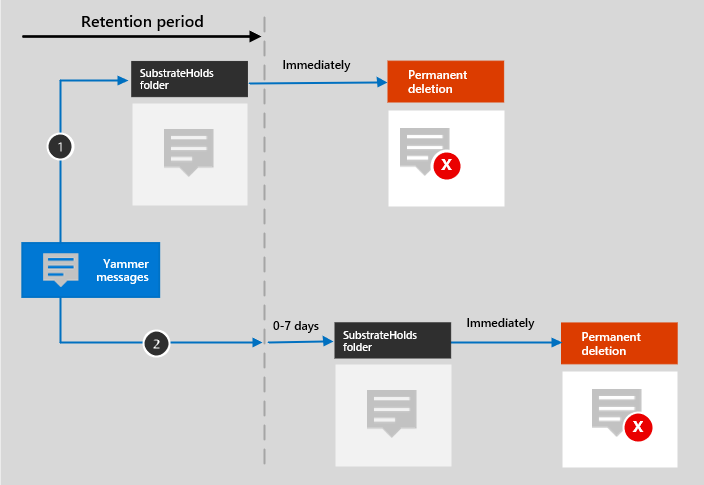

# Saiba mais sobre a retenção para o Yammer

>*[Diretrizes de licenciamento do Microsoft 365 para segurança e conformidade](https://aka.ms/ComplianceSD).*

As informações contidas neste artigo complementam [Saiba mais sobre retenção](retention.md) porque são informações específicas para o Yammer.

## Como a retenção funciona com o Yammer

Você pode usar uma política de retenção para reter e excluir mensagens da comunidade e mensagens privadas no Yammer. As mensagens privadas são armazenadas em uma pasta oculta na caixa de correio de cada usuário participante da mensagem, e as mensagens da comunidade são armazenadas em uma pasta oculta semelhante na caixa de correio da comunidade.

As mensagens do Yammer não são afetadas pelas políticas de retenção configuradas para as caixas de correio de usuário ou de grupos. Embora as mensagens do Yammer sejam armazenadas no Exchange, estes dados do Yammer só serão incluídos em uma política de retenção configurada para os locais das **mensagens da comunidade do Yammer** e das **mensagens privadas do Yammer**.

> [!NOTE]
> Se um usuário estiver incluído em uma política de retenção ativa que retém dados do Yammer e você excluir uma caixa de correio de um usuário incluído nessa política, para reter os dados do Yammer, a caixa de correio será convertida em uma [caixa de correio inativa](inactive-mailboxes-in-office-365.md). Se você não precisar reter esses dados do Yammer para o usuário, exclua a conta de usuário da política de retenção antes de excluir a caixa de correio.

Depois que uma política de retenção for configurada para mensagens do Yammer, um trabalho de temporizador do serviço do Exchange avaliará periodicamente os itens na pasta oculta em que essas mensagens do Yammer são armazenadas. O trabalho de temporizador leva até sete dias para ser executado. Quando o período de retenção desses itens expira, eles são movidos para a pasta SubstrateHolds, uma pasta oculta que toda caixa de correio de usuário ou grupo possui para armazenar itens “excluídos temporariamente” antes de serem excluídos permanentemente.

Depois que uma política de retenção for configurada para mensagens do Yammer, os caminhos que o conteúdo tomará vão depender se a política de retenção for para reter e excluir, somente reter ou somente excluir.

Quando a política de retenção for reter e excluir:

Para os dois caminhos no diagrama:

1. **Se uma mensagem do Yammer for editada ou excluída** pelo usuário durante o período de retenção, a mensagem original será copiada imediatamente (se foi editada) ou movida (se foi excluída) para a pasta SubstrateHolds. A mensagem é armazenada lá até que o período de retenção expirar e a mensagem será permanentemente excluída imediatamente.

2. **Se uma mensagem do Yammer não for excluída** e para as mensagens atuais após a edição, a mensagem será movida para a pasta SubstrateHolds após o período de retenção expirar. Essa ação leva sete dias após a data de vencimento. Quando a mensagem estiver na pasta SubstrateHolds, ela será permanentemente excluída imediatamente. 

> [!NOTE]
> As mensagens na pasta SubstrateHolds são pesquisáveis por ferramentas de descoberta eletrônica. Até que as mensagens sejam excluídas permanentemente (na pasta SubstrateHolds), elas permanecerão pesquisáveis por ferramentas de Descoberta Eletrônica.

Quando a política de retenção é somente retenção ou somente exclusão, os caminhos de conteúdo serão variações de reter e excluir.

### Caminhos de conteúdo para a política de retenção reter somente

1. **Se uma mensagem do Yammer for editada ou excluída**: uma cópia da mensagem original é criada imediatamente na pasta SubstrateHolds e mantida lá até que o período de retenção expire. Em seguida, a mensagem será permanentemente excluída da pasta SubstrateHolds imediatamente.

2. **Se a mensagem do Yammer não for modificada ou excluída** e para as mensagens atuais após a edição durante o período de retenção: nada acontece antes e depois do período de retenção; a mensagem permanecerá no local original.

### Caminhos de conteúdo para a política de retenção somente excluir

1. **Se a mensagem do Yammer não for excluída** durante o período de retenção: no final do período de retenção, a mensagem será movida para a pasta SubstrateHolds. Essa ação leva sete dias após a data de vencimento. Em seguida, a mensagem será permanentemente excluída da pasta SubstrateHolds imediatamente.

2. **Se a mensagem do Yammer for excluída pelo usuário** durante o período, o item será movido imediatamente para a pasta SubstrateHolds, onde será permanentemente excluído imediatamente.

## Mensagens e usuários externos

Por padrão, uma política de retenção para mensagens privadas do Yammer se aplica a todos os usuários em sua organização, mas não a usuários externos. Você pode aplicar uma política de retenção a usuários externos se usar **Escolher usuário** e especificar sua conta. 

No momento, não há suporte para os usuários convidados do Azure B2B.

## Quando um usuário sair da organização 

Se um usuário deixar sua organização e a conta do Microsoft 365 for excluída, suas mensagens privadas do Yammer sujeitas a retenção serão armazenadas em uma caixa de correio inativa. Essas mensagens permanecem sujeitas a qualquer política de retenção que foi colocada no usuário antes da sua caixa de correio ser desativada, e o conteúdo fica disponível para uma pesquisa de Descoberta Eletrônica. Para obter mais informações, consulte [Caixas de correio inativas no Exchange Online](inactive-mailboxes-in-office-365.md). 

Se o usuário tiver armazenado os arquivos no Yammer, consulte a [seção equivalente](retention-policies-sharepoint.md#when-a-user-leaves-the-organization) do SharePoint e do OneDrive.

## Limitações

No momento, as políticas de retenção do Yammer estão no modo de visualização e estamos trabalhando continuamente para otimizar a funcionalidade de retenção. Enquanto isso, aqui estão algumas limitações de que você deve estar ciente ao usar a retenção para as mensagens da comunidade e as mensagens privadas do Yammer:

- **Curtidas e outras reações não são retidas nas mensagens do Yammer**. As reações de outras pessoas na forma de emoticons não são suportadas pelas políticas de retenção.

- Ao selecionar **Escolher usuários** para o local **mensagens privadas do Yammer**, você poderá ver convidados e usuários sem caixa de correio. As políticas de retenção não são projetadas para esses usuários, portanto, não os selecione.

## Instruções de configuração

Se você é novo na configuração de retenção no Microsoft 365, consulte [Iniciar com políticas de retenção e rótulos de retenção](get-started-with-retention.md).

Se você estiver pronto para configurar uma política de retenção do Yammer, consulte [Criar e configurar políticas de retenção](create-retention-policies.md).
