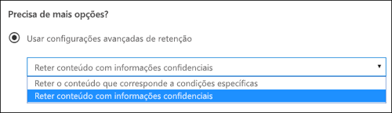

# Visão geral de políticas de retençãoOverview of retention policies

>*[Diretrizes de licenciamento do Microsoft 365 para segurança e conformidade](https://aka.ms/ComplianceSD).**[Microsoft 365 licensing guidance for security & compliance](https://aka.ms/ComplianceSD).*

Para a maioria das organizações, o volume e a complexidade dos dados aumentam diariamente, como emails, documentos, mensagens instantâneas e muito mais. O gerenciamento ou controle efetivo dessas informações é importante porque você precisa para:For most organizations, the volume and complexity of their data is increasing daily — email, documents, instant messages, and more. Effectively managing or governing this information is important because you need to:
  
- **Estar em conformidade de forma proativa com as regulamentações do setor e as políticas internas** que exigem a retenção do conteúdo por um período mínimo de tempo, por exemplo, a lei Sarbanes-Oxley, que pode exigir que você guarde determinados tipos de conteúdo por sete anos.**Comply proactively with industry regulations and internal policies** that require you to retain content for a minimum period of time — for example, the Sarbanes-Oxley Act might require you to retain certain types of content for seven years. 
    
- **Reduzir seu risco em caso de litígio ou violação de segurança** excluindo definitivamente o conteúdo antigo que você não tem mais obrigação de guardar.**Reduce your risk in the event of litigation or a security breach** by permanently deleting old content that you're no longer required to keep. 
    
- **Ajudar a sua organização a compartilhar conhecimento de maneira eficaz e ser mais ágil** garantindo que seus usuários trabalhem apenas com conteúdo atual e relevante para eles.**Help your organization to share knowledge effectively and be more agile** by ensuring that your users work only with content that's current and relevant to them. 
    
Uma política de retenção pode ajudá-lo a atingir todos esses objetivos. O gerenciamento de conteúdo normalmente requer duas ações:A retention policy can help you achieve all of these goals. Managing content commonly requires two actions:
  
- **Reter** conteúdo para que ele não seja excluído permanentemente antes do fim do período de retenção.**Retaining** content so that it can't be permanently deleted before the end of the retention period. 
    
- **Excluir** conteúdo permanentemente no final do período de retenção.**Deleting** content permanently at the end of the retention period. 
    
Com uma política de retenção, você pode:With a retention policy, you can:
  
- Decidir proativamente se deseja reter o conteúdo, excluí-lo ou ambos; reter e depois excluir o conteúdo.Decide proactively whether to retain content, delete content, or both — retain and then delete the content.
    
- Aplicar uma única política para a organização inteira ou locais ou usuários específicos.Apply a single policy to the entire organization or specific locations or users.
    
- Aplicar uma política a todo o conteúdo ou ao conteúdo que respeita determinadas condições, por exemplo, como palavras-chave específicas ou [tipos específicos de informações confidenciais](what-the-sensitive-information-types-look-for.md).Apply a policy to all content or content meeting certain conditions, such as content containing specific keywords or [specific types of sensitive information](what-the-sensitive-information-types-look-for.md).
    
Quando o conteúdo está sujeito a uma política de retenção, as pessoas podem continuar editando e trabalhando com o conteúdo como de costume, pois o conteúdo é retido no local, em seu local original. Mas se alguém edita ou exclui um conteúdo sujeito à política, uma cópia é salva em um local seguro, no qual será retido enquanto a política estiver em vigor.When content is subject to a retention policy, people can continue to edit and work with the content as if nothing's changed because the content is retained in place, in its original location. But if someone edits or deletes content that's subject to the policy, a copy is saved to a secure location where it's retained while the policy is in effect.
  
Finalmente, algumas organizações devem cumprir regulamentações, como a Regra 17a-4 da SEC (Comissão de Valores Mobiliários dos EUA), que exige que após uma política de retenção ser ativada, ela não pode ser desativada ou se tornar menos restritiva. Para atender a esse requisito, você pode usar o Bloqueio de Preservação. Após uma política ser bloqueada, ninguém, nem mesmo o administrador, poderá desativar a política ou torná-la menos restritiva.Finally, some organizations have to comply with regulations such as Securities and Exchange Commission (SEC) Rule 17a-4, which requires that after a retention policy is turned on, it cannot be turned off or made less restrictive. To meet this requirement, you can use Preservation Lock. After a policy's been locked, no one (including an administrator) can turn off the policy or make it less restrictive.
  
Você cria e gerencia políticas de retenção do [Centro de conformidade do Microsoft 365](https://compliance.microsoft.com/): **Políticas** > **Dados** > **Retenção**You create and manage retention policies from the [Microsoft 365 compliance center](https://compliance.microsoft.com/): **Policies** > **Data** > **Retention**

Como alternativa, você pode navegar até o mesmo local no centro de conformidade do Microsoft 365 usando a guia **Soluções** > **Governança de informações** > **Retenção**.Alternatively, you can navigate to the same place in the Microsoft 365 compliance center by using **Solutions** > **Information governance** > **Retention** tab. 

**Se você quiser a capacidade de revisar o conteúdo antes que ele seja permanentemente excluído,** considere usar [rótulos de retenção](labels.md), em vez de uma política de retenção.**If you want the ability to review content before it's permanently deleted,** consider using [retention labels](labels.md) instead of a retention policy. Ao criar um rótulo de retenção, você pode configurar uma [revisão de disposição](disposition-reviews.md) para revisar o conteúdo no final do seu período de retenção.When you create a retention label, you can set up a [disposition review](disposition-reviews.md) to review the content at the end of its retention period.

## Como funciona uma política de retenção com conteúdo in-locoHow a retention policy works with content in place

Quando você incluir um local como um site ou caixa de correio em uma política de retenção, o conteúdo permanecerá no local original. As pessoas podem continuar a trabalhar com seus documentos ou emails como se nada tivesse mudado. Mas, se elas editarem ou excluírem o conteúdo incluído na política, será mantida uma cópia do conteúdo conforme existia antes da aplicação da política.When you include a location such as a site or mailbox in a retention policy, the content remains in its original location. People can continue to work with their documents or mail as if nothing's changed. But if they edit or delete content that's included in the policy, a copy of the content as it existed when you applied the policy is retained.
  
Para conjuntos de sites do SharePoint, uma cópia do conteúdo original é guardada na biblioteca de retenção para preservação quando os usuários o editam ou o excluem. No caso de emails e pastas públicas, a cópia é mantida na pasta Itens Recuperáveis. Esses locais seguros e o conteúdo retido não ficam visíveis para a maioria das pessoas. Com uma política de retenção, as pessoas nem precisam saber que o conteúdo está sujeito à política.For SharePoint site collections, a copy of the original content is retained in the Preservation Hold library when users edit or delete it. For email and public folders, the copy is retained in the Recoverable Items folder. These secure locations and the retained content are not visible to most people. With a retention policy, people do not even need to know that their content is subject to the policy.
  
Observações:Notes:
  
- O conteúdo do Teams (chat) é armazenado no Exchange, em que a política é aplicada com base no tipo de mensagem (email ou conversas).Teams (chat) content is stored in Exchange, where the policy is applied based on message type (email or conversation).
    
- Uma política de retenção aplicada a um grupo do Office 365 inclui a caixa de correio do grupo e um site.A retention policy applied to an Office 365 group includes both the group mailbox and site.

- A Biblioteca de Retenção para Preservação consome uma cota de armazenamento para o site.The Preservation Hold library consumes storage quota for the site.
    
### Conteúdo em contas do OneDrive e dos sites do SharePointContent in OneDrive accounts and SharePoint sites

Uma política de retenção é aplicada no nível de um conjunto de site.A retention policy is applied at the level of a site collection. Quando um conjunto de sites do SharePoint ou uma conta do OneDrive é incluido(a) em uma política de retenção, uma Biblioteca de Retenção para Preservação será usada para reter documentos.When you include a SharePoint site collection or OneDrive account in a retention policy, a Preservation Hold library is used to retain documents. Essa biblioteca é criada automaticamente caso ainda não exista.This library is automatically created if it doesn't already exist. Você pode ver essa biblioteca na página **Conteúdo do site** no site de nível superior do conjunto de sites.You can view this library on the **Site contents** page in the top-level site of the site collection. A maioria dos usuários não poderá ver a biblioteca de Retenção para Preservação porque ela só fica visível para os administradores do conjunto de sites.Most users can't view the Preservation Hold library because it's visible only to site collection administrators.
  
Caso uma pessoa tente alterar ou exclui o conteúdo de um site que esteja sujeito a retenção e exclusão, ou a somente reter, primeiro a política verificará se o conteúdo foi alterado desde a aplicação da política.If a person attempts to change or delete content in a site that's subject to retain and delete, or retain-only, first the policy checks whether the content's been changed since the policy was applied. Se essa for a primeira alteração desde que a política foi aplicada, a política de retenção copiará o conteúdo na Biblioteca de Retenção para Preservação e, então, permitirá que a pessoa altere ou exclua o conteúdo original.If this is the first change since the policy was applied, the retention policy copies the content to the Preservation Hold library, and then allows the person to change or delete the original content. Qualquer conteúdo do conjunto de sites poderá ser copiado para a Biblioteca de Retenção para Preservação, mesmo se o conteúdo não corresponder à consulta usada pela política de retenção.Any content in the site collection can be copied to the Preservation Hold library, even if the content does not match the query used by the retention policy.

Copiar conteúdo para a Biblioteca de Retenção para Preservação aplica-se ao conteúdo existente quando a política de retenção for aplicada.Copying content to the Preservation Hold library applies to content that exists when the retention policy is applied. Além disso, qualquer conteúdo novo criado ou adicionado ao conjunto de sites depois que ele tiver sido incluído na política será retido após a exclusão.In addition, any new content that's created or added to the site collection after it was included in the policy will be retained after deletion. Entretanto, o novo conteúdo não será copiado para a Biblioteca de Retenção para Preservação na primeira vez em que for editado, somente quando for excluído.However, new content isn't copied to the Preservation Hold library the first time it's edited, only when it's deleted. Para reter todas as versões de um arquivo, ative o controle de versão, conforme explicado na [seção](#how-a-retention-policy-works-with-document-versions-in-a-site-collection) a seguir.To retain all versions of a file, turn on versioning, as explained in a following [section](#how-a-retention-policy-works-with-document-versions-in-a-site-collection).
  
Observe que o usuário recebe um erro se tentar excluir uma biblioteca, lista, pasta ou um site sujeitos a uma política de retenção.Note that a user receives an error if they try to delete a library, list, folder, or site that's subject to a retention policy. Para excluir uma pasta, o usuário deve mover ou excluir todos os arquivos da pasta que estejam sujeitos à política.A user can delete a folder if they first move or delete any files in the folder that are subject to the policy. Além disso, a Biblioteca de Retenção para Preservação será criada somente quando o primeiro item precisar ser copiado para a biblioteca e não quando a política de retenção for criada.Also, the Preservation Hold library is created only when the first item needs to be copied to the library and not when you create the retention policy. Portanto, para testar a política, primeiro é necessário editar ou excluir um documento em um site sujeito à política e, em seguida, navegar até a Biblioteca de Retenção para Preservação para exibir a cópia retida.Therefore, to test your policy, you first need to edit or delete a document in a site that is subject to the policy, and then browse to the Preservation Hold library to view the retained copy.
  
Depois que uma política de retenção é atribuída a uma conta do OneDrive ou a um site do SharePoint, os caminhos que o conteúdo assume dependem se a política de retenção for para reter e excluir, somente reter ou somente excluir.After a retention policy is assigned to a OneDrive account or SharePoint site, the paths the content takes depend on whether the retention policy is to retain and delete, to retain only, or delete only.

Quando a política de retenção for reter e excluir:When the retention policy is to retain and delete:

  
1. **Se o conteúdo for modificado ou excluído** durante o período de retenção: uma cópia do conteúdo original existente quando a política de retenção foi atribuída será criada na Biblioteca de Retenção para Preservação.**If the content is modified or deleted** during the retention period: A copy of the original content as it existed when the retention policy was assigned is created in the Preservation Hold library. Lá, um trabalho do temporizador é executado periodicamente e identifica itens cujo período de retenção expirou.There, a timer job runs periodically and identifies items whose retention period has expired. Esses são movidos para a lixeira de segundo estágio, onde serão excluídos permanentemente após 93 dias.Those items are then moved to the second-stage Recycle Bin, where they're permanently deleted at the end of 93 days. A lixeira de segundo estágio não está visível para os usuários finais (somente a lixeira de primeiro estágio está), mas os administradores de conjunto de sites podem exibir e restaurar o conteúdo de lá.The second-stage Recycle Bin is not visible to end users (only the first-stage Recycle Bin is), but site collection admins can view and restore content from there.

    > [!NOTE]
    > Para ajudar a evitar a perda de dados acidental, o conteúdo nunca será excluído automaticamente da Biblioteca de Retenção para Preservação, mas será transferido para a lixeira de segundo estágio.To help prevent inadvertent data loss, content is never automatically deleted from the Preservation Hold library but moves to the second-stage Recycle Bin. Lá, o período de cortesia de 93 dias permite que os administradores recuperem o conteúdo, se necessário.There, the grace period of 93 days lets admins recover this content, if necessary.
    
2. **Se o conteúdo não for modificado ou excluído** durante o período de retenção, ele será movido para a lixeira de primeiro estágio no final do período de retenção.**If the content is not modified or deleted** during the retention period, it's moved to the first-stage Recycle Bin at the end of the retention period. Se um usuário excluir o conteúdo da lixeira ou esvaziá-la (processo também conhecido como limpeza), o documento será movido para a lixeira de segundo estágio.If a user deletes the content from there or empties this Recycle Bin (also known as purging), the document is moved to the second-stage Recycle Bin. Um período de retenção de 93 dias abrange as lixeiras de primeiro e de segundo estágio. Após os 93 dias, o documento será excluído permanentemente de onde estiver, seja na Lixeira de primeiro ou de segundo estágio.A 93-day retention period spans both the first- and second-stage recycle bins. At the end of 93 days, the document is permanently deleted from wherever it resides, in either the first- or second-stage Recycle Bin. Como a lixeira não está indexada, ela não está disponível para pesquisa.The Recycle Bin is not indexed and therefore unavailable for searching. Como resultado, uma pesquisa de descoberta eletrônica não encontra conteúdos da lixeira para colocar uma retenção.As a result, an eDiscovery search can't find any Recycle Bin content on which to place a hold.

2. **Se o conteúdo não for modificado ou excluído** durante o período de retenção: no final do período de retenção, o documento será movido para a lixeira de primeiro estágio.**If the content is not modified or deleted** during the retention period: At the end of the retention period, the document is moved to the first-stage Recycle Bin. Se um usuário excluir o documento da lixeira ou esvaziá-la (processo também conhecido como limpeza), o documento será movido para a lixeira de segundo estágio.If a user deletes the document from there or empties this Recycle Bin (also known as purging), the document is moved to the second-stage Recycle Bin. Um período de retenção de 93 dias abrange as lixeiras de primeiro e de segundo estágio. Após os 93 dias, o documento será excluído permanentemente de onde estiver, seja na lixeira de primeiro ou de segundo estágio.A 93-day retention period spans both the first-stage and second-stage recycle bins. At the end of 93 days, the document is permanently deleted from wherever it resides, in either the first-stage or second-stage Recycle Bin. Como a lixeira não está indexada, ela não está disponível para pesquisa.The Recycle Bin is not indexed and therefore unavailable for searching. Como resultado, uma pesquisa de descoberta eletrônica não encontra conteúdos da lixeira para colocar uma retenção.As a result, an eDiscovery search can't find any Recycle Bin content on which to place a hold. 

Quando a política de retenção for reter somente ou excluir somente, os caminhos de conteúdo serão variações de reter e excluir:When the retention policy is retain-only, or delete-only, the contents paths are variations of retain and delete:

#### Caminhos de conteúdo para a política de retenção reter somenteContent paths for retain-only retention policy

1. **Se o conteúdo for modificado ou excluído** durante o período de retenção: uma cópia do documento original é criada na Biblioteca de Retenção para Preservação e retida até o fim do período de retenção, quando a cópia na Biblioteca de Retenção para Preservação é movida para a lixeira de segundo estágio e é excluída permanentemente após 93 dias.**If the content is modified or deleted** during the retention period: A copy of the original document is created in the Preservation Hold library and retained until the end of the retention period, when the copy in the Preservation Hold library is moved to the second-stage Recycle Bin and is permanently deleted after 93 days.

2. **Se o conteúdo não for modificado ou excluído** durante o período de retenção: nada acontece antes e depois do período de retenção; o documento permanecerá no local original.**If the content is not modified or deleted** during the retention period: Nothing happens before and after the retention period; the document remains in its original location.

#### Caminhos de conteúdo para a política de retenção excluir somenteContent paths for delete-only retention policy

1. **Se o conteúdo for excluído** durante o período de retenção: o documento será movido para a lixeira de primeiro estágio.**If the content is deleted** during the retention period: The document is moved to first-stage Recycle Bin. Se um usuário excluir o documento da lixeira ou esvaziá-la, o documento será movido para a lixeira de segundo estágio.If a user deletes the document from there or empties this Recycle Bin, the document is moved to the second-stage Recycle Bin. Um período de retenção de 93 dias abrange as lixeiras de primeiro e de segundo estágio. Após os 93 dias, o documento será excluído permanentemente de onde estiver, seja na lixeira de primeiro ou de segundo estágio.A 93-day retention period spans both the first-stage and second-stage recycle bins. At the end of 93 days, the document is permanently deleted from wherever it resides, in either the first-stage or second-stage Recycle Bin. Se o conteúdo for modificado durante o período de retenção, ele seguirá o mesmo caminho de exclusão depois que o conteúdo expirar.If the content is modified during the retention period, it follows the same deletion path after the content expires.

2. **Se o conteúdo não for excluído** durante o período de retenção: no final do período de retenção, o documento é movido para a lixeira de primeiro estágio.**If the content is not deleted** during the retention period: At the end of the retention period, the document is moved to the first-stage Recycle Bin. Se o conteúdo for excluído durante o período de retenção, ele será movido imediatamente para a lixeira de primeiro estágio.If the content is deleted during the retention period, the document is immediately moved to first-stage Recycle Bin. Se um usuário excluir o documento da lixeira ou esvaziá-la (processo também conhecido como limpeza), o documento será movido para a lixeira de segundo estágio.If a user deletes the document from there or empties this Recycle Bin (also known as purging), the document is moved to the second-stage Recycle Bin. Um período de retenção de 93 dias abrange as lixeiras de primeiro e de segundo estágio. Após os 93 dias, o documento será excluído permanentemente de onde estiver, seja na lixeira de primeiro ou de segundo estágio.A 93-day retention period spans both the first-stage and second-stage recycle bins. At the end of 93 days, the document is permanently deleted from wherever it resides, in either the first-stage or second-stage Recycle Bin. Como a lixeira não está indexada, ela não está disponível para pesquisa.The Recycle Bin is not indexed and therefore unavailable for searching. Como resultado, uma pesquisa de descoberta eletrônica não encontra conteúdos da lixeira para colocar uma retenção.As a result, an eDiscovery search can't find any Recycle Bin content on which to place a hold.

### Conteúdo em caixas de correio e pastas públicasContent in mailboxes and public folders

Para os emails de um usuário, calendário e outros itens, uma política de retenção é aplicada no nível de uma caixa de correio. Para uma pasta pública, uma política de retenção é aplicada ao nível da pasta, não ao nível da caixa de correio. Tanto uma caixa de correio quanto uma pasta pública usam a pasta Itens Recuperáveis para reter itens. Somente as pessoas às quais foram atribuídas permissões de Descoberta Eletrônica podem exibir itens na pasta de itens recuperáveis de outro usuário. For a user's mail, calendar, and other items, a retention policy is applied at the level of a mailbox. For a public folder, a retention policy is applied at the folder level, not the mailbox level. Both a mailbox and a public folder use the Recoverable Items folder to retain items. Only people whom have been assigned eDiscovery permissions can view items in another user's Recoverable Items folder.
  
Por padrão, quando alguém exclui uma mensagem de uma pasta diferente da pasta Itens Excluídos, a mensagem é movida para a pasta Itens Excluídos. Quando alguém exclui um item da pasta Itens Excluídos, a mensagem é movida para a pasta Itens Recuperáveis. Além disso, uma pessoa pode excluir um item de forma reversível (SHIFT+DELETE) em qualquer pasta, o que ignora a pasta Itens Excluídos e move o item diretamente para a pasta Itens Recuperáveis.By default, when a person deletes a message in a folder other than the Deleted Items folder, the message is moved to the Deleted Items folder. When a person deletes an item in the Deleted Items folder, the message is moved to the Recoverable Items folder. In addition, a person can soft delete an item (SHIFT+DELETE) in any folder, which bypasses the Deleted Items folder and moves the item directly to the Recoverable Items folder.
  
Um processo avalia itens periodicamente na pasta Itens Recuperáveis. Se um item não corresponder às regras de pelo menos uma política de retenção, o item será excluído permanentemente (também chamado exclusão forçada) da pasta Itens Recuperáveis.A process periodically evaluates items in the Recoverable Items folder. If an item doesn't match the rules of at least one retention policy, the item is permanently deleted (also called hard deleted) from the Recoverable Items folder.
  
Quando uma pessoa tenta alterar determinadas propriedades de um item de caixa de correio, como assunto, corpo, anexos, remetentes e destinatários, ou a data de envio ou de recebimento de uma mensagem, uma cópia do item original é salva na pasta Itens Recuperáveis antes da confirmação da alteração.When a person attempts to change certain properties of a mailbox item — such as the subject, body, attachments, senders and recipients, or date sent or received for a message — a copy of the original item is saved to the Recoverable Items folder before the change is committed. Essa ação acontecerá para todas as alterações subsequentes.This action happens for each subsequent change. No final do período de retenção, as cópias na pasta Itens Recuperáveis são excluídas permanentemente.At the end of the retention period, copies in the Recoverable Items folder are permanently deleted.
  
Quando a política de retenção for reter e excluir:When the retention policy is to retain and delete:

1. **Se o item for modificado ou excluído permanentemente** pelo usuário (usando SHIFT + DELETE ou excluído de Itens Excluídos) durante o período de retenção, o item será movido (ou copiado, no caso de edição) para a pasta Itens Recuperáveis. Lá, um processo é executado periodicamente e identifica itens cujo período de retenção tenha expirado, e esses itens são permanentemente excluídos em até 14 dias após o fim do período de retenção. Observe que 14 dias é a configuração padrão, que pode ser estendida para até 30 dias.**If the item is modified or permanently deleted** by the user (either SHIFT+DELETE or deleted from Deleted Items) during the retention period, the item is moved (or copied, in the case of edit) to the Recoverable Items folder. There, a process runs periodically and identifies items whose retention period has expired, and these items are permanently deleted within 14 days of the end of the retention period. Note that 14 days is the default setting, but it can be configured up to 30 days.
    
2. **Se o item não for modificado ou excluído** durante o período de retenção, o mesmo processo será executado periodicamente em todas as pastas na caixa de correio, identificando itens cujo período de retenção expirou. Esses itens são então permanentemente excluídos em até 14 dias após o fim do período de retenção.**If the item is not modified or deleted** during the retention period, the same process runs periodically on all folders in the mailbox and identifies items whose retention period has expired, and these items are permanently deleted within 14 days of the end of the retention period. Observe que 14 dias é a configuração padrão, podendo ser estendida para até 30 dias.Note that 14 days is the default setting, but it can be configured up to 30 days. Quando a política de retenção for reter somente ou excluir somente, os caminhos de conteúdo serão variações de reter e excluir:When the retention policy is retain-only, or delete-only, the contents paths are variations of retain and delete:

#### Caminhos de conteúdo para a política de retenção reter somenteContent paths for retain-only retention policy

1. **Se o item for modificado ou excluído** durante o período de retenção: uma cópia do item original será criada na pasta Itens Recuperáveis e retida até o fim do período de retenção, quando a cópia na pasta Itens Recuperáveis será excluída permanentemente dentro de 14 dias após o item expirar.**If the item is modified or deleted** during the retention period: A copy of the original item is created in the Recoverable Items folder and retained until the end of the retention period, when the copy in the Recoverable Items folder is permanently deleted within 14 days after the item expires. 

2. **Se o item não for modificado ou excluído** durante o período de retenção: nada acontece antes e depois do período de retenção; o item permanecerá no local original.**If the item is not modified or deleted** during the retention period: Nothing happens before and after the retention period; the item remains in its original location.

#### Caminhos de conteúdo para a política de retenção excluir somenteContent paths for delete-only retention policy

1. **Se o item não for excluído** durante o período de retenção: no final do período de retenção, o item será movido para a pasta Itens Recuperáveis.**If the item is not deleted** during the retention period: At the end of the retention period, the item is moved to the Recoverable items folder. 

2. **Se o item for excluído** durante o período, o item será movido imediatamente para a pasta Itens Recuperáveis.**If the item is deleted** during the period, the item is immediately moved to the Recoverable items folder. Se um usuário excluir o item da pasta Itens Recuperáveis ou esvaziá-la, o item será excluído permanentemente.If a user deletes the item from there or empties the Recoverable items folder, the item is permanently deleted. Caso contrário, o item será excluído permanentemente depois de ficar na pasta Itens Recuperáveis por 14 dias.Otherwise, the item is permanently deleted after being in the Recoverable items folder for 14 days. 

### Quando um usuário sair da organizaçãoWhen a user leaves the organization

**Exchange****Exchange** 

Se um usuário sair da organização e a caixa de correio dele estiver incluída em uma política de retenção, essa caixa de correio se tornará inativa quando a conta do Office 365 do usuário for excluída.If a user leaves your organization and the user's mailbox is included in a retention policy, the mailbox becomes an inactive mailbox when the user's Office 365 account is deleted. O conteúdo de uma caixa de correio inativa ainda está sujeito a qualquer política de retenção que tenha sido aplicada a essa caixa antes dela se tornar inativa, e ele fica disponível para uma pesquisa de descoberta eletrônica.The contents of an inactive mailbox are still subject to any retention policy that was placed on the mailbox before it was made inactive, and the contents are available to an eDiscovery search. Para saber mais, confira [Caixas de correio inativas no Exchange Online](inactive-mailboxes-in-office-365.md).For more information, see [Inactive mailboxes in Exchange Online](inactive-mailboxes-in-office-365.md).

**OneDrive****OneDrive**

Se um usuário sair da organização, quaisquer arquivos sujeitos a uma política de retenção ou que contenham rótulos de retenção permanecerão pela duração da política ou do rótulo. If a user leaves your organization, any files subject to a retention policy or containing retention labels will remain for the duration of the policy or label. Durante esse período, todo o acesso à compartilhamentos continua a funcionar.During that time period, all sharing access continues to work. Quando o período de retenção expira, o conteúdo é movido para a Lixeira de Conjuntos de Sites e não pode ser acessado por ninguém, exceto pelo administrador. Se um documento for marcado por uma política de retenção como um registro, ele não será excluído até que o período de retenção termine, após o qual o conteúdo será permanentemente excluído.When the retention period expires, content moves into the Site Collection Recycle Bin and is not accessible to anyone except the admin. If a document is marked by a retention policy as a record, it will not be deleted until the retention period is over, after which time the content is permanently deleted.

**SharePoint****SharePoint**

Quando um usuário sai organização, qualquer conteúdo criado por ele não será afetado porque o SharePoint é considerado um ambiente colaborativo, ao contrário da caixa de correio ou da conta OneDrive de um usuário.When a user leaves your organization, any content created by that user is not affected because SharePoint is considered a collaborative environment, unlike a user's mailbox or OneDrive account.

## Como funciona uma política de retenção com versões de documento em um conjunto de sitesHow a retention policy works with document versions in a site collection

O controle de versão é um recurso de todas as bibliotecas de documentos no SharePoint Online e no OneDrive for Business.Versioning is a feature of all document libraries in SharePoint Online and OneDrive for Business. Por padrão, o controle de versão retém no mínimo 500 versões principais, embora você possa aumentar esse limite.By default, versioning retains a minimum of 500 major versions, though you can increase this limit. Confira mais informações em [Habilitar e configurar o controle de versão para uma lista ou biblioteca](https://support.office.com/article/1555d642-23ee-446a-990a-bcab618c7a37).For more information, see [Enable and configure versioning for a list or library](https://support.office.com/article/1555d642-23ee-446a-990a-bcab618c7a37).
  
Uma política de retenção (política de retenção que mantém o conteúdo, em vez de somente exclusão) mantém todas as versões de um documento em um conjunto de sites do SharePoint ou em uma conta do OneDrive.A retain policy (retention policy that retains content instead of delete-only) retains all versions of a document in a SharePoint site collection or OneDrive account. Quando um documento sujeito a uma política de retenção ou bloqueio for editado pela primeira vez, uma versão do documento original será copiada na biblioteca de retenção.When a document subject to a hold or retain policy is edited for the first time, a version of the original document is copied to the Preservation Hold library. Quando um documento sujeito a uma política de retenção ou de bloqueio for excluído, todas as versões serão copiadas para a Biblioteca de Retenção para Preservação se o controle de versão estiver habilitado.When a document subject to a hold or retain policy is deleted, all versions are copied to the Preservation Hold library if versioning is enabled. Cada versão de um documento na Biblioteca de Retenção para Preservação existe como um item separado com seu próprio período de retenção:Each version of a document in the Preservation Hold library exists as a separate item with its own retention period:
  
- Se a política de retenção se basear em quando o conteúdo foi criado, cada versão terá a mesma data de expiração do documento original. O documento original e suas versões expirarão ao mesmo tempo.If the retention policy is based on when the content was created, each version has the same expiration date as the original document. The original document and its versions all expire at the same time.
    
- Se a política de retenção estiver baseada na data da última modificação do conteúdo, cada versão terá sua própria data de expiração com base em quando o documento original foi modificado para criar essa versão. Os documentos originais e suas versões expirarão de maneira independente entre si.If the retention policy is based on when the content was last modified, each version has its own expiration date based on when the original document was modified to create that version. The original documents and its versions expire independently of each other.

> [!NOTE]
> As versões preservadas dos documentos do SharePoint e do OneDrive não são pesquisáveis por ferramentas de Descoberta Eletrônica.The preserved versions of SharePoint and OneDrive documents are not searchable by eDiscovery tools.

## Reter o conteúdo por um período específicoRetaining content for a specific period of time

Com uma política de retenção, é possível manter o conteúdo indefinidamente ou por um número específico de dias, meses ou anos.With a retention policy, you can retain content indefinitely or for a specific number of days, months, or years. A duração para retenção do conteúdo é calculada com base na idade desse conteúdo, e não do momento em que a política de retenção foi aplicada.The duration for how long content is retained is calculated from the age of the content, not from when the retention policy is applied. Você pode escolher se a idade se baseia em quando o conteúdo foi criado ou (para o OneDrive e o SharePoint) em quando ele foi modificado pela última vez.You can choose whether the age is based on when the content was created or (for OneDrive and SharePoint) when it was last modified.
  
Por exemplo, se você quiser reter o conteúdo em um conjunto de sites por sete anos desde que foi modificado pela última vez, e se um documento nesse conjunto de sites não tiver sido modificado em seis anos, o documento será retido somente por mais um ano, caso não seja modificado. Se o documento for editado novamente, a idade do documento será calculada a partir da data da última modificação, e ele será retido por mais sete anos.For example, if you want to retain content in a site collection for seven years since it was last modified, and a document in that site collection hasn't been modified in six years, the document will be retained for only another year if it's not modified. If the document is edited again, the age of the document is calculated from the new last modified date, and it will be retained for another seven years.
  
Da mesma forma, se você desejar reter o conteúdo em uma caixa de correio por sete anos, e uma mensagem tiver sido enviada há seis anos, a mensagem será retida por apenas um ano. Para conteúdo do Exchange, a idade sempre se baseará na data de recebimento ou de envio (elas são iguais). A retenção do conteúdo com base em quando ele foi modificado pela última vez aplica-se apenas ao conteúdo de site do OneDrive e do SharePoint.Similarly, if you want to retain content in a mailbox for seven years, and a message was sent six years ago, the message will be retained for only one year. For Exchange content, the age is always based on the date received or sent (they are the same). Retaining content based on when it was last modified applies only to site content in OneDrive and SharePoint.
  
Você pode escolher se deseja que o conteúdo seja excluído permanentemente no final do período de retenção.You can choose whether you want the content to be permanently deleted at the end of the retention period. Uma política de retenção também pode excluir o conteúdo antigo sem retê-lo.A retention policy can also delete old content without retaining it. Confira a próxima seção.See the next section.
  

  
## Como excluir conteúdo mais antigo que uma idade específicaDeleting content that's older than a specific age

Uma política de retenção pode reter e excluir o conteúdo ou excluir o conteúdo antigo sem retê-lo.A retention policy can both retain and then delete content, or delete old content without retaining it.
  
Se sua política de retenção excluir conteúdo, será importante entender que o período de tempo especificado para uma política de retenção é calculado pelo tempo em que o documento foi criado ou modificado, e não a partir do momento em que a política foi atribuída.If your retention policy deletes content, it's important to understand that the time period specified for a retention policy is calculated from the time when the content was created or modified, not the time since the policy was assigned.
  

  
Por exemplo, suponha que você crie uma política de retenção que exclui conteúdo após três anos e, em seguida, atribui essa política a todas as contas do OneDrive, que incluem uma grande quantidade de conteúdo criado há quatro ou cinco anos. Nesse caso, muito conteúdo será excluído logo após atribuir a política de retenção pela primeira vez. Por esse motivo **uma política de retenção que exclui conteúdo pode ter um impacto considerável sobre o conteúdo**.For example, suppose that you create a retention policy that deletes content after three years, and then assign that policy to all OneDrive accounts, which contain a lot of content that was created four or five years ago. In this case, a lot of content will be deleted soon after assigning the retention policy for the first time. For this reason, **a retention policy that deletes content can have a considerable impact on your content**. 
  
Portanto, quando atribuir uma política de retenção a um conjunto de sites pela primeira vez, primeiro considere a idade do conteúdo e de que modo a política poderá afetá-los. Você também poderá informar os usuários sobre a nova política antes de atribuí-la, para que eles tenham tempo de avaliar o possível impacto. Observe esse aviso que é exibido quando você revisa as configurações da política de retenção antes de criá-la.Therefore, before you assign a retention policy to a site collection for the first time, you should first consider the age of the existing content and how the policy may impact that content. You may also want to communicate the new policy to your users before assigning it, to give them time to assess the possible impact. Note this warning that appears when you review the settings for your retention policy just before creating it.
  

  
## Configurações avançadas que aplicam uma política apenas ao conteúdo que atenda a determinadas condiçõesAdvanced settings that apply a policy only to content that meets certain conditions

Uma política de retenção pode ser aplicada a todo o conteúdo nos locais em que inclui ou você pode aplicar uma política de retenção apenas ao conteúdo que inclui palavras-chave específicas ou [tipos específicos de informações confidenciais](what-the-sensitive-information-types-look-for.md).A retention policy can apply to all content in the locations that it includes, or you can choose to apply a retention policy only to content that contains specific keywords or [specific types of sensitive information](what-the-sensitive-information-types-look-for.md).
  

  
### Reter conteúdo que inclui palavras-chave específicasRetain content that contains specific keywords

Você pode aplicar uma política de retenção apenas ao conteúdo que atenda a certas condições e realizar ações de retenção apenas nesse conteúdo. As condições disponíveis agora dão suporte à aplicação de uma política de retenção ao conteúdo que inclui palavras ou frases específicas. Você pode refinar a consulta usando os operadores de pesquisa AND, OR e NOT. Para saber mais sobre esses operadores, confira [Consultas de palavra-chave e critérios de pesquisa para pesquisa de conteúdo](keyword-queries-and-search-conditions.md).You can apply a retention policy only to content that satisfies certain conditions, and then take retention actions on just that content. The conditions available now support applying a retention policy to content that contains specific words or phrases. You can refine your query by using search operators like AND, OR, and NOT. For more information on these operators, see [Keyword queries and search conditions for Content Search](keyword-queries-and-search-conditions.md).
  
O suporte à adição de propriedades pesquisáveis (por exemplo, **assunto:**) estará disponível em breve.Support for adding searchable properties (for example, **subject:**) is coming soon.
  
A retenção com base em consulta usa o índice de pesquisa para identificar conteúdo.Query-based retention uses the search index to identify content.
  

  
### Reter conteúdo com informações confidenciaisRetain content that contains sensitive information

Você também pode aplicar uma política de retenção apenas ao conteúdo que inclui [tipos específicos de informações confidenciais](what-the-sensitive-information-types-look-for.md). Por exemplo, você pode optar por aplicar exigências de retenção exclusivas somente ao conteúdo com informações de identificação pessoal (PII) como números de identificação de contribuinte, números de CPF ou números de passaporte.You can also apply a retention policy only to content that contains [specific types of sensitive information](what-the-sensitive-information-types-look-for.md). For example, you can choose to apply unique retention requirements only to content that contains personally identifiable information (PII) such as taxpayer identification numbers, social security numbers, or passport numbers.
  

  
Observações:Notes:
  
- A retenção avançada para informações confidenciais não se aplica a pastas públicas do Exchange ou Skype for Business, pois esses locais não dão suporte a tipos de informações confidenciais.Advanced retention for sensitive information doesn't apply to Exchange public folders or Skype for Business because those locations don't support sensitive information types.
    
- Você deve compreender que o Exchange Online usa regras de fluxo de emails (também conhecidas como regras de transporte) para identificar informações confidenciais; portanto, isso funciona apenas em mensagens em trânsito, não em todos os itens já armazenados em uma caixa de correio. Para o Exchange Online, isso significa que uma política de retenção pode identificar informações confidenciais e realizar ações de retenção apenas em mensagens recebidas **após** a política ser aplicada à caixa de correio. (Observe que a retenção com base em consulta descrita na seção anterior não apresenta essa limitação porque ela usa o índice de pesquisa para identificar conteúdo).You should understand that Exchange Online uses mail flow rules (also known as transport rules) to identify sensitive information, so this works only on messages in transit — not on all items already stored in a mailbox. For Exchange Online, this means that a retention policy can identify sensitive information and take retention actions only on messages that are received **after** the policy is applied to the mailbox. (Note that query-based retention described in the previous section doesn't have this limitation because it uses the search index to identify content.) 
    
## Aplicar uma política de retenção a uma organização inteira ou locais específicosApplying a retention policy to an entire organization or specific locations

Você pode facilmente aplicar uma política de retenção a uma organização inteira, locais inteiros ou apenas a locais ou usuários específicos.You can easily apply a retention policy to an entire organization, entire locations, or only to specific locations or users.
  
### Política no âmbito da organizaçãoOrg-wide policy

Um dos recursos mais avançados de política de retenção é que, por padrão, aplica-se aos locais no Office 365, incluindo:One of the most powerful features of a retention policy is that it can apply to locations across Office 365, including:
  
- Email do ExchangeExchange email
    
- Conjuntos de sites do SharePointSharePoint site collections
    
- Contas do OneDriveOneDrive accounts
    
- Grupos do Office 365 (aplicável ao conteúdo da caixa de correio do grupo e ao site do SharePoint associado.)Office 365 groups (applies to content in the group's mailbox and associated SharePoint site.)
    
- Pastas públicas do ExchangeExchange public folders
    

Outros recursos importantes de uma política de retenção no âmbito da organização incluem:Other important features of an org-wide retention policy include:
  
- Não há um limite para o número de caixas de correio ou sites que essa política pode incluir.There is no limit to the number of mailboxes or sites the policy can include.
    
- Para o Exchange, as caixas de correio criadas após a aplicação da política herdam a política automaticamente.For Exchange, any new mailbox created after the policy is applied will automatically inherit the policy.
  
### Uma política aplicável a locais inteirosA policy that applies to entire locations

Ao escolher locais, você pode facilmente incluir ou excluir um local inteiro, como emails do Exchange ou contas do OneDrive.When you choose locations, you can easily include or exclude an entire location, such as Exchange email or OneDrive accounts. Para fazer isso, ative ou desative o **Status** desse local.To do so, toggle the **Status** of that location on or off. 
  
Como uma política no âmbito da organização, se uma política for aplicada a qualquer combinação de locais inteiros, não haverá um limite para o número de caixas de correio ou sites que essa política poderá incluir. Por exemplo, se uma política incluir todos os emails do Exchange e sites do SharePoint, todos os sites e caixas de correio serão incluídas, independentemente da quantidade. E para o Exchange, as caixas de correio criadas após a aplicação da política herdarão a política automaticamente.Like an org-wide policy, if a policy applies to any combination of entire locations, there is no limit to the number of mailboxes or sites the policy can include. For example, if a policy includes all Exchange email and all SharePoint sites, all sites and mailboxes will be included, no matter how many. And for Exchange, any new mailbox created after the policy is applied will automatically inherit the policy.

### Uma política com inclusões ou exclusões específicasA policy with specific inclusions or exclusions

Você também pode aplicar uma política de retenção a usuários específicos, grupos do Office 365 ou sites. Para fazer isso, ative o **Status** desse local e, em seguida, use os links para incluir ou excluir usuários, grupos do Office 365 ou locais específicos.You can also apply a retention policy to specific users, Office 365 groups, or sites. To do so, toggle the **Status** of that location on, and then use the links to include or exclude specific users, Office 365 groups, or sites. 
  
No entanto, observe que os seguintes limites existem para uma política de retenção que inclui ou exclui mais de 1.000 locais específicos:However, note that the following limits exist for a retention policy that includes or excludes over 1,000 specific locations:
  
- Essa política de retenção pode conter, no máximo, 1.000 caixas de correio e 100 conjuntos de sites.Such a retention policy can contain no more than 1,000 mailboxes and 100 site collections.
    
- Um locatário pode conter no máximo 10.000 políticas de retenção.A tenant can contain no more than 10,000 retention policies.
    
Embora esses limites existam, entenda que você pode acessar ignorá-los aplicando uma política no âmbito da organização ou uma política a locais inteiros.Although these limits exist, understand that you can get over these limits by applying either an org-wide policy or a policy that applies to entire locations.
  
### Locais do SkypeSkype locations

Diferentemente de um email do Exchange, você não pode ativar ou desativar o status de local do Skype para incluir todos os usuários, mas pode ativar esse local e depois selecionar manualmente os usuários cujas conversas deseja manter:Unlike Exchange email, you can't toggle the status of the Skype location on to include all users, but when you turn on that location, you then manually choose the users whose conversations you want to retain:

  
Ao selecionar **escolher usuários**, você pode incluir rapidamente todos os usuários, selecionando a caixa **Nome** no cabeçalho da coluna.When you select **Choose users**, you can quickly include all users by selecting the **Name** box in the column header. No entanto, é importante compreender que cada usuário é como uma inclusão específica na política.However, it's important to understand that each user counts as a specific inclusion in the policy. Portanto, se mais de 1.000 usuários forem incluídos, os limites indicados na seção anterior serão aplicáveis.Therefore, if you include over 1,000 users, the limits noted in the previous section apply. Aqui, selecionar todos os usuários do Skype não é o mesmo como se uma política no âmbito da organização fosse capaz de incluir todos os usuários do Skype por padrão.Selecting all Skype users here is not the same as if an org-wide policy were able to include all Skype users by default. 
  

  
Observe que o **Histórico da Conversa**, uma pasta no Outlook, é um recurso que não tem nada a ver com o arquivamento do Skype. **Histórico da Conversa** pode ser desativado pelo usuário final, mas o arquivamento para o Skype é feito armazenando-se uma cópia das conversas do Skype em uma pasta oculta que é inacessível ao usuário, mas disponível para Descoberta Eletrônica.Note that **Conversation History**, a folder in Outlook, is a feature that has nothing to do with Skype archiving. **Conversation History** can be turned off by the end user, but archiving for Skype is done by storing a copy of Skype conversations in a hidden folder that is inaccessible to the user but available to eDiscovery.

### Locais do SharePoint SharePoint locations

A política de retenção pode reter conteúdo em sites de comunicação do SharePoint, sites de equipe que não estão conectados por grupos do Office 365 e sites clássicos.Your retention policy can retain content in SharePoint communication sites, team sites that aren't connected by Office 365 groups, and classic sites. Os sites de equipes conectados por grupos do Office 365 não têm suporte com esta opção, em vez disso, use os locais de **grupos do Office 365**.Team sites connected by Office 365 groups aren't supported with this option and instead, use the **Office 365 groups** locations.

Caso especifique sites que não têm suporte, eles serão ignorados pela política de retenção.If you specify sites that aren't supported, these are ignored by the retention policy.

Ao especificar os locais para os sites do SharePoint, não será preciso ter permissões para acessar o site e nenhuma validação será feita ao especificar a URL na página **Editar locais**.When you specify your locations for SharePoint sites, you don't need permissions to access the site and no validation is done at the time you specify the URL on the **Edit locations** page. No entanto, os sites devem ser indexados e os especificados por você, serão verificados no final do assistente.However, the sites must be indexed and the sites you specify are checked that they exist at the end of the wizard.

Se essa verificação falhar, uma mensagem será exibida informando que a validação falhou para a URL inserida, e o assistente não criará a política de retenção até que a verificação de validação seja aprovada.If this check fails, you see a message that validation failed for the URL you entered, and the wizard won't create the retention policy until the validation check passes. Se você vir esta mensagem, volte ao assistente para alterar a URL ou remover o site.If you see this message, go back in the wizard to change the URL or remove the site.

### Locais do TeamsTeams locations

> [!NOTE]
> Ainda não oferecemos suporte à configuração para retenção de mensagens de canal privado.We don't yet support configuration for retention of private channel messages. Há suporte para a retenção de arquivos compartilhados em canais privados.Retention of files shared in private channels is supported.

Você pode usar uma política de retenção para manter as conversas e as mensagens de canal em Teams. As conversas do Teams são armazenadas em uma pasta oculta na caixa de correio de cada usuário incluído na conversa e as mensagens de canal do Teams são armazenadas em uma pasta oculta semelhante na caixa de correio de grupo para a equipe. No entanto, é importante compreender que o Teams usa um serviço de chat fornecido pelo Azure que também armazena esses dados e, por padrão, esse serviço armazena os dados para sempre. Por esse motivo, é altamente recomendável usar a localização para reter e excluir dados do Teams. Usar o local do Teams excluirá permanentemente os dados de caixa de correio do Exchange e o serviço de chat subjacente fornecido pelo Azure. Para saber mais, confira [Visão geral de segurança e conformidade no Microsoft Teams](https://go.microsoft.com/fwlink/?linkid=871258).You can use a retention policy to retain chats and channel messages in Teams. Teams chats are stored in a hidden folder in the mailbox of each user included in the chat, and Teams channel messages are stored in a similar hidden folder in the group mailbox for the team. However, it's important to understand that Teams uses an Azure-powered chat service that also stores this data, and by default this service stores the data forever. For this reason, we strongly recommend that you use the Teams location to retain and delete Teams data. Using the Teams location will permanently delete data from both the Exchange mailboxes and the underlying Azure-powered chat service. For more information, see [Overview of security and compliance in Microsoft Teams](https://go.microsoft.com/fwlink/?linkid=871258).
  
As mensagens do canal e do chat do Teams não são afetadas pelas políticas de retenção aplicadas às caixas de correio de usuário ou do grupo nos locais de grupos do Exchange ou do Office 365.Teams chats and channel messages are not affected by retention policies applied to user or group mailboxes in the Exchange or Office 365 groups locations. Mesmo que as mensagens do canal e do chat do Teams estejam armazenadas no Exchange, elas são afetadas apenas por uma política de retenção aplicada ao local do Teams.Even though Teams chats and channel messages are stored in Exchange, they're affected only by a retention policy that's applied to the Teams location.

> [!NOTE]
> Se um usuário estiver incluído em uma política de retenção ativa que retém dados do Teams e você excluir uma caixa de correio de um usuário incluído nessa política para reter os dados, a caixa de correio será convertida em uma [caixa de correio inativa](inactive-mailboxes-in-office-365.md).If a user is included in an active retention policy that retains Teams data and you a delete a mailbox of a user who is included in this policy, to retain the data, the mailbox is converted into an [inactive mailbox](inactive-mailboxes-in-office-365.md). Se você não precisar reter esses dados do usuário, exclua o usuário da política de retenção antes de excluir a caixa de correio.If you don't need to retain this data for the user, exclude the user from the retention policy before you delete their mailbox.
  
Depois que uma política de retenção é atribuída a uma equipe, chat e canal, as mensagens podem seguir um destes dois caminhos:After a retention policy is assigned to a team, chat and channel messages can follow one of two paths:

1. **Se uma mensagem do chat ou do canal for modificada ou excluída** pelo usuário durante o período de retenção, a mensagem será movida (ou copiada, no caso de edição) para a pasta SubstrateHolds (que é uma pasta oculta em todas as caixas de correio de usuários ou grupos) e será armazenada nessa pasta até que o período de retenção expire.**If a chat or channel message is modified or deleted** by the user during the retention period, the message is moved (or copied, in the case of edit) to the SubstrateHolds folder (which is a hidden folder in every user or group mailbox) and is stored in this folder until the retention period expires. As mensagens são excluídas permanentemente no dia do término do período de retenção.Messages are permanently deleted on the day the retention period expires.

2. **Se uma mensagem do chat ou do canal não for excluída** durante o período de retenção, a mensagem será movida para a pasta SubstrateHolds dentro de um dia após o término do período de retenção (de 0 a 24 horas).**If a chat or channel message isn't deleted** during the retention period, the message is moved to the SubstrateHolds folder within one day after the retention period expires (it takes from 0 to 24 hours). A mensagem é permanentemente excluída um dia após ser movida para a pasta SubstrateHolds.The message is permanently deleted one day after it is moved to the SubstrateHolds folder. 

> [!NOTE]
> As mensagens na pasta SubstrateHolds são pesquisáveis por ferramentas de descoberta eletrônica.Messages in the SubstrateHolds folder are searchable by eDiscovery tools. Após a exclusão permanente de uma mensagem, ela não será exibida em uma pesquisa de descoberta eletrônica.After a message is permanently deleted, it won't be returned in an eDiscovery search.

Estamos trabalhando continuamente na otimização da funcionalidade de retenção no Teams, e planejamos lançar novos recursos nos próximos meses.We're continuously working on optimizing retention functionality in Teams, and we plan to release new features in the coming months. Enquanto isso, estas são algumas limitações a considerar:In the meantime, here are a few limitations to be aware of:
  
- **O Teams exige uma política de retenção independente**.**Teams require a separate retention policy**. Ao criar uma política de retenção e ativar o local do Teams, todos os demais locais são desativados.When you create a retention policy and toggle on the Teams location, all other locations toggle off. Uma política de retenção que inclui o Teams só pode incluí-lo e nenhum outro local.A retention policy that includes Teams can include only Teams and no other locations. 
    
- **O Teams não está incluído em uma política no âmbito da organização**.**Teams aren't included in an org-wide policy**. Se criar uma política no âmbito da organização, o Teams não estará incluído, porque ele exige uma política de retenção independente.If you create an org-wide policy, Teams are not included because they require a separate retention policy. 
    
- **O Teams não é compatível com retenção avançada.****Teams doesn't support advanced retention**. Ao criar uma política de retenção, se você escolher o [Configurações avançadas que aplicam uma política apenas ao conteúdo que atende a determinadas condições](#advanced-settings-that-apply-a-policy-only-to-content-that-meets-certain-conditions), o local do Teams não estará disponível.When you create a retention policy, if you choose the [Advanced settings that apply a policy only to content that meets certain conditions](#advanced-settings-that-apply-a-policy-only-to-content-that-meets-certain-conditions), the Teams location is not available. No momento, a retenção no Teams se aplica a todo o conteúdo de mensagem do chat e do canal.At this time, retention in Teams applies to all of the chat and channel message content. 

- **Não há suporte para o conteúdo do Teams em canais privados**.**Teams content in private channels isn't supported**. Neste momento, políticas de retenção criadas para o Teams não se aplicam a mensagens de canal privado.At this time, retention policies created for Teams don't apply to private channel messages. Somente as mensagens em canais padrão estão sujeitas a uma política de retenção criada para o Teams.Only messages in standard channels are subject to a retention policy created for Teams. O suporte para políticas de retenção para canais privados será lançado em breve.Support for retention policies for private channels is coming soon. 
    
- **O Teams pode levar até três dias para limpar as mensagens expiradas**.**Teams may take up to three days to clean up expired messages**. Uma política de retenção aplicada ao Teams excluirá mensagens de chat e de canal ao fim do período de retenção.A retention policy applied to Teams will delete chat and channel messages when the retention period expires. No entanto, pode levar até três dias para limpar essas mensagens e excluí-las permanentemente.However, it may take up to three days to clean up these messages and permanently delete them. Além disso, as mensagens de chat e de canal serão pesquisáveis com as ferramentas de descoberta eletrônica durante o período de retenção e quando as mensagens forem excluídas permanentemente.Also, chat and channel messages will be searchable with eDiscovery tools during the time after the retention period expires and when messages are permanently deleted.

   > [!NOTE]
   > Antes, uma política de retenção não podia excluir o conteúdo do Teams em menos de 30 dias, mas removemos essa limitação.It used to be true that a retention policy couldn't delete Teams content that's less than 30 days old, but we've removed this limitation. Agora, o período de retenção do conteúdo do Teams pode ser personalizado, sendo no mínimo de um dia.Now the retention period for Teams content can be any number of days you choose and as short as one day. Se o período de retenção for de um dia, as mensagens serão excluídas permanentemente três dias após o término do período de retenção.If you do have a retention period of one day, it will take up to three days after the retention period expires before messages are permanently deleted.
    
No Teams, os arquivos compartilhados no chat são armazenados na conta do OneDrive do usuário que compartilhou o arquivo.In Teams, files that are shared in chat are stored in the OneDrive account of the user who shared the file. Os arquivos carregados nos canais são armazenados no site do SharePoint da equipe.Files that are uploaded into channels are stored in the SharePoint site for the team. Portanto, para manter ou excluir arquivos no Teams, você precisa criar uma política de retenção que se aplique aos locais do OneDrive e Grupos do Office 365.Therefore, to retain or delete files in Teams, you need to create a retention policy that applies to OneDrive and Office 365 Group locations. Se você deseja aplicar uma política aos arquivos compartilhados no Teams de apenas um usuário ou equipe específica, poderá escolher os locais do OneDrive ou Grupos do Office 365 e incluir o usuário ou equipe específica.If you want to apply a policy to the files shared in Teams of just a specific user or team, you can choose the OneDrive or Office 365 Group locations and include the specific user or team.
  
Uma política de retenção que se aplica ao Teams pode usar [Bloqueio de Preservação](#locking-a-retention-policy).A retention policy that applies to Teams can use [Preservation Lock](#locking-a-retention-policy).
  

  
> [!NOTE]
> Se você criar políticas de retenção para os locais do Skype ou Teams em sua organização, uma dessas políticas será exibida como a política de pasta padrão quando um usuário exibir as propriedades de uma pasta de caixa de correio no cliente da área de trabalho do Outlook.If you create retention policies for Skype or Teams locations in your organization, one of those policies is shown as the default folder policy when a user views the properties of a mailbox folder in the Outlook desktop client. Esse é um problema de exibição incorreta no Outlook e [um problema conhecido](https://support.microsoft.com/help/4491013/outlook-client-displays-teams-or-skype-for-business-retention-policies).This is an incorrect display issue in Outlook and [a known issue](https://support.microsoft.com/help/4491013/outlook-client-displays-teams-or-skype-for-business-retention-policies). O que deve ser exibido como a política de pasta padrão é a política de retenção da caixa de correio aplicada à pasta.What should be displayed as the default folder policy is the mailbox retention policy that's applied to the folder. A política de retenção do Skype ou Teams não é aplicada à caixa de correio do usuário.The Skype or Teams retention policy is not applied to the user's mailbox.  

### Locais de grupos do Office 365Office 365 groups locations

Para manter o conteúdo de um grupo do Office 365, você precisa usar o local de grupos do Office 365.To retain content for an Office 365 group, you need to use the Office 365 groups location. Mesmo que um grupo do Office 365 tenha uma caixa de correio do Exchange, uma política de retenção que inclua todo o local do Exchange não incluirá conteúdo nas caixas de correio de grupo do Office 365.Even though an Office 365 group has an Exchange mailbox, a retention policy that includes the entire Exchange location won't include content in Office 365 group mailboxes. Uma política de retenção aplicada a um grupo do Office 365 inclui a caixa de correio do grupo e um site.A retention policy applied to an Office 365 group includes both the group mailbox and site. Uma política de retenção aplicada a um grupo do Office 365 protege os recursos criados por um grupo do Office 365, que inclui o Microsoft Teams.A retention policy applied to an Office 365 group protects the resources created by an Office 365 group, which would include Microsoft Teams.

Além disso, não é possível usar o local do Exchange para incluir ou excluir uma caixa de correio de grupo específica.In addition, it's not possible to use the Exchange location to include or exclude a specific group mailbox. Embora o local do Exchange permita inicialmente que uma caixa de correio de grupo seja selecionada, ao tentar salvar a política de retenção, você recebe um erro indicando que "RemoteGroupMailbox" não é uma seleção válida para o local do Exchange.Although the Exchange location initially allows a group mailbox to be selected, when you try to save the retention policy, you receive an error that "RemoteGroupMailbox" is not a valid selection for the Exchange location. 

## Como excluir tipos específicos de itens do Exchange de uma política de retençãoExcluding specific types of Exchange items from a retention policy
Usando o PowerShell, você poderá excluir tipos específicos de itens do Exchange de uma política de retenção. Por exemplo, você poderá excluir mensagens de caixa postal, conversas de mensagens instantâneas e outro conteúdo do Skype for Business Online nas caixas de correio. Você também pode excluir o calendário, as anotações e os itens de tarefas. Esse recurso está disponível apenas usando o PowerShell; não está disponível na interface de usuário quando você cria uma política de retenção.By using PowerShell, you can exclude specific types of Exchange items from a retention policy. For example, you can exclude voicemail messages, IM conversations, and other Skype for Business Online content in mailboxes. You can also exclude calendar, note, and task items. This capability is available only by using PowerShell; it's not available in the UI when you create a retention policy.
  
Para fazer isso, use o parâmetro `ExcludedItemClasses` dos cmdlets `New-RetentionComplianceRule` e `Set-RetentionComplianceRule`.To do this, use the  `ExcludedItemClasses` parameter of the  `New-RetentionComplianceRule` and  `Set-RetentionComplianceRule` cmdlets.

## Como bloquear uma política de retençãoLocking a retention policy
Algumas organizações talvez precisem cumprir regras definidas por órgãos regulamentadores, como a Regra 17a-4 do Securities and Exchange Commission (SEC), que exige que após uma política de retenção ser ativada, ela não pode ser desativada ou se tornar menos restritiva. Com o Bloqueio de Preservação, você pode bloquear a política para que ninguém, nem o administrador, possa desativar a política ou torná-la menos restritiva.Some organizations may need to comply with rules defined by regulatory bodies such as the Securities and Exchange Commission (SEC) Rule 17a-4, which requires that after a retention policy is turned on, it cannot be turned off or made less restrictive. With Preservation Lock, you can lock the policy so that no one — including the administrator — can turn off the policy or make it less restrictive.
  
Após o bloqueio de uma política, ninguém poderá desativá-la nem remover locais da política. Além disso, não é possível modificar ou excluir o conteúdo que está sujeito à política durante o período de retenção. Depois que a política for bloqueada, só se poderá modificar a política de retenção adicionando locais a ela ou ampliando sua duração. Uma política bloqueada pode ser aumentada ou estendida, mas não poderá ser reduzida ou desativada.After a policy's been locked, no one can turn it off or remove locations from the policy. And it's not possible to modify or delete content that's subject to the policy during the retention period. After the policy's been locked, the only ways you can modify the retention policy are by adding locations to it or extending its duration. A locked policy can be increased or extended, but it can't be reduced or turned off.
  
Portanto, antes de bloquear uma política de retenção, é **fundamental** que você entenda os requisitos de conformidade da sua organização e **não bloqueie uma política** até ter certeza de que isso é necessário.Therefore, before you lock a retention policy, it's **critical** that you understand your organization's compliance requirements, and that **you do not lock a policy** until you're certain that's what you need.

### Bloquear uma política de retenção usando o PowerShellLock a retention policy by using PowerShell
  
Você pode bloquear uma política de retenção apenas usando o PowerShell.You can lock a retention policy only by using PowerShell.

Primeiro, [conecte-se ao PowerShell do Centro de Conformidade e Segurança do Office 365](https://docs.microsoft.com/powershell/exchange/office-365-scc/connect-to-scc-powershell/connect-to-scc-powershell?view=exchange-ps).First, [connect to Office 365 Security & Compliance Center PowerShell](https://docs.microsoft.com/powershell/exchange/office-365-scc/connect-to-scc-powershell/connect-to-scc-powershell?view=exchange-ps).

Em segundo lugar, para exibir uma lista de suas políticas de retenção e encontrar o nome da política que você quer bloquear, execute `Get-RetentionCompliancePolicy`.Second, to view a list of your retention policies and find the name of the policy that you want to lock, run `Get-RetentionCompliancePolicy`.

Em terceiro lugar, para colocar um bloqueio de preservação na política de retenção, execute `Set-RetentionCompliancePolicy` com o parâmetro `RestrictiveRetention` definido como verdadeiro.Third, to place a Preservation Lock on the retention policy, run `Set-RetentionCompliancePolicy` with the `RestrictiveRetention` parameter set to true. Por exemplo:For example:

`Set-RetentionCompliancePolicy -Identity "<Name of Policy>" – RestrictiveRetention $true`

Depois de executar esse cmdlet, você pode ver um prompt de confirmação. Escolha **Sim para todos**.After you run that cmdlet, you see a confirmation prompt. Choose **Yes to All**.

O Bloqueio de Preservação agora está localizado na política de retenção.A Preservation Lock is now placed on the retention policy. Se executar `Get-RetentionCompliancePolicy`, o parâmetro `RestrictiveRetention` é definido como verdadeiro.If you run `Get-RetentionCompliancePolicy`, the `RestrictiveRetention` parameter is set to true. Por exemplo:For example:

`Get-RetentionCompliancePolicy -Identity "<Name of Policy>" |Fl`

  
## Como liberar uma política de retençãoReleasing a retention policy

Você pode desativar ou excluir uma política de retenção a qualquer momento.You can turn off or delete a retention policy at any time. Quando você faz isso, todo o conteúdo do SharePoint ou do OneDrive que está sendo mantido na biblioteca de retenção de preservação não é excluído imediata e permanentemente.When you do so, any SharePoint or OneDrive content that's being retained in the Preservation Hold library is not immediately and permanently deleted. Em vez disso, para ajudar a evitar a perda acidental de dados, há um período de cortesia de 30 dias, durante o qual a expiração de conteúdo dessa política não acontece na biblioteca de retenção para preservação para que você possa restaurar todo o conteúdo de lá, se necessário.Instead, to help prevent inadvertent data loss, there is a 30-day grace period, during which content expiration for that policy does not happen in the Preservation Hold library, so that you can restore any content from there, if needed. Você também pode ativar a política de retenção novamente durante o período de cortesia e nenhum conteúdo será excluído para essa política.You can also turn on the retention policy again during the grace period, and no content will be deleted for that policy.

O período de cortesia de 30 dias no SharePoint e no OneDrive corresponde à retenção por atraso de 30 dias no Exchange.This 30-day grace period in SharePoint and OneDrive corresponds to the 30-day delay hold in Exchange. Para saber mais, confira [Gerenciar caixas de correios em retenção por atraso](identify-a-hold-on-an-exchange-online-mailbox.md#managing-mailboxes-on-delay-hold).For more information, see [Managing mailboxes on delay hold](identify-a-hold-on-an-exchange-online-mailbox.md#managing-mailboxes-on-delay-hold).

## Os princípios de retenção ou o que tem precedência?The principles of retention, or what takes precedence?

É possível ou até mesmo provável que o conteúdo tenha várias políticas de retenção aplicadas a ele, cada uma com uma ação diferente (manter, excluir ou ambas) e o período de retenção. O que tem precedência? No nível mais alto, esteja certo de que o conteúdo retido por uma política não pode ser excluído permanentemente por outra política.It's possible or even likely that content might have several retention policies applied to it, each with a different action (retain, delete, or both) and retention period. What takes precedence? At the highest level, rest assured that content being retained by one policy can't be permanently deleted by another policy.
  

  
Para entender como as diferentes políticas de retenção são aplicadas ao conteúdo, lembre-se destes princípios de retenção:To understand how different retention policies are applied to content, keep these principles of retention in mind:
  
1. **A retenção prevalece sobre a exclusão.****Retention wins over deletion.** Suponha que uma política de retenção diga que o email deve ser excluído do Exchange após três anos, mas que outra política de retenção diga que o email do Exchange deve ser mantido por cinco anos e depois excluído.Suppose that one retention policy says to delete Exchange email after three years, but another retention policy says to retain Exchange email for five years and then delete it. Qualquer conteúdo com três anos será excluído e ocultado dos usuários, mas ainda será mantido na pasta Itens Recuperáveis até que o conteúdo complete cinco anos, quando será permanentemente excluído.Any content that reaches three years old will be deleted and hidden from the users' view, but still retained in the Recoverable Items folder until the content reaches five years old, when it is permanently deleted. 
    
2. **O período de retenção mais longo prevalece.****The longest retention period wins.** Se o conteúdo estiver sujeito a várias políticas que retêm o conteúdo, ele será mantido até o fim do período de retenção mais longo.If content is subject to multiple policies that retain content, it will be retained until the end of the longest retention period. 
    
3. **A inclusão explícita prevalece sobre a inclusão implícita.****Explicit inclusion wins over implicit inclusion.** Isso significa que:This means: 
    
    1. Se um rótulo com configurações de retenção for atribuído manualmente por um usuário a um item, como um email do Exchange ou um documento do OneDrive, esse rótulo tem prioridade sobre uma política atribuída no nível do site ou da caixa de correio e um rótulo padrão atribuído pela biblioteca de documentos.If a label with retention settings is manually assigned by a user to an item, such as an Exchange email or OneDrive document, that label takes precedence over both a policy assigned at the site or mailbox level and a default label assigned by the document library. Por exemplo, se o rótulo explícito determina a retenção por dez anos, mas a política atribuída ao site estabelecer a retenção por apenas cinco anos, o rótulo terá prioridade.For example, if the explicit label says to retain for 10 years, but the policy assigned to the site says to retain for only five years, the label takes precedence. Os rótulos de aplicação automática são considerados implícitos, não explícitos, pois são aplicados automaticamente pelo Office 365.Auto-applied labels are considered implicit, not explicit, because they're applied automatically by Office 365.
    
    2. Se uma política de retenção incluir um local específico, como a caixa de correio de um usuário específico ou conta OneDrive for Business, essa política terá precedência sobre outra política de retenção que se aplica a caixas de correio de todos os usuários ou contas do OneDrive for Business, mas não incluirá especificamente essa caixa de correio do usuário.If a retention policy includes a specific location, such as a specific user's mailbox or OneDrive for Business account, that policy takes precedence over another retention policy that applies to all users' mailboxes or OneDrive for Business accounts but doesn't specifically include that user's mailbox.
    
4. **O período de exclusão mais curto tem precedência.** Da mesma forma, se o conteúdo estiver sujeito a várias políticas que excluem o conteúdo (sem retenção), ele será excluído ao fim do período de retenção mais curto.**The shortest deletion period wins.** Similarly, if content's subject to multiple policies that delete content (with no retention), it will be deleted at the end of the shortest retention period. 
    
Entenda que os princípios de retenção funcionam como um fluxo de desempate de cima para baixo: se as regras aplicadas por todas as políticas ou rótulos forem as mesmas em um nível, o fluxo se moverá para baixo até o próximo nível para determinar a precedência para a qual a regra será aplicada.Understand that the principles of retention work as a tie-breaking flow from top to bottom: If the rules applied by all policies or labels are the same at one level, the flow moves down to the next level to determine precedence for which rule is applied.
  
Por fim, uma política de retenção ou rótulo não pode excluir permanentemente qualquer conteúdo que esteja retido para Descoberta Eletrônica. Quando a retenção for liberada, o conteúdo estará novamente qualificado para o processo de limpeza descrito acima.Finally, a retention policy or label cannot permanently delete any content that's on hold for eDiscovery. When the hold is released, the content again becomes eligible for the cleanup process described above.
  
## Usar uma política de retenção em vez destes recursosUse a retention policy instead of these features

Uma única política de retenção pode ser facilmente aplicada a uma organização inteira e a locais por todo o Office 365, incluindo o Exchange Online, o SharePoint Online, o OneDrive for Business e grupos do Office 365.A single retention policy can easily apply to an entire organization and locations across Office 365, including Exchange Online, SharePoint Online, OneDrive for Business, and Office 365 groups. Se precisar manter ou excluir conteúdo em qualquer lugar no Office 365, é recomendável usar uma política de retenção.If you need to retain or delete content anywhere in Office 365, we recommend that you use a retention policy. (Você também pode usar rótulos com configurações de retenção.(You can also use labels with retention settings. Para obter mais informações, consulte [Visão Geral do rótulos](labels.md).)For more information, see [Overview of labels](labels.md).)
  
Há vários outros recursos que já foram usados para reter ou excluir conteúdo no Office 365.There are several other features that have previously been used to retain or delete content in Office 365. Eles estão listados abaixo.These are listed below. Esses recursos continuarão a funcionar lado a lado com políticas de retenção e rótulos de retenção.These features will continue to work side by side with retention policies and retention labels. Porém, futuramente, para governança de informações, recomendamos o uso de uma política de retenção ou o uso de rótulos em vez de todos esses recursos.But moving forward, for information governance, we recommend that you use a retention policy or labels instead of all of these features. Uma política de retenção é o único recurso que pode tanto reter quanto excluir conteúdo por todo o Office 365.A retention policy is the only feature that can both retain and delete content across Office 365.
  
### Exchange OnlineExchange Online

- [Gerenciar ocorrências de Descoberta Eletrônica no &amp;Centro de Conformidade e Segurança ](https://support.office.com/article/edea80d6-20a7-40fb-b8c4-5e8c8395f6da)do Office 365 (Retenção de Descoberta Eletrônica)[Manage eDiscovery cases in the Office 365 Security &amp; Compliance Center](https://support.office.com/article/edea80d6-20a7-40fb-b8c4-5e8c8395f6da) (eDiscovery hold) 
    
- [Bloqueio In-loco e a Retenção de Litígio](https://go.microsoft.com/fwlink/?linkid=846124) (Retenção de Descoberta Eletrônica)[In-Place Hold and Litigation Hold](https://go.microsoft.com/fwlink/?linkid=846124) (eDiscovery hold) 

- [Como identificar o tipo de retenção de uma caixa de correio do Exchange OnlineHow to identify the type of hold placed on an Exchange Online mailbox](identify-a-hold-on-an-exchange-online-mailbox.md)
    
- [Marcas de retenção e políticas de retenção](https://go.microsoft.com/fwlink/?linkid=846125), também conhecidas como [gerenciamento de registros de mensagens (MRM)](https://go.microsoft.com/fwlink/?linkid=846126) (apenas exclusão)[Retention tags and retention policies](https://go.microsoft.com/fwlink/?linkid=846125), also known as [messaging records management (MRM)](https://go.microsoft.com/fwlink/?linkid=846126) (Deletion only) 
    
### SharePoint Online e OneDrive for BusinessSharePoint Online and OneDrive for Business

- [Gerenciar ocorrências de Descoberta Eletrônica no &amp;Centro de Conformidade e Segurança ](https://support.office.com/article/edea80d6-20a7-40fb-b8c4-5e8c8395f6da)do Office 365 (Retenção de Descoberta Eletrônica)[Manage eDiscovery cases in the Office 365 Security &amp; Compliance Center](https://support.office.com/article/edea80d6-20a7-40fb-b8c4-5e8c8395f6da) (eDiscovery hold) 
    
- [Adicionar conteúdo a uma ocorrência e colocar fontes em retenção na Descoberta Eletrônica](https://support.office.com/article/54d70de9-1ec2-4325-84f3-aeb588554479) (Retenção de Descoberta Eletrônica)[Add content to a case and place sources on hold in the eDiscovery Center](https://support.office.com/article/54d70de9-1ec2-4325-84f3-aeb588554479) (eDiscovery hold) 
    
- [Visão geral das políticas de exclusão de documentos](https://support.office.com/article/55e8d858-f278-482b-a198-2e62d6a2e6e5) (apenas exclusão)[Overview of document deletion policies](https://support.office.com/article/55e8d858-f278-482b-a198-2e62d6a2e6e5) (Deletion only) 
    
- [Como configurar o gerenciamento de registros no local](https://support.office.com/article/7707a878-780c-4be6-9cb0-9718ecde050a) (retenção)[Configuring in place records management](https://support.office.com/article/7707a878-780c-4be6-9cb0-9718ecde050a) (Retention) 
    
- [Use políticas de fechamento de site e exclusão](https://support.office.com/article/a8280d82-27fd-48c5-9adf-8a5431208ba5) (apenas exclusão)[Use policies for site closure and deletion](https://support.office.com/article/a8280d82-27fd-48c5-9adf-8a5431208ba5) (Deletion only) 
    
- [Políticas de gerenciamento de informações](intro-to-info-mgmt-policies.md) (apenas exclusão)[Information management policies](intro-to-info-mgmt-policies.md) (Deletion only) 
    
Se tiver usado anteriormente qualquer um dos bloqueios de descoberta eletrônica para fins de governança de informações, você deve usar uma política de retenção para conformidade proativa.If you've previously used any of the eDiscovery holds for the purpose of information governance, you should instead use a retention policy for proactive compliance. Você deve usar um bloqueio apenas para a descoberta eletrônica.You should use a hold only for eDiscovery.
  
### As políticas de retenção substituem as políticas de gerenciamento de informaçõesRetention policies override information management policies

Nos sites do SharePoint, talvez você esteja usando [políticas de gerenciamento de informações](intro-to-info-mgmt-policies.md) para reter conteúdo.In SharePoint sites, you may be using [information management policies](intro-to-info-mgmt-policies.md) to retain content. Se você aplicar uma política de retenção em um site que já usa políticas de tipo de conteúdo ou políticas de gerenciamento de informações para uma lista ou biblioteca, essas políticas serão ignoradas enquanto a política de retenção estiver em vigor.If you apply a retention policy to a site that already uses content type policies or information management policies for a list or library, those policies are ignored while the retention policy is in effect. 
  
## O que aconteceu com as políticas de preservação?What happened to preservation policies?

Se você estava usando uma política de preservação, essa política foi automaticamente convertida em uma política de retenção que usa apenas a ação de retenção – a política não excluirá conteúdo.If you were using a preservation policy, that policy has been automatically converted to a retention policy that uses only the retain action — the policy won't delete content. A política de preservação continuará a funcionar e a preservar seu conteúdo sem exigir mudanças da sua parte.The preservation policy continues to work and preserve your content without requiring any changes from you. Você pode encontrar essas políticas na página **Políticas** no [centro de conformidade do Microsoft 365](https://compliance.microsoft.com/) ou na página **Retenção**, em **Governança de informações**, no [Centro de Conformidade&amp; e Segurança](https://protection.office.com/).You can find these policies on the **Policies** page in the [Microsoft 365 compliance center](https://compliance.microsoft.com/), or on the **Retention** page under **Information governance** in the [Security &amp; Compliance Center](https://protection.office.com/). Você pode editar uma política de preservação para alterar o período de retenção, mas você não pode fazer outras alterações, como adicionar ou remover locais.You can edit a preservation policy to change the retention period, but you can't make other changes, such as adding or removing locations. 

## Localizar os cmdlets do PowerShell para políticas de retençãoFind the PowerShell cmdlets for retention policies

Para usar os cmdlets de políticas de retenção:To use the retention policies cmdlets:
  
1. [Conecte-se ao PowerShell do Centro de Conformidade e Segurança do Office 365Connect to the Office 365 Security & Compliance Center Powershell](https://docs.microsoft.com/powershell/exchange/office-365-scc/connect-to-scc-powershell/connect-to-scc-powershell)
    
2. Use esses cmdlets do Centro de Conformidade e Segurança do Office 365Use these Office 365 Security & Compliance Center cmdlets:
    
    - [Get-RetentionCompliancePolicyGet-RetentionCompliancePolicy](https://docs.microsoft.com/powershell/module/exchange/policy-and-compliance-retention/get-retentioncompliancepolicy)
    
    - [New-RetentionCompliancePolicyNew-RetentionCompliancePolicy](https://docs.microsoft.com/powershell/module/exchange/policy-and-compliance-retention/new-retentioncompliancepolicy)
    
    - [Remove-RetentionCompliancePolicyRemove-RetentionCompliancePolicy](https://docs.microsoft.com/powershell/module/exchange/policy-and-compliance-retention/remove-retentioncompliancepolicy)
    
    - [Set-RetentionCompliancePolicySet-RetentionCompliancePolicy](https://docs.microsoft.com/powershell/module/exchange/policy-and-compliance-retention/set-retentioncompliancepolicy)
    
    - [Get-RetentionComplianceRuleGet-RetentionComplianceRule](https://docs.microsoft.com/powershell/module/exchange/policy-and-compliance-retention/get-retentioncompliancerule)
    
    - [New-RetentionComplianceRuleNew-RetentionComplianceRule](https://docs.microsoft.com/powershell/module/exchange/policy-and-compliance-retention/new-retentioncompliancerule)
    
    - [Remove-RetentionComplianceRuleRemove-RetentionComplianceRule](https://docs.microsoft.com/powershell/module/exchange/policy-and-compliance-retention/remove-retentioncompliancerule)
    
    - [Set-RetentionComplianceRuleSet-RetentionComplianceRule](https://docs.microsoft.com/powershell/module/exchange/policy-and-compliance-retention/set-retentioncompliancerule)

## PermissõesPermissions

Os membros da sua equipe de conformidade que criarão políticas de retenção precisam de permissões para o [Centro de Conformidade&amp; e Segurança](https://protection.office.com/).Members of your compliance team who will create retention policies need permissions to the [Security &amp; Compliance Center](https://protection.office.com/). Por padrão, o administrador de locatário terá acesso a esse local e pode dar acesso a outras pessoas e aos responsáveis pela conformidade ao [Centro de Conformidade&amp; e Segurança](https://protection.office.com/), sem lhes dar todas as permissões de um administrador de locatários. Para fazer isso, recomendamos que você acesse a página **Permissões** do [Centro de Conformidade&amp; e Segurança](https://protection.office.com/), edite o grupo de função **Administrador de Conformidade** e adicione membros a esse grupo de função.By default, your tenant admin has access to this location and can give compliance officers and other people access to the [Security &amp; Compliance Center](https://protection.office.com/), without giving them all the permissions of a tenant admin. To do this, we recommend that you go to the **Permissions** page of the [Security &amp; Compliance Center](https://protection.office.com/), edit the **Compliance Administrator** role group, and add members to that role group. 
  
Para saber mais, confira [Fornecer aos usuários acesso ao Centro de Conformidade e Segurança do Office 365](https://docs.microsoft.com/microsoft-365/security/office-365-security/grant-access-to-the-security-and-compliance-center).For more information, see [Give users access to the Office 365 Security & Compliance Center](https://docs.microsoft.com/microsoft-365/security/office-365-security/grant-access-to-the-security-and-compliance-center). 

Essas permissões são necessárias somente para criar e aplicar uma política de retenção. A imposição da política não exige acesso ao conteúdo.These permissions are required only to create and apply a retention policy. Policy enforcement does not require access to the content.

## Mais informaçõesMore information

- [Políticas de retenção no Microsoft TeamsRetention policies in Microsoft Teams](/microsoftteams/retention-policies#using-powershell )
- [Visão geral de rótulosOverview of labels](labels.md)
- [Limites do SharePoint OnlineSharePoint Online Limits](https://docs.microsoft.com/office365/servicedescriptions/sharepoint-online-service-description/sharepoint-online-limits)
- [Limites e especificações para o Microsoft TeamsLimits and specifications for Microsoft Teams](https://docs.microsoft.com/microsoftteams/limits-specifications-teams) 
    
