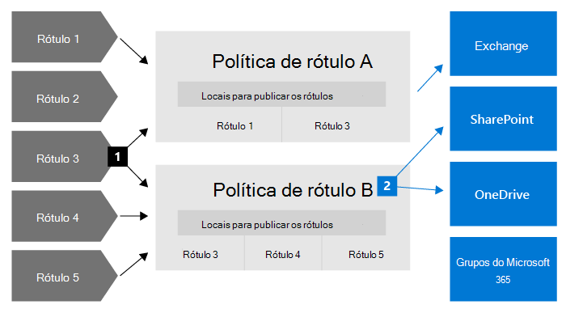
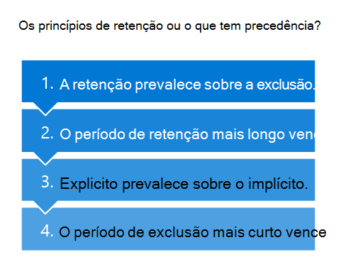

# Saiba mais sobre as políticas de retenção e rótulos de retenção

>*[Diretrizes de licenciamento do Microsoft 365 para segurança e conformidade](/office365/servicedescriptions/microsoft-365-service-descriptions/microsoft-365-tenantlevel-services-licensing-guidance/microsoft-365-security-compliance-licensing-guidance).*

> [!NOTE]
> Se você estiver vendo mensagens sobre políticas de retenção em seus aplicativos, entre em contato com o departamento de TI para obter informações sobre como elas foram configuradas para você. Se essas mensagens forem sobre o chat do Teams ou mensagens de canal, confira [Mensagens do Teams sobre políticas de retenção](https://support.microsoft.com/office/teams-messages-about-retention-policies-c151fa2f-1558-4cf9-8e51-854e925b483b).
>
> As informações desta página são para administradores de TI que podem criar políticas de retenção e rótulos de retenção por motivos de conformidade.

Para a maioria das organizações, o volume e a complexidade dos dados aumentam diariamente, como emails, documentos, mensagens instantâneas e muito mais. O gerenciamento ou controle efetivo dessas informações é importante porque você precisa:
  
- **Estar em conformidade de forma proativa com as regulamentações do setor e as políticas internas** que exigem a retenção do conteúdo por um período mínimo de tempo, por exemplo, a lei Sarbanes-Oxley, que pode exigir que você guarde determinados tipos de conteúdo por sete anos. 

- **Reduzir seu risco em caso de litígio ou violação de segurança** excluindo definitivamente o conteúdo antigo que você não tem mais obrigação de guardar. 
    
- **Ajudar a sua organização a compartilhar conhecimento de maneira eficaz e ser mais ágil** garantindo que seus usuários trabalhem apenas com conteúdo atual e relevante para eles. 
    
As configurações de retenção que você configura podem ajudá-lo a atingir todos esses objetivos. O gerenciamento de conteúdo requer duas ações:
  
- **Reter** conteúdo para que ele não seja excluído permanentemente antes do fim do período de retenção. 
    
- **Excluir** conteúdo permanentemente no final do período de retenção. 
    

Com essas duas ações de retenção, você pode definir as configurações de retenção para os seguintes resultados:

- Reter somente: mantém o conteúdo infinitamente ou por um período de tempo especificado.
- Excluir somente: exclui o conteúdo após um período de tempo especificado.
- Reter e excluir: reter conteúdo por um período de tempo especificado e, em seguida, excluí-lo.

Essas configurações de retenção funcionam com o conteúdo que poupa os demais custos de criação e configuração de armazenamento adicional quando você precisar manter o conteúdo por motivos de conformidade. Além disso, não é necessário implementar processos personalizados para copiar e sincronizar esses dados.

## Como funcionam as configurações de retenção com conteúdo no local

Quando o conteúdo tiver as configurações de retenção atribuídas a ele, esse conteúdo permanecerá no local original. As pessoas podem continuar a trabalhar com seus documentos ou emails como se nada tivesse mudado. Porém, se elas editarem ou excluírem o conteúdo incluído na política de retenção, uma cópia do conteúdo será retida automaticamente.
  
- Para sites do Microsoft Office SharePoint Online e do OneDrive: a cópia é retida na biblioteca de **Retenção para Preservação**.

- Para as caixas de correio do Exchange: a cópia é mantida na pasta **Itens Recuperáveis**. 

- Para as mensagens do Teams e do Yammer: a cópia é mantida em uma pasta oculta chamada **SubstrateHolds** como uma subpasta na pasta **Itens Recuperáveis** do Exchange.

> [!NOTE]
> A biblioteca de Retenção para Preservação consome armazenamento que não está isento da cota de armazenamento de um site. Pode ser necessário aumentar o armazenamento ao usar configurações de retenção para o SharePoint e os grupos do Microsoft 365.
> 
Esses locais seguros e o conteúdo retido não ficam visíveis para a maioria das pessoas. Na maioria dos casos, as pessoas não precisam saber que o conteúdo está sujeito às configurações de retenção.

Para obter informações mais detalhadas sobre como funcionam as configurações de retenção para diferentes cargas de trabalho, confira os seguintes artigos:

- [Saiba mais sobre retenção para o Microsoft Office SharePoint Online e o OneDrive](retention-policies-sharepoint.md)
- [Saiba mais sobre retenção para o Microsoft Teams](retention-policies-teams.md)
- [Saiba mais sobre retenção no Yammer](retention-policies-yammer.md)
- [Saiba mais sobre a retenção para o Exchange](retention-policies-exchange.md)

## Políticas de retenção e rótulos de retenção

Para atribuir suas configurações de retenção ao conteúdo, use **políticas de retenção** e **rótulos de retenção com políticas de rótulos**. Você pode usar apenas um desses métodos ou combiná-los.

Use uma política de retenção para atribuir as mesmas configurações de retenção para o conteúdo em um site ou nível de caixa de correio e usar um rótulo de retenção para atribuir configurações de retenção a um nível de item (pasta, documento, email).

Por exemplo, se todos os documentos em um site do Microsoft Office SharePoint Online devem ser mantidos por cinco anos, é mais eficiente fazer isso com uma política de retenção do que aplicar o mesmo rótulo de retenção a todos os documentos nesse site. No entanto, se alguns documentos desse site devem ser mantidos por 5 anos e outros forem retidos por 10 anos, uma política de retenção não poderá fazer isso. Quando você precisar especificar configurações de retenção no nível de item, use os rótulos de retenção. 

Diferentemente das políticas de retenção, as configurações de retenção de rótulos de retenção permanecem com o conteúdo, caso ele seja copiado ou movido para um local diferente do Microsoft 365. Além disso, os rótulos de retenção têm os seguintes recursos para os quais as políticas de retenção não têm suporte: 
 
- Opções para iniciar o período de retenção a partir do momento em que o conteúdo foi rotulado ou com base em um evento, além da idade do conteúdo ou de quando ele foi modificado pela última vez.

- Use [classificadores treináveis](classifier-learn-about.md) para identificar o conteúdo a ser rotulado.

- Aplicar um rótulo padrão para documentos do Microsoft Office SharePoint Online.

- Suporte [revisão de disposição](./disposition.md) para revisar o conteúdo antes de ser permanentemente excluído.

- Marque o conteúdo como um [registro](records-management.md#records) como parte das configurações de rótulo e sempre tenha  [prova de disposição](disposition.md#disposition-of-records) quando o conteúdo é excluído ao fim do período de retenção.

### Políticas de retenção

As políticas de retenção podem ser aplicadas aos seguintes locais:
- Email do Exchange
- Site do SharePoint
- Contas do OneDrive
- Grupos do Microsoft 365
- Skype for Business
- Pastas públicas do Exchange
- Mensagens do canal do Teams
- Chats do Teams
- Mensagens da comunidade do Yammer
- Mensagens privadas do Yammer

Você pode aplicar uma única política de forma eficaz a vários locais ou a locais ou usuários específicos.

Para o início do período de retenção, você pode escolher quando o conteúdo foi criado ou com suporte apenas para arquivos e os locais do SharePoint, do OneDrive e dos Grupos do Microsoft 365, quando o conteúdo foi modificado pela última vez.

Os itens herdam as configurações de retenção do contêiner especificado na política de retenção. Em seguida, eles são movidos para fora desse contêiner quando a política está configurada para manter o conteúdo, uma cópia desse item é mantida no local seguro da carga de trabalho. No entanto, as configurações de retenção não viajam com o conteúdo em seu novo local. Se necessário, use os rótulos de retenção em vez das políticas de retenção.

### Rótulos de retenção

Use rótulos de retenção para diferentes tipos de conteúdo que exigem diferentes configurações de retenção. Por exemplo:
  
- Formulários fiscais que precisam ser retidos por um período mínimo de tempo. 
    
- Materiais de imprensa que precisam ser excluídos permanentemente quando atingem uma certa idade. 
    
- Pesquisa competitiva que deve ser retida por um período específico e, em seguida, excluída permanentemente. 
    
- As tarefas de trabalho que devem ser marcadas como um registro para que não possam ser editadas ou excluídas. 
    
Em todos esses casos, os rótulos de retenção permitem aplicar configurações de retenção para controle de governança no nível de item (documento ou email).
  
Com os rótulos de retenção, você pode:
  
- **Habilitar as pessoas em sua organização a aplicar um rótulo manualmente** ao conteúdo no Outlook e Outlook na Web, OneDrive, SharePoint e em grupos do Microsoft 365. Geralmente, os usuários sabem com que tipo de conteúdo estão trabalhando, para que eles possam classificá-lo e ter as configurações de retenção apropriadas aplicadas. 
    
- **Aplique automaticamente os rótulos de retenção ao conteúdo** que corresponder a condições específicas, por exemplo, quando o conteúdo apresenta: 
    - Tipos específicos de informações confidenciais.
    - Palavras-chave específicas que correspondem a uma consulta criada por você.
    - Correspondências padrão para um classificador treinável.

- **Inicie o período de retenção a partir do momento em que o conteúdo foi rotulado** para documentos em sites do Microsoft Office SharePoint Online e contas do OneDrive e para itens de email com exceção dos itens do calendário. Se você aplicar um rótulo de retenção com essa configuração em um item de calendário, o período de retenção será iniciado a partir do momento em que ele for enviado.

- **Iniciar o período de retenção quando um evento ocorrer**, como funcionários saem da organização ou os contratos expiram.

- **Aplique um rótulo de retenção padrão a uma biblioteca de documentos** no SharePoint, de modo que todos os documentos que são armazenados naquele local herdem o rótulo de retenção padrão.

Além disso, os rótulos de retenção são compatíveis com o [gerenciamento de registros](records-management.md) de emails e documentos em todos os aplicativos e serviços da Microsoft 365. Você pode usar um rótulo de retenção para marcar os itens como um registro. Quando isso acontece e o conteúdo permanece no Microsoft 365, o rótulo impõe restrições adicionais ao conteúdo que pode ser necessário por motivos regulatórios. Para saber mais, confira [Comparar restrições para quais ações são permitidas ou bloqueadas](records-management.md#compare-restrictions-for-what-actions-are-allowed-or-blocked).

Os rótulos de retenção, diferentemente dos [rótulos de sensibilidade](sensitivity-labels.md), não persistirão se o conteúdo for transferido fora do Microsoft 365.

Não há limite para o número de rótulos de retenção com suporte para um locatário. No entanto, 10.000 é o número máximo de políticas com suporte para um locatário, incluindo as políticas que aplicam os rótulos (políticas de rótulo de retenção e políticas de retenção automática), bem como políticas de retenção.

#### Classificação do conteúdo sem aplicar ações

Embora o principal objetivo de rótulos de retenção seja reter ou excluir o conteúdo, você também pode usar os rótulos de retenção sem ativar qualquer retenção ou outras ações. Nesse caso, você pode usar um rótulo de retenção simplesmente como um rótulo de texto, sem aplicar ações.
  
Por exemplo, você pode criar e aplicar um rótulo de retenção chamado "Revisar mais tarde" sem ações e usar esse rótulo para localizar esse conteúdo mais tarde.
  

#### Usar um rótulo de retenção como condição em uma política DLP

Você pode especificar um rótulo de retenção como uma condição em uma política de prevenção contra perda de dados (DLP) para documentos no Microsoft Office SharePoint Online. Por exemplo, configure uma política DLP para evitar que os documentos sejam compartilhados fora da organização se eles tiverem um rótulo de retenção especificado aplicado a ele.

Para saber mais, confira [Usar um rótulo de retenção como condição em uma política DLP](data-loss-prevention-policies.md#using-a-retention-label-as-a-condition-in-a-dlp-policy).

#### Rótulos de retenção e políticas que os aplicam

Quando você publica rótulos de retenção, eles são incluídos em uma **política de rótulos de retenção** que os disponibiliza para administradores e usuários aplicarem ao conteúdo. Como mostra o diagrama a seguir:

1. Um único rótulo de retenção pode ser incluído em várias políticas de rótulos de retenção.

2. As políticas de rótulos de retenção especificam os locais de publicação dos rótulos de retenção. O mesmo local pode ser incluído em várias políticas de rótulos de retenção.

Você também pode criar uma ou mais **políticas de rótulo de retenção de aplicação automática**, cada uma com um único rótulo de retenção. Com essa política, um rótulo de retenção é aplicado automaticamente quando as condições especificadas na política são atendidas.

#### Políticas de rótulo de retenção e locais

É possível publicar tipos diferentes de rótulos de retenção em locais diferentes, dependendo do que o rótulo faz.
  
| Se o rótulo de retenção for... | A política de rótulo poderá ser aplicada para... |
|:-----|:-----|
|Publicado para administradores e usuários finais    |Exchange, SharePoint, OneDrive, Grupos do Microsoft 365    |
|Aplicada automaticamente com base em tipos de informações confidenciais ou classificadores treináveis    |Exchange (somente para todas as caixas de correio), SharePoint, OneDrive    |
|Aplicado automaticamente com base em uma consulta    |Exchange, SharePoint, OneDrive, Grupos do Microsoft 365    |
   
No Exchange, os rótulos de retenção que você aplica automaticamente são aplicados apenas às mensagens enviadas recentemente (dados em trânsito) e não a todos os itens atualmente na caixa de correio (dados em repouso). Além disso, os rótulos de retenção de aplicação automática para tipos de informações confidenciais e classificadores treináveis aplicam-se a todas as caixas de correio. Não é possível selecionar caixas de correio específicas.
  
As pastas públicas do Exchange, Skype, Teams e as mensagens do Yammer não oferecem suporte a rótulos de retenção. Para reter e excluir conteúdo desses locais, use políticas de retenção.

#### Apenas um rótulo de retenção por vez

Um email ou um documento pode ter apenas um único rótulo de retenção atribuído a ele por vez. Um rótulo de retenção pode ser aplicado [manualmente](create-apply-retention-labels.md#manually-apply-retention-labels) por um usuário final ou administrador ou automaticamente usando um dos seguintes métodos:

- [Aplicar política de rótulo automaticamente](apply-retention-labels-automatically.md)
- [Documento entendendo o modelo do SharePoint Syntex](../contentunderstanding/apply-a-retention-label-to-a-model.md)
- [Rótulo padrão para SharePoint](create-apply-retention-labels.md#applying-a-default-retention-label-to-all-content-in-a-sharepoint-library-folder-or-document-set) ou [Outlook](create-apply-retention-labels.md#applying-a-default-retention-label-to-an-outlook-folder)
- [Regras do Outlook](create-apply-retention-labels.md#automatically-applying-a-retention-label-to-email-by-using-rules)

Para rótulos de retenção padrão (eles não marcam itens como [registro ou registro regulatório](records-management.md#records)):

- Os administradores e os usuários finais podem alterar ou remover manualmente um rótulo de retenção existente que é aplicado ao conteúdo. 

- Quando o conteúdo já tem um rótulo de retenção aplicado, o rótulo existente não será removido automaticamente ou substituído por outro rótulo de retenção com uma possível exceção: o rótulo existente foi aplicado como um rótulo padrão.
    
    Para obter mais informações sobre o comportamento de rótulos quando aplicados usando um rótulo padrão:
    - Rótulo padrão para o SharePoint: [Comportamento de rótulo ao usar um rótulo padrão para o SharePoint](create-apply-retention-labels.md#label-behavior-when-you-use-a-default-label-for-sharepoint)
    - Rótulo padrão para o Outlook: [Aplicando um rótulo de retenção padrão a uma pasta do Outlook](create-apply-retention-labels.md#applying-a-default-retention-label-to-an-outlook-folder)

- Se houver várias políticas de rótulo de aplicação automática que podem aplicar um rótulo de retenção, e o conteúdo atender às condições de várias políticas, o rótulo de retenção da política de rótulo de aplicação automática mais antiga (por data de criação) será atribuído.

Quando os rótulos de retenção marcam os itens como um registro ou um registro normativo, esses rótulos nunca são alterados automaticamente. Somente os administradores do contêiner podem alterar ou remover manualmente os rótulos de retenção que marcam itens como um registro, mas não registros normativos. Para saber mais, consulte [Comparar restrições para quais ações são permitidas ou bloqueadas](records-management.md#compare-restrictions-for-what-actions-are-allowed-or-blocked).

#### Monitorar rótulos de retenção

No Centro de conformidade do Microsoft 365, use **Classificação de dados** > **Visão geral** para monitorar como seus rótulos de retenção estão sendo usados em seu locatário e identifique onde estão os itens rotulados. Para saber mais, incluindo pré-requisitos importantes, confira [Aprenda sobre seus dados - visão geral de classificação de dados](data-classification-overview.md).

Voce pode fazer uma busca detalhada usando o [explorador de conteúdo](data-classification-content-explorer.md) e [explorador de atividade](data-classification-activity-explorer.md).

> [!TIP]
>Considere o uso de algumas das outras ideias de classificação de dados, como classificadores treináveis e tipos de informações confidenciais, para ajudar você a identificar o conteúdo que pode ser necessário reter, excluir, ou gerenciar como registros.

O Centro de Segurança e Conformidade do Office 365 possui as informações equivalentes de visão geral para rótulos de retenção em **Governança de informações** > **Painel**, e informações detalhadas em **Governança de informações** > **Explorador das atividades de rótulo**. Para saber mais sobre como monitorar os rótulos de retenção deste centro de administração antigo, confira a documentação a seguir:
- [Exibir os relatórios de governança de dados](view-the-data-governance-reports.md)
- [Introdução à classificação de dados](data-classification-overview.md).
- [Exibir a atividade de rótulos de documentos](view-label-activity-for-documents.md)

#### Usar a Pesquisa de Conteúdo para localizar todo o conteúdo com um rótulo de retenção específico

Depois que os rótulos de retenção são aplicados ao conteúdo, seja por usuários ou aplicados automaticamente, você pode usar a pesquisa de conteúdo para encontrar todos os itens que possuem um rótulo de retenção específico aplicado.

Ao criar uma pesquisa de conteúdo, escolha a condição **Rótulo de retenção** e, em seguida, digite o nome completo do rótulo de retenção ou parte dele e use um caractere curinga. Para saber mais, veja [Consultas de palavra-chave e condições de pesquisa para Pesquisa de Conteúdo](keyword-queries-and-search-conditions.md).
  

## Comparar recursos para políticas de retenção e rótulos de retenção

Use a tabela a seguir para ajudá-lo a identificar se deseja usar uma política de retenção ou um rótulo de retenção com base em recursos.

|Recursos|Política de retenção |Rótulo de retenção|
|:-----|:-----|:-----|:-----|
|Configurações de retenção que podem reter e excluir, somente reter ou somente excluir |Sim |Sim |
|Cargas de trabalho com suporte:  - Exchange  - Microsoft Office SharePoint Online  - OneDrive  - Grupos do Microsoft 365  - Skype for Business  - Teams - Yammer|  Sim   Sim   Sim   Sim   Sim   Sim   Sim |   Sim, exceto as pastas públicas   Sim   Sim   Sim   Não   Não   Não |
|Retenção aplicada automaticamente | Sim | Sim |
|Retenção aplicada com base em condições   - tipos de informações confidenciais, consultas e palavras-chave KQL, classificadores treináveis| Não | Sim |
|Retenção aplicada manualmente | Não | Sim |
|Presença da interface de usuário para usuários finais | Não | Sim |
|Persiste se o conteúdo for movido | Não | Sim, em seu locatário do Microsoft 365 |
|Declarar um item como um registro| Não | Sim |
|Iniciar o período de retenção ao rotular ou com base em um evento | Não | Sim |
|Revisão de disposição | Não| Sim |
|Prova de disposição por até 7 anos | Não |Sim, quando o item é declarado um registro|
|Auditoria de atividades administrativas| Sim | Sim|
|Identifique os itens sujeitos à retenção:   - Pesquisa de Conteúdo   - Página de classificação de dados, explorador de conteúdo, explorador de atividades |   Não   Não |   Sim   Sim|

Observe que você pode usar as políticas de retenção e os rótulos de retenção como métodos de retenção complementares. Por exemplo:

1. Você cria e configura uma política de retenção que exclui automaticamente o conteúdo cinco anos após a última modificação, e aplica a política a todas as contas do OneDrive.

2. Você cria e configura um rótulo de retenção que mantém o conteúdo infinitamente e adiciona-o a uma política de rótulo publicada em todas as contas do OneDrive. Você explica aos usuários como aplicar manualmente esse rótulo a documentos específicos que devem ser retirados da exclusão automática se não forem modificados após cinco anos.

Para obter mais informações sobre como as políticas de retenção e os rótulos de retenção funcionam juntos e como determinar o resultado combinado, confira a próxima seção que explica os princípios de retenção e o que tem precedência.

## Os princípios de retenção ou o que tem precedência?

Ao contrário dos rótulos de retenção, você pode aplicar mais de uma política de retenção ao mesmo conteúdo. Cada política de retenção pode resultar em uma ação de retenção e uma ação de exclusão. Além disso, esse item também pode estar sujeito a essas ações a partir de um rótulo de retenção.

Nesse cenário, quando os itens podem estar sujeitos a várias configurações de retenção que podem entrar em conflito entre si, quais são os fatores que têm precedência para determinar o resultado?

O resultado não é qual política de retenção única ou rótulo de retenção único prevalece, mas por quanto tempo um item é mantido (se aplicável) e quando um item é excluído (se aplicável). Essas duas ações são calculadas independentemente uma da outra, a partir de todas as configurações de retenção aplicadas a um item.

Por exemplo, um item pode estar sujeito a uma política de retenção configurada para apenas uma ação de exclusão e outra política de retenção configurada para manter e excluir. Consequentemente, este item tem apenas uma ação reter, mas duas ações de exclusão. As ações de retenção e exclusão podem estar em conflito uma com a outra e as duas ações de exclusão podem ter uma data conflitante. Para calcular o resultado, você deve aplicar os princípios de retenção.

Em um alto nível, você pode ter certeza de que a retenção sempre tem precedência sobre a exclusão, e o período de retenção mais longo prevalece. Essas duas regras simples sempre decidem por quanto tempo um item será mantido.

Existem mais alguns fatores que determinam quando um item será excluído, que incluem a ação de exclusão a partir de um rótulo de retenção que sempre tem precedência sobre a ação de exclusão a partir de uma política de retenção.

Use o seguinte fluxo para entender os resultados de retenção e exclusão de um único item, onde cada nível atua no desempate de conflitos, de cima para baixo. Se o resultado for determinado pelo primeiro nível porque não há mais conflitos, não há necessidade de avançar para o nível seguinte e assim por diante.

> [!IMPORTANT]
> Se você estiver usando rótulos de retenção: Antes de usar este fluxo para determinar o resultado de várias configurações de retenção para o mesmo item, certifique-se de saber [qual rótulo de retenção está sendo aplicado](#only-one-retention-label-at-a-time).

  
Explicação para os quatro níveis diferentes:
  
1. **A retenção prevalece sobre a exclusão.** O conteúdo não será permanentemente excluído nos casos em que também tenha configurações de retenção para mantê-lo.  
    
    Exemplo: Uma mensagem de email está sujeita a uma política de retenção do Exchange configurada para excluir itens após três anos e também tem um rótulo de retenção aplicado que está configurado para reter itens por cinco anos.
    
    A mensagem de email é retida por cinco anos porque esta ação de retenção tem precedência sobre a exclusão. A mensagem de email é excluída no final dos cinco anos devido à ação de exclusão adiada.

2. **O período de retenção mais longo prevalece.** Se o conteúdo estiver sujeito a várias configurações de retenção que retêm o conteúdo para diferentes períodos de tempo, o conteúdo será retido até o fim do período de retenção mais longo.
    
    Exemplo: Os documentos no site de Marketing do SharePoint estão sujeitos a duas políticas de retenção. A primeira política de retenção é configurada para que todos os sites SharePoint mantenham itens por cinco anos. A segunda política de retenção é configurada para sites específicos do SharePoint para manter itens por dez anos.
    
    Os documentos neste site de Marketing do SharePoint são retidos por dez anos porque esse é o período de retenção mais longo.

3. **Explicito prevalece sobre o implícito.** Aplicável para determinar quando os itens serão excluídos: 
    
    1. Um rótulo de retenção (independentemente de como foi aplicado) fornece retenção explícita em comparação com as políticas de retenção, porque as configurações de retenção são aplicadas a um item individual em vez de atribuídas implicitamente a partir de um contêiner. Isso significa que uma ação de exclusão de um rótulo de retenção sempre tem precedência sobre uma ação de exclusão de qualquer política de retenção.
        
        Exemplo: Um documento está sujeito a duas políticas de retenção que têm uma ação de exclusão de cinco anos e dez anos, respectivamente, e também um rótulo de retenção que tem uma ação de exclusão de sete anos.
        
        O documento é excluído após sete anos porque a ação de exclusão do rótulo de retenção tem precedência.
    
    2. Quando você tem apenas políticas de retenção: Se uma política de retenção para um local tiver o escopo definido para usar uma configuração de inclusão (como usuários específicos de email do Exchange), essa política de retenção terá precedência sobre as políticas de retenção sem escopo para o mesmo local.
        
        Uma política de retenção sem escopo é onde um local é selecionado sem especificar instâncias específicas. Por exemplo, o **email do Exchange** e a configuração padrão de **Todos os destinatários** são uma política de retenção sem escopo. Ou **sites do SharePoint** e a configuração padrão de **Todos os sites**. Quando o escopo das políticas de retenção é definido, elas têm igual precedência neste nível.
        
        Exemplo 1: uma mensagem de email está sujeita a duas políticas de retenção. A primeira política de retenção não tem escopo e exclui itens após dez anos. A segunda política de retenção tem como escopo caixas de correio específicas e exclui itens após cinco anos.
        
        A mensagem de email é excluída após cinco anos porque a ação de exclusão da política de retenção com escopo tem precedência sobre a política de retenção sem escopo.
        
        Exemplo 2: Um documento na conta do OneDrive de um usuário está sujeito a duas políticas de retenção. A primeira política de retenção tem como escopo incluir a conta do OneDrive deste usuário e tem uma ação de exclusão após 10 anos. A segunda política de retenção tem como escopo incluir a conta do OneDrive desse usuário e tem uma ação de exclusão após sete anos.
        
        Não é possível determinar quando este documento será excluído neste nível porque ambas as políticas de retenção têm escopo.

4. **O período de exclusão mais curto prevalece.** Aplicável para determinar quando os itens serão excluídos das políticas de retenção e o resultado não pôde ser resolvido a partir do nível anterior: O conteúdo é excluído no final do período de retenção mais curto.
    
    Exemplo: Um documento na conta do OneDrive de um usuário está sujeito a duas políticas de retenção. A primeira política de retenção tem como escopo incluir a conta do OneDrive deste usuário e tem uma ação de exclusão após 10 anos. A segunda política de retenção tem como escopo incluir a conta do OneDrive desse usuário e tem uma ação de exclusão após sete anos.
    
    Este documento será excluído após sete anos porque esse é o período de retenção mais curto para essas duas políticas de retenção com escopo definido.

Observe que os itens sujeitos à retenção da Descoberta Eletrônica também se enquadram no primeiro princípio de retenção; eles não podem ser excluídos por nenhuma política de retenção ou rótulo de retenção. Quando essa retenção é liberada, os princípios de retenção continuam a se aplicar a eles. Por exemplo, eles podem então estar sujeitos a um período de retenção vigente ou a uma ação de exclusão adiada.

Exemplos mais complexos que combinam ações de retenção e exclusão:

1. Um item tem as seguintes configurações de retenção aplicadas a ele:
    
    - Uma política de retenção para exclusão somente após cinco anos
    - Uma política de retenção que mantém por três anos e depois exclui
    - Um rótulo de retenção que mantém apenas por sete anos
    
    **Resultado**: O item é retido por sete anos porque a retenção tem precedência sobre a exclusão e sete anos é o período de retenção mais longo. No final deste período de retenção, o item é excluído devido à ação de exclusão das políticas de retenção que foi adiada enquanto o item estava retido.
    
    Embora as duas políticas de retenção tenham datas diferentes para as ações de exclusão, o mais cedo que o item pode ser excluído é ao final do período de retenção mais longo, que é mais longo do que ambas as datas de exclusão. Neste exemplo, não há conflito a ser resolvido para as datas de exclusão, portanto, todos os conflitos são resolvidos no segundo nível.

2.  Um item tem as seguintes configurações de retenção aplicadas a ele:
    
    - Uma política de retenção sem escopo que exclui somente após dez anos
    - Uma política de retenção de escopo que mantém por cinco anos e depois exclui
    - Um rótulo de retenção que mantém por três anos e depois exclui
    
    **Resultado**: O item será mantido por cinco anos porque esse é o período de retenção mais longo. No final desse período de retenção, o item é excluído devido à ação de exclusão de três anos do rótulo de retenção que foi adiado enquanto o item era retido. A exclusão dos rótulos de retenção tem precedência sobre a exclusão de todas as políticas de retenção. Neste exemplo, todos os conflitos são resolvidos no terceiro nível.

## Use o Bloqueio de Preservação para restringir mudanças nas políticas

Algumas organizações talvez precisem cumprir regras definidas por órgãos regulamentadores, como a Regra 17a-4 da Securities and Exchange Commission (SEC), que exige que após uma política de retenção ser ativada, ela não pode ser desativada ou se tornar menos restritiva. 

O Bloqueio de Preservação garante que sua organização possa atender a requisitos regulatórios porque bloqueia uma política de retenção para que ninguém, incluindo o administrador, possa desativar a política, excluir a política ou torná-la menos restritiva.
  
Você aplica o Bloqueio de Preservação depois que a política de retenção ou política de rótulo de retenção for criada. Para obter mais informações e instruções, confira [Usar Bloqueio de Preservação para restringir as alterações nas políticas de retenção e políticas de rótulo de retenção](retention-preservation-lock.md).

## Lançar uma política de retenção

Caso as suas políticas para retenção não tenham um Bloqueio de Preservação, você pode excluir suas políticas a qualquer momento, o que desabilita eficazmente as configurações de retenção aplicadas anteriormente. Você também pode manter a política, mas remover um site do SharePoint ou uma conta do OneDrive, alterar o status de local para desativá-la ou desabilitar a política.
 
Quando você realiza qualquer uma dessas ações, qualquer conteúdo do SharePoint ou do OneDrive que estiver sujeito à retenção da política continuará a ser retido por 30 dias para evitar a perda inadvertida de dados. Durante esse período de carência de 30 dias, não é possível excluir o site, os arquivos excluídos ainda são mantidos (os arquivos continuam sendo adicionados à biblioteca de Retenção para preservação), mas o trabalho de temporizador que limpa periodicamente a biblioteca de Retenção para preservação é suspenso para esses arquivos, para que você possa restaurá-los, se necessário.

Para saber mais sobre a biblioteca de Retenção para Preservação, confira [Como funciona a retenção no SharePoint e no OneDrive](retention-policies-sharepoint.md#how-retention-works-for-sharepoint-and-onedrive).

Devido ao comportamento durante o período de carência, se você habilitar novamente a política ou mudar o status de local para dentro de 30 dias, a política retornará sem qualquer perda permanente de dados durante esse período.

## Configuração de retenção de auditoria

As ações de administrador para as políticas de retenção e os rótulos de retenção são salvas no log de auditoria quando a [auditoria está habilitada](turn-audit-log-search-on-or-off.md). Por exemplo, um evento de auditoria é criado quando uma política de retenção ou um rótulo é criado, configurado ou excluído. Para a lista completa, confira [Política de retenção e atividades do rótulo de retenção](search-the-audit-log-in-security-and-compliance.md#retention-policy-and-retention-label-activities).

## Cmdlets do Windows PowerShell para políticas de retenção e rótulos de retenção

Para usar os cmdlets de retenção, primeiro você deve [se conectar ao PowerShell do Centro de Segurança e Conformidade do Office 365](/powershell/exchange/connect-to-scc-powershell). Em seguida, use um dos seguintes cmdlets:

- [Get-ComplianceTag](/powershell/module/exchange/get-compliancetag)

- [New-ComplianceTag](/powershell/module/exchange/new-compliancetag)

- [Remove-ComplianceTag](/powershell/module/exchange/remove-compliancetag)

- [Set-ComplianceTag](/powershell/module/exchange/set-compliancetag)

- [Enable-ComplianceTagStorage](/powershell/module/exchange/enable-compliancetagstorage)

- [Get-ComplianceTagStorage](/powershell/module/exchange/get-compliancetagstorage)

- [Get-RetentionCompliancePolicy](/powershell/module/exchange/get-retentioncompliancepolicy)

- [New-RetentionCompliancePolicy](/powershell/module/exchange/new-retentioncompliancepolicy)

- [Remove-RetentionCompliancePolicy](/powershell/module/exchange/remove-retentioncompliancepolicy)

- [Set-RetentionCompliancePolicy](/powershell/module/exchange/set-retentioncompliancepolicy)

- [Get-RetentionComplianceRule](/powershell/module/exchange/get-retentioncompliancerule)

- [New-RetentionComplianceRule](/powershell/module/exchange/new-retentioncompliancerule)

- [Remove-RetentionComplianceRule](/powershell/module/exchange/remove-retentioncompliancerule)

- [Set-RetentionComplianceRule](/powershell/module/exchange/set-retentioncompliancerule)

## Quando usar políticas de retenção e rótulos de retenção, ou bloqueios de Descoberta Eletrônica

Embora as configurações de retenção e os [bloqueios criados com uma ocorrência de Descoberta Eletrônica](create-ediscovery-holds.md) possam impedir que os dados sejam excluídos permanentemente, eles são projetados para cenários diferentes. Para ajudar você a entender as diferenças e decidir qual usar, veja as seguintes orientações:

- As configurações de retenção que você especificar nas políticas de retenção e nos rótulos de retenção são projetadas para uma estratégia de governança de informações de longo prazo para reter ou excluir dados para requisitos de conformidade. O escopo é geralmente amplo, com o foco principal sendo o local e o conteúdo, e não os usuários individuais. O início e o fim do período de retenção podem ser configurados, com a opção de excluir automaticamente o conteúdo sem intervenção do administrador.

- Os bloqueios da Descoberta Eletrônica (casos de Descoberta Eletrônica Principal ou de Descoberta Eletrônica Avançada) são projetados por um período limitado para preservar os dados de uma investigação legal. O escopo é específico, com foco no conteúdo dos usuários identificados. O início e o fim do período de preservação não são configuráveis, mas dependem de ações individuais do administrador, sem uma opção de excluir conteúdo automaticamente quando o bloqueio for liberado.

Resumo para comparar a retenção com os bloqueios:

|Considerações|Retenção |Bloqueios de Descoberta Eletrônica|
|:-----|:-----|:-----|:-----|
|Necessidade comercial: |Conformidade |Jurídico |
|Escopo de tempo: |Longo prazo |Curto prazo |
|Foco: |Amplo e baseado no conteúdo |Específico e baseado no usuário |
|Data de início e de término configurável: |Sim |Não |
|Exclusão de conteúdo: |Sim (opcional) |Não |
|Sobrecarga administrativa: |Baixo |Alto |

Se o conteúdo estiver sujeito às configurações de retenção e ao bloqueio de Descoberta Eletrônica, a preservação de conteúdo do bloqueio de Descoberta Eletrônica sempre terá precedência. Dessa forma, os [princípios de retenção](#the-principles-of-retention-or-what-takes-precedence) se expandem para os bloqueios de Descoberta Eletrônica, pois eles preservam os dados até que um administrador libere manualmente o bloqueio. No entanto, apesar dessa precedência, não use os bloqueios da Descoberta Eletrônica para governança de informações de longo prazo. Se você estiver preocupado com a exclusão automática de dados, defina as configurações de retenção para reter itens para sempre ou usar a [revisão de disposição](disposition.md#disposition-reviews) com rótulos de retenção.

Se você estiver usando ferramentas de Descoberta Eletrônica mais antigas para preservar dados, consulte os seguintes recursos:

- Exchange: 
    - [Bloqueio In-loco e Retenção de Litígio](/exchange/security-and-compliance/in-place-and-litigation-holds)
    - [Como identificar o tipo de retenção de uma caixa de correio do Exchange Online](./identify-a-hold-on-an-exchange-online-mailbox.md)

- SharePoint e OneDrive: 
    - [Adicionar conteúdo a uma ocorrência e colocar fontes em retenção na Descoberta Eletrônica](/SharePoint/governance/add-content-to-a-case-and-place-sources-on-hold-in-the-ediscovery-center)

- [Baixa das ferramentas de Descoberta Eletrônica herdadas](legacy-ediscovery-retirement.md)

## Use as políticas de retenção e os rótulos de retenção em vez de recursos mais antigos

Se você precisar reter ou excluir o conteúdo proativamente no Microsoft 365 para o controle de informações, recomendamos usar as políticas de retenção e os rótulos de retenção em vez dos recursos mais antigos.

Se você usa esses recursos mais antigos, eles continuarão a funcionar lado a lado com as políticas de retenção e os rótulos de retenção. No entanto, recomendamos que, daqui para frente, você use políticas de retenção e rótulos de retenção. Eles fornecem um único mecanismo para gerenciar centralmente a retenção e a exclusão de conteúdo no Microsoft 365.

**Recursos mais antigos do Exchange Online:**

- [Marcas de retenção e políticas de retenção](/exchange/security-and-compliance/messaging-records-management/retention-tags-and-policies), também conhecidas como [gerenciamento de registros de mensagens (MRM)](/exchange/security-and-compliance/messaging-records-management/messaging-records-management) (apenas exclusão)

**Recursos mais antigos do SharePoint e do OneDrive:**

- [Políticas de exclusão documento](https://support.office.com/article/Create-a-document-deletion-policy-in-SharePoint-Server-2016-4fe26e19-4849-4eb9-a044-840ab47458ff) (apenas exclusão)
    
- [Como configurar o gerenciamento de registros no local](https://support.office.com/article/7707a878-780c-4be6-9cb0-9718ecde050a) (apenas retenção) 
    
- [Usar políticas de fechamento de site e exclusão](https://support.microsoft.com/pt-BR/office/use-policies-for-site-closure-and-deletion-a8280d82-27fd-48c5-9adf-8a5431208ba5) (apenas exclusão)
    
- [Políticas de gerenciamento de informações](intro-to-info-mgmt-policies.md) (apenas exclusão)
     
Se você configurou sites do SharePoint para políticas de tipo de conteúdo ou políticas de gerenciamento de informações para reter o conteúdo de uma lista ou biblioteca, essas políticas serão ignoradas enquanto uma política de retenção estiver em vigor. 

## Informações relacionadas

- [Limites do SharePoint Online](/office365/servicedescriptions/sharepoint-online-service-description/sharepoint-online-limits)
- [Limites e especificações para o Microsoft Teams](/microsoftteams/limits-specifications-teams) 
- [Recursos para ajudá-lo a atender aos requisitos normativos para o controle de informações e o gerenciamento de registros](retention-regulatory-requirements.md)

## Instruções de configuração

Se você estiver pronto para criar políticas de retenção, consulte [Criar e configurar as políticas de retenção](create-retention-policies.md).

Para criar e aplicar rótulos de retenção:
- [Criar rótulos de retenção e aplicá-los em aplicativos](create-apply-retention-labels.md)
- [Aplicar um rótulo de retenção automaticamente ao conteúdo](apply-retention-labels-automatically.md)