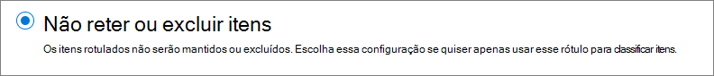

# Saiba mais sobre as políticas de retenção e rótulos de retençãoLearn about retention policies and retention labels

>*[Diretrizes de licenciamento do Microsoft 365 para segurança e conformidade](https://aka.ms/ComplianceSD).**[Microsoft 365 licensing guidance for security & compliance](https://aka.ms/ComplianceSD).*

Para a maioria das organizações, o volume e a complexidade dos dados aumentam diariamente, como emails, documentos, mensagens instantâneas e muito mais. O gerenciamento ou controle efetivo dessas informações é importante porque você precisa:For most organizations, the volume and complexity of their data is increasing daily—email, documents, instant messages, and more. Effectively managing or governing this information is important because you need to:
  
- **Estar em conformidade de forma proativa com as regulamentações do setor e as políticas internas** que exigem a retenção do conteúdo por um período mínimo de tempo, por exemplo, a lei Sarbanes-Oxley, que pode exigir que você guarde determinados tipos de conteúdo por sete anos.**Comply proactively with industry regulations and internal policies** that require you to retain content for a minimum period of time—for example, the Sarbanes-Oxley Act might require you to retain certain types of content for seven years. 

- **Reduzir seu risco em caso de litígio ou violação de segurança** excluindo definitivamente o conteúdo antigo que você não tem mais obrigação de guardar.**Reduce your risk in the event of litigation or a security breach** by permanently deleting old content that you're no longer required to keep. 
    
- **Ajudar a sua organização a compartilhar conhecimento de maneira eficaz e ser mais ágil** garantindo que seus usuários trabalhem apenas com conteúdo atual e relevante para eles.**Help your organization to share knowledge effectively and be more agile** by ensuring that your users work only with content that's current and relevant to them. 
    
As configurações de retenção que você configurar podem ajudá-lo a atingir todos esses objetivos. O gerenciamento de conteúdo normalmente requer duas ações:Retention settings that you configure can help you achieve all these goals. Managing content commonly requires two actions:
  
- **Reter** conteúdo para que ele não seja excluído permanentemente antes do fim do período de retenção.**Retaining** content so that it can't be permanently deleted before the end of the retention period. 
    
- **Excluir** conteúdo permanentemente no final do período de retenção.**Deleting** content permanently at the end of the retention period. 
    

Com essas duas ações de retenção, você pode definir as configurações de retenção para os seguintes resultados:With these two retention actions, you can configure retention settings for the following outcomes:

- Reter somente: mantém o conteúdo infinitamente ou por um período de tempo especificado.Retain-only: Retain content forever or for a specified period of time.
- Excluir somente: exclui o conteúdo após um período de tempo especificado.Delete-only: Delete content after a specified period of time.
- Reter e excluir: reter conteúdo por um período de tempo especificado e, em seguida, excluí-lo.Retain and then delete: Retain content for a specified period of time and then delete it.

Essas configurações de retenção funcionam com o conteúdo que poupa os demais custos de criação e configuração de armazenamento adicional quando você precisar manter o conteúdo por motivos de conformidade. Além disso, não é necessário implementar processos personalizados para copiar e sincronizar esses dados.These retention settings work with content in place that saves you the additional overheads of creating and configuring additional storage when you need to retain content for compliance reasons. In addition, you don't need to implement customized processes to copy and synchronize this data.

## Como funcionam as configurações de retenção com conteúdo no localHow retention settings work with content in place

Quando o conteúdo tiver as configurações de retenção atribuídas a ele, esse conteúdo permanecerá no local original. As pessoas podem continuar a trabalhar com seus documentos ou emails como se nada tivesse mudado. Porém, se elas editarem ou excluírem o conteúdo incluído na política de retenção, uma cópia do conteúdo será retida automaticamente.When content has retention settings assigned to it, that content remains in its original location. People can continue to work with their documents or mail as if nothing's changed. But if they edit or delete content that's included in the retention policy, a copy of the content is automatically retained.
  
- Para sites do Microsoft Office SharePoint Online e do OneDrive: a cópia é retida na biblioteca de **Retenção para Preservação**.For SharePoint and OneDrive sites: The copy is retained in the **Preservation Hold** library.

- Para as caixas de correio do Exchange: a cópia é mantida na pasta **Itens Recuperáveis**.For Exchange mailboxes: The copy is retained in the **Recoverable Items** folder. 

- Para as mensagens do Teams e do Yammer: a cópia é mantida em uma pasta oculta chamada **SubstrateHolds** como uma subpasta na pasta **Itens Recuperáveis** do Exchange.For Teams and Yammer messages: The copy is retained in a hidden folder named **SubstrateHolds** as a subfolder in the Exchange **Recoverable Items** folder.

> [!NOTE]
> A biblioteca de Retenção para Preservação consome armazenamento que não está isento da cota de armazenamento de um site. Pode ser necessário aumentar o armazenamento ao usar configurações de retenção para o SharePoint e os grupos do Microsoft 365.The Preservation Hold library consumes storage that isn't exempt from a site's storage quota. You might need to increase your storage when you use retention settings for SharePoint and Microsoft 365 groups.
> 
Esses locais seguros e o conteúdo retido não ficam visíveis para a maioria das pessoas. Na maioria dos casos, as pessoas não precisam saber que o conteúdo está sujeito às configurações de retenção.These secure locations and the retained content are not visible to most people. In most cases, people do not even need to know that their content is subject to retention settings.

Para obter informações mais detalhadas sobre como funcionam as configurações de retenção para diferentes cargas de trabalho, confira os seguintes artigos:For more detailed information about how retention settings work for different workloads, see the following articles:

- [Saiba mais sobre retenção para o Microsoft Office SharePoint Online e o OneDriveLearn about retention for SharePoint and OneDrive](retention-policies-sharepoint.md)
- [Saiba mais sobre retenção para o Microsoft TeamsLearn about retention for Microsoft Teams](retention-policies-teams.md)
- [Saiba mais sobre retenção no YammerLearn about retention for Yammer](retention-policies-yammer.md)
- [Saiba mais sobre a retenção para o ExchangeLearn about retention for Exchange](retention-policies-exchange.md)

## Políticas de retenção e rótulos de retençãoRetention policies and retention labels

Você pode usar tanto as políticas de retenção quanto os rótulos de retenção para atribuir as suas configurações de retenção ao conteúdo.You can use both retention policies and retention labels with label policies to assign your retention settings to content. 

Use uma política de retenção para atribuir as mesmas configurações de retenção para o conteúdo em um site ou nível de caixa de correio e usar um rótulo de retenção para atribuir configurações de retenção a um nível de item (pasta, documento, email).Use a retention policy to assign the same retention settings for content at a site or mailbox level, and use a retention label to assign retention settings at an item level (folder, document, email).

Por exemplo, se todos os documentos em um site do Microsoft Office SharePoint Online devem ser mantidos por 5 anos, é mais eficiente fazer isso com uma política de retenção do que aplicar o mesmo rótulo de retenção a todos os documentos nesse site. No entanto, se alguns documentos desse site devem ser mantidos por 5 anos e outros forem retidos por 10 anos, uma política de retenção não poderá fazer isso. Quando você precisar especificar configurações de retenção no nível de item, use os rótulos de retenção.For example, if all documents in a SharePoint site should be retained for 5 years, it's more efficient to do this with a retention policy than apply the same retention label to all documents in that site. However, if some documents in that site should be retained for 5 years and others retained for 10 years, a retention policy wouldn't be able to do this. When you need to specify retention settings at the item level, use retention labels. 

Diferentemente das políticas de retenção, as configurações de retenção de rótulos de retenção permanecem com o conteúdo, caso ele seja copiado ou movido para um local diferente do Microsoft 365. Além disso, os rótulos de retenção têm os seguintes recursos para os quais as políticas de retenção não têm suporte:Unlike retention policies, retention settings from retention labels travel with the content if it’s moved to a different location within your Microsoft 365 tenant. In addition, retention labels have the following capabilities that retention policies don't support: 
 
- Opções para iniciar o período de retenção a partir do momento em que o conteúdo foi rotulado ou com base em um evento, além da idade do conteúdo ou de quando ele foi modificado pela última vez.Options to start the retention period from when the content was labeled or based on an event, in addition to the age of the content or when it was last modified.

- Use [classificadores treináveis](classifier-learn-about.md) para identificar o conteúdo a ser rotulado.Use [trainable classifiers](classifier-learn-about.md) to identify content to label.

- Aplicar um rótulo padrão para documentos do Microsoft Office SharePoint Online.Apply a default label for SharePoint documents.

- Suporte [revisão de disposição](disposition-reviews.md) para revisar o conteúdo antes de ser permanentemente excluído.Support [disposition review](disposition-reviews.md) to review the content before it's permanently deleted.

- Marque o conteúdo como um [registro](records-management.md#records) como parte das configurações de rótulo e sempre tenha  [prova de disposição](disposition.md#disposition-of-records) quando o conteúdo é excluído ao fim do período de retenção.Mark the content as a [record](records-management.md#records) as part of the label settings, and always have [proof of disposition](disposition.md#disposition-of-records) when content is deleted at the end of its retention period.

### Políticas de retençãoRetention policies

As políticas de retenção podem ser aplicadas aos seguintes locais:Retention policies can be applied to the following locations:
- Email do ExchangeExchange email
- Site do Microsoft Office SharePoint OnlineSharePoint site
- Contas do OneDriveOneDrive accounts
- Grupos do Microsoft 365Microsoft 365 Groups
- Skype for BusinessSkype for Business
- Pastas públicas do ExchangeExchange public folders
- Mensagens do canal do TeamsTeams channel messages
- Chats do TeamsTeams chats
- Mensagens da comunidade do YammerYammer community messages
- Mensagens privadas do YammerYammer private messages

Você pode aplicar uma única política de forma eficaz a vários locais ou a locais ou usuários específicos.You can very efficiently apply a single policy to multiple locations, or to specific locations or users.

Para o início do período de retenção, você pode escolher quando o conteúdo foi criado ou com suporte apenas para arquivos e os locais do SharePoint, do OneDrive e dos Grupos do Microsoft 365, quando o conteúdo foi modificado pela última vez.For the start of the retention period, you can choose when the content was created or, supported only for files and the SharePoint, OneDrive, and Microsoft 365 Groups locations, when the content was last modified.

Os itens herdam as configurações de retenção do contêiner especificado na política de retenção. Em seguida, eles são movidos para fora desse contêiner quando a política está configurada para manter o conteúdo, uma cópia desse item é mantida no local seguro da carga de trabalho. No entanto, as configurações de retenção não viajam com o conteúdo em seu novo local. Se necessário, use os rótulos de retenção em vez das políticas de retenção.Items inherit the retention settings from their container specified in the retention policy. If they are then moved outside that container when the policy is configured to retain content, a copy of that item is retained in the workload's secured location. However, the retention settings don't travel with the content in its new location. If that's required, use retention labels instead of retention policies.

### Rótulos de retençãoRetention labels

Use rótulos de retenção para diferentes tipos de conteúdo que exigem diferentes configurações de retenção. Por exemplo:Use retention labels for different types of content that require different retention settings. For example:
  
- Formulários fiscais que precisam ser retidos por um período mínimo de tempo.Tax forms that need to be retained for a minimum period of time. 
    
- Materiais de imprensa que precisam ser excluídos permanentemente quando atingem uma certa idade.Press materials that need to be permanently deleted when they reach a specific age. 
    
- Pesquisa competitiva que deve ser retida por um período específico e, em seguida, excluída permanentemente.Competitive research that needs to be retained for a specific period and then permanently deleted. 
    
- As tarefas de trabalho que devem ser marcadas como um registro para que não possam ser editadas ou excluídas.Work visas that must be marked as a record so that they can't be edited or deleted. 
    
Em todos esses casos, os rótulos de retenção permitem aplicar configurações de retenção para controle de governança no nível de item (documento ou email).In all these cases, retention labels let you apply retention settings for governance control at the item level (document or email).
  
Com os rótulos de retenção, você pode:With retention labels, you can:
  
- **Permita que pessoas em sua organização apliquem um rótulo de retenção manualmente** ao conteúdo no Outlook e no Outlook na Web, no OneDrive, no SharePoint e Grupos do Microsoft 365. Os usuários geralmente sabem melhor o tipo de conteúdo com o qual estão trabalhando; portanto, podem classificá-lo e aplicar a política apropriada.**Enable people in your organization to apply a retention label manually** to content in Outlook and Outlook on the web, OneDrive, SharePoint, and Microsoft 365 groups. Users often know best what type of content they're working with, so they can classify it and have the appropriate retention settings applied. 
    
- **Aplique automaticamente os rótulos de retenção ao conteúdo** se ele corresponder a condições específicas, por exemplo, quando o conteúdo contém:**Apply retention labels to content automatically** if it matches specific conditions, such as when the content contains: 
    - Tipos específicos de informações confidenciais.Specific types of sensitive information.
    - Palavras-chave específicas que correspondem a uma consulta criada por você.Specific keywords that match a query you create.
    - Correspondências padrão para um classificador treinável.Pattern matches for a trainable classifier.

- **Inicie o período de retenção a partir do momento em que o conteúdo foi rotulado** para documentos em sites do SharePoint e contas do OneDrive e para itens de email com exceção dos itens do calendário. Se você aplicar um rótulo de retenção com essa configuração em um item de calendário, o período de retenção será iniciado a partir do momento em que ele for enviado.**Start the retention period from when the content was labeled** for documents in SharePoint sites and OneDrive accounts, and to email items with the exception of calendar items. If you apply a retention label with this configuration to a calendar item, the retention period starts from when it is sent.

- **Iniciar o período de retenção quando um evento ocorrer**, por exemplo, funcionários saem da organização ou os contratos expiram.**Start the retention period when an event occurs**, such as employees leave the organization, or contracts expire.

- **Aplique um rótulo de retenção padrão a uma biblioteca de documentos, pasta ou conjunto de documentos** no SharePoint, de modo que todos os documentos que são armazenados naquele local herdem o rótulo de retenção padrão.**Apply a default retention label to a document library, folder, or document set** in SharePoint, so that all documents that are stored in that location inherit the default retention label.

Além disso, os rótulos de retenção oferecem suporte a [gerenciamento de registros](records-management.md) de emails e documentos em todos os aplicativos e serviços do Microsoft 365. Você pode usar um rótulo de retenção para marcar os itens como um registro. Quando isso acontece e o conteúdo permanece no Microsoft 365, o rótulo insere restrições sobre o conteúdo que pode ser necessário por motivos regulatórios. Para saber mais, consulte [Comparar restrições para quais ações são permitidas ou bloqueadas](records-management.md#compare-restrictions-for-what-actions-are-allowed-or-blocked).Additionally, retention labels support [records management](records-management.md) for email and documents across Microsoft 365 apps and services. You can use a retention label to mark items as a record. When this happens and the content remains in Microsoft 365, the label places further restrictions on the content that might be needed for regulatory reasons. For more information, see [Compare restrictions for what actions are allowed or blocked](records-management.md#compare-restrictions-for-what-actions-are-allowed-or-blocked).

Os rótulos de retenção, diferentemente dos [rótulos de sensibilidade](sensitivity-labels.md), não persistirão se o conteúdo for transferido fora do Microsoft 365.Retention labels, unlike [sensitivity labels](sensitivity-labels.md), do not persist if the content is moved outside Microsoft 365.

Não há limite para o número de rótulos de retenção com suporte para um locatário. No entanto, 10.000 é o número máximo de políticas com suporte para um locatário, incluindo as políticas que aplicam os rótulos (políticas de rótulo de retenção e políticas de retenção automática), bem como políticas de retenção.There is no limit to the number of retention labels that are supported for a tenant. However, 10,000 is the maximum number of policies that are supported for a tenant and these include the policies that apply the labels (retention label policies and auto-apply retention policies), as well as retention policies.

#### Classificação do conteúdo sem aplicar açõesClassifying content without applying any actions

Embora o principal objetivo de rótulos de retenção seja reter ou excluir o conteúdo, você também pode usar os rótulos de retenção sem ativar qualquer retenção ou outras ações. Nesse caso, você pode usar o rótulo de retenção simplesmente como um rótulo de texto, sem impor quaisquer ações.Although the main purpose of retention labels is to retain or delete content, you can also use retention labels without turning on any retention or other actions. In this case, you can use a retention label simply as a text label, without enforcing any actions.
  
Por exemplo, você pode criar e aplicar um rótulo de retenção chamado "Revisar mais tarde" sem ações e usar esse rótulo para localizar esse conteúdo mais tarde.For example, you can create and apply a retention label named "Review later" with no actions, and then use that label to find that content later.
  

#### Usar um rótulo de retenção como condição em uma política DLPUsing a retention label as a condition in a DLP policy

Você pode especificar um rótulo de retenção como uma condição em uma política de prevenção contra perda de dados (DLP) para documentos no SharePoint. Por exemplo, configure uma política DLP para evitar que os documentos sejam compartilhados fora da organização se eles tiverem um rótulo de retenção especificado aplicado a ele.You can specify a retention label as a condition in a data loss prevention (DLP) policy for documents in SharePoint. For example, configure a DLP policy to prevent documents from being shared outside the organization if they have a specified retention label applied to it.

Para saber mais, consulte [Usar um rótulo de retenção como condição em uma política DLP](data-loss-prevention-policies.md#using-a-retention-label-as-a-condition-in-a-dlp-policy).For more information, see [Using a retention label as a condition in a DLP policy](data-loss-prevention-policies.md#using-a-retention-label-as-a-condition-in-a-dlp-policy).

#### Rótulos de retenção e políticas que os aplicamRetention labels and policies that apply them

Os rótulos de retenção são blocos de construção independentes e reutilizáveis. O objetivo principal de uma política de rótulos de retenção é agrupar um conjunto de rótulos de retenção e especificar os locais nos quais você deseja exibi-los. Em seguida, os administradores e os usuários podem aplicar esses rótulos ao conteúdo desses locais.Retention labels are independent, reusable building blocks. The primary purpose of a retention label policy is to group a set of retention labels and specify the locations where you want those labels to appear. Then, admins and users can apply those labels to content in those locations.
  

  
Quando você publica rótulos de retenção, eles são incluídos em uma política de rótulo de retenção que os torna disponíveis para administradores e usuários selecionarem:When you publish retention labels, they're included in a retention label policy that make them available for admins and users to select:

- Um único rótulo de retenção pode ser incluído em várias políticas de rótulos de retenção.A single retention label can be included in many retention label policies.

- As políticas de rótulos de retenção especificam os locais de publicação dos rótulos de retenção.Retention label policies specify the locations to publish the retention labels.

- Um único local também pode ser incluído em várias políticas de rótulos de retenção.A single location can also be included in many retention label policies.

Além das políticas de rótulo de retenção, você também pode criar uma ou mais políticas de aplicação automática, cada uma com um único rótulo de retenção. Com essa política, um rótulo de retenção é aplicado automaticamente quando as condições especificadas na política são atendidas.In addition to retention label policies, you can also create one or more auto-apply policies, each with a single retention label. With this policy, a retention label is automatically applied when conditions that you specify in the policy are met. 

#### Políticas e locais de rótulo de retençãoRetention label policies and locations

É possível publicar tipos diferentes de rótulos de retenção em locais diferentes, dependendo do que o rótulo faz.Different types of retention labels can be published to different locations, depending on what the retention label does.
  
| Se o rótulo de retenção for...If the retention label is… | A política de rótulo poderá ser aplicada para...Then the label policy can be applied to… |
|:-----|:-----|
|Publicado para administradores e usuários finaisPublished to admins and end users    |Exchange, SharePoint, OneDrive, Grupos do Microsoft 365Exchange, SharePoint, OneDrive, Microsoft 365 Groups    |
|Aplicada automaticamente com base em tipos de informações confidenciais ou classificadores treináveisAuto-applied based on sensitive information types or trainable classifiers    |Exchange (somente para todas as caixas de correio), SharePoint, OneDriveExchange (all mailboxes only), SharePoint, OneDrive    |
|Aplicado automaticamente com base em uma consultaAuto-applied based on a query    |Exchange, SharePoint, OneDrive, Grupos do Microsoft 365Exchange, SharePoint, OneDrive, Microsoft 365 Groups    |
   
No Exchange, os rótulos de retenção de aplicação automática são aplicados somente às mensagens enviadas recentemente (dados em trânsito), não a todos os itens na caixa de correio (dados em repouso). Além disso, os rótulos de retenção de aplicação automática para tipos de informações confidenciais e classificadores treináveis para todas as caixas de correio; não é possível selecionar caixas de correio específicas.In Exchange, auto-apply retention labels are applied only to messages newly sent (data in transit), not to all items currently in the mailbox (data at rest). Also, auto-apply retention labels for sensitive information types and trainable classifiers apply to all mailboxes; you can't select specific mailboxes.
  
As pastas públicas do Exchange, as mensagens do Skype, Teams e Yammer não oferecem suporte a rótulos de retenção. Para manter e excluir conteúdo desses locais, use políticas de retenção.Exchange public folders, Skype, Teams and Yammer messages do not support retention labels. To retain and delete contain from these locations, use retention policies instead.

#### Apenas um rótulo de retenção por vezOnly one retention label at a time

Um email ou um documento pode ter apenas um único rótulo de retenção atribuído a ele por vez.An email or document can have only a single retention label applied to it at a time. Um rótulo de retenção pode ser aplicado [manualmente](create-apply-retention-labels.md#manually-apply-retention-labels) por um usuário final ou administrador ou automaticamente usando um dos seguintes métodos:A retention label can be applied [manually](create-apply-retention-labels.md#manually-apply-retention-labels) by an end user or admin, or automatically by using any of the following methods:

- [Aplicar política de rótulo automaticamenteAuto-apply label policy](apply-retention-labels-automatically.md)
- [Documento entendendo o modelo do SharePoint SyntexDocument understanding model for SharePoint Syntex](https://docs.microsoft.com/microsoft-365/contentunderstanding/apply-a-retention-label-to-a-model)
- [Rótulo padrão para SharePoint](create-apply-retention-labels.md#applying-a-default-retention-label-to-all-content-in-a-sharepoint-library-folder-or-document-set) ou [Outlook](create-apply-retention-labels.md#applying-a-default-retention-label-to-an-outlook-folder)[Default label for SharePoint](create-apply-retention-labels.md#applying-a-default-retention-label-to-all-content-in-a-sharepoint-library-folder-or-document-set) or [Outlook](create-apply-retention-labels.md#applying-a-default-retention-label-to-an-outlook-folder)
- [Regras do OutlookOutlook rules](create-apply-retention-labels.md#automatically-applying-a-retention-label-to-email-by-using-rules)

Para rótulos de retenção padrão (eles não marcam itens como [registro ou registro regulatório](records-management.md#records)):For standard retention labels (they don't mark items as a [record or regulatory record](records-management.md#records)):

- Os administradores e os usuários finais podem alterar ou remover manualmente um rótulo de retenção existente que é aplicado ao conteúdo.Admins and end users can manually change or remove an existing retention label that's applied on content. 

- Quando o conteúdo já tem um rótulo de retenção aplicado, o rótulo existente não será removido automaticamente ou substituído por outro rótulo de retenção com uma possível exceção: o rótulo existente foi aplicado como um rótulo padrão.When content already has a retention label applied, the existing label won't be automatically removed or replaced by another retention label with one possible exception: The existing label was applied as a default label.
    
    Para obter mais informações sobre o comportamento de rótulos quando aplicados usando um rótulo padrão:For more information about the label behavior when it's applied by using a default label:
    - Rótulo padrão para o SharePoint: [Comportamento de rótulo ao usar um rótulo padrão para o SharePoint](create-apply-retention-labels.md#label-behavior-when-you-use-a-default-label-for-sharepoint)Default label for SharePoint: [Label behavior when you use a default label for SharePoint](create-apply-retention-labels.md#label-behavior-when-you-use-a-default-label-for-sharepoint)
    - Rótulo padrão para o Outlook: [Aplicando um rótulo de retenção padrão a uma pasta do Outlook](create-apply-retention-labels.md#applying-a-default-retention-label-to-an-outlook-folder)Default label for Outlook: [Applying a default retention label to an Outlook folder](create-apply-retention-labels.md#applying-a-default-retention-label-to-an-outlook-folder)

- Se houver várias políticas de rótulo de aplicação automática que podem aplicar um rótulo de retenção, e o conteúdo atender às condições de várias políticas, o rótulo de retenção da política de rótulo de aplicação automática mais antiga (por data de criação) será atribuído.If there are multiple auto-apply label policies that could apply a retention label, and content meets the conditions of multiple policies, the retention label for the oldest auto-apply label policy (by date created) is applied.

Quando os rótulos de retenção marcam os itens como um registro ou um registro normativo, esses rótulos nunca são alterados automaticamente.When retention labels mark items as a record or a regulatory record, these labels are never automatically changed. Somente os administradores do contêiner podem alterar ou remover manualmente os rótulos de retenção que marcam itens como um registro, mas não registros normativos.Only admins for the container can manually change or remove retention labels that mark items as a record, but not regulatory records. Para saber mais, consulte [Comparar restrições para quais ações são permitidas ou bloqueadas](records-management.md#compare-restrictions-for-what-actions-are-allowed-or-blocked).For more information, see [Compare restrictions for what actions are allowed or blocked](records-management.md#compare-restrictions-for-what-actions-are-allowed-or-blocked).

#### Monitorar rótulos de retençãoMonitoring retention labels

No Centro de conformidade do Microsoft 365, use **Classificação de dados** > **Visão geral** para monitorar como seus rótulos de retenção estão sendo usados em seu locatário e identifique onde estão os itens rotulados.From the Microsoft 365 compliance center, use **Data classification** > **Overview** to monitor how your retention labels are being used in your tenant, and identify where your labeled items are located. Para saber mais, incluindo pré-requisitos importantes, confira [Aprenda sobre seus dados - visão geral de classificação de dados](data-classification-overview.md).For more information, including important prerequisites, see [Know your data - data classification overview](data-classification-overview.md).

Voce pode fazer uma busca detalhada usando o [explorador de conteúdo](data-classification-content-explorer.md) e [explorador de atividade](data-classification-activity-explorer.md).You can then drill down into details by using [content explorer](data-classification-content-explorer.md) and [activity explorer](data-classification-activity-explorer.md).

> [!TIP]
>Considere o uso de algumas das outras ideias de classificação de dados, como classificadores treináveis e tipos de informações confidenciais, para ajudar você a identificar o conteúdo que pode ser necessário reter, excluir, ou gerenciar como registros.Consider using some of the other data classification insights, such as trainable classifiers and sensitive info types, to help you identify content that you might need to retain or delete, or manage as records.

O Centro de Segurança e Conformidade do Office 365 possui as informações equivalentes de visão geral para rótulos de retenção em **Governança de informações** > **Painel**, e informações detalhadas em **Governança de informações** > **Explorador das atividades de rótulo**.The Office 365 Security & Compliance Center has the equivalent overview information for retention labels from **Information governance** > **Dashboard**, and more detailed information from **Information governance** > **Label activity explorer**. Para saber mais sobre como monitorar os rótulos de retenção deste centro de administração antigo, confira a documentação a seguir:For more information about monitoring retention labels from this older admin center, see the following documentation:
- [Exibir os relatórios de governança de dadosView the data governance reports](view-the-data-governance-reports.md)
- [Exibição do uso do rótulo com análises de rótuloView label usage with label analytics](label-analytics.md)
- [Exibir a atividade de rótulos de documentosView label activity for documents](view-label-activity-for-documents.md)

#### Usar a Pesquisa de Conteúdo para localizar todo o conteúdo com um rótulo de retenção específicoUsing Content Search to find all content with a specific retention label

Depois que os rótulos de retenção são aplicados ao conteúdo, seja por usuários ou aplicados automaticamente, você pode usar a pesquisa de conteúdo para encontrar todos os itens que possuem um rótulo de retenção específico aplicado.After retention labels are applied to content, either by users or auto-applied, you can use content search to find all items that have a specific retention label applied.

Ao criar uma pesquisa de conteúdo, escolha a condição **Rótulo de retenção** e, em seguida, digite o nome completo do rótulo de retenção ou parte dele e use um caractere curinga.When you create a content search, choose the **Retention label** condition, and then enter the complete retention label name or part of the label name and use a wildcard. Para saber mais, veja [Consultas de palavra-chave e condições de pesquisa para Pesquisa de Conteúdo](keyword-queries-and-search-conditions.md).For more information, see [Keyword queries and search conditions for Content Search](keyword-queries-and-search-conditions.md).
  

## Comparar recursos para políticas de retenção e rótulos de retençãoCompare capabilities for retention policies and retention labels

Use a tabela a seguir para ajudá-lo a identificar se deseja usar uma política de retenção ou um rótulo de retenção com base em recursos.Use the following table to help you identify whether to use a retention policy or retention label, based on capabilities.

|RecursosCapability|Política de retençãoRetention policy |Rótulo de retençãoRetention label|
|:-----|:-----|:-----|:-----|
|Configurações de retenção que podem reter e excluir, somente reter ou somente excluirRetention settings that can retain and then delete, retain-only, or delete-only |SimYes |SimYes |
|Cargas de trabalho com suporte:Workloads supported:  - Exchange- Exchange  - Microsoft Office SharePoint Online- SharePoint  - OneDrive- OneDrive  - Grupos do Microsoft 365- Microsoft 365 groups  - Skype for Business- Skype for Business  - Teams- Teams - Yammer- Yammer|  SimYes   SimYes   SimYes   SimYes   SimYes   SimYes   SimYes |   Sim, exceto as pastas públicasYes, except public folders   SimYes   SimYes   SimYes   NãoNo   NãoNo   NãoNo |
|Retenção aplicada automaticamenteRetention applied automatically | SimYes | SimYes |
|Retenção aplicada com base em condiçõesRetention applied based on conditions   - tipos de informações confidenciais, consultas de KQL, classificadores de treinamento- sensitive info types, KQL queries, trainable classifiers| NãoNo | SimYes |
|Retenção aplicada manualmenteRetention applied manually | NãoNo | SimYes |
|Presença da interface de usuário para usuários finaisUI presence for end users | NãoNo | SimYes |
|Persiste se o conteúdo for movidoPersists if the content is moved | NãoNo | Sim, em seu locatário do Microsoft 365Yes, within your Microsoft 365 tenant |
|Declarar um item como um registroDeclare item as a record| NãoNo | SimYes |
|Iniciar o período de retenção ao rotular ou com base em um eventoStart the retention period when labeled or based on an event | NãoNo | SimYes |
|Revisão de disposiçãoDisposition review | NãoNo| SimYes |
|Prova de disposição por até 7 anosProof of disposition for up to 7 years | NãoNo |Sim, quando o item é declarado um registroYes, when item is declared a record|
|Auditoria de atividades administrativasAudit admin activities| SimYes | SimYes|
|Identifique os itens sujeitos à retenção:Identify items subject to retention:   - Pesquisa de Conteúdo- Content Search   - Página de classificação de dados, explorador de conteúdo, explorador de atividades- Data classification page, content explorer, activity explorer |   NãoNo   NãoNo |   SimYes   SimYes|

Observe que você pode usar as políticas de retenção e os rótulos de retenção como métodos de retenção complementares.Note that you can use both retention policies and retention labels as complementary retention methods. Por exemplo:For example:

1. Você cria e configura uma política de retenção que exclui automaticamente o conteúdo cinco anos após a última modificação, e aplica a política a todas as contas do OneDrive.You create and configure a retention policy that automatically deletes content five years after it's last modified, and apply the policy to all OneDrive accounts.

2. Você cria e configura um rótulo de retenção que mantém o conteúdo infinitamente e adiciona-o a uma política de rótulo publicada em todas as contas do OneDrive.You create and configure a retention label that keeps content forever and add this to a label policy that you publish to all OneDrive accounts. Você explica aos usuários como aplicar manualmente esse rótulo a documentos específicos que devem ser retirados da exclusão automática se não forem modificados após cinco anos.You explain to users how to manually apply this label to specific documents that should be excluded from automatic deletion if not modified after five years.

Para obter mais informações sobre como as políticas de retenção e os rótulos de retenção funcionam juntos e como determinar o resultado combinado, confira a próxima seção que explica os princípios de retenção e o que tem precedência.For more information about how retention policies and retention labels work together and how to determine their combined outcome, see the next section that explains the principles of retention and what takes precedence.

## Os princípios de retenção ou o que tem precedência?The principles of retention, or what takes precedence?

É possível ou até mesmo provável que o conteúdo tenha várias políticas de retenção e rótulos de retenção aplicados a ele, cada uma com uma ação diferente (reter, excluir ou reter e depois excluir) e o período de retenção.It's possible or even likely that content might have several retention policies and retention labels applied to it, each with a different action (retain, delete, or retain and then delete) and retention period. O que tem precedência?What takes precedence? 

Em um nível alto, você pode ter a certeza de que a retenção sempre tem precedência sobre a exclusão e, em seguida, o período de retenção mais longo vence.At a high level, you can be assured that retention always takes precedence over deletion, and then the longest retention period wins. 

No entanto, há mais alguns fatores a serem incluídos na mistura, portanto use o seguinte fluxo para compreender o resultado em que cada nível atua como um disjuntor de cima para baixo: se o resultado for determinado pelo primeiro nível, não será necessário progredir para o próximo nível e assim por diante.However, there are a few more factors to throw into the mix, so use the following flow to understand the outcome where each level acts as a tie-breaker from top to bottom: If the outcome is determined by the first level, there's no need to progress to the next level, and so on. Somente se o resultado não puder ser determinado pelas regras para o nível, o fluxo se moverá para baixo até o próximo nível para determinar o resultado para o qual as configurações de retenção têm precedência.Only if the outcome can't be determined by the rules for the level does the flow move down to the next level to determine the outcome for which retention settings take precedence.

  
Explicação para os quatro níveis diferentes:Explanation for the four different levels:
  
1. **A retenção prevalece sobre a exclusão.****Retention wins over deletion.** Suponha que uma política de retenção esteja configurada para excluir o email do Exchange após três anos, mas que outra política de retenção esteja configurada para manter o email do Exchange por cinco anos e depois excluí-lo.Suppose that one retention policy is configured to delete Exchange email after three years, but another retention policy is configured to retain Exchange email for five years and then delete it. Qualquer conteúdo com três anos será excluído e ocultado dos usuários, mas ainda será mantido na pasta Itens Recuperáveis até que o conteúdo complete cinco anos, quando será permanentemente excluído.Any content that reaches three years old will be deleted and hidden from the users' view, but still retained in the Recoverable Items folder until the content reaches five years old, when it is permanently deleted. 
2. **O período de retenção mais longo prevalece.****The longest retention period wins.** Se o conteúdo estiver sujeito a várias configurações de retenção que retêm o conteúdo para diferentes períodos de tempo, o conteúdo será retido até o fim do período de retenção mais longo.If content is subject to multiple retention settings that retain content for different periods of time, the content will be retained until the end of the longest retention period.
    
3. **A inclusão explícita prevalece sobre a inclusão implícita.****Explicit inclusion wins over implicit inclusion.** Isso significa que:This means: 
    
    1. Se um rótulo de retenção com configurações de retenção for atribuídos manualmente por um usuário a um item, como um email do Exchange ou um documento do OneDrive, esse rótulo de retenção tem precedência sobre uma política de retenção atribuída no nível do site ou da caixa de correio e um rótulo de retenção padrão atribuído à biblioteca de documentos.If a retention label with retention settings is manually assigned by a user to an item, such as an Exchange email or OneDrive document, that retention label takes precedence over both a retention policy assigned at the site or mailbox level and a default retention label assigned to the document library. Por exemplo, se o rótulo de retenção explícito estiver configurado para reter o conteúdo por dez anos, mas uma política de retenção atribuída ao site está configurada para reter conteúdo por apenas cinco anos, o rótulo de retenção tem precedência.For example, if the explicit retention label is configured to retain content for ten years, but a retention policy assigned to the site is configured to retain content for only five years, the retention label takes precedence.
    
    2. Se uma política de retenção incluir um local específico, como a caixa de correio de um usuário específico ou conta OneDrive, essa política de retenção terá precedência sobre outra política de retenção que se aplica a caixas de correio de todos os usuários ou contas do OneDrive, mas não incluirá especificamente essa caixa de correio do usuário.If a retention policy includes a specific location, such as a specific user's mailbox or OneDrive account, that retention policy takes precedence over another retention policy that applies to all users' mailboxes or OneDrive accounts but doesn't specifically include that user's mailbox.
    
4. **O período de exclusão mais curto tem precedência.****The shortest deletion period wins.** Da mesma forma, se o conteúdo estiver sujeito a várias configurações de retenção que excluem conteúdo sem um período de retenção, esse conteúdo será excluído ao fim do período de retenção mais curto.Similarly, if content is subject to multiple retention settings that delete content without a retention period, that content will be deleted at the end of the shortest retention period. 

Por fim, uma política de retenção ou um rótulo de retenção não pode excluir permanentemente qualquer conteúdo que esteja em espera para Descoberta Eletrônica.Finally, a retention policy or retention label cannot permanently delete any content that's on hold for eDiscovery. Quando a retenção for liberada, o conteúdo estará novamente qualificado para o processo de limpeza no local seguro para a carga de trabalho.When that hold is released, the content again becomes eligible for the cleanup process in the secured locations for the workload.

## Use o Bloqueio de Preservação para restringir alterações às políticasUse Preservation Lock to restrict changes to policies

Algumas organizações talvez precisem cumprir regras definidas por órgãos regulamentadores, como a Regra 17a-4 da Securities and Exchange Commission (SEC), que exige que após uma política de retenção ser ativada, ela não pode ser desativada ou se tornar menos restritiva.Some organizations might need to comply with rules defined by regulatory bodies such as the Securities and Exchange Commission (SEC) Rule 17a-4, which requires that after a policy for retention is turned on, it cannot be turned off or made less restrictive. 

O Bloqueio de Preservação garante que sua organização possa atender a requisitos regulatórios porque bloqueia uma política de retenção para que ninguém, incluindo o administrador, possa desativar a política, excluir a política ou torná-la menos restritiva.Preservation Lock ensures your organization can meet such regulatory requirements because it locks a retention policy or retention label policy so that no one—including an administrator—can turn off the policy, delete the policy, or make it less restrictive.
  
Você aplica o Bloqueio de Preservação depois que a política de retenção ou política de rótulo de retenção for criada.You apply Preservation Lock after the retention policy or retention label policy is created. Para obter mais informações e instruções, confira [Usar Bloqueio de Preservação para restringir as alterações nas políticas de retenção e políticas de rótulo de retenção](retention-preservation-lock.md).For more information and instructions, see [Use Preservation Lock to restrict changes to retention policies and retention label policies](retention-preservation-lock.md).

## Lançar uma política de retençãoReleasing a policy for retention

Caso as suas políticas para retenção não tenham um Bloqueio de Preservação, você pode excluir suas políticas a qualquer momento, o que desabilita eficazmente as configurações de retenção aplicadas anteriormente.Providing your policies for retention don't have a Preservation Lock, you can delete your policies at any time, which effectively turns off the previously applied retention settings. Você também pode manter a política, mas alterar o status do local para desativado.You can also keep the policy but change the location status to off.
 
Quando você executa uma destas ações, todo o conteúdo do SharePoint ou do OneDrive que está sendo mantido na biblioteca de Retenção de Preservação não é imediatamente excluído.When you do either of these actions, any SharePoint or OneDrive content that's being retained in the Preservation Hold library is not immediately and permanently deleted. Em vez disso, para ajudar a evitar a perda acidental de dados, há um período de cortesia de 30 dias, durante o qual a expiração de conteúdo dessa política não acontece na biblioteca de retenção para preservação para que você possa restaurar todo o conteúdo de lá, se necessário.Instead, to help prevent inadvertent data loss, there is a 30-day grace period, during which content expiration for that policy does not happen in the Preservation Hold library, so that you can restore any content from there, if needed. Além disso, não é possível excluir manualmente esse conteúdo durante o período de cortesia.Additionally, you can't manually delete this content during the grace period.

Você pode alterar o status do local de volta para o que estava durante o período de cortesia e nenhum conteúdo será excluído para essa política.You can change the location status back to on during the grace period, and no content will be deleted for that policy.

O período de cortesia de 30 dias no SharePoint e no OneDrive corresponde à retenção por atraso de 30 dias no Exchange.This 30-day grace period in SharePoint and OneDrive corresponds to the 30-day delay hold in Exchange. Para saber mais, confira [Gerenciar caixas de correios em retenção por atraso](identify-a-hold-on-an-exchange-online-mailbox.md#managing-mailboxes-on-delay-hold).For more information, see [Managing mailboxes on delay hold](identify-a-hold-on-an-exchange-online-mailbox.md#managing-mailboxes-on-delay-hold).

## Configuração de retenção de auditoriaAuditing retention configuration

As ações de administrador para as políticas de retenção e os rótulos de retenção são salvas no log de auditoria quando a [auditoria está habilitada](turn-audit-log-search-on-or-off.md).Administrator actions for retention policies and retention labels are saved to the audit log when [auditing is enabled](turn-audit-log-search-on-or-off.md). Por exemplo, um evento de auditoria é criado quando uma política de retenção ou um rótulo é criado, configurado ou excluído.For example, an audit event is created when a retention policy or label is created, configured, or deleted. Para a lista completa, confira [Política de retenção e atividades do rótulo de retenção](search-the-audit-log-in-security-and-compliance.md#retention-policy-and-retention-label-activities).For the full list, see [Retention policy and retention label activities](search-the-audit-log-in-security-and-compliance.md#retention-policy-and-retention-label-activities).

## Cmdlets do Windows PowerShell para políticas de retenção e rótulos de retençãoPowerShell cmdlets for retention policies and retention labels

Para usar os cmdlets de retenção, primeiro você deve [se conectar ao PowerShell do Centro de Segurança e Conformidade do Office 365](https://docs.microsoft.com/powershell/exchange/connect-to-scc-powershell).To use the retention cmdlets, you must first [connect to the Office 365 Security & Compliance Center PowerShell](https://docs.microsoft.com/powershell/exchange/connect-to-scc-powershell). Em seguida, use um dos seguintes cmdlets:Then, use any of the following cmdlets:

- [Get-ComplianceTagGet-ComplianceTag](https://docs.microsoft.com/powershell/module/exchange/get-compliancetag)

- [New-ComplianceTagNew-ComplianceTag](https://docs.microsoft.com/powershell/module/exchange/new-compliancetag)

- [Remove-ComplianceTagRemove-ComplianceTag](https://docs.microsoft.com/powershell/module/exchange/remove-compliancetag)

- [Set-ComplianceTagSet-ComplianceTag](https://docs.microsoft.com/powershell/module/exchange/set-compliancetag)

- [Enable-ComplianceTagStorageEnable-ComplianceTagStorage](https://docs.microsoft.com/powershell/module/exchange/enable-compliancetagstorage)

- [Get-ComplianceTagStorageGet-ComplianceTagStorage](https://docs.microsoft.com/powershell/module/exchange/get-compliancetagstorage)

- [Get-RetentionCompliancePolicyGet-RetentionCompliancePolicy](https://docs.microsoft.com/powershell/module/exchange/get-retentioncompliancepolicy)

- [New-RetentionCompliancePolicyNew-RetentionCompliancePolicy](https://docs.microsoft.com/powershell/module/exchange/new-retentioncompliancepolicy)

- [Remove-RetentionCompliancePolicyRemove-RetentionCompliancePolicy](https://docs.microsoft.com/powershell/module/exchange/remove-retentioncompliancepolicy)

- [Set-RetentionCompliancePolicySet-RetentionCompliancePolicy](https://docs.microsoft.com/powershell/module/exchange/set-retentioncompliancepolicy)

- [Get-RetentionComplianceRuleGet-RetentionComplianceRule](https://docs.microsoft.com/powershell/module/exchange/get-retentioncompliancerule)

- [New-RetentionComplianceRuleNew-RetentionComplianceRule](https://docs.microsoft.com/powershell/module/exchange/new-retentioncompliancerule)

- [Remove-RetentionComplianceRuleRemove-RetentionComplianceRule](https://docs.microsoft.com/powershell/module/exchange/remove-retentioncompliancerule)

- [Set-RetentionComplianceRuleSet-RetentionComplianceRule](https://docs.microsoft.com/powershell/module/exchange/set-retentioncompliancerule)

## Quando usar políticas de retenção e rótulos de retenção, ou bloqueios de Descoberta EletrônicaWhen to use retention policies and retention labels or eDiscovery holds

Embora as configurações de retenção e os [bloqueios criados com uma ocorrência de Descoberta Eletrônica](create-ediscovery-holds.md) possam impedir que os dados sejam excluídos permanentemente, eles são projetados para cenários diferentes.Although retention settings and [holds that you create with an eDiscovery case](create-ediscovery-holds.md) can both prevent data from being permanently deleted, they are designed for different scenarios. Para ajudar você a entender as diferenças e decidir qual usar, veja as seguintes orientações:To help you understand the differences and decide which to use, use the following guidance:

- As configurações de retenção que você especificar nas políticas de retenção e nos rótulos de retenção são projetadas para uma estratégia de governança de informações de longo prazo para reter ou excluir dados para requisitos de conformidade.Retention settings that you specify in retention policies and retention labels are designed for a long-term information governance strategy to retain or delete data for compliance requirements. O escopo é geralmente amplo, com o foco principal sendo o local e o conteúdo, e não os usuários individuais.The scope is usually broad with the main focus being the location and content rather than individual users. O início e o fim do período de retenção podem ser configurados, com a opção de excluir automaticamente o conteúdo sem intervenção do administrador.The start and end of the retention period is configurable, with the option to automatically delete content without additional administrator intervention.

- Os bloqueios da Descoberta Eletrônica (casos de Descoberta Eletrônica Principal ou de Descoberta Eletrônica Avançada) são projetados por um período limitado para preservar os dados de uma investigação legal.Holds for eDiscovery (either Core eDiscovery or Advanced eDiscovery cases) are designed for a limited duration to preserve data for a legal investigation. O escopo é específico, com foco no conteúdo dos usuários identificados.The scope is specific with the focus being content owned by identified users. O início e o fim do período de preservação não são configuráveis, mas dependem de ações individuais do administrador, sem uma opção de excluir conteúdo automaticamente quando o bloqueio for liberado.The start and end of the preservation period isn't configurable but dependent on individual administrator actions, without an option to automatically delete content when the hold is released.

Resumo para comparar a retenção com os bloqueios:Summary to compare retention with holds:

|ConsideraçõesConsideration|RetençãoRetention |Bloqueios de Descoberta EletrônicaeDiscovery holds|
|:-----|:-----|:-----|:-----|
|Necessidade comercial:Business need: |ConformidadeCompliance |JurídicoLegal |
|Escopo de tempo:Time scope: |Longo prazoLong-term |Curto prazoShort-term |
|Foco:Focus: |Amplo e baseado no conteúdoBroad, content-based |Específico e baseado no usuárioSpecific, user-based |
|Data de início e de término configurável:Start and end date configurable: |SimYes |NãoNo |
|Exclusão de conteúdo:Content deletion: |Sim (opcional)Yes (optional) |NãoNo |
|Sobrecarga administrativa:Administrative overheads: |BaixoLow |AltoHigh |

Se o conteúdo estiver sujeito às configurações de retenção e ao bloqueio de Descoberta Eletrônica, a preservação de conteúdo do bloqueio de Descoberta Eletrônica sempre terá precedência.If content is subject to both retention settings and an eDiscovery hold, preserving content for the eDiscovery hold always takes precedence. Dessa forma, os [princípios de retenção](#the-principles-of-retention-or-what-takes-precedence) se expandem para os bloqueios de Descoberta Eletrônica, pois eles preservam os dados até que um administrador libere manualmente o bloqueio.In this way, the [principles of retention](#the-principles-of-retention-or-what-takes-precedence) expand to eDiscovery holds because they preserve data until an administrator manually releases the hold. No entanto, apesar dessa precedência, não use os bloqueios da Descoberta Eletrônica para governança de informações de longo prazo.However, despite this precedence, don't use eDiscovery holds for long-term information governance. Se você estiver preocupado com a exclusão automática de dados, defina as configurações de retenção para reter itens para sempre ou usar a [revisão de disposição](disposition.md#disposition-reviews) com rótulos de retenção.If you are concerned about automatic deletion of data, you can configure retention settings to retain items forever, or use [disposition review](disposition.md#disposition-reviews) with retention labels.

Se você estiver usando ferramentas de Descoberta Eletrônica mais antigas para preservar dados, consulte os seguintes recursos:If you are using older eDiscovery tools to preserve data, see the following resources:

- Exchange:Exchange: 
    - [Bloqueio In-loco e Retenção de LitígioIn-Place Hold and Litigation Hold](https://go.microsoft.com/fwlink/?linkid=846124)
    - [Como identificar o tipo de retenção de uma caixa de correio do Exchange OnlineHow to identify the type of hold placed on an Exchange Online mailbox](https://docs.microsoft.com/microsoft-365/compliance/identify-a-hold-on-an-exchange-online-mailbox)

- SharePoint e OneDrive:SharePoint and OneDrive: 
    - [Adicionar conteúdo a uma ocorrência e colocar fontes em retenção na Descoberta EletrônicaAdd content to a case and place sources on hold in the eDiscovery Center](https://docs.microsoft.com/SharePoint/governance/add-content-to-a-case-and-place-sources-on-hold-in-the-ediscovery-center)

- [Baixa das ferramentas de Descoberta Eletrônica herdadasRetirement of legacy eDiscovery tools](legacy-ediscovery-retirement.md)

## Use as políticas de retenção e os rótulos de retenção em vez de recursos mais antigosUse retention policies and retention labels instead of older features

Se você precisar reter ou excluir o conteúdo proativamente no Microsoft 365 para o controle de informações, recomendamos usar as políticas de retenção e os rótulos de retenção em vez dos recursos mais antigos.If you need to proactively retain or delete content in Microsoft 365 for information governance, we recommend that you use retention policies and retention labels instead of the following older features.

Se você usa esses recursos mais antigos, eles continuarão a funcionar lado a lado com as políticas de retenção e os rótulos de retenção.If you currently use these older features, they will continue to work side-by-side with retention policies and retention labels. No entanto, recomendamos que, daqui para frente, você use políticas de retenção e rótulos de retenção.However, we recommend that going forward, you use retention policies and retention labels instead. Eles fornecem um único mecanismo para gerenciar centralmente a retenção e a exclusão de conteúdo no Microsoft 365.They provide you with a single mechanism to centrally manage both retention and deletion of content across Microsoft 365.

**Recursos mais antigos do Exchange Online:****Older features from Exchange Online:**

- [Marcas de retenção e políticas de retenção](https://go.microsoft.com/fwlink/?linkid=846125), também conhecidas como [gerenciamento de registros de mensagens (MRM)](https://go.microsoft.com/fwlink/?linkid=846126) (apenas exclusão)[Retention tags and retention policies](https://go.microsoft.com/fwlink/?linkid=846125), also known as [messaging records management (MRM)](https://go.microsoft.com/fwlink/?linkid=846126) (deletion only)

**Recursos mais antigos do SharePoint e do OneDrive:****Older features from SharePoint and OneDrive:**

- [Políticas de exclusão documento](https://support.office.com/article/Create-a-document-deletion-policy-in-SharePoint-Server-2016-4fe26e19-4849-4eb9-a044-840ab47458ff) (apenas exclusão)[Document deletion policies](https://support.office.com/article/Create-a-document-deletion-policy-in-SharePoint-Server-2016-4fe26e19-4849-4eb9-a044-840ab47458ff) (deletion only)
    
- [Como configurar o gerenciamento de registros no local](https://support.office.com/article/7707a878-780c-4be6-9cb0-9718ecde050a) (apenas retenção)[Configuring in place records management](https://support.office.com/article/7707a878-780c-4be6-9cb0-9718ecde050a) (retention only) 
    
- [Usar políticas de fechamento de site e exclusão](https://support.microsoft.com/pt-BR/office/use-policies-for-site-closure-and-deletion-a8280d82-27fd-48c5-9adf-8a5431208ba5) (apenas exclusão)[Use policies for site closure and deletion](https://support.microsoft.com/pt-BR/office/use-policies-for-site-closure-and-deletion-a8280d82-27fd-48c5-9adf-8a5431208ba5) (deletion only) 
    
- [Políticas de gerenciamento de informações](intro-to-info-mgmt-policies.md) (apenas exclusão)[Information management policies](intro-to-info-mgmt-policies.md) (deletion only)
     
Se você configurou sites do SharePoint para políticas de tipo de conteúdo ou políticas de gerenciamento de informações para reter o conteúdo de uma lista ou biblioteca, essas políticas serão ignoradas enquanto uma política de retenção estiver em vigor.If you have configured SharePoint sites for content type policies or information management policies to retain content for a list or library, those policies are ignored while a retention policy is in effect. 

## Informações relacionadasRelated information

- [Limites do SharePoint OnlineSharePoint Online Limits](https://docs.microsoft.com/office365/servicedescriptions/sharepoint-online-service-description/sharepoint-online-limits)
- [Limites e especificações para o Microsoft TeamsLimits and specifications for Microsoft Teams](https://docs.microsoft.com/microsoftteams/limits-specifications-teams) 
- [Recursos para ajudá-lo a atender aos requisitos normativos para o controle de informações e o gerenciamento de registrosResources to help you meet regulatory requirements for information governance and records management](retention-regulatory-requirements.md)

## Próximas etapasNext steps

Se você estiver pronto para criar políticas de retenção, consulte [Criar e configurar as políticas de retenção](create-retention-policies.md).If you are ready to create retention policies, see [Create and configure retention policies](create-retention-policies.md).

Para criar e aplicar rótulos de retenção:To create and apply retention labels:
- [Criar rótulos de retenção e aplicá-los em aplicativosCreate retention labels and apply them in apps](create-apply-retention-labels.md)
- [Aplicar um rótulo de retenção automaticamente ao conteúdoApply a retention label to content automatically](apply-retention-labels-automatically.md)

