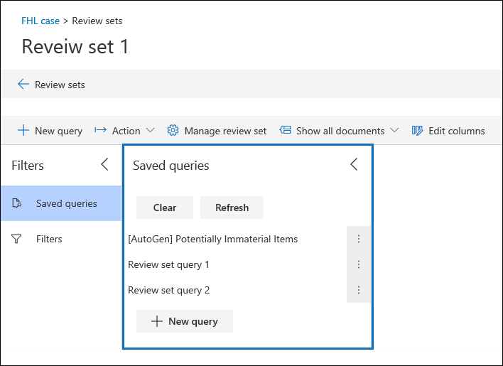
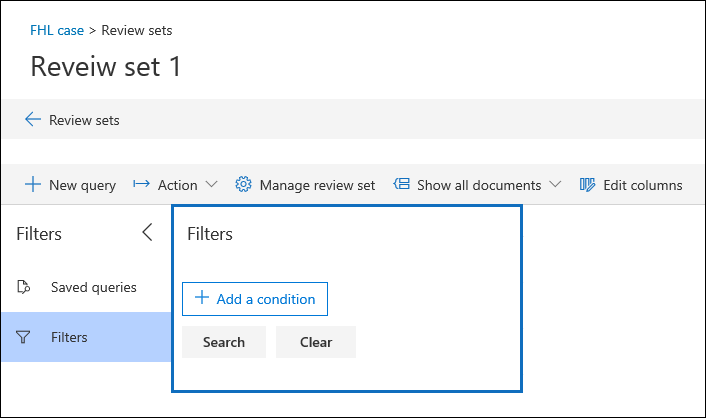

# Consultar os dados em um conjunto de revisão

Na maioria dos casos, será útil ser capaz de se aprofundar nos dados de um conjunto de análise e organizar esses dados para facilitar uma análise mais eficiente. Usar consultas em um conjunto de revisão ajuda você a se concentrar em um subconjunto de documentos que atendem aos critérios de sua análise.

## Criando e executando uma consulta em um conjunto de revisão

Para criar e executar uma consulta nos documentos em um conjunto de revisão, clique em **nova consulta** no conjunto de revisão. Depois de nomear sua consulta e definir as condições, clique em **salvar** para salvar e executar a consulta. Para executar uma consulta que tenha sido salva anteriormente, clique em uma consulta salva.

## Criar uma consulta de conjunto de revisão

Você pode criar uma consulta usando uma combinação de cartões de condição e linguagem de consulta no cartão de condição de palavras-chave. Você também pode agrupar cartões de condição juntos como um bloco (chamado de *grupo de condição*) para criar uma consulta mais complexa. Para obter uma lista e uma descrição das propriedades de metadados que você pode pesquisar, confira os [campos de metadados de documentos na descoberta eletrônica avançada](document-metadata-fields-in-Advanced-eDiscovery.md).

### Cartões de condição

Cada campo pesquisável em um conjunto de revisão tem um cartão de condição correspondente que você pode usar para criar sua consulta.

Há vários tipos de cartões de condição:

- FREETEXT: um cartão de condição do freetext é usado para campos de texto como o assunto. Você pode listar vários termos de pesquisa separando-os com uma vírgula.

- Date: um cartão de condição de data é usado para campos de data, como data da última modificação.

- Opções de pesquisa: um cartão de condição de opções de pesquisa fornecerá uma lista de valores possíveis para o campo específico em seu conjunto de análise. Isso é usado para campos, como remetente, onde há um número finito de valores possíveis em seu conjunto de análise.

- Palavra-chave: um cartão de condição de palavra-chave é uma instância específica do cartão de condição FREETEXT que você pode usar para pesquisar termos, ou usar o idioma de consulta do KQL como no. Veja mais detalhes abaixo.

### Linguagem de consulta

Além de cartões de condição, você pode usar um idioma de consulta do tipo KQL no cartão de palavras-chave para criar sua consulta. A linguagem de consulta para consultas de conjunto de revisão oferece suporte a operadores booleanos padrão, como **e**, **ou**, e **não**, e **Near**. Também suporta um curinga de caractere único (?) e um curinga de vários caracteres (*).

## Usando filtros

Além das consultas que podem ser salvas, você pode usar os filtros de definição de análise para aplicar rapidamente condições adicionais a uma consulta de conjunto de revisão. Isso ajuda você a refinar ainda mais os resultados exibidos por uma consulta de conjunto de revisão.

Os filtros diferem das consultas de duas maneiras significativas:

- Os filtros são transitórios. Eles não persistem além da sessão existente. Em outras palavras, não é possível salvar um filtro. As consultas são salvas no conjunto de revisão e acessadas sempre que abrir o conjunto de revisão.

- Os filtros são sempre aditivos. Os filtros são aplicados além da consulta do conjunto de análise atual. A aplicação de uma consulta diferente substituirá os resultados retornados pela consulta atual.
