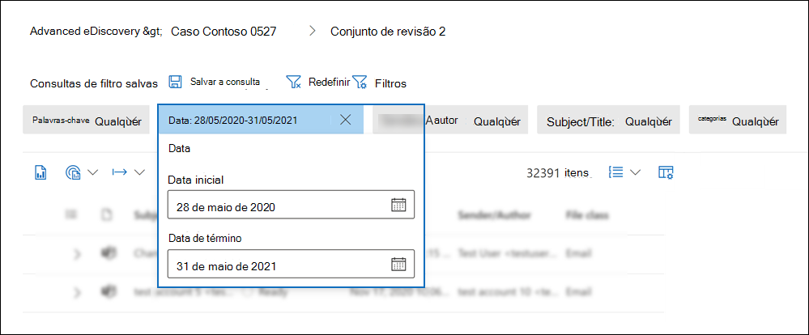
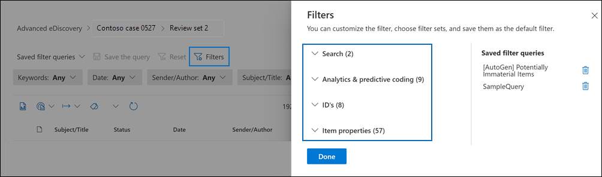
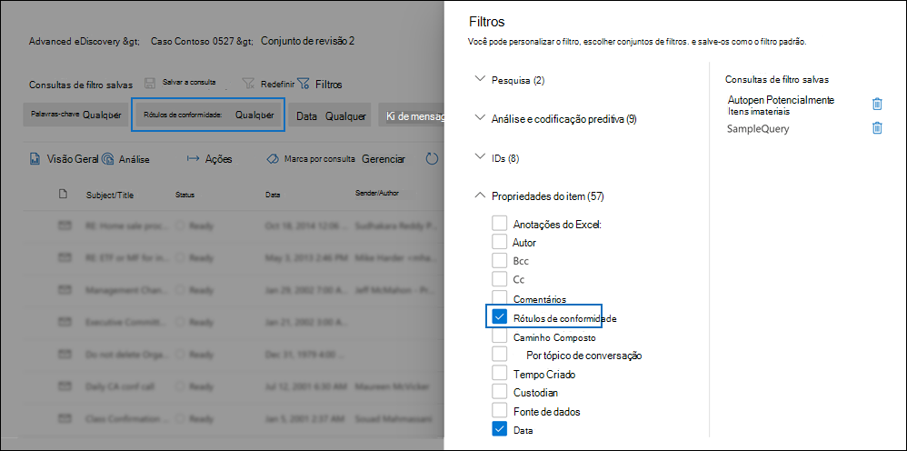
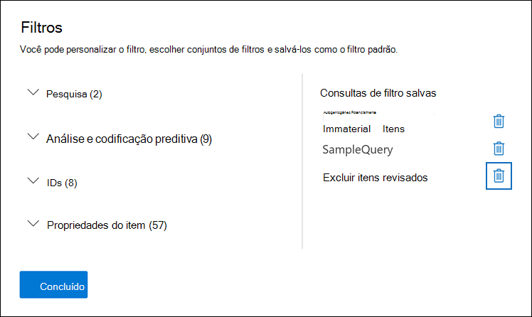
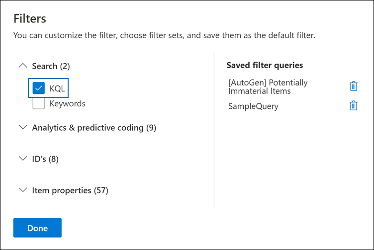
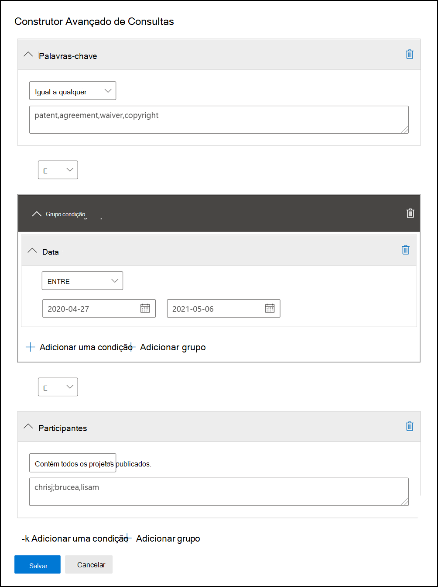

# Consultar e filtrar conteúdo em um conjunto de revisão

Na maioria dos casos, será útil aprofundar o conteúdo em um conjunto de revisão e organizá-lo para facilitar uma revisão mais eficiente. O uso de filtros e consultas em um conjunto de revisão ajuda você a se concentrar em um subconjunto de documentos que atendem aos critérios de sua revisão.

## Filtros padrão

Em um conjunto de revisão, há cinco filtros padrão que são pré-carregados no conjunto de revisão:

- Palavras-chave
- Data
- Remetente/Autor
- Assunto/Título
- Tags

Clique em cada filtro para expandi-lo e atribuir um valor. Clique fora do filtro para aplicar automaticamente o filtro ao conjunto de revisão. A captura de tela a seguir mostra o filtro Data configurado para mostrar documentos dentro de um intervalo de datas.

## Adicionar ou remover filtros

Para adicionar ou remover filtros exibidos para o conjunto de revisão, selecione **Filtros** para abrir o painel de filtro, que é exibido em uma página de sobrevoo. 

Os filtros disponíveis são organizados em quatro seções:

- **Pesquisa**: filtros que fornecem diferentes recursos de pesquisa.

- **Análise &** codificação preditiva: filtra as propriedades geradas e adicionadas aos documentos quando você executar o trabalho de análise de **email** & Documento ou usar modelos de codificação preditivos.

- **IDs**: Filtra todas as propriedades de ID de documentos.

- **Propriedades do item**: Filtra para propriedades do documento. 

Expanda cada seção e selecione ou desmarque filtros para adicioná-los ou removê-los no conjunto de filtros. Quando você adiciona um filtro, ele é exibido no conjunto de filtros. 

> [!NOTE]
> Quando você expande uma seção no painel de filtro, você notará que os tipos de filtro padrão estão selecionados. Você pode mantê-los selecionados ou desmarcados e removidos do conjunto de filtros. 

## Tipos de filtro

Cada campo pesquisável em um conjunto de revisão tem um filtro correspondente que você pode usar para filtrar itens com base em um campo específico.

Há vários tipos de filtros:

- **Freetext**: Um filtro de texto livre é aplicado a campos de texto, como "Assunto". Você pode listar vários termos de pesquisa separando-os com uma vírgula.

- **Data**: um filtro de data é usado para campos de data, como "Data da última modificação".

- **Opções de** pesquisa : Um filtro de opções de pesquisa fornece uma lista de valores possíveis (cada valor é exibido com uma caixa de seleção que você pode selecionar) para campos específicos na revisão. Esse filtro é usado para campos, como "Remetente", onde há um número finito de valores possíveis no conjunto de revisão.

- **Palavra-chave**: uma condição de palavra-chave é uma instância específica de condição de texto livre que você pode usar para pesquisar termos. Você também pode usar linguagem de consulta do tipo KQL neste tipo de filtro. Para obter mais informações, consulte as seções Idioma de consulta e Construtor avançado de consultas neste tópico.

## Incluir e excluir relações de filtro

Você tem a opção de alterar a relação incluir e excluir para um filtro específico. Por exemplo, no filtro Tag, você pode excluir itens **marcados** com uma marca específica selecionando Igual a nenhum no filtro suspenso. 

## Salvar filtros como consultas

Depois de satisfeito com seus filtros, você pode salvar a combinação de filtro como uma consulta de filtro. Isso permite aplicar o filtro nas próximas sessões de revisão.

Para salvar um filtro, selecione **Salvar a consulta e** nomeá-la. Você ou outros revisadores podem executar consultas de filtro salvas anteriormente selecionando o **menu** suspenso Consultas de filtro salvo e selecionando uma consulta de filtro a ser aplicada aos documentos do conjunto de revisão. 

Para excluir uma consulta de filtro, abra o painel de filtro e selecione o ícone de lixeira ao lado da consulta.

## Linguagem de consulta

Além de usar filtros, você também pode usar um idioma de consulta parecido com KQL no filtro Palavras-chave para criar sua consulta de pesquisa de conjunto de revisão. O idioma de consulta para consultas de conjunto de revisão dá suporte a operadores booleano padrão, como **AND**, **OR**, **NOT** e **NEAR**. Ele também dá suporte a um caractere curinga de caractere único (?) e a um caractere curinga de vários caracteres (*).

## Construtor avançado de consultas

Você também pode criar consultas mais avançadas para pesquisar documentos em um conjunto de revisão.

1. Abra o painel de filtro, selecione **Filtros** e expanda a **seção** Pesquisa.

  

2. Selecione o **filtro KQL** e clique em **Abrir construtor de consultas**.

   Neste painel, você pode criar consultas KQL complexas usando o construtor de consultas. Você pode adicionar condições ou adicionar grupos de condição que são feitos de várias condições que são conectadas logicamente por **relações AND** **ou OR.**

   
