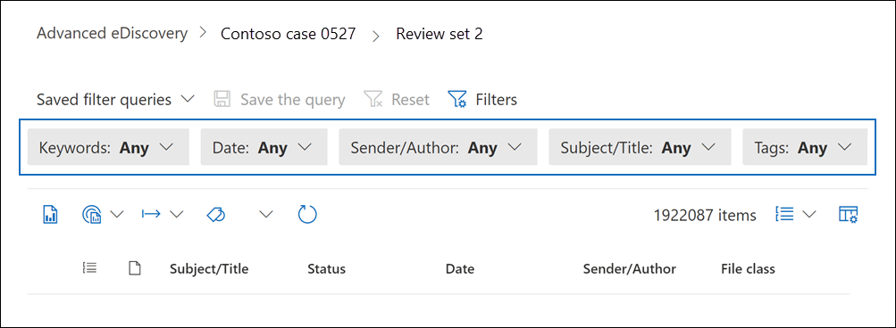

# Consultar e filtrar conteúdo em um conjunto de revisãoQuery and filter content in a review set

Na maioria dos casos, será útil aprofundar o conteúdo em um conjunto de revisão e organizá-lo para facilitar uma revisão mais eficiente.In most cases, it will be useful to dig deeper into the content in a review set and organize it to facilitate a more efficient review. O uso de filtros e consultas em um conjunto de revisão ajuda você a se concentrar em um subconjunto de documentos que atendem aos critérios de sua revisão.Using filters and queries in a review set helps you focus on a subset of documents that meet the criteria of your review.

## Filtros padrãoDefault filters

Em um conjunto de revisão, há cinco filtros padrão que são pré-carregados no conjunto de revisão:In a review set, there are five default filters that are pre-loaded in the review set:

- Palavras-chaveKeywords
- DataDate
- Remetente/AutorSender/Author
- Assunto/TítuloSubject/Title
- TagsTags

Clique em cada filtro para expandi-lo e atribuir um valor.Click each filter to expand it and assign a value. Clique fora do filtro para aplicar automaticamente o filtro ao conjunto de revisão.Click outside the filter to automatically apply the filter to the review set. A captura de tela a seguir mostra o filtro Data configurado para mostrar documentos dentro de um intervalo de datas.The following screenshot shows the Date filter configured to show documents within a date range.

## Adicionar ou remover filtrosAdd or remove filters

Para adicionar ou remover filtros exibidos para o conjunto de revisão, selecione **Filtros** para abrir o painel de filtro, que é exibido em uma página de sobrevoo.To add or remove filters that are displayed for the review set, select **Filters** to open the filter panel, which is displayed on a flyout page. 

Os filtros disponíveis são organizados em quatro seções:The available filters are organized in four sections:

- **Pesquisa**: filtros que fornecem diferentes recursos de pesquisa.**Search**: Filters that provide different search capabilities.

- **Análise &** codificação preditiva: filtra as propriedades geradas e adicionadas aos documentos quando você executar o trabalho de análise de **email** & Documento ou usar modelos de codificação preditivos.**Analytics & predictive coding**: Filters for properties generated and added to documents when you run the **Document & email analytic** job or use predictive coding models.

- **IDs**: Filtra todas as propriedades de ID de documentos.**IDs**: Filters for all ID properties of documents.

- **Propriedades do item**: Filtra para propriedades do documento.**Item properties**: Filters for document properties. 

Expanda cada seção e selecione ou desmarque filtros para adicioná-los ou removê-los no conjunto de filtros.Expand each section and select or deselect filters to add or remove them in the filter set. Quando você adiciona um filtro, ele é exibido no conjunto de filtros.When you add a filter, it's displayed in the filter set. 

> [!NOTE]
> Quando você expande uma seção no painel de filtro, você notará que os tipos de filtro padrão estão selecionados.When you expand a section in the filter panel, you'll notice that the default filter types are selected. Você pode mantê-los selecionados ou desmarcados e removidos do conjunto de filtros.You can keep these selected or deselect them and removed them from the filter set. 

## Tipos de filtroFilter types

Cada campo pesquisável em um conjunto de revisão tem um filtro correspondente que você pode usar para filtrar itens com base em um campo específico.Every searchable field in a review set has a corresponding filter that you can use for filter items based on a specific field.

Há vários tipos de filtros:There are multiple types of filters:

- **Freetext**: Um filtro de texto livre é aplicado a campos de texto, como "Assunto".**Freetext**: A freetext filter is applied to text fields such as "Subject". Você pode listar vários termos de pesquisa separando-os com uma vírgula.You can list multiple search terms by separating them with a comma.

- **Data**: um filtro de data é usado para campos de data, como "Data da última modificação".**Date**: A date filter is used for date fields such as "Last modified date".

- **Opções de** pesquisa : Um filtro de opções de pesquisa fornece uma lista de valores possíveis (cada valor é exibido com uma caixa de seleção que você pode selecionar) para campos específicos na revisão.**Search options**: A search options filter provides a list of possible values (each value is displayed with a checkbox that you can select) for particular fields in the review. Esse filtro é usado para campos, como "Remetente", onde há um número finito de valores possíveis no conjunto de revisão.This filter is used for fields, such as "Sender", where there is a finite number of possible values in the review set.

- **Palavra-chave**: uma condição de palavra-chave é uma instância específica de condição de texto livre que você pode usar para pesquisar termos.**Keyword**: A keyword condition is a specific instance of freetext condition that you can use to search for terms. Você também pode usar linguagem de consulta do tipo KQL neste tipo de filtro.You can also use KQL-like query language in this type of filter. Para obter mais informações, consulte as seções Idioma de consulta e Construtor avançado de consultas neste tópico.For more information, see the Query language and Advanced query builder sections in this topic.

## Incluir e excluir relações de filtroInclude and exclude filter relationships

Você tem a opção de alterar a relação incluir e excluir para um filtro específico.You have the option to change the include and exclude relationship for a particular filter. Por exemplo, no filtro Tag, você pode excluir itens **marcados** com uma marca específica selecionando Igual a nenhum no filtro suspenso.For example, in the Tag filter, you can exclude items that are tagged with a particular tag by selecting **Equals none of** in the dropdown filter. 

## Salvar filtros como consultasSave filters as queries

Depois de satisfeito com seus filtros, você pode salvar a combinação de filtro como uma consulta de filtro.After you are satisfied with your filters, you can save the filter combination as a filter query. Isso permite aplicar o filtro nas próximas sessões de revisão.This lets you apply the filter in the future review sessions.

Para salvar um filtro, selecione **Salvar a consulta e** nomeá-la.To save a filter, select **Save the query** and name it. Você ou outros revisadores podem executar consultas de filtro salvas anteriormente selecionando o **menu** suspenso Consultas de filtro salvo e selecionando uma consulta de filtro a ser aplicada aos documentos do conjunto de revisão.You or other reviewers can run previously saved filter queries by selecting the **Saved filter queries** dropdown and selecting a filter query to apply to review set documents. 

Para excluir uma consulta de filtro, abra o painel de filtro e selecione o ícone de lixeira ao lado da consulta.To delete a filter query, open the filter panel and select the trashcan icon next to the query.

## Linguagem de consultaQuery language

Além de usar filtros, você também pode usar um idioma de consulta parecido com KQL no filtro Palavras-chave para criar sua consulta de pesquisa de conjunto de revisão.In addition to using filters, you can also use a KQL-like query language in the Keywords filter to build your review set search query. O idioma de consulta para consultas de conjunto de revisão dá suporte a operadores booleano padrão, como **AND**, **OR**, **NOT** e **NEAR**.The query language for review set queries supports standard Boolean operators, such as **AND**, **OR**, **NOT**, and **NEAR**. Ele também dá suporte a um caractere curinga de caractere único (?) e a um caractere curinga de vários caracteres (\*).It also supports a single-character wildcard (?) and a multi-character wildcard (\*).

## Construtor avançado de consultasAdvanced query builder

Você também pode criar consultas mais avançadas para pesquisar documentos em um conjunto de revisão.You can also build more advanced queries to search for documents in a review set.

1. Abra o painel de filtro, selecione **Filtros** e expanda a **seção** Pesquisa.Open the filter panel, select **Filters**, and expand the **Search** section.

  

2. Selecione o **filtro KQL** e clique em **Abrir construtor de consultas**.Select the **KQL** filter and click **Open query builder**.

   Neste painel, você pode criar consultas KQL complexas usando o construtor de consultas.In this panel, you can create complex KQL queries by using the query builder. Você pode adicionar condições ou adicionar grupos de condição que são feitos de várias condições que são conectadas logicamente por **relações AND** **ou OR.**You can add conditions or add condition groups that are made up of multiple conditions that are logically connected by **AND** or **OR** relationships.

   
