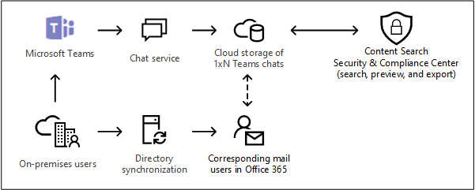

# <a name="searching-cloud-based-mailboxes-for-on-premises-users"></a><span data-ttu-id="2f5a3-103">Pesquisar caixas de correio baseadas em nuvem para usuários locais </span><span class="sxs-lookup"><span data-stu-id="2f5a3-103">Searching cloud-based mailboxes for on-premises users</span></span>

<span data-ttu-id="2f5a3-104">Se a sua organização tiver uma implantação híbrida do Exchange (ou se a sua organização sincronizar uma organização do Exchange local com o Office 365) e tiver habilitado o Microsoft Teams, os usuários poderão usar o aplicativo de chat do Teams para mensagens instantâneas.</span><span class="sxs-lookup"><span data-stu-id="2f5a3-104">If your organization has an Exchange hybrid deployment (or your organization synchronizes an on-premises Exchange organization with Office 365) and has enabled Microsoft Teams, users can use the Teams chat application for instant messaging.</span></span> <span data-ttu-id="2f5a3-105">Para um usuário baseado em nuvem, os dados de chat do Teams (também chamados de *chats 1xN*) são salvos em suas caixas de correio principais baseadas na nuvem.</span><span class="sxs-lookup"><span data-stu-id="2f5a3-105">For a cloud-based user, the Teams chat data (also called *1xN chats*) is saved to their primary cloud-based mailbox.</span></span> <span data-ttu-id="2f5a3-106">Quando um usuário local usa o aplicativo de chat do Teams, sua caixa de correio principal está localizada no local.</span><span class="sxs-lookup"><span data-stu-id="2f5a3-106">When an on-premises user uses the Team chat application, their primary mailbox is located on-premises.</span></span> <span data-ttu-id="2f5a3-107">Para contornar essa limitação, a Microsoft lançou um novo recurso em que uma área de armazenamento baseada na nuvem (chamada de caixa de correio baseada em nuvem para usuários locais) é criada para armazenar os dados de chat do Teams para usuários locais.</span><span class="sxs-lookup"><span data-stu-id="2f5a3-107">To get around this limitation, Microsoft has released a new feature where a cloud-based storage area (called a cloud-based mailbox for on-premises users) is created to store Teams chat data for on-premises users.</span></span> <span data-ttu-id="2f5a3-108">Isso permite que você use a ferramenta de pesquisa de conteúdo no Centro de Conformidade e Segurança para pesquisar e exportar dados de chat do Teams para usuários locais.</span><span class="sxs-lookup"><span data-stu-id="2f5a3-108">This lets you use the Content Search tool in the Security & Compliance Center to search and export Teams chat data for on-premises users.</span></span> 
  
<span data-ttu-id="2f5a3-109">Estes são os requisitos e limitações para a configuração de caixas de correio baseadas em nuvem para usuários locais:</span><span class="sxs-lookup"><span data-stu-id="2f5a3-109">Here are the requirements and limitations for setting up cloud-based mailboxes for on-premises users:</span></span>
  
- <span data-ttu-id="2f5a3-110">As contas de usuário no serviço de diretório local (por exemplo, o Active Directory) devem ser sincronizadas com o Azure Active Directory, o serviço de diretório do Microsoft 365.</span><span class="sxs-lookup"><span data-stu-id="2f5a3-110">The user accounts in your on-premises directory service (such as Active Directory) must be synchronized with Azure Active Directory, the directory service in Microsoft 365.</span></span> <span data-ttu-id="2f5a3-111">Isso significa que uma conta de usuário de email é criada no Microsoft 365 e está associada a um usuário cuja caixa de correio principal está localizada na organização local.</span><span class="sxs-lookup"><span data-stu-id="2f5a3-111">This means that a mail user account is created in Microsoft 365 and is associated with a user whose primary mailbox is located in the on-premises organization.</span></span>

- <span data-ttu-id="2f5a3-112">O usuário cuja caixa de correio principal está localizada na organização local deve receber uma licença do Microsoft Teams e, no mínimo, uma licença do Exchange Online Plan 1.</span><span class="sxs-lookup"><span data-stu-id="2f5a3-112">The user whose primary mailbox is located in the on-premises organization must be assigned a Microsoft Teams license and a minimum of an Exchange Online Plan 1 license.</span></span>

- <span data-ttu-id="2f5a3-113">A caixa de correio baseada em nuvem para usuários locais é usada apenas para armazenar dados de chat do Teams.</span><span class="sxs-lookup"><span data-stu-id="2f5a3-113">The cloud-based mailbox for on-premises users is used only store Teams chat data.</span></span> <span data-ttu-id="2f5a3-114">Um usuário local não pode entrar na caixa de correio baseada na nuvem ou acessar de forma alguma.</span><span class="sxs-lookup"><span data-stu-id="2f5a3-114">An on-premises user can't sign in to the cloud-based mailbox or access in any way.</span></span> <span data-ttu-id="2f5a3-115">Ela não pode ser usada para enviar ou receber mensagens de e-mail.</span><span class="sxs-lookup"><span data-stu-id="2f5a3-115">It can't be used to send or receive email messages.</span></span> 

- <span data-ttu-id="2f5a3-116">Você deve enviar uma solicitação para o suporte da Microsoft para permitir que sua organização pesquise dados de chat do Teams nas caixas de correio baseadas em nuvem para usuários locais.</span><span class="sxs-lookup"><span data-stu-id="2f5a3-116">You have to submit a request to Microsoft Support to enable your organization to search for Teams chat data in the cloud-based mailboxes for on-premises users.</span></span> <span data-ttu-id="2f5a3-117">Confira [Arquivando uma solicitação com o suporte da Microsoft para habilitar esse recurso](#filing-a-request-with-microsoft-support-to-enable-this-feature) neste artigo.</span><span class="sxs-lookup"><span data-stu-id="2f5a3-117">See [Filing a request with Microsoft Support to enable this feature](#filing-a-request-with-microsoft-support-to-enable-this-feature) in this article.</span></span> 

> [!NOTE]
> <span data-ttu-id="2f5a3-118">As conversas em canais do Teams sempre são armazenadas na caixa de correio baseada em nuvem associada à equipe.</span><span class="sxs-lookup"><span data-stu-id="2f5a3-118">Teams channel conversations are always stored in the cloud-based mailbox that's associated with the Team.</span></span> <span data-ttu-id="2f5a3-119">Isso significa que você pode usar a Pesquisa de Conteúdo para pesquisar conversas de canal sem ter que registrar uma solicitação de suporte.</span><span class="sxs-lookup"><span data-stu-id="2f5a3-119">That means you can use Content Search to search channel conversations without have to file a support request.</span></span> <span data-ttu-id="2f5a3-120">Para obter mais informações sobre como Pesquisar conversas de canal do Teams, confira [Pesquisar no Microsoft Teams e Grupos do Microsoft 365 ](content-search.md#searching-microsoft-teams-and-microsoft-365-groups).</span><span class="sxs-lookup"><span data-stu-id="2f5a3-120">For more information about searching Teams channel conversations, see [Searching Microsoft Teams and Microsoft 365 Groups](content-search.md#searching-microsoft-teams-and-microsoft-365-groups).</span></span>
  
## <a name="how-it-works"></a><span data-ttu-id="2f5a3-121">Como funciona</span><span class="sxs-lookup"><span data-stu-id="2f5a3-121">How it works</span></span>

<span data-ttu-id="2f5a3-122">Se um usuário habilitado do Microsoft Teams tiver uma caixa de correio local e a respectiva conta de usuário/identidade tiver sido sincronizada com a nuvem, a Microsoft criará uma caixa de correio baseada em nuvem para armazenar dados de chat 1xN do Teams.</span><span class="sxs-lookup"><span data-stu-id="2f5a3-122">If a Microsoft Teams-enabled user has an on-premises mailbox and their user account/identity has been synched to the cloud, Microsoft creates a cloud-based mailbox to store 1xN Teams chat data.</span></span> <span data-ttu-id="2f5a3-123">Depois que os dados de chat do Teams são armazenados na caixa de correio baseada em nuvem, eles são indexados para pesquisa.</span><span class="sxs-lookup"><span data-stu-id="2f5a3-123">After the Teams chat data is stored in the cloud-based mailbox, it's indexed for search.</span></span> <span data-ttu-id="2f5a3-124">Isso permite que você use a Pesquisa de Conteúdo (e as pesquisas associadas a casos de Descoberta Eletrônica) para pesquisar, visualizar e exportar dados de chat do Teams para usuários locais.</span><span class="sxs-lookup"><span data-stu-id="2f5a3-124">This lets you Use Content Search (and searches associated with eDiscovery cases) to search, preview, and export Teams chat data for on-premises users.</span></span> <span data-ttu-id="2f5a3-125">Você também pode usar os cmdlets do **\*ComplianceSearch** no PowerShell do Centro de Conformidade e Segurança para procurar dados de bate-papo de equipes para usuários locais.</span><span class="sxs-lookup"><span data-stu-id="2f5a3-125">You can also use **\*ComplianceSearch** cmdlets in the Security & Compliance Center PowerShell to search for Teams chat data for on-premises users.</span></span> 
  
<span data-ttu-id="2f5a3-126">O gráfico a seguir mostra o fluxo de trabalho de como os dados de chat do Teams para usuários locais estão disponíveis para pesquisa, visualização e exportação.</span><span class="sxs-lookup"><span data-stu-id="2f5a3-126">The following graphic shows the workflow of how Teams chat data for on-premises users is available to search, preview, and export.</span></span>
  

  
<span data-ttu-id="2f5a3-128">Além desse novo recurso, você ainda poderá usar a Pesquisa de Conteúdo para pesquisar, visualizar e exportar conteúdo do Teams no site do SharePoint baseado na nuvem e na caixa de correio do Exchange associada a cada dado de chat do Microsoft Teams e 1xN Teams na caixa de correio do Exchange Online para usuários baseados em nuvem.</span><span class="sxs-lookup"><span data-stu-id="2f5a3-128">In addition to this new capability, you can still use Content Search to search, preview, and export Teams content in the cloud-based SharePoint site and Exchange mailbox associated with each Microsoft Team and 1xN Teams chat data in the Exchange Online mailbox for cloud-based users.</span></span>

## <a name="filing-a-request-with-microsoft-support-to-enable-this-feature"></a><span data-ttu-id="2f5a3-129">Registrando uma solicitação com o suporte da Microsoft para habilitar esse recurso</span><span class="sxs-lookup"><span data-stu-id="2f5a3-129">Filing a request with Microsoft Support to enable this feature</span></span>

<span data-ttu-id="2f5a3-130">Você deve registrar uma solicitação com o suporte da Microsoft para permitir que a sua organização use a interface gráfica do usuário no Centro de Conformidade e Segurança para pesquisar os dados de chat do Teams as caixas de correio baseadas em nuvem para usuários locais.</span><span class="sxs-lookup"><span data-stu-id="2f5a3-130">You must file a request with Microsoft Support to enable your organization to use the graphical user interface in the Security & Compliance Center to search for Teams chat data in the cloud-based mailboxes for on-premises users.</span></span> <span data-ttu-id="2f5a3-131">Esse recurso está disponível no PowerShell do Centro de Conformidade e Segurança.</span><span class="sxs-lookup"><span data-stu-id="2f5a3-131">This feature is available in Security & Compliance Center PowerShell.</span></span> <span data-ttu-id="2f5a3-132">Você não precisa enviar uma solicitação de suporte para usar o PowerShell para pesquisar os dados de chat do Teams para usuários locais.</span><span class="sxs-lookup"><span data-stu-id="2f5a3-132">You don't have to submit a support request to use PowerShell to search for Teams chat data for on-premises users.</span></span>
  
<span data-ttu-id="2f5a3-133">Inclua as seguintes informações ao enviar a solicitação para o suporte da Microsoft:</span><span class="sxs-lookup"><span data-stu-id="2f5a3-133">Include the following information when you submit the request to Microsoft Support:</span></span>
  
- <span data-ttu-id="2f5a3-134">O nome de domínio padrão da sua organização.</span><span class="sxs-lookup"><span data-stu-id="2f5a3-134">The default domain name of your organization.</span></span>

- <span data-ttu-id="2f5a3-135">O nome do locatário e o ID do locatário da sua organização.</span><span class="sxs-lookup"><span data-stu-id="2f5a3-135">The tenant name and tenant ID of your organization.</span></span> <span data-ttu-id="2f5a3-136">Você pode encontrá-los no portal do Azure Active Directory (em **Gerenciar** \> **Propriedades**).</span><span class="sxs-lookup"><span data-stu-id="2f5a3-136">You can find these in the Azure Active Directory portal (under **Manage** \> **Properties**).</span></span> <span data-ttu-id="2f5a3-137">Confira [Localizar sua ID de locatário do Microsoft 365](https://docs.microsoft.com/onedrive/find-your-office-365-tenant-id).</span><span class="sxs-lookup"><span data-stu-id="2f5a3-137">See [Find your Microsoft 365 tenant ID](https://docs.microsoft.com/onedrive/find-your-office-365-tenant-id).</span></span>

- <span data-ttu-id="2f5a3-138">O seguinte título ou a descrição de finalidade da solicitação de suporte: "Habilitar a pesquisa de conteúdo do aplicativo para usuários locais".</span><span class="sxs-lookup"><span data-stu-id="2f5a3-138">The following title or description of the purpose of the support request: "Enable Application Content Search for On-premises Users".</span></span> <span data-ttu-id="2f5a3-139">Isso ajuda a rotear a solicitação para a equipe de engenharia de Descoberta eletrônica, o qual implementará a solicitação.</span><span class="sxs-lookup"><span data-stu-id="2f5a3-139">This helps route the request to the eDiscovery engineering team who will implement the request.</span></span>

<span data-ttu-id="2f5a3-140">Após a mudança de engenharia, o suporte da Microsoft enviará a você uma data estimada da implantação.</span><span class="sxs-lookup"><span data-stu-id="2f5a3-140">After the engineering change is made, Microsoft Support will send you an estimated deployment date.</span></span> <span data-ttu-id="2f5a3-141">O processo de implantação geralmente demora de duas a três semanas após o envio da solicitação de suporte.</span><span class="sxs-lookup"><span data-stu-id="2f5a3-141">The deployment process usually takes 2–3 weeks after you submit the support request.</span></span>
  
### <a name="what-happens-after-this-feature-is-enabled"></a><span data-ttu-id="2f5a3-142">O que acontece após esse recurso ser habilitado?</span><span class="sxs-lookup"><span data-stu-id="2f5a3-142">What happens after this feature is enabled?</span></span>

<span data-ttu-id="2f5a3-143">Após a implantação desse recurso na sua organização, as seguintes alterações são feitas na Pesquisa de Conteúdo e em pesquisas associadas a um caso de Descoberta eletrônica no Centro de Conformidade e Segurança:</span><span class="sxs-lookup"><span data-stu-id="2f5a3-143">After this feature is deployed in your organization, the following changes are made in Content Search and in searches associated with an eDiscovery case in the Security & Compliance Center:</span></span>
  
- <span data-ttu-id="2f5a3-144">A caixa de seleção**Adicionar o conteúdo do aplicativo do Office para usuários no local** é adicionada em **Locais** na Pesquisa de Conteúdo.</span><span class="sxs-lookup"><span data-stu-id="2f5a3-144">The **Add Office app content for on-premises users** checkbox is added under the **Locations** in Content Search.</span></span>

    
  
- <span data-ttu-id="2f5a3-146">Os usuários locais são exibidos no seletor de locais de conteúdo que você usa para selecionar as caixas de correio dos usuários.</span><span class="sxs-lookup"><span data-stu-id="2f5a3-146">On-premises users are displayed in the content locations picker that you use to select user mailboxes to search.</span></span>

## <a name="searching-for-teams-chat-content-in-cloud-based-mailboxes-for-on-premises-users"></a><span data-ttu-id="2f5a3-147">Pesquisando o conteúdo do chat do Teams nas caixas de correio baseadas em nuvem para usuários locais</span><span class="sxs-lookup"><span data-stu-id="2f5a3-147">Searching for Teams chat content in cloud-based mailboxes for on-premises users</span></span>

<span data-ttu-id="2f5a3-148">Após habilitar o recurso, você poderá usar a pesquisa de conteúdo no Centro de Conformidade e Segurança para pesquisar os dados de chat do Teams nas caixas de correio baseadas em nuvem para usuários locais.</span><span class="sxs-lookup"><span data-stu-id="2f5a3-148">After the feature has been enabled, you can use Content Search in the Security & Compliance Center to search for Teams chat data in the cloud-based mailboxes for on-premises users.</span></span>
  
1. <span data-ttu-id="2f5a3-149">No Centro de Conformidade e Segurança, acesse **Pesquisar** \> **Pesquisa de Conteúdo**</span><span class="sxs-lookup"><span data-stu-id="2f5a3-149">In the Security & Compliance Center, go to **Search** \> **Content search**</span></span>

2. <span data-ttu-id="2f5a3-150">Na página **Pesquisar**, clique em  **Nova pesquisa**.</span><span class="sxs-lookup"><span data-stu-id="2f5a3-150">On the **Search** page, click  **New search**.</span></span>

    <span data-ttu-id="2f5a3-151">Como explicado anteriormente, a caixa de seleção **Adicionar o conteúdo do aplicativo do Office para usuários locais** é exibida em **Locais**.</span><span class="sxs-lookup"><span data-stu-id="2f5a3-151">As previously explained, the **Add Office app content for on-premises users** checkbox is displayed under **Locations**.</span></span> <span data-ttu-id="2f5a3-152">Ela é selecionada por padrão.</span><span class="sxs-lookup"><span data-stu-id="2f5a3-152">It's selected by default.</span></span>

3. <span data-ttu-id="2f5a3-153">Crie uma consulta de palavra-chave e adicione condições à consulta de pesquisa, se necessário.</span><span class="sxs-lookup"><span data-stu-id="2f5a3-153">Create the keyword query and add conditions to the search query if necessary.</span></span> <span data-ttu-id="2f5a3-154">Para pesquisar apenas dados de chat da equipe, você pode adicionar a seguinte consulta na caixa **Palavras-chave**:</span><span class="sxs-lookup"><span data-stu-id="2f5a3-154">To only search for Team chats data, you can add the following query in the **Keywords** box:</span></span>

    ```text
    kind:im
    ```

4. <span data-ttu-id="2f5a3-155">Neste ponto, você pode escolher uma das seguintes opções em **Locais**:</span><span class="sxs-lookup"><span data-stu-id="2f5a3-155">At this point, you can choose one of the following options under **Locations**:</span></span>

    - <span data-ttu-id="2f5a3-156">**Todos os locais:** Selecione essa opção para pesquisar nas caixas de correio de todos os usuários em sua organização.</span><span class="sxs-lookup"><span data-stu-id="2f5a3-156">**All locations:** Select this option to search the mailboxes of all users in your organization.</span></span> <span data-ttu-id="2f5a3-157">Quando a caixa de seleção estiver marcada, todas as caixas de correio baseadas em nuvem para usuários locais também serão pesquisadas.</span><span class="sxs-lookup"><span data-stu-id="2f5a3-157">When the checkbox is selected, all cloud-based mailboxes for on-premises users will also be searched.</span></span>

    - <span data-ttu-id="2f5a3-158">**Locais específicos:** Selecione essa opção e clique em **Modificar** \> Escolha usuário, grupos ou equipes para pesquisar caixas de correio específicas.</span><span class="sxs-lookup"><span data-stu-id="2f5a3-158">**Specific locations:** Select this option and then click **Modify** \> Choose user, groups, or teams to search specific mailboxes.</span></span> <span data-ttu-id="2f5a3-159">Como explicado anteriormente, o seletor de local permite pesquisar usuários locais.</span><span class="sxs-lookup"><span data-stu-id="2f5a3-159">As previously explained, the locations picker lets you search for on-premises users.</span></span>

5. <span data-ttu-id="2f5a3-160">Salve e execute a pesquisa.</span><span class="sxs-lookup"><span data-stu-id="2f5a3-160">Save and run the search.</span></span> <span data-ttu-id="2f5a3-161">Os resultados da pesquisa de caixas de correio baseadas em nuvem para usuários locais podem ser visualizados como qualquer outro resultado da pesquisa.</span><span class="sxs-lookup"><span data-stu-id="2f5a3-161">Any search results from the cloud-based mailboxes for on-premises users can be previewed like any other search results.</span></span> <span data-ttu-id="2f5a3-162">Você também pode exportar os resultados da pesquisa (inclusive dados de chat do Teams) para um arquivo PST.</span><span class="sxs-lookup"><span data-stu-id="2f5a3-162">You can also export the search results (including any Teams chat data) to a PST file.</span></span> <span data-ttu-id="2f5a3-163">Para saber mais, confira:</span><span class="sxs-lookup"><span data-stu-id="2f5a3-163">For more information, see:</span></span> 

    - [<span data-ttu-id="2f5a3-164">Criar uma pesquisa</span><span class="sxs-lookup"><span data-stu-id="2f5a3-164">Create a search</span></span>](content-search.md#create-a-search)

    - [<span data-ttu-id="2f5a3-165">Visualização de resultados de pesquisa</span><span class="sxs-lookup"><span data-stu-id="2f5a3-165">Preview search results</span></span>](content-search.md#preview-search-results)

    - [<span data-ttu-id="2f5a3-166">Exportar resultados de Pesquisa de Conteúdo</span><span class="sxs-lookup"><span data-stu-id="2f5a3-166">Export Content Search results</span></span>](export-search-results.md)

## <a name="using-powershell-to-search-for-teams-chat-data-in-cloud-based-mailboxes-for-on-premises-users"></a><span data-ttu-id="2f5a3-167">Usar o PowerShell para procurar por Dados de chat do Teams em caixas de correio baseadas em nuvem para usuários locais</span><span class="sxs-lookup"><span data-stu-id="2f5a3-167">Using PowerShell to search for Teams chat data in cloud-based mailboxes for on-premises users</span></span>

<span data-ttu-id="2f5a3-168">Você pode usar os cmdlets **New-ComplianceSearch** e **Set-ComplianceSearch** no PowerShell do Centro de Conformidade e Segurança para pesquisar usuários locais na caixa de correio baseada em nuvem.</span><span class="sxs-lookup"><span data-stu-id="2f5a3-168">You can use the **New-ComplianceSearch** and **Set-ComplianceSearch** cmdlets in the Security & Compliance Center PowerShell to search the cloud-based mailbox for on-premises users.</span></span> <span data-ttu-id="2f5a3-169">Como foi explicado anteriormente, você não precisa enviar uma solicitação de suporte para usar o PowerShell para pesquisar os dados de chat do Teams para usuários locais.</span><span class="sxs-lookup"><span data-stu-id="2f5a3-169">As previously explained, you don't have to submit a support request to use PowerShell to search for Teams chat data for on-premises users.</span></span> 
  
1. <span data-ttu-id="2f5a3-170">[Conectar-se ao PowerShell do Centro de Conformidade e Segurança](https://docs.microsoft.com/powershell/exchange/office-365-scc/connect-to-scc-powershell/connect-to-scc-powershell).</span><span class="sxs-lookup"><span data-stu-id="2f5a3-170">[Connect to Security & Compliance Center PowerShell](https://docs.microsoft.com/powershell/exchange/office-365-scc/connect-to-scc-powershell/connect-to-scc-powershell).</span></span>

2. <span data-ttu-id="2f5a3-171">Execute o seguinte comando do PowerShell para criar uma Pesquisa de Conteúdo que pesquise as caixas de correio de usuários locais baseadas na nuvem.</span><span class="sxs-lookup"><span data-stu-id="2f5a3-171">Run the following PowerShell command to create a content search that searches the cloud-based mailboxes of on-premises users.</span></span>

    ```powershell
    New-ComplianceSearch <name of new search> -ContentMatchQuery <search query> -ExchangeLocation <on-premises user> -IncludeUserAppContent $true -AllowNotFoundExchangeLocationsEnabled $true  
    ```

    <span data-ttu-id="2f5a3-172">O parâmetro *IncludeUserAppContent* é usado para especificar a caixa de correio baseada em nuvem para o usuário ou os usuários especificados pelo parâmetro *ExchangeLocation*.</span><span class="sxs-lookup"><span data-stu-id="2f5a3-172">The *IncludeUserAppContent*  parameter is used to specify the cloud-based mailbox for the user or users who are specified by the  *ExchangeLocation*  parameter.</span></span> <span data-ttu-id="2f5a3-173">*AllowNotFoundExchangeLocationsEnabled* permite caixas de correio baseadas em nuvem para usuários locais.</span><span class="sxs-lookup"><span data-stu-id="2f5a3-173">The  *AllowNotFoundExchangeLocationsEnabled*  allows cloud-based mailboxes for on-premises users.</span></span> <span data-ttu-id="2f5a3-174">Quando você usa o valor `$true` para esse parâmetro, a pesquisa não tenta validar a existência da caixa de correio antes de ser executada.</span><span class="sxs-lookup"><span data-stu-id="2f5a3-174">When you use the `$true` value for this parameter, the search doesn't try to validate the existence of the mailbox before it runs.</span></span> <span data-ttu-id="2f5a3-175">Isso é necessário para pesquisar nas caixas de correio baseadas em nuvem para usuários locais porque esses tipos de caixas de correio não são resolvidas como caixas de correio normais.</span><span class="sxs-lookup"><span data-stu-id="2f5a3-175">This is required to search the cloud-based mailboxes for on-premises users because these types of mailboxes don't resolve as regular mailboxes.</span></span>

    <span data-ttu-id="2f5a3-176">O exemplo a seguir procura por diversos chats do Teams (que são mensagens instantâneas) que contenham a palavra-chave "Redstone" na caixa de correio baseada em nuvem da Sara Davis, que é um usuário local na organização da Contoso.</span><span class="sxs-lookup"><span data-stu-id="2f5a3-176">The following example searches for Teams chats (which are instant messages) that contain keyword "redstone" in the cloud-based mailbox of Sara Davis, who is an on-premises user in the Contoso organization.</span></span>
  
    ```powershell
    New-ComplianceSearch "Redstone_Search" -ContentMatchQuery "redstone AND kind:im" -ExchangeLocation sarad@contoso.com -IncludeUserAppContent $true -AllowNotFoundExchangeLocationsEnabled $true  
    ```

   <span data-ttu-id="2f5a3-177">Depois de criar uma pesquisa, certifique-se de usar o cmdlet **Start-ComplianceSearch** para executar a pesquisa.</span><span class="sxs-lookup"><span data-stu-id="2f5a3-177">After you create a search, be sure to use the **Start-ComplianceSearch** cmdlet to run the search.</span></span> 
  
<span data-ttu-id="2f5a3-178">Para mais informações sobre esses cmdlets, confira:</span><span class="sxs-lookup"><span data-stu-id="2f5a3-178">For more information using these cmdlets, see:</span></span>
  
- [<span data-ttu-id="2f5a3-179">New-ComplianceSearch</span><span class="sxs-lookup"><span data-stu-id="2f5a3-179">New-ComplianceSearch</span></span>](https://docs.microsoft.com/powershell/module/exchange/new-compliancesearch)

- [<span data-ttu-id="2f5a3-180">Set-ComplianceSearch</span><span class="sxs-lookup"><span data-stu-id="2f5a3-180">Set-ComplianceSearch</span></span>](https://docs.microsoft.com/powershell/module/exchange/set-compliancesearch)

- [<span data-ttu-id="2f5a3-181">Start-ComplianceSearch</span><span class="sxs-lookup"><span data-stu-id="2f5a3-181">Start-ComplianceSearch</span></span>](https://docs.microsoft.com/powershell/module/exchange/start-compliancesearch)

## <a name="known-issues"></a><span data-ttu-id="2f5a3-182">Problemas conhecidos</span><span class="sxs-lookup"><span data-stu-id="2f5a3-182">Known issues</span></span>

- <span data-ttu-id="2f5a3-183">Atualmente, você pode pesquisar, visualizar e exportar conteúdo nas caixas de correio baseadas em nuvem para usuários locais.</span><span class="sxs-lookup"><span data-stu-id="2f5a3-183">Currently, you can search, preview, and export content in cloud-based mailboxes for on-premises users.</span></span> <span data-ttu-id="2f5a3-184">Também é possível colocar uma caixa de correio baseada em nuvem para um usuário local em um bloqueio associado com o caso de Descoberta eletrônica e aplicar uma política de retenção para chats do Teams ou mensagens de canal para caixas de correio baseadas em nuvem para usuários locais.</span><span class="sxs-lookup"><span data-stu-id="2f5a3-184">You can also place a cloud-based mailbox for an on-premises user on a hold associated with an eDiscovery case, and apply a retention policy for Teams chats or channel messages to cloud-based mailboxes for on-premises users.</span></span> <span data-ttu-id="2f5a3-185">No entanto, no momento, você não pode aplicar uma política de retenção para outros locais de conteúdo (como as caixas de correio do Exchange e sites do SharePoint) para caixas de correio baseadas em nuvem para usuários locais.</span><span class="sxs-lookup"><span data-stu-id="2f5a3-185">However at this time, you can't apply a retention policy for other content locations (such as Exchange mailboxes and SharePoint sites) to cloud-based mailboxes for on-premises users.</span></span>

## <a name="frequently-asked-questions"></a><span data-ttu-id="2f5a3-186">Perguntas frequentes</span><span class="sxs-lookup"><span data-stu-id="2f5a3-186">Frequently asked questions</span></span>

 <span data-ttu-id="2f5a3-187">**Onde são as caixas de correio baseadas em nuvem para usuários locais?**</span><span class="sxs-lookup"><span data-stu-id="2f5a3-187">**Where are cloud-based mailboxes for on-premises users located?**</span></span>
  
<span data-ttu-id="2f5a3-188">As caixas de correio baseadas em nuvem são criadas e armazenadas no mesmo Data Center da sua organização.</span><span class="sxs-lookup"><span data-stu-id="2f5a3-188">Cloud-based mailboxes are created and stored in the same datacenter as your organization.</span></span>
  
 <span data-ttu-id="2f5a3-189">**Há outros requisitos além de enviar uma solicitação de suporte?**</span><span class="sxs-lookup"><span data-stu-id="2f5a3-189">**Are there any other requirements other than submitting a support request?**</span></span>
  
 <span data-ttu-id="2f5a3-190">Como explicado anteriormente, as identidades dos usuários com caixas de correio locais devem ser sincronizadas com a sua organização baseada em nuvem para que uma conta de usuário de e-mail correspondente seja criada para cada conta de usuário local no Office 365.</span><span class="sxs-lookup"><span data-stu-id="2f5a3-190">As previously explained, the identities of users with on-prem mailboxes must be synchronized to your cloud-based organization so that a corresponding mail user account is created for each on-premises user account in Office 365.</span></span> <span data-ttu-id="2f5a3-191">Sua organização também deve ter uma assinatura do Office 365 Enterprise, assim como uma assinatura do Office 365 Enterprise E1, E3 ou e5.</span><span class="sxs-lookup"><span data-stu-id="2f5a3-191">Your organization must also have an Office 365 enterprise subscription, such as an Office 365 Enterprise E1, E3, or E5 subscription.</span></span>
  
 <span data-ttu-id="2f5a3-192">**Há o risco de perder os dados de chat do Teams se a caixa de correio local do usuário for migrada para a nuvem?**</span><span class="sxs-lookup"><span data-stu-id="2f5a3-192">**Is there a risk of losing the Teams chat data if the user's on-premises mailbox is migrated to the cloud?**</span></span>
  
<span data-ttu-id="2f5a3-193">Não.</span><span class="sxs-lookup"><span data-stu-id="2f5a3-193">No.</span></span> <span data-ttu-id="2f5a3-194">Quando você migrar a caixa de correio principal de um usuário local para a nuvem, os dados de chat do Teams serão migrados para a sua nova caixa de correio primária baseada na nuvem.</span><span class="sxs-lookup"><span data-stu-id="2f5a3-194">When you migrate the primary mailbox of an on-premises user to the cloud, the Teams chat data for that user will be migrated to their new cloud-based primary mailbox.</span></span>
  
 <span data-ttu-id="2f5a3-195">**Posso aplicar um bloqueio de Descoberta eletrônica ou políticas de retenção para usuários locais?**</span><span class="sxs-lookup"><span data-stu-id="2f5a3-195">**Can I apply an eDiscovery hold or retention policies to on-premises users?**</span></span>
  
<span data-ttu-id="2f5a3-196">Sim.</span><span class="sxs-lookup"><span data-stu-id="2f5a3-196">Yes.</span></span> <span data-ttu-id="2f5a3-197">Você pode aplicar bloqueios de Descoberta eletrônica ou políticas de retenção para chats do Teams e mensagens de canal para caixas de correio baseadas em nuvem para usuários locais.</span><span class="sxs-lookup"><span data-stu-id="2f5a3-197">You can apply eDiscovery holds or retention policies for Teams chats and channel messages to cloud-based mailboxes for on-premises users.</span></span>
  
 <span data-ttu-id="2f5a3-198">**A Pesquisa de Conteúdo pode encontrar conversas mais antigas para usuários locais antes do momento em que a minha organização enviou a solicitação para habilitar esse recurso?**</span><span class="sxs-lookup"><span data-stu-id="2f5a3-198">**Can Content Search find older Teams chats for on-premises users before the time my organization submitted the request to enable this feature?**</span></span>
  
<span data-ttu-id="2f5a3-199">A Microsoft começou a armazenar os dados de chat do Teams para usuários locais em 31 de janeiro de 2018.</span><span class="sxs-lookup"><span data-stu-id="2f5a3-199">Microsoft started storing the Teams chat data for on-premises users on January 31, 2018.</span></span> <span data-ttu-id="2f5a3-200">Portanto, se a identidade de um usuário local do Teams tiver sido sincronizada entre o Active Directory e o Azure Active Directory depois dessa data, os dados de chat do Teams estarão armazenados em uma caixa de correio baseada em nuvem e podem ser pesquisados usando a Pesquisa de Conteúdo.</span><span class="sxs-lookup"><span data-stu-id="2f5a3-200">So, if the identity of an on-premises Teams user has been synched between Active Directory and Azure Active Directory since this date, then their Teams chat data is stored in a cloud-based mailbox and is searchable using Content Search.</span></span> <span data-ttu-id="2f5a3-201">A Microsoft também está trabalhando no armazenamento de dados de chat do Teams de antes de 31 de janeiro de 2018 nas caixas de correio baseadas em nuvem para usuários locais.</span><span class="sxs-lookup"><span data-stu-id="2f5a3-201">Microsoft is also working on storing Teams chat data from prior to January 31, 2018 in the cloud-based mailboxes for on-premises users.</span></span> <span data-ttu-id="2f5a3-202">Mais informações sobre isso estarão disponíveis em breve.</span><span class="sxs-lookup"><span data-stu-id="2f5a3-202">More information about this will be available soon.</span></span>

 <span data-ttu-id="2f5a3-203">**Os usuários locais precisam de uma licença para armazenar os dados de chat do Teams em uma caixa de correio baseada em nuvem?**</span><span class="sxs-lookup"><span data-stu-id="2f5a3-203">**Do on-premises users need a license to store Teams chat data in a cloud-based mailbox?**</span></span>
  
<span data-ttu-id="2f5a3-204">Sim.</span><span class="sxs-lookup"><span data-stu-id="2f5a3-204">Yes.</span></span> <span data-ttu-id="2f5a3-205">Para armazenar dados de chat do Teams de um usuário local em uma caixa de correio baseada em nuvem, o usuário deve receber uma licença do Microsoft Teams e uma licença do Exchange Online Plan no Office 365 (ou Microsoft 365).</span><span class="sxs-lookup"><span data-stu-id="2f5a3-205">To store Teams chat data for an on-premises user in a cloud-based mailbox, the user must be assigned a Microsoft Teams license and an Exchange Online Plan license in Office 365 (or Microsoft 365).</span></span>
