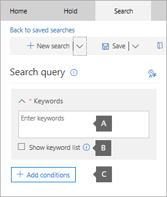
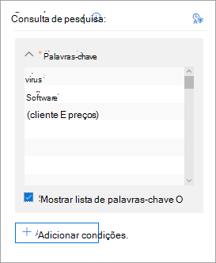

# Pesquisar conteúdo em um caso de descoberta eletrônica principalSearch for content in a Core eDiscovery case

Depois que um caso de descoberta eletrônica principal é criado e as pessoas de interesse no caso são colocadas em espera, você pode criar e executar uma ou mais pesquisas de conteúdo relevante para o caso.After a Core eDiscovery case is created and people of interest in the case are placed on hold, you can create and run one or more searches for content relevant to the case. As pesquisas associadas a um caso de descoberta eletrônica principal não estão listadas na página de **pesquisa de conteúdo** no centro de conformidade da Microsoft 365.Searches associated with a Core eDiscovery case aren't listed on the **Content search** page in the Microsoft 365 compliance center. Essas pesquisas são listadas na página **pesquisas** do caso principal do eDiscover as pesquisas estão associadas.These searches are listed on the **Searches** page of the Core eDiscover case the searches are associated with. Isso também significa que as pesquisas associadas a um caso podem ser acessadas apenas por membros de caso.This also means that searches associated with a case can only be accessed by case members.

Para criar uma pesquisa de descoberta eletrônica principal:To create a Core eDiscovery search:
  
1. Acesse [https://compliance.microsoft.com](https://compliance.microsoft.com) e entre usando as credenciais da conta de usuário que receberam as permissões de descoberta eletrônica apropriadas.Go to [https://compliance.microsoft.com](https://compliance.microsoft.com) and sign in using the credentials for user account that has been assigned the appropriate eDiscovery permissions.

2. No painel de navegação esquerdo do centro de conformidade da Microsoft 365, clique em **Mostrar tudo**e, em seguida, clique em **descoberta eletrônica > Core**.In the left navigation pane of the Microsoft 365 compliance center, click **Show all**, and then click **eDiscovery > Core**.

3. Na página de **descoberta eletrônica principal** , selecione o caso para o qual você deseja criar uma pesquisa associada e clique em **abrir caso**.On the **Core eDiscovery** page, select the case that you want to create an associated search, and then click **Open case**.

4. Na **Home** Page do caso, clique na guia **pesquisas** .On the **Home** page for the case, click the **Searches** tab.
  
5. Na página de **pesquisa** , clique em **nova pesquisa**.On the **Search** page, click **New search**.

6. Na página **Nova pesquisa**, você pode adicionar palavras-chave e condições para criar a consulta de pesquisa.On the **New search** page, you can add keywords and conditions to create the search query. 

    
  
   a.a. Você pode especificar palavras-chave, propriedades de mensagem, como datas de envio e recebimento, ou propriedades do documento, como nomes de arquivo ou a data em que um documento foi alterado pela última vez.You can specify keywords, message properties, such as sent and received dates, or document properties, such as file names or the date that a document was last changed. Você pode usar consultas mais complexas que usam um operador Boolean, como **e**, **ou**, **não**, **Near**ou **ONEAR**.You can use more complex queries that use a Boolean operator, such as **AND**, **OR**, **NOT**, **NEAR**, or **ONEAR**. Você também pode procurar informações confidenciais (por exemplo, números de seguridade social) em documentos ou pesquisar documentos que foram compartilhados externamente.You can also search for sensitive information (such as social security numbers) in documents, or search for documents that have been shared externally. Se você deixar a caixa de palavras-chave vazia, todo o conteúdo localizado nos locais de conteúdo especificado será incluído nos resultados da pesquisa.If you leave the keyword box empty, all content located in the specified content locations will be included in the search results.

   b.b. Você pode clicar na caixa de seleção **Mostrar lista de palavras-chave** e a palavra-chave tipo a em cada linha.You can click the **Show keyword list** check box and the type a keyword in each row. Se você fizer isso, as palavras-chave em cada linha serão conectadas pelo operador **or** na consulta de pesquisa criada.If you do this, the keywords on each row are connected by the **OR** operator in the search query that's created. Você pode inserir no máximo 20 palavras-chave na lista.You can enter a maximum of 20 keywords to the list.

    
  
    Por que usar a lista de palavras-chave?Why use the keyword list? Para obter estatísticas que mostram quantos itens correspondem a cada palavra-chave.You can get statistics that show how many items match each keyword. Isso ajudará a identificar rapidamente quais palavras-chave são as mais recentes.This can help you quickly identify which keywords are the most (and least) effective. Também poderá usar uma frase de palavra-chave (entre parênteses) em uma linha.You can also use a keyword phrase (surrounded by parentheses) in a row. Para obter mais informações sobre as estatísticas de pesquisa, confira [Exibir estatísticas da palavra-chave para Resultados de Pesquisa de Conteúdo](view-keyword-statistics-for-content-search.md).For more information about search statistics, see [View keyword statistics for Content Search results](view-keyword-statistics-for-content-search.md).

    Para obter mais informações sobre como usar a lista de palavras-chave, consulte [criando uma consulta de pesquisa](content-search.md#building-a-search-query).For more information about using the keywords list, see [Building a search query](content-search.md#building-a-search-query).

   c.c. Você pode clicar em **condições** e adicionar condições a uma consulta de pesquisa para restringir uma pesquisa e retornar um conjunto mais refinado de resultados.You can click **Conditions** and add conditions to a search query to narrow a search and return a more refined set of results. Cada condição adiciona uma cláusula à consulta de pesquisa KQL que é criada e executada quando você inicia a pesquisa.Each condition adds a clause to the KQL search query that is created and run when you start the search. Uma condição é logicamente conectada à consulta de palavra-chave (especificada na caixa de palavra-chave) pelo operador **AND**.A condition is logically connected to the keyword query (specified in the keyword box) by the **AND** operator. Isso significa que os itens precisam satisfazer tanto a consulta de palavra-chave quanto cada condição a ser incluído nos resultados.That means that items have to satisfy both the keyword query and each condition to be included in the results. É assim que as condições ajudam a restringir os resultados.This is how conditions help to narrow your results.

    Para saber mais sobre como criar uma consulta de pesquisa e usar condições, confira [Keyword queries for Content Search](keyword-queries-and-search-conditions.md).For more information about creating a search query and using conditions, see [Keyword queries for Content Search](keyword-queries-and-search-conditions.md).

7. Em **locais: locais em espera**, escolha os locais de conteúdo que você deseja pesquisar.Under **Locations: locations on hold**, choose the content locations that you want to search. Você pode pesquisar caixas de correio, sites e pastas públicas na mesma pesquisa.You can search mailboxes, sites, and public folders in the same search.

    
  
    - **Todos os locais**.**All locations**. Selecione essa opção para pesquisar em todos os locais de conteúdo da sua organização.Select this option to search all content locations in your organization. Ao selecionar essa opção, você pode optar por pesquisar todas as caixas de correio do Exchange (que inclui as caixas de correio de todos os grupos do Microsoft Teams, do Yammer e do Office 365), todos os sites do SharePoint e do OneDrive for Business (que inclui os sites de todos os grupos do Microsoft Teams, do Yammer e do Office 365) e todas as pastas públicas.When you select this option, you can choose to search all Exchange mailboxes (which includes the mailboxes for all Microsoft Teams, Yammer Groups, and Office 365 Groups), all SharePoint and OneDrive for Business sites (which includes the sites for all Microsoft Teams, Yammer Groups, and Office 365 Groups), and all public folders.
    
    - **Todos os locais em espera**.**All locations on hold**. Selecione essa opção para pesquisar todos os locais de conteúdo que foram colocados em retenção de descoberta eletrônica no caso.Select this option to search all the content locations that have been placed on eDiscovery hold in the case. Se o caso contiver várias isenções, os locais de conteúdo de todas as isenções serão pesquisados.If the case contains multiple holds, the content locations from all holds will be searched. Além disso, se um local de conteúdo foi colocado em um bloqueio baseado em consulta, somente os itens que estão em retenção serão pesquisados quando você executar a pesquisa de conteúdo que você está criando nesta etapa.Additionally, if a content location was placed on a query-based hold, only the items that are on hold will be searched when you run the content search that you're creating in this step. Por exemplo, se um usuário foi colocado em um bloqueio de caso baseado em consulta que preserva os itens que foram enviados ou criados antes de uma data específica, somente esses itens seriam pesquisados.For example, if a user was placed on query-based case hold that preserves items that were sent or created before a specific date, only those items would be searched. Isso é feito conectando-se à consulta de retenção de caso e à consulta de pesquisa de conteúdo por um operador **and** .This is accomplished by connecting the case hold query and the content search query by an **AND** operator. Para saber mais, confira [locais de pesquisa em retenção de descoberta eletrônica](create-ediscovery-holds.md#search-locations-on-ediscovery-hold).For more information, see [Search locations on eDiscovery hold](create-ediscovery-holds.md#search-locations-on-ediscovery-hold).
    
    - **Locais específicos**.**Specific locations**. Selecione essa opção para selecionar as caixas de correio e os sites que você deseja pesquisar.Select this option to select the mailboxes and sites that you want to search. Quando você seleciona essa opção e clica em **Modificar**, uma lista de locais é exibida.When you select this option and click **Modify**, a list of locations appears. Você pode optar por pesquisar qualquer um ou todos os usuários, grupos, equipes ou locais de sites.You can choose to search any or all users, groups, teams, or site locations. Você também pode pesquisar as pastas públicas em sua organização.You can also search the public folders in your organization.
    
      
  
     Se você selecionar essa opção e pesquisar qualquer local de conteúdo em espera, qualquer consulta de um bloqueio de caso baseado em consulta não será aplicada à consulta de pesquisa.If you select this option and search any content location that's on hold, any query from a query-based case hold won't be applied to the search query. Em outras palavras, todo o conteúdo é pesquisado, e não apenas o conteúdo que é preservado por um bloqueio de caso baseado em consulta.In other words, all content is searched, not just the content that's preserved by a query-based case hold.

8. Depois de selecionar os locais de conteúdo para pesquisa, clique em **concluído** e, em seguida, clique em **salvar**.After you select the content locations to search, click **Done** and then click **Save**.

9. Na página **nova pesquisa** , clique em **salvar & executar** e digite um nome para a pesquisa.On the **New search** page, click **Save & run** and then type a name for the search. As pesquisas associadas a um caso de descoberta eletrônica principal devem ter nomes exclusivos na sua organização do Office 365.Searches associated with a Core eDiscovery case must have names that are unique within your Office 365 organization.

10. Clique em **salvar** para salvar as configurações de pesquisa e iniciar a pesquisa.Click **Save** to save the search settings and start the search.

  Após a conclusão da pesquisa, você poderá visualizar os resultados.After the search is completed, you can preview the search results. Se necessário, clique em **Atualizar** na página **pesquisas** para exibir a pesquisa criada na lista.If necessary, click **Refresh** on the **Searches** page to display the search you created in the list.

11. Clique na pesquisa para exibir a página de menu suspenso, que contém estatísticas sobre a pesquisa e para executar outras tarefas, como exibir estatísticas de pesquisa e exportar os resultados da pesquisa.Click the search to display the flyout page, which contains statistics about the search and to perform other tasks such as viewing search statistics and exporting the search results.

## Mais informações sobre como pesquisar locais de conteúdoMore information about searching content locations

- Ao clicar em **escolher usuários, grupos ou equipes** para especificar as caixas de correio a serem pesquisadas, o seletor de caixa de correio exibido estará vazio.When you click **Choose users, groups, or teams** to specify mailboxes to search, the mailbox picker that's displayed is empty. Isso foi desenvolvido para melhorar o desempenho.This is by design to enhance performance. Para adicionar destinatários a essa lista, clique em **escolher usuários, grupos ou equipes**, digite um nome (no mínimo 3 caracteres) na caixa de pesquisa, marque a caixa de seleção ao lado do nome e clique em **escolher**.To add recipients to this list, click **Choose users, groups, or teams**, type a name (a minimum of 3 characters) in the search box, select the check box next to the name, and then click **Choose**.

- Você pode adicionar caixas de correio inativas, Microsoft Teams, grupos do Yammer, grupos do Office 365 e grupos de distribuição à lista de caixas de correio a serem pesquisadas.You can add inactive mailboxes, Microsoft Teams, Yammer Groups, Office 365 Groups, and distribution groups to the list of mailboxes to search. Não há suporte para grupos dinâmicos de distribuição.Dynamic distribution groups aren't supported. Se você adicionar o Microsoft Teams, os grupos do Yammer ou os grupos do Office 365, a caixa de correio de grupo ou equipe será pesquisada; as caixas de correio dos membros do grupo não são pesquisadas.If you add Microsoft Teams, Yammer Groups, or Office 365 Groups, the group or team mailbox is searched; the mailboxes of the group members aren't searched.

- Para adicionar **sites, clique em escolher sites**, clique em **escolher sites** novamente e digite a URL de cada site que você deseja pesquisar.To add sites click **Choose sites**, click **Choose sites** again, and then type the URL for each site that you want to search. Você também pode adicionar a URL para o site do SharePoint para uma equipe da Microsoft, um grupo do Yammer ou um grupo do Office 365.You can also add the URL for the SharePoint site for a Microsoft Team, a Yammer Group, or an Office 365 Group.
