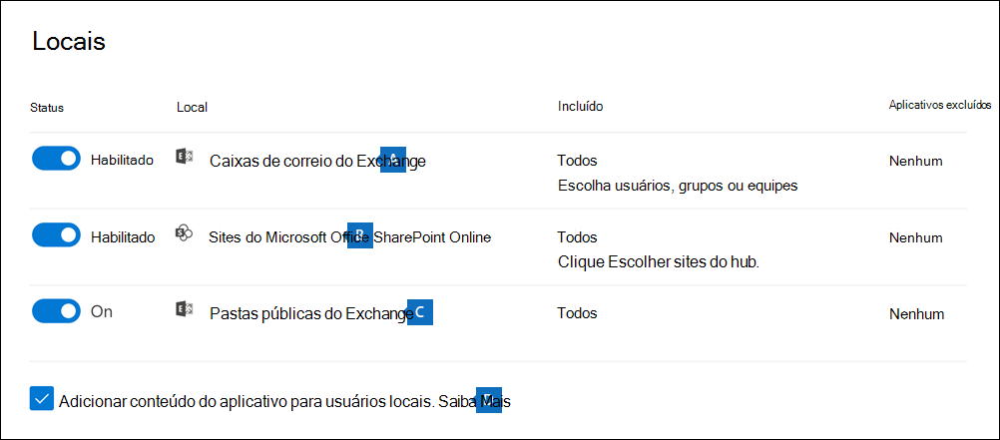

# Pesquisar conteúdo em um caso core de Descoberta eDiscoverySearch for content in a Core eDiscovery case

Depois que um caso core de Descoberta eDiscovery é criado e as pessoas de interesse no caso são colocadas em espera, você pode criar e executar uma ou mais pesquisas de conteúdo relevante para o caso.After a Core eDiscovery case is created and people of interest in the case are placed on hold, you can create and run one or more searches for content relevant to the case. As pesquisas associadas a um caso de Descoberta Básica  de Descoberta e não estão listadas na página de pesquisa de conteúdo no centro de conformidade Microsoft 365.Searches associated with a Core eDiscovery case aren't listed on the **Content search** page in the Microsoft 365 compliance center. Essas pesquisas estão listadas na página **Pesquisas** da ocorrência principal de Descoberta eDiscover à que as pesquisas estão associadas.These searches are listed on the **Searches** page of the Core eDiscover case the searches are associated with. Isso também significa que as pesquisas associadas a um caso só podem ser acessadas por membros da ocorrência.This also means that searches associated with a case can only be accessed by case members.

Para criar uma pesquisa principal de Descoberta eDiscovery:To create a Core eDiscovery search:
  
1. Acesse e entre usando as credenciais da conta de usuário que recebeu as permissões de <https://compliance.microsoft.com> Descoberta eDiscovery apropriadas e é membro do caso.Go to <https://compliance.microsoft.com> and sign in using the credentials for user account that has been assigned the appropriate eDiscovery permissions and is a member of the case.

2. No painel de navegação esquerdo do centro de conformidade Microsoft 365, clique em **Mostrar** tudo e clique em **Descoberta > Core**.In the left navigation pane of the Microsoft 365 compliance center, click **Show all**, and then click **eDiscovery > Core**.

3. Na página **Descoberta Principal da Descoberta** e, em seguida, selecione o caso que você deseja criar uma pesquisa associada e clique em Abrir **caso**.On the **Core eDiscovery** page, select the case that you want to create an associated search, and then click **Open case**.

4. Na **home** page do caso, clique na guia **Pesquisas** e clique em **Nova pesquisa**.On the **Home** page for the case, click the **Searches** tab, and then click **New search**.

   

   > [!NOTE]
   > A **opção Pesquisar por ID** permite que você pesquise mensagens de email específicas e outros itens de caixa de correio usando uma lista de Exchange IDs.The **Search by ID list** option lets you search for specific email messages and other mailbox items using a list of Exchange IDs. Para criar uma pesquisa de lista de IDs, você envia um arquivo de valores separados por vírgula (CSV) que identifica os itens específicos da caixa de correio a serem pesquisados.To create an ID list search, you submit a comma-separated value (CSV) file that identifies the specific mailbox items to search for. Para obter instruções, confira [Preparar um arquivo CSV para uma pesquisa de lista de IDs](csv-file-for-an-id-list-content-search.md).For instructions, see [Prepare a CSV file for an ID list search](csv-file-for-an-id-list-content-search.md).

5. No assistente **Nova pesquisa,** digite um nome para a pesquisa e uma descrição opcional que ajuda a identificar a pesquisa.In the **New search** wizard, type a name for the search, and an optional description that helps identify the search. O nome da pesquisa deve ser exclusivo em sua organização.The name of the search must be unique in your organization.

6. Na página **Locais,** escolha os locais de conteúdo que você deseja pesquisar.On the **Locations** page, choose the content locations that you want to search. Você pode pesquisar caixas de correio, sites e pastas públicas.You can search mailboxes, sites, and public folders.

    
  
   1. **Exchange caixas de** correio : de  definir a alternância como On e clique em Escolher usuários, grupos ou **equipes** para especificar as caixas de correio que devem ser colocadas em espera.**Exchange mailboxes**: Set the toggle to **On** and then click **Choose users, groups, or teams** to specify the mailboxes to place on hold. Use a caixa de pesquisa para encontrar caixas de correio de usuário e grupos de distribuição (para colocar uma responsabilidade nas caixas de correio dos membros do grupo) para colocar em espera.Use the search box to find user mailboxes and distribution groups (to place a hold on the mailboxes of group members) to place on hold. Você também pode pesquisar a caixa de correio associada a uma Equipe da Microsoft (para mensagens de canal), Office 365 Group e Yammer Group.You can also search the mailbox associated with a Microsoft Team (for channel messages), Office 365 Group, and Yammer Group. Para obter mais informações sobre os dados do aplicativo armazenados em caixas de correio, consulte Conteúdo armazenado em caixas de [correio para Descoberta Eletrônico.](what-is-stored-in-exo-mailbox.md)For more information about the application data stored in mailboxes, see [Content stored in mailboxes for eDiscovery](what-is-stored-in-exo-mailbox.md).

   2. **SharePoint :** de definir a alternância como On e clique em Escolher **sites** para especificar SharePoint sites e OneDrive contas para colocar em espera. **SharePoint sites**: Set the toggle to **On** and then click **Choose sites** to specify SharePoint sites and OneDrive accounts to place on hold. Digite a URL de cada site que você deseja colocar em retenção.Type the URL for each site that you want to place on hold. Você também pode adicionar a URL do site SharePoint para uma Equipe da Microsoft, Office 365 Group ou Yammer Group.You can also add the URL for the SharePoint site for a Microsoft Team, Office 365 Group, or Yammer Group.
  
   3. **Exchange pastas públicas**: de definir a alternância como **On** para colocar todas as pastas públicas em sua Exchange Online organização em espera.**Exchange public folders**: Set the toggle to **On** to put all public folders in your Exchange Online organization on hold. Não é possível escolher pastas públicas específicas para colocar em espera.You can't choose specific public folders to put on hold. Deixe o botão de alternância desligado se você não quiser colocar uma espera em pastas públicas.Leave the toggle switch off if you don't want to put a hold on public folders.
  
   4. Mantenha essa caixa de seleção selecionada para pesquisar Teams conteúdo para usuários locais.Keep this checkbox selected to search for Teams content for on-premises users. Por exemplo, se você pesquisar todas as caixas de correio Exchange na organização e essa caixa de seleção estiver selecionada, o armazenamento baseado em nuvem usado para armazenar dados de chat Teams para usuários locais será incluído no escopo da pesquisa.For example, if you search all Exchange mailboxes in the organization and this checkbox is selected, the cloud-based storage used to store Teams chat data for on-premises users will be included in the scope of the search. Para obter mais informações, confira [Pesquisar dados de bate-papo do Teams para usuários locais](search-cloud-based-mailboxes-for-on-premises-users.md).For more information, see [Search for Teams chat data for on-premises users](search-cloud-based-mailboxes-for-on-premises-users.md).

7. Na página **Definir suas condições de pesquisa,** digite uma consulta de palavra-chave e adicione condições à consulta de pesquisa, se necessário.On the **Define your search conditions** page, type a keyword query and add conditions to the search query if necessary.

   

   1. Especifique palavras-chave, propriedades de mensagem, como datas enviadas e recebidas, ou propriedades de documento, como nomes de arquivo ou a data em que um documento foi alterado pela última vez.Specify keywords, message properties such as sent and received dates, or document properties such as file names or the date that a document was last changed. Faça consultas mais complexas que usam um operador Booleano, **E**, **OU**, **NÃO** e **PRÓXIMO**.You can use more complex queries that use a Boolean operator, such as **AND**, **OR**, **NOT**, and **NEAR**. Se você deixar a caixa de palavra-chave vazia, todo o conteúdo localizado nos locais de conteúdo especificado será incluído nos resultados da pesquisa.If you leave the keyword box empty, all content located in the specified content locations is included in the search results. Para obter mais informações, consulte [Consultas de palavra-chave e condições de pesquisa para eDiscovery](keyword-queries-and-search-conditions.md).For more information, see [Keyword queries and search conditions for eDiscovery](keyword-queries-and-search-conditions.md).

   2. Como alternativa, você pode clicar na caixa de seleção **Mostrar lista de palavras-chave** e digitar uma palavra-chave em cada linha.Alternatively, you can click the **Show keyword list** checkbox and the type a keyword in each row. Ao fazer isso, as palavras-chave em cada linha serão conectadas por um operador lógico (**c:s**) com funcionalidade semelhante ao operador **OU** na consulta de pesquisa criada.If you do this, the keywords on each row are connected by a logical operator (**c:s**) that is similar in functionality to the **OR** operator in the search query that's created.

      Por que usar a lista de palavras-chave?Why use the keyword list? Para obter estatísticas que mostram quantos itens correspondem a cada palavra-chave.You can get statistics that show how many items match each keyword. Isso ajudará a identificar rapidamente quais palavras-chave são as mais recentes.This can help you quickly identify which keywords are the most (and least) effective. Também poderá usar uma frase de palavra-chave (entre parênteses) em uma linha.You can also use a keyword phrase (surrounded by parentheses) in a row. Para obter mais informações sobre a lista de palavras-chave e estatísticas de pesquisa, consulte Obter estatísticas de palavra-chave [para pesquisas](view-keyword-statistics-for-content-search.md#get-keyword-statistics-for-searches).For more information about the keyword list and search statistics, see [Get keyword statistics for searches](view-keyword-statistics-for-content-search.md#get-keyword-statistics-for-searches).

      > [!NOTE]
      > Para ajudar a reduzir problemas causados por listas de palavras-chave grandes, você está limitado a no máximo 20 linhas na lista de palavras-chave.To help reduce issues caused by large keyword lists, you're limited to a maximum of 20 rows in the keyword list.

   3. Você pode adicionar condições de pesquisa para restringir uma pesquisa e retornar um conjunto mais refinado de resultados.You can add search conditions to narrow a search and return a more refined set of results. Cada condição adiciona uma cláusula à consulta de pesquisa que é criada e executada quando você inicia a pesquisa.Each condition adds a clause to the search query that is created and run when you start the search. Uma condição é logicamente conectada à consulta de palavra-chave (especificada na caixa de palavra-chave) por um operador lógico (**c:c**) parecido com a funcionalidade do operador **E**.A condition is logically connected to the keyword query (specified in the keyword box) by a logical operator (**c:c**) that is similar in functionality to the **AND** operator. Isso significa que os itens precisam atender à consulta de palavras-chave e uma ou mais condições para serem incluídas nos resultados.That means that items have to satisfy both the keyword query and one or more conditions to be included in the results. É assim que as condições ajudam a restringir os resultados.This is how conditions help to narrow your results. Para obter uma lista e uma descrição das condições que podem ser usadas em uma consulta de pesquisa, confira a seção [Condições de pesquisa](keyword-queries-and-search-conditions.md#search-conditions).For a list and description of conditions that you can use in a search query, see [Search conditions](keyword-queries-and-search-conditions.md#search-conditions).

8. Revise as configurações de pesquisa (e edite se necessário) e envie a pesquisa para in-locar.Review the search settings (and edit if necessary), and then submit the search to start it.

Após a conclusão da pesquisa, você poderá visualizar os resultados.After the search is completed, you can preview the search results. Se necessário, clique **em Atualizar** na **página Pesquisas** para exibir a pesquisa criada.If necessary, click **Refresh** on the **Searches** page to display the search you created.

## Mais informações sobre a pesquisa de locais de conteúdoMore information about searching content locations

- Quando você clica **em Escolher usuários, grupos** ou equipes para especificar caixas de correio para pesquisar, o seletor de caixa de correio exibido está vazio.When you click **Choose users, groups, or teams** to specify mailboxes to search, the mailbox picker that's displayed is empty. Isso foi desenvolvido para melhorar o desempenho.This is by design to enhance performance. Para adicionar destinatários a essa lista, clique em Escolher **usuários,** grupos ou equipes , digite um nome (no mínimo três caracteres) na caixa de pesquisa, marque a caixa de seleção ao lado do nome e clique em **Escolher**.To add recipients to this list, click **Choose users, groups, or teams**, type a name (a minimum of three characters) in the search box, select the check box next to the name, and then click **Choose**.

- Você pode adicionar caixas de correio inativas, Microsoft Teams, grupos Yammer, grupos de Office 365 e grupos de distribuição à lista de caixas de correio a ser pesquisada.You can add inactive mailboxes, Microsoft Teams, Yammer Groups, Office 365 Groups, and distribution groups to the list of mailboxes to search. Não há suporte para grupos dinâmicos de distribuição.Dynamic distribution groups aren't supported. Se você adicionar Microsoft Teams, Yammer grupos ou Office 365 grupos, a caixa de correio do grupo ou da equipe será pesquisada; as caixas de correio dos membros do grupo não são pesquisadas.If you add Microsoft Teams, Yammer Groups, or Office 365 Groups, the group or team mailbox is searched; the mailboxes of the group members aren't searched.

- Para adicionar sites à pesquisa, acione a alternância e clique **em Escolher sites**.To add sites to the search, turn on the toggle and then click **Choose sites**. Digite a URL para cada site que você deseja pesquisar.Type the URL for each site that you want to search. Você também pode adicionar a URL do site SharePoint para uma Equipe da Microsoft, um grupo Yammer ou um grupo Office 365.You can also add the URL for the SharePoint site for a Microsoft Team, a Yammer Group, or an Office 365 Group.
