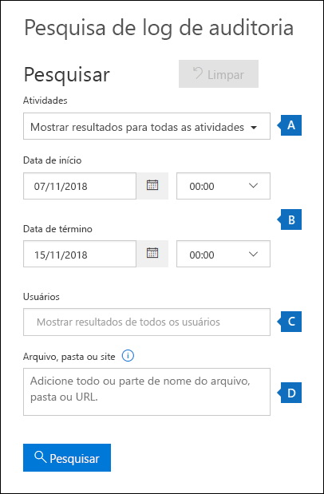
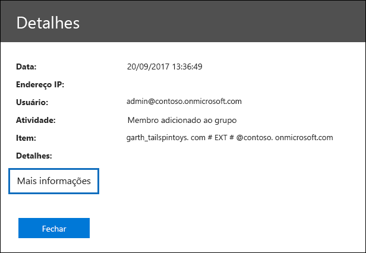
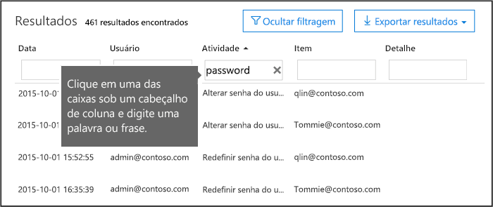
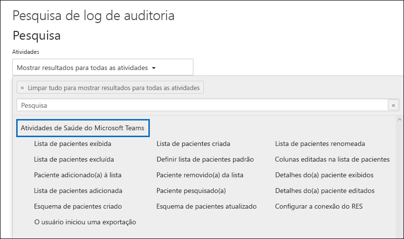
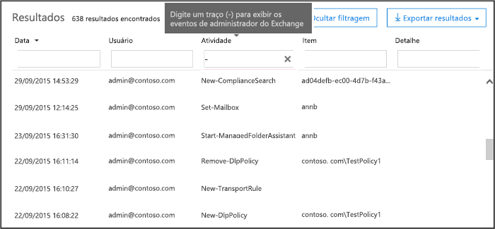

# <a name="search-the-audit-log-in-the-security--compliance-center"></a><span data-ttu-id="24818-103">Pesquisar o log de auditoria no Centro de Conformidade e Segurança</span><span class="sxs-lookup"><span data-stu-id="24818-103">Search the audit log in the Security & Compliance Center</span></span>

## <a name="introduction"></a><span data-ttu-id="24818-104">Introdução</span><span class="sxs-lookup"><span data-stu-id="24818-104">Introduction</span></span>

<span data-ttu-id="24818-105">Precisa descobrir se um usuário visualizou um documento específico ou apagou um item de sua caixa de correio?</span><span class="sxs-lookup"><span data-stu-id="24818-105">Need to find if a user viewed a specific document or purged an item from their mailbox?</span></span> <span data-ttu-id="24818-106">Nesse caso, você pode usar o Centro de Conformidade & Segurança do Office 365 para pesquisar o log de auditoria unificada para exibir a atividade do usuário e do administrador na sua organização do Office 365.</span><span class="sxs-lookup"><span data-stu-id="24818-106">If so, you can use the Office 365 Security & Compliance Center to search the unified audit log to view user and administrator activity in your Office 365 organization.</span></span> <span data-ttu-id="24818-107">Por que usar um log de auditoria unificada?</span><span class="sxs-lookup"><span data-stu-id="24818-107">Why a unified audit log?</span></span> <span data-ttu-id="24818-108">Porque você pode procurar os seguintes tipos de atividades de usuários e administradores do Office 365:</span><span class="sxs-lookup"><span data-stu-id="24818-108">Because you can search for the following types of user and admin activity in Office 365:</span></span>

- <span data-ttu-id="24818-109">Atividade do usuário do SharePoint Online e do OneDrive for Business</span><span class="sxs-lookup"><span data-stu-id="24818-109">User activity in SharePoint Online and OneDrive for Business</span></span>

- <span data-ttu-id="24818-110">Atividade do usuário do Exchange Online (log de auditoria da caixa de correio do Exchange)</span><span class="sxs-lookup"><span data-stu-id="24818-110">User activity in Exchange Online (Exchange mailbox audit logging)</span></span>

- <span data-ttu-id="24818-111">Atividade de administração do SharePoint Online</span><span class="sxs-lookup"><span data-stu-id="24818-111">Admin activity in SharePoint Online</span></span>

- <span data-ttu-id="24818-112">Atividade de administração do Azure Active Directory (o serviço de diretório para o Office 365)</span><span class="sxs-lookup"><span data-stu-id="24818-112">Admin activity in Azure Active Directory (the directory service for Office 365)</span></span>

- <span data-ttu-id="24818-113">Atividade de administradores do Exchange Online (log de auditoria de administradores do Exchange)</span><span class="sxs-lookup"><span data-stu-id="24818-113">Admin activity in Exchange Online (Exchange admin audit logging)</span></span>

- <span data-ttu-id="24818-114">Atividade de usuários e administradores do Sway</span><span class="sxs-lookup"><span data-stu-id="24818-114">User and admin activity in Sway</span></span>

- <span data-ttu-id="24818-115">atividades de descoberta eletrônica no centro de conformidade e segurança</span><span class="sxs-lookup"><span data-stu-id="24818-115">eDiscovery activities in the security and compliance center</span></span>

- <span data-ttu-id="24818-116">Atividade de usuários e administradores do Power BI</span><span class="sxs-lookup"><span data-stu-id="24818-116">User and admin activity in Power BI</span></span>

- <span data-ttu-id="24818-117">Atividade de usuários e administradores do Microsoft Teams</span><span class="sxs-lookup"><span data-stu-id="24818-117">User and admin activity in Microsoft Teams</span></span>

- <span data-ttu-id="24818-118">Atividade de usuários e administradores do Dynamics 365</span><span class="sxs-lookup"><span data-stu-id="24818-118">User and admin activity in Dynamics 365</span></span>

- <span data-ttu-id="24818-119">Atividade de usuários e administradores do Yammer</span><span class="sxs-lookup"><span data-stu-id="24818-119">User and admin activity in Yammer</span></span>

- <span data-ttu-id="24818-120">Atividade de usuários e administradores do Microsoft Flow</span><span class="sxs-lookup"><span data-stu-id="24818-120">User and admin activity in Microsoft Flow</span></span>

- <span data-ttu-id="24818-121">Atividade de usuários e administradores do Microsoft Stream</span><span class="sxs-lookup"><span data-stu-id="24818-121">User and admin activity in Microsoft Stream</span></span>

- <span data-ttu-id="24818-122">Atividade de administradores e analistas do Microsoft Workplace Analytics</span><span class="sxs-lookup"><span data-stu-id="24818-122">Analyst and admin activity in Microsoft Workplace Analytics</span></span>

- <span data-ttu-id="24818-123">Atividade de usuários e administradores do Microsoft PowerApps</span><span class="sxs-lookup"><span data-stu-id="24818-123">User and admin activity in Microsoft PowerApps</span></span>

- <span data-ttu-id="24818-124">Atividade de usuários e administradores do Microsoft Forms</span><span class="sxs-lookup"><span data-stu-id="24818-124">User and admin activity in Microsoft PowerApps</span></span>

## <a name="before-you-begin"></a><span data-ttu-id="24818-125">Antes de começar</span><span class="sxs-lookup"><span data-stu-id="24818-125">Before you begin</span></span>

<span data-ttu-id="24818-126">Leia os seguintes itens antes de começar a pesquisar o log de auditoria do Office 365.</span><span class="sxs-lookup"><span data-stu-id="24818-126">Be sure to read the following items before you start searching the Office 365 audit log.</span></span>

- <span data-ttu-id="24818-127">Você (ou outro administrador) deve ativar primeiro o log de auditoria antes de começar a pesquisar no log de auditoria do Office 365.</span><span class="sxs-lookup"><span data-stu-id="24818-127">You (or another admin) must first turn on audit logging before you can start searching the Office 365 audit log.</span></span> <span data-ttu-id="24818-128">Para ativá-lo, clique em **Iniciar a gravação das atividades dos usuários e administradores** na página **Pesquisar log de auditoria** no Centro de Conformidade e Segurança.</span><span class="sxs-lookup"><span data-stu-id="24818-128">To turn it on, click **Start recording user and admin activity** on the **Audit log search** page in the Security & Compliance Center.</span></span> <span data-ttu-id="24818-129">(Se você não vir esse link, a auditoria já está ativada na sua organização). Depois de ativá-lo, será exibida uma mensagem informando que o log de auditoria está sendo preparado e que você pode executar uma pesquisa dentro de algumas horas após concluir a preparação.</span><span class="sxs-lookup"><span data-stu-id="24818-129">(If you don't see this link, auditing has already been turned on for your organization.) After you turn it on, a message is displayed that says the audit log is being prepared and that you can run a search in a couple of hours after the preparation is complete.</span></span> <span data-ttu-id="24818-130">Isso só precisa ser feito uma vez.</span><span class="sxs-lookup"><span data-stu-id="24818-130">You only have to do this once.</span></span>

  > [!NOTE]
  > <span data-ttu-id="24818-131">Estamos em processo de ativar a auditoria por padrão.</span><span class="sxs-lookup"><span data-stu-id="24818-131">We're in the process of turning on auditing by default.</span></span> <span data-ttu-id="24818-132">Até lá, ative-a conforme descrevemos anteriormente.</span><span class="sxs-lookup"><span data-stu-id="24818-132">Until then, you can turn it on as previously described.</span></span>

- <span data-ttu-id="24818-133">É preciso atribuir a função Logs de Auditoria Somente para Exibição ou Logs de Auditoria do Exchange Online para pesquisar o log de auditoria do Office 365.</span><span class="sxs-lookup"><span data-stu-id="24818-133">You have to be assigned the View-Only Audit Logs or Audit Logs role in Exchange Online to search the Office 365 audit log.</span></span> <span data-ttu-id="24818-134">Por padrão, essas funções são atribuídas aos grupos de funções Gerenciamento de Conformidade e Gerenciamento de Organização na página **Permissões** do centro de administração do Exchange.</span><span class="sxs-lookup"><span data-stu-id="24818-134">By default, these roles are assigned to the Compliance Management and Organization Management role groups on the **Permissions** page in the Exchange admin center.</span></span> <span data-ttu-id="24818-135">Note que os administradores globais do Office 365 e do Microsoft 365 são automaticamente adicionados como membros do grupo de função Gerenciamento da Organização no Exchange Online.</span><span class="sxs-lookup"><span data-stu-id="24818-135">Note Global administrators in Office 365 and Microsoft 365 are automatically added as members of the Organization Management role group in Exchange Online.</span></span> <span data-ttu-id="24818-136">Para que um usuário tenha a capacidade de pesquisar o log de auditoria do Office 365 com o nível mínimo de privilégios, você pode criar um grupo de funções personalizado no Exchange Online, adicionar a função Logs de Auditoria Somente para Exibição ou Logs de Auditoria e, em seguida, adicionar o usuário como um membro do novo grupo de funções.</span><span class="sxs-lookup"><span data-stu-id="24818-136">To give a user the ability to search the Office 365 audit log with the minimum level of privileges, you can create a custom role group in Exchange Online, add the View-Only Audit Logs or Audit Logs role, and then add the user as a member of the new role group.</span></span> <span data-ttu-id="24818-137">Para saber mais, confira [Gerenciar Grupos de Funções do Exchange Online](https://go.microsoft.com/fwlink/p/?LinkID=730688).</span><span class="sxs-lookup"><span data-stu-id="24818-137">For more information, see [Manage role groups in Exchange Online](https://go.microsoft.com/fwlink/p/?LinkID=730688).</span></span>

  > [!IMPORTANT]
  > <span data-ttu-id="24818-138">Se você atribuir a um usuário a função Logs de Auditoria Somente para Exibição ou Logs de Auditoria na página **Permissões** do Centro de Conformidade e Segurança, eles não poderão pesquisar o log de auditoria do Office 365.</span><span class="sxs-lookup"><span data-stu-id="24818-138">If you assign a user the View-Only Audit Logs or Audit Logs role on the **Permissions** page in the Security & Compliance Center, they won't be able to search the Office 365 audit log.</span></span> <span data-ttu-id="24818-139">Você deve atribuir as permissões no Exchange Online.</span><span class="sxs-lookup"><span data-stu-id="24818-139">You have to assign the permissions in Exchange Online.</span></span> <span data-ttu-id="24818-140">Isso ocorre porque o cmdlet subjacente usado para pesquisar o log de auditoria é um cmdlet Exchange Online.</span><span class="sxs-lookup"><span data-stu-id="24818-140">This is because the underlying cmdlet used to search the audit log is an Exchange Online cmdlet.</span></span>

- <span data-ttu-id="24818-141">Quando uma atividade auditada é realizada por um usuário ou administrador, um registro de auditoria é gerado e armazenado no log de auditoria do Office 365 para a sua organização.</span><span class="sxs-lookup"><span data-stu-id="24818-141">When an audited activity is performed by a user or admin, an audit record is generated and stored in the Office 365 audit log for your organization.</span></span> <span data-ttu-id="24818-142">O período de tempo em que um registro de auditoria é mantido (e pesquisável no log de auditoria) depende da sua assinatura do Office 365 e, especificamente, do tipo de licença atribuída a um usuário específico.</span><span class="sxs-lookup"><span data-stu-id="24818-142">The length of time that an audit record is retained (and searchable in the audit log) depends on your Office 365 subscription, and specifically the type of the license that is assigned to a specific user.</span></span>

  - <span data-ttu-id="24818-143">**Office 365 E3:** Os registros de auditoria são mantidos por 90 dias.</span><span class="sxs-lookup"><span data-stu-id="24818-143">**Office 365 E3:** Audit records are retained for 90 days.</span></span> <span data-ttu-id="24818-144">Isso significa que você pode pesquisar o log de auditoria para atividades que foram realizadas nos últimos 90 dias.</span><span class="sxs-lookup"><span data-stu-id="24818-144">That means you can search the audit log for activities that were performed within the last 90 days.</span></span>

    > [!NOTE]
    > <span data-ttu-id="24818-145">Mesmo quando a auditoria da caixa de correio está ativada por padrão, pode-se notar que os eventos de auditoria de caixa de correio de alguns usuários não são encontrados nas pesquisas de log de auditoria no Centro de Conformidade & Segurança ou por meio da API de Atividade de Gerenciamento do Office 365.</span><span class="sxs-lookup"><span data-stu-id="24818-145">Even when mailbox auditing on by default is turned on, you might notice that mailbox audit events for some users aren't found in audit log searches in the Security & Compliance Center or via the Office 365 Management Activity API.</span></span> <span data-ttu-id="24818-146">Para saber mais, confira [Mais informações sobre o log de auditoria de caixa de correio](enable-mailbox-auditing.md#more-information).</span><span class="sxs-lookup"><span data-stu-id="24818-146">For more information, see [More information about mailbox audit logging](enable-mailbox-auditing.md#more-information).</span></span>

  - <span data-ttu-id="24818-147">**Office 365 E5:** Os registros de auditoria também são mantidos por 90 dias.</span><span class="sxs-lookup"><span data-stu-id="24818-147">**Office 365 E5:** Audit records are also retained for 90 days.</span></span> <span data-ttu-id="24818-148">Manter registros de auditoria por um ano pode estar disponível para usuários do E5 e usuários com uma licença do E3 e uma licença do complemento de Conformidade Avançada do Office 365.</span><span class="sxs-lookup"><span data-stu-id="24818-148">Retaining audit records for one year may eventually be available for E5 users and users with an E3 license and an Office 365 Advanced Compliance add-on license.</span></span>

    > [!NOTE]
    > <span data-ttu-id="24818-149">O programa de visualização particular com período de retenção de um ano para registros de auditoria para organizações do E5 (ou para usuários em organizações do E3 que têm licenças complementares de Conformidade Avançada) é fechada para um novo registro.</span><span class="sxs-lookup"><span data-stu-id="24818-149">The private preview program for the one-year retention period for audit records for E5 organizations (or for users in E3 organizations that have Advanced Compliance add-on licenses) is closed to new enrollment.</span></span> <span data-ttu-id="24818-150">Esse artigo será atualizado quando o período de retenção de um ano estiver disponível na visualização pública ou lançado para disponibilidade geral.</span><span class="sxs-lookup"><span data-stu-id="24818-150">This article will be updated when the one-year retention period is available in public preview or released for general availability.</span></span>

- <span data-ttu-id="24818-151">Caso pretenda desativar a pesquisa de log de auditoria do Office 365 da sua organização, execute o comando a seguir no PowerShell remoto conectado à sua organização do Exchange Online:</span><span class="sxs-lookup"><span data-stu-id="24818-151">If you want to turn off audit log search in Office 365 for your organization, you can run the following command in remote PowerShell connected to your Exchange Online organization:</span></span>

  ```powershell
  Set-AdminAuditLogConfig -UnifiedAuditLogIngestionEnabled $false
  ```

    <span data-ttu-id="24818-152">Para ativar a pesquisa de auditoria novamente, execute o seguinte comando no PowerShell do Exchange Online:</span><span class="sxs-lookup"><span data-stu-id="24818-152">To turn on audit search again, you can run the following command in Exchange Online PowerShell:</span></span>

  ```powershell
  Set-AdminAuditLogConfig -UnifiedAuditLogIngestionEnabled $true
  ```

  <span data-ttu-id="24818-153">Para saber mais, confira [Desativar a pesquisa de log de auditoria do Office 365](turn-audit-log-search-on-or-off.md).</span><span class="sxs-lookup"><span data-stu-id="24818-153">For more information, see [Turn off audit log search in Office 365](turn-audit-log-search-on-or-off.md).</span></span>

- <span data-ttu-id="24818-154">Como mencionado anteriormente, o cmdlet subjacente usado para pesquisar o log de auditoria é um cmdlet Exchange Online, que é **Search-UnifiedAuditLog**.</span><span class="sxs-lookup"><span data-stu-id="24818-154">As previously stated, the underlying cmdlet used to search the audit log is an Exchange Online cmdlet, which is **Search-UnifiedAuditLog**.</span></span> <span data-ttu-id="24818-155">Isso significa que você pode usar esse cmdlet para pesquisar o log de auditoria do Office 365, em vez de usar a página **pesquisa de log de Auditoria** no Centro de Conformidade e Segurança.</span><span class="sxs-lookup"><span data-stu-id="24818-155">That means you can use this cmdlet to search the Office 365 audit log instead of using the **Audit log search** page in the Security & Compliance Center.</span></span> <span data-ttu-id="24818-156">Você precisa executar esse cmdlet no PowerShell remoto conectado à sua organização do Exchange Online.</span><span class="sxs-lookup"><span data-stu-id="24818-156">You have to run this cmdlet in remote PowerShell connected to your Exchange Online organization.</span></span> <span data-ttu-id="24818-157">Para saber mais, confira [Search-UnifiedAuditLog](https://go.microsoft.com/fwlink/p/?linkid=834776).</span><span class="sxs-lookup"><span data-stu-id="24818-157">For more information, see [Search-UnifiedAuditLog](https://go.microsoft.com/fwlink/p/?linkid=834776).</span></span>

  <span data-ttu-id="24818-158">Para obter informações sobre como exportar os resultados da pesquisa retornados pelo cmdlet **Search-UnifiedAuditLog** para um arquivo CSV, confira a seção "Dicas para exportar e exibir o log de auditoria" em [Exportar, configurar e exibir registros de log de auditoria](export-view-audit-log-records.md#tips-for-exporting-and-viewing-the-audit-log).</span><span class="sxs-lookup"><span data-stu-id="24818-158">For information about exporting the search results returned by the **Search-UnifiedAuditLog** cmdlet to a CSV file, see the "Tips for exporting and viewing the audit log" section in [Export, configure, and view audit log records](export-view-audit-log-records.md#tips-for-exporting-and-viewing-the-audit-log).</span></span>

- <span data-ttu-id="24818-159">Se quiser baixar dados programaticamente do log de auditoria do Office 365, recomendamos que você use a API de Atividades de Gerenciamento do Office 365 em vez de usar um script do PowerShell.</span><span class="sxs-lookup"><span data-stu-id="24818-159">If you want to programmatically download data from the Office 365 audit log, we recommend that you use the Office 365 Management Activity API instead of using a PowerShell script.</span></span> <span data-ttu-id="24818-160">A API de Atividades de Gerenciamento do Office 365 é um serviço Web REST que você pode usar para desenvolver soluções de monitoramento de operações, segurança e conformidade para sua organização.</span><span class="sxs-lookup"><span data-stu-id="24818-160">The Office 365 Management Activity API is a REST web service that you can use to develop operations, security, and compliance monitoring solutions for your organization.</span></span> <span data-ttu-id="24818-161">Para mais informações, confira [referência da API de Atividade de Gerenciamento do Office 365](https://docs.microsoft.com/office/office-365-management-api/office-365-management-activity-api-reference).</span><span class="sxs-lookup"><span data-stu-id="24818-161">For more information, see [Office 365 Management Activity API reference](https://docs.microsoft.com/office/office-365-management-api/office-365-management-activity-api-reference).</span></span>

- <span data-ttu-id="24818-162">Pode levar de 30 minutos a 24 horas após a ocorrência de um evento para que a entrada do log de auditoria correspondente seja exibida nos resultados de pesquisa.</span><span class="sxs-lookup"><span data-stu-id="24818-162">It can take up to 30 minutes or up to 24 hours after an event occurs for the corresponding audit log entry to be displayed in the search results.</span></span> <span data-ttu-id="24818-163">A tabela a seguir mostra o tempo necessário para os vários serviços do Office 365.</span><span class="sxs-lookup"><span data-stu-id="24818-163">The following table shows the time it takes for the different services in Office 365.</span></span>

  |<span data-ttu-id="24818-164">**Serviço do Office 365**</span><span class="sxs-lookup"><span data-stu-id="24818-164">**Office 365 service**</span></span>|<span data-ttu-id="24818-165">**30 minutos**</span><span class="sxs-lookup"><span data-stu-id="24818-165">**30 minutes**</span></span>|<span data-ttu-id="24818-166">**24 horas**</span><span class="sxs-lookup"><span data-stu-id="24818-166">**24 hours**</span></span>|
  |:-----|:-----:|:-----:|
  |<span data-ttu-id="24818-167">Proteção Avançada contra Ameaças e Inteligência contra Ameaças</span><span class="sxs-lookup"><span data-stu-id="24818-167">Advanced Threat Protection and Threat Intelligence</span></span>|||
  |<span data-ttu-id="24818-169">Azure Active Directory (eventos de logon do usuário)</span><span class="sxs-lookup"><span data-stu-id="24818-169">Azure Active Directory (user login events)</span></span>|||
  |<span data-ttu-id="24818-171">Azure Active Directory (eventos de administração)</span><span class="sxs-lookup"><span data-stu-id="24818-171">Azure Active Directory (admin events)</span></span>|||
  |<span data-ttu-id="24818-173">Prevenção contra Perda de Dados</span><span class="sxs-lookup"><span data-stu-id="24818-173">Data Loss Prevention</span></span>|||
  |<span data-ttu-id="24818-175">Dynamics 365 CRM</span><span class="sxs-lookup"><span data-stu-id="24818-175">Dynamics 365 CRM</span></span>|||
  |<span data-ttu-id="24818-177">Descoberta eletrônica</span><span class="sxs-lookup"><span data-stu-id="24818-177">eDiscovery</span></span>|||
  |<span data-ttu-id="24818-179">Exchange Online</span><span class="sxs-lookup"><span data-stu-id="24818-179">Exchange Online</span></span>|||
  |<span data-ttu-id="24818-181">Microsoft Flow</span><span class="sxs-lookup"><span data-stu-id="24818-181">Microsoft Flow</span></span>|||
  |<span data-ttu-id="24818-183">Microsoft Project</span><span class="sxs-lookup"><span data-stu-id="24818-183">Microsoft Project</span></span>|||
  |<span data-ttu-id="24818-185">Microsoft Stream</span><span class="sxs-lookup"><span data-stu-id="24818-185">Microsoft Stream</span></span>|||
  |<span data-ttu-id="24818-187">Microsoft Teams</span><span class="sxs-lookup"><span data-stu-id="24818-187">Microsoft Teams</span></span>|||
  |<span data-ttu-id="24818-189">Power BI</span><span class="sxs-lookup"><span data-stu-id="24818-189">Power BI</span></span>|||
  |<span data-ttu-id="24818-191">Centro de Conformidade e Segurança</span><span class="sxs-lookup"><span data-stu-id="24818-191">Security & Compliance Center</span></span>|||
  |<span data-ttu-id="24818-193">SharePoint Online e OneDrive for Business</span><span class="sxs-lookup"><span data-stu-id="24818-193">SharePoint Online and OneDrive for Business</span></span>|||
  |<span data-ttu-id="24818-195">Sway</span><span class="sxs-lookup"><span data-stu-id="24818-195">Sway</span></span>|||
  |<span data-ttu-id="24818-197">Workplace Analytics</span><span class="sxs-lookup"><span data-stu-id="24818-197">Workplace Analytics</span></span>|||
  |<span data-ttu-id="24818-199">Yammer</span><span class="sxs-lookup"><span data-stu-id="24818-199">Yammer</span></span>||||
  |<span data-ttu-id="24818-201">Microsoft Forms</span><span class="sxs-lookup"><span data-stu-id="24818-201">Microsoft Forms</span></span>||
  ||||

- <span data-ttu-id="24818-203">O Azure Active Directory (Azure AD) é o serviço de diretório do Office 365.</span><span class="sxs-lookup"><span data-stu-id="24818-203">Azure Active Directory (Azure AD) is the directory service for Office 365.</span></span> <span data-ttu-id="24818-204">O log de auditoria unificado contém atividades de usuários, grupos, aplicativos, domínios e atividades de diretórios realizadas no Microsoft 365 ou no portal de gerenciamento do Azure.</span><span class="sxs-lookup"><span data-stu-id="24818-204">The unified audit log contains user, group, application, domain, and directory activities performed in the Microsoft 365 admin center or in the Azure management portal.</span></span> <span data-ttu-id="24818-205">Para obter uma lista completa de eventos do Azure AD, confira [Eventos de Relatório de Auditoria do Azure Active Directory](https://go.microsoft.com/fwlink/p/?LinkID=616549).</span><span class="sxs-lookup"><span data-stu-id="24818-205">For a complete list of Azure AD events, see [Azure Active Directory Audit Report Events](https://go.microsoft.com/fwlink/p/?LinkID=616549).</span></span>

- <span data-ttu-id="24818-206">O log de auditoria do Power BI não está habilitado por padrão.</span><span class="sxs-lookup"><span data-stu-id="24818-206">Audit logging for Power BI isn't enabled by default.</span></span> <span data-ttu-id="24818-207">Para pesquisar as atividades do Power BI no log de auditoria do Office 365, habilite o recurso de auditoria no portal de administração do Power BI.</span><span class="sxs-lookup"><span data-stu-id="24818-207">To search for Power BI activities in the Office 365 audit log, you have to enable auditing in the Power BI admin portal.</span></span> <span data-ttu-id="24818-208">Para obter instruções, confira a seção "logs de auditoria" no [portal de administração do Power bi](https://docs.microsoft.com/power-bi/service-admin-portal#audit-logs).</span><span class="sxs-lookup"><span data-stu-id="24818-208">For instructions, see the "Audit logs" section in [Power BI admin portal](https://docs.microsoft.com/power-bi/service-admin-portal#audit-logs).</span></span>

## <a name="search-the-audit-log"></a><span data-ttu-id="24818-209">Pesquisar o log de auditoria</span><span class="sxs-lookup"><span data-stu-id="24818-209">Search the audit log</span></span>

<span data-ttu-id="24818-210">A seguir, veja o processo para pesquisar o log de auditoria do Office 365. </span><span class="sxs-lookup"><span data-stu-id="24818-210">Here's the process for searching the audit log in Office 365.</span></span>

[<span data-ttu-id="24818-211">Etapa 1: Executar uma pesquisa de log de auditoria</span><span class="sxs-lookup"><span data-stu-id="24818-211">Step 1: Run an audit log search</span></span>](#step-1-run-an-audit-log-search)

[<span data-ttu-id="24818-212">Etapa 2: Exibir os resultados da pesquisa</span><span class="sxs-lookup"><span data-stu-id="24818-212">Step 2: View the search results</span></span>](#step-2-view-the-search-results)

[<span data-ttu-id="24818-213">Etapa 3: Filtrar os resultados da pesquisa</span><span class="sxs-lookup"><span data-stu-id="24818-213">Step 3: Filter the search results</span></span>](#step-3-filter-the-search-results)

[<span data-ttu-id="24818-214">Etapa 4: Exportar os resultados da pesquisa para um arquivo</span><span class="sxs-lookup"><span data-stu-id="24818-214">Step 4: Export the search results to a file</span></span>](#step-4-export-the-search-results-to-a-file)

### <a name="step-1-run-an-audit-log-search"></a><span data-ttu-id="24818-215">Etapa 1: Executar uma pesquisa de log de auditoria</span><span class="sxs-lookup"><span data-stu-id="24818-215">Step 1: Run an audit log search</span></span>

1. <span data-ttu-id="24818-216">Acesse [https://protection.office.com](https://protection.office.com).</span><span class="sxs-lookup"><span data-stu-id="24818-216">Go to [https://protection.office.com](https://protection.office.com).</span></span>

    > [!TIP]
    > <span data-ttu-id="24818-217">Use uma sessão de navegação particular (não uma sessão regular) para acessar o Centro de Conformidade e Segurança, pois isso impedirá que a credencial com a qual você está conectado no momento seja usada.</span><span class="sxs-lookup"><span data-stu-id="24818-217">Use a private browsing session (not a regular session) to access the Security & Compliance Center because this will prevent the credential that you are currently logged on with from being used.</span></span> <span data-ttu-id="24818-218">Para abrir uma sessão de Navegação InPrivate no Internet Explorer ou no Microsoft Edge, basta pressionar CTRL+SHIFT+P.</span><span class="sxs-lookup"><span data-stu-id="24818-218">To open an InPrivate Browsing session in Internet Explorer or Microsoft Edge, just press CTRL+SHIFT+P.</span></span> <span data-ttu-id="24818-219">Para abrir uma sessão de navegação privada no Google Chrome (chamado de janela incógnita), pressione CTRL+SHIFT+N.</span><span class="sxs-lookup"><span data-stu-id="24818-219">To open a private browsing session in Google Chrome (called an incognito window), press CTRL+SHIFT+N.</span></span>

2. <span data-ttu-id="24818-220">Entre no Office 365 usando a sua conta corporativa ou de estudante.</span><span class="sxs-lookup"><span data-stu-id="24818-220">Sign in to Office 365 using your work or school account.</span></span>

3. <span data-ttu-id="24818-221">No painel esquerdo do Centro de Conformidade e Segurança, clique em **Pesquisar** e, em seguida, clique em **Pesquisa de Log de Auditoria**.</span><span class="sxs-lookup"><span data-stu-id="24818-221">In the left pane of the Security & Compliance Center, click **Search**, and then click **Audit log search**.</span></span>

    <span data-ttu-id="24818-222">É exibida a página **Pesquisa de log de auditoria**.</span><span class="sxs-lookup"><span data-stu-id="24818-222">The **Audit log search** page is displayed.</span></span>

    

    > [!NOTE]
    > <span data-ttu-id="24818-224">Você primeiro precisa ativar o log de auditoria para poder executar uma pesquisa de log de auditoria.</span><span class="sxs-lookup"><span data-stu-id="24818-224">You have to first turn on audit logging before you can run an audit log search.</span></span> <span data-ttu-id="24818-225">Se o link **Iniciar gravação de atividade de usuários e administradores** for exibido, clique nele para ativar a auditoria.</span><span class="sxs-lookup"><span data-stu-id="24818-225">If the **Start recording user and admin activity** link is displayed, click it to turn on auditing.</span></span> <span data-ttu-id="24818-226">Se você não vir esse link, significa que a auditoria já está ativada na sua organização.</span><span class="sxs-lookup"><span data-stu-id="24818-226">If you don't see this link, auditing has already been turned on for your organization.</span></span>

4. <span data-ttu-id="24818-227">Configure os seguintes critérios de pesquisa: </span><span class="sxs-lookup"><span data-stu-id="24818-227">Configure the following search criteria:</span></span>

    <span data-ttu-id="24818-228">a.</span><span class="sxs-lookup"><span data-stu-id="24818-228">a.</span></span> <span data-ttu-id="24818-229">**Atividades**: Clique na lista suspensa para exibir as atividades que você pode procurar.</span><span class="sxs-lookup"><span data-stu-id="24818-229">**Activities**: Click the drop-down list to display the activities that you can search for.</span></span> <span data-ttu-id="24818-230">As atividades de usuários e administradores são organizadas em grupos de atividades relacionadas.</span><span class="sxs-lookup"><span data-stu-id="24818-230">User and admin activities are organized in to groups of related activities.</span></span> <span data-ttu-id="24818-231">Você pode selecionar atividades específicas ou pode clicar no nome do grupo de atividades para selecionar todas as atividades que ele contém.</span><span class="sxs-lookup"><span data-stu-id="24818-231">You can select specific activities or you can click the activity group name to select all activities in the group.</span></span> <span data-ttu-id="24818-232">Você também pode clicar em uma atividade selecionada para limpar a seleção.</span><span class="sxs-lookup"><span data-stu-id="24818-232">You can also click a selected activity to clear the selection.</span></span> <span data-ttu-id="24818-233">Após a execução da pesquisa, apenas as entradas do log de auditoria das atividades selecionadas serão exibidas.</span><span class="sxs-lookup"><span data-stu-id="24818-233">After you run the search, only the audit log entries for the selected activities are displayed.</span></span> <span data-ttu-id="24818-234">Ao selecionar **Mostrar resultados para todas as atividades** os resultados para todas as atividades executadas pelo usuário ou grupo de usuários selecionado será exibido.</span><span class="sxs-lookup"><span data-stu-id="24818-234">Selecting **Show results for all activities** displays results for all activities performed by the selected user or group of users.</span></span>

    <span data-ttu-id="24818-235">Mais de 100 atividades de usuários e administradores são registradas no log de auditoria do Office 365.</span><span class="sxs-lookup"><span data-stu-id="24818-235">Over 100 user and admin activities are logged in the Office 365 audit log.</span></span> <span data-ttu-id="24818-236">Clique na guia **Atividades auditadas**, no tópico deste artigo, para ver as descrições de cada atividade em cada um dos diferentes serviços do Office 365.</span><span class="sxs-lookup"><span data-stu-id="24818-236">Click the **Audited activities** tab at the topic of this article to see the descriptions of every activity in each of the different Office 365 services.</span></span>

    <span data-ttu-id="24818-237">b.</span><span class="sxs-lookup"><span data-stu-id="24818-237">b.</span></span> <span data-ttu-id="24818-238">**Data de início** e **Data de término**: Os últimos sete dias são selecionados por padrão.</span><span class="sxs-lookup"><span data-stu-id="24818-238">**Start date** and **End date**: The last seven days are selected by default.</span></span> <span data-ttu-id="24818-239">Selecione um intervalo de datas e horas para exibir os eventos ocorridos durante esse período.</span><span class="sxs-lookup"><span data-stu-id="24818-239">Select a date and time range to display the events that occurred within that period.</span></span> <span data-ttu-id="24818-240">A data e a hora são apresentadas no formato UTC (Tempo Universal Coordenado).</span><span class="sxs-lookup"><span data-stu-id="24818-240">The date and time are presented in Coordinated Universal Time (UTC) format.</span></span> <span data-ttu-id="24818-241">O intervalo de datas máximo que você pode especificar é de 90 dias.</span><span class="sxs-lookup"><span data-stu-id="24818-241">The maximum date range that you can specify is 90 days.</span></span> <span data-ttu-id="24818-242">Um erro será exibido se o período selecionado for superior a 90 dias.</span><span class="sxs-lookup"><span data-stu-id="24818-242">An error is displayed if the selected date range is greater than 90 days.</span></span>

    > [!TIP]
    > <span data-ttu-id="24818-243">Se você estiver usando o intervalo máximo de datas de 90 dias, selecione a hora atual para a **Data de início**.</span><span class="sxs-lookup"><span data-stu-id="24818-243">If you're using the maximum date range of 90 days, select the current time for the **Start date**.</span></span> <span data-ttu-id="24818-244">Caso contrário, você receberá um erro afirmando que a data de início é anterior à data de término.</span><span class="sxs-lookup"><span data-stu-id="24818-244">Otherwise, you'll receive an error saying that the start date is earlier than the end date.</span></span> <span data-ttu-id="24818-245">Se você tiver ativado a auditoria nos últimos 90 dias, o intervalo máximo de datas não poderá começar antes da data em que a auditoria foi ativada.</span><span class="sxs-lookup"><span data-stu-id="24818-245">If you've turned on auditing within the last 90 days, the maximum date range can't start before the date that auditing was turned on.</span></span>

    <span data-ttu-id="24818-246">c.</span><span class="sxs-lookup"><span data-stu-id="24818-246">c.</span></span> <span data-ttu-id="24818-247">**Usuários**: Clique nessa caixa e selecione um ou mais usuários para os quais deseja exibir resultados.</span><span class="sxs-lookup"><span data-stu-id="24818-247">**Users**: Click in this box and then select one or more users to display search results for.</span></span> <span data-ttu-id="24818-248">As entradas do log de auditoria para a atividade selecionada realizada pelos usuários que você seleciona nessa caixa são exibidas na lista de resultados.</span><span class="sxs-lookup"><span data-stu-id="24818-248">The audit log entries for the selected activity performed by the users you select in this box are displayed in the list of results.</span></span> <span data-ttu-id="24818-249">Deixe essa caixa em branco para retornar entradas para todos os usuários (e contas de serviço) na sua organização.</span><span class="sxs-lookup"><span data-stu-id="24818-249">Leave this box blank to return entries for all users (and service accounts) in your organization.</span></span>

    <span data-ttu-id="24818-250">d.</span><span class="sxs-lookup"><span data-stu-id="24818-250">d.</span></span> <span data-ttu-id="24818-251">**Arquivo, pasta ou site**: Digite alguns ou todos os nome de arquivo ou pasta para pesquisar atividades relacionadas ao arquivo de pasta que contenha a palavra-chave especificada.</span><span class="sxs-lookup"><span data-stu-id="24818-251">**File, folder, or site**: Type some or all of a file or folder name to search for activity related to the file of folder that contains the specified keyword.</span></span> <span data-ttu-id="24818-252">Você também pode especificar uma URL de um arquivo ou pasta.</span><span class="sxs-lookup"><span data-stu-id="24818-252">You can also specify a URL of a file or folder.</span></span> <span data-ttu-id="24818-253">Se você usar uma URL, certifique-se, ao digitar o caminho completo ou apenas uma parte da URL, não incluir espaços ou caracteres especiais.</span><span class="sxs-lookup"><span data-stu-id="24818-253">If you use a URL, be sure the type the full URL path or if you type a portion of the URL, don't include any special characters or spaces.</span></span>

    <span data-ttu-id="24818-254">Deixe essa caixa em branco para retornar entradas para todos os arquivos e pastas em sua organização.</span><span class="sxs-lookup"><span data-stu-id="24818-254">Leave this box blank to return entries for all files and folders in your organization.</span></span>

   <span data-ttu-id="24818-255">**DICAS**</span><span class="sxs-lookup"><span data-stu-id="24818-255">**TIPS**</span></span>

   - <span data-ttu-id="24818-256">Se você estiver procurando por todas as atividades relacionadas a um **site**, adicione o símbolo curinga (\*) após a URL para retornar todas as entradas para esse site. por exemplo, **"https://contoso-my.sharepoint.com/personal/\*"**.</span><span class="sxs-lookup"><span data-stu-id="24818-256">If you're looking for all activities related to a **site**, add the wildcard symbol (\*) after the URL to return all entries for that site; for example, **"https://contoso-my.sharepoint.com/personal/\*"**.</span></span>

   - <span data-ttu-id="24818-257">Se você estiver procurando por todas as atividades relacionadas a um **arquivo**, adicione o símbolo curinga (\*) antes do nome do arquivo para retornar todas as entradas desse arquivo, por exemplo, **"\*Customer_Profitability_Sample.csv"**.</span><span class="sxs-lookup"><span data-stu-id="24818-257">If you're looking for all activities related to a **file**, add the wildcard symbol (\*) before the file name to return all entries for that file; for example, **"\*Customer_Profitability_Sample.csv"**.</span></span>

5. <span data-ttu-id="24818-258">Clique em **Pesquisar** para executar a pesquisa usando seus critérios de pesquisa. </span><span class="sxs-lookup"><span data-stu-id="24818-258">Click **Search** to run the search using your search criteria.</span></span>

   <span data-ttu-id="24818-259">Os resultados da pesquisa são carregados e, depois de alguns momentos, são exibidos em **Resultados**.</span><span class="sxs-lookup"><span data-stu-id="24818-259">The search results are loaded, and after a few moments they are displayed under **Results**.</span></span> <span data-ttu-id="24818-260">Quando a pesquisa estiver concluída, o número de resultados encontrados será exibido.</span><span class="sxs-lookup"><span data-stu-id="24818-260">When the search is finished, the number of results found is displayed.</span></span> <span data-ttu-id="24818-261">Um máximo de 5.000 eventos serão exibidos no painel **Resultados** em incrementos de 150 eventos.</span><span class="sxs-lookup"><span data-stu-id="24818-261">A maximum of 5,000 events will be displayed in the **Results** pane in increments of 150 events.</span></span> <span data-ttu-id="24818-262">Se mais de 5.000 eventos atenderem aos critérios de pesquisa, os 5.000 mais recentes serão exibidos.</span><span class="sxs-lookup"><span data-stu-id="24818-262">If more than 5,000 events meet the search criteria, the most recent 5,000 events are displayed.</span></span>

   

#### <a name="tips-for-searching-the-audit-log"></a><span data-ttu-id="24818-264">Dicas para pesquisar o log de auditoria</span><span class="sxs-lookup"><span data-stu-id="24818-264">Tips for searching the audit log</span></span>

- <span data-ttu-id="24818-265">É possível selecionar atividades específicas para procurar clicando no nome da atividade.</span><span class="sxs-lookup"><span data-stu-id="24818-265">You can select specific activities to search for by clicking the activity name.</span></span> <span data-ttu-id="24818-266">Também é possível procurar todas as atividades em um grupo (como **Atividades de arquivos e pastas**) clicando no nome do grupo.</span><span class="sxs-lookup"><span data-stu-id="24818-266">Or you can search for all activities in a group (such as **File and folder activities**) by clicking the group name.</span></span> <span data-ttu-id="24818-267">Se uma atividade estiver selecionada, você poderá clicar nela para cancelar a seleção.</span><span class="sxs-lookup"><span data-stu-id="24818-267">If an activity is selected, you can click it to cancel the selection.</span></span> <span data-ttu-id="24818-268">Você também pode usar a caixa de pesquisa para exibir as atividades que contêm a palavra-chave digitada.</span><span class="sxs-lookup"><span data-stu-id="24818-268">You can also use the search box to display the activities that contain the keyword that you type.</span></span>

  

- <span data-ttu-id="24818-270">É necessário selecionar **Mostrar resultados para todas as atividades**, na lista **Atividades** para exibir eventos do log de auditoria de administradores do Exchange.</span><span class="sxs-lookup"><span data-stu-id="24818-270">You have to select **Show results for all activities** in the **Activities** list to display events from the Exchange admin audit log.</span></span> <span data-ttu-id="24818-271">Os eventos desse log de auditoria exibem um nome de cmdlet (por exemplo, **Set-Mailbox**) na coluna **Atividade** dos resultados.</span><span class="sxs-lookup"><span data-stu-id="24818-271">Events from this audit log display a cmdlet name (for example, **Set-Mailbox**) in the **Activity** column in the results.</span></span> <span data-ttu-id="24818-272">Para obter mais informações, clique na guia **Atividades auditadas** neste tópico e, em seguida, clique em **Atividades de administração do Exchange**.</span><span class="sxs-lookup"><span data-stu-id="24818-272">For more information, click the **Audited activities** tab in this topic and then click **Exchange admin activities**.</span></span>

  <span data-ttu-id="24818-273">Da mesma forma, existem algumas atividades de auditoria que não possuem um item correspondente na lista **Atividades**.</span><span class="sxs-lookup"><span data-stu-id="24818-273">Similarly, there are some auditing activities that don't have a corresponding item in the **Activities** list.</span></span> <span data-ttu-id="24818-274">Se souber o nome da operação dessas atividades, você poderá procurar todas as atividades e, em seguida, filtrar os resultados, digitando o nome da operação na caixa da coluna **Atividade**.</span><span class="sxs-lookup"><span data-stu-id="24818-274">If you know the name of the operation for these activities, you can search for all activities, then filter the results by typing the name of the operation in the box for the **Activity** column.</span></span> <span data-ttu-id="24818-275">Confira a [Etapa 3: filtrar os resultados da pesquisa](#step-3-filter-the-search-results) para saber mais sobre como filtrar os resultados.</span><span class="sxs-lookup"><span data-stu-id="24818-275">See [Step 3: Filter the search results](#step-3-filter-the-search-results) for more information about filtering the results.</span></span>

- <span data-ttu-id="24818-276">Clique em **Limpar** para limpar os critérios de pesquisa atuais.</span><span class="sxs-lookup"><span data-stu-id="24818-276">Click **Clear** to clear the current search criteria.</span></span> <span data-ttu-id="24818-277">O intervalo de datas retorna para os últimos sete dias padrão.</span><span class="sxs-lookup"><span data-stu-id="24818-277">The date range returns to the default of the last seven days.</span></span> <span data-ttu-id="24818-278">Você também pode clicar em **Limpar tudo para mostrar resultados de todas as atividades** para cancelar todas as atividades selecionadas.</span><span class="sxs-lookup"><span data-stu-id="24818-278">You can also click **Clear all to show results for all activities** to cancel all selected activities.</span></span>

- <span data-ttu-id="24818-279">Se 5.000 resultados forem encontrados, você poderá supor que existam provavelmente mais de 5.000 eventos que corresponderam aos critérios de pesquisa.</span><span class="sxs-lookup"><span data-stu-id="24818-279">If 5,000 results are found, you can probably assume that there are more than 5,000 events that met the search criteria.</span></span> <span data-ttu-id="24818-280">É possível restringir os critérios de pesquisa e executar a pesquisa novamente para retornar menos resultados ou exportar todos os resultados da pesquisa selecionando **Exportar resultados** \> **Baixar todos os resultados**.</span><span class="sxs-lookup"><span data-stu-id="24818-280">You can either refine the search criteria and rerun the search to return fewer results, or you can export all of the search results by selecting **Export results** \> **Download all results**.</span></span>

### <a name="step-2-view-the-search-results"></a><span data-ttu-id="24818-281">Etapa 2: Exibir os resultados da pesquisa</span><span class="sxs-lookup"><span data-stu-id="24818-281">Step 2: View the search results</span></span>

<span data-ttu-id="24818-282">Os resultados de uma pesquisa de log de auditoria são exibidos em **Resultados**, na página **Pesquisa de log de auditoria**.</span><span class="sxs-lookup"><span data-stu-id="24818-282">The results of an audit log search are displayed under **Results** on the **Audit log search** page.</span></span> <span data-ttu-id="24818-283">Conforme mencionado anteriormente, um máximo de 5.000 eventos (mais recentes) é exibido em incrementos de 150 eventos.</span><span class="sxs-lookup"><span data-stu-id="24818-283">As previously stated a maximum of 5,000 (newest) events are displayed in increments of 150 events.</span></span> <span data-ttu-id="24818-284">Para exibir mais eventos, use a barra de rolagem no painel **Resultados** ou pressione **Shift+End** para exibir os próximos 150 eventos.</span><span class="sxs-lookup"><span data-stu-id="24818-284">To display more events you can use the scroll bar in the **Results** pane or you can press **Shift + End** to display the next 150 events.</span></span>

<span data-ttu-id="24818-285">Os resultados contêm as seguintes informações sobre cada evento retornado pela pesquisa:</span><span class="sxs-lookup"><span data-stu-id="24818-285">The results contain the following information about each event returned by the search:</span></span>

- <span data-ttu-id="24818-286">**Data:**: A data e a hora (no formato UTC) de ocorrência do evento.</span><span class="sxs-lookup"><span data-stu-id="24818-286">**Date**: The date and time (in UTC format) when the event occurred.</span></span>

- <span data-ttu-id="24818-287">**Endereço IP**: O endereço IP do dispositivo que foi usado quando a atividade foi registrada.</span><span class="sxs-lookup"><span data-stu-id="24818-287">**IP address**: The IP address of the device that was used when the activity was logged.</span></span> <span data-ttu-id="24818-288">O endereço IP é exibido em um formato de endereço IPv4 ou IPv6.</span><span class="sxs-lookup"><span data-stu-id="24818-288">The IP address is displayed in either an IPv4 or IPv6 address format.</span></span>

   > [!NOTE]
  > <span data-ttu-id="24818-289">Para alguns serviços, o valor exibido nesse campo pode ser o endereço IP de um aplicativo confiável (por exemplo, Office em aplicativos Web) chamando o serviço em nome de um usuário e não o endereço IP do dispositivo usado por quem realizou a atividade.</span><span class="sxs-lookup"><span data-stu-id="24818-289">For some services, the value displayed in this field might be the IP address for a trusted application (for example, Office on the web apps) calling into the service on behalf of a user and not the IP address of the device used by person who performed the activity.</span></span> <span data-ttu-id="24818-290">Além disso, em atividades de administrador (ou atividade realizada por uma conta do sistema) para os eventos relacionados ao Active Directory do Azure, o endereço IP não é registrado e o valor exibido neste campo é `null`.</span><span class="sxs-lookup"><span data-stu-id="24818-290">Also, for admin activity (or activity performed by a system account) for Azure Active Directory-related events, the IP address isn't logged and the value displayed in this field is `null`.</span></span>

- <span data-ttu-id="24818-291">**Usuário**: O usuário (ou a conta de serviço) que realizou a ação que disparou o evento.</span><span class="sxs-lookup"><span data-stu-id="24818-291">**User**: The user (or service account) who performed the action that triggered the event.</span></span>

- <span data-ttu-id="24818-292">**Atividade**: A atividade realizada pelo usuário.</span><span class="sxs-lookup"><span data-stu-id="24818-292">**Activity**: The activity performed by the user.</span></span> <span data-ttu-id="24818-293">Esse valor corresponde às atividades que você selecionou na lista suspensa **Atividades**.</span><span class="sxs-lookup"><span data-stu-id="24818-293">This value corresponds to the activities that you selected in the **Activities** drop down list.</span></span> <span data-ttu-id="24818-294">Para um evento do log de auditoria de administradores do Exchange, o valor nessa coluna é um cmdlet do Exchange.</span><span class="sxs-lookup"><span data-stu-id="24818-294">For an event from the Exchange admin audit log, the value in this column is an Exchange cmdlet.</span></span>

- <span data-ttu-id="24818-295">**Item**: O objeto que foi criado ou modificado como resultado da atividade correspondente.</span><span class="sxs-lookup"><span data-stu-id="24818-295">**Item**: The object that was created or modified as a result of the corresponding activity.</span></span> <span data-ttu-id="24818-296">Por exemplo, o arquivo que foi exibido ou modificado ou a conta do usuário que foi atualizada.</span><span class="sxs-lookup"><span data-stu-id="24818-296">For example, the file that was viewed or modified or the user account that was updated.</span></span> <span data-ttu-id="24818-297">Nem todas as atividades têm um valor nesta coluna.</span><span class="sxs-lookup"><span data-stu-id="24818-297">Not all activities have a value in this column.</span></span>

- <span data-ttu-id="24818-298">**Detalhe**: Informações adicionais sobre uma atividade.</span><span class="sxs-lookup"><span data-stu-id="24818-298">**Detail**: Additional information about an activity.</span></span> <span data-ttu-id="24818-299">Novamente, nem todas as atividades têm um valor.</span><span class="sxs-lookup"><span data-stu-id="24818-299">Again, not all activities have a value.</span></span>

> [!TIP]
> <span data-ttu-id="24818-300">Clique em um cabeçalho de coluna em **Resultados** para classificar os resultados.</span><span class="sxs-lookup"><span data-stu-id="24818-300">Click a column header under **Results** to sort the results.</span></span> <span data-ttu-id="24818-301">Você pode classificar os resultados da A até Z ou de Z até A. Clique no cabeçalho **Data** para classificar os resultados do mais antigo para o mais recente, ou vice-versa.</span><span class="sxs-lookup"><span data-stu-id="24818-301">You can sort the results from A to Z or Z to A. Click the **Date** header to sort the results from oldest to newest or newest to oldest.</span></span>

#### <a name="view-the-details-for-a-specific-event"></a><span data-ttu-id="24818-302">Exibir os detalhes de um evento específico</span><span class="sxs-lookup"><span data-stu-id="24818-302">View the details for a specific event</span></span>

<span data-ttu-id="24818-303">É possível visualizar mais detalhes sobre o evento clicando no registro de evento na lista de resultados da pesquisa.</span><span class="sxs-lookup"><span data-stu-id="24818-303">You can view more details about an event by clicking the event record in the list of search results.</span></span> <span data-ttu-id="24818-304">É exibida uma página **Detalhes** que contém as propriedades detalhadas do registro do evento.</span><span class="sxs-lookup"><span data-stu-id="24818-304">A **Details** page is displayed that contains the detailed properties from the event record.</span></span> <span data-ttu-id="24818-305">As propriedades exibidas dependem do serviço do Office 365 em que o evento ocorre.</span><span class="sxs-lookup"><span data-stu-id="24818-305">The properties that are displayed depend on the Office 365 service in which the event occurs.</span></span> <span data-ttu-id="24818-306">Para exibir esses detalhes, clique em **Mais informações**.</span><span class="sxs-lookup"><span data-stu-id="24818-306">To display these details, click **More information**.</span></span> <span data-ttu-id="24818-307">Para obter descrições, confira [Propriedades detalhadas no log de auditoria do Office 365](detailed-properties-in-the-office-365-audit-log.md).</span><span class="sxs-lookup"><span data-stu-id="24818-307">For descriptions, see [Detailed properties in the Office 365 audit log](detailed-properties-in-the-office-365-audit-log.md).</span></span>



### <a name="step-3-filter-the-search-results"></a><span data-ttu-id="24818-309">Etapa 3: Filtrar os resultados da pesquisa</span><span class="sxs-lookup"><span data-stu-id="24818-309">Step 3: Filter the search results</span></span>

<span data-ttu-id="24818-310">Além de classificar, você também pode filtrar os resultados de uma pesquisa de log de auditoria.</span><span class="sxs-lookup"><span data-stu-id="24818-310">In addition to sorting, you can also filter the results of an audit log search.</span></span> <span data-ttu-id="24818-311">Este é um ótimo recurso que pode ajudá-lo a filtrar rapidamente os resultados para um usuário ou atividade específica.</span><span class="sxs-lookup"><span data-stu-id="24818-311">This is a great feature that can help you quickly filter the results for a specific user or activity.</span></span> <span data-ttu-id="24818-312">Você pode criar inicialmente uma pesquisa ampla e depois filtrar rapidamente os resultados para ver eventos específicos.</span><span class="sxs-lookup"><span data-stu-id="24818-312">You can initially create a wide search and then quickly filter the results to see specific events.</span></span> <span data-ttu-id="24818-313">Em seguida, você pode restringir os critérios de pesquisa e executar a pesquisa novamente para retornar um conjunto de resultados menor e mais conciso.</span><span class="sxs-lookup"><span data-stu-id="24818-313">Then you can narrow the search criteria and rerun the search to return a smaller, more concise set of results.</span></span>

<span data-ttu-id="24818-314">Para filtrar os resultados:</span><span class="sxs-lookup"><span data-stu-id="24818-314">To filter the results:</span></span>

1. <span data-ttu-id="24818-315">Execute uma pesquisa de logs de auditoria.</span><span class="sxs-lookup"><span data-stu-id="24818-315">Run an audit log search.</span></span>

2. <span data-ttu-id="24818-316">Quando os resultados forem exibidos, clique em **Filtrar resultados**.</span><span class="sxs-lookup"><span data-stu-id="24818-316">When the results are displayed, click **Filter results**.</span></span>

   <span data-ttu-id="24818-317">Caixas de palavras-chave são exibidas em cada cabeçalho de coluna.</span><span class="sxs-lookup"><span data-stu-id="24818-317">Keyword boxes are displayed under each column header.</span></span>

3. <span data-ttu-id="24818-318">Clique em uma das caixas sob um cabeçalho de coluna e digite uma palavra ou frase, dependendo da coluna na qual você está filtrando.</span><span class="sxs-lookup"><span data-stu-id="24818-318">Click one of the boxes under a column header and type a word or phrase, depending on the column you're filtering on.</span></span> <span data-ttu-id="24818-319">Os resultados serão reajustados dinamicamente para exibir os eventos que correspondem ao seu filtro.</span><span class="sxs-lookup"><span data-stu-id="24818-319">The results will dynamically readjust to display the events that match your filter.</span></span>

   

4. <span data-ttu-id="24818-321">Para limpar um filtro, clique em **X** na caixa de filtro ou clique em **Ocultar filtragem**.</span><span class="sxs-lookup"><span data-stu-id="24818-321">To clear a filter, click the **X** in the filter box or click **Hide filtering**.</span></span>

> [!TIP]
> <span data-ttu-id="24818-322">Para exibir eventos do log de auditoria de administradores do Exchange, digite um **-** (traço) na caixa de filtro **Atividade**.</span><span class="sxs-lookup"><span data-stu-id="24818-322">To display events from the Exchange admin audit log, type a **-** (dash) in the **Activity** filter box.</span></span> <span data-ttu-id="24818-323">Isto exibirá nomes de cmdlets, que aparecem na coluna **Atividade** para eventos de administradores do Exchange.</span><span class="sxs-lookup"><span data-stu-id="24818-323">This will display cmdlet names, which are displayed in the **Activity** column for Exchange admin events.</span></span> <span data-ttu-id="24818-324">Em seguida, você pode classificar os nomes de cmdlets em ordem alfabética.</span><span class="sxs-lookup"><span data-stu-id="24818-324">Then you can sort the cmdlet names in alphabetical order.</span></span>

### <a name="step-4-export-the-search-results-to-a-file"></a><span data-ttu-id="24818-325">Etapa 4: Exportar os resultados da pesquisa para um arquivo</span><span class="sxs-lookup"><span data-stu-id="24818-325">Step 4: Export the search results to a file</span></span>

<span data-ttu-id="24818-326">É possível exportar os resultados de uma pesquisa de logs de auditoria para um arquivo CSV (valores separados por vírgula) no seu computador local.</span><span class="sxs-lookup"><span data-stu-id="24818-326">You can export the results of an audit log search to a comma-separated value (CSV) file on your local computer.</span></span> <span data-ttu-id="24818-327">Você pode abrir esse arquivo no Microsoft Excel e usar recursos como pesquisa, classificação, filtragem e divisão de uma única coluna (que contém várias propriedades) em várias colunas.</span><span class="sxs-lookup"><span data-stu-id="24818-327">You can open this file in Microsoft Excel and use features such as search, sorting, filtering, and splitting a single column (that contains multiple properties) into multiple columns.</span></span>

1. <span data-ttu-id="24818-328">Execute uma pesquisa de logs de auditoria e, em seguida, reveja os critérios de pesquisa até ter os resultados desejados.</span><span class="sxs-lookup"><span data-stu-id="24818-328">Run an audit log search, and then revise the search criteria until you have the desired results.</span></span>

2. <span data-ttu-id="24818-329">Clique em **Exportar resultados** e selecione uma das seguintes opções:</span><span class="sxs-lookup"><span data-stu-id="24818-329">Click **Export results** and select one of the following options:</span></span>

   - <span data-ttu-id="24818-330">**Salvar resultados carregados**: Escolha essa opção para exportar somente as entradas exibidas em **Resultados**, na página **Pesquisa de log de auditoria**.</span><span class="sxs-lookup"><span data-stu-id="24818-330">**Save loaded results**: Choose this option to export only the entries that are displayed under **Results** on the **Audit log search** page.</span></span> <span data-ttu-id="24818-331">O arquivo CSV baixado contém as mesmas colunas (e dados) exibidos na página (Data, Usuário, Atividade, Item e Detalhes).</span><span class="sxs-lookup"><span data-stu-id="24818-331">The CSV file that is downloaded contains the same columns (and data) displayed on the page (Date, User, Activity, Item, and Details).</span></span> <span data-ttu-id="24818-332">Uma coluna extra (chamado **Mais**) é incluída no arquivo CSV que contém mais informações da entrada do log de auditoria.</span><span class="sxs-lookup"><span data-stu-id="24818-332">An extra column (named **More**) is included in the CSV file that contains more information from the audit log entry.</span></span> <span data-ttu-id="24818-333">Como você está exportando os mesmos resultados que estão carregados (e visíveis) na página **Pesquisa de log de auditoria**, no máximo 5.000 entradas são exportadas.</span><span class="sxs-lookup"><span data-stu-id="24818-333">Because you're exporting the same results that are loaded (and viewable) on the **Audit log search** page, a maximum of 5,000 entries are exported.</span></span>

   - <span data-ttu-id="24818-334">**Baixar todos os resultados**: Escolha essa opção para exportar todas as entradas do log de auditoria do Office 365 que correspondem aos critérios de pesquisa.</span><span class="sxs-lookup"><span data-stu-id="24818-334">**Download all results**: Choose this option to export all entries from the Office 365 audit log that meet the search criteria.</span></span> <span data-ttu-id="24818-335">Para um grande conjunto de resultados de pesquisa, escolha essa opção para baixar todas as entradas do log de auditoria, além das 5.000 registros de auditoria que podem ser exibidos na página de **Pesquisa de log de auditoria**.</span><span class="sxs-lookup"><span data-stu-id="24818-335">For a large set of search results, choose this option to download all entries from the audit log in addition to the 5,000 audit records that can be displayed on the **Audit log search** page.</span></span> <span data-ttu-id="24818-336">Essa opção baixa os dados brutos do log de auditoria para um arquivo CSV e contém informações adicionais da entrada do log de auditoria em uma coluna chamada **AuditData**.</span><span class="sxs-lookup"><span data-stu-id="24818-336">This option downloads the raw data from the audit log to a CSV file, and contains additional information from the audit log entry in a column named **AuditData**.</span></span> <span data-ttu-id="24818-337">O download do arquivo poderá ser mais demorado se você escolher essa opção de exportação, pois o arquivo pode ser muito maior do que o baixado com a outra opção.</span><span class="sxs-lookup"><span data-stu-id="24818-337">It may take longer to download the file if you choose this export option because the file may be much larger than the one that's downloaded if you choose the other option.</span></span>

     > [!IMPORTANT]
     > <span data-ttu-id="24818-338">É possível baixar no máximo 50 mil entradas para um arquivo CSV de uma única pesquisa de logs de auditoria.</span><span class="sxs-lookup"><span data-stu-id="24818-338">You can download a maximum of 50,000 entries to a CSV file from a single audit log search.</span></span> <span data-ttu-id="24818-339">Se 50 mil entradas forem baixadas para o arquivo CSV, você poderá supor que existem provavelmente mais de 50 mil eventos que corresponderam aos critérios de pesquisa.</span><span class="sxs-lookup"><span data-stu-id="24818-339">If 50,000 entries are downloaded to the CSV file, you can probably assume there are more than 50,000 events that met the search criteria.</span></span> <span data-ttu-id="24818-340">Para exportar mais do que esse limite, tente usar um intervalo de datas para reduzir o número de entradas do log de auditoria.</span><span class="sxs-lookup"><span data-stu-id="24818-340">To export more than this limit, try using a date range to reduce the number of audit log entries.</span></span> <span data-ttu-id="24818-341">Talvez seja necessário executar várias pesquisas com intervalos de datas menores para exportar mais de 50 mil entradas.</span><span class="sxs-lookup"><span data-stu-id="24818-341">You might have to run multiple searches with smaller date ranges to export more than 50,000 entries.</span></span>

3. <span data-ttu-id="24818-342">Após a seleção de uma opção de exportação, é exibida uma mensagem na parte inferior da janela solicitando que você abra o arquivo CSV, salve-o na pasta Downloads ou salve-o em uma pasta específica.</span><span class="sxs-lookup"><span data-stu-id="24818-342">After you select an export option, a message is displayed at the bottom of the window that prompts you to open the CSV file, save it to the Downloads folder, or save it to a specific folder.</span></span>

#### <a name="more-information-about-exporting-and-viewing-audit-log-search-results"></a><span data-ttu-id="24818-343">Informações adicionais sobre como exportar e exibir resultados de pesquisa de log de auditoria</span><span class="sxs-lookup"><span data-stu-id="24818-343">More information about exporting and viewing audit log search results</span></span>

- <span data-ttu-id="24818-344">Se você baixar todos os resultados da pesquisa, o arquivo CSV incluirá uma coluna chamada **AuditData**, que contém informações adicionais sobre cada evento.</span><span class="sxs-lookup"><span data-stu-id="24818-344">If you download all search results, the CSV file contains a column named **AuditData**, which contains additional information about each event.</span></span> <span data-ttu-id="24818-345">Os dados dessa coluna consistem em um objeto JSON contendo várias propriedades do registro de log de auditoria.</span><span class="sxs-lookup"><span data-stu-id="24818-345">The data in this column consists of a JSON object that contains multiple properties from the audit log record.</span></span> <span data-ttu-id="24818-346">Cada par *propriedade: valor* no objeto JSON é separado por uma vírgula.</span><span class="sxs-lookup"><span data-stu-id="24818-346">Each *property:value* pair in the JSON object is separated by a comma.</span></span> <span data-ttu-id="24818-347">Você pode usar a ferramenta transformação JSON no editor do Power Query do Excel para dividir a coluna **AuditData** em várias colunas, de modo que cada propriedade no objeto JSON tenha sua própria coluna.</span><span class="sxs-lookup"><span data-stu-id="24818-347">You can use the JSON transform tool in the Power Query Editor in Excel to split **AuditData** column into multiple columns so that each property in the JSON object has its own column.</span></span> <span data-ttu-id="24818-348">Isso permitirá que você classifique e filtre uma ou mais dessas propriedades.</span><span class="sxs-lookup"><span data-stu-id="24818-348">This lets you sort and filter on one or more of these properties.</span></span> <span data-ttu-id="24818-349">Para obter instruções passo a passo sobre como usar o editor do Power Query para transformar o objeto JSON, confira [Exportar, configurar e exibir registros de log de auditoria](export-view-audit-log-records.md).</span><span class="sxs-lookup"><span data-stu-id="24818-349">For step-by-step instructions using the Power Query Editor to transform the JSON object, see [Export, configure, and view audit log records](export-view-audit-log-records.md).</span></span>

  <span data-ttu-id="24818-350">Depois de dividir a coluna **AuditData**, você pode filtrar a coluna **Operações** para exibir as propriedades detalhadas de um tipo específico de atividade.</span><span class="sxs-lookup"><span data-stu-id="24818-350">After you split the **AuditData** column, you can filter on the **Operations** column to display the detailed properties for a specific type of activity.</span></span>

- <span data-ttu-id="24818-351">A opção **Baixar todos os resultados** baixa os dados brutos do log de auditoria do Office 365 em um arquivo CSV.</span><span class="sxs-lookup"><span data-stu-id="24818-351">The **Download all results** option downloads the raw data from the Office 365 audit log to a CSV file.</span></span> <span data-ttu-id="24818-352">Esse arquivo contém nomes de coluna diferentes (CreationDate, userIds, Operação, AuditData) que o arquivo que será baixado se você selecionar a opção **Salvar resultados carregados**.</span><span class="sxs-lookup"><span data-stu-id="24818-352">This file contains different column names (CreationDate, UserIds, Operation, AuditData) than the file that's downloaded if you select the **Save loaded results** option.</span></span> <span data-ttu-id="24818-353">Os valores nos dois arquivos CSV diferentes para a mesma atividade também podem ser diferentes.</span><span class="sxs-lookup"><span data-stu-id="24818-353">The values in the two different CSV files for the same activity may also be different.</span></span> <span data-ttu-id="24818-354">Por exemplo, a atividade da coluna **Ação** no arquivo CSV e pode ter um valor diferente do nome "amigável" que é exibido na coluna **Atividade** da página **Pesquisa de log de auditoria**.</span><span class="sxs-lookup"><span data-stu-id="24818-354">For example, the activity in the **Action** column in the CSV file and may have a different value than the "user-friendly" name that's displayed in the **Activity** column on the **Audit log search** page.</span></span> <span data-ttu-id="24818-355">Por exemplo, MailboxLogin vs. Usuário conectado à caixa de correio.</span><span class="sxs-lookup"><span data-stu-id="24818-355">For example, MailboxLogin vs. User signed in to mailbox.</span></span>

- <span data-ttu-id="24818-356">Quando você baixa todos os resultados de uma consulta de pesquisa que contém eventos de diferentes serviços do Office 365, a coluna **AuditData** do arquivo CSV contém propriedades diferentes, dependendo do serviço no qual a ação foi realizada.</span><span class="sxs-lookup"><span data-stu-id="24818-356">When you download all results from a search query that contains events from different Office 365 services, the **AuditData** column in the CSV file contains different properties depending on which service the action was performed in.</span></span> <span data-ttu-id="24818-357">Por exemplo, as entradas do Exchange e os logs de auditoria do Azure AD incluem uma propriedade chamada **ResultStatus** que indica se a ação teve êxito ou não.</span><span class="sxs-lookup"><span data-stu-id="24818-357">For example, entries from Exchange and Azure AD audit logs include a property named **ResultStatus** that indicates if the action was successful or not.</span></span> <span data-ttu-id="24818-358">Essa propriedade não está incluída para eventos do SharePoint.</span><span class="sxs-lookup"><span data-stu-id="24818-358">This property isn't included for events in SharePoint.</span></span> <span data-ttu-id="24818-359">Da mesma forma, os eventos do SharePoint têm uma propriedade que identifica a URL do site para atividades relacionadas a arquivos pastas.</span><span class="sxs-lookup"><span data-stu-id="24818-359">Similarly, SharePoint events have a property that identifies the site URL for file and folder-related activities.</span></span> <span data-ttu-id="24818-360">Para atenuar esse comportamento, considere usar diferentes pesquisas para exportar os resultados de atividades de um único serviço.</span><span class="sxs-lookup"><span data-stu-id="24818-360">To mitigate this behavior, consider using different searches to export the results for activities from a single service.</span></span>

  <span data-ttu-id="24818-361">Para obter uma descrição das propriedades listadas na coluna **AuditData** do arquivo CSV quando você baixa todos os resultados e o serviço ao qual cada uma se aplica, veja [Propriedades detalhadas no log de auditoria do Office 365 ](detailed-properties-in-the-office-365-audit-log.md).</span><span class="sxs-lookup"><span data-stu-id="24818-361">For a description of many of the properties that are listed in the **AuditData** column in the CSV file when you download all results, and the service each one applies to, see [Detailed properties in the Office 365 audit log](detailed-properties-in-the-office-365-audit-log.md).</span></span>

## <a name="audited-activities"></a><span data-ttu-id="24818-362">Atividades auditadas</span><span class="sxs-lookup"><span data-stu-id="24818-362">Audited activities</span></span>

<span data-ttu-id="24818-363">As tabelas nesta seção descrevem as atividades que são auditadas no Office 365.</span><span class="sxs-lookup"><span data-stu-id="24818-363">The tables in this section describe the activities that are audited in Office 365.</span></span> <span data-ttu-id="24818-364">Você pode procurar esses eventos pesquisando o log de auditoria no centro de segurança e conformidade.</span><span class="sxs-lookup"><span data-stu-id="24818-364">You can search for these events by searching the audit log in the security and compliance center.</span></span>

<span data-ttu-id="24818-365">Essas tabelas agrupam atividades relacionadas ou as atividades de um serviço específico do Office 365.</span><span class="sxs-lookup"><span data-stu-id="24818-365">These tables group related activities or the activities from a specific Office 365 service.</span></span> <span data-ttu-id="24818-366">As tabelas incluem o nome amigável que é exibido na lista suspensa **Atividades** e o nome da operação correspondente exibida nas informações detalhadas de um registro de auditoria e no arquivo CSV quando você exporta o resultados da pesquisa.</span><span class="sxs-lookup"><span data-stu-id="24818-366">The tables include the friendly name that's displayed in the **Activities** drop-down list and the name of the corresponding operation that appears in the detailed information of an audit record and in the CSV file when you export the search results.</span></span> <span data-ttu-id="24818-367">Para obter descrições das informações detalhadas, confira [Propriedades detalhadas no log de auditoria do Office 365](detailed-properties-in-the-office-365-audit-log.md).</span><span class="sxs-lookup"><span data-stu-id="24818-367">For descriptions of the detailed information, see [Detailed properties in the Office 365 audit log](detailed-properties-in-the-office-365-audit-log.md).</span></span>

<span data-ttu-id="24818-368">Clique em um dos links a seguir para ir até uma tabela específica.</span><span class="sxs-lookup"><span data-stu-id="24818-368">Click one of the following links to go to a specific table.</span></span>

||||
|:-----|:-----|:-----|
|[<span data-ttu-id="24818-369">Atividades de arquivo e página</span><span class="sxs-lookup"><span data-stu-id="24818-369">File and page activities</span></span>](#file-and-page-activities)|[<span data-ttu-id="24818-370">Atividades de pasta</span><span class="sxs-lookup"><span data-stu-id="24818-370">Folder activities</span></span>](#folder-activities)|[<span data-ttu-id="24818-371">Atividades de lista do SharePoint</span><span class="sxs-lookup"><span data-stu-id="24818-371">SharePoint list activities</span></span>](#sharepoint-list-activities)|
|[<span data-ttu-id="24818-372">Atividades de compartilhamento e solicitação de acesso</span><span class="sxs-lookup"><span data-stu-id="24818-372">Sharing and access request activities</span></span>](#sharing-and-access-request-activities)|[<span data-ttu-id="24818-373">Atividades de sincronização</span><span class="sxs-lookup"><span data-stu-id="24818-373">Synchronization activities</span></span>](#synchronization-activities)|[<span data-ttu-id="24818-374">Atividades de permissões de site</span><span class="sxs-lookup"><span data-stu-id="24818-374">Site permissions activities</span></span>](#site-permissions-activities)|
|[<span data-ttu-id="24818-375">Atividades de administração de site</span><span class="sxs-lookup"><span data-stu-id="24818-375">Site administration activities</span></span>](#site-administration-activities)|[<span data-ttu-id="24818-376">Atividades de caixa de correio do Exchange</span><span class="sxs-lookup"><span data-stu-id="24818-376">Exchange mailbox activities</span></span>](#exchange-mailbox-activities)|[<span data-ttu-id="24818-377">Atividades do Sway</span><span class="sxs-lookup"><span data-stu-id="24818-377">Sway activities</span></span>](#sway-activities)|
|[<span data-ttu-id="24818-378">Atividades de administração de usuários</span><span class="sxs-lookup"><span data-stu-id="24818-378">User administration activities</span></span>](#user-administration-activities)|[<span data-ttu-id="24818-379">Atividades de administração de grupos do Azure AD</span><span class="sxs-lookup"><span data-stu-id="24818-379">Azure AD group administration activities</span></span>](#azure-ad-group-administration-activities)|[<span data-ttu-id="24818-380">Atividades de administração de aplicativos</span><span class="sxs-lookup"><span data-stu-id="24818-380">Application administration activities</span></span>](#application-administration-activities)|
|[<span data-ttu-id="24818-381">Atividades de administração de funções</span><span class="sxs-lookup"><span data-stu-id="24818-381">Role administration activities</span></span>](#role-administration-activities)|[<span data-ttu-id="24818-382">Atividades de administração de diretórios</span><span class="sxs-lookup"><span data-stu-id="24818-382">Directory administration activities</span></span>](#directory-administration-activities)|[<span data-ttu-id="24818-383">Atividades de Descoberta Eletrônica</span><span class="sxs-lookup"><span data-stu-id="24818-383">eDiscovery activities</span></span>](#ediscovery-activities)|
|[<span data-ttu-id="24818-384">Atividades de Descoberta Eletrônica Avançada</span><span class="sxs-lookup"><span data-stu-id="24818-384">Advanced eDiscovery activities</span></span>](#advanced-ediscovery-activities)|[<span data-ttu-id="24818-385">Atividades do Power BI</span><span class="sxs-lookup"><span data-stu-id="24818-385">Power BI activities</span></span>](#power-bi-activities)|[<span data-ttu-id="24818-386">Microsoft Workplace Analytics</span><span class="sxs-lookup"><span data-stu-id="24818-386">Microsoft Workplace Analytics</span></span>](#microsoft-workplace-analytics-activities)|
|[<span data-ttu-id="24818-387">Atividades do Microsoft Teams</span><span class="sxs-lookup"><span data-stu-id="24818-387">Microsoft Teams activities</span></span>](#microsoft-teams-activities)|[<span data-ttu-id="24818-388">Atividades do Microsoft Teams Healthcare</span><span class="sxs-lookup"><span data-stu-id="24818-388">Microsoft Teams Healthcare activities</span></span>](#microsoft-teams-healthcare-activities)|[<span data-ttu-id="24818-389">Atividades do Yammer</span><span class="sxs-lookup"><span data-stu-id="24818-389">Yammer activities</span></span>](#yammer-activities)|
|[<span data-ttu-id="24818-390">Atividades do Fluxo da Microsoft</span><span class="sxs-lookup"><span data-stu-id="24818-390">Microsoft Flow activities</span></span>](#microsoft-flow-activities)|[<span data-ttu-id="24818-391">Atividades do Microsoft PowerApps</span><span class="sxs-lookup"><span data-stu-id="24818-391">Microsoft PowerApps activities</span></span>](#microsoft-powerapps)|[<span data-ttu-id="24818-392">Atividades do Microsoft Stream</span><span class="sxs-lookup"><span data-stu-id="24818-392">Microsoft Stream activities</span></span>](#microsoft-stream-activities)|
|[<span data-ttu-id="24818-393">Atividades do Microsoft Forms</span><span class="sxs-lookup"><span data-stu-id="24818-393">Microsoft Forms activities</span></span>](#microsoft-forms-activities)|[<span data-ttu-id="24818-394">Atividades de administradores do Exchange</span><span class="sxs-lookup"><span data-stu-id="24818-394">Exchange admin activities</span></span>](#exchange-admin-audit-log)|||
||||

### <a name="file-and-page-activities"></a><span data-ttu-id="24818-395">Atividades de arquivo e página</span><span class="sxs-lookup"><span data-stu-id="24818-395">File and page activities</span></span>

<span data-ttu-id="24818-396">A tabela a seguir descreve as atividades de arquivo e página do SharePoint Online e do OneDrive for Business.</span><span class="sxs-lookup"><span data-stu-id="24818-396">The following table describes the file and page activities in SharePoint Online and OneDrive for Business.</span></span>

|<span data-ttu-id="24818-397">**Nome amigável**</span><span class="sxs-lookup"><span data-stu-id="24818-397">**Friendly name**</span></span>|<span data-ttu-id="24818-398">**Operação**</span><span class="sxs-lookup"><span data-stu-id="24818-398">**Operation**</span></span>|<span data-ttu-id="24818-399">**Descrição**</span><span class="sxs-lookup"><span data-stu-id="24818-399">**Description**</span></span>|
|:-----|:-----|:-----|
|<span data-ttu-id="24818-400">Arquivo acessado</span><span class="sxs-lookup"><span data-stu-id="24818-400">Accessed file</span></span>|<span data-ttu-id="24818-401">FileAccessed</span><span class="sxs-lookup"><span data-stu-id="24818-401">FileAccessed</span></span>|<span data-ttu-id="24818-402">O usuário ou a conta do sistema acessa um arquivo.</span><span class="sxs-lookup"><span data-stu-id="24818-402">User or system account accesses a file.</span></span>|
|<span data-ttu-id="24818-403">(nenhuma)</span><span class="sxs-lookup"><span data-stu-id="24818-403">(none)</span></span>|<span data-ttu-id="24818-404">FileAccessedExtended</span><span class="sxs-lookup"><span data-stu-id="24818-404">FileAccessedExtended</span></span>|<span data-ttu-id="24818-405">Isso está relacionado à atividade "Arquivo acessado" (FileAccessed).</span><span class="sxs-lookup"><span data-stu-id="24818-405">This is related to the "Accessed file" (FileAccessed) activity.</span></span> <span data-ttu-id="24818-406">Um evento FileAccessedExtended é registrado em log quando a mesma pessoa acessa continuamente um arquivo por um longo período (até 3 horas).</span><span class="sxs-lookup"><span data-stu-id="24818-406">A FileAccessedExtended event is logged when the same person continually accesses a file for an extended period (up to 3 hours).</span></span> <br/><br/> <span data-ttu-id="24818-407">O propósito de registrar eventos FileAccessedExtended em log é reduzir o número de eventos FileAccessed registrados quando um arquivo é acessado continuamente.</span><span class="sxs-lookup"><span data-stu-id="24818-407">The purpose of logging FileAccessedExtended events is to reduce the number of FileAccessed events that are logged when a file is continually accessed.</span></span> <span data-ttu-id="24818-408">Isso ajuda a reduzir o ruído de vários registros de FileAccessed para, basicamente, a mesma atividade do usuário e permite que você se concentre no evento FileAccessed inicial (e mais importante).</span><span class="sxs-lookup"><span data-stu-id="24818-408">This helps reduce the noise of multiple FileAccessed records for what is essentially the same user activity, and lets you focus on the initial (and more important) FileAccessed event.</span></span>|
|<span data-ttu-id="24818-409">Rótulos de política de conformidade alterados</span><span class="sxs-lookup"><span data-stu-id="24818-409">Changed compliance policy label</span></span>|<span data-ttu-id="24818-410">ComplianceSettingChanged</span><span class="sxs-lookup"><span data-stu-id="24818-410">ComplianceSettingChanged</span></span>|<span data-ttu-id="24818-411">Um rótulo de retenção foi aplicado ou removido de um documento.</span><span class="sxs-lookup"><span data-stu-id="24818-411">A retention label was applied to or removed from a document.</span></span> <span data-ttu-id="24818-412">Este evento é acionado quando uma etiqueta de retenção é aplicada manualmente ou automaticamente a uma mensagem.</span><span class="sxs-lookup"><span data-stu-id="24818-412">This event is triggered when a retention label is manually or automatically applied to a message.</span></span>|
|<span data-ttu-id="24818-413">Status de registro alterado para bloqueado</span><span class="sxs-lookup"><span data-stu-id="24818-413">Changed record status to locked</span></span>|<span data-ttu-id="24818-414">LockRecord</span><span class="sxs-lookup"><span data-stu-id="24818-414">LockRecord</span></span>|<span data-ttu-id="24818-415">O status do registro de um rótulo de retenção que classifica um documento como um registro foi bloqueado.</span><span class="sxs-lookup"><span data-stu-id="24818-415">The record status of a retention label that classifies a document as a record was locked.</span></span> <span data-ttu-id="24818-416">Isso significa que o documento não pode ser modificado ou excluído.</span><span class="sxs-lookup"><span data-stu-id="24818-416">This means the document can't be modified or deleted.</span></span> <span data-ttu-id="24818-417">Somente os usuários que possuem pelo menos a permissão de colaborador de um site podem alterar o status do registro de um documento.</span><span class="sxs-lookup"><span data-stu-id="24818-417">Only users assigned at least the contributor permission for a site can change the record status of a document.</span></span>|
|<span data-ttu-id="24818-418">Status de registro alterado para desbloqueado</span><span class="sxs-lookup"><span data-stu-id="24818-418">Changed record status to unlocked</span></span>|<span data-ttu-id="24818-419">UnlockRecord</span><span class="sxs-lookup"><span data-stu-id="24818-419">UnlockRecord</span></span>|<span data-ttu-id="24818-420">O status do registro de um rótulo de retenção que classifica um documento como um registro foi debloqueado.</span><span class="sxs-lookup"><span data-stu-id="24818-420">The record status of a retention label that classifies a document as a record was unlocked.</span></span> <span data-ttu-id="24818-421">Isso significa que o documento pode ser modificado ou excluído.</span><span class="sxs-lookup"><span data-stu-id="24818-421">This means that the document can be modified or deleted.</span></span> <span data-ttu-id="24818-422">Somente os usuários que possuem pelo menos a permissão de colaborador de um site podem alterar o status do registro de um documento.</span><span class="sxs-lookup"><span data-stu-id="24818-422">Only users assigned at least the contributor permission for a site can change the record status of a document.</span></span>|
|<span data-ttu-id="24818-423">Arquivo com check-in</span><span class="sxs-lookup"><span data-stu-id="24818-423">Checked in file</span></span>|<span data-ttu-id="24818-424">FileCheckedIn</span><span class="sxs-lookup"><span data-stu-id="24818-424">FileCheckedIn</span></span>|<span data-ttu-id="24818-425">O usuário faz check-in de um documento que estava em check-out em uma biblioteca de documentos.</span><span class="sxs-lookup"><span data-stu-id="24818-425">User checks in a document that they checked out from a document library.</span></span>|
|<span data-ttu-id="24818-426">Arquivo em check-out</span><span class="sxs-lookup"><span data-stu-id="24818-426">Checked out file</span></span>|<span data-ttu-id="24818-427">FileCheckedOut</span><span class="sxs-lookup"><span data-stu-id="24818-427">FileCheckedOut</span></span>|<span data-ttu-id="24818-428">O usuário faz check-out de um documento localizado em uma biblioteca de documentos.</span><span class="sxs-lookup"><span data-stu-id="24818-428">User checks out a document located in a document library.</span></span> <span data-ttu-id="24818-429">Os usuários podem fazer check-out e alterações nos documentos que foram compartilhados com eles.</span><span class="sxs-lookup"><span data-stu-id="24818-429">Users can check out and make changes to documents that have been shared with them.</span></span>|
|<span data-ttu-id="24818-430">Arquivo copiado</span><span class="sxs-lookup"><span data-stu-id="24818-430">Copied file</span></span>|<span data-ttu-id="24818-431">FileCopied</span><span class="sxs-lookup"><span data-stu-id="24818-431">FileCopied</span></span>|<span data-ttu-id="24818-432">O usuário copia um documento de um site.</span><span class="sxs-lookup"><span data-stu-id="24818-432">User copies a document from a site.</span></span> <span data-ttu-id="24818-433">O arquivo copiado pode ser salvo em outra pasta no site.</span><span class="sxs-lookup"><span data-stu-id="24818-433">The copied file can be saved to another folder on the site.</span></span>|
|<span data-ttu-id="24818-434">Arquivo excluído</span><span class="sxs-lookup"><span data-stu-id="24818-434">Deleted file</span></span>|<span data-ttu-id="24818-435">FileDeleted</span><span class="sxs-lookup"><span data-stu-id="24818-435">FileDeleted</span></span>|<span data-ttu-id="24818-436">O usuário exclui um documento de um site.</span><span class="sxs-lookup"><span data-stu-id="24818-436">User deletes a document from a site.</span></span>|
|<span data-ttu-id="24818-437">Arquivo excluído da Lixeira</span><span class="sxs-lookup"><span data-stu-id="24818-437">Deleted file from recycle bin</span></span>|<span data-ttu-id="24818-438">FileDeletedFirstStageRecycleBin</span><span class="sxs-lookup"><span data-stu-id="24818-438">FileDeletedFirstStageRecycleBin</span></span>|<span data-ttu-id="24818-439">O usuário exclui um arquivo da lixeira de um site.</span><span class="sxs-lookup"><span data-stu-id="24818-439">User deletes a file from the recycle bin of a site.</span></span>|
|<span data-ttu-id="24818-440">Arquivo excluído da Lixeira de segundo estágio</span><span class="sxs-lookup"><span data-stu-id="24818-440">Deleted file from second-stage recycle bin</span></span>|<span data-ttu-id="24818-441">FileDeletedSecondStageRecycleBin</span><span class="sxs-lookup"><span data-stu-id="24818-441">FileDeletedSecondStageRecycleBin</span></span>|<span data-ttu-id="24818-442">O usuário exclui um arquivo da lixeira de segundo estágio de um site.</span><span class="sxs-lookup"><span data-stu-id="24818-442">User deletes a file from the second-stage recycle bin of a site.</span></span>|
|<span data-ttu-id="24818-443">Rótulos de política de conformidade excluídos</span><span class="sxs-lookup"><span data-stu-id="24818-443">Deleted record compliance policy label</span></span>|<span data-ttu-id="24818-444">ComplianceRecordDelete</span><span class="sxs-lookup"><span data-stu-id="24818-444">ComplianceRecordDelete</span></span>|<span data-ttu-id="24818-445">Um documento que foi classificado como um registro foi excluído.</span><span class="sxs-lookup"><span data-stu-id="24818-445">A document that was classified as a record was deleted.</span></span> <span data-ttu-id="24818-446">Um documento é considerado um registro quando uma etiqueta de retenção que classifica o conteúdo como um registro é aplicada ao documento.</span><span class="sxs-lookup"><span data-stu-id="24818-446">A document is considered a record when a retention label that classifies content as a record is applied to the document.</span></span>|
|<span data-ttu-id="24818-447">Incompatibilidade de confidencialidade em documento detectada</span><span class="sxs-lookup"><span data-stu-id="24818-447">Detected document sensitivity mismatch</span></span>|<span data-ttu-id="24818-448">DocumentSensitivityMismatchDetected</span><span class="sxs-lookup"><span data-stu-id="24818-448">DocumentSensitivityMismatchDetected</span></span>|<span data-ttu-id="24818-449">O usuário carrega um documento classificado com um rótulo de sensibilidade que tem uma prioridade mais alta do que o rótulo de sensibilidade aplicada ao site para o qual o documento foi carregado.</span><span class="sxs-lookup"><span data-stu-id="24818-449">User uploads a document classified with a sensitivity label that has a higher priority than the sensitivity label that's applied to the site the document is uploaded to.</span></span> <br/><br/> <span data-ttu-id="24818-450">Esse evento não será disparado se o rótulo de sensibilidade aplicado a um site tiver uma prioridade mais alta do que o rótulo de sensibilidade aplicada a um documento carregado no site.</span><span class="sxs-lookup"><span data-stu-id="24818-450">This event isn't triggered if the sensitivity label applied to a site has a higher priority than the sensitivity label applied to a document that's uploaded to the site.</span></span> <span data-ttu-id="24818-451">Para obter mais informações sobre a prioridade de rótulos de sensibilidade, confira a seção "prioridade de rótulo” em [Visão geral de rótulos de sensibilidade.](sensitivity-labels.md#label-priority-order-matters).</span><span class="sxs-lookup"><span data-stu-id="24818-451">For more information about sensitivity label priority, see the "Label priority" section in [Overview of sensitivity labels](sensitivity-labels.md#label-priority-order-matters).</span></span>|
|<span data-ttu-id="24818-452">Malware detectado no arquivo</span><span class="sxs-lookup"><span data-stu-id="24818-452">Detected malware in file</span></span>|<span data-ttu-id="24818-453">FileMalwareDetected</span><span class="sxs-lookup"><span data-stu-id="24818-453">FileMalwareDetected</span></span>|<span data-ttu-id="24818-454">O mecanismo de antivírus do SharePoint detecta malwares em um arquivo.</span><span class="sxs-lookup"><span data-stu-id="24818-454">SharePoint anti-virus engine detects malware in a file.</span></span>|
|<span data-ttu-id="24818-455">Check-out de arquivo descartado</span><span class="sxs-lookup"><span data-stu-id="24818-455">Discarded file checkout</span></span>|<span data-ttu-id="24818-456">FileCheckOutDiscarded</span><span class="sxs-lookup"><span data-stu-id="24818-456">FileCheckOutDiscarded</span></span>|<span data-ttu-id="24818-p159">O usuário descarta (ou desfaz) um arquivo em check-out. Isso significa que todas as alterações que ele tiver feito nesse arquivo durante o estado de check-out serão descartados, e não salvas na versão do documento localizada na biblioteca de documentos.</span><span class="sxs-lookup"><span data-stu-id="24818-p159">User discards (or undos) a checked out file. That means any changes they made to the file when it was checked out are discarded, and not saved to the version of the document in the document library.</span></span>|
|<span data-ttu-id="24818-459">Arquivo baixado</span><span class="sxs-lookup"><span data-stu-id="24818-459">Downloaded file</span></span>|<span data-ttu-id="24818-460">FileDownloaded</span><span class="sxs-lookup"><span data-stu-id="24818-460">FileDownloaded</span></span>|<span data-ttu-id="24818-461">O usuário baixa um documento de um site.</span><span class="sxs-lookup"><span data-stu-id="24818-461">User downloads a document from a site.</span></span>|
|<span data-ttu-id="24818-462">Arquivo modificado</span><span class="sxs-lookup"><span data-stu-id="24818-462">Modified file</span></span>|<span data-ttu-id="24818-463">FileModified</span><span class="sxs-lookup"><span data-stu-id="24818-463">FileModified</span></span>|<span data-ttu-id="24818-464">O usuário ou a conta do sistema modifica o conteúdo ou as propriedades de um documento em um site.</span><span class="sxs-lookup"><span data-stu-id="24818-464">User or system account modifies the content or the properties of a document on a site.</span></span>|
|<span data-ttu-id="24818-465">(nenhum)</span><span class="sxs-lookup"><span data-stu-id="24818-465">(none)</span></span>|<span data-ttu-id="24818-466">FileModifiedExtended</span><span class="sxs-lookup"><span data-stu-id="24818-466">FileModifiedExtended</span></span>|<span data-ttu-id="24818-467">Isso está relacionado à atividade "Arquivo modificado" (FileModified).</span><span class="sxs-lookup"><span data-stu-id="24818-467">This is related to the "Modified file" (FileModified) activity.</span></span> <span data-ttu-id="24818-468">Um evento FileModifiedExtended é registrado em log quando a mesma pessoa modifica continuamente um arquivo por um longo período (até 3 horas).</span><span class="sxs-lookup"><span data-stu-id="24818-468">A FileModifiedExtended event is logged when the same person continually modifies a file for an extended period (up to 3 hours).</span></span> <br/><br/> <span data-ttu-id="24818-469">O propósito de registrar eventos FileModifiedExtended em log é reduzir o número de eventos FileModified registrados quando um arquivo é modificado continuamente.</span><span class="sxs-lookup"><span data-stu-id="24818-469">The purpose of logging FileModifiedExtended events is to reduce the number of FileModified events that are logged when a file is continually modified.</span></span> <span data-ttu-id="24818-470">Isso ajuda a reduzir o ruído de vários registros de FileModified para o que é essencialmente a mesma atividade do usuário e permite que você se concentre no evento FileModified inicial (e mais importante).</span><span class="sxs-lookup"><span data-stu-id="24818-470">This helps reduce the noise of multiple FileModified records for what is essentially the same user activity, and lets you focus on the initial (and more important) FileModified event.</span></span>|
|<span data-ttu-id="24818-471">Arquivo movido</span><span class="sxs-lookup"><span data-stu-id="24818-471">Moved file</span></span>|<span data-ttu-id="24818-472">FileMoved</span><span class="sxs-lookup"><span data-stu-id="24818-472">FileMoved</span></span>|<span data-ttu-id="24818-473">O usuário move um documento de sua localização atual em um site até uma nova localização.</span><span class="sxs-lookup"><span data-stu-id="24818-473">User moves a document from its current location on a site to a new location.</span></span>|
|<span data-ttu-id="24818-474">(nenhum)</span><span class="sxs-lookup"><span data-stu-id="24818-474">(none)</span></span>|<span data-ttu-id="24818-475">FilePreviewed</span><span class="sxs-lookup"><span data-stu-id="24818-475">FilePreviewed</span></span>|<span data-ttu-id="24818-476">O usuário visualiza documentos em um site do SharePoint ou OneDrive for Business.</span><span class="sxs-lookup"><span data-stu-id="24818-476">User previews files on a SharePoint or OneDrive for Business site.</span></span> <span data-ttu-id="24818-477">Esses eventos geralmente ocorrem em grandes volumes com base em uma única atividade, como a exibição de uma galeria de imagens.</span><span class="sxs-lookup"><span data-stu-id="24818-477">These events typically occur in high volumes based on a single activity, such as viewing an image gallery.</span></span>|
|<span data-ttu-id="24818-478">Todas as versões secundárias do arquivo foram recicladas</span><span class="sxs-lookup"><span data-stu-id="24818-478">Recycled all minor versions of file</span></span>|<span data-ttu-id="24818-479">FileVersionsAllMinorsRecycled</span><span class="sxs-lookup"><span data-stu-id="24818-479">FileVersionsAllMinorsRecycled</span></span>|<span data-ttu-id="24818-480">O usuário exclui todas as versões secundárias do histórico de versões de um arquivo.</span><span class="sxs-lookup"><span data-stu-id="24818-480">User deletes all minor versions from the version history of a file.</span></span> <span data-ttu-id="24818-481">As versões excluídas são movidas para a lixeira do site.</span><span class="sxs-lookup"><span data-stu-id="24818-481">The deleted versions are moved to the site's recycle bin.</span></span>|
|<span data-ttu-id="24818-482">Todas as versões do arquivo foram recicladas</span><span class="sxs-lookup"><span data-stu-id="24818-482">Recycled all versions of file</span></span>|<span data-ttu-id="24818-483">FileVersionsAllRecycled</span><span class="sxs-lookup"><span data-stu-id="24818-483">FileVersionsAllRecycled</span></span>|<span data-ttu-id="24818-484">O usuário exclui todas as versões do histórico de versões de um arquivo.</span><span class="sxs-lookup"><span data-stu-id="24818-484">User deletes all versions from the version history of a file.</span></span> <span data-ttu-id="24818-485">As versões excluídas são movidas para a lixeira do site.</span><span class="sxs-lookup"><span data-stu-id="24818-485">The deleted versions are moved to the site's recycle bin.</span></span>|
|<span data-ttu-id="24818-486">Versão do arquivo reciclada</span><span class="sxs-lookup"><span data-stu-id="24818-486">Recycled version of file</span></span>|<span data-ttu-id="24818-487">FileVersionRecycled</span><span class="sxs-lookup"><span data-stu-id="24818-487">FileVersionRecycled</span></span>|<span data-ttu-id="24818-488">O usuário exclui uma versão do histórico de versões de um arquivo.</span><span class="sxs-lookup"><span data-stu-id="24818-488">User deletes a version from the version history of a file.</span></span> <span data-ttu-id="24818-489">A versão excluída é movida para a lixeira do site.</span><span class="sxs-lookup"><span data-stu-id="24818-489">The deleted version is moved to the site's recycle bin.</span></span>|
|<span data-ttu-id="24818-490">Arquivo renomeado</span><span class="sxs-lookup"><span data-stu-id="24818-490">Renamed file</span></span>|<span data-ttu-id="24818-491">FileRenamed</span><span class="sxs-lookup"><span data-stu-id="24818-491">FileRenamed</span></span>|<span data-ttu-id="24818-492">O usuário renomeia um documento em um site.</span><span class="sxs-lookup"><span data-stu-id="24818-492">User renames a document on a site.</span></span>|
|<span data-ttu-id="24818-493">Arquivo restaurado</span><span class="sxs-lookup"><span data-stu-id="24818-493">Restored file</span></span>|<span data-ttu-id="24818-494">FileRestored</span><span class="sxs-lookup"><span data-stu-id="24818-494">FileRestored</span></span>|<span data-ttu-id="24818-495">O usuário restaura um documento da lixeira de um site. </span><span class="sxs-lookup"><span data-stu-id="24818-495">User restores a document from the recycle bin of a site.</span></span>|
|<span data-ttu-id="24818-496">Arquivo carregado</span><span class="sxs-lookup"><span data-stu-id="24818-496">Uploaded file</span></span>|<span data-ttu-id="24818-497">FileUploaded</span><span class="sxs-lookup"><span data-stu-id="24818-497">FileUploaded</span></span>|<span data-ttu-id="24818-498">O usuário carrega um documento em uma pasta em um site.</span><span class="sxs-lookup"><span data-stu-id="24818-498">User uploads a document to a folder on a site.</span></span>|
|<span data-ttu-id="24818-499">Página exibida</span><span class="sxs-lookup"><span data-stu-id="24818-499">Viewed page</span></span>|<span data-ttu-id="24818-500">PageViewed</span><span class="sxs-lookup"><span data-stu-id="24818-500">PageViewed</span></span>|<span data-ttu-id="24818-501">O usuário exibe uma página no site.</span><span class="sxs-lookup"><span data-stu-id="24818-501">User views a page on a site.</span></span> <span data-ttu-id="24818-502">Isso não inclui usar um navegador da Web para exibir arquivos localizados em uma biblioteca de documentos.</span><span class="sxs-lookup"><span data-stu-id="24818-502">This doesn't include using a Web browser to view files located in a document library.</span></span>|
|<span data-ttu-id="24818-503">(nenhum)</span><span class="sxs-lookup"><span data-stu-id="24818-503">(none)</span></span>|<span data-ttu-id="24818-504">PageViewedExtended</span><span class="sxs-lookup"><span data-stu-id="24818-504">PageViewedExtended</span></span>|<span data-ttu-id="24818-505">Isso está relacionado à atividade "Página exibida" (PageViewed).</span><span class="sxs-lookup"><span data-stu-id="24818-505">This is related to the "Viewed page" (PageViewed) activity.</span></span> <span data-ttu-id="24818-506">Um evento PageViewedExtended é registrado em log quando a mesma pessoa exibe continuamente uma página da Web por um longo período (até 3 horas).</span><span class="sxs-lookup"><span data-stu-id="24818-506">A PageViewedExtended event is logged when the same person continually views a web page for an extended period (up to 3 hours).</span></span> <br/><br/> <span data-ttu-id="24818-507">O propósito de registrar eventos PageViewedExtended em log é reduzir o número de eventos PageViewed registrados quando uma página é exibida continuamente.</span><span class="sxs-lookup"><span data-stu-id="24818-507">The purpose of logging PageViewedExtended events is to reduce the number of PageViewed events that are logged when a page is continually viewed.</span></span> <span data-ttu-id="24818-508">Isso ajuda a reduzir o ruído de vários registros de PageViewed para o que é essencialmente a mesma atividade do usuário e permite que você se concentre no evento PageViewed inicial (e mais importante).</span><span class="sxs-lookup"><span data-stu-id="24818-508">This helps reduce the noise of multiple PageViewed records for what is essentially the same user activity, and lets you focus on the initial (and more important) PageViewed event.</span></span>|
|<span data-ttu-id="24818-509">Exibição sinalizada pelo cliente</span><span class="sxs-lookup"><span data-stu-id="24818-509">View signaled by client</span></span>|<span data-ttu-id="24818-510">ClientViewSignaled</span><span class="sxs-lookup"><span data-stu-id="24818-510">ClientViewSignaled</span></span>|<span data-ttu-id="24818-511">Um cliente do usuário (por exemplo, site ou aplicativo móvel) sinalizou que a página indicada foi exibida pelo usuário.</span><span class="sxs-lookup"><span data-stu-id="24818-511">A user’s client (such as website or mobile app) has signaled that the indicated page has been viewed by the user.</span></span> <span data-ttu-id="24818-512">Essa atividade geralmente é registrada após um evento PagePrefetched para uma página.</span><span class="sxs-lookup"><span data-stu-id="24818-512">This activity is often logged following a PagePrefetched event for a page.</span></span> <br/><br/><span data-ttu-id="24818-513">**OBSERVAÇÃO**: Como os eventos ClientViewSignaled são sinalizados pelo cliente, em vez do servidor, é possível que ele não seja registrado pelo servidor e, portanto, pode não aparecer no log de auditoria.</span><span class="sxs-lookup"><span data-stu-id="24818-513">**NOTE**: Because ClientViewSignaled events are signaled by the client, rather than the server, it's possible the event may not be logged by the server and therefore may not appear in the audit log.</span></span> <span data-ttu-id="24818-514">Também é possível que as informações do registro de auditoria não sejam confiáveis.</span><span class="sxs-lookup"><span data-stu-id="24818-514">It's also possible that information in the audit record may not be trustworthy.</span></span> <span data-ttu-id="24818-515">No entanto, como a identidade do usuário é validada por um token usado para criar o sinal, a identidade do usuário listada no registro de auditoria correspondente é precisa.</span><span class="sxs-lookup"><span data-stu-id="24818-515">However, because the user’s identity is validated by the token used to create the signal, the user’s identity listed in the corresponding audit record is accurate.</span></span> |
|<span data-ttu-id="24818-516">(nenhum)</span><span class="sxs-lookup"><span data-stu-id="24818-516">(none)</span></span>|<span data-ttu-id="24818-517">PagePrefetched</span><span class="sxs-lookup"><span data-stu-id="24818-517">PagePrefetched</span></span>|<span data-ttu-id="24818-518">O cliente do usuário (por exemplo, site ou aplicativo móvel) solicitou a página indicada para ajudar a melhorar o desempenho se o usuário navegar por ela.</span><span class="sxs-lookup"><span data-stu-id="24818-518">A user’s client (such as website or mobile app) has requested the indicated page to help improve performance if the user browses to it.</span></span> <span data-ttu-id="24818-519">Este evento é registrado para indicar que o conteúdo da página foi servido ao cliente do usuário.</span><span class="sxs-lookup"><span data-stu-id="24818-519">This event is logged to indicate that the page content has been served to the user’s client.</span></span> <span data-ttu-id="24818-520">Esse evento não é um indício definitivo de que o usuário navegou pela página.</span><span class="sxs-lookup"><span data-stu-id="24818-520">This event isn't a definitive indication that the user navigated to the page.</span></span> <br/><br/> <span data-ttu-id="24818-521">Quando o conteúdo da página é renderizado pelo cliente (conforme a solicitação do usuário), um evento ClientViewSignaled deve ser gerado.</span><span class="sxs-lookup"><span data-stu-id="24818-521">When the page content is rendered by the client (as per the user’s request) a ClientViewSignaled event should be generated.</span></span> <span data-ttu-id="24818-522">Nem todos os clientes oferecem suporte para indicar uma pré-busca e, portanto, algumas atividades pré-buscadas podem ser registradas como eventos PageViewed.</span><span class="sxs-lookup"><span data-stu-id="24818-522">Not all clients support indicating a pre-fetch, and therefore some pre-fetched activities might instead be logged as PageViewed events.</span></span>|
||||

### <a name="folder-activities"></a><span data-ttu-id="24818-523">Atividades de pasta</span><span class="sxs-lookup"><span data-stu-id="24818-523">Folder activities</span></span>

<span data-ttu-id="24818-524">A tabela a seguir descreve as atividades de pasta do SharePoint Online e do OneDrive for Business.</span><span class="sxs-lookup"><span data-stu-id="24818-524">The following table describes the folder activities in SharePoint Online and OneDrive for Business.</span></span>

|<span data-ttu-id="24818-525">**Nome amigável**</span><span class="sxs-lookup"><span data-stu-id="24818-525">**Friendly name**</span></span>|<span data-ttu-id="24818-526">**Operação**</span><span class="sxs-lookup"><span data-stu-id="24818-526">**Operation**</span></span>|<span data-ttu-id="24818-527">**Descrição**</span><span class="sxs-lookup"><span data-stu-id="24818-527">**Description**</span></span>|
|:-----|:-----|:-----|
|<span data-ttu-id="24818-528">Pasta copiada</span><span class="sxs-lookup"><span data-stu-id="24818-528">Copied folder</span></span>|<span data-ttu-id="24818-529">FolderCopied</span><span class="sxs-lookup"><span data-stu-id="24818-529">FolderCopied</span></span>|<span data-ttu-id="24818-530">O usuário copia uma pasta de um site para outro local do SharePoint ou do OneDrive for Business.</span><span class="sxs-lookup"><span data-stu-id="24818-530">User copies a folder from a site to another location in SharePoint or OneDrive for Business.</span></span>|
|<span data-ttu-id="24818-531">Pasta criada</span><span class="sxs-lookup"><span data-stu-id="24818-531">Created folder</span></span>|<span data-ttu-id="24818-532">FolderCreated</span><span class="sxs-lookup"><span data-stu-id="24818-532">FolderCreated</span></span>|<span data-ttu-id="24818-533">O usuário cria uma pasta no site.</span><span class="sxs-lookup"><span data-stu-id="24818-533">User creates a folder on a site.</span></span>|
|<span data-ttu-id="24818-534">Pasta excluída</span><span class="sxs-lookup"><span data-stu-id="24818-534">Deleted folder</span></span>|<span data-ttu-id="24818-535">FolderDeleted</span><span class="sxs-lookup"><span data-stu-id="24818-535">FolderDeleted</span></span>|<span data-ttu-id="24818-536">O usuário exclui uma pasta do site.</span><span class="sxs-lookup"><span data-stu-id="24818-536">User deletes a folder from a site.</span></span>|
|<span data-ttu-id="24818-537">Pasta excluída da Lixeira</span><span class="sxs-lookup"><span data-stu-id="24818-537">Deleted folder from recycle bin</span></span>|<span data-ttu-id="24818-538">FolderDeletedFirstStageRecycleBin</span><span class="sxs-lookup"><span data-stu-id="24818-538">FolderDeletedFirstStageRecycleBin</span></span>|<span data-ttu-id="24818-539">O usuário exclui uma pasta da Lixeira no site.</span><span class="sxs-lookup"><span data-stu-id="24818-539">User deletes a folder from the recycle bin on a site.</span></span>|
|<span data-ttu-id="24818-540">Pasta excluída da Lixeira de segundo estágio</span><span class="sxs-lookup"><span data-stu-id="24818-540">Deleted folder from second-stage recycle bin</span></span>|<span data-ttu-id="24818-541">FolderDeletedSecondStageRecycleBin</span><span class="sxs-lookup"><span data-stu-id="24818-541">FolderDeletedSecondStageRecycleBin</span></span>|<span data-ttu-id="24818-542">O usuário exclui uma pasta da Lixeira de segundo estágio no site.</span><span class="sxs-lookup"><span data-stu-id="24818-542">User deletes a folder from the second-stage recycle bin on a site.</span></span>|
|<span data-ttu-id="24818-543">Pasta modificada</span><span class="sxs-lookup"><span data-stu-id="24818-543">Modified folder</span></span>|<span data-ttu-id="24818-544">FolderModified</span><span class="sxs-lookup"><span data-stu-id="24818-544">FolderModified</span></span>|<span data-ttu-id="24818-545">O usuário modifica uma pasta no site.</span><span class="sxs-lookup"><span data-stu-id="24818-545">User modifies a folder on a site.</span></span> <span data-ttu-id="24818-546">Isso inclui alterar os metadados da pasta, como propriedades e marcas.</span><span class="sxs-lookup"><span data-stu-id="24818-546">This includes changing the folder metadata, such as changing tags and properties.</span></span>|
|<span data-ttu-id="24818-547">Pasta movida</span><span class="sxs-lookup"><span data-stu-id="24818-547">Moved folder</span></span>|<span data-ttu-id="24818-548">FolderMoved</span><span class="sxs-lookup"><span data-stu-id="24818-548">FolderMoved</span></span>|<span data-ttu-id="24818-549">O usuário move uma pasta para um local diferente no site.</span><span class="sxs-lookup"><span data-stu-id="24818-549">User moves a folder to a different location on a site.</span></span>|
|<span data-ttu-id="24818-550">Pasta renomeada</span><span class="sxs-lookup"><span data-stu-id="24818-550">Renamed folder</span></span>|<span data-ttu-id="24818-551">FolderRenamed</span><span class="sxs-lookup"><span data-stu-id="24818-551">FolderRenamed</span></span>|<span data-ttu-id="24818-552">O usuário renomeia uma pasta no site.</span><span class="sxs-lookup"><span data-stu-id="24818-552">User renames a folder on a site.</span></span>|
|<span data-ttu-id="24818-553">Pasta restaurada</span><span class="sxs-lookup"><span data-stu-id="24818-553">Restored folder</span></span>|<span data-ttu-id="24818-554">FolderRestored</span><span class="sxs-lookup"><span data-stu-id="24818-554">FolderRestored</span></span>|<span data-ttu-id="24818-555">O usuário restaura uma pasta da lixeira de um site.</span><span class="sxs-lookup"><span data-stu-id="24818-555">User restores a deleted folder from the recycle bin on a site.</span></span>|
||||

### <a name="sharepoint-list-activities"></a><span data-ttu-id="24818-556">Atividades de lista do SharePoint</span><span class="sxs-lookup"><span data-stu-id="24818-556">SharePoint list activities</span></span>

<span data-ttu-id="24818-557">A tabela a seguir descreve as atividades relacionadas quando os usuários interagem com listas e itens de lista do SharePoint Online.</span><span class="sxs-lookup"><span data-stu-id="24818-557">The following table describes activities related to when users interact with lists and list items in SharePoint Online.</span></span>

|<span data-ttu-id="24818-558">**Nome amigável**</span><span class="sxs-lookup"><span data-stu-id="24818-558">**Friendly name**</span></span>|<span data-ttu-id="24818-559">**Operação**</span><span class="sxs-lookup"><span data-stu-id="24818-559">**Operation**</span></span>|<span data-ttu-id="24818-560">**Descrição**</span><span class="sxs-lookup"><span data-stu-id="24818-560">**Description**</span></span>|
|:-----|:-----|:-----|
|<span data-ttu-id="24818-561">Lista criada</span><span class="sxs-lookup"><span data-stu-id="24818-561">Created list</span></span>|<span data-ttu-id="24818-562">ListCreated</span><span class="sxs-lookup"><span data-stu-id="24818-562">ListCreated</span></span>|<span data-ttu-id="24818-563">Um usuário criou uma lista do SharePoint.</span><span class="sxs-lookup"><span data-stu-id="24818-563">A user created a SharePoint list.</span></span>|
|<span data-ttu-id="24818-564">Coluna de lista criada</span><span class="sxs-lookup"><span data-stu-id="24818-564">Created list column</span></span>|<span data-ttu-id="24818-565">ListColumnCreated</span><span class="sxs-lookup"><span data-stu-id="24818-565">ListColumnCreated</span></span>|<span data-ttu-id="24818-566">Um usuário criou uma coluna de lista do SharePoint.</span><span class="sxs-lookup"><span data-stu-id="24818-566">A user created a SharePoint list column.</span></span> <span data-ttu-id="24818-567">Uma coluna de lista é uma coluna anexada a uma ou mais listas do SharePoint.</span><span class="sxs-lookup"><span data-stu-id="24818-567">A list column is a column that's attached to one or more SharePoint lists.</span></span>|
|<span data-ttu-id="24818-568">Tipo de conteúdo de lista criado</span><span class="sxs-lookup"><span data-stu-id="24818-568">Created list content type</span></span>|<span data-ttu-id="24818-569">ListContentTypeCreated</span><span class="sxs-lookup"><span data-stu-id="24818-569">ListContentTypeCreated</span></span>|<span data-ttu-id="24818-570">Um usuário criou um tipo de conteúdo de lista.</span><span class="sxs-lookup"><span data-stu-id="24818-570">A user created a list content type.</span></span> <span data-ttu-id="24818-571">Um tipo de conteúdo de lista é um tipo de conteúdo anexado a uma ou mais listas do SharePoint.</span><span class="sxs-lookup"><span data-stu-id="24818-571">A list content type is a content type that's attached to one or more SharePoint lists.</span></span>|
|<span data-ttu-id="24818-572">Item de lista criado</span><span class="sxs-lookup"><span data-stu-id="24818-572">Created list item</span></span>|<span data-ttu-id="24818-573">ListItemCreated</span><span class="sxs-lookup"><span data-stu-id="24818-573">ListItemCreated</span></span>|<span data-ttu-id="24818-574">Um usuário criou um item em uma lista do SharePoint existente.</span><span class="sxs-lookup"><span data-stu-id="24818-574">A user created an item in an existing SharePoint list.</span></span>|
|<span data-ttu-id="24818-575">Coluna de site criada</span><span class="sxs-lookup"><span data-stu-id="24818-575">Created site column</span></span>|<span data-ttu-id="24818-576">SiteColumnCreated</span><span class="sxs-lookup"><span data-stu-id="24818-576">SiteColumnCreated</span></span>|<span data-ttu-id="24818-577">Um usuário criou uma coluna de site do SharePoint.</span><span class="sxs-lookup"><span data-stu-id="24818-577">A user created a SharePoint site column.</span></span> <span data-ttu-id="24818-578">Uma coluna de site é uma coluna que não está anexada a uma lista.</span><span class="sxs-lookup"><span data-stu-id="24818-578">A site column is a column that isn't attached to a list.</span></span> <span data-ttu-id="24818-579">Uma coluna de site é também uma estrutura de metadados que pode ser usada por qualquer lista em uma determinada Web.</span><span class="sxs-lookup"><span data-stu-id="24818-579">A site column is also a metadata structure that can be used by any list in a given web.</span></span>|
|<span data-ttu-id="24818-580">Tipo de conteúdo de site criado</span><span class="sxs-lookup"><span data-stu-id="24818-580">Created site content type</span></span>|<span data-ttu-id="24818-581">ContentType do site criado</span><span class="sxs-lookup"><span data-stu-id="24818-581">Site ContentType Created</span></span>|<span data-ttu-id="24818-582">Um usuário criou um tipo de conteúdo de site.</span><span class="sxs-lookup"><span data-stu-id="24818-582">A user created a site content type.</span></span> <span data-ttu-id="24818-583">Um tipo de conteúdo de site é um tipo de conteúdo anexado ao site primário.</span><span class="sxs-lookup"><span data-stu-id="24818-583">A site content type is a content type that's attached to the parent site.</span></span>|
|<span data-ttu-id="24818-584">Lista excluída</span><span class="sxs-lookup"><span data-stu-id="24818-584">Deleted list</span></span>|<span data-ttu-id="24818-585">ListDeleted</span><span class="sxs-lookup"><span data-stu-id="24818-585">ListDeleted</span></span>|<span data-ttu-id="24818-586">Um usuário excluiu uma lista do SharePoint.</span><span class="sxs-lookup"><span data-stu-id="24818-586">A user deleted a SharePoint list.</span></span>|
|<span data-ttu-id="24818-587">Coluna de lista excluída</span><span class="sxs-lookup"><span data-stu-id="24818-587">Deleted list column</span></span>|<span data-ttu-id="24818-588">Coluna de Lista Excluída</span><span class="sxs-lookup"><span data-stu-id="24818-588">List Column Deleted</span></span>|<span data-ttu-id="24818-589">Um usuário excluiu uma coluna de lista do SharePoint.</span><span class="sxs-lookup"><span data-stu-id="24818-589">A user deleted a SharePoint list column.</span></span>|
|<span data-ttu-id="24818-590">Tipo de conteúdo de lista excluído</span><span class="sxs-lookup"><span data-stu-id="24818-590">Deleted list content type</span></span>|<span data-ttu-id="24818-591">ListContentTypeDeleted</span><span class="sxs-lookup"><span data-stu-id="24818-591">ListContentTypeDeleted</span></span>|<span data-ttu-id="24818-592">Um usuário excluiu um tipo de conteúdo de lista.</span><span class="sxs-lookup"><span data-stu-id="24818-592">A user deleted a list content type.</span></span>|
|<span data-ttu-id="24818-593">Item de lista excluído</span><span class="sxs-lookup"><span data-stu-id="24818-593">Deleted list item</span></span>|<span data-ttu-id="24818-594">Item de Lista Excluído</span><span class="sxs-lookup"><span data-stu-id="24818-594">List Item Deleted</span></span>|<span data-ttu-id="24818-595">Um usuário excluiu um item de lista do SharePoint.</span><span class="sxs-lookup"><span data-stu-id="24818-595">A user deleted a SharePoint list item.</span></span>|
|<span data-ttu-id="24818-596">Coluna de site excluída</span><span class="sxs-lookup"><span data-stu-id="24818-596">Deleted site column</span></span>|<span data-ttu-id="24818-597">SiteColumnDeleted</span><span class="sxs-lookup"><span data-stu-id="24818-597">SiteColumnDeleted</span></span>|<span data-ttu-id="24818-598">Um usuário excluiu uma coluna de site do SharePoint.</span><span class="sxs-lookup"><span data-stu-id="24818-598">A user deleted a SharePoint site column.</span></span>|
|<span data-ttu-id="24818-599">Tipo de conteúdo de site excluído</span><span class="sxs-lookup"><span data-stu-id="24818-599">Deleted site content type</span></span>|<span data-ttu-id="24818-600">SiteContentTypeDeleted</span><span class="sxs-lookup"><span data-stu-id="24818-600">SiteContentTypeDeleted</span></span>|<span data-ttu-id="24818-601">Um usuário excluiu um tipo de conteúdo de site.</span><span class="sxs-lookup"><span data-stu-id="24818-601">A user deleted a site content type.</span></span>|
|<span data-ttu-id="24818-602">Item de lista reciclado</span><span class="sxs-lookup"><span data-stu-id="24818-602">Recycled list item</span></span>|<span data-ttu-id="24818-603">ListItemRecycled</span><span class="sxs-lookup"><span data-stu-id="24818-603">ListItemRecycled</span></span>|<span data-ttu-id="24818-604">Um usuário moveu um item de lista do SharePoint para a Lixeira.</span><span class="sxs-lookup"><span data-stu-id="24818-604">A user moved a SharePoint list item to the Recycle Bin.</span></span>|
|<span data-ttu-id="24818-605">Lista restaurada</span><span class="sxs-lookup"><span data-stu-id="24818-605">Restored list</span></span>|<span data-ttu-id="24818-606">ListRestored</span><span class="sxs-lookup"><span data-stu-id="24818-606">ListRestored</span></span>|<span data-ttu-id="24818-607">Um usuário restaurou uma lista do SharePoint da Lixeira.</span><span class="sxs-lookup"><span data-stu-id="24818-607">A user restored a SharePoint list from the Recycle Bin.</span></span>|
|<span data-ttu-id="24818-608">Item de lista restaurado</span><span class="sxs-lookup"><span data-stu-id="24818-608">Restored list item</span></span>|<span data-ttu-id="24818-609">ListItemRestored</span><span class="sxs-lookup"><span data-stu-id="24818-609">ListItemRestored</span></span>|<span data-ttu-id="24818-610">Um usuário restaurou um item de lista do SharePoint da Lixeira.</span><span class="sxs-lookup"><span data-stu-id="24818-610">A user restored a SharePoint list item from the Recycle Bin.</span></span>|
|<span data-ttu-id="24818-611">Lista atualizada</span><span class="sxs-lookup"><span data-stu-id="24818-611">Updated list</span></span>|<span data-ttu-id="24818-612">ListUpdated</span><span class="sxs-lookup"><span data-stu-id="24818-612">ListUpdated</span></span>|<span data-ttu-id="24818-613">Um usuário atualizou uma lista do SharePoint modificando uma ou mais propriedades.</span><span class="sxs-lookup"><span data-stu-id="24818-613">A user updated a SharePoint list by modifying one or more properties.</span></span>|
|<span data-ttu-id="24818-614">Coluna da lista atualizada</span><span class="sxs-lookup"><span data-stu-id="24818-614">Updated list column</span></span>|<span data-ttu-id="24818-615">ListColumnUpdated</span><span class="sxs-lookup"><span data-stu-id="24818-615">ListColumnUpdated</span></span>|<span data-ttu-id="24818-616">Um usuário atualizou uma coluna de lista do SharePoint modificando uma ou mais propriedades.</span><span class="sxs-lookup"><span data-stu-id="24818-616">A user updated a SharePoint list column by modifying one or more properties.</span></span>|
|<span data-ttu-id="24818-617">Tipo de conteúdo de lista atualizado</span><span class="sxs-lookup"><span data-stu-id="24818-617">Updated list content type</span></span>|<span data-ttu-id="24818-618">ListContentTypeUpdated</span><span class="sxs-lookup"><span data-stu-id="24818-618">ListContentTypeUpdated</span></span>|<span data-ttu-id="24818-619">Um usuário atualizou um tipo de conteúdo de lista modificando uma ou mais propriedades.</span><span class="sxs-lookup"><span data-stu-id="24818-619">A user updated a list content type by modifying one or more properties.</span></span>|
|<span data-ttu-id="24818-620">Item de lista atualizado</span><span class="sxs-lookup"><span data-stu-id="24818-620">Updated list item</span></span>|<span data-ttu-id="24818-621">ListItemUpdated</span><span class="sxs-lookup"><span data-stu-id="24818-621">ListItemUpdated</span></span>|<span data-ttu-id="24818-622">Um usuário atualizou um item de lista do SharePoint modificando uma ou mais propriedades.</span><span class="sxs-lookup"><span data-stu-id="24818-622">A user updated a SharePoint list item by modifying one or more properties.</span></span>|
|<span data-ttu-id="24818-623">Coluna de site atualizada</span><span class="sxs-lookup"><span data-stu-id="24818-623">Updated site column</span></span>|<span data-ttu-id="24818-624">SiteColumnUpdated</span><span class="sxs-lookup"><span data-stu-id="24818-624">SiteColumnUpdated</span></span>|<span data-ttu-id="24818-625">Um usuário atualizou uma coluna de site do SharePoint modificando uma ou mais propriedades.</span><span class="sxs-lookup"><span data-stu-id="24818-625">A user updated a SharePoint site column by modifying one or more properties.</span></span>|
|<span data-ttu-id="24818-626">Tipo de conteúdo de site atualizado</span><span class="sxs-lookup"><span data-stu-id="24818-626">Updated site content type</span></span>|<span data-ttu-id="24818-627">SiteContentTypeUpdated</span><span class="sxs-lookup"><span data-stu-id="24818-627">SiteContentTypeUpdated</span></span>|<span data-ttu-id="24818-628">Um usuário atualizou um tipo de conteúdo de site modificando uma ou mais propriedades.</span><span class="sxs-lookup"><span data-stu-id="24818-628">A user updated a site content type by modifying one or more properties.</span></span>|
||||

### <a name="sharing-and-access-request-activities"></a><span data-ttu-id="24818-629">Atividades de compartilhamento e solicitação de acesso</span><span class="sxs-lookup"><span data-stu-id="24818-629">Sharing and access request activities</span></span>

<span data-ttu-id="24818-630">A tabela a seguir descreve as atividades de compartilhamento e solicitação de acesso do usuário no SharePoint Online e no OneDrive for Business.</span><span class="sxs-lookup"><span data-stu-id="24818-630">The following table describes the user sharing and access request activities in SharePoint Online and OneDrive for Business.</span></span> <span data-ttu-id="24818-631">Para eventos de compartilhamento, a coluna **Detalhes** em **Resultados** identifica o nome do usuário ou do grupo com o qual o item foi compartilhado e se esse usuário ou grupo é um membro ou convidado na sua organização.</span><span class="sxs-lookup"><span data-stu-id="24818-631">For sharing events, the **Detail** column under **Results** identifies the name of the user or group the item was shared with and whether that user or group is a member or guest in your organization.</span></span> <span data-ttu-id="24818-632">Para saber mais, veja [Usar a auditoria de compartilhamento no log de auditoria do Office 365](use-sharing-auditing.md).</span><span class="sxs-lookup"><span data-stu-id="24818-632">For more information, see [Use sharing auditing in the Office 365 audit log](use-sharing-auditing.md).</span></span>

> [!NOTE]
> <span data-ttu-id="24818-633">Os usuários podem ser *membros* ou *convidados* com base na propriedade UserType do objeto de usuário.</span><span class="sxs-lookup"><span data-stu-id="24818-633">Users can be either  *members*  or  *guests*  based on the UserType property of the user object.</span></span> <span data-ttu-id="24818-634">Um membro é geralmente um funcionário, enquanto um convidado é geralmente um colaborador fora da sua organização.</span><span class="sxs-lookup"><span data-stu-id="24818-634">A member is usually an employee, and a guest is usually a collaborator outside of your organization.</span></span> <span data-ttu-id="24818-635">Quando um usuário aceita um convite de compartilhamento (e ainda não faz parte da sua organização), uma conta de convidado é criada para ele no diretório da sua organização.</span><span class="sxs-lookup"><span data-stu-id="24818-635">When a user accepts a sharing invitation (and isn't already part of your organization), a guest account is created for them in your organization's directory.</span></span> <span data-ttu-id="24818-636">Quando esse usuário convidado tem uma conta no seu diretório, recursos podem ser compartilhados diretamente com ele (sem a necessidade de um convite).</span><span class="sxs-lookup"><span data-stu-id="24818-636">Once the guest user has an account in your directory, resources may be shared directly with them (without requiring an invitation).</span></span>

|<span data-ttu-id="24818-637">**Nome amigável**</span><span class="sxs-lookup"><span data-stu-id="24818-637">**Friendly name**</span></span>|<span data-ttu-id="24818-638">**Operação**</span><span class="sxs-lookup"><span data-stu-id="24818-638">**Operation**</span></span>|<span data-ttu-id="24818-639">**Descrição**</span><span class="sxs-lookup"><span data-stu-id="24818-639">**Description**</span></span>|
|:-----|:-----|:-----|
|<span data-ttu-id="24818-640">Nível de permissão adicionado ao conjunto de sites</span><span class="sxs-lookup"><span data-stu-id="24818-640">Added permission level to site collection</span></span>|<span data-ttu-id="24818-641">PermissionLevelAdded</span><span class="sxs-lookup"><span data-stu-id="24818-641">PermissionLevelAdded</span></span>|<span data-ttu-id="24818-642">Um nível de permissão foi adicionado a um conjunto de sites.</span><span class="sxs-lookup"><span data-stu-id="24818-642">A permission level was added to a site collection.</span></span>|
|<span data-ttu-id="24818-643">Solicitação de acesso aceita</span><span class="sxs-lookup"><span data-stu-id="24818-643">Accepted access request</span></span>|<span data-ttu-id="24818-644">AccessRequestAccepted</span><span class="sxs-lookup"><span data-stu-id="24818-644">AccessRequestAccepted</span></span>|<span data-ttu-id="24818-645">Uma solicitação de acesso a um site, pasta ou documento foi aceita, e o usuário solicitante recebeu acesso.</span><span class="sxs-lookup"><span data-stu-id="24818-645">An access request to a site, folder, or document was accepted and the requesting user has been granted access.</span></span>|
|<span data-ttu-id="24818-646">Convite de compartilhamento aceito</span><span class="sxs-lookup"><span data-stu-id="24818-646">Accepted sharing invitation</span></span>|<span data-ttu-id="24818-647">SharingInvitationAccepted</span><span class="sxs-lookup"><span data-stu-id="24818-647">SharingInvitationAccepted</span></span>|<span data-ttu-id="24818-648">O usuário (membro ou convidado) aceitou um convite de compartilhamento e recebeu acesso a um recurso.</span><span class="sxs-lookup"><span data-stu-id="24818-648">User (member or guest) accepted a sharing invitation and was granted access to a resource.</span></span> <span data-ttu-id="24818-649">Esse evento inclui informações sobre o usuário que foi convidado e sobre o endereço de email que foi usado para aceitar o convite (eles podem ser diferentes).</span><span class="sxs-lookup"><span data-stu-id="24818-649">This event includes information about the user who was invited and the email address that was used to accept the invitation (they could be different).</span></span> <span data-ttu-id="24818-650">Com frequência, essa atividade é acompanhada por um segundo evento que descreve como o usuário obteve acesso ao recurso; por exemplo, a adição do usuário a um grupo com acesso ao recurso.</span><span class="sxs-lookup"><span data-stu-id="24818-650">This activity is often accompanied by a second event that describes how the user was granted access to the resource, for example, adding the user to a group that has access to the resource.</span></span>|
|<span data-ttu-id="24818-651">Convite de compartilhamento bloqueado</span><span class="sxs-lookup"><span data-stu-id="24818-651">Blocked sharing invitation</span></span>|<span data-ttu-id="24818-652">SharingInvitationBlocked</span><span class="sxs-lookup"><span data-stu-id="24818-652">SharingInvitationBlocked</span></span>|<span data-ttu-id="24818-653">Um convite de compartilhamento enviado por um usuário em sua organização é bloqueado devido a uma política de compartilhamento externo que permite ou nega o compartilhamento externo com base no domínio do usuário de destino.</span><span class="sxs-lookup"><span data-stu-id="24818-653">A sharing invitation sent by a user in your organization is blocked because of an external sharing policy that either allows or denies external sharing based on the domain of the target user.</span></span> <span data-ttu-id="24818-654">Nesse caso, o convite de compartilhamento foi bloqueado porque:</span><span class="sxs-lookup"><span data-stu-id="24818-654">In this case, the sharing invitation was blocked because:</span></span> <br/> <span data-ttu-id="24818-655">O domínio do usuário de destino não está incluído na lista de domínios permitidos.</span><span class="sxs-lookup"><span data-stu-id="24818-655">The target user's domain isn't included in the list of allowed domains.</span></span> <br/> <span data-ttu-id="24818-656">Ou</span><span class="sxs-lookup"><span data-stu-id="24818-656">Or</span></span> <br/> <span data-ttu-id="24818-657">O domínio do usuário de destino está incluído na lista de domínios bloqueados.</span><span class="sxs-lookup"><span data-stu-id="24818-657">The target user's domain is included in the list of blocked domains.</span></span> <br/> <span data-ttu-id="24818-658">Confira mais informações sobre como permitir ou bloquear o compartilhamento externo com base em domínios em [Compartilhamento de domínios restritos no SharePoint Online e no OneDrive for Business](https://support.office.com/article/5d7589cd-0997-4a00-a2ba-2320ec49c4e9).</span><span class="sxs-lookup"><span data-stu-id="24818-658">For more information about allowing or blocking external sharing based on domains, see [Restricted domains sharing in SharePoint Online and OneDrive for Business](https://support.office.com/article/5d7589cd-0997-4a00-a2ba-2320ec49c4e9).</span></span>|
|<span data-ttu-id="24818-659">Solicitação de acesso criada</span><span class="sxs-lookup"><span data-stu-id="24818-659">Created access request</span></span>|<span data-ttu-id="24818-660">AccessRequestCreated</span><span class="sxs-lookup"><span data-stu-id="24818-660">AccessRequestCreated</span></span>|<span data-ttu-id="24818-661">O usuário solicita acesso a um site, pasta ou documento que ele não tem permissões para acessar.</span><span class="sxs-lookup"><span data-stu-id="24818-661">User requests access to a site, folder, or document they don't have permissions to access.</span></span>|
|<span data-ttu-id="24818-662">Link compartilhável da empresa criado </span><span class="sxs-lookup"><span data-stu-id="24818-662">Created a company shareable link</span></span>|<span data-ttu-id="24818-663">CompanyLinkCreated</span><span class="sxs-lookup"><span data-stu-id="24818-663">CompanyLinkCreated</span></span>|<span data-ttu-id="24818-664">O usuário criou um link de toda a empresa para um recurso.</span><span class="sxs-lookup"><span data-stu-id="24818-664">User created a company-wide link to a resource.</span></span> <span data-ttu-id="24818-665">os links de toda a empresa só podem ser usados pelos membros da sua organização.</span><span class="sxs-lookup"><span data-stu-id="24818-665">company-wide links can only be used by members in your organization.</span></span> <span data-ttu-id="24818-666">Eles não podem ser usados por convidados.</span><span class="sxs-lookup"><span data-stu-id="24818-666">They can't be used by guests.</span></span>|
|<span data-ttu-id="24818-667">Um link anônimo criado</span><span class="sxs-lookup"><span data-stu-id="24818-667">Created an anonymous link</span></span>|<span data-ttu-id="24818-668">AnonymousLinkCreated</span><span class="sxs-lookup"><span data-stu-id="24818-668">AnonymousLinkCreated</span></span>|<span data-ttu-id="24818-669">O usuário criou um link anônimo para um recurso.</span><span class="sxs-lookup"><span data-stu-id="24818-669">User created an anonymous link to a resource.</span></span> <span data-ttu-id="24818-670">Qualquer pessoa com esse link pode acessar o recurso sem ter que se autenticar.</span><span class="sxs-lookup"><span data-stu-id="24818-670">Anyone with this link can access the resource without having to be authenticated.</span></span>|
|<span data-ttu-id="24818-671">Link seguro criado</span><span class="sxs-lookup"><span data-stu-id="24818-671">Created secure link</span></span>|<span data-ttu-id="24818-672">SecureLinkCreated</span><span class="sxs-lookup"><span data-stu-id="24818-672">SecureLinkCreated</span></span>|<span data-ttu-id="24818-673">Um link de compartilhamento seguro foi criado para esse item.</span><span class="sxs-lookup"><span data-stu-id="24818-673">A secure sharing link was created to this item.</span></span>|
|<span data-ttu-id="24818-674">Convite de compartilhamento criado</span><span class="sxs-lookup"><span data-stu-id="24818-674">Created sharing invitation</span></span>|<span data-ttu-id="24818-675">SharingInvitationCreated</span><span class="sxs-lookup"><span data-stu-id="24818-675">SharingInvitationCreated</span></span>|<span data-ttu-id="24818-676">O usuário compartilhou um recurso do SharePoint Online ou do OneDrive for Business com um usuário que não está no diretório da sua organização.</span><span class="sxs-lookup"><span data-stu-id="24818-676">User shared a resource in SharePoint Online or OneDrive for Business with a user who isn't in your organization's directory.</span></span>|
|<span data-ttu-id="24818-677">Link seguro excluído</span><span class="sxs-lookup"><span data-stu-id="24818-677">Deleted secure link</span></span>|<span data-ttu-id="24818-678">SecureLinkDeleted</span><span class="sxs-lookup"><span data-stu-id="24818-678">SecureLinkDeleted</span></span>|<span data-ttu-id="24818-679">Um link de compartilhamento seguro foi excluído.</span><span class="sxs-lookup"><span data-stu-id="24818-679">A secure sharing link was deleted.</span></span>|
|<span data-ttu-id="24818-680">Solicitação de acesso negada </span><span class="sxs-lookup"><span data-stu-id="24818-680">Denied access request</span></span>|<span data-ttu-id="24818-681">AccessRequestDenied</span><span class="sxs-lookup"><span data-stu-id="24818-681">AccessRequestDenied</span></span>|<span data-ttu-id="24818-682">Uma solicitação de acesso a um site, pasta ou documento foi negada.</span><span class="sxs-lookup"><span data-stu-id="24818-682">An access request to a site, folder, or document was denied.</span></span>|
|<span data-ttu-id="24818-683">Link compartilhável da empresa removido</span><span class="sxs-lookup"><span data-stu-id="24818-683">Removed a company shareable link</span></span>|<span data-ttu-id="24818-684">CompanyLinkRemoved</span><span class="sxs-lookup"><span data-stu-id="24818-684">CompanyLinkRemoved</span></span>|<span data-ttu-id="24818-685">O usuário removeu um link de empresa para um recurso.</span><span class="sxs-lookup"><span data-stu-id="24818-685">User removed a company-wide link to a resource.</span></span> <span data-ttu-id="24818-686">O link não pode mais ser usado para acessar o recurso.</span><span class="sxs-lookup"><span data-stu-id="24818-686">The link can no longer be used to access the resource.</span></span>|
|<span data-ttu-id="24818-687">Link anônimo removido</span><span class="sxs-lookup"><span data-stu-id="24818-687">Removed an anonymous link</span></span>|<span data-ttu-id="24818-688">AnonymousLinkRemoved</span><span class="sxs-lookup"><span data-stu-id="24818-688">AnonymousLinkRemoved</span></span>|<span data-ttu-id="24818-689">O usuário removeu um link anônimo para um recurso.</span><span class="sxs-lookup"><span data-stu-id="24818-689">User removed an anonymous link to a resource.</span></span> <span data-ttu-id="24818-690">O link não pode mais ser usado para acessar o recurso.</span><span class="sxs-lookup"><span data-stu-id="24818-690">The link can no longer be used to access the resource.</span></span>|
|<span data-ttu-id="24818-691">Arquivo, pasta ou site compartilhado</span><span class="sxs-lookup"><span data-stu-id="24818-691">Shared file, folder, or site</span></span>|<span data-ttu-id="24818-692">SharingSet</span><span class="sxs-lookup"><span data-stu-id="24818-692">SharingSet</span></span>|<span data-ttu-id="24818-693">O usuário (membro ou convidado) compartilhou um arquivo, uma pasta ou um site no SharePoint ou no OneDrive for Business com um usuário no diretório da sua organização.</span><span class="sxs-lookup"><span data-stu-id="24818-693">User (member or guest) shared a file, folder, or site in SharePoint or OneDrive for Business with a user in your organization's directory.</span></span> <span data-ttu-id="24818-694">O valor na coluna **Detalhes** dessa atividade identifica o nome do usuário com o qual o recurso foi compartilhado e se esse usuário é um membro ou convidado.</span><span class="sxs-lookup"><span data-stu-id="24818-694">The value in the **Detail** column for this activity identifies the name of the user the resource was shared with and whether this user is a member or a guest.</span></span> <br/><br/> <span data-ttu-id="24818-695">Geralmente, essa atividade é acompanhada por um segundo evento que descreve como o usuário recebeu o acesso ao recurso.</span><span class="sxs-lookup"><span data-stu-id="24818-695">This activity is often accompanied by a second event that describes how the user was granted access to the resource.</span></span> <span data-ttu-id="24818-696">Por exemplo, a adição do usuário a um grupo com acesso ao recurso.</span><span class="sxs-lookup"><span data-stu-id="24818-696">For example, adding the user to a group that has access to the resource.</span></span>|
|<span data-ttu-id="24818-697">Solicitação de acesso atualizado</span><span class="sxs-lookup"><span data-stu-id="24818-697">Updated access request</span></span>|<span data-ttu-id="24818-698">AccessRequestUpdated</span><span class="sxs-lookup"><span data-stu-id="24818-698">AccessRequestUpdated</span></span>|<span data-ttu-id="24818-699">Uma solicitação de acesso a um item foi atualizada.</span><span class="sxs-lookup"><span data-stu-id="24818-699">An access request to an item was updated.</span></span>|
|<span data-ttu-id="24818-700">Link anônimo atualizado </span><span class="sxs-lookup"><span data-stu-id="24818-700">Updated an anonymous link</span></span>|<span data-ttu-id="24818-701">AnonymousLinkUpdated</span><span class="sxs-lookup"><span data-stu-id="24818-701">AnonymousLinkUpdated</span></span>|<span data-ttu-id="24818-702">O usuário atualizou um link anônimo para um recurso.</span><span class="sxs-lookup"><span data-stu-id="24818-702">User updated an anonymous link to a resource.</span></span> <span data-ttu-id="24818-703">O campo atualizado é incluído na propriedade EventData quando você exporta os resultados da pesquisa.</span><span class="sxs-lookup"><span data-stu-id="24818-703">The updated field is included in the EventData property when you export the search results.</span></span>|
|<span data-ttu-id="24818-704">Convite de compartilhamento atualizado</span><span class="sxs-lookup"><span data-stu-id="24818-704">Updated sharing invitation</span></span>|<span data-ttu-id="24818-705">SharingInvitationUpdated</span><span class="sxs-lookup"><span data-stu-id="24818-705">SharingInvitationUpdated</span></span>|<span data-ttu-id="24818-706">Um convite de compartilhamento externo foi atualizado.</span><span class="sxs-lookup"><span data-stu-id="24818-706">An external sharing invitation was updated.</span></span>|
|<span data-ttu-id="24818-707">Link anônimo usado</span><span class="sxs-lookup"><span data-stu-id="24818-707">Used an anonymous link</span></span>|<span data-ttu-id="24818-708">AnonymousLinkUsed</span><span class="sxs-lookup"><span data-stu-id="24818-708">AnonymousLinkUsed</span></span>|<span data-ttu-id="24818-709">Um usuário anônimo acessou um recurso usando um link anônimo.</span><span class="sxs-lookup"><span data-stu-id="24818-709">An anonymous user accessed a resource by using an anonymous link.</span></span> <span data-ttu-id="24818-710">A identidade do usuário pode ser desconhecida, mas você pode obter outros detalhes, como seu endereço IP.</span><span class="sxs-lookup"><span data-stu-id="24818-710">The user's identity might be unknown, but you can get other details such as the user's IP address.</span></span>|
|<span data-ttu-id="24818-711">Arquivo, pasta ou site não compartilhado</span><span class="sxs-lookup"><span data-stu-id="24818-711">Unshared file, folder, or site</span></span>|<span data-ttu-id="24818-712">SharingRevoked</span><span class="sxs-lookup"><span data-stu-id="24818-712">SharingRevoked</span></span>|<span data-ttu-id="24818-713">O usuário (membro ou convidado) cancelou o compartilhamento de um arquivo, pasta ou site que havia sido compartilhado com outro usuário.</span><span class="sxs-lookup"><span data-stu-id="24818-713">User (member or guest) unshared a file, folder, or site that was previously shared with another user.</span></span>|
|<span data-ttu-id="24818-714">Link compartilhável da empresa usado</span><span class="sxs-lookup"><span data-stu-id="24818-714">Used a company shareable link</span></span>|<span data-ttu-id="24818-715">CompanyLinkUsed</span><span class="sxs-lookup"><span data-stu-id="24818-715">CompanyLinkUsed</span></span>|<span data-ttu-id="24818-716">O usuário acessou um recurso usando um link de empresa.</span><span class="sxs-lookup"><span data-stu-id="24818-716">User accessed a resource by using a company-wide link.</span></span>|
|<span data-ttu-id="24818-717">Link seguro usado</span><span class="sxs-lookup"><span data-stu-id="24818-717">Used secure link</span></span>|<span data-ttu-id="24818-718">SecureLinkUsed</span><span class="sxs-lookup"><span data-stu-id="24818-718">SecureLinkUsed</span></span>|<span data-ttu-id="24818-719">Um usuário usou um link seguro.</span><span class="sxs-lookup"><span data-stu-id="24818-719">A user used a secure link.</span></span>|
|<span data-ttu-id="24818-720">Usuário adicionado a um link seguro</span><span class="sxs-lookup"><span data-stu-id="24818-720">User added to secure link</span></span>|<span data-ttu-id="24818-721">AddedToSecureLink</span><span class="sxs-lookup"><span data-stu-id="24818-721">AddedToSecureLink</span></span>|<span data-ttu-id="24818-722">Um usuário foi adicionado à lista de entidades que podem usar um link de compartilhamento seguro.</span><span class="sxs-lookup"><span data-stu-id="24818-722">A user was added to the list of entities who can use a secure sharing link.</span></span>|
|<span data-ttu-id="24818-723">Usuário removido do link seguro</span><span class="sxs-lookup"><span data-stu-id="24818-723">User removed from secure link</span></span>|<span data-ttu-id="24818-724">RemovedFromSecureLink</span><span class="sxs-lookup"><span data-stu-id="24818-724">RemovedFromSecureLink</span></span>|<span data-ttu-id="24818-725">Um usuário foi removido da lista de entidades que podem usar um link de compartilhamento seguro.</span><span class="sxs-lookup"><span data-stu-id="24818-725">A user was removed from the list of entities who can use a secure sharing link.</span></span>|
|<span data-ttu-id="24818-726">Convite de compartilhamento retirado</span><span class="sxs-lookup"><span data-stu-id="24818-726">Withdrew sharing invitation</span></span>|<span data-ttu-id="24818-727">SharingInvitationRevoked</span><span class="sxs-lookup"><span data-stu-id="24818-727">SharingInvitationRevoked</span></span>|<span data-ttu-id="24818-728">O usuário retirou um convite de compartilhamento para um recurso. </span><span class="sxs-lookup"><span data-stu-id="24818-728">User withdrew a sharing invitation to a resource.</span></span>|
||||

### <a name="synchronization-activities"></a><span data-ttu-id="24818-729">Atividades de sincronização</span><span class="sxs-lookup"><span data-stu-id="24818-729">Synchronization activities</span></span>

<span data-ttu-id="24818-730">A tabela a seguir lista as atividades de sincronização de arquivos no SharePoint Online e no OneDrive for Business.</span><span class="sxs-lookup"><span data-stu-id="24818-730">The following table lists file synchronization activities in SharePoint Online and OneDrive for Business.</span></span>

|<span data-ttu-id="24818-731">**Nome amigável**</span><span class="sxs-lookup"><span data-stu-id="24818-731">**Friendly name**</span></span>|<span data-ttu-id="24818-732">**Operação**</span><span class="sxs-lookup"><span data-stu-id="24818-732">**Operation**</span></span>|<span data-ttu-id="24818-733">**Descrição**</span><span class="sxs-lookup"><span data-stu-id="24818-733">**Description**</span></span>|
|:-----|:-----|:-----|
|<span data-ttu-id="24818-734">Computador com permissão para sincronizar arquivos</span><span class="sxs-lookup"><span data-stu-id="24818-734">Allowed computer to sync files</span></span>|<span data-ttu-id="24818-735">ManagedSyncClientAllowed</span><span class="sxs-lookup"><span data-stu-id="24818-735">ManagedSyncClientAllowed</span></span>|<span data-ttu-id="24818-736">O usuário estabelece com êxito uma relação de sincronização com um site.</span><span class="sxs-lookup"><span data-stu-id="24818-736">User successfully establishes a sync relationship with a site.</span></span> <span data-ttu-id="24818-737">A relação de sincronização é bem-sucedida porque o computador do usuário é membro de um domínio que foi adicionado à lista de domínios (chamada de *lista de lista de destinatários seguros*) que podem acessar bibliotecas de documentos em sua organização.</span><span class="sxs-lookup"><span data-stu-id="24818-737">The sync relationship is successful because the user's computer is a member of a domain that's been added to the list of domains (called the *safe recipients list*) that can access document libraries in your organization.</span></span> <br/><br/> <span data-ttu-id="24818-738">Para obter mais informações sobre esse recurso, confira [Usar os cmdlets do Windows PowerShell para habilitar a sincronização do OneDrive para domínios que estão na Lista de Destinatários Confiáveis](https://go.microsoft.com/fwlink/p/?LinkID=534609).</span><span class="sxs-lookup"><span data-stu-id="24818-738">For more information about this feature, see [Use Windows PowerShell cmdlets to enable OneDrive sync for domains that are on the safe recipients list](https://go.microsoft.com/fwlink/p/?LinkID=534609).</span></span>|
|<span data-ttu-id="24818-739">Computador impedido de sincronizar arquivos</span><span class="sxs-lookup"><span data-stu-id="24818-739">Blocked computer from syncing files</span></span>|<span data-ttu-id="24818-740">UnmanagedSyncClientBlocked</span><span class="sxs-lookup"><span data-stu-id="24818-740">UnmanagedSyncClientBlocked</span></span>|<span data-ttu-id="24818-741">O usuário tenta estabelecer uma relação de sincronização com um site em um computador que não é membro do domínio da sua organização ou que é membro de um domínio que não foi adicionado à lista de domínios (chamada de *lista de destinatários seguros*) que podem acessar bibliotecas de documentos na sua organização.</span><span class="sxs-lookup"><span data-stu-id="24818-741">User tries to establish a sync relationship with a site from a computer that isn't a member of your organization's domain or is a member of a domain that hasn't been added to the list of domains (called the  *safe recipients list)*  that can access document libraries in your organization.</span></span> <span data-ttu-id="24818-742">A relação de sincronização não é permitida e o computador do usuário é impedido de sincronizar, fazer download ou fazer upload de arquivos em uma biblioteca de documentos.</span><span class="sxs-lookup"><span data-stu-id="24818-742">The sync relationship is not allowed, and the user's computer is blocked from syncing, downloading, or uploading files on a document library.</span></span> <br/><br/> <span data-ttu-id="24818-743">Para obter informações sobre esse recurso, confira [Usar os cmdlets do Windows PowerShell para habilitar a sincronização do OneDrive para domínios que estão na Lista de Destinatários Confiáveis](https://go.microsoft.com/fwlink/p/?LinkID=534609).</span><span class="sxs-lookup"><span data-stu-id="24818-743">For information about this feature, see [Use Windows PowerShell cmdlets to enable OneDrive sync for domains that are on the safe recipients list](https://go.microsoft.com/fwlink/p/?LinkID=534609).</span></span>|
|<span data-ttu-id="24818-744">Arquivos baixados no computador</span><span class="sxs-lookup"><span data-stu-id="24818-744">Downloaded files to computer</span></span>|<span data-ttu-id="24818-745">FileSyncDownloadedFull</span><span class="sxs-lookup"><span data-stu-id="24818-745">FileSyncDownloadedFull</span></span>|<span data-ttu-id="24818-746">O usuário estabelece uma relação de sincronização e baixa arquivos de uma biblioteca de documentos com êxito pela primeira vez em seu computador.</span><span class="sxs-lookup"><span data-stu-id="24818-746">User establishes a sync relationship and successfully downloads files for the first time to their computer from a document library.</span></span>|
|<span data-ttu-id="24818-747">Alterações de arquivo baixadas no computador</span><span class="sxs-lookup"><span data-stu-id="24818-747">Downloaded file changes to computer</span></span>|<span data-ttu-id="24818-748">FileSyncDownloadedPartial</span><span class="sxs-lookup"><span data-stu-id="24818-748">FileSyncDownloadedPartial</span></span>|<span data-ttu-id="24818-749">O usuário baixa com êxito quaisquer alterações nos arquivos de uma biblioteca de documentos.</span><span class="sxs-lookup"><span data-stu-id="24818-749">User successfully downloads any changes to files from a document library.</span></span> <span data-ttu-id="24818-750">Essa atividade indica que todas as alterações que foram feitas nos arquivos da biblioteca de documentos foram baixadas no computador do usuário.</span><span class="sxs-lookup"><span data-stu-id="24818-750">This activity indicates that any changes that were made to files in the document library were downloaded to the user's computer.</span></span> <span data-ttu-id="24818-751">Apenas as alterações foram baixadas porque a biblioteca de documentos já foi baixada pelo usuário (conforme indicado pela atividade **Arquivos baixados no computador**).</span><span class="sxs-lookup"><span data-stu-id="24818-751">Only changes were downloaded because the document library was previously downloaded by the user (as indicated by the **Downloaded files to computer** activity).</span></span>|
|<span data-ttu-id="24818-752">Arquivos carregados na biblioteca de documentos</span><span class="sxs-lookup"><span data-stu-id="24818-752">Uploaded files to document library</span></span>|<span data-ttu-id="24818-753">FileSyncUploadedFull</span><span class="sxs-lookup"><span data-stu-id="24818-753">FileSyncUploadedFull</span></span>|<span data-ttu-id="24818-754">O usuário estabelece uma relação de sincronização e carrega arquivos em uma biblioteca de documentos com êxito pela primeira vez em seu computador.</span><span class="sxs-lookup"><span data-stu-id="24818-754">User establishes a sync relationship and successfully uploads files for the first time from their computer to a document library.</span></span>|
|<span data-ttu-id="24818-755">Alterações de arquivo carregadas na biblioteca de documentos</span><span class="sxs-lookup"><span data-stu-id="24818-755">Uploaded file changes to document library</span></span>|<span data-ttu-id="24818-756">FileSyncUploadedPartial</span><span class="sxs-lookup"><span data-stu-id="24818-756">FileSyncUploadedPartial</span></span>|<span data-ttu-id="24818-757">O usuário carrega com êxito em uma biblioteca de documentos as alterações feitas em arquivos.</span><span class="sxs-lookup"><span data-stu-id="24818-757">User successfully uploads changes to files on a document library.</span></span> <span data-ttu-id="24818-758">Esse evento indica que quaisquer alterações feitas na versão local de um arquivo de uma biblioteca de documentos foram carregadas com êxito para a biblioteca de documentos.</span><span class="sxs-lookup"><span data-stu-id="24818-758">This event indicates that any changes made to the local version of a file from a document library are successfully uploaded to the document library.</span></span> <span data-ttu-id="24818-759">Apenas alterações são carregadas porque esses arquivos já foram carregados pelo usuário (conforme indicado pela atividade **Arquivos carregados na biblioteca de documentos**).</span><span class="sxs-lookup"><span data-stu-id="24818-759">Only changes are uploaded because those files were previously uploaded by the user (as indicated by the **Uploaded files to document library** activity).</span></span>|
||||

### <a name="site-permissions-activities"></a><span data-ttu-id="24818-760">Atividades de permissões de site</span><span class="sxs-lookup"><span data-stu-id="24818-760">Site permissions activities</span></span>

<span data-ttu-id="24818-761">A tabela a seguir lista os eventos relacionados para atribuir permissões no SharePoint e usar grupos para conceder (e revogar) acesso aos sites.</span><span class="sxs-lookup"><span data-stu-id="24818-761">The following table lists events related to assigning permissions in SharePoint and using groups to give (and revoke) access to sites.</span></span>

|<span data-ttu-id="24818-762">**Nome amigável**</span><span class="sxs-lookup"><span data-stu-id="24818-762">**Friendly name**</span></span>|<span data-ttu-id="24818-763">**Operação**</span><span class="sxs-lookup"><span data-stu-id="24818-763">**Operation**</span></span>|<span data-ttu-id="24818-764">**Descrição**</span><span class="sxs-lookup"><span data-stu-id="24818-764">**Description**</span></span>|
|:-----|:-----|:-----|
|<span data-ttu-id="24818-765">Administrador de conjunto de sites adicionado</span><span class="sxs-lookup"><span data-stu-id="24818-765">Added site collection admin</span></span>|<span data-ttu-id="24818-766">SiteCollectionAdminAdded</span><span class="sxs-lookup"><span data-stu-id="24818-766">SiteCollectionAdminAdded</span></span>|<span data-ttu-id="24818-767">O proprietário ou administrador do conjunto de sites adiciona uma pessoa como administrador de conjunto de sites para um site.</span><span class="sxs-lookup"><span data-stu-id="24818-767">Site collection administrator or owner adds a person as a site collection administrator for a site.</span></span> <span data-ttu-id="24818-768">Os administradores do conjunto de sites têm permissões de controle total para o conjunto de sites e todos os subsites.</span><span class="sxs-lookup"><span data-stu-id="24818-768">Site collection administrators have full control permissions for the site collection and all subsites.</span></span> <span data-ttu-id="24818-769">Essa atividade também será registrada quando um administrador conceder acesso a uma conta do usuário do Onedrive (editando o perfil do usuário no centro de administração do SharePoint ou [usando o centro de administração do Microsoft 365](https://docs.microsoft.com/office365/admin/add-users/get-access-to-and-back-up-a-former-user-s-data)).</span><span class="sxs-lookup"><span data-stu-id="24818-769">This activity is also logged when an admin gives themselves access to a user's OneDrive account (by editing the user profile in the SharePoint admin center or by [using the Microsoft 365 admin center](https://docs.microsoft.com/office365/admin/add-users/get-access-to-and-back-up-a-former-user-s-data)).</span></span>|
|<span data-ttu-id="24818-770">Usuário ou grupo adicionado ao grupo do SharePoint</span><span class="sxs-lookup"><span data-stu-id="24818-770">Added user or group to SharePoint group</span></span>|<span data-ttu-id="24818-771">AddedToGroup</span><span class="sxs-lookup"><span data-stu-id="24818-771">AddedToGroup</span></span>|<span data-ttu-id="24818-772">O usuário adicionou um membro ou convidado a um grupo do SharePoint.</span><span class="sxs-lookup"><span data-stu-id="24818-772">User added a member or guest to a SharePoint group.</span></span> <span data-ttu-id="24818-773">Esta pode ter sido uma ação intencional ou o resultado de outra atividade, como um evento de compartilhamento.</span><span class="sxs-lookup"><span data-stu-id="24818-773">This might have been an intentional action or the result of another activity, such as a sharing event.</span></span>|
|<span data-ttu-id="24818-774">Herança de nível de permissão interrompida</span><span class="sxs-lookup"><span data-stu-id="24818-774">Broke permission level inheritance</span></span>|<span data-ttu-id="24818-775">PermissionLevelsInheritanceBroken</span><span class="sxs-lookup"><span data-stu-id="24818-775">PermissionLevelsInheritanceBroken</span></span>|<span data-ttu-id="24818-776">Um item foi alterado para que ele não mais herde os níveis de permissão de seu pai.</span><span class="sxs-lookup"><span data-stu-id="24818-776">An item was changed so that it no longer inherits permission levels from its parent.</span></span>|
|<span data-ttu-id="24818-777">Compartilhamento de herança interrompido</span><span class="sxs-lookup"><span data-stu-id="24818-777">Broke sharing inheritance</span></span>|<span data-ttu-id="24818-778">SharingInheritanceBroken</span><span class="sxs-lookup"><span data-stu-id="24818-778">SharingInheritanceBroken</span></span>|<span data-ttu-id="24818-779">Um item foi alterado para que não herde mais as permissões de compartilhamento de seu pai.</span><span class="sxs-lookup"><span data-stu-id="24818-779">An item was changed so that it no longer inherits sharing permissions from its parent.</span></span>|
|<span data-ttu-id="24818-780">Grupo criado</span><span class="sxs-lookup"><span data-stu-id="24818-780">Created group</span></span>|<span data-ttu-id="24818-781">GroupAdded</span><span class="sxs-lookup"><span data-stu-id="24818-781">GroupAdded</span></span>|<span data-ttu-id="24818-782">O proprietário ou administrador do site cria um grupo para um site ou realiza uma tarefa que resulta na criação de um grupo.</span><span class="sxs-lookup"><span data-stu-id="24818-782">Site administrator or owner creates a group for a site, or performs a task that results in a group being created.</span></span> <span data-ttu-id="24818-783">Por exemplo, na primeira vez que um usuário cria um link para compartilhar um arquivo, um grupo de sistemas é adicionado ao site do OneDrive for Business do usuário.</span><span class="sxs-lookup"><span data-stu-id="24818-783">For example, the first time a user creates a link to share a file, a system group is added to the user's OneDrive for Business site.</span></span> <span data-ttu-id="24818-784">Esse evento também pode ser o resultado de um usuário ter criado um link com permissões de edição para um arquivo compartilhado.</span><span class="sxs-lookup"><span data-stu-id="24818-784">This event can also be a result of a user creating a link with edit permissions to a shared file.</span></span>|
|<span data-ttu-id="24818-785">Grupo excluído</span><span class="sxs-lookup"><span data-stu-id="24818-785">Deleted group</span></span>|<span data-ttu-id="24818-786">GroupRemoved</span><span class="sxs-lookup"><span data-stu-id="24818-786">GroupRemoved</span></span>|<span data-ttu-id="24818-787">O usuário exclui um grupo de um site.</span><span class="sxs-lookup"><span data-stu-id="24818-787">User deletes a group from a site.</span></span>|
|<span data-ttu-id="24818-788">Configuração da solicitação de acesso modificada</span><span class="sxs-lookup"><span data-stu-id="24818-788">Modified access request setting</span></span>|<span data-ttu-id="24818-789">WebRequestAccessModified</span><span class="sxs-lookup"><span data-stu-id="24818-789">WebRequestAccessModified</span></span>|<span data-ttu-id="24818-790">As configurações de solicitação de acesso foram modificadas em um site.</span><span class="sxs-lookup"><span data-stu-id="24818-790">The access request settings were modified on a site.</span></span>|
|<span data-ttu-id="24818-791">Configuração “Membros Podem Compartilhar" modificado</span><span class="sxs-lookup"><span data-stu-id="24818-791">Modified 'Members Can Share' setting</span></span>|<span data-ttu-id="24818-792">WebMembersCanShareModified</span><span class="sxs-lookup"><span data-stu-id="24818-792">WebMembersCanShareModified</span></span>|<span data-ttu-id="24818-793">A configuração **Membros Podem Compartilhar** foi modificada em um site.</span><span class="sxs-lookup"><span data-stu-id="24818-793">The **Members Can Share** setting was modified on a site.</span></span>|
|<span data-ttu-id="24818-794">Nível de permissão modificado no conjunto de sites</span><span class="sxs-lookup"><span data-stu-id="24818-794">Modified permission level on site collection</span></span>|<span data-ttu-id="24818-795">PermissionLevelModified</span><span class="sxs-lookup"><span data-stu-id="24818-795">PermissionLevelModified</span></span>|<span data-ttu-id="24818-796">Um nível de permissão foi alterado em um conjunto de sites.</span><span class="sxs-lookup"><span data-stu-id="24818-796">A permission level was changed on a site collection.</span></span>|
|<span data-ttu-id="24818-797">Permissões de site modificadas</span><span class="sxs-lookup"><span data-stu-id="24818-797">Modified site permissions</span></span>|<span data-ttu-id="24818-798">SitePermissionsModified</span><span class="sxs-lookup"><span data-stu-id="24818-798">SitePermissionsModified</span></span>|<span data-ttu-id="24818-799">O proprietário ou administrador do site (ou a conta do sistema) altera o nível de permissão que é atribuído a um grupo em um site.</span><span class="sxs-lookup"><span data-stu-id="24818-799">Site administrator or owner (or system account) changes the permission level that is assigned to a group on a site.</span></span> <span data-ttu-id="24818-800">Essa atividade também será registrada se todas as permissões forem removidas de um grupo.</span><span class="sxs-lookup"><span data-stu-id="24818-800">This activity is also logged if all permissions are removed from a group.</span></span> <br/><br/> <span data-ttu-id="24818-801">**OBSERVAÇÃO**: Esta operação foi preterida no SharePoint Online.</span><span class="sxs-lookup"><span data-stu-id="24818-801">**NOTE**: This operation has been deprecated in SharePoint Online.</span></span> <span data-ttu-id="24818-802">Para localizar os eventos relacionados, você pode procurar outras atividades relacionadas à permissão, como **Administrador do conjunto de sites adicionado**, **Usuário ou grupo adicionado ao grupo do SharePoint**, **Usuário permitido para criar grupo**, **Grupo criado**, e **Grupo excluído.**</span><span class="sxs-lookup"><span data-stu-id="24818-802">To find related events, you can search for other permission-related activities such as **Added site collection admin**, **Added user or group to SharePoint group**, **Allowed user to create groups**, **Created group**, and **Deleted group.**</span></span>|
|<span data-ttu-id="24818-803">Nível de permissão removido do conjunto de sites</span><span class="sxs-lookup"><span data-stu-id="24818-803">Removed permission level from site collection</span></span>|<span data-ttu-id="24818-804">PermissionLevelRemoved</span><span class="sxs-lookup"><span data-stu-id="24818-804">PermissionLevelRemoved</span></span>|<span data-ttu-id="24818-805">Um nível de permissão foi removido de um conjunto de sites.</span><span class="sxs-lookup"><span data-stu-id="24818-805">A permission level was removed from a site collection.</span></span>|
|<span data-ttu-id="24818-806">Administrador de conjunto de sites removido</span><span class="sxs-lookup"><span data-stu-id="24818-806">Removed site collection admin</span></span>|<span data-ttu-id="24818-807">SiteCollectionAdminRemoved</span><span class="sxs-lookup"><span data-stu-id="24818-807">SiteCollectionAdminRemoved</span></span>|<span data-ttu-id="24818-808">O proprietário ou administrador do conjunto de sites remove uma pessoa como administrador de conjunto de sites para um site.</span><span class="sxs-lookup"><span data-stu-id="24818-808">Site collection administrator or owner removes a person as a site collection administrator for a site.</span></span> <span data-ttu-id="24818-809">Essa atividade também será registrada quando um administrador remover a si mesmo da lista de administradores de conjunto de sites para a conta do usuário do OneDrive (editando o perfil de usuário no centro de administração do SharePoint).</span><span class="sxs-lookup"><span data-stu-id="24818-809">This activity is also logged when an admin removes themselves from the list of site collection administrators for a user's OneDrive account (by editing the user profile in the SharePoint admin center).</span></span>  <span data-ttu-id="24818-810">Para retornar essa atividade nos resultados de pesquisa do log de auditoria, é preciso procurar todas as atividades.</span><span class="sxs-lookup"><span data-stu-id="24818-810">To return this activity in the audit log search results, you have to search for all activities.</span></span>|
|<span data-ttu-id="24818-811">Usuário ou grupo removido do grupo do SharePoint</span><span class="sxs-lookup"><span data-stu-id="24818-811">Removed user or group from SharePoint group</span></span>|<span data-ttu-id="24818-812">RemovedFromGroup</span><span class="sxs-lookup"><span data-stu-id="24818-812">RemovedFromGroup</span></span>|<span data-ttu-id="24818-813">O usuário removeu um membro ou convidado de um grupo do SharePoint.</span><span class="sxs-lookup"><span data-stu-id="24818-813">User removed a member or guest from a SharePoint group.</span></span> <span data-ttu-id="24818-814">Essa pode ter sido uma ação intencional ou o resultado de outra atividade, como um evento de cancelamento de compartilhamento.</span><span class="sxs-lookup"><span data-stu-id="24818-814">This might have been an intentional action or the result of another activity, such as an unsharing event.</span></span>|
|<span data-ttu-id="24818-815">Permissões de administrador de site solicitadas</span><span class="sxs-lookup"><span data-stu-id="24818-815">Requested site admin permissions</span></span>|<span data-ttu-id="24818-816">SiteAdminChangeRequest</span><span class="sxs-lookup"><span data-stu-id="24818-816">SiteAdminChangeRequest</span></span>|<span data-ttu-id="24818-817">O usuário solicita ser adicionado como administrador do conjunto de sites para um conjunto de sites.</span><span class="sxs-lookup"><span data-stu-id="24818-817">User requests to be added as a site collection administrator for a site collection.</span></span> <span data-ttu-id="24818-818">Os administradores do conjunto de sites têm permissões de controle total para o conjunto de sites e todos os subsites.</span><span class="sxs-lookup"><span data-stu-id="24818-818">Site collection administrators have full control permissions for the site collection and all subsites.</span></span>|
|<span data-ttu-id="24818-819">Herança de compartilhamento restaurada</span><span class="sxs-lookup"><span data-stu-id="24818-819">Restored sharing inheritance</span></span>|<span data-ttu-id="24818-820">SharingInheritanceReset</span><span class="sxs-lookup"><span data-stu-id="24818-820">SharingInheritanceReset</span></span>|<span data-ttu-id="24818-821">Uma alteração foi feita para que um item herde permissões de compartilhamento de seu pai.</span><span class="sxs-lookup"><span data-stu-id="24818-821">A change was made so that an item inherits sharing permissions from its parent.</span></span>|
|<span data-ttu-id="24818-822">Grupo atualizado</span><span class="sxs-lookup"><span data-stu-id="24818-822">Updated group</span></span>|<span data-ttu-id="24818-823">GroupUpdated</span><span class="sxs-lookup"><span data-stu-id="24818-823">GroupUpdated</span></span>|<span data-ttu-id="24818-824">O proprietário ou administrador do site altera as configurações de um grupo para um site.</span><span class="sxs-lookup"><span data-stu-id="24818-824">Site administrator or owner changes the settings of a group for a site.</span></span> <span data-ttu-id="24818-825">Isso pode incluir a alteração do nome do grupo, quem pode visualizar ou editar os membros do grupo e como as solicitações de associação são tratadas.</span><span class="sxs-lookup"><span data-stu-id="24818-825">This can include changing the group's name, who can view or edit the group membership, and how membership requests are handled.</span></span>|
||||

### <a name="site-administration-activities"></a><span data-ttu-id="24818-826">Atividades de administração do site</span><span class="sxs-lookup"><span data-stu-id="24818-826">Site administration activities</span></span>

<span data-ttu-id="24818-827">A tabela a seguir lista os eventos decorrentes de tarefas de administração de sites no SharePoint Online.</span><span class="sxs-lookup"><span data-stu-id="24818-827">The following table lists events that result from site administration tasks in SharePoint Online.</span></span>

|<span data-ttu-id="24818-828">**Nome amigável**</span><span class="sxs-lookup"><span data-stu-id="24818-828">**Friendly name**</span></span>|<span data-ttu-id="24818-829">**Operação**</span><span class="sxs-lookup"><span data-stu-id="24818-829">**Operation**</span></span>|<span data-ttu-id="24818-830">**Descrição**</span><span class="sxs-lookup"><span data-stu-id="24818-830">**Description**</span></span>|
|:-----|:-----|:-----|
|<span data-ttu-id="24818-831">Local de dados permitido adicionado</span><span class="sxs-lookup"><span data-stu-id="24818-831">Added allowed data location</span></span>|<span data-ttu-id="24818-832">AllowedDataLocationAdded</span><span class="sxs-lookup"><span data-stu-id="24818-832">AllowedDataLocationAdded</span></span>|<span data-ttu-id="24818-833">Um administrador global ou do SharePoint adicionou um local de dados permitido em um ambiente multigeográfico.</span><span class="sxs-lookup"><span data-stu-id="24818-833">A SharePoint or global administrator added an allowed data location in a multi-geo environment.</span></span>|
|<span data-ttu-id="24818-834">Agente de usuário isento adicionado</span><span class="sxs-lookup"><span data-stu-id="24818-834">Added exempt user agent</span></span>|<span data-ttu-id="24818-835">ExemptUserAgentSet</span><span class="sxs-lookup"><span data-stu-id="24818-835">ExemptUserAgentSet</span></span>|<span data-ttu-id="24818-836">Um administrador global ou do SharePoint adicionou um agente de usuário à lista de agentes de usuário isentos no centro de administração do SharePoint.</span><span class="sxs-lookup"><span data-stu-id="24818-836">A SharePoint or global administrator added a user agent to the list of exempt user agents in the SharePoint admin center.</span></span>|
|<span data-ttu-id="24818-837">Administrador de localização geográfica adicionado</span><span class="sxs-lookup"><span data-stu-id="24818-837">Added geo location admin</span></span>|<span data-ttu-id="24818-838">GeoAdminAdded</span><span class="sxs-lookup"><span data-stu-id="24818-838">GeoAdminAdded</span></span>|<span data-ttu-id="24818-839">Um administrador global ou do SharePoint adicionou um usuário como um administrador geográfico de um local.</span><span class="sxs-lookup"><span data-stu-id="24818-839">A SharePoint or global administrator added a user as a geo admin of a location.</span></span>|
|<span data-ttu-id="24818-840">Usuário com permissão para criar grupos</span><span class="sxs-lookup"><span data-stu-id="24818-840">Allowed user to create groups</span></span>|<span data-ttu-id="24818-841">AllowGroupCreationSet</span><span class="sxs-lookup"><span data-stu-id="24818-841">AllowGroupCreationSet</span></span>|<span data-ttu-id="24818-842">O proprietário ou administrador do site adiciona um nível de permissão a um site, que permite que um usuário com essa permissão crie um grupo para esse site.</span><span class="sxs-lookup"><span data-stu-id="24818-842">Site administrator or owner adds a permission level to a site that allows a user assigned that permission to create a group for that site.</span></span>|
|<span data-ttu-id="24818-843">Movimento geográfico do site cancelado</span><span class="sxs-lookup"><span data-stu-id="24818-843">Cancelled site geo move</span></span>|<span data-ttu-id="24818-844">SiteGeoMoveCancelled</span><span class="sxs-lookup"><span data-stu-id="24818-844">SiteGeoMoveCancelled</span></span>|<span data-ttu-id="24818-845">Um administrador global ou do SharePoint cancela com êxito uma movimentação geográfica do site do SharePoint ou do OneDrive.</span><span class="sxs-lookup"><span data-stu-id="24818-845">A SharePoint or global administrator successfully cancels a SharePoint or OneDrive site geo move.</span></span> <span data-ttu-id="24818-846">As funcionalidades multigeográficas permitem que uma organização do Office 365 abranja várias regiões geográficas do datacenter do Office 365 chamadas de áreas geográficas.</span><span class="sxs-lookup"><span data-stu-id="24818-846">The Multi-Geo capability lets an Office 365 organization span multiple Office 365 datacenter geographies, which are called geos.</span></span> <span data-ttu-id="24818-847">Para obter mais informações, confira [Funcionalidades multigeográficas do Onedrive e do SharePoint Online no Office 365](https://go.microsoft.com/fwlink/?linkid=860840).</span><span class="sxs-lookup"><span data-stu-id="24818-847">For more information, see [Multi-Geo Capabilities in OneDrive and SharePoint Online in Office 365](https://go.microsoft.com/fwlink/?linkid=860840).</span></span>|
|<span data-ttu-id="24818-848">Política de compartilhamento alterada</span><span class="sxs-lookup"><span data-stu-id="24818-848">Changed a sharing policy</span></span>|<span data-ttu-id="24818-849">SharingPolicyChanged</span><span class="sxs-lookup"><span data-stu-id="24818-849">SharingPolicyChanged</span></span>|<span data-ttu-id="24818-850">Um administrador global ou do SharePoint alterou uma política de compartilhamento do SharePoint usando o portal de administração do Office 365, o portal de administração do SharePoint ou o Shell de Gerenciamento do SharePoint Online.</span><span class="sxs-lookup"><span data-stu-id="24818-850">A SharePoint or global administrator changed a SharePoint sharing policy by using the Office 365 admin portal, SharePoint admin portal, or SharePoint Online Management Shell.</span></span> <span data-ttu-id="24818-851">Qualquer alteração nas configurações da política de compartilhamento na sua organização será registrada.</span><span class="sxs-lookup"><span data-stu-id="24818-851">Any change to the settings in the sharing policy in your organization will be logged.</span></span> <span data-ttu-id="24818-852">A política que foi alterada é identificada no campo **ModifiedProperties** nas propriedades detalhadas do registro de evento.</span><span class="sxs-lookup"><span data-stu-id="24818-852">The policy that was changed is identified in the **ModifiedProperties** field in the detailed properties of the event record.</span></span>|
|<span data-ttu-id="24818-853">Política de acesso a dispositivo alterada</span><span class="sxs-lookup"><span data-stu-id="24818-853">Changed device access policy</span></span>|<span data-ttu-id="24818-854">DeviceAccessPolicyChanged</span><span class="sxs-lookup"><span data-stu-id="24818-854">DeviceAccessPolicyChanged</span></span>|<span data-ttu-id="24818-855">Um administrador global ou do SharePoint alterou a política de dispositivos não gerenciados para sua organização.</span><span class="sxs-lookup"><span data-stu-id="24818-855">A SharePoint or global administrator changed the unmanaged devices policy for your organization.</span></span> <span data-ttu-id="24818-856">Esta política controla o acesso ao SharePoint, OneDrive e ao Office 365 de dispositivos que não estão associados à sua organização.</span><span class="sxs-lookup"><span data-stu-id="24818-856">This policy controls access to SharePoint, OneDrive, and Office 365 from devices that aren't joined to your organization.</span></span> <span data-ttu-id="24818-857">Configurar esta política requer uma assinatura do Enterprise Mobility + Security.</span><span class="sxs-lookup"><span data-stu-id="24818-857">Configuring this policy requires an Enterprise Mobility + Security subscription.</span></span> <span data-ttu-id="24818-858">Para obter informações, consulte [Controlar o acesso de dispositivos gerenciados](https://support.office.com/article/5ae550c4-bd20-4257-847b-5c20fb053622).</span><span class="sxs-lookup"><span data-stu-id="24818-858">For more information, see [Control access from unmanaged devices](https://support.office.com/article/5ae550c4-bd20-4257-847b-5c20fb053622).</span></span>|
|<span data-ttu-id="24818-859">Agentes de usuário isentos alterados</span><span class="sxs-lookup"><span data-stu-id="24818-859">Changed exempt user agents</span></span>|<span data-ttu-id="24818-860">CustomizeExemptUsers</span><span class="sxs-lookup"><span data-stu-id="24818-860">CustomizeExemptUsers</span></span>|<span data-ttu-id="24818-861">Um administrador global ou do SharePoint personalizou a lista de agentes de usuário isentos no centro de administração do SharePoint.</span><span class="sxs-lookup"><span data-stu-id="24818-861">A SharePoint or global administrator customized the list of exempt user agents in the SharePoint admin center.</span></span> <span data-ttu-id="24818-862">Você pode especificar quais agentes de usuário devem ficar isentos de receber uma página da Web inteira para indexar.</span><span class="sxs-lookup"><span data-stu-id="24818-862">You can specify which user agents to exempt from receiving an entire web page to index.</span></span> <span data-ttu-id="24818-863">Isso significa que, quando um agente do usuário que você especificou como isento encontrar um formulário do InfoPath, o formulário será retornado como um arquivo XML em vez de uma página da Web completa.</span><span class="sxs-lookup"><span data-stu-id="24818-863">This means when a user agent you've specified as exempt encounters an InfoPath form, the form will be returned as an XML file, instead of an entire web page.</span></span> <span data-ttu-id="24818-864">Isso torna a indexação de formulários do InfoPath mais rápida.</span><span class="sxs-lookup"><span data-stu-id="24818-864">This makes indexing InfoPath forms faster.</span></span>|
|<span data-ttu-id="24818-865">Política de acesso à rede alterada</span><span class="sxs-lookup"><span data-stu-id="24818-865">Changed network access policy</span></span>|<span data-ttu-id="24818-866">NetworkAccessPolicyChanged</span><span class="sxs-lookup"><span data-stu-id="24818-866">NetworkAccessPolicyChanged</span></span>|<span data-ttu-id="24818-867">Um administrador global do ou do SharePoint alterou a política de acesso baseado no local (também chamada de limite de rede confiável) no centro de administração do SharePoint ou usando o PowerShell do SharePoint Online.</span><span class="sxs-lookup"><span data-stu-id="24818-867">A SharePoint or global administrator changed the location-based access policy (also called a trusted network boundary) in the SharePoint admin center or by using SharePoint Online PowerShell.</span></span> <span data-ttu-id="24818-868">Esse tipo de política controla quem pode acessar os recursos do SharePoint e do OneDrive em sua organização com base em intervalos de endereços IP autorizados, especificados por você.</span><span class="sxs-lookup"><span data-stu-id="24818-868">This type of policy controls who can access SharePoint and OneDrive resources in your organization based on authorized IP address ranges that you specify.</span></span> <span data-ttu-id="24818-869">Para saber mais, confira [Controlar o acesso aos dados do SharePoint Online e do Onedrive com base no local de rede](https://support.office.com/article/b5a5f1f1-1174-4c6b-91d0-9273a6b6971f).</span><span class="sxs-lookup"><span data-stu-id="24818-869">For more information, see [Control access to SharePoint Online and OneDrive data based on network location](https://support.office.com/article/b5a5f1f1-1174-4c6b-91d0-9273a6b6971f).</span></span>|
|<span data-ttu-id="24818-870">Movimentação geográfica do site concluída</span><span class="sxs-lookup"><span data-stu-id="24818-870">Completed site geo move</span></span>|<span data-ttu-id="24818-871">SiteGeoMoveCompleted</span><span class="sxs-lookup"><span data-stu-id="24818-871">SiteGeoMoveCompleted</span></span>|<span data-ttu-id="24818-872">Uma movimentação geográfica do site que foi agendada por um administrador global em sua organização foi concluído com sucesso. </span><span class="sxs-lookup"><span data-stu-id="24818-872">A site geo move that was scheduled by a global administrator in your organization was successfully completed.</span></span> <span data-ttu-id="24818-873">As funcionalidades multigeográficas permitem que uma organização do Office 365 abranja várias regiões geográficas do datacenter do Office 365 chamadas de áreas geográficas.</span><span class="sxs-lookup"><span data-stu-id="24818-873">The Multi-Geo capability lets an Office 365 organization span multiple Office 365 datacenter geographies, which are called geos.</span></span> <span data-ttu-id="24818-874">Para obter mais informações, confira [Funcionalidades multigeográficas do Onedrive e do SharePoint Online no Office 365](https://go.microsoft.com/fwlink/?linkid=860840).</span><span class="sxs-lookup"><span data-stu-id="24818-874">For more information, see [Multi-Geo Capabilities in OneDrive and SharePoint Online in Office 365](https://go.microsoft.com/fwlink/?linkid=860840).</span></span>|
|<span data-ttu-id="24818-875">Conexão Enviar Para criada</span><span class="sxs-lookup"><span data-stu-id="24818-875">Created Sent To connection</span></span>|<span data-ttu-id="24818-876">SendToConnectionAdded</span><span class="sxs-lookup"><span data-stu-id="24818-876">SendToConnectionAdded</span></span>|<span data-ttu-id="24818-877">Um administrador global ou do SharePoint cria uma nova conexão Enviar Para na página de gerenciamento de Registros no centro de administração do SharePoint.</span><span class="sxs-lookup"><span data-stu-id="24818-877">A SharePoint or global administrator creates a new Send To connection on the Records management page in the SharePoint admin center.</span></span> <span data-ttu-id="24818-878">Uma conexão Enviar para especifica configurações para um repositório de documentos ou um centro de registros.</span><span class="sxs-lookup"><span data-stu-id="24818-878">A Send To connection specifies settings for a document repository or a records center.</span></span> <span data-ttu-id="24818-879">Quando você cria uma conexão Enviar para, um Organizador de Conteúdo pode enviar documentos à localização especificada.</span><span class="sxs-lookup"><span data-stu-id="24818-879">When you create a Send To connection, a Content Organizer can submit documents to the specified location.</span></span>|
|<span data-ttu-id="24818-880">Conjunto de sites criado</span><span class="sxs-lookup"><span data-stu-id="24818-880">Created site collection</span></span>|<span data-ttu-id="24818-881">SiteCollectionCreated</span><span class="sxs-lookup"><span data-stu-id="24818-881">SiteCollectionCreated</span></span>|<span data-ttu-id="24818-882">Um administrador global ou do SharePoint cria um conjunto de sites na sua organização do SharePoint Online ou um usuário provisiona seu site do OneDrive for Business.</span><span class="sxs-lookup"><span data-stu-id="24818-882">A SharePoint or global administrator creates a site collection in your SharePoint Online organization or a user provisions their OneDrive for Business site.</span></span>|
|<span data-ttu-id="24818-883">Site do hub órfão excluído</span><span class="sxs-lookup"><span data-stu-id="24818-883">Deleted orphaned hub site</span></span>|<span data-ttu-id="24818-884">HubSiteOrphanHubDeleted</span><span class="sxs-lookup"><span data-stu-id="24818-884">HubSiteOrphanHubDeleted</span></span>|<span data-ttu-id="24818-885">Um administrador global ou do SharePoint excluiu um site do hub órfão, que é um site do hub que não tem sites associados a ele.</span><span class="sxs-lookup"><span data-stu-id="24818-885">A SharePoint or global administrator deleted an orphan hub site, which is a hub site that doesn't have any sites associated with it.</span></span> <span data-ttu-id="24818-886">Um hub órfão provavelmente é causado pela exclusão do site do hub original.</span><span class="sxs-lookup"><span data-stu-id="24818-886">An orphaned hub is likely caused by the deletion of the original hub site.</span></span>|
|<span data-ttu-id="24818-887">Conexão Enviar Para excluída</span><span class="sxs-lookup"><span data-stu-id="24818-887">Deleted Sent To connection</span></span>|<span data-ttu-id="24818-888">SendToConnectionRemoved</span><span class="sxs-lookup"><span data-stu-id="24818-888">SendToConnectionRemoved</span></span>|<span data-ttu-id="24818-889">Um administrador global ou do SharePoint exclui uma conexão Enviar Para na página de gerenciamento de Registros no centro de administração do SharePoint.</span><span class="sxs-lookup"><span data-stu-id="24818-889">A SharePoint or global administrator deletes a Send To connection on the Records management page in the SharePoint admin center.</span></span>|
|<span data-ttu-id="24818-890">Site excluído</span><span class="sxs-lookup"><span data-stu-id="24818-890">Deleted site</span></span>|<span data-ttu-id="24818-891">SiteDeleted</span><span class="sxs-lookup"><span data-stu-id="24818-891">SiteDeleted</span></span>|<span data-ttu-id="24818-892">O administrador do site exclui um arquivo.</span><span class="sxs-lookup"><span data-stu-id="24818-892">Site administrator deletes a site.</span></span>|
|<span data-ttu-id="24818-893">Visualização de documentos habilitada</span><span class="sxs-lookup"><span data-stu-id="24818-893">Enabled document preview</span></span>|<span data-ttu-id="24818-894">PreviewModeEnabledSet</span><span class="sxs-lookup"><span data-stu-id="24818-894">PreviewModeEnabledSet</span></span>|<span data-ttu-id="24818-895">O administrador do site habilita a visualização de documentos para um site.</span><span class="sxs-lookup"><span data-stu-id="24818-895">Site administrator enables document preview for a site.</span></span>|
|<span data-ttu-id="24818-896">Fluxo de trabalho legado habilitado</span><span class="sxs-lookup"><span data-stu-id="24818-896">Enabled legacy workflow</span></span>|<span data-ttu-id="24818-897">LegacyWorkflowEnabledSet</span><span class="sxs-lookup"><span data-stu-id="24818-897">LegacyWorkflowEnabledSet</span></span>|<span data-ttu-id="24818-898">O proprietário ou administrador do site adiciona o tipo de conteúdo da Tarefa de Fluxo de Trabalho do SharePoint 2013 ao site.</span><span class="sxs-lookup"><span data-stu-id="24818-898">Site administrator or owner adds the SharePoint 2013 Workflow Task content type to the site.</span></span> <span data-ttu-id="24818-899">Os administradores globais também podem ativar fluxos de trabalho para toda a organização no centro de administração do SharePoint.</span><span class="sxs-lookup"><span data-stu-id="24818-899">Global administrators can also enable work flows for the entire organization in the SharePoint admin center.</span></span>|
|<span data-ttu-id="24818-900">Office on Demand habilitado</span><span class="sxs-lookup"><span data-stu-id="24818-900">Enabled Office on Demand</span></span>|<span data-ttu-id="24818-901">OfficeOnDemandSet</span><span class="sxs-lookup"><span data-stu-id="24818-901">OfficeOnDemandSet</span></span>|<span data-ttu-id="24818-902">O administrador do site habilita o Office on Demand, que permite aos usuários acessar a versão mais recente dos aplicativos da área de trabalho do Office.</span><span class="sxs-lookup"><span data-stu-id="24818-902">Site administrator enables Office on Demand, which lets users access the latest version of Office desktop applications.</span></span> <span data-ttu-id="24818-903">O Office on Demand está habilitado no Centro de administração do SharePoint e exige uma assinatura do Office 365 que inclua aplicativos completos do Office instalados.</span><span class="sxs-lookup"><span data-stu-id="24818-903">Office on Demand is enabled in the SharePoint admin center and requires an Office 365 subscription that includes full, installed Office applications.</span></span>|
|<span data-ttu-id="24818-904">Fonte de resultados habilitada para Pesquisas de Pessoas</span><span class="sxs-lookup"><span data-stu-id="24818-904">Enabled result source for People Searches</span></span>|<span data-ttu-id="24818-905">PeopleResultsScopeSet</span><span class="sxs-lookup"><span data-stu-id="24818-905">PeopleResultsScopeSet</span></span>|<span data-ttu-id="24818-906">O administrador do site cria a fonte de resultado para Pesquisas de Pessoas em um site.</span><span class="sxs-lookup"><span data-stu-id="24818-906">Site administrator creates the result source for People Searches for a site.</span></span>|
|<span data-ttu-id="24818-907">RSS feeds habilitados</span><span class="sxs-lookup"><span data-stu-id="24818-907">Enabled RSS feeds</span></span>|<span data-ttu-id="24818-908">NewsFeedEnabledSet</span><span class="sxs-lookup"><span data-stu-id="24818-908">NewsFeedEnabledSet</span></span>|<span data-ttu-id="24818-909">O proprietário ou administrador do site habilita RSS feeds para um site.</span><span class="sxs-lookup"><span data-stu-id="24818-909">Site administrator or owner enables RSS feeds for a site.</span></span> <span data-ttu-id="24818-910">Os administradores globais podem ativar RSS feeds para toda a organização no centro de administração do SharePoint.</span><span class="sxs-lookup"><span data-stu-id="24818-910">Global administrators can enable RSS feeds for the entire organization in the SharePoint admin center.</span></span>|
|<span data-ttu-id="24818-911">Site associado ao site do hub</span><span class="sxs-lookup"><span data-stu-id="24818-911">Joined site to hub site</span></span>|<span data-ttu-id="24818-912">HubSiteJoined</span><span class="sxs-lookup"><span data-stu-id="24818-912">HubSiteJoined</span></span>|<span data-ttu-id="24818-913">Um proprietário de site associa seus sites a um site do hub.</span><span class="sxs-lookup"><span data-stu-id="24818-913">A site owner associates their site with a hub site.</span></span>|
|<span data-ttu-id="24818-914">Site do hub registrado</span><span class="sxs-lookup"><span data-stu-id="24818-914">Registered hub site</span></span>|<span data-ttu-id="24818-915">HubSiteRegistered</span><span class="sxs-lookup"><span data-stu-id="24818-915">HubSiteRegistered</span></span>|<span data-ttu-id="24818-916">Um administrador global ou do SharePoint cria um site do hub.</span><span class="sxs-lookup"><span data-stu-id="24818-916">A SharePoint or global administrator creates a hub site.</span></span> <span data-ttu-id="24818-917">Os resultados são que o site é registrado para ser um site do hub.</span><span class="sxs-lookup"><span data-stu-id="24818-917">The results are that the site is registered to be a hub site.</span></span>|
|<span data-ttu-id="24818-918">Local de dados permitido removido</span><span class="sxs-lookup"><span data-stu-id="24818-918">Removed allowed data location</span></span>|<span data-ttu-id="24818-919">AllowedDataLocationDeleted</span><span class="sxs-lookup"><span data-stu-id="24818-919">AllowedDataLocationDeleted</span></span>|<span data-ttu-id="24818-920">Um administrador global ou do SharePoint removeu um local de dados permitido em um ambiente multigeográfico.</span><span class="sxs-lookup"><span data-stu-id="24818-920">A SharePoint or global administrator removed an allowed data location in a multi-geo environment.</span></span>|
|<span data-ttu-id="24818-921">Administrador de localização geográfica removido</span><span class="sxs-lookup"><span data-stu-id="24818-921">Removed geo location admin</span></span>|<span data-ttu-id="24818-922">GeoAdminDeleted</span><span class="sxs-lookup"><span data-stu-id="24818-922">GeoAdminDeleted</span></span>|<span data-ttu-id="24818-923">Um administrador global ou do SharePoint removeu um usuário como um administrador geográfico de um local.</span><span class="sxs-lookup"><span data-stu-id="24818-923">A SharePoint or global administrator removed a user as a geo admin of a location.</span></span>|
|<span data-ttu-id="24818-924">Site renomeado</span><span class="sxs-lookup"><span data-stu-id="24818-924">Renamed site</span></span>|<span data-ttu-id="24818-925">SiteRenamed</span><span class="sxs-lookup"><span data-stu-id="24818-925">SiteRenamed</span></span>|<span data-ttu-id="24818-926">O proprietário ou administrador do site renomeia um site</span><span class="sxs-lookup"><span data-stu-id="24818-926">Site administrator or owner renames a site</span></span>|
|<span data-ttu-id="24818-927">Movimentação geográfica do site agendada</span><span class="sxs-lookup"><span data-stu-id="24818-927">Scheduled site geo move</span></span>|<span data-ttu-id="24818-928">SiteGeoMoveScheduled</span><span class="sxs-lookup"><span data-stu-id="24818-928">SiteGeoMoveScheduled</span></span>|<span data-ttu-id="24818-929">Um administrador global ou do SharePoint agenda com êxito uma movimentação geográfica do site do SharePoint ou do OneDrive.</span><span class="sxs-lookup"><span data-stu-id="24818-929">A SharePoint or global administrator successfully schedules a SharePoint or OneDrive site geo move.</span></span> <span data-ttu-id="24818-930">As funcionalidades multigeográficas permitem que uma organização do Office 365 abranja várias regiões geográficas do datacenter do Office 365 chamadas de áreas geográficas.</span><span class="sxs-lookup"><span data-stu-id="24818-930">The Multi-Geo capability lets an Office 365 organization span multiple Office 365 datacenter geographies, which are called geos.</span></span> <span data-ttu-id="24818-931">Para obter mais informações, confira [Funcionalidades multigeográficas do Onedrive e do SharePoint Online no Office 365](https://go.microsoft.com/fwlink/?linkid=860840).</span><span class="sxs-lookup"><span data-stu-id="24818-931">For more information, see [Multi-Geo Capabilities in OneDrive and SharePoint Online in Office 365](https://go.microsoft.com/fwlink/?linkid=860840).</span></span>|
|<span data-ttu-id="24818-932">Definir site do host</span><span class="sxs-lookup"><span data-stu-id="24818-932">Set host site</span></span>|<span data-ttu-id="24818-933">HostSiteSet</span><span class="sxs-lookup"><span data-stu-id="24818-933">HostSiteSet</span></span>|<span data-ttu-id="24818-934">Um administrador global ou do SharePoint altera o site designado para hospedar sites pessoais ou do OneDrive for Business.</span><span class="sxs-lookup"><span data-stu-id="24818-934">A SharePoint or global administrator changes the designated site to host personal or OneDrive for Business sites.</span></span>|
|<span data-ttu-id="24818-935">Definir a cota de armazenamento para uma localização geográfica</span><span class="sxs-lookup"><span data-stu-id="24818-935">Set storage quota for geo location</span></span>|<span data-ttu-id="24818-936">GeoQuotaAllocated</span><span class="sxs-lookup"><span data-stu-id="24818-936">GeoQuotaAllocated</span></span>|<span data-ttu-id="24818-937">Um administrador global ou do SharePoint configurou a cota de armazenamento para uma localização geográfica em um ambiente multigeográfico.</span><span class="sxs-lookup"><span data-stu-id="24818-937">A SharePoint or global administrator configured the storage quota for a geo location in a multi-geo environment.</span></span>|
|<span data-ttu-id="24818-938">Site desvinculado do site do hub</span><span class="sxs-lookup"><span data-stu-id="24818-938">Unjoined site from hub site</span></span>|<span data-ttu-id="24818-939">HubSiteUnjoined</span><span class="sxs-lookup"><span data-stu-id="24818-939">HubSiteUnjoined</span></span>|<span data-ttu-id="24818-940">Um proprietário de site dissocia o site de um site do hub.</span><span class="sxs-lookup"><span data-stu-id="24818-940">A site owner disassociates their site from a hub site.</span></span>|
|<span data-ttu-id="24818-941">Site do hub não registrado</span><span class="sxs-lookup"><span data-stu-id="24818-941">Unregistered hub site</span></span>|<span data-ttu-id="24818-942">HubSiteUnregistered</span><span class="sxs-lookup"><span data-stu-id="24818-942">HubSiteUnregistered</span></span>|<span data-ttu-id="24818-943">Um administrador global ou do SharePoint cancela registro de um site como um site do hub.</span><span class="sxs-lookup"><span data-stu-id="24818-943">A SharePoint or global administrator unregisters a site as a hub site.</span></span> <span data-ttu-id="24818-944">Quando o registro de um site do hub é cancelado, ele não funciona mais como um site do hub.</span><span class="sxs-lookup"><span data-stu-id="24818-944">When a hub site is unregistered, it no longer functions as a hub site.</span></span>|
||||

### <a name="exchange-mailbox-activities"></a><span data-ttu-id="24818-945">Atividades de caixa de correio do Exchange</span><span class="sxs-lookup"><span data-stu-id="24818-945">Exchange mailbox activities</span></span>

<span data-ttu-id="24818-946">A tabela a seguir lista as atividades que podem ser registradas pelo log de auditoria da caixa de correio.</span><span class="sxs-lookup"><span data-stu-id="24818-946">The following table lists the activities that can be logged by mailbox audit logging.</span></span> <span data-ttu-id="24818-947">As atividades de caixa de correio executadas pelo proprietário da caixa de correio, por um usuário delegado ou por um administrador do são automaticamente registradas no log de auditoria do Office 365 por até 90 dias.</span><span class="sxs-lookup"><span data-stu-id="24818-947">Mailbox activities performed by the mailbox owner, a delegated user, or an administrator are automatically logged in the Office 365 audit log for up to 90 days.</span></span> <span data-ttu-id="24818-948">É possível que um administrador desabilite o registro em log de auditoria da caixa de correio para todos os usuários em sua organização.</span><span class="sxs-lookup"><span data-stu-id="24818-948">It's possible for an admin to turn off mailbox audit logging for all users in your organization.</span></span> <span data-ttu-id="24818-949">Nesse caso, nenhuma ação da caixa de correio do usuário será registrada.</span><span class="sxs-lookup"><span data-stu-id="24818-949">In this case, no mailbox actions for any user are logged.</span></span> <span data-ttu-id="24818-950">Para saber mais, consulte [Gerenciar a auditoria da caixa de correio](enable-mailbox-auditing.md).</span><span class="sxs-lookup"><span data-stu-id="24818-950">For more information, see [Manage mailbox auditing](enable-mailbox-auditing.md).</span></span>

 <span data-ttu-id="24818-951">Você também pode procurar atividades de caixa de correio usando o cmdlet [Search-MailboxAuditLog](https://docs.microsoft.com/powershell/module/exchange/policy-and-compliance-audit/search-mailboxauditlog) no PowerShell do Exchange Online.</span><span class="sxs-lookup"><span data-stu-id="24818-951">You can also search for mailbox activities by using the [Search-MailboxAuditLog](https://docs.microsoft.com/powershell/module/exchange/policy-and-compliance-audit/search-mailboxauditlog) cmdlet in Exchange Online PowerShell.</span></span>

|<span data-ttu-id="24818-952">**Nome amigável**</span><span class="sxs-lookup"><span data-stu-id="24818-952">**Friendly name**</span></span>|<span data-ttu-id="24818-953">**Operação**</span><span class="sxs-lookup"><span data-stu-id="24818-953">**Operation**</span></span>|<span data-ttu-id="24818-954">**Descrição**</span><span class="sxs-lookup"><span data-stu-id="24818-954">**Description**</span></span>|
|:-----|:-----|:-----|
|<span data-ttu-id="24818-955">Permissões de caixa de correio delegada adicionadas</span><span class="sxs-lookup"><span data-stu-id="24818-955">Added delegate mailbox permissions</span></span>|<span data-ttu-id="24818-956">AddMailboxPermissions</span><span class="sxs-lookup"><span data-stu-id="24818-956">AddMailboxPermissions</span></span>|<span data-ttu-id="24818-957">Um administrador atribuiu a um usuário (conhecido como um representante) a permissão da caixa de correio FullAccess para a caixa de correio de outra pessoa.</span><span class="sxs-lookup"><span data-stu-id="24818-957">An administrator assigned the FullAccess mailbox permission to a user (known as a delegate) to another person's mailbox.</span></span> <span data-ttu-id="24818-958">A permissão FullAccess permite que o representante abra a caixa de correio de outra pessoa e leia e gerencie o conteúdo da caixa de correio.</span><span class="sxs-lookup"><span data-stu-id="24818-958">The FullAccess permission allows the delegate to open the other person's mailbox, and read and manage the contents of the mailbox.</span></span>|
|<span data-ttu-id="24818-959">Adicionado ou removido usuário com acesso delegado à pasta de calendário</span><span class="sxs-lookup"><span data-stu-id="24818-959">Added or removed user with delegate access to calendar folder</span></span>|<span data-ttu-id="24818-960">UpdateCalendarDelegation</span><span class="sxs-lookup"><span data-stu-id="24818-960">UpdateCalendarDelegation</span></span>|<span data-ttu-id="24818-961">Um usuário foi adicionado ou removido como um representante para o calendário da caixa de correio de outro usuário.</span><span class="sxs-lookup"><span data-stu-id="24818-961">A user was added or removed as a delegate to the calendar of another user's mailbox.</span></span> <span data-ttu-id="24818-962">A delegação de calendário concede a outra pessoa na mesma organização permissões para gerenciar o calendário do proprietário da caixa de correio.</span><span class="sxs-lookup"><span data-stu-id="24818-962">Calendar delegation gives someone else in the same organization permissions to manage the mailbox owner's calendar.</span></span>|
|<span data-ttu-id="24818-963">Permissões adicionadas à pasta</span><span class="sxs-lookup"><span data-stu-id="24818-963">Added permissions to folder</span></span>|<span data-ttu-id="24818-964">AddFolderPermissions</span><span class="sxs-lookup"><span data-stu-id="24818-964">AddFolderPermissions</span></span>|<span data-ttu-id="24818-965">Uma permissão da pasta foi adicionada.</span><span class="sxs-lookup"><span data-stu-id="24818-965">A folder permission was added.</span></span> <span data-ttu-id="24818-966">As permissões de pasta controlam quais usuários da sua organização podem acessar as pastas em uma caixa de correio e as mensagens localizadas nessas pastas.</span><span class="sxs-lookup"><span data-stu-id="24818-966">Folder permissions control which users in your organization can access folders in a mailbox and the messages located in those folders.</span></span>|
|<span data-ttu-id="24818-967">Mensagens copiadas para outra pasta</span><span class="sxs-lookup"><span data-stu-id="24818-967">Copied messages to another folder</span></span>|<span data-ttu-id="24818-968">Copiar</span><span class="sxs-lookup"><span data-stu-id="24818-968">Copy</span></span>|<span data-ttu-id="24818-969">Uma mensagem foi copiada para outra pasta.</span><span class="sxs-lookup"><span data-stu-id="24818-969">A message was copied to another folder.</span></span>|
|<span data-ttu-id="24818-970">Criação de item de caixa de correio</span><span class="sxs-lookup"><span data-stu-id="24818-970">Created mailbox item</span></span>|<span data-ttu-id="24818-971">Criar</span><span class="sxs-lookup"><span data-stu-id="24818-971">Create</span></span>|<span data-ttu-id="24818-972">Um item é criado nas pastas Calendário, Contatos, Anotações ou Tarefas da caixa de correio.</span><span class="sxs-lookup"><span data-stu-id="24818-972">An item is created in the Calendar, Contacts, Notes, or Tasks folder in the mailbox.</span></span> <span data-ttu-id="24818-973">Por exemplo, uma nova solicitação de reunião é criada.</span><span class="sxs-lookup"><span data-stu-id="24818-973">For example, a new meeting request is created.</span></span> <span data-ttu-id="24818-974">Criar, enviar ou receber uma mensagem não é auditada.</span><span class="sxs-lookup"><span data-stu-id="24818-974">Creating, sending, or receiving a message isn't audited.</span></span> <span data-ttu-id="24818-975">Criar pastas de caixa de correio também não é uma ação auditada.</span><span class="sxs-lookup"><span data-stu-id="24818-975">Also, creating a mailbox folder is not audited.</span></span>|
|<span data-ttu-id="24818-976">Criada nova regra da caixa de entrada do Outlook Web App</span><span class="sxs-lookup"><span data-stu-id="24818-976">Created new inbox rule in Outlook web app</span></span>|<span data-ttu-id="24818-977">New-InboxRule</span><span class="sxs-lookup"><span data-stu-id="24818-977">New-InboxRule</span></span>|<span data-ttu-id="24818-978">Um proprietário da caixa de correio ou outro usuário com acesso à caixa de correio criou uma regra da caixa de entrada do Outlook Web App.</span><span class="sxs-lookup"><span data-stu-id="24818-978">A mailbox owner or other user with access to the mailbox created an inbox rule in the Outlook web app.</span></span>|
|<span data-ttu-id="24818-979">Mensagens excluídas da pasta Itens Excluídos</span><span class="sxs-lookup"><span data-stu-id="24818-979">Deleted messages from Deleted Items folder</span></span>|<span data-ttu-id="24818-980">SoftDelete</span><span class="sxs-lookup"><span data-stu-id="24818-980">SoftDelete</span></span>|<span data-ttu-id="24818-981">Uma mensagem foi permanentemente excluída ou foi excluída da pasta Itens Excluídos.</span><span class="sxs-lookup"><span data-stu-id="24818-981">A message was permanently deleted or deleted from the Deleted Items folder.</span></span> <span data-ttu-id="24818-982">Esses itens são movidos para a pasta Itens Recuperáveis.</span><span class="sxs-lookup"><span data-stu-id="24818-982">These items are moved to the Recoverable Items folder.</span></span> <span data-ttu-id="24818-983">As mensagens também são movidas para a pasta Itens Recuperáveis quando um usuário as seleciona e pressiona **Shift+Delete**.</span><span class="sxs-lookup"><span data-stu-id="24818-983">Messages are also moved to the Recoverable Items folder when a user selects it and presses **Shift+Delete**.</span></span>|
|<span data-ttu-id="24818-984">Mensagem rotulada como um registro</span><span class="sxs-lookup"><span data-stu-id="24818-984">Labeled message as a record</span></span>|<span data-ttu-id="24818-985">ApplyRecordLabel</span><span class="sxs-lookup"><span data-stu-id="24818-985">ApplyRecordLabel</span></span>|<span data-ttu-id="24818-986">Uma mensagem foi classificada como um registro.</span><span class="sxs-lookup"><span data-stu-id="24818-986">A message was classified as a record.</span></span> <span data-ttu-id="24818-987">Isso ocorre quando um rótulo de retenção que classifica o conteúdo como um registro é automaticamente aplicado a uma mensagem.</span><span class="sxs-lookup"><span data-stu-id="24818-987">This occurs when a retention label that classifies content as a record is manually or automatically applied to a message.</span></span>|
|<span data-ttu-id="24818-988">Mensagens movidas para outra pasta</span><span class="sxs-lookup"><span data-stu-id="24818-988">Moved messages to another folder</span></span>|<span data-ttu-id="24818-989">Mover</span><span class="sxs-lookup"><span data-stu-id="24818-989">Move</span></span>|<span data-ttu-id="24818-990">Uma mensagem foi movida para outra pasta.</span><span class="sxs-lookup"><span data-stu-id="24818-990">A message was moved to another folder.</span></span>|
|<span data-ttu-id="24818-991">Mensagens movidas para a pasta Itens Excluídos</span><span class="sxs-lookup"><span data-stu-id="24818-991">Moved messages to Deleted Items folder</span></span>|<span data-ttu-id="24818-992">MoveToDeletedItems</span><span class="sxs-lookup"><span data-stu-id="24818-992">MoveToDeletedItems</span></span>|<span data-ttu-id="24818-993">Uma mensagem foi excluída e movida para a pasta Itens Excluídos.</span><span class="sxs-lookup"><span data-stu-id="24818-993">A message was deleted and moved to the Deleted Items folder.</span></span>|
|<span data-ttu-id="24818-994">Permissão de pasta modificada</span><span class="sxs-lookup"><span data-stu-id="24818-994">Modified folder permission</span></span>|<span data-ttu-id="24818-995">UpdateFolderPermissions</span><span class="sxs-lookup"><span data-stu-id="24818-995">UpdateFolderPermissions</span></span>|<span data-ttu-id="24818-996">Uma permissão da pasta foi alterada.</span><span class="sxs-lookup"><span data-stu-id="24818-996">A folder permission was changed.</span></span> <span data-ttu-id="24818-997">As permissões de pasta controlam quais usuários da organização podem acessar as pastas de uma caixa de correio e as mensagens incluídas nessas pastas.</span><span class="sxs-lookup"><span data-stu-id="24818-997">Folder permissions control which users in your organization can access mailbox folders and the messages in the folder.</span></span>|
|<span data-ttu-id="24818-998">Modificada regra de caixa de entrada do Outlook Web App</span><span class="sxs-lookup"><span data-stu-id="24818-998">Modified inbox rule from Outlook web app</span></span>|<span data-ttu-id="24818-999">Set-InboxRule</span><span class="sxs-lookup"><span data-stu-id="24818-999">Set-InboxRule</span></span>|<span data-ttu-id="24818-1000">Um proprietário da caixa de correio ou outro usuário com acesso à caixa de correio modificou uma regra da caixa de entrada usando o Outlook Web App.</span><span class="sxs-lookup"><span data-stu-id="24818-1000">A mailbox owner or other user with access to the mailbox modified an inbox rule using the Outlook web app.</span></span>|
|<span data-ttu-id="24818-1001">Mensagens limpas da caixa de correio</span><span class="sxs-lookup"><span data-stu-id="24818-1001">Purged messages from the mailbox</span></span>|<span data-ttu-id="24818-1002">HardDelete</span><span class="sxs-lookup"><span data-stu-id="24818-1002">HardDelete</span></span>|<span data-ttu-id="24818-1003">Uma mensagem foi limpa da pasta Itens Recuperáveis (permanentemente excluída da caixa de correio).</span><span class="sxs-lookup"><span data-stu-id="24818-1003">A message was purged from the Recoverable Items folder (permanently deleted from the mailbox).</span></span>|
|<span data-ttu-id="24818-1004">Permissões de caixa de correio do representante removidas</span><span class="sxs-lookup"><span data-stu-id="24818-1004">Removed delegate mailbox permissions</span></span>|<span data-ttu-id="24818-1005">Remove-MailboxPermission</span><span class="sxs-lookup"><span data-stu-id="24818-1005">Remove-MailboxPermission</span></span>|<span data-ttu-id="24818-1006">Um administrador removeu a permissão FullAccess (que foi atribuída a um representante) da caixa de correio de uma pessoa.</span><span class="sxs-lookup"><span data-stu-id="24818-1006">An administrator removed the FullAccess permission (that was assigned to a delegate) from a person's mailbox.</span></span> <span data-ttu-id="24818-1007">Depois que a permissão FullAccess for removida, o representante não pode abrir a caixa de correio de outra pessoa ou acessar nenhum conteúdo dela.</span><span class="sxs-lookup"><span data-stu-id="24818-1007">After the FullAccess permission is removed, the delegate can't open the other person's mailbox or access any content in it.</span></span>|
|<span data-ttu-id="24818-1008">Permissões removidas da pasta</span><span class="sxs-lookup"><span data-stu-id="24818-1008">Removed permissions from folder</span></span>|<span data-ttu-id="24818-1009">RemoveFolderPermissions</span><span class="sxs-lookup"><span data-stu-id="24818-1009">RemoveFolderPermissions</span></span>|<span data-ttu-id="24818-1010">Uma permissão da pasta foi removida.</span><span class="sxs-lookup"><span data-stu-id="24818-1010">A folder permission was removed.</span></span> <span data-ttu-id="24818-1011">As permissões de pasta controlam quais usuários da sua organização podem acessar as pastas em uma caixa de correio e as mensagens localizadas nessas pastas.</span><span class="sxs-lookup"><span data-stu-id="24818-1011">Folder permissions control which users in your organization can access folders in a mailbox and the messages located in those folders.</span></span>|
|<span data-ttu-id="24818-1012">Mensagem enviada com permissões Enviar Como</span><span class="sxs-lookup"><span data-stu-id="24818-1012">Sent message using Send As permissions</span></span>|<span data-ttu-id="24818-1013">SendAs</span><span class="sxs-lookup"><span data-stu-id="24818-1013">SendAs</span></span>|<span data-ttu-id="24818-1014">Uma mensagem foi enviada usando a permissão SendAs.</span><span class="sxs-lookup"><span data-stu-id="24818-1014">A message was sent using the SendAs permission.</span></span> <span data-ttu-id="24818-1015">Isto significa que outro usuário enviou a mensagem como se ela tivesse vindo do proprietário da caixa de correio.</span><span class="sxs-lookup"><span data-stu-id="24818-1015">This means that another user sent the message as though it came from the mailbox owner.</span></span>|
|<span data-ttu-id="24818-1016">Mensagem enviada com permissões Enviar em Nome de</span><span class="sxs-lookup"><span data-stu-id="24818-1016">Sent message using Send On Behalf permissions</span></span>|<span data-ttu-id="24818-1017">SendOnBehalf</span><span class="sxs-lookup"><span data-stu-id="24818-1017">SendOnBehalf</span></span>|<span data-ttu-id="24818-1018">Uma mensagem foi enviada usando a permissão SendOnBehalf.</span><span class="sxs-lookup"><span data-stu-id="24818-1018">A message was sent using the SendOnBehalf permission.</span></span> <span data-ttu-id="24818-1019">Isto significa que outro usuário enviou a mensagem em nome do proprietário da caixa de correio.</span><span class="sxs-lookup"><span data-stu-id="24818-1019">This means that another user sent the message on behalf of the mailbox owner.</span></span> <span data-ttu-id="24818-1020">A mensagem indica ao destinatário em nome de quem a mensagem foi enviada e quem realmente a enviou.</span><span class="sxs-lookup"><span data-stu-id="24818-1020">The message indicates to the recipient who the message was sent on behalf of and who actually sent the message.</span></span>|
|<span data-ttu-id="24818-1021">Regras atualizadas da caixa de entrada do cliente do Outlook</span><span class="sxs-lookup"><span data-stu-id="24818-1021">Updated inbox rules from Outlook client</span></span>|<span data-ttu-id="24818-1022">UpdateInboxRules</span><span class="sxs-lookup"><span data-stu-id="24818-1022">UpdateInboxRules</span></span>|<span data-ttu-id="24818-1023">Um proprietário da caixa de correio ou outro usuário com acesso à caixa de correio modificou uma regra da caixa de entrada no cliente do Outlook.</span><span class="sxs-lookup"><span data-stu-id="24818-1023">A mailbox owner or other user with access to the mailbox modified an inbox rule in the Outlook client.</span></span>|
|<span data-ttu-id="24818-1024">Mensagem atualizada</span><span class="sxs-lookup"><span data-stu-id="24818-1024">Updated message</span></span>|<span data-ttu-id="24818-1025">Atualizar</span><span class="sxs-lookup"><span data-stu-id="24818-1025">Update</span></span>|<span data-ttu-id="24818-1026">Uma mensagem ou suas propriedades foram alteradas.</span><span class="sxs-lookup"><span data-stu-id="24818-1026">A message or its properties was changed.</span></span>|
|<span data-ttu-id="24818-1027">Usuário entrou na caixa de correio</span><span class="sxs-lookup"><span data-stu-id="24818-1027">User signed in to mailbox</span></span>|<span data-ttu-id="24818-1028">MailboxLogin</span><span class="sxs-lookup"><span data-stu-id="24818-1028">MailboxLogin</span></span>|<span data-ttu-id="24818-1029">O usuário entrou em sua caixa de correio.</span><span class="sxs-lookup"><span data-stu-id="24818-1029">The user signed in to their mailbox.</span></span>|
||||

### <a name="sway-activities"></a><span data-ttu-id="24818-1030">Atividades do Sway</span><span class="sxs-lookup"><span data-stu-id="24818-1030">Sway activities</span></span>

<span data-ttu-id="24818-1031">A tabela a seguir lista as atividades de usuários e administradores no Sway.</span><span class="sxs-lookup"><span data-stu-id="24818-1031">The following table lists user and admin activities in Sway.</span></span> <span data-ttu-id="24818-1032">O Sway é um aplicativo do Office 365 que ajuda os usuários a reunirem, formatarem e compartilharem ideias, histórias e apresentações em uma tela interativa baseada na Web.</span><span class="sxs-lookup"><span data-stu-id="24818-1032">Sway is an Office 365 app that helps users gather, format, and share ideas, stories, and presentations on an interactive, web-based canvas.</span></span> <span data-ttu-id="24818-1033">Para saber mais, confira [Perguntas frequentes sobre o Sway – Ajuda do administrador](https://support.office.com/article/446380fa-25bf-47b2-996c-e12cb2f9d075).</span><span class="sxs-lookup"><span data-stu-id="24818-1033">For more information, see [Frequently asked questions about Sway - Admin Help](https://support.office.com/article/446380fa-25bf-47b2-996c-e12cb2f9d075).</span></span>

|<span data-ttu-id="24818-1034">**Nome amigável**</span><span class="sxs-lookup"><span data-stu-id="24818-1034">**Friendly name**</span></span>|<span data-ttu-id="24818-1035">**Operação**</span><span class="sxs-lookup"><span data-stu-id="24818-1035">**Operation**</span></span>|<span data-ttu-id="24818-1036">**Descrição**</span><span class="sxs-lookup"><span data-stu-id="24818-1036">**Description**</span></span>|
|:-----|:-----|:-----|
|<span data-ttu-id="24818-1037">Nível de compartilhamento do Sway alterado</span><span class="sxs-lookup"><span data-stu-id="24818-1037">Changed Sway share level</span></span>|<span data-ttu-id="24818-1038">SwayChangeShareLevel</span><span class="sxs-lookup"><span data-stu-id="24818-1038">SwayChangeShareLevel</span></span>|<span data-ttu-id="24818-1039">O usuário altera o nível de compartilhamento de um Sway.</span><span class="sxs-lookup"><span data-stu-id="24818-1039">User changes the share level of a Sway.</span></span> <span data-ttu-id="24818-1040">Esse evento captura o usuário alterando o escopo de compartilhamento associado a um Sway, por exemplo, público versus dentro da organização.</span><span class="sxs-lookup"><span data-stu-id="24818-1040">This event captures the user changing the scope of sharing associated with a Sway; for example, public versus inside the organization.</span></span>|
|<span data-ttu-id="24818-1041">Sway criado</span><span class="sxs-lookup"><span data-stu-id="24818-1041">Created Sway</span></span>|<span data-ttu-id="24818-1042">SwayCreate</span><span class="sxs-lookup"><span data-stu-id="24818-1042">SwayCreate</span></span>|<span data-ttu-id="24818-1043">O usuário cria um Sway.</span><span class="sxs-lookup"><span data-stu-id="24818-1043">User creates a Sway.</span></span>|
|<span data-ttu-id="24818-1044">Sway excluído</span><span class="sxs-lookup"><span data-stu-id="24818-1044">Deleted Sway</span></span>|<span data-ttu-id="24818-1045">SwayDelete</span><span class="sxs-lookup"><span data-stu-id="24818-1045">SwayDelete</span></span>|<span data-ttu-id="24818-1046">O usuário exclui um Sway.</span><span class="sxs-lookup"><span data-stu-id="24818-1046">User deletes a Sway.</span></span>|
|<span data-ttu-id="24818-1047">Duplicação do Sway desabilitada</span><span class="sxs-lookup"><span data-stu-id="24818-1047">Disabled Sway duplication</span></span>|<span data-ttu-id="24818-1048">SwayDisableDuplication</span><span class="sxs-lookup"><span data-stu-id="24818-1048">SwayDisableDuplication</span></span>|<span data-ttu-id="24818-1049">O usuário desabilita a duplicação de um Sway.</span><span class="sxs-lookup"><span data-stu-id="24818-1049">User disables duplication of a Sway.</span></span>|
|<span data-ttu-id="24818-1050">Sway duplicado</span><span class="sxs-lookup"><span data-stu-id="24818-1050">Duplicated Sway</span></span>|<span data-ttu-id="24818-1051">SwayDuplicate</span><span class="sxs-lookup"><span data-stu-id="24818-1051">SwayDuplicate</span></span>|<span data-ttu-id="24818-1052">O usuário duplica um Sway.</span><span class="sxs-lookup"><span data-stu-id="24818-1052">User duplicates a Sway.</span></span>|
|<span data-ttu-id="24818-1053">Sway editado</span><span class="sxs-lookup"><span data-stu-id="24818-1053">Edited Sway</span></span>|<span data-ttu-id="24818-1054">SwayEdit</span><span class="sxs-lookup"><span data-stu-id="24818-1054">SwayEdit</span></span>|<span data-ttu-id="24818-1055">O usuário edita um Sway.</span><span class="sxs-lookup"><span data-stu-id="24818-1055">User edits a Sway.</span></span>|
|<span data-ttu-id="24818-1056">Duplicação do Sway habilitada</span><span class="sxs-lookup"><span data-stu-id="24818-1056">Enabled Sway duplication</span></span>|<span data-ttu-id="24818-1057">EnableDuplication</span><span class="sxs-lookup"><span data-stu-id="24818-1057">EnableDuplication</span></span>|<span data-ttu-id="24818-1058">O usuário habilita a duplicação de um Sway.</span><span class="sxs-lookup"><span data-stu-id="24818-1058">User enables duplication of a Sway.</span></span> <span data-ttu-id="24818-1059">A capacidade de um usuário habilitar a duplicação de um Sway habilitada por padrão.</span><span class="sxs-lookup"><span data-stu-id="24818-1059">The ability for a user to enable duplication of a Sway is enabled by default.</span></span>|
|<span data-ttu-id="24818-1060">Compartilhamento do Sway revogado</span><span class="sxs-lookup"><span data-stu-id="24818-1060">Revoked Sway sharing</span></span>|<span data-ttu-id="24818-1061">SwayRevokeShare</span><span class="sxs-lookup"><span data-stu-id="24818-1061">SwayRevokeShare</span></span>|<span data-ttu-id="24818-1062">O usuário para de compartilhar um Sway revogando o acesso a ele.</span><span class="sxs-lookup"><span data-stu-id="24818-1062">User stops sharing a Sway by revoking access to it.</span></span> <span data-ttu-id="24818-1063">Revogar o acesso altera os links associados a um Sway.</span><span class="sxs-lookup"><span data-stu-id="24818-1063">Revoking access changes the links associated with a Sway.</span></span>|
|<span data-ttu-id="24818-1064">Sway compartilhado</span><span class="sxs-lookup"><span data-stu-id="24818-1064">Shared Sway</span></span>|<span data-ttu-id="24818-1065">SwayShare</span><span class="sxs-lookup"><span data-stu-id="24818-1065">SwayShare</span></span>|<span data-ttu-id="24818-1066">O usuário pretende compartilhar um Sway.</span><span class="sxs-lookup"><span data-stu-id="24818-1066">User intends to share a Sway.</span></span> <span data-ttu-id="24818-1067">Esse evento captura a ação do usuário de clicar em um destino de compartilhamento específico no menu de compartilhamento do Sway.</span><span class="sxs-lookup"><span data-stu-id="24818-1067">This event captures the user action of clicking a specific share destination within the Sway share menu.</span></span> <span data-ttu-id="24818-1068">O evento não indica se o usuário concluiu a ação de compartilhamento.</span><span class="sxs-lookup"><span data-stu-id="24818-1068">The event doesn't indicate whether the user completed the share action.</span></span>|
|<span data-ttu-id="24818-1069">Compartilhamento externo do Sway desativado</span><span class="sxs-lookup"><span data-stu-id="24818-1069">Turned off external sharing of Sway</span></span>|<span data-ttu-id="24818-1070">SwayExternalSharingOff</span><span class="sxs-lookup"><span data-stu-id="24818-1070">SwayExternalSharingOff</span></span>|<span data-ttu-id="24818-1071">O administrador desabilita o compartilhamento externo do Sway para toda a organização usando o centro de administração do Microsoft 365.</span><span class="sxs-lookup"><span data-stu-id="24818-1071">Administrator disables external Sway sharing for the entire organization by using the Microsoft 365 admin center.</span></span>|
|<span data-ttu-id="24818-1072">Compartilhamento externo do Sway ativado</span><span class="sxs-lookup"><span data-stu-id="24818-1072">Turned on external sharing of Sway</span></span>|<span data-ttu-id="24818-1073">SwayExternalSharingOn</span><span class="sxs-lookup"><span data-stu-id="24818-1073">SwayExternalSharingOn</span></span>|<span data-ttu-id="24818-1074">O administrador habilita o compartilhamento externo do Sway para toda a organização usando o centro de administração do Microsoft 365.</span><span class="sxs-lookup"><span data-stu-id="24818-1074">Administrator enables external Sway sharing for the entire organization by using the Microsoft 365 admin center.</span></span>|
|<span data-ttu-id="24818-1075">Serviço do Sway desativado</span><span class="sxs-lookup"><span data-stu-id="24818-1075">Turned off Sway service</span></span>|<span data-ttu-id="24818-1076">SwayServiceOff</span><span class="sxs-lookup"><span data-stu-id="24818-1076">SwayServiceOff</span></span>|<span data-ttu-id="24818-1077">O administrador desabilita o Sway para toda a organização usando o centro de administração do Microsoft 365.</span><span class="sxs-lookup"><span data-stu-id="24818-1077">Administrator disables Sway for the entire organization by using the Microsoft 365 admin center.</span></span>|
|<span data-ttu-id="24818-1078">Serviço do Sway ativado</span><span class="sxs-lookup"><span data-stu-id="24818-1078">Turned on Sway service</span></span>|<span data-ttu-id="24818-1079">SwayServiceOn</span><span class="sxs-lookup"><span data-stu-id="24818-1079">SwayServiceOn</span></span>|<span data-ttu-id="24818-1080">O administrador habilita o Sway para toda a organização usando o centro de administração do Microsoft 365 (o serviço do Sway está habilitado por padrão).</span><span class="sxs-lookup"><span data-stu-id="24818-1080">Administrator enables Sway for the entire organization by using the Microsoft 365 admin center (Sway service is enabled by default).</span></span>|
|<span data-ttu-id="24818-1081">Sway visualizado</span><span class="sxs-lookup"><span data-stu-id="24818-1081">Viewed Sway</span></span>|<span data-ttu-id="24818-1082">SwayView</span><span class="sxs-lookup"><span data-stu-id="24818-1082">SwayView</span></span>|<span data-ttu-id="24818-1083">O usuário exibe um Sway.</span><span class="sxs-lookup"><span data-stu-id="24818-1083">User views a Sway.</span></span>|
||||

### <a name="user-administration-activities"></a><span data-ttu-id="24818-1084">Atividades de administração de usuários</span><span class="sxs-lookup"><span data-stu-id="24818-1084">User administration activities</span></span>

<span data-ttu-id="24818-1085">A tabela a seguir lista as atividades de administração de usuários que são registradas quando um administrador adiciona ou altera uma conta de usuário usando o Microsoft 365 ou o portal de gerenciamento do Azure.</span><span class="sxs-lookup"><span data-stu-id="24818-1085">The following table lists user administration activities that are logged when an admin adds or changes a user account by using the Microsoft 365 admin center or the Azure management portal.</span></span>

|<span data-ttu-id="24818-1086">**Atividade**</span><span class="sxs-lookup"><span data-stu-id="24818-1086">**Activity**</span></span>|<span data-ttu-id="24818-1087">**Operação**</span><span class="sxs-lookup"><span data-stu-id="24818-1087">**Operation**</span></span>|<span data-ttu-id="24818-1088">**Descrição**</span><span class="sxs-lookup"><span data-stu-id="24818-1088">**Description**</span></span>|
|:-----|:-----|:-----|
|<span data-ttu-id="24818-1089">Usuário adicionado</span><span class="sxs-lookup"><span data-stu-id="24818-1089">Added user</span></span>|<span data-ttu-id="24818-1090">Adicionar usuário</span><span class="sxs-lookup"><span data-stu-id="24818-1090">Add user</span></span>|<span data-ttu-id="24818-1091">Uma conta de usuário do Office 365 foi criada.</span><span class="sxs-lookup"><span data-stu-id="24818-1091">An Office 365 user account was created.</span></span>|
|<span data-ttu-id="24818-1092">Licença de usuário alterada</span><span class="sxs-lookup"><span data-stu-id="24818-1092">Changed user license</span></span>|<span data-ttu-id="24818-1093">Alterar licença de usuário</span><span class="sxs-lookup"><span data-stu-id="24818-1093">Change user license</span></span>|<span data-ttu-id="24818-1094">A licença atribuída a um usuário foi alterada.</span><span class="sxs-lookup"><span data-stu-id="24818-1094">The license assigned to a user what changed.</span></span> <span data-ttu-id="24818-1095">Para ver quais licenças foram alteradas, veja a atividade **Usuário atualizado** correspondente.</span><span class="sxs-lookup"><span data-stu-id="24818-1095">To see what licenses were changes, see the corresponding **Updated user** activity.</span></span>|
|<span data-ttu-id="24818-1096">Senha do usuário alterada</span><span class="sxs-lookup"><span data-stu-id="24818-1096">Changed user password</span></span>|<span data-ttu-id="24818-1097">Alterar senha do usuário</span><span class="sxs-lookup"><span data-stu-id="24818-1097">Change user password</span></span>|<span data-ttu-id="24818-1098">O administrador alterou a senha de um usuário.</span><span class="sxs-lookup"><span data-stu-id="24818-1098">Administrator changed the password for a user.</span></span>|
|<span data-ttu-id="24818-1099">Usuário excluído</span><span class="sxs-lookup"><span data-stu-id="24818-1099">Deleted user</span></span>|<span data-ttu-id="24818-1100">Excluir usuário</span><span class="sxs-lookup"><span data-stu-id="24818-1100">Delete user</span></span>|<span data-ttu-id="24818-1101">Uma conta de usuário do Office 365 foi excluída.</span><span class="sxs-lookup"><span data-stu-id="24818-1101">An Office 365 user account was deleted.</span></span>|
|<span data-ttu-id="24818-1102">Redefinir senha do usuário</span><span class="sxs-lookup"><span data-stu-id="24818-1102">Reset user password</span></span>|<span data-ttu-id="24818-1103">Redefinir senha do usuário</span><span class="sxs-lookup"><span data-stu-id="24818-1103">Reset user password</span></span>|<span data-ttu-id="24818-1104">O administrador redefiniu a senha de um usuário.</span><span class="sxs-lookup"><span data-stu-id="24818-1104">Administrator reset the password for a user.</span></span>|
|<span data-ttu-id="24818-1105">Propriedade definida que força o usuário a alterar a senha</span><span class="sxs-lookup"><span data-stu-id="24818-1105">Set property that forces user to change password</span></span>|<span data-ttu-id="24818-1106">Definir alteração forçada de senha do usuário</span><span class="sxs-lookup"><span data-stu-id="24818-1106">Set force change user password</span></span>|<span data-ttu-id="24818-1107">O administrador definiu a propriedade que força o usuário a redefinir a senha da próxima vez que esse usuário entrar no Office 365.</span><span class="sxs-lookup"><span data-stu-id="24818-1107">Administrator set the property that forces a user to change their password the next time the user sign in to Office 365.</span></span>|
|<span data-ttu-id="24818-1108">Definir propriedades de licenças</span><span class="sxs-lookup"><span data-stu-id="24818-1108">Set license properties</span></span>|<span data-ttu-id="24818-1109">Definir propriedades de licenças</span><span class="sxs-lookup"><span data-stu-id="24818-1109">Set license properties</span></span>|<span data-ttu-id="24818-1110">O administrador modifica as propriedades de uma licença atribuída a um usuário.</span><span class="sxs-lookup"><span data-stu-id="24818-1110">Administrator modifies the properties of a licensed assigned to a user.</span></span>|
|<span data-ttu-id="24818-1111">Usuário atualizado</span><span class="sxs-lookup"><span data-stu-id="24818-1111">Updated user</span></span>|<span data-ttu-id="24818-1112">Atualizar usuário</span><span class="sxs-lookup"><span data-stu-id="24818-1112">Update user</span></span>|<span data-ttu-id="24818-1113">O administrador altera uma ou mais propriedades de uma conta de usuário.</span><span class="sxs-lookup"><span data-stu-id="24818-1113">Administrator changes one or more properties of a user account.</span></span> <span data-ttu-id="24818-1114">Para obter uma lista de propriedades do usuário que podem ser atualizadas, veja a seção "Atualizar atributos do usuário" em [Eventos de relatório de auditoria do Azure Active Directory](https://go.microsoft.com/fwlink/p/?LinkID=616549).</span><span class="sxs-lookup"><span data-stu-id="24818-1114">For a list of the user properties that can be updated, see the "Update user attributes" section in [Azure Active Directory Audit Report Events](https://go.microsoft.com/fwlink/p/?LinkID=616549).</span></span>|
||||

### <a name="azure-ad-group-administration-activities"></a><span data-ttu-id="24818-1115">Atividades de administração de grupos do Azure AD</span><span class="sxs-lookup"><span data-stu-id="24818-1115">Azure AD group administration activities</span></span>

<span data-ttu-id="24818-1116">A tabela a seguir lista as atividades de administração de grupos que são registradas quando um administrador ou um usuário cria ou altera um grupo do Office 365 ou quando um administrador cria um grupo de segurança usando o Microsoft 365 ou o portal de gerenciamento do Azure.</span><span class="sxs-lookup"><span data-stu-id="24818-1116">The following table lists group administration activities that are logged when an admin or a user creates or changes an Office 365 group or when an admin creates a security group by using the Microsoft 365 admin center or the Azure management portal.</span></span> <span data-ttu-id="24818-1117">Para saber mais sobre grupos no Office 365, confira [Exibir, criar e excluir Grupos no centro de administração do Microsoft 365](https://support.office.com/article/a6360120-2fc4-46af-b105-6a04dc5461c7).</span><span class="sxs-lookup"><span data-stu-id="24818-1117">For more information about groups in Office 365, see [View, create, and delete Groups in the Microsoft 365 admin center](https://support.office.com/article/a6360120-2fc4-46af-b105-6a04dc5461c7).</span></span>

|<span data-ttu-id="24818-1118">**Nome amigável**</span><span class="sxs-lookup"><span data-stu-id="24818-1118">**Friendly name**</span></span>|<span data-ttu-id="24818-1119">**Operação**</span><span class="sxs-lookup"><span data-stu-id="24818-1119">**Operation**</span></span>|<span data-ttu-id="24818-1120">**Descrição**</span><span class="sxs-lookup"><span data-stu-id="24818-1120">**Description**</span></span>|
|:-----|:-----|:-----|
|<span data-ttu-id="24818-1121">Grupo adicionado</span><span class="sxs-lookup"><span data-stu-id="24818-1121">Added group</span></span>|<span data-ttu-id="24818-1122">Adicionar grupo</span><span class="sxs-lookup"><span data-stu-id="24818-1122">Add group</span></span>|<span data-ttu-id="24818-1123">Um grupo foi criado.</span><span class="sxs-lookup"><span data-stu-id="24818-1123">A group was created.</span></span>|
|<span data-ttu-id="24818-1124">Membro adicionado ao grupo</span><span class="sxs-lookup"><span data-stu-id="24818-1124">Added member to group</span></span>|<span data-ttu-id="24818-1125">Adicionar membro ao grupo</span><span class="sxs-lookup"><span data-stu-id="24818-1125">Add member to group</span></span>|<span data-ttu-id="24818-1126">Um membro foi adicionado a um grupo.</span><span class="sxs-lookup"><span data-stu-id="24818-1126">A member was added to a group.</span></span>|
|<span data-ttu-id="24818-1127">Grupo excluído</span><span class="sxs-lookup"><span data-stu-id="24818-1127">Deleted group</span></span>|<span data-ttu-id="24818-1128">Excluir grupo</span><span class="sxs-lookup"><span data-stu-id="24818-1128">Delete group</span></span>|<span data-ttu-id="24818-1129">Um grupo foi excluído.</span><span class="sxs-lookup"><span data-stu-id="24818-1129">A group was deleted.</span></span>|
|<span data-ttu-id="24818-1130">Membro removido do grupo</span><span class="sxs-lookup"><span data-stu-id="24818-1130">Removed member from group</span></span>|<span data-ttu-id="24818-1131">Remover membro do grupo</span><span class="sxs-lookup"><span data-stu-id="24818-1131">Remove member from group</span></span>|<span data-ttu-id="24818-1132">Um membro foi removido de um grupo.</span><span class="sxs-lookup"><span data-stu-id="24818-1132">A member was removed from a group.</span></span>|
|<span data-ttu-id="24818-1133">Grupo atualizado</span><span class="sxs-lookup"><span data-stu-id="24818-1133">Updated group</span></span>|<span data-ttu-id="24818-1134">Atualizar grupo</span><span class="sxs-lookup"><span data-stu-id="24818-1134">Update group</span></span>|<span data-ttu-id="24818-1135">Uma propriedade de um grupo foi alterada.</span><span class="sxs-lookup"><span data-stu-id="24818-1135">A property of a group was changed.</span></span>|
||||

### <a name="application-administration-activities"></a><span data-ttu-id="24818-1136">Atividades de administração de aplicativos</span><span class="sxs-lookup"><span data-stu-id="24818-1136">Application administration activities</span></span>

<span data-ttu-id="24818-1137">A tabela a seguir lista atividades de administração de aplicativos que são registradas quando um administrador adiciona ou altera um aplicativo que está registrado no Azure AD.</span><span class="sxs-lookup"><span data-stu-id="24818-1137">The following table lists application admin activities that are logged when an admin adds or changes an application that's registered in Azure AD.</span></span> <span data-ttu-id="24818-1138">Qualquer aplicativo que depende do Azure AD para autenticação deve ser registrado no diretório.</span><span class="sxs-lookup"><span data-stu-id="24818-1138">Any application that relies on Azure AD for authentication must be registered in the directory.</span></span>

|<span data-ttu-id="24818-1139">**Nome amigável**</span><span class="sxs-lookup"><span data-stu-id="24818-1139">**Friendly name**</span></span>|<span data-ttu-id="24818-1140">**Operação**</span><span class="sxs-lookup"><span data-stu-id="24818-1140">**Operation**</span></span>|<span data-ttu-id="24818-1141">**Descrição**</span><span class="sxs-lookup"><span data-stu-id="24818-1141">**Description**</span></span>|
|:-----|:-----|:-----|
|<span data-ttu-id="24818-1142">Entrada da delegação adicionada</span><span class="sxs-lookup"><span data-stu-id="24818-1142">Added delegation entry</span></span>|<span data-ttu-id="24818-1143">Adicionar entrada de delegação</span><span class="sxs-lookup"><span data-stu-id="24818-1143">Add delegation entry</span></span>|<span data-ttu-id="24818-1144">Uma permissão de autenticação foi criada/concedida a um aplicativo no Azure AD.</span><span class="sxs-lookup"><span data-stu-id="24818-1144">An authentication permission was created/granted to an application in Azure AD.</span></span>|
|<span data-ttu-id="24818-1145">Entidade de serviço adicionada</span><span class="sxs-lookup"><span data-stu-id="24818-1145">Added service principal</span></span>|<span data-ttu-id="24818-1146">Adicionar entidade de serviço</span><span class="sxs-lookup"><span data-stu-id="24818-1146">Add service principal</span></span>|<span data-ttu-id="24818-1147">Um aplicativo foi registrado no Azure AD.</span><span class="sxs-lookup"><span data-stu-id="24818-1147">An application was registered in Azure AD.</span></span> <span data-ttu-id="24818-1148">Um aplicativo é representado por uma entidade de serviço no diretório.</span><span class="sxs-lookup"><span data-stu-id="24818-1148">An application is represented by a service principal in the directory.</span></span>|
|<span data-ttu-id="24818-1149">Credenciais adicionadas a uma entidade de serviço </span><span class="sxs-lookup"><span data-stu-id="24818-1149">Added credentials to a service principal</span></span>|<span data-ttu-id="24818-1150">Adicionar credenciais de entidade de serviço</span><span class="sxs-lookup"><span data-stu-id="24818-1150">Add service principal credentials</span></span>|<span data-ttu-id="24818-1151">Credenciais foram adicionadas a uma entidade de serviço no Azure AD.</span><span class="sxs-lookup"><span data-stu-id="24818-1151">Credentials were added to a service principal in Azure AD.</span></span> <span data-ttu-id="24818-1152">Uma entidade de serviço representa um aplicativo no diretório.</span><span class="sxs-lookup"><span data-stu-id="24818-1152">A service principle represents an application in the directory.</span></span>|
|<span data-ttu-id="24818-1153">Entrada de delegação removida</span><span class="sxs-lookup"><span data-stu-id="24818-1153">Removed delegation entry</span></span>|<span data-ttu-id="24818-1154">Remover entrada de delegação</span><span class="sxs-lookup"><span data-stu-id="24818-1154">Remove delegation entry</span></span>|<span data-ttu-id="24818-1155">Uma permissão de autenticação foi removida de um aplicativo no Azure AD.</span><span class="sxs-lookup"><span data-stu-id="24818-1155">An authentication permission was removed from an application in Azure AD.</span></span>|
|<span data-ttu-id="24818-1156">Entidade de serviço removida do diretório</span><span class="sxs-lookup"><span data-stu-id="24818-1156">Removed a service principal from the directory</span></span>|<span data-ttu-id="24818-1157">Remover entidade de serviço</span><span class="sxs-lookup"><span data-stu-id="24818-1157">Remove service principal</span></span>|<span data-ttu-id="24818-1158">Um aplicativo foi excluído/teve o registro cancelado do Azure AD.</span><span class="sxs-lookup"><span data-stu-id="24818-1158">An application was deleted/unregistered from Azure AD.</span></span> <span data-ttu-id="24818-1159">Um aplicativo é representado por uma entidade de serviço no diretório.</span><span class="sxs-lookup"><span data-stu-id="24818-1159">An application is represented by a service principal in the directory.</span></span>|
|<span data-ttu-id="24818-1160">Credenciais removidas de uma entidade de serviço </span><span class="sxs-lookup"><span data-stu-id="24818-1160">Removed credentials from a service principal</span></span>|<span data-ttu-id="24818-1161">Remover credenciais da entidade de serviço</span><span class="sxs-lookup"><span data-stu-id="24818-1161">Remove service principal credentials</span></span>|<span data-ttu-id="24818-1162">Credenciais foram removidas de uma entidade de serviço no Azure AD.</span><span class="sxs-lookup"><span data-stu-id="24818-1162">Credentials were removed from a service principal in Azure AD.</span></span> <span data-ttu-id="24818-1163">Uma entidade de serviço representa um aplicativo no diretório.</span><span class="sxs-lookup"><span data-stu-id="24818-1163">A service principle represents an application in the directory.</span></span>|
|<span data-ttu-id="24818-1164">Definir entrada de delegação</span><span class="sxs-lookup"><span data-stu-id="24818-1164">Set delegation entry</span></span>|<span data-ttu-id="24818-1165">Definir entrada de delegação</span><span class="sxs-lookup"><span data-stu-id="24818-1165">Set delegation entry</span></span>|<span data-ttu-id="24818-1166">Uma permissão de autenticação foi atualizada para um aplicativo no Azure AD.</span><span class="sxs-lookup"><span data-stu-id="24818-1166">An authentication permission was updated for an application in Azure AD.</span></span>|
||||

### <a name="role-administration-activities"></a><span data-ttu-id="24818-1167">Atividades de administração de funções</span><span class="sxs-lookup"><span data-stu-id="24818-1167">Role administration activities</span></span>

<span data-ttu-id="24818-1168">A tabela a seguir lista as atividades de administração de funções do Azure AD registradas quando um administrador gerencia funções de administração no Microsoft 365 ou no portal de gerenciamento do Azure.</span><span class="sxs-lookup"><span data-stu-id="24818-1168">The following table lists Azure AD role administration activities that are logged when an admin manages admin roles in the Microsoft 365 admin center or in the Azure management portal.</span></span>

|<span data-ttu-id="24818-1169">**Nome amigável**</span><span class="sxs-lookup"><span data-stu-id="24818-1169">**Friendly name**</span></span>|<span data-ttu-id="24818-1170">**Operação**</span><span class="sxs-lookup"><span data-stu-id="24818-1170">**Operation**</span></span>|<span data-ttu-id="24818-1171">**Descrição**</span><span class="sxs-lookup"><span data-stu-id="24818-1171">**Description**</span></span>|
|:-----|:-----|:-----|
|<span data-ttu-id="24818-1172">Adicionar membro à função</span><span class="sxs-lookup"><span data-stu-id="24818-1172">Add member to Role</span></span>|<span data-ttu-id="24818-1173">Adicionar membro de função à função</span><span class="sxs-lookup"><span data-stu-id="24818-1173">Add role member to role</span></span>|<span data-ttu-id="24818-1174">Usuário adicionado a uma função de administração no Office 365.</span><span class="sxs-lookup"><span data-stu-id="24818-1174">Added a user to an admin role in Office 365.</span></span>|
|<span data-ttu-id="24818-1175">Usuário removido de uma função de diretório</span><span class="sxs-lookup"><span data-stu-id="24818-1175">Removed a user from a directory role</span></span>|<span data-ttu-id="24818-1176">Remover membro de função da função</span><span class="sxs-lookup"><span data-stu-id="24818-1176">Remove role member from role</span></span>|<span data-ttu-id="24818-1177">Usuário removido de uma função de administração no Office 365.</span><span class="sxs-lookup"><span data-stu-id="24818-1177">Removed a user to from an admin role in Office 365.</span></span>|
|<span data-ttu-id="24818-1178">Definir informações de contato da empresa</span><span class="sxs-lookup"><span data-stu-id="24818-1178">Set company contact information</span></span>|<span data-ttu-id="24818-1179">Definir informações de contato da empresa</span><span class="sxs-lookup"><span data-stu-id="24818-1179">Set company contact information</span></span>|<span data-ttu-id="24818-1180">Preferências de contato no nível da empresa atualizadas para a sua organização do Office 365.</span><span class="sxs-lookup"><span data-stu-id="24818-1180">Updated the company-level contact preferences for your Office 365 organization.</span></span> <span data-ttu-id="24818-1181">Isso inclui endereços de email para emails relacionados a assinaturas enviados pelo Office 365 e notificações técnicas sobre os serviços do Office 365.</span><span class="sxs-lookup"><span data-stu-id="24818-1181">This includes email addresses for subscription-related email sent by Office 365, and technical notifications about Office 365 services.</span></span>|
||||

### <a name="directory-administration-activities"></a><span data-ttu-id="24818-1182">Atividades de administração de diretórios</span><span class="sxs-lookup"><span data-stu-id="24818-1182">Directory administration activities</span></span>

<span data-ttu-id="24818-1183">A tabela a seguir lista as atividades relacionadas a diretórios e domínios do Azure AD que são registradas quando um administrador gerencia sua organização do Office 365 no centro de administração do Microsoft 365 ou no portal de gerenciamento do Azure.</span><span class="sxs-lookup"><span data-stu-id="24818-1183">The following table lists Azure AD directory and domain-related activities that are logged when an administrator manages their Office 365 organization in the Microsoft 365 admin center or in the Azure management portal.</span></span>

|<span data-ttu-id="24818-1184">**Nome amigável**</span><span class="sxs-lookup"><span data-stu-id="24818-1184">**Friendly name**</span></span>|<span data-ttu-id="24818-1185">**Operação**</span><span class="sxs-lookup"><span data-stu-id="24818-1185">**Operation**</span></span>|<span data-ttu-id="24818-1186">**Descrição**</span><span class="sxs-lookup"><span data-stu-id="24818-1186">**Description**</span></span>|
|:-----|:-----|:-----|
|<span data-ttu-id="24818-1187">Domínio adicionado à empresa</span><span class="sxs-lookup"><span data-stu-id="24818-1187">Added domain to company</span></span>|<span data-ttu-id="24818-1188">Adicionar domínio à empresa</span><span class="sxs-lookup"><span data-stu-id="24818-1188">Add domain to company</span></span>|<span data-ttu-id="24818-1189">Adicionado um domínio à sua organização do Office 365.</span><span class="sxs-lookup"><span data-stu-id="24818-1189">Added a domain to your Office 365 organization.</span></span>|
|<span data-ttu-id="24818-1190">Parceiro adicionado ao diretório</span><span class="sxs-lookup"><span data-stu-id="24818-1190">Added a partner to the directory</span></span>|<span data-ttu-id="24818-1191">Parceiro adicionado à empresa</span><span class="sxs-lookup"><span data-stu-id="24818-1191">Add partner to company</span></span>|<span data-ttu-id="24818-1192">Parceiro (administrador delegado) adicionado à sua organização do Office 365.</span><span class="sxs-lookup"><span data-stu-id="24818-1192">Added a partner (delegated administrator) to your Office 365 organization.</span></span>|
|<span data-ttu-id="24818-1193">Domínio removido da empresa</span><span class="sxs-lookup"><span data-stu-id="24818-1193">Removed domain from company</span></span>|<span data-ttu-id="24818-1194">Remover domínio da empresa</span><span class="sxs-lookup"><span data-stu-id="24818-1194">Remove domain from company</span></span>|<span data-ttu-id="24818-1195">Domínio removido da sua organização do Office 365.</span><span class="sxs-lookup"><span data-stu-id="24818-1195">Removed a domain from your Office 365 organization.</span></span>|
|<span data-ttu-id="24818-1196">Parceiro removido do diretório</span><span class="sxs-lookup"><span data-stu-id="24818-1196">Removed a partner from the directory</span></span>|<span data-ttu-id="24818-1197">Remover parceiro da empresa</span><span class="sxs-lookup"><span data-stu-id="24818-1197">Remove partner from company</span></span>|<span data-ttu-id="24818-1198">Parceiro (administrador delegado) removido da sua organização do Office 365.</span><span class="sxs-lookup"><span data-stu-id="24818-1198">Removed a partner (delegated administrator) from your Office 365 organization.</span></span>|
|<span data-ttu-id="24818-1199">Definir informações da empresa</span><span class="sxs-lookup"><span data-stu-id="24818-1199">Set company information</span></span>|<span data-ttu-id="24818-1200">Definir informações da empresa</span><span class="sxs-lookup"><span data-stu-id="24818-1200">Set company information</span></span>|<span data-ttu-id="24818-1201">Informações da empresa atualizadas para a sua organização do Office 365.</span><span class="sxs-lookup"><span data-stu-id="24818-1201">Updated the company information for your Office 365 organization.</span></span> <span data-ttu-id="24818-1202">Isso inclui endereços de email para emails relacionados a assinaturas enviados pelo Office 365 e notificações técnicas sobre os serviços do Office 365.</span><span class="sxs-lookup"><span data-stu-id="24818-1202">This includes email addresses for subscription-related email sent by Office 365, and technical notifications about Office 365 services.</span></span>|
|<span data-ttu-id="24818-1203">Definir autenticação de domínio</span><span class="sxs-lookup"><span data-stu-id="24818-1203">Set domain authentication</span></span>|<span data-ttu-id="24818-1204">Definir autenticação de domínio</span><span class="sxs-lookup"><span data-stu-id="24818-1204">Set domain authentication</span></span>|<span data-ttu-id="24818-1205">Configuração de autenticação de domínio alterada para a sua organização do Office 365.</span><span class="sxs-lookup"><span data-stu-id="24818-1205">Changed the domain authentication setting for your Office 365 organization.</span></span>|
|<span data-ttu-id="24818-1206">Configurações de federação atualizadas para um domínio</span><span class="sxs-lookup"><span data-stu-id="24818-1206">Updated the federation settings for a domain</span></span>|<span data-ttu-id="24818-1207">Definir configurações de federação no domínio</span><span class="sxs-lookup"><span data-stu-id="24818-1207">Set federation settings on domain</span></span>|<span data-ttu-id="24818-1208">Configurações de federação (compartilhamento externo) alteradas para a sua organização do Office 365.</span><span class="sxs-lookup"><span data-stu-id="24818-1208">Changed the federation (external sharing) settings for your Office 365 organization.</span></span>|
|<span data-ttu-id="24818-1209">Definir política de senha</span><span class="sxs-lookup"><span data-stu-id="24818-1209">Set password policy</span></span>|<span data-ttu-id="24818-1210">Definir política de senha</span><span class="sxs-lookup"><span data-stu-id="24818-1210">Set password policy</span></span>|<span data-ttu-id="24818-1211">As restrições de comprimento e caracteres alteradas para senhas de usuário na sua organização do Office 365.</span><span class="sxs-lookup"><span data-stu-id="24818-1211">Changed the length and character constraints for user passwords in your Office 365 organization.</span></span>|
|<span data-ttu-id="24818-1212">Sincronização do Azure AD ativada</span><span class="sxs-lookup"><span data-stu-id="24818-1212">Turned on Azure AD sync</span></span>|<span data-ttu-id="24818-1213">Definir sinalizador DirSyncEnabled ativado na empresa</span><span class="sxs-lookup"><span data-stu-id="24818-1213">Set DirSyncEnabled flag on company</span></span>|<span data-ttu-id="24818-1214">Definir a propriedade que habilita um diretório para sincronização do Azure AD.</span><span class="sxs-lookup"><span data-stu-id="24818-1214">Set the property that enables a directory for Azure AD Sync.</span></span>|
|<span data-ttu-id="24818-1215">Domínio atualizado</span><span class="sxs-lookup"><span data-stu-id="24818-1215">Updated domain</span></span>|<span data-ttu-id="24818-1216">Atualizar domínio</span><span class="sxs-lookup"><span data-stu-id="24818-1216">Update domain</span></span>|<span data-ttu-id="24818-1217">Configurações de um domínio atualizadas na sua organização do Office 365.</span><span class="sxs-lookup"><span data-stu-id="24818-1217">Updated the settings of a domain in your Office 365 organization.</span></span>|
|<span data-ttu-id="24818-1218">Domínio verificado</span><span class="sxs-lookup"><span data-stu-id="24818-1218">Verified domain</span></span>|<span data-ttu-id="24818-1219">Verificar domínio</span><span class="sxs-lookup"><span data-stu-id="24818-1219">Verify domain</span></span>|<span data-ttu-id="24818-1220">Foi verificado que a sua organização é a proprietária de um domínio.</span><span class="sxs-lookup"><span data-stu-id="24818-1220">Verified that your organization is the owner of a domain.</span></span>|
|<span data-ttu-id="24818-1221">Domínio confirmado de email verificado</span><span class="sxs-lookup"><span data-stu-id="24818-1221">Verified email verified domain</span></span>|<span data-ttu-id="24818-1222">Verificar domínio confirmado de email</span><span class="sxs-lookup"><span data-stu-id="24818-1222">Verify email verified domain</span></span>|<span data-ttu-id="24818-1223">Verificação de email usada para confirmar que a sua organização é proprietária de um domínio.</span><span class="sxs-lookup"><span data-stu-id="24818-1223">Used email verification to verify that your organization is the owner of a domain.</span></span>|
||||

### <a name="ediscovery-activities"></a><span data-ttu-id="24818-1224">Atividades de Descoberta Eletrônica</span><span class="sxs-lookup"><span data-stu-id="24818-1224">eDiscovery activities</span></span>

<span data-ttu-id="24818-1225">Atividades relacionadas a Pesquisa de Conteúdo e Descoberta Eletrônica que são realizadas no centro de segurança e conformidade ou ao executar os cmdlets do PowerShell correspondentes são registradas no log de auditoria.</span><span class="sxs-lookup"><span data-stu-id="24818-1225">Content Search and eDiscovery-related activities that are performed in the security and compliance center or by running the corresponding PowerShell cmdlets are logged in the audit log.</span></span> <span data-ttu-id="24818-1226">Isso inclui as seguintes atividades:</span><span class="sxs-lookup"><span data-stu-id="24818-1226">This includes the following activities:</span></span>

- <span data-ttu-id="24818-1227">Criar e gerenciar casos de Descoberta Eletrônica</span><span class="sxs-lookup"><span data-stu-id="24818-1227">Creating and managing eDiscovery cases</span></span>

- <span data-ttu-id="24818-1228">Criar, iniciar e editar pesquisas de conteúdo</span><span class="sxs-lookup"><span data-stu-id="24818-1228">Creating, starting, and editing Content Searches</span></span>

- <span data-ttu-id="24818-1229">Executar ações de pesquisa de conteúdo, como visualização, exportação e exclusão de resultados de pesquisa</span><span class="sxs-lookup"><span data-stu-id="24818-1229">Performing Content Search actions, such as previewing, exporting, and deleting search results</span></span>

- <span data-ttu-id="24818-1230">Configurar a filtragem de permissões para pesquisa de conteúdo</span><span class="sxs-lookup"><span data-stu-id="24818-1230">Configuring permissions filtering for Content Search</span></span>

- <span data-ttu-id="24818-1231">Gerenciar a função de administrador de Descoberta Eletrônica</span><span class="sxs-lookup"><span data-stu-id="24818-1231">Managing the eDiscovery Administrator role</span></span>

<span data-ttu-id="24818-1232">Para obter uma lista e uma descrição detalhada das atividades de Descoberta Eletrônica que são registradas, veja [Procurar atividades de Descoberta Eletrônica no log de auditoria do Office 365](search-for-ediscovery-activities-in-the-audit-log.md).</span><span class="sxs-lookup"><span data-stu-id="24818-1232">For a list and detailed description of the eDiscovery activities that are logged, see [Search for eDiscovery activities in the Office 365 audit log](search-for-ediscovery-activities-in-the-audit-log.md).</span></span>

> [!NOTE]
> <span data-ttu-id="24818-1233">Demora até 30 minutos para os eventos resultantes das atividades listadas em **Atividades de Descoberta Eletrônica** na lista suspensa das **Atividades** serem exibidos nos resultados da pesquisa.</span><span class="sxs-lookup"><span data-stu-id="24818-1233">It takes up to 30 minutes for events that result from the activities listed under **eDiscovery activities** in the **Activities** drop-down list to be displayed in the search results.</span></span> <span data-ttu-id="24818-1234">Por outro lado, leva até 24 horas para que os eventos correspondentes das atividades de cmdlet de Descoberta Eletrônica apareçam nos resultados da pesquisa.</span><span class="sxs-lookup"><span data-stu-id="24818-1234">Conversely, it takes up to 24 hours for the corresponding events from eDiscovery cmdlet activities to appear in the search results.</span></span>

### <a name="advanced-ediscovery-activities"></a><span data-ttu-id="24818-1235">Atividades de Descoberta Eletrônica Avançada</span><span class="sxs-lookup"><span data-stu-id="24818-1235">Advanced eDiscovery activities</span></span>

<span data-ttu-id="24818-1236">A tabela a seguir lista as atividades resultantes de profissionais de TI e profissionais legais que realizam tarefas de Descoberta Eletrônica Avançada no Microsoft 365.</span><span class="sxs-lookup"><span data-stu-id="24818-1236">The following table lists activities that result from IT and legal professionals performing tasks in Advanced eDiscovery in Microsoft 365.</span></span> <span data-ttu-id="24818-1237">Para obter mais informações, confira [Visão geral da solução de Descoberta Eletrônica Avançada no Microsoft 365](overview-ediscovery-20.md).</span><span class="sxs-lookup"><span data-stu-id="24818-1237">For more information, see [Overview of the Advanced eDiscovery solution in Microsoft 365](overview-ediscovery-20.md).</span></span>

|<span data-ttu-id="24818-1238">**Nome amigável**</span><span class="sxs-lookup"><span data-stu-id="24818-1238">**Friendly name**</span></span>|<span data-ttu-id="24818-1239">**Operação**</span><span class="sxs-lookup"><span data-stu-id="24818-1239">**Operation**</span></span>|<span data-ttu-id="24818-1240">**Descrição**</span><span class="sxs-lookup"><span data-stu-id="24818-1240">**Description**</span></span>|
|:-----|:-----|:-----|
|<span data-ttu-id="24818-1241">Adicionar dados a outro conjunto de revisão</span><span class="sxs-lookup"><span data-stu-id="24818-1241">Added data to another review set</span></span>|<span data-ttu-id="24818-1242">AddWorkingSetQueryToWorkingSet</span><span class="sxs-lookup"><span data-stu-id="24818-1242">AddWorkingSetQueryToWorkingSet</span></span>|<span data-ttu-id="24818-1243">O usuário adicionou documentos de uma revisão definida para outro conjunto de revisão.</span><span class="sxs-lookup"><span data-stu-id="24818-1243">User added documents from one review set to a different review set.</span></span>|
|<span data-ttu-id="24818-1244">Dados adicionados ao conjunto de revisão</span><span class="sxs-lookup"><span data-stu-id="24818-1244">Added data to review set</span></span>|<span data-ttu-id="24818-1245">AddQueryToWorkingSet</span><span class="sxs-lookup"><span data-stu-id="24818-1245">AddQueryToWorkingSet</span></span>|<span data-ttu-id="24818-1246">O usuário adicionou os resultados da pesquisa de uma pesquisa de conteúdo associada a um caso de Descoberta Eletrônica Avançada a um conjunto de revisão.</span><span class="sxs-lookup"><span data-stu-id="24818-1246">User added the search results from a content search associated with an Advanced eDiscovery case to a review set.</span></span>|
|<span data-ttu-id="24818-1247">Dados que não são do Office 365 a conjunto de revisão</span><span class="sxs-lookup"><span data-stu-id="24818-1247">Added non-Office 365 data to review set</span></span>|<span data-ttu-id="24818-1248">AddNonOffice365DataToWorkingSet</span><span class="sxs-lookup"><span data-stu-id="24818-1248">AddNonOffice365DataToWorkingSet</span></span>|<span data-ttu-id="24818-1249">O usuário adicionou dados que não são do Office 365 a um conjunto de revisão.</span><span class="sxs-lookup"><span data-stu-id="24818-1249">User added non-Office 365 data to a review set.</span></span>|
|<span data-ttu-id="24818-1250">Documentos remedidos adicionados ao conjunto de revisão</span><span class="sxs-lookup"><span data-stu-id="24818-1250">Added remediated documents to review set</span></span>|<span data-ttu-id="24818-1251">AddRemediatedData</span><span class="sxs-lookup"><span data-stu-id="24818-1251">AddRemediatedData</span></span>|<span data-ttu-id="24818-1252">O usuário carrega documentos com erros de indexação corrigidos em um conjunto de revisão.</span><span class="sxs-lookup"><span data-stu-id="24818-1252">User uploads documents that had indexing errors that were fixed to a review set.</span></span>|
|<span data-ttu-id="24818-1253">Dados analisados no conjunto de revisão</span><span class="sxs-lookup"><span data-stu-id="24818-1253">Analyzed data in review set</span></span>|<span data-ttu-id="24818-1254">RunAlgo</span><span class="sxs-lookup"><span data-stu-id="24818-1254">RunAlgo</span></span>|<span data-ttu-id="24818-1255">O usuário realizou a análise nos documentos em um conjunto de revisão.</span><span class="sxs-lookup"><span data-stu-id="24818-1255">User ran  analytics on the  documents in a review set.</span></span>|
|<span data-ttu-id="24818-1256">Documento com anotações no conjunto de revisão</span><span class="sxs-lookup"><span data-stu-id="24818-1256">Annotated document in review set</span></span>|<span data-ttu-id="24818-1257">AnnotateDocument</span><span class="sxs-lookup"><span data-stu-id="24818-1257">AnnotateDocument</span></span>|<span data-ttu-id="24818-1258">O usuário anota um documento em um conjunto de revisão.</span><span class="sxs-lookup"><span data-stu-id="24818-1258">User annotated a document in a review set.</span></span> <span data-ttu-id="24818-1259">As anotações incluem a redação de conteúdo em um documento.</span><span class="sxs-lookup"><span data-stu-id="24818-1259">Annotation includes redacting content in a document.</span></span>|
|<span data-ttu-id="24818-1260">Conjuntos de carga comparados</span><span class="sxs-lookup"><span data-stu-id="24818-1260">Compared load sets</span></span>|<span data-ttu-id="24818-1261">LoadComparisonJob</span><span class="sxs-lookup"><span data-stu-id="24818-1261">LoadComparisonJob</span></span>|<span data-ttu-id="24818-1262">O usuário comparou dois conjuntos de carga diferentes em um conjunto de revisão.</span><span class="sxs-lookup"><span data-stu-id="24818-1262">User compared two different load sets in a review set.</span></span> <span data-ttu-id="24818-1263">Um conjunto de carga é quando os dados de uma pesquisa de conteúdo que estão associados ao caso são adicionados a um conjunto de revisão.</span><span class="sxs-lookup"><span data-stu-id="24818-1263">A load set is when data from a content search that associated with the case is added to a review set.</span></span>|
|<span data-ttu-id="24818-1264">Documentos redigidos convertidos em PDF</span><span class="sxs-lookup"><span data-stu-id="24818-1264">Converted redacted documents to PDF</span></span>|<span data-ttu-id="24818-1265">BurnJob</span><span class="sxs-lookup"><span data-stu-id="24818-1265">BurnJob</span></span>|<span data-ttu-id="24818-1266">O usuário converteu todos os documentos redigidos em uma revisão definida como arquivos PDF.</span><span class="sxs-lookup"><span data-stu-id="24818-1266">User converted all the redacted documents in a review set to PDF files.</span></span>|
|<span data-ttu-id="24818-1267">Conjunto de revisão criado</span><span class="sxs-lookup"><span data-stu-id="24818-1267">Created review set</span></span>|<span data-ttu-id="24818-1268">CreateWorkingSet</span><span class="sxs-lookup"><span data-stu-id="24818-1268">CreateWorkingSet</span></span>|<span data-ttu-id="24818-1269">O usuário criou um conjunto de revisão.</span><span class="sxs-lookup"><span data-stu-id="24818-1269">User created a review set.</span></span>|
|<span data-ttu-id="24818-1270">Pesquisa de conjunto de revisão criada</span><span class="sxs-lookup"><span data-stu-id="24818-1270">Created review set search</span></span>|<span data-ttu-id="24818-1271">CreateWorkingSetSearch</span><span class="sxs-lookup"><span data-stu-id="24818-1271">CreateWorkingSetSearch</span></span>|<span data-ttu-id="24818-1272">O usuário criou uma consulta de pesquisa que procura os documentos em um conjunto de revisão.</span><span class="sxs-lookup"><span data-stu-id="24818-1272">User created a search query that searches the documents in a review set.</span></span>|
|<span data-ttu-id="24818-1273">Marca criada</span><span class="sxs-lookup"><span data-stu-id="24818-1273">Created tag</span></span>|<span data-ttu-id="24818-1274">CreateTag</span><span class="sxs-lookup"><span data-stu-id="24818-1274">CreateTag</span></span>|<span data-ttu-id="24818-1275">O usuário criou um grupo de marcas em um conjunto de revisão.</span><span class="sxs-lookup"><span data-stu-id="24818-1275">User created a tag group in a review set.</span></span> <span data-ttu-id="24818-1276">Um grupo de marcas pode conter uma ou mais marcas filho.</span><span class="sxs-lookup"><span data-stu-id="24818-1276">A tag group can contain one or more child tags.</span></span> <span data-ttu-id="24818-1277">Essas marcas são usadas para marcar documentos no conjunto de revisão.</span><span class="sxs-lookup"><span data-stu-id="24818-1277">These tags are then used to tag documents in the review set.</span></span>|
|<span data-ttu-id="24818-1278">Pesquisa do conjunto de revisão excluído</span><span class="sxs-lookup"><span data-stu-id="24818-1278">Deleted review set search</span></span>|<span data-ttu-id="24818-1279">DeleteWorkingSetSearch</span><span class="sxs-lookup"><span data-stu-id="24818-1279">DeleteWorkingSetSearch</span></span>|<span data-ttu-id="24818-1280">O usuário excluiu uma consulta de pesquisa em um conjunto de revisão.</span><span class="sxs-lookup"><span data-stu-id="24818-1280">User deleted a search query in a review set.</span></span>|
|<span data-ttu-id="24818-1281">Marca excluída</span><span class="sxs-lookup"><span data-stu-id="24818-1281">Deleted tag</span></span>|<span data-ttu-id="24818-1282">DeleteTag</span><span class="sxs-lookup"><span data-stu-id="24818-1282">DeleteTag</span></span>|<span data-ttu-id="24818-1283">O usuário excluiu um grupo de marcas em um conjunto de revisão.</span><span class="sxs-lookup"><span data-stu-id="24818-1283">User deleted a tag or a tag group in a review set.</span></span>|
|<span data-ttu-id="24818-1284">Documento baixado</span><span class="sxs-lookup"><span data-stu-id="24818-1284">Downloaded document</span></span>|<span data-ttu-id="24818-1285">DownloadDocument</span><span class="sxs-lookup"><span data-stu-id="24818-1285">DownloadDocument</span></span>|<span data-ttu-id="24818-1286">O usuário baixou um documento de um conjunto de revisão.</span><span class="sxs-lookup"><span data-stu-id="24818-1286">User downloaded a document from a review set.</span></span>|
|<span data-ttu-id="24818-1287">Marca editada</span><span class="sxs-lookup"><span data-stu-id="24818-1287">Edited tag</span></span>|<span data-ttu-id="24818-1288">DownloadDocument</span><span class="sxs-lookup"><span data-stu-id="24818-1288">DownloadDocument</span></span>|<span data-ttu-id="24818-1289">O usuário alterou uma marca em um conjunto de revisão.</span><span class="sxs-lookup"><span data-stu-id="24818-1289">User changed a tag in a review set.</span></span>|
|<span data-ttu-id="24818-1290">Documentos exportados do conjunto de revisão</span><span class="sxs-lookup"><span data-stu-id="24818-1290">Exported documents from review set</span></span>|<span data-ttu-id="24818-1291">ExportJob</span><span class="sxs-lookup"><span data-stu-id="24818-1291">ExportJob</span></span>|<span data-ttu-id="24818-1292">O usuário exporta documentos de um conjunto de revisão.</span><span class="sxs-lookup"><span data-stu-id="24818-1292">User exported documents from a review set.</span></span>|
|<span data-ttu-id="24818-1293">Configuração de caso modificado</span><span class="sxs-lookup"><span data-stu-id="24818-1293">Modified case setting</span></span>|<span data-ttu-id="24818-1294">UpdateCaseSettings</span><span class="sxs-lookup"><span data-stu-id="24818-1294">UpdateCaseSettings</span></span>|<span data-ttu-id="24818-1295">O usuário modifica as configurações de uma ocorrência.</span><span class="sxs-lookup"><span data-stu-id="24818-1295">User modified the settings for a case.</span></span> <span data-ttu-id="24818-1296">As configurações da ocorrência incluem informações sobre o caso, permissões de acesso e configurações que controlam o comportamento da pesquisa e da análise.</span><span class="sxs-lookup"><span data-stu-id="24818-1296">Case settings include case information, access permissions, and settings that control search and analytics behavior.</span></span>|
|<span data-ttu-id="24818-1297">Pesquisa do conjunto de revisão modificada</span><span class="sxs-lookup"><span data-stu-id="24818-1297">Modified review set search</span></span>|<span data-ttu-id="24818-1298">UpdateWorkingSetSearch</span><span class="sxs-lookup"><span data-stu-id="24818-1298">UpdateWorkingSetSearch</span></span>|<span data-ttu-id="24818-1299">O usuário editou uma consulta de pesquisa em um conjunto de revisão.</span><span class="sxs-lookup"><span data-stu-id="24818-1299">User edited a search query in a review set.</span></span>|
|<span data-ttu-id="24818-1300">Pesquisa do conjunto de revisão vizualizada</span><span class="sxs-lookup"><span data-stu-id="24818-1300">Previewed review set search</span></span>|<span data-ttu-id="24818-1301">PreviewWorkingSetSearch</span><span class="sxs-lookup"><span data-stu-id="24818-1301">PreviewWorkingSetSearch</span></span>|<span data-ttu-id="24818-1302">O usuário visualizou os resultados de uma consulta de pesquisa em um conjunto de revisão.</span><span class="sxs-lookup"><span data-stu-id="24818-1302">User previewed the results of a search query in a review set.</span></span>|
|<span data-ttu-id="24818-1303">Documentos de erro corrigidos</span><span class="sxs-lookup"><span data-stu-id="24818-1303">Remediated error documents</span></span>|<span data-ttu-id="24818-1304">ErrorRemediationJob</span><span class="sxs-lookup"><span data-stu-id="24818-1304">ErrorRemediationJob</span></span>|<span data-ttu-id="24818-1305">O usuário corrige os arquivos que contêm erros de indexação.</span><span class="sxs-lookup"><span data-stu-id="24818-1305">User fixes files that contained indexing errors.</span></span>|
|<span data-ttu-id="24818-1306">Documento marcado</span><span class="sxs-lookup"><span data-stu-id="24818-1306">Tagged document</span></span>|<span data-ttu-id="24818-1307">TagFiles</span><span class="sxs-lookup"><span data-stu-id="24818-1307">TagFiles</span></span>|<span data-ttu-id="24818-1308">O usuário marca um documento em um conjunto de revisão.</span><span class="sxs-lookup"><span data-stu-id="24818-1308">User tags a document in a review set.</span></span>|
|<span data-ttu-id="24818-1309">Resultados marcados de uma consulta</span><span class="sxs-lookup"><span data-stu-id="24818-1309">Tagged results of a query</span></span>|<span data-ttu-id="24818-1310">TagJob</span><span class="sxs-lookup"><span data-stu-id="24818-1310">TagJob</span></span>|<span data-ttu-id="24818-1311">O usuário marca todos os documentos que correspondem aos critérios da consulta de pesquisa em um conjunto de revisão.</span><span class="sxs-lookup"><span data-stu-id="24818-1311">User tags all of the documents that match the criteria of search query in a review set.</span></span>|
|<span data-ttu-id="24818-1312">Documento exibido no conjunto de revisão</span><span class="sxs-lookup"><span data-stu-id="24818-1312">Viewed document in review set</span></span>|<span data-ttu-id="24818-1313">ViewDocument</span><span class="sxs-lookup"><span data-stu-id="24818-1313">ViewDocument</span></span>|<span data-ttu-id="24818-1314">O usuário visualiza um documento em um conjunto de revisão.</span><span class="sxs-lookup"><span data-stu-id="24818-1314">User viewed a document in a review set.</span></span>|
|||

### <a name="power-bi-activities"></a><span data-ttu-id="24818-1315">Atividades do Power BI</span><span class="sxs-lookup"><span data-stu-id="24818-1315">Power BI activities</span></span>

<span data-ttu-id="24818-1316">Você pode pesquisar o log de auditoria das atividades do Power BI.</span><span class="sxs-lookup"><span data-stu-id="24818-1316">You can search the audit log for activities in Power BI.</span></span> <span data-ttu-id="24818-1317">Para saber mais sobre as atividades do Power bi, confira a seção "Atividades auditadas pelo Power bi" em [Usando a auditoria dentro da sua organização](https://docs.microsoft.com/power-bi/service-admin-auditing#activities-audited-by-power-bi).</span><span class="sxs-lookup"><span data-stu-id="24818-1317">For information about Power BI activities, see the "Activities audited by Power BI" section in [Using auditing within your organization](https://docs.microsoft.com/power-bi/service-admin-auditing#activities-audited-by-power-bi).</span></span>

<span data-ttu-id="24818-1318">O log de auditoria do Power BI não está habilitado por padrão.</span><span class="sxs-lookup"><span data-stu-id="24818-1318">Audit logging for Power BI isn't enabled by default.</span></span> <span data-ttu-id="24818-1319">Para pesquisar as atividades do Power BI no log de auditoria do Office 365, habilite o recurso de auditoria no portal de administração do Power BI.</span><span class="sxs-lookup"><span data-stu-id="24818-1319">To search for Power BI activities in the Office 365 audit log, you have to enable auditing in the Power BI admin portal.</span></span> <span data-ttu-id="24818-1320">Para obter instruções, confira a seção "logs de auditoria" no [portal de administração do Power bi](https://docs.microsoft.com/power-bi/service-admin-portal#audit-logs).</span><span class="sxs-lookup"><span data-stu-id="24818-1320">For instructions, see the "Audit logs" section in [Power BI admin portal](https://docs.microsoft.com/power-bi/service-admin-portal#audit-logs).</span></span>

### <a name="microsoft-workplace-analytics-activities"></a><span data-ttu-id="24818-1321">Atividades do Microsoft Workplace Analytics</span><span class="sxs-lookup"><span data-stu-id="24818-1321">Microsoft Workplace Analytics activities</span></span>

<span data-ttu-id="24818-1322">O Workplace Analytics fornece informação de como os grupos colaboram em sua organização do Office 365.</span><span class="sxs-lookup"><span data-stu-id="24818-1322">Workplace Analytics provides insight into how groups collaborate across your Office 365 organization.</span></span> <span data-ttu-id="24818-1323">A tabela a seguir lista as atividades executadas pelos usuários que recebem a função de Administrador ou as funções de Analista no Workplace Analytics.</span><span class="sxs-lookup"><span data-stu-id="24818-1323">The following table lists activities performed by users that are assigned the Administrator role or the Analyst roles in Workplace Analytics.</span></span> <span data-ttu-id="24818-1324">Os usuários que receberam a função de Analista têm acesso total a todos os recursos de serviço e usam o produto para fazer análise.</span><span class="sxs-lookup"><span data-stu-id="24818-1324">Users assigned the Analyst role have full access to all service features and use the product to do analysis.</span></span> <span data-ttu-id="24818-1325">Os usuários que receberam a função de Administrador podem definir as configurações de privacidade e os padrões do sistema, além de poder preparar, carregar e verificar dados organizacionais no Workplace Analytics.</span><span class="sxs-lookup"><span data-stu-id="24818-1325">Users assigned the Administrator role can configure privacy settings and system defaults, and can prepare, upload, and verify organizational data in Workplace Analytics.</span></span> <span data-ttu-id="24818-1326">Para saber mais, confira [Workplace Analytics](https://docs.microsoft.com/workplace-analytics/index-orig).</span><span class="sxs-lookup"><span data-stu-id="24818-1326">For more information, see [Workplace Analytics](https://docs.microsoft.com/workplace-analytics/index-orig).</span></span>

|<span data-ttu-id="24818-1327">**Nome amigável**</span><span class="sxs-lookup"><span data-stu-id="24818-1327">**Friendly name**</span></span>|<span data-ttu-id="24818-1328">**Operação**</span><span class="sxs-lookup"><span data-stu-id="24818-1328">**Operation**</span></span>|<span data-ttu-id="24818-1329">**Descrição**</span><span class="sxs-lookup"><span data-stu-id="24818-1329">**Description**</span></span>|
|:-----|:-----|:-----|
|<span data-ttu-id="24818-1330">Link OData acessado</span><span class="sxs-lookup"><span data-stu-id="24818-1330">Accessed OData link</span></span>|<span data-ttu-id="24818-1331">AccessedOdataLink</span><span class="sxs-lookup"><span data-stu-id="24818-1331">AccessedOdataLink</span></span>|<span data-ttu-id="24818-1332">O analista acessou o link OData para uma consulta.</span><span class="sxs-lookup"><span data-stu-id="24818-1332">Analyst accessed the OData link for a query.</span></span>|
|<span data-ttu-id="24818-1333">Consulta cancelada</span><span class="sxs-lookup"><span data-stu-id="24818-1333">Canceled query</span></span>|<span data-ttu-id="24818-1334">CanceledQuery</span><span class="sxs-lookup"><span data-stu-id="24818-1334">CanceledQuery</span></span>|<span data-ttu-id="24818-1335">O analista cancelou uma consulta em execução.</span><span class="sxs-lookup"><span data-stu-id="24818-1335">Analyst canceled a running query.</span></span>|
|<span data-ttu-id="24818-1336">Exclusão de reunião criada</span><span class="sxs-lookup"><span data-stu-id="24818-1336">Created meeting exclusion</span></span>|<span data-ttu-id="24818-1337">MeetingExclusionCreated</span><span class="sxs-lookup"><span data-stu-id="24818-1337">MeetingExclusionCreated</span></span>|<span data-ttu-id="24818-1338">O analista criou uma regra de exclusão de reunião.</span><span class="sxs-lookup"><span data-stu-id="24818-1338">Analyst created a meeting exclusion rule.</span></span>|
|<span data-ttu-id="24818-1339">Resultado excluído</span><span class="sxs-lookup"><span data-stu-id="24818-1339">Deleted result</span></span>|<span data-ttu-id="24818-1340">DeletedResult</span><span class="sxs-lookup"><span data-stu-id="24818-1340">DeletedResult</span></span>|<span data-ttu-id="24818-1341">O analista excluiu um resultado de consulta.</span><span class="sxs-lookup"><span data-stu-id="24818-1341">Analyst deleted a query result.</span></span>|
|<span data-ttu-id="24818-1342">Relatório baixado</span><span class="sxs-lookup"><span data-stu-id="24818-1342">Downloaded report</span></span>|<span data-ttu-id="24818-1343">DownloadedReport</span><span class="sxs-lookup"><span data-stu-id="24818-1343">DownloadedReport</span></span>|<span data-ttu-id="24818-1344">O analista baixou um arquivo de resultado da consulta.</span><span class="sxs-lookup"><span data-stu-id="24818-1344">Analyst downloaded a query result file.</span></span>|
|<span data-ttu-id="24818-1345">Consulta executada</span><span class="sxs-lookup"><span data-stu-id="24818-1345">Executed query</span></span>|<span data-ttu-id="24818-1346">ExecutedQuery</span><span class="sxs-lookup"><span data-stu-id="24818-1346">ExecutedQuery</span></span>|<span data-ttu-id="24818-1347">O analista executou uma consulta.</span><span class="sxs-lookup"><span data-stu-id="24818-1347">Analyst ran a query.</span></span>|
|<span data-ttu-id="24818-1348">Configuração do acesso a dados atualizada</span><span class="sxs-lookup"><span data-stu-id="24818-1348">Updated data access setting</span></span>|<span data-ttu-id="24818-1349">UpdatedDataAccessSetting</span><span class="sxs-lookup"><span data-stu-id="24818-1349">UpdatedDataAccessSetting</span></span>|<span data-ttu-id="24818-1350">O administrador atualizou as configurações de acesso a dados.</span><span class="sxs-lookup"><span data-stu-id="24818-1350">Admin updated data access settings.</span></span>|
|<span data-ttu-id="24818-1351">Configuração de privacidade atualizada</span><span class="sxs-lookup"><span data-stu-id="24818-1351">Updated privacy setting</span></span>|<span data-ttu-id="24818-1352">UpdatedPrivacySetting</span><span class="sxs-lookup"><span data-stu-id="24818-1352">UpdatedPrivacySetting</span></span>|<span data-ttu-id="24818-1353">O administrador atualizou as configurações de privacidade; por exemplo, tamanho mínimo do grupo.</span><span class="sxs-lookup"><span data-stu-id="24818-1353">Admin updated privacy settings; for example,  minimum group size.</span></span>|
|<span data-ttu-id="24818-1354">Dados da organização carregados</span><span class="sxs-lookup"><span data-stu-id="24818-1354">Uploaded organization data</span></span>|<span data-ttu-id="24818-1355">UploadedOrgData</span><span class="sxs-lookup"><span data-stu-id="24818-1355">UploadedOrgData</span></span>|<span data-ttu-id="24818-1356">O administrador carregou um arquivo de dados organizacional.</span><span class="sxs-lookup"><span data-stu-id="24818-1356">Admin uploaded organizational data file.</span></span>|
|<span data-ttu-id="24818-1357">Exploração Exibida</span><span class="sxs-lookup"><span data-stu-id="24818-1357">Viewed Explore</span></span>|<span data-ttu-id="24818-1358">ViewedExplore</span><span class="sxs-lookup"><span data-stu-id="24818-1358">ViewedExplore</span></span>|<span data-ttu-id="24818-1359">O analista exibiu as visualizações em uma ou mais guias da página de Exploração.</span><span class="sxs-lookup"><span data-stu-id="24818-1359">Analyst viewed visualizations in one or more Explore page tabs.</span></span>|
||||

### <a name="microsoft-teams-activities"></a><span data-ttu-id="24818-1360">Atividades do Microsoft Teams</span><span class="sxs-lookup"><span data-stu-id="24818-1360">Microsoft Teams activities</span></span>

<span data-ttu-id="24818-1361">A tabela a seguir lista as atividades de usuários e de administradores no Microsoft Teams que estejam conectados ao log de auditoria do Office 365.</span><span class="sxs-lookup"><span data-stu-id="24818-1361">The following table lists the user and admin activities in Microsoft Teams that are logged in the Office 365 audit log.</span></span> <span data-ttu-id="24818-1362">O Microsoft Teams é um espaço de trabalho centralizado em chat no Office 365.</span><span class="sxs-lookup"><span data-stu-id="24818-1362">Microsoft Teams is a chat-centered workspace in Office 365.</span></span> <span data-ttu-id="24818-1363">Ele reúne as conversas, reuniões, arquivos e anotações da equipe em um único lugar.</span><span class="sxs-lookup"><span data-stu-id="24818-1363">It brings a team's conversations, meetings, files, and notes together into a single place.</span></span> <span data-ttu-id="24818-1364">Para obter mais informações e links para os tópicos da Ajuda, confira:</span><span class="sxs-lookup"><span data-stu-id="24818-1364">For more information and links to help topics, see:</span></span>

- [<span data-ttu-id="24818-1365">Perguntas frequentes sobre o Microsoft Teams – Ajuda para Administradores</span><span class="sxs-lookup"><span data-stu-id="24818-1365">Frequently asked questions about Microsoft Teams - Admin Help</span></span>](https://support.office.com/article/05cbe533-2181-4e95-a4b0-52cd7695fafc)

- [<span data-ttu-id="24818-1366">Ajuda do Microsoft Teams</span><span class="sxs-lookup"><span data-stu-id="24818-1366">Microsoft Teams help</span></span>](https://support.office.com/article/23156c0c-2c6e-49dd-8b7b-7c564b76508c)

|<span data-ttu-id="24818-1367">**Nome amigável**</span><span class="sxs-lookup"><span data-stu-id="24818-1367">**Friendly name**</span></span>|<span data-ttu-id="24818-1368">**Operação**</span><span class="sxs-lookup"><span data-stu-id="24818-1368">**Operation**</span></span>|<span data-ttu-id="24818-1369">**Descrição**</span><span class="sxs-lookup"><span data-stu-id="24818-1369">**Description**</span></span>|
|:-----|:-----|:-----|
|<span data-ttu-id="24818-1370">Bot adicionado à equipe</span><span class="sxs-lookup"><span data-stu-id="24818-1370">Added bot to team</span></span>|<span data-ttu-id="24818-1371">BotAddedToTeam</span><span class="sxs-lookup"><span data-stu-id="24818-1371">BotAddedToTeam</span></span>|<span data-ttu-id="24818-1372">Um usuário adiciona um bot a uma equipe.</span><span class="sxs-lookup"><span data-stu-id="24818-1372">A user adds a bot to a team.</span></span>|
|<span data-ttu-id="24818-1373">Canal adicionado</span><span class="sxs-lookup"><span data-stu-id="24818-1373">Added channel</span></span>|<span data-ttu-id="24818-1374">ChannelAdded</span><span class="sxs-lookup"><span data-stu-id="24818-1374">ChannelAdded</span></span>|<span data-ttu-id="24818-1375">Um usuário adiciona um canal a uma equipe.</span><span class="sxs-lookup"><span data-stu-id="24818-1375">A user adds a channel to a team.</span></span>|
|<span data-ttu-id="24818-1376">Conector adicionado</span><span class="sxs-lookup"><span data-stu-id="24818-1376">Added connector</span></span>|<span data-ttu-id="24818-1377">ConnectorAdded</span><span class="sxs-lookup"><span data-stu-id="24818-1377">ConnectorAdded</span></span>|<span data-ttu-id="24818-1378">Um usuário adiciona um conector a um canal.</span><span class="sxs-lookup"><span data-stu-id="24818-1378">A user adds a connector to a channel.</span></span>|
|<span data-ttu-id="24818-1379">Membros adicionados à equipe</span><span class="sxs-lookup"><span data-stu-id="24818-1379">Added members to team</span></span>|<span data-ttu-id="24818-1380">MemberAdded</span><span class="sxs-lookup"><span data-stu-id="24818-1380">MemberAdded</span></span>|<span data-ttu-id="24818-1381">Um proprietário da equipe adiciona membros à uma equipe.</span><span class="sxs-lookup"><span data-stu-id="24818-1381">A team owner adds members to a team.</span></span>|
|<span data-ttu-id="24818-1382">Guia adicionada</span><span class="sxs-lookup"><span data-stu-id="24818-1382">Added tab</span></span>|<span data-ttu-id="24818-1383">TabAdded</span><span class="sxs-lookup"><span data-stu-id="24818-1383">TabAdded</span></span>|<span data-ttu-id="24818-1384">Um usuário adiciona uma guia a um canal.</span><span class="sxs-lookup"><span data-stu-id="24818-1384">A user adds a tab to a channel.</span></span>|
|<span data-ttu-id="24818-1385">Configuração de canal alterada</span><span class="sxs-lookup"><span data-stu-id="24818-1385">Changed channel setting</span></span>|<span data-ttu-id="24818-1386">ChannelSettingChanged</span><span class="sxs-lookup"><span data-stu-id="24818-1386">ChannelSettingChanged</span></span>|<span data-ttu-id="24818-1387">A operação ChannelSettingChanged é registrada em log quando as seguintes atividades são realizadas por um membro da equipe.</span><span class="sxs-lookup"><span data-stu-id="24818-1387">The ChannelSettingChanged operation is logged when the following activities are performed by a team member.</span></span> <span data-ttu-id="24818-1388">Para cada uma dessas atividades, uma descrição da configuração que foi alterada (mostrada entre parênteses abaixo) é exibida na coluna **Item** nos resultados da pesquisa do log de auditoria.</span><span class="sxs-lookup"><span data-stu-id="24818-1388">For each of these activities, a description of the setting that was changed (shown in parentheses below) is displayed in the **Item** column in the audit log search results.</span></span> <br/><br/><span data-ttu-id="24818-1389">• Altera o nome de um canal de equipe (**Nome do canal**).</span><span class="sxs-lookup"><span data-stu-id="24818-1389">• Changes the name of a team channel (**Channel name**).</span></span> <br/><br/><span data-ttu-id="24818-1390">• Altera a descrição de um canal de equipe (**Descrição do canal**).</span><span class="sxs-lookup"><span data-stu-id="24818-1390">• Changes the description of a team channel (**Channel description**).</span></span>|
|<span data-ttu-id="24818-1391">Configuração da organização alterada</span><span class="sxs-lookup"><span data-stu-id="24818-1391">Changed organization setting</span></span>|<span data-ttu-id="24818-1392">TeamsTenantSettingChanged</span><span class="sxs-lookup"><span data-stu-id="24818-1392">TeamsTenantSettingChanged</span></span>|<span data-ttu-id="24818-1393">A operação TeamsTenantSettingChanged é registrada em log quando as seguintes atividades são executadas por um administrador global (usando o centro de administração do Microsoft 365). Observe que essas atividades afetam as configurações do Microsoft Teams em toda a organização.</span><span class="sxs-lookup"><span data-stu-id="24818-1393">The TeamsTenantSettingChanged operation is logged when the following activities are performed by a global admin (using the Microsoft 365 admin center); note that these activities affect organization-wide Microsoft Teams settings.</span></span> <span data-ttu-id="24818-1394">Para obter mais informações, confira [Configurações do administrador para Microsoft Teams](https://support.office.com/article/3966a3f5-7e0f-4ea9-a402-41888f455ba2).</span><span class="sxs-lookup"><span data-stu-id="24818-1394">For more information, see [Administrator settings for Microsoft Teams](https://support.office.com/article/3966a3f5-7e0f-4ea9-a402-41888f455ba2).</span></span> <br/> <span data-ttu-id="24818-1395">Para cada uma dessas atividades, uma descrição da configuração que foi alterada (mostrada entre parênteses abaixo) é exibida na coluna **Item** nos resultados da pesquisa do log de auditoria.</span><span class="sxs-lookup"><span data-stu-id="24818-1395">For each of these activities, a description of the setting that was changed (shown in parentheses below) is displayed in the **Item** column in the audit log search results.</span></span> <br/><br/><span data-ttu-id="24818-1396">• Habilita ou desabilita o Microsoft Teams da organização (**Microsoft Teams**).</span><span class="sxs-lookup"><span data-stu-id="24818-1396">• Enables or disables Microsoft Teams for the organization (**Microsoft Teams**).</span></span> <br/><br/><span data-ttu-id="24818-1397">• Habilita ou desabilita a interoperabilidade entre o Microsoft Teams e o Skype for Business da organização (**Interoperabilidade do Skype for Business**).</span><span class="sxs-lookup"><span data-stu-id="24818-1397">• Enables or disables interoperability between Microsoft Teams and Skype for Business for the organization (**Skype for Business interoperability**).</span></span> <br/><br/><span data-ttu-id="24818-1398">• Habilita ou desabilita o modo de exibição de organograma em clientes do Microsoft Teams (Modo de exibição de organograma **). <br/><br/>• Habilita ou desabilita a capacidade dos membros da equipe de agendar reuniões particulares (** Agendamento de reunião particular **). <br/><br/>• Habilita ou desabilita a capacidade dos membros da equipe de agendar reuniões de canal (Agendamento de reunião de canal**).</span><span class="sxs-lookup"><span data-stu-id="24818-1398">• Enables or disables the organizational chart view in Microsoft Teams clients (Org chart view **). <br/><br/>• Enables or disables the ability for team members to schedule private meetings (** Private meeting scheduling **). <br/><br/>• Enables or disables the ability for team members to schedule channel meetings (Channel meeting scheduling**).</span></span> <br/><br/><span data-ttu-id="24818-1399">• Habilita ou desabilita a chamada de vídeo em reuniões do Teams (vídeo para reuniões do Skype **). <br/><br/>• Habilita ou desabilita o compartilhamento de tela nas reuniões da organização do Microsoft Teams (** Compartilhamento de tela das reuniões do Skype **). <br/><br/>• Ativa ou desativa a capacidade de adicionar imagens animadas (chamadas Giphys) a conversas do Teams (Imagens animadas**).</span><span class="sxs-lookup"><span data-stu-id="24818-1399">• Enables or disables video calling in Teams meetings (Video for Skype meetings **). <br/><br/>• Enables or disables screen sharing in Microsoft Teams meetups for the organization (** Screen sharing for Skype meetings **). <br/><br/>• Enables or disables that ability to add animated images (called Giphys) to Teams conversations (Animated images**).</span></span> <br/><br/><span data-ttu-id="24818-1400">• Altera a configuração de classificação de conteúdo da organização (**Classificação de conteúdo**).</span><span class="sxs-lookup"><span data-stu-id="24818-1400">• Changes the content rating setting for the organization (**Content rating**).</span></span> <span data-ttu-id="24818-1401">A classificação de conteúdo restringe o tipo de imagem animada que pode ser exibido em conversas.</span><span class="sxs-lookup"><span data-stu-id="24818-1401">The content rating restricts the type of animated image that can be displayed in conversations.</span></span> <br/><br/><span data-ttu-id="24818-1402">• Habilita ou desabilita a capacidade dos membros da equipe de adicionar imagens personalizáveis (chamadas memes personalizados) da Internet a conversas da equipe (imagens personalizáveis da Internet **). <br/><br/>• Habilita ou desabilita a capacidade dos membros da equipe de adicionar imagens editáveis (chamadas adesivos) a conversas de equipe (** Imagens editáveis **).<br/><br/>• Habilita ou desabilita a capacidade dos membros da equipe de usar bots em conversas e canais do Microsoft Teams (bots de toda a organização**).</span><span class="sxs-lookup"><span data-stu-id="24818-1402">• Enables or disables the ability for team members to add customizable images (called custom memes) from the Internet to team conversations (Customizable images from the Internet **). <br/><br/>• Enables or disables the ability for team members to add editable images (called stickers) to team conversations (** Editable images **).<br/><br/>• Enables or disables that ability for team members to use bots in Microsoft Teams chats and channels (Org-wide bots**).</span></span> <br/><br/><span data-ttu-id="24818-1403">• Habilita bots específicos para o Microsoft Teams.</span><span class="sxs-lookup"><span data-stu-id="24818-1403">• Enables specific bots for Microsoft Teams.</span></span> <span data-ttu-id="24818-1404">Isso não inclui o T-Bot, que é o bot de ajuda do Teams, que está disponível quando os bots estão habilitados para a organização (**Bots individuais**).</span><span class="sxs-lookup"><span data-stu-id="24818-1404">This doesn't include the T-Bot, which is Teams help bot that's available when bots are enabled for the organization (**Individual bots**).</span></span> <br/><br/><span data-ttu-id="24818-1405">• Habilita ou desabilita a capacidade dos membros da equipe de adicionar extensões ou guias (**Extensões ou guias**).</span><span class="sxs-lookup"><span data-stu-id="24818-1405">• Enables or disables the ability for team members to add extensions or tabs (**Extensions or tabs**).</span></span> <br/><br/><span data-ttu-id="24818-1406">• Habilita ou desabilita o carregamento lateral de bots proprietários do Microsoft Teams (**Carregamento lateral de bots**).</span><span class="sxs-lookup"><span data-stu-id="24818-1406">• Enables or disables the side-loading of proprietary Bots for Microsoft Teams (**Side loading of Bots**).</span></span> <br/><br/><span data-ttu-id="24818-1407">• Habilita ou desabilita a capacidade dos usuários de enviar mensagens de email a um canal do Microsoft Teams (**Email do canal**).</span><span class="sxs-lookup"><span data-stu-id="24818-1407">• Enables or disables the ability for users to send email messages to a Microsoft Teams channel (**Channel email**).</span></span>|
|<span data-ttu-id="24818-1408">Função de membros alterada na equipe</span><span class="sxs-lookup"><span data-stu-id="24818-1408">Changed role of members in team</span></span>|<span data-ttu-id="24818-1409">MemberRoleChanged</span><span class="sxs-lookup"><span data-stu-id="24818-1409">MemberRoleChanged</span></span>|<span data-ttu-id="24818-1410">Um proprietário altera a função dos membros de uma equipe.</span><span class="sxs-lookup"><span data-stu-id="24818-1410">A team owner changes the role of members in a team.</span></span> <span data-ttu-id="24818-1411">Os valores a seguir indicam o tipo de função atribuída ao usuário.</span><span class="sxs-lookup"><span data-stu-id="24818-1411">The following values indicate the Role type assigned to the user.</span></span> <br/><br/> <span data-ttu-id="24818-1412">**1** – Indica a função de Proprietário.</span><span class="sxs-lookup"><span data-stu-id="24818-1412">**1** - Indicates the Owner role.</span></span><br/><span data-ttu-id="24818-1413">**2** – Indica a função de Membro.</span><span class="sxs-lookup"><span data-stu-id="24818-1413">**2** - Indicates the Member role.</span></span> <br/><span data-ttu-id="24818-1414">**3** – Indica a função de Convidado.</span><span class="sxs-lookup"><span data-stu-id="24818-1414">**3** - Indicates the Guest role.</span></span> <br/><br/> <span data-ttu-id="24818-1415">A propriedade Membros inclui também o nome da sua organização e o endereço de email do membro.</span><span class="sxs-lookup"><span data-stu-id="24818-1415">The Members property also includes the name of your organization, and the member's email address.</span></span>|
|<span data-ttu-id="24818-1416">Configuração da equipe alterada</span><span class="sxs-lookup"><span data-stu-id="24818-1416">Changed team setting</span></span>|<span data-ttu-id="24818-1417">TeamSettingChanged</span><span class="sxs-lookup"><span data-stu-id="24818-1417">TeamSettingChanged</span></span>|<span data-ttu-id="24818-1418">A operação ChannelSettingChanged é registrada em log quando as seguintes atividades são realizadas por um proprietário da equipe.</span><span class="sxs-lookup"><span data-stu-id="24818-1418">The TeamSettingChanged operation is logged when the following activities are performed by a team owner.</span></span> <span data-ttu-id="24818-1419">Para cada uma dessas atividades, uma descrição da configuração que foi alterada (mostrada entre parênteses abaixo) é exibida na coluna **Item** nos resultados da pesquisa do log de auditoria.</span><span class="sxs-lookup"><span data-stu-id="24818-1419">For each of these activities, a description of the setting that was changed (shown in parentheses below) is displayed in the **Item** column in the audit log search results.</span></span> <br/><br/><span data-ttu-id="24818-1420">• Altera o tipo de acesso para uma equipe.</span><span class="sxs-lookup"><span data-stu-id="24818-1420">• Changes the access type for a team.</span></span> <span data-ttu-id="24818-1421">As equipes podem ser definidas como Públicas ou Particulares (**Tipo de acesso de equipe**).</span><span class="sxs-lookup"><span data-stu-id="24818-1421">Teams can be set as Private or Public (**Team access type**).</span></span> <span data-ttu-id="24818-1422">Quando uma equipe é particular (a configuração padrão), os usuários podem acessá-la apenas por convite.</span><span class="sxs-lookup"><span data-stu-id="24818-1422">When a team is private (the default setting), users can access the team only by invitation.</span></span> <span data-ttu-id="24818-1423">Quando uma equipe é pública, ela fica visível para qualquer pessoa.</span><span class="sxs-lookup"><span data-stu-id="24818-1423">When a team is public, it's discoverable by anyone.</span></span> <br/><br/><span data-ttu-id="24818-1424">• Altera a classificação das informações de uma equipe (**Classificação da equipe**).</span><span class="sxs-lookup"><span data-stu-id="24818-1424">• Changes the information classification of a team (**Team classification**).</span></span> <br/> <span data-ttu-id="24818-1425">Por exemplo, os dados da equipe podem ser classificados como alto impacto sobre os negócios, médio impacto sobre os negócios ou baixo impacto sobre os negócios.</span><span class="sxs-lookup"><span data-stu-id="24818-1425">For example, team data can be classified as high business impact, medium business impact, or low business impact.</span></span><br/><br/><span data-ttu-id="24818-1426">• Altera o nome de uma equipe (**Nome da equipe**).</span><span class="sxs-lookup"><span data-stu-id="24818-1426">• Changes the name of a team (**Team name**).</span></span> <br/><br/><span data-ttu-id="24818-1427">• Altera a descrição da equipe (Descrição da equipe\*\*).</span><span class="sxs-lookup"><span data-stu-id="24818-1427">• Changes the team description (Team description\*\*).</span></span> <br/><br/><span data-ttu-id="24818-1428">• Alterações feitas em qualquer uma das configurações da equipe.</span><span class="sxs-lookup"><span data-stu-id="24818-1428">• Changes made to any of the team settings.</span></span> <span data-ttu-id="24818-1429">Um proprietário da equipe pode acessar essas configurações em um cliente do Teams, clicando com o botão direito do mouse em uma equipe, clicando em **Gerenciar equipe** e, em seguida, clicando na guia **Configurações**. Para essas atividades, o nome da configuração que foi alterada é exibido na coluna **Item** nos resultados da pesquisa do log de auditoria.</span><span class="sxs-lookup"><span data-stu-id="24818-1429">A team owner can access these settings in a Teams client by right-clicking a team, clicking **Manage team**, and then clicking the **Settings** tab. For these activities, the name of the setting that was changed is displayed in the **Item** column in the audit log search results.</span></span>|
|<span data-ttu-id="24818-1430">Equipe criada</span><span class="sxs-lookup"><span data-stu-id="24818-1430">Created team</span></span>|<span data-ttu-id="24818-1431">TeamCreated</span><span class="sxs-lookup"><span data-stu-id="24818-1431">TeamCreated</span></span>|<span data-ttu-id="24818-1432">O usuário cria uma equipe.</span><span class="sxs-lookup"><span data-stu-id="24818-1432">A user creates a team.</span></span>|
|<span data-ttu-id="24818-1433">Canal excluído</span><span class="sxs-lookup"><span data-stu-id="24818-1433">Deleted channel</span></span>|<span data-ttu-id="24818-1434">ChannelDeleted</span><span class="sxs-lookup"><span data-stu-id="24818-1434">ChannelDeleted</span></span>|<span data-ttu-id="24818-1435">Um usuário exclui um canal de uma equipe.</span><span class="sxs-lookup"><span data-stu-id="24818-1435">A user deletes a channel from a team.</span></span>|
|<span data-ttu-id="24818-1436">Equipe excluída</span><span class="sxs-lookup"><span data-stu-id="24818-1436">Deleted team</span></span>|<span data-ttu-id="24818-1437">TeamDeleted</span><span class="sxs-lookup"><span data-stu-id="24818-1437">TeamDeleted</span></span>|<span data-ttu-id="24818-1438">Um proprietário de equipe exclui uma equipe.</span><span class="sxs-lookup"><span data-stu-id="24818-1438">A team owner deletes a team.</span></span>|
|<span data-ttu-id="24818-1439">Bot removido da equipe</span><span class="sxs-lookup"><span data-stu-id="24818-1439">Removed bot from team</span></span>|<span data-ttu-id="24818-1440">BotRemovedFromTeam</span><span class="sxs-lookup"><span data-stu-id="24818-1440">BotRemovedFromTeam</span></span>|<span data-ttu-id="24818-1441">Um usuário remove um bot de uma equipe.</span><span class="sxs-lookup"><span data-stu-id="24818-1441">A user removes a bot from a team.</span></span>|
|<span data-ttu-id="24818-1442">Conector removido</span><span class="sxs-lookup"><span data-stu-id="24818-1442">Removed connector</span></span>|<span data-ttu-id="24818-1443">ConnectorRemoved</span><span class="sxs-lookup"><span data-stu-id="24818-1443">ConnectorRemoved</span></span>|<span data-ttu-id="24818-1444">Um usuário remove um conector de um canal.</span><span class="sxs-lookup"><span data-stu-id="24818-1444">A user removes connector from a channel.</span></span>|
|<span data-ttu-id="24818-1445">Membros removidos da equipe</span><span class="sxs-lookup"><span data-stu-id="24818-1445">Removed members from team</span></span>|<span data-ttu-id="24818-1446">MemberRemoved</span><span class="sxs-lookup"><span data-stu-id="24818-1446">MemberRemoved</span></span>|<span data-ttu-id="24818-1447">Um proprietário remove membros de uma equipe.</span><span class="sxs-lookup"><span data-stu-id="24818-1447">A team owner removes members from a team.</span></span>|
|<span data-ttu-id="24818-1448">Guia removida</span><span class="sxs-lookup"><span data-stu-id="24818-1448">Removed tab</span></span>|<span data-ttu-id="24818-1449">TabRemoved</span><span class="sxs-lookup"><span data-stu-id="24818-1449">TabRemoved</span></span>|<span data-ttu-id="24818-1450">Um usuário remove uma guia de um canal.</span><span class="sxs-lookup"><span data-stu-id="24818-1450">A user removes a tab from a channel.</span></span>|
|<span data-ttu-id="24818-1451">Conector atualizado</span><span class="sxs-lookup"><span data-stu-id="24818-1451">Updated connector</span></span>|<span data-ttu-id="24818-1452">ConnectorUpdated</span><span class="sxs-lookup"><span data-stu-id="24818-1452">ConnectorUpdated</span></span>|<span data-ttu-id="24818-1453">Um usuário modificou um conector em um canal.</span><span class="sxs-lookup"><span data-stu-id="24818-1453">A user modified a connector in a channel.</span></span>|
|<span data-ttu-id="24818-1454">Guia atualizada</span><span class="sxs-lookup"><span data-stu-id="24818-1454">Updated tab</span></span>|<span data-ttu-id="24818-1455">TabUpdated</span><span class="sxs-lookup"><span data-stu-id="24818-1455">TabUpdated</span></span>|<span data-ttu-id="24818-1456">Usuário modificou uma guia no canal.</span><span class="sxs-lookup"><span data-stu-id="24818-1456">A user modified a tab in a channel.</span></span>|
|<span data-ttu-id="24818-1457">Usuário entrou nas Equipes</span><span class="sxs-lookup"><span data-stu-id="24818-1457">User signed in to Teams</span></span>|<span data-ttu-id="24818-1458">TeamsSessionStarted</span><span class="sxs-lookup"><span data-stu-id="24818-1458">TeamsSessionStarted</span></span>|<span data-ttu-id="24818-1459">Um usuário entra em um cliente do Microsoft Teams.</span><span class="sxs-lookup"><span data-stu-id="24818-1459">A user signs in to a Microsoft Teams client.</span></span> <span data-ttu-id="24818-1460">Este evento não captura as atividades de atualização de token.</span><span class="sxs-lookup"><span data-stu-id="24818-1460">This event doesn't capture token refresh activities.</span></span>|
||||

### <a name="microsoft-teams-healthcare-activities"></a><span data-ttu-id="24818-1461">Atividades do Microsoft Teams Healthcare</span><span class="sxs-lookup"><span data-stu-id="24818-1461">Microsoft Teams Healthcare activities</span></span>

<span data-ttu-id="24818-1462">Se a sua organização estiver usando o [aplicativo Patients ](https://docs.microsoft.com/MicrosoftTeams/expand-teams-across-your-org/healthcare/patients-app-overview) do Microsoft Teams, você poderá pesquisar o log de auditoria para atividades relacionadas ao uso do aplicativo Patients.</span><span class="sxs-lookup"><span data-stu-id="24818-1462">If your organization is using the [Patients application](https://docs.microsoft.com/MicrosoftTeams/expand-teams-across-your-org/healthcare/patients-app-overview) in Microsoft Teams, you can search the audit log for activities related to the using the Patients app.</span></span> <span data-ttu-id="24818-1463">Se o seu ambiente estiver configurado para oferecer suporte ao aplicativo Patients, um grupo de atividades adicionais para essas atividades estará disponível na lista seletora**Atividades**.</span><span class="sxs-lookup"><span data-stu-id="24818-1463">If your environment is configured to support Patients app, an additional activity group for these activities is available in the **Activities** picker list.</span></span>



<span data-ttu-id="24818-1465">Para obter uma descrição das atividades do aplicativos Patients, confira [Logs de auditoria para aplicativo Patients](https://docs.microsoft.com/MicrosoftTeams/expand-teams-across-your-org/healthcare/patients-audit).</span><span class="sxs-lookup"><span data-stu-id="24818-1465">For a description of the Patients app activities, see [Audit logs for Patients app](https://docs.microsoft.com/MicrosoftTeams/expand-teams-across-your-org/healthcare/patients-audit).</span></span>

### <a name="yammer-activities"></a><span data-ttu-id="24818-1466">Atividades do Yammer</span><span class="sxs-lookup"><span data-stu-id="24818-1466">Yammer activities</span></span>

<span data-ttu-id="24818-1467">A tabela a seguir lista as atividades de usuários e de administradores no Yammer que estão conectadas no log de auditoria do Office 365.</span><span class="sxs-lookup"><span data-stu-id="24818-1467">The following table lists the user and admin activities in Yammer that are logged in the Office 365 audit log.</span></span> <span data-ttu-id="24818-1468">Para retornar atividades relacionadas ao Yammer do log de auditoria do Office 365, você precisa selecionar **Mostrar resultados para todas as atividades** na lista **Atividades**.</span><span class="sxs-lookup"><span data-stu-id="24818-1468">To return Yammer-related activities from the Office 365 audit log, you have to select **Show results for all activities** in the **Activities** list.</span></span> <span data-ttu-id="24818-1469">Use as caixas de intervalo de datas e a lista de **Usuários** para restringir os resultados da pesquisa.</span><span class="sxs-lookup"><span data-stu-id="24818-1469">Use the date range boxes and the **Users** list to narrow the search results.</span></span>

|<span data-ttu-id="24818-1470">**Nome amigável**</span><span class="sxs-lookup"><span data-stu-id="24818-1470">**Friendly name**</span></span>|<span data-ttu-id="24818-1471">**Operação**</span><span class="sxs-lookup"><span data-stu-id="24818-1471">**Operation**</span></span>|<span data-ttu-id="24818-1472">**Descrição**</span><span class="sxs-lookup"><span data-stu-id="24818-1472">**Description**</span></span>|
|:-----|:-----|:-----|
|<span data-ttu-id="24818-1473">Política de retenção de dados alterada</span><span class="sxs-lookup"><span data-stu-id="24818-1473">Changed data retention policy</span></span>|<span data-ttu-id="24818-1474">SoftDeleteSettingsUpdated</span><span class="sxs-lookup"><span data-stu-id="24818-1474">SoftDeleteSettingsUpdated</span></span>|<span data-ttu-id="24818-1475">O administrador verificado atualiza a configuração da política de retenção de dados da rede para Exclusão Irreversível ou Exclusão Temporária.</span><span class="sxs-lookup"><span data-stu-id="24818-1475">Verified admin updates the setting for the network data retention policy to either Hard Delete or Soft Delete.</span></span> <span data-ttu-id="24818-1476">Somente administradores verificados podem realizar essa operação.</span><span class="sxs-lookup"><span data-stu-id="24818-1476">Only verified admins can perform this operation.</span></span>|
|<span data-ttu-id="24818-1477">Configuração de rede alterada</span><span class="sxs-lookup"><span data-stu-id="24818-1477">Changed network configuration</span></span>|<span data-ttu-id="24818-1478">NetworkConfigurationUpdated</span><span class="sxs-lookup"><span data-stu-id="24818-1478">NetworkConfigurationUpdated</span></span>|<span data-ttu-id="24818-1479">O administrador de rede ou administrador verificado altera as configurações da rede do Yammer.</span><span class="sxs-lookup"><span data-stu-id="24818-1479">Network or verified admin changes the Yammer network's configuration.</span></span> <span data-ttu-id="24818-1480">Isso inclui a definição do intervalo de exportação de dados e de habilitação do chat.</span><span class="sxs-lookup"><span data-stu-id="24818-1480">This includes setting the interval for exporting data and enabling chat.</span></span>|
|<span data-ttu-id="24818-1481">Configurações de perfil de rede alteradas</span><span class="sxs-lookup"><span data-stu-id="24818-1481">Changed network profile settings</span></span>|<span data-ttu-id="24818-1482">ProcessProfileFields</span><span class="sxs-lookup"><span data-stu-id="24818-1482">ProcessProfileFields</span></span>|<span data-ttu-id="24818-1483">O administrador de rede ou verificado altera as informações que aparecem em perfis de membro para a rede de usuários da rede.</span><span class="sxs-lookup"><span data-stu-id="24818-1483">Network or verified admin changes the information that appears on member profiles for network users network.</span></span>|
|<span data-ttu-id="24818-1484">Modo de Conteúdo Particular modificado</span><span class="sxs-lookup"><span data-stu-id="24818-1484">Changed private content mode</span></span>|<span data-ttu-id="24818-1485">SupervisorAdminToggled</span><span class="sxs-lookup"><span data-stu-id="24818-1485">SupervisorAdminToggled</span></span>|<span data-ttu-id="24818-1486">O administrador verificado ativa ou desativa o *Modo de Conteúdo Particular*.</span><span class="sxs-lookup"><span data-stu-id="24818-1486">Verified admin turns  *Private Content Mode*  on or off.</span></span> <span data-ttu-id="24818-1487">Esse modo permite que um administrador visualize postagens em grupos particulares e visualize mensagens particulares entre usuários individuais (ou grupos de usuários).</span><span class="sxs-lookup"><span data-stu-id="24818-1487">This mode lets an admin view the posts in private groups and view private messages between individual users (or groups of users).</span></span> <span data-ttu-id="24818-1488">Somente administradores verificados podem realizar essa operação.</span><span class="sxs-lookup"><span data-stu-id="24818-1488">Only verified admins only can perform this operation.</span></span>|
|<span data-ttu-id="24818-1489">Configurações de segurança alteradas</span><span class="sxs-lookup"><span data-stu-id="24818-1489">Changed security configuration</span></span>|<span data-ttu-id="24818-1490">NetworkSecurityConfigurationUpdated</span><span class="sxs-lookup"><span data-stu-id="24818-1490">NetworkSecurityConfigurationUpdated</span></span>|<span data-ttu-id="24818-1491">O administrador verificado atualiza as configurações de segurança da rede do Yammer.</span><span class="sxs-lookup"><span data-stu-id="24818-1491">Verified admin updates the Yammer network's security configuration.</span></span> <span data-ttu-id="24818-1492">Isso inclui a definição de políticas de expiração de senha e restrições de endereços IP.</span><span class="sxs-lookup"><span data-stu-id="24818-1492">This includes setting password expiration policies and restrictions on IP addresses.</span></span> <span data-ttu-id="24818-1493">Somente administradores verificados podem realizar essa operação.</span><span class="sxs-lookup"><span data-stu-id="24818-1493">Only verified admins can perform this operation.</span></span>|
|<span data-ttu-id="24818-1494">Arquivo criado</span><span class="sxs-lookup"><span data-stu-id="24818-1494">Created file</span></span>|<span data-ttu-id="24818-1495">FileCreated</span><span class="sxs-lookup"><span data-stu-id="24818-1495">FileCreated</span></span>|<span data-ttu-id="24818-1496">O usuário carrega um arquivo.</span><span class="sxs-lookup"><span data-stu-id="24818-1496">User uploads a file.</span></span>|
|<span data-ttu-id="24818-1497">Grupo criado</span><span class="sxs-lookup"><span data-stu-id="24818-1497">Created group</span></span>|<span data-ttu-id="24818-1498">GroupCreation</span><span class="sxs-lookup"><span data-stu-id="24818-1498">GroupCreation</span></span>|<span data-ttu-id="24818-1499">O usuário cria um grupo.</span><span class="sxs-lookup"><span data-stu-id="24818-1499">User creates a group.</span></span>|
|<span data-ttu-id="24818-1500">Grupo excluído</span><span class="sxs-lookup"><span data-stu-id="24818-1500">Deleted group</span></span>|<span data-ttu-id="24818-1501">GroupDeletion</span><span class="sxs-lookup"><span data-stu-id="24818-1501">GroupDeletion</span></span>|<span data-ttu-id="24818-1502">Um grupo é excluído do Yammer.</span><span class="sxs-lookup"><span data-stu-id="24818-1502">A group is deleted from Yammer.</span></span>|
|<span data-ttu-id="24818-1503">Mensagem excluída</span><span class="sxs-lookup"><span data-stu-id="24818-1503">Deleted message</span></span>|<span data-ttu-id="24818-1504">MessageDeleted</span><span class="sxs-lookup"><span data-stu-id="24818-1504">MessageDeleted</span></span>|<span data-ttu-id="24818-1505">O usuário exclui uma mensagem.</span><span class="sxs-lookup"><span data-stu-id="24818-1505">User deletes a message.</span></span>|
|<span data-ttu-id="24818-1506">Arquivo baixado</span><span class="sxs-lookup"><span data-stu-id="24818-1506">Downloaded file</span></span>|<span data-ttu-id="24818-1507">FileDownloaded</span><span class="sxs-lookup"><span data-stu-id="24818-1507">FileDownloaded</span></span>|<span data-ttu-id="24818-1508">O usuário baixa um arquivo.</span><span class="sxs-lookup"><span data-stu-id="24818-1508">User downloads a file.</span></span>|
|<span data-ttu-id="24818-1509">Dados exportados</span><span class="sxs-lookup"><span data-stu-id="24818-1509">Exported data</span></span>|<span data-ttu-id="24818-1510">DataExport</span><span class="sxs-lookup"><span data-stu-id="24818-1510">DataExport</span></span>|<span data-ttu-id="24818-1511">O administrador verificado exporta dados de rede do Yammer.</span><span class="sxs-lookup"><span data-stu-id="24818-1511">Verified admin exports Yammer network data.</span></span> <span data-ttu-id="24818-1512">Somente administradores verificados podem realizar essa operação.</span><span class="sxs-lookup"><span data-stu-id="24818-1512">Only verified admins can perform this operation.</span></span>|
|<span data-ttu-id="24818-1513">Arquivo compartilhado</span><span class="sxs-lookup"><span data-stu-id="24818-1513">Shared file</span></span>|<span data-ttu-id="24818-1514">FileShared</span><span class="sxs-lookup"><span data-stu-id="24818-1514">FileShared</span></span>|<span data-ttu-id="24818-1515">O usuário compartilha um arquivo com outros usuários.</span><span class="sxs-lookup"><span data-stu-id="24818-1515">User shares a file with another user.</span></span>|
|<span data-ttu-id="24818-1516">Usuário de rede suspenso</span><span class="sxs-lookup"><span data-stu-id="24818-1516">Suspended network user</span></span>|<span data-ttu-id="24818-1517">NetworkUserSuspended</span><span class="sxs-lookup"><span data-stu-id="24818-1517">NetworkUserSuspended</span></span>|<span data-ttu-id="24818-1518">O administrador de rede ou verificado suspende ou desativa um usuário no Yammer.</span><span class="sxs-lookup"><span data-stu-id="24818-1518">Network or verified admin suspends (deactivates) a user from Yammer.</span></span>|
|<span data-ttu-id="24818-1519">Usuário suspenso</span><span class="sxs-lookup"><span data-stu-id="24818-1519">Suspended user</span></span>|<span data-ttu-id="24818-1520">UserSuspension</span><span class="sxs-lookup"><span data-stu-id="24818-1520">UserSuspension</span></span>|<span data-ttu-id="24818-1521">A conta de usuário é suspensa ou desativada.</span><span class="sxs-lookup"><span data-stu-id="24818-1521">User account is suspended (deactivated).</span></span>|
|<span data-ttu-id="24818-1522">Descrição de arquivo atualizada</span><span class="sxs-lookup"><span data-stu-id="24818-1522">Updated file description</span></span>|<span data-ttu-id="24818-1523">FileUpdateDescription</span><span class="sxs-lookup"><span data-stu-id="24818-1523">FileUpdateDescription</span></span>|<span data-ttu-id="24818-1524">O usuário modifica a descrição de um arquivo.</span><span class="sxs-lookup"><span data-stu-id="24818-1524">User changes the description of a file.</span></span>|
|<span data-ttu-id="24818-1525">Nome de arquivo atualizado</span><span class="sxs-lookup"><span data-stu-id="24818-1525">Updated file name</span></span>|<span data-ttu-id="24818-1526">FileUpdateName</span><span class="sxs-lookup"><span data-stu-id="24818-1526">FileUpdateName</span></span>|<span data-ttu-id="24818-1527">O usuário modifica o nome de um arquivo.</span><span class="sxs-lookup"><span data-stu-id="24818-1527">User changes the name of a file.</span></span>|
|<span data-ttu-id="24818-1528">Arquivo exibido</span><span class="sxs-lookup"><span data-stu-id="24818-1528">Viewed file</span></span>|<span data-ttu-id="24818-1529">FileVisited</span><span class="sxs-lookup"><span data-stu-id="24818-1529">FileVisited</span></span>|<span data-ttu-id="24818-1530">O usuário exibe um arquivo.</span><span class="sxs-lookup"><span data-stu-id="24818-1530">User views a file.</span></span>|
||||

### <a name="microsoft-flow-activities"></a><span data-ttu-id="24818-1531">Atividades do Fluxo da Microsoft</span><span class="sxs-lookup"><span data-stu-id="24818-1531">Microsoft Flow activities</span></span>

<span data-ttu-id="24818-1532">Você pode pesquisar o log de auditoria para atividades no Microsoft Flow.</span><span class="sxs-lookup"><span data-stu-id="24818-1532">You can search the audit log for activities in Microsoft Flow.</span></span> <span data-ttu-id="24818-1533">Essas atividades incluem criar, editar e excluir fluxos, e alterar as permissões de fluxo.</span><span class="sxs-lookup"><span data-stu-id="24818-1533">These activities include creating, editing and deleting flows, and changing flow permissions.</span></span> <span data-ttu-id="24818-1534">Para obter informações sobre auditoria de atividades de Fluxo, confira o blog [eventos de auditoria do Microsoft Flow já estão disponíveis no Centro de Conformidade e Segurança](https://flow.microsoft.com/blog/security-and-compliance-center).</span><span class="sxs-lookup"><span data-stu-id="24818-1534">For information about auditing for Flow activities, see the blog  [Microsoft Flow audit events now available in Security & Compliance Center](https://flow.microsoft.com/blog/security-and-compliance-center).</span></span>

### <a name="microsoft-powerapps"></a><span data-ttu-id="24818-1535">Microsoft PowerApps</span><span class="sxs-lookup"><span data-stu-id="24818-1535">Microsoft PowerApps</span></span>

<span data-ttu-id="24818-1536">Você pode pesquisar o log de auditoria de atividades relacionadas a aplicativos no PowerApps.</span><span class="sxs-lookup"><span data-stu-id="24818-1536">You can search the audit log for app-related activities in PowerApps.</span></span> <span data-ttu-id="24818-1537">Essas atividades incluem criar, iniciar e publicar um aplicativo.</span><span class="sxs-lookup"><span data-stu-id="24818-1537">These activities include creating, launching, and publishing an app.</span></span> <span data-ttu-id="24818-1538">Atribuir permissões a aplicativos também é auditado.</span><span class="sxs-lookup"><span data-stu-id="24818-1538">Assigning permissions to apps is also audited.</span></span> <span data-ttu-id="24818-1539">Para obter uma descrição de todas as atividades do PowerApps, confira [Log de atividades do PowerApps](https://docs.microsoft.com/power-platform/admin/logging-powerapps#what-events-are-audited).</span><span class="sxs-lookup"><span data-stu-id="24818-1539">For a description of all PowerApps activities, see [Activity logging for PowerApps](https://docs.microsoft.com/power-platform/admin/logging-powerapps#what-events-are-audited).</span></span>

### <a name="microsoft-stream-activities"></a><span data-ttu-id="24818-1540">Atividades do Microsoft Stream</span><span class="sxs-lookup"><span data-stu-id="24818-1540">Microsoft Stream activities</span></span>

<span data-ttu-id="24818-1541">Você pode pesquisar o log de auditoria para atividades no Microsoft Stream.</span><span class="sxs-lookup"><span data-stu-id="24818-1541">You can search the audit log for activities in Microsoft Stream.</span></span> <span data-ttu-id="24818-1542">Essas atividades incluem atividades de vídeo executadas por usuários, atividades de canal de grupo e atividades de administração, como gerenciar usuários, gerenciar as configurações da organização e exportar relatórios.</span><span class="sxs-lookup"><span data-stu-id="24818-1542">These activities include video activities performed by users, group channel activities, and admin activities such as managing users, managing organization settings, and exporting reports.</span></span> <span data-ttu-id="24818-1543">Para obter uma descrição dessas atividades, confira a seção "Atividades registradas no Microsoft Stream em [Logs de auditoria do Microsoft Stream](https://docs.microsoft.com/stream/audit-logs).</span><span class="sxs-lookup"><span data-stu-id="24818-1543">For a description of these activities, see the "Activities logged in Microsoft Stream" section in [Audit Logs in Microsoft Stream](https://docs.microsoft.com/stream/audit-logs).</span></span>

### <a name="microsoft-forms-activities"></a><span data-ttu-id="24818-1544">Atividades do Microsoft Forms</span><span class="sxs-lookup"><span data-stu-id="24818-1544">Microsoft Forms activities</span></span>

<span data-ttu-id="24818-1545">A tabela a seguir lista as atividades de usuários e administradores no Microsoft Forms que estejam conectados ao log de auditoria do Office 365.</span><span class="sxs-lookup"><span data-stu-id="24818-1545">The following table lists the user and admin activities in Microsoft Teams that are logged in the Office 365 audit log.</span></span> <span data-ttu-id="24818-1546">O Microsoft Forms é uma ferramenta de formulários/testes/pesquisa usada para coletar dados para análise.</span><span class="sxs-lookup"><span data-stu-id="24818-1546">Microsoft Forms is a forms/quiz/survey tool used to collect data for anlaysis.</span></span> 

<span data-ttu-id="24818-1547">Onde indicado abaixo nas descrições, algumas operações contêm parâmetros adicionais de atividade.</span><span class="sxs-lookup"><span data-stu-id="24818-1547">Where noted below in the descriptions, some operations contain additional activity parameters.</span></span>

|<span data-ttu-id="24818-1548">**Nome amigável**</span><span class="sxs-lookup"><span data-stu-id="24818-1548">**Friendly name**</span></span>|<span data-ttu-id="24818-1549">**Operação**</span><span class="sxs-lookup"><span data-stu-id="24818-1549">**Operation**</span></span>|<span data-ttu-id="24818-1550">**Descrição**</span><span class="sxs-lookup"><span data-stu-id="24818-1550">**Description**</span></span>|
|:-----|:-----|:-----|
|<span data-ttu-id="24818-1551">Comentário criado</span><span class="sxs-lookup"><span data-stu-id="24818-1551">Created comment</span></span>|<span data-ttu-id="24818-1552">CreateComment</span><span class="sxs-lookup"><span data-stu-id="24818-1552">CreateComment</span></span>|<span data-ttu-id="24818-1553">O proprietário do formulário adiciona um comentário ou pontuação a um teste.</span><span class="sxs-lookup"><span data-stu-id="24818-1553">Form owner adds comment or score to a quiz.</span></span>|
|<span data-ttu-id="24818-1554">Formulário criado</span><span class="sxs-lookup"><span data-stu-id="24818-1554">Created form</span></span>|<span data-ttu-id="24818-1555">CreateForm</span><span class="sxs-lookup"><span data-stu-id="24818-1555">CreateForm</span></span>|<span data-ttu-id="24818-1556">O proprietário do formulário cria um novo formulário.</span><span class="sxs-lookup"><span data-stu-id="24818-1556">Form owner creates a new form.</span></span>|
|<span data-ttu-id="24818-1557">Formulário editado</span><span class="sxs-lookup"><span data-stu-id="24818-1557">Edited form</span></span>|<span data-ttu-id="24818-1558">EditForm</span><span class="sxs-lookup"><span data-stu-id="24818-1558">EditForm</span></span>|<span data-ttu-id="24818-1559">O proprietário do formulário edita um formulário criando, removendo ou editando uma pergunta.</span><span class="sxs-lookup"><span data-stu-id="24818-1559">Form owner edits a form such, as creating, removing, or editing a question.</span></span> <br><br><span data-ttu-id="24818-1560">A propriedade EditOperation:string indica o nome da operação de edição.</span><span class="sxs-lookup"><span data-stu-id="24818-1560">Property EditOperation:string indicates the edit operation name.</span></span> <span data-ttu-id="24818-1561">As possíveis operações são: CreateQuestion, CreateQuestionChoice, DeleteQuestion, DeleteQuestionChoice, DeleteFormImage, DeleteQuestionImage, UpdateQuestion, UpdateQuestionChoice, UploadFormImage/Bing/Onedrive, UploadQuestionImage e ChangeTheme.</span><span class="sxs-lookup"><span data-stu-id="24818-1561">Possible operations are: CreateQuestion, CreateQuestionChoice, DeleteQuestion, DeleteQuestionChoice, DeleteFormImage, DeleteQuestionImage, UpdateQuestion, UpdateQuestionChoice, UploadFormImage/Bing/Onedrive, UploadQuestionImage, and ChangeTheme.</span></span>  <br><br><span data-ttu-id="24818-1562">A maioria dos nomes de operação são auto-explicativos.</span><span class="sxs-lookup"><span data-stu-id="24818-1562">Most operation names are self-explanatory.</span></span> <br><br><span data-ttu-id="24818-1563">FormImage inclui qualquer lugar dentro do Forms que o usuário pode carregar uma imagem, como em uma consulta ou como um tema de plano de fundo.</span><span class="sxs-lookup"><span data-stu-id="24818-1563">FormImage includes any place within Forms that user can upload an image, such as in a query or as a background theme.</span></span>|
|<span data-ttu-id="24818-1564">Formulário movido</span><span class="sxs-lookup"><span data-stu-id="24818-1564">Moved form</span></span>|<span data-ttu-id="24818-1565">MoveForm</span><span class="sxs-lookup"><span data-stu-id="24818-1565">MoveForm</span></span>|<span data-ttu-id="24818-1566">O proprietário do formulário move um formulário.</span><span class="sxs-lookup"><span data-stu-id="24818-1566">Form owner moves a form.</span></span> <br><br><span data-ttu-id="24818-1567">A propriedade DestinationUserId:string indica a ID de usuário da pessoa que moveu o formulário.</span><span class="sxs-lookup"><span data-stu-id="24818-1567">Property DestinationUserId:string indicates the user ID of the person who moved the form.</span></span> <span data-ttu-id="24818-1568">A propriedade NewFormId:string é a nova ID do formulário copiado recentemente.</span><span class="sxs-lookup"><span data-stu-id="24818-1568">Property NewFormId:string is the new ID for the newly copied form.</span></span>|
|<span data-ttu-id="24818-1569">Formulário excluído </span><span class="sxs-lookup"><span data-stu-id="24818-1569">Deleted form</span></span>|<span data-ttu-id="24818-1570">DeleteForm</span><span class="sxs-lookup"><span data-stu-id="24818-1570">DeleteForm</span></span>|<span data-ttu-id="24818-1571">O proprietário do formulário exclui um formulário.</span><span class="sxs-lookup"><span data-stu-id="24818-1571">Form owner deletes a form.</span></span> <span data-ttu-id="24818-1572">Isso inclui SoftDelete (opção de exclusão usada e o formulário é movido para a lixeira) e HardDelete (a lixeira é esvaziada).</span><span class="sxs-lookup"><span data-stu-id="24818-1572">This includes SoftDelete (delete option used and form moved to recycle bin) and HardDelete (Recycle bin is emptied).</span></span>|
|<span data-ttu-id="24818-1573">Formulário exibido (tempo de design)</span><span class="sxs-lookup"><span data-stu-id="24818-1573">Viewed form (design time)</span></span>|<span data-ttu-id="24818-1574">ViewForm</span><span class="sxs-lookup"><span data-stu-id="24818-1574">ViewForm element</span></span>|<span data-ttu-id="24818-1575">O proprietário do formulário abre um formulário existente para edição.</span><span class="sxs-lookup"><span data-stu-id="24818-1575">Form owner opens an existing form for editing.</span></span>|
|<span data-ttu-id="24818-1576">Formulário visualizado</span><span class="sxs-lookup"><span data-stu-id="24818-1576">Previewed form</span></span>|<span data-ttu-id="24818-1577">PreviewForm</span><span class="sxs-lookup"><span data-stu-id="24818-1577">PreviewForm</span></span>|<span data-ttu-id="24818-1578">O proprietário do formulário visualiza um formulário usando a função Visualização.</span><span class="sxs-lookup"><span data-stu-id="24818-1578">Form owner previews a form using the Preview function.</span></span>|
|<span data-ttu-id="24818-1579">Formulário exportado</span><span class="sxs-lookup"><span data-stu-id="24818-1579">Exported form</span></span>|<span data-ttu-id="24818-1580">ExportForm</span><span class="sxs-lookup"><span data-stu-id="24818-1580">ExportForm</span></span>|<span data-ttu-id="24818-1581">O proprietário do formulário exporta os resultados para o Excel.</span><span class="sxs-lookup"><span data-stu-id="24818-1581">Form owner exports results to Excel.</span></span> <br><br><span data-ttu-id="24818-1582">A propriedade ExportFormat:string indica se o arquivo do Excel foi baixado ou está online.</span><span class="sxs-lookup"><span data-stu-id="24818-1582">Property ExportFormat:string incidates if the Excel file is Download or Online.</span></span>|
|<span data-ttu-id="24818-1583">Formulário de compartilhamento permitido para cópia</span><span class="sxs-lookup"><span data-stu-id="24818-1583">Allowed share form for copy</span></span>|<span data-ttu-id="24818-1584">AllowShareFormForCopy</span><span class="sxs-lookup"><span data-stu-id="24818-1584">AllowShareFormForCopy</span></span>|<span data-ttu-id="24818-1585">O proprietário do formulário cria um link de modelo para compartilhar o formulário com outros usuários.</span><span class="sxs-lookup"><span data-stu-id="24818-1585">Form owner creates a template link to share the form with other users.</span></span> <span data-ttu-id="24818-1586">Esse evento é registrado quando o proprietário do formulário clica para gerar uma URL de modelo.</span><span class="sxs-lookup"><span data-stu-id="24818-1586">This event is logged when the form owner clicks to generate template URL.</span></span>|
|<span data-ttu-id="24818-1587">Formulário de compartilhamento não permitido para cópia</span><span class="sxs-lookup"><span data-stu-id="24818-1587">Disallowed share form for copy</span></span>|<span data-ttu-id="24818-1588">DisallowShareFormForCopy</span><span class="sxs-lookup"><span data-stu-id="24818-1588">DisallowShareFormForCopy</span></span>|<span data-ttu-id="24818-1589">O proprietário do formulário exclui o link do modelo.</span><span class="sxs-lookup"><span data-stu-id="24818-1589">Form owner deletes template link.</span></span>|
|<span data-ttu-id="24818-1590">Coautor do formulário adicionado</span><span class="sxs-lookup"><span data-stu-id="24818-1590">Added form co-author</span></span>|<span data-ttu-id="24818-1591">AddFormCoauthor</span><span class="sxs-lookup"><span data-stu-id="24818-1591">AddFormCoauthor</span></span>|<span data-ttu-id="24818-1592">Um usuário usa um link de colaboração para criar e exibir respostas.</span><span class="sxs-lookup"><span data-stu-id="24818-1592">A user uses a collaboration link to help design for/view responses.</span></span> <span data-ttu-id="24818-1593">Esse evento é registrado em log quando um usuário usa uma URL de colaboração (não quando a URL de colaboração é gerada primeiro).</span><span class="sxs-lookup"><span data-stu-id="24818-1593">This event is logged when a user uses a collab URL (not when collab URL is first generated).</span></span>|
|<span data-ttu-id="24818-1594">Coautor do formulário removido</span><span class="sxs-lookup"><span data-stu-id="24818-1594">Removed form co-author</span></span>|<span data-ttu-id="24818-1595">RemoveFormCoauthor</span><span class="sxs-lookup"><span data-stu-id="24818-1595">RemoveFormCoauthor</span></span>|<span data-ttu-id="24818-1596">O proprietário do formulário exclui um link de colaboração.</span><span class="sxs-lookup"><span data-stu-id="24818-1596">Form owner deletes a collaboration link.</span></span>|
|<span data-ttu-id="24818-1597">Página de resposta exibida</span><span class="sxs-lookup"><span data-stu-id="24818-1597">Viewed response page</span></span>|<span data-ttu-id="24818-1598">ViewRuntimeForm</span><span class="sxs-lookup"><span data-stu-id="24818-1598">ViewRuntimeForm</span></span>|<span data-ttu-id="24818-1599">O usuário abriu uma página de resposta para exibição.</span><span class="sxs-lookup"><span data-stu-id="24818-1599">User has opened a response page to view.</span></span> <span data-ttu-id="24818-1600">Esse evento é registrado independentemente de o usuário enviar uma resposta ou não.</span><span class="sxs-lookup"><span data-stu-id="24818-1600">This event is logged regardless of whether the user submits a response or not.</span></span>|
|<span data-ttu-id="24818-1601">Resposta criada</span><span class="sxs-lookup"><span data-stu-id="24818-1601">Created response</span></span>|<span data-ttu-id="24818-1602">CreateResponse</span><span class="sxs-lookup"><span data-stu-id="24818-1602">CreateResponse</span></span>|<span data-ttu-id="24818-1603">Semelhante a receber uma nova resposta.</span><span class="sxs-lookup"><span data-stu-id="24818-1603">Similar to recieviing a new response.</span></span>  <span data-ttu-id="24818-1604">Um usuário enviou uma resposta a um formulário.</span><span class="sxs-lookup"><span data-stu-id="24818-1604">A user has submitted a response to a form.</span></span> <br><br><span data-ttu-id="24818-1605">A propriedade ResponseId:string e a propriedade ResponderId:string indicam qual resultado está sendo visualizado.</span><span class="sxs-lookup"><span data-stu-id="24818-1605">Property ResponseId:string and Property ResponderId:string incidate which result is being viewed.</span></span> <br><br><span data-ttu-id="24818-1606">Para um respondente anônimo, a propriedade ResponderId será nula.</span><span class="sxs-lookup"><span data-stu-id="24818-1606">For an anonymous responder, the ResponderId property will be null.</span></span>|
|<span data-ttu-id="24818-1607">Resposta atualizada</span><span class="sxs-lookup"><span data-stu-id="24818-1607">Updated response</span></span>|<span data-ttu-id="24818-1608">UpdateResponse</span><span class="sxs-lookup"><span data-stu-id="24818-1608">UpdateResponse</span></span>|<span data-ttu-id="24818-1609">O proprietário do formulário atualizou um comentário ou uma pontuação em um teste.</span><span class="sxs-lookup"><span data-stu-id="24818-1609">Form owner has updated a comment or score on a quiz.</span></span> <br><br><span data-ttu-id="24818-1610">A propriedade ResponseId:string e a propriedade ResponderId:string indicam qual resultado está sendo visualizado.</span><span class="sxs-lookup"><span data-stu-id="24818-1610">Property ResponseId:string and Property ResponderId:string incidate which result is being viewed.</span></span> <br><br><span data-ttu-id="24818-1611">Para um respondente anônimo, a propriedade ResponderId será nula.</span><span class="sxs-lookup"><span data-stu-id="24818-1611">For an anonymous responder, the ResponderId property will be null.</span></span>|
|<span data-ttu-id="24818-1612">Todas as respostas excluídas</span><span class="sxs-lookup"><span data-stu-id="24818-1612">Deleted all responses</span></span>|<span data-ttu-id="24818-1613">DeleteAllResponses</span><span class="sxs-lookup"><span data-stu-id="24818-1613">DeleteAllResponses</span></span>|<span data-ttu-id="24818-1614">O proprietário exclui todos os dados de resposta.</span><span class="sxs-lookup"><span data-stu-id="24818-1614">Form owner deletes all response data.</span></span>|
|<span data-ttu-id="24818-1615">Resposta excluída</span><span class="sxs-lookup"><span data-stu-id="24818-1615">Deleted Response</span></span>|<span data-ttu-id="24818-1616">DeleteResponse</span><span class="sxs-lookup"><span data-stu-id="24818-1616">DeleteResponse</span></span>|<span data-ttu-id="24818-1617">O proprietário do formulário exclui uma resposta.</span><span class="sxs-lookup"><span data-stu-id="24818-1617">Form owner deletes one response.</span></span> <br><br><span data-ttu-id="24818-1618">A propriedade ResponseId:string indica qual resposta está sendo excluída.</span><span class="sxs-lookup"><span data-stu-id="24818-1618">Property ResponseId:string incidates the response being deleted.</span></span>|
|<span data-ttu-id="24818-1619">Respostas exibidas</span><span class="sxs-lookup"><span data-stu-id="24818-1619">Viewed responses</span></span>|<span data-ttu-id="24818-1620">ViewResponses</span><span class="sxs-lookup"><span data-stu-id="24818-1620">ViewResponses</span></span>|<span data-ttu-id="24818-1621">O proprietário do formulário exibe a lista agregada de respostas.</span><span class="sxs-lookup"><span data-stu-id="24818-1621">Form owner views the aggregated list of responses.</span></span> <br><br><span data-ttu-id="24818-1622">A propriedade ViewType:string indica se o proprietário do formulário está exibindo Detalhes ou Agregação</span><span class="sxs-lookup"><span data-stu-id="24818-1622">Property ViewType:string indicates whether form owner is viewing Detail or Aggregate</span></span>|
|<span data-ttu-id="24818-1623">Resposta exibida</span><span class="sxs-lookup"><span data-stu-id="24818-1623">Viewed response</span></span>|<span data-ttu-id="24818-1624">ViewResponse</span><span class="sxs-lookup"><span data-stu-id="24818-1624">ViewResponse</span></span>|<span data-ttu-id="24818-1625">O proprietário do formulário exibe uma resposta específica.</span><span class="sxs-lookup"><span data-stu-id="24818-1625">Form owner views a particular response.</span></span> <br><br><span data-ttu-id="24818-1626">A propriedade ResponseId:string e a propriedade ResponderId:string indicam qual resultado está sendo visualizado.</span><span class="sxs-lookup"><span data-stu-id="24818-1626">Property ResponseId:string and Property ResponderId:string incidate which result is being viewed.</span></span> <br><br><span data-ttu-id="24818-1627">Para um respondente anônimo, a propriedade ResponderId será nula.</span><span class="sxs-lookup"><span data-stu-id="24818-1627">For an anonymous responder, the ResponderId property will be null.</span></span>|
|<span data-ttu-id="24818-1628">Link de resumo criado</span><span class="sxs-lookup"><span data-stu-id="24818-1628">Created summary link</span></span>|<span data-ttu-id="24818-1629">GetSummaryLink</span><span class="sxs-lookup"><span data-stu-id="24818-1629">GetSummaryLink</span></span>|<span data-ttu-id="24818-1630">O proprietário do formulário cria links de resumo para compartilhar resultados.</span><span class="sxs-lookup"><span data-stu-id="24818-1630">Form owner creates summary results link to share results.</span></span>|
|<span data-ttu-id="24818-1631">Link de resumo excluído</span><span class="sxs-lookup"><span data-stu-id="24818-1631">Deleted summary link</span></span>|<span data-ttu-id="24818-1632">DeleteSummaryLink</span><span class="sxs-lookup"><span data-stu-id="24818-1632">DeleteSummaryLink</span></span>|<span data-ttu-id="24818-1633">O proprietário do formulário exclui o link de resultados de resumo.</span><span class="sxs-lookup"><span data-stu-id="24818-1633">Form owner deletes summary results link.</span></span>|
|<span data-ttu-id="24818-1634">Formulário de status de phishing atualizado</span><span class="sxs-lookup"><span data-stu-id="24818-1634">Updated form phishing status</span></span>|<span data-ttu-id="24818-1635">UpdatePhishingStatus</span><span class="sxs-lookup"><span data-stu-id="24818-1635">UpdatePhishingStatus</span></span>|<span data-ttu-id="24818-1636">Esse evento é registrado sempre que o valor de status de segurança interna for alterado, independentemente de isso ter alterado o Estado de Segurança final (por exemplo, o formulário agora está Fechado ou Aberto).</span><span class="sxs-lookup"><span data-stu-id="24818-1636">This event is logged whenever the internal security status detailed value has changed, regardless of whether this changed the final Security State (for example, form is now Closed or Opened).</span></span> <span data-ttu-id="24818-1637">Isso significa que você pode ver os eventos duplicados sem uma alteração final de Estado de Segurança.</span><span class="sxs-lookup"><span data-stu-id="24818-1637">This means you may see duplicate events without a final Security State change.</span></span>|
|<span data-ttu-id="24818-1638">Convite do Forms Pro enviado</span><span class="sxs-lookup"><span data-stu-id="24818-1638">Sent Forms Pro invitation</span></span>|<span data-ttu-id="24818-1639">ProInvitation</span><span class="sxs-lookup"><span data-stu-id="24818-1639">ProInvitation</span></span>|<span data-ttu-id="24818-1640">O usuário clica para ativar uma avaliação do Pro.</span><span class="sxs-lookup"><span data-stu-id="24818-1640">User clicks to activate a Pro trial.</span></span>|
|<span data-ttu-id="24818-1641">Configuração do formulário atualizado</span><span class="sxs-lookup"><span data-stu-id="24818-1641">Updated form setting</span></span>|<span data-ttu-id="24818-1642">UpdateFormSetting</span><span class="sxs-lookup"><span data-stu-id="24818-1642">UpdateFormSetting</span></span>|<span data-ttu-id="24818-1643">O proprietário do formulário atualiza a configuração de um formulário.</span><span class="sxs-lookup"><span data-stu-id="24818-1643">Form owner updates a form setting.</span></span> <br><br><span data-ttu-id="24818-1644">A propriedade FormSettingName:string indica o nome e o novo valor da configuração.</span><span class="sxs-lookup"><span data-stu-id="24818-1644">Property FormSettingName:string indicates the setting's name and new value.</span></span>|
|<span data-ttu-id="24818-1645">Configuração de usuário atualizada</span><span class="sxs-lookup"><span data-stu-id="24818-1645">Updated user setting</span></span>|<span data-ttu-id="24818-1646">UpdateUserSetting</span><span class="sxs-lookup"><span data-stu-id="24818-1646">UpdateUserSetting</span></span>|<span data-ttu-id="24818-1647">O proprietário do formulário atualiza a configuração de um usuário.</span><span class="sxs-lookup"><span data-stu-id="24818-1647">Form owner updates a user setting.</span></span> <br><br><span data-ttu-id="24818-1648">A propriedade UserSettingName:string indica o nome e o novo valor da configuração</span><span class="sxs-lookup"><span data-stu-id="24818-1648">Property UserSettingName:string indicates the setting's name and new value</span></span>|
|<span data-ttu-id="24818-1649">Formulários listados</span><span class="sxs-lookup"><span data-stu-id="24818-1649">Listed forms</span></span>|<span data-ttu-id="24818-1650">ListForms</span><span class="sxs-lookup"><span data-stu-id="24818-1650">ListForms</span></span>|<span data-ttu-id="24818-1651">O proprietário do formulário está exibindo uma lista de formulários.</span><span class="sxs-lookup"><span data-stu-id="24818-1651">Form owner is viewing a list of forms.</span></span> <br><br><span data-ttu-id="24818-1652">A propriedade ViewType:string indica que exibição o proprietário do formulário está olhando: Todos os Formulários, Compartilhado Comigo ou Formulários de Grupo</span><span class="sxs-lookup"><span data-stu-id="24818-1652">Property ViewType:string incidates which view the form owner is looking at: All Forms, Shared with Me, or Group Forms</span></span>|
|<span data-ttu-id="24818-1653">Resposta enviada </span><span class="sxs-lookup"><span data-stu-id="24818-1653">Submitted response</span></span>|<span data-ttu-id="24818-1654">SubmitResponse</span><span class="sxs-lookup"><span data-stu-id="24818-1654">SubmitResponse</span></span>|<span data-ttu-id="24818-1655">Um usuário envia uma resposta a um formulário.</span><span class="sxs-lookup"><span data-stu-id="24818-1655">A user submits a response to a form.</span></span> <br><br><span data-ttu-id="24818-1656">A propriedade IsInternalForm:boolean indica se o respondedor estiver dentro da mesma organização que o proprietário do formulário.</span><span class="sxs-lookup"><span data-stu-id="24818-1656">Property IsInternalForm:boolean incidates if the responder is within the same organization as the form owner.</span></span>|
||||

### <a name="exchange-admin-audit-log"></a><span data-ttu-id="24818-1657">Log de auditoria de administradores do Exchange</span><span class="sxs-lookup"><span data-stu-id="24818-1657">Exchange admin audit log</span></span>

<span data-ttu-id="24818-1658">O log de auditoria de administradores do Exchange (que está habilitado por padrão no Office 365) registra um evento no log de auditoria do Office 365 quando um administrador (ou um usuário que recebeu permissões administrativas) faz uma alteração na sua organização do Exchange Online.</span><span class="sxs-lookup"><span data-stu-id="24818-1658">Exchange administrator audit logging (which is enabled by default in Office 365) logs an event in the Office 365 audit log when an administrator (or a user who has been assigned administrative permissions) makes a change in your Exchange Online organization.</span></span> <span data-ttu-id="24818-1659">As alterações feitas usando o centro de administração do Exchange ou executando um cmdlet no PowerShell do Exchange Online são registradas no log de auditoria de administradores do Exchange.</span><span class="sxs-lookup"><span data-stu-id="24818-1659">Changes made by using the Exchange admin center or by running a cmdlet in Exchange Online PowerShell are logged in the Exchange admin audit log.</span></span> <span data-ttu-id="24818-1660">Os cmdlets que começam com os verbos **Obter-**, **Pesquisar**, ou **Testar –** não estão registrados no log de auditoria do Office 365.</span><span class="sxs-lookup"><span data-stu-id="24818-1660">Cmdlets that begin with the verbs **Get-**, **Search-**, or **Test-** are not logged in the Office 365 audit log.</span></span> <span data-ttu-id="24818-1661">Para obter informações mais detalhadas sobre o log de auditoria de administradores do Exchange, confira [Log de auditoria de administradores](https://go.microsoft.com/fwlink/p/?LinkID=619225).</span><span class="sxs-lookup"><span data-stu-id="24818-1661">For more detailed information about admin audit logging in Exchange, see [Administrator audit logging](https://go.microsoft.com/fwlink/p/?LinkID=619225).</span></span>

> [!IMPORTANT]
> <span data-ttu-id="24818-1662">Alguns cmdlets do Exchange Online que não estão registrados no log de auditoria de administradores do Exchange (ou no log de auditoria do Office 365).</span><span class="sxs-lookup"><span data-stu-id="24818-1662">Some Exchange Online cmdlets that aren't logged in the Exchange admin audit log (or in the Office 365 audit log).</span></span> <span data-ttu-id="24818-1663">Muitos desses cmdlets estão relacionados à manutenção do serviço do Exchange Online e são executados pela equipe do datacenter da Microsoft ou por contas de serviços.</span><span class="sxs-lookup"><span data-stu-id="24818-1663">Many of these cmdlets are related to maintaining the Exchange Online service and are run by Microsoft datacenter personnel or service accounts.</span></span> <span data-ttu-id="24818-1664">Esses cmdlets não são registrados porque resultariam em um grande número de eventos de auditoria "ruidosa".</span><span class="sxs-lookup"><span data-stu-id="24818-1664">These cmdlets aren't logged because they would result in a large number of "noisy" auditing events.</span></span> <span data-ttu-id="24818-1665">Se houver um cmdlet do Exchange Online que não está sendo auditado, envie uma sugestão para o [fórum de Voz do Usuário de Conformidade e Segurança do Office 365](https://office365.uservoice.com/forums/289138-office-365-security-compliance) e solicite que ele seja habilitado para auditoria.</span><span class="sxs-lookup"><span data-stu-id="24818-1665">If there's an Exchange Online cmdlet that isn't being audited, please submit a suggestion to the [Office 365 Security & Compliance User Voice forum](https://office365.uservoice.com/forums/289138-office-365-security-compliance) and request that it is enabled for auditing.</span></span> <span data-ttu-id="24818-1666">Você também pode enviar uma solicitação de alteração de design (DCR) para o suporte da Microsoft.</span><span class="sxs-lookup"><span data-stu-id="24818-1666">You can also submit a design change request (DCR) to Microsoft Support.</span></span>

<span data-ttu-id="24818-1667">Aqui estão algumas dicas para pesquisar atividades de administração do Exchange ao pesquisar o log de auditoria do Office 365:</span><span class="sxs-lookup"><span data-stu-id="24818-1667">Here are some tips for searching for Exchange admin activities when searching the Office 365 audit log:</span></span>

- <span data-ttu-id="24818-1668">Para retornar entradas do log de auditoria de administradores do Exchange, você precisa selecionar **Mostrar resultados para todas as atividades** na lista de **Atividades**.</span><span class="sxs-lookup"><span data-stu-id="24818-1668">To return entries from the Exchange admin audit log, you have to select **Show results for all activities** in the **Activities** list.</span></span> <span data-ttu-id="24818-1669">Use as caixas de intervalo de datas e a lista de **Usuários** para restringir os resultados da pesquisa para cmdlets executados por um administrador específico do Exchange dentro de um intervalo de datas específico.</span><span class="sxs-lookup"><span data-stu-id="24818-1669">Use the date range boxes and the **Users** list to narrow the search results for cmdlets run by a specific Exchange administrator within a specific date range.</span></span>

- <span data-ttu-id="24818-1670">Para exibir eventos do log de auditoria de administradores do Exchange, filtre os resultados da pesquisa e digite um **-** (traço) na caixa de filtro **Atividade**.</span><span class="sxs-lookup"><span data-stu-id="24818-1670">To display events from the Exchange admin audit log, filter the search results and type a **-** (dash) in the **Activity** filter box.</span></span> <span data-ttu-id="24818-1671">São mostrados os nomes de cmdlets, que são exibidos na coluna **Atividade** para eventos de administradores do Exchange.</span><span class="sxs-lookup"><span data-stu-id="24818-1671">This displays cmdlet names, which are displayed in the **Activity** column for Exchange admin events.</span></span> <span data-ttu-id="24818-1672">Em seguida, você pode classificar os nomes de cmdlets em ordem alfabética.</span><span class="sxs-lookup"><span data-stu-id="24818-1672">Then you can sort the cmdlet names in alphabetical order.</span></span>

  

- <span data-ttu-id="24818-1674">Para obter informações sobre qual cmdlet foi executado, quais parâmetros e valores de parâmetros foram usados e quais objetos foram afetados, você pode exportar os resultados da pesquisa selecionando a opção **Baixar todos os resultados**.</span><span class="sxs-lookup"><span data-stu-id="24818-1674">To get information about what cmdlet was run, which parameters and parameter values were used, and what objects were affected, you can export the search results by selecting the **Download all results** option.</span></span> <span data-ttu-id="24818-1675">Para saber mais, confira [Exportar, configurar e exibir registros de log de auditoria](export-view-audit-log-records.md).</span><span class="sxs-lookup"><span data-stu-id="24818-1675">For more information, see [Export, configure, and view audit log records](export-view-audit-log-records.md).</span></span>

- <span data-ttu-id="24818-1676">Você também pode usar o comando `Search-UnifiedAuditLog -RecordType ExchangeAdmin` no PowerShell do Exchange Online para retornar somente registros de auditoria do log de auditoria de administradores do Exchange.</span><span class="sxs-lookup"><span data-stu-id="24818-1676">You can also use the `Search-UnifiedAuditLog -RecordType ExchangeAdmin` command in Exchange Online PowerShell to return only audit records from the Exchange admin audit log.</span></span> <span data-ttu-id="24818-1677">Pode levar até 30 minutos após a execução de um cmdlet do Exchange para que a entrada do log de auditoria correspondente seja retornada nos resultados da pesquisa.</span><span class="sxs-lookup"><span data-stu-id="24818-1677">It may take up to 30 minutes after a Exchange cmdlet is run for the corresponding audit log entry to be returned in the search results.</span></span> <span data-ttu-id="24818-1678">Para saber mais, confira [Search-UnifiedAuditLog](https://docs.microsoft.com/powershell/module/exchange/policy-and-compliance-audit/search-unifiedauditlog).</span><span class="sxs-lookup"><span data-stu-id="24818-1678">For more information, see [Search-UnifiedAuditLog](https://docs.microsoft.com/powershell/module/exchange/policy-and-compliance-audit/search-unifiedauditlog).</span></span> <span data-ttu-id="24818-1679">Para obter informações sobre como exportar os resultados da pesquisa retornados pelo cmdlet **Search-UnifiedAuditLog** para um arquivo CSV, confira a seção "Dicas para exportar e exibir o log de auditoria" em [Exportar, configurar e exibir registros de log de auditoria](export-view-audit-log-records.md#tips-for-exporting-and-viewing-the-audit-log).</span><span class="sxs-lookup"><span data-stu-id="24818-1679">For information about exporting the search results returned by the **Search-UnifiedAuditLog** cmdlet to a CSV file, see the "Tips for exporting and viewing the audit log" section in [Export, configure, and view audit log records](export-view-audit-log-records.md#tips-for-exporting-and-viewing-the-audit-log).</span></span>

- <span data-ttu-id="24818-1680">Você também pode exibir os eventos no log de auditoria de administradores do Exchange usando o centro de administração do Exchange ou executando o **Search-AdminAuditLog** no PowerShell do Exchange Online.</span><span class="sxs-lookup"><span data-stu-id="24818-1680">You can also view events in the Exchange admin audit log by using the Exchange admin center or running the **Search-AdminAuditLog** in Exchange Online PowerShell.</span></span> <span data-ttu-id="24818-1681">Esta é uma ótima maneira de procurar especificamente atividades executadas por administradores do Exchange Online.</span><span class="sxs-lookup"><span data-stu-id="24818-1681">This is a good way to specifically search for activity performed by Exchange Online administrators.</span></span> <span data-ttu-id="24818-1682">Para obter instruções, veja:</span><span class="sxs-lookup"><span data-stu-id="24818-1682">For instructions, see:</span></span>

  - [<span data-ttu-id="24818-1683">Exibir o log de auditoria do administrador</span><span class="sxs-lookup"><span data-stu-id="24818-1683">View the administrator audit log</span></span>](https://technet.microsoft.com/library/dn342832%28v=exchg.150%29.aspx)

  - [<span data-ttu-id="24818-1684">Search-AdminAuditLog</span><span class="sxs-lookup"><span data-stu-id="24818-1684">Search-AdminAuditLog</span></span>](https://docs.microsoft.com/powershell/module/exchange/policy-and-compliance-audit/search-adminauditlog)

   <span data-ttu-id="24818-1685">Lembre-se de que as mesmas atividades de administradores do Exchange estão registradas no log de auditoria de administradores do Exchange e no log de auditoria do Office 365.</span><span class="sxs-lookup"><span data-stu-id="24818-1685">Keep in mind that the same Exchange admin activities are logged in both the Exchange admin audit log and and Office 365 audit log.</span></span>

## <a name="frequently-asked-questions"></a><span data-ttu-id="24818-1686">Perguntas frequentes</span><span class="sxs-lookup"><span data-stu-id="24818-1686">Frequently asked questions</span></span>

<span data-ttu-id="24818-1687">**Onde posso encontrar os recursos oferecidos pelo serviço de auditoria do Office 365?**</span><span class="sxs-lookup"><span data-stu-id="24818-1687">**Where can I find about the features offered by the auditing service in Office 365?**</span></span>

<span data-ttu-id="24818-1688">Para obter mais informações sobre os recursos de auditoria e de relatório disponíveis no Office 365, confira [Auditoria e relatórios do Office 365](https://docs.microsoft.com/Office365/Enterprise/office-365-auditing-and-reporting-overview).</span><span class="sxs-lookup"><span data-stu-id="24818-1688">For more information about the auditing and reporting features available in Office 365, see [Auditing and Reporting in Office 365](https://docs.microsoft.com/Office365/Enterprise/office-365-auditing-and-reporting-overview).</span></span>

<span data-ttu-id="24818-1689">**Quais são os diferentes serviços do Office 365 que atualmente são auditados?**</span><span class="sxs-lookup"><span data-stu-id="24818-1689">**What are different Office 365 services that are currently audited?**</span></span>

<span data-ttu-id="24818-1690">Os serviços mais usados do Office 365, como o Exchange Online, o SharePoint Online, o OneDrive for Business, o Azure Active Directory, o Microsoft Teams, o Dynamics 365, a Proteção Avançada Contra Ameaças e o Power BI são auditados.</span><span class="sxs-lookup"><span data-stu-id="24818-1690">The most used Office 365 services like Exchange Online, SharePoint Online, OneDrive for Business, Azure Active Directory, Microsoft Teams, Dynamics 365, Advanced Threat Protection, and Power BI are audited.</span></span> <span data-ttu-id="24818-1691">Confira o [Início deste artigo](search-the-audit-log-in-security-and-compliance.md) para obter uma lista de serviços que são auditados.</span><span class="sxs-lookup"><span data-stu-id="24818-1691">See the [beginning of this article](search-the-audit-log-in-security-and-compliance.md) for a list of services that are audited.</span></span>

<span data-ttu-id="24818-1692">**Quais atividades são auditadas por serviço de auditoria no Office 365?**</span><span class="sxs-lookup"><span data-stu-id="24818-1692">**What activities are audited by auditing service in Office 365?**</span></span>

<span data-ttu-id="24818-1693">Consulte a seção [Atividades auditadas](#audited-activities) neste artigo para obter uma lista e uma descrição das atividades que são auditadas no Office 365.</span><span class="sxs-lookup"><span data-stu-id="24818-1693">See the [Audited activities](#audited-activities) section in this article for a list and description of the activities that are audited in Office 365.</span></span>

<span data-ttu-id="24818-1694">**Quanto tempo leva para um registro de auditoria estar disponível após um evento ter ocorrido?**</span><span class="sxs-lookup"><span data-stu-id="24818-1694">**How long does it take for an auditing record to be available after an event has occurred?**</span></span>

<span data-ttu-id="24818-1695">A maioria dos dados de auditoria está disponível em 30 minutos, mas pode levar até 24 horas após a ocorrência de um evento para que a entrada do log de auditoria correspondente seja exibida nos resultados da pesquisa.</span><span class="sxs-lookup"><span data-stu-id="24818-1695">Most auditing data is available within 30 minutes but it may take up to 24 hours after an event occurs for the corresponding audit log entry to be displayed in the search results.</span></span> <span data-ttu-id="24818-1696">Veja a tabela na seção [Antes de começar](#before-you-begin) deste artigo, que mostra o tempo necessário para que os eventos nos diferentes serviços do Office 365 estejam disponíveis.</span><span class="sxs-lookup"><span data-stu-id="24818-1696">See the table in the [Before you begin](#before-you-begin) section of this article that shows the time it takes for events in the different Office 365 services to be available.</span></span>

<span data-ttu-id="24818-1697">**Por quanto tempo os registros de auditoria são mantidos?**</span><span class="sxs-lookup"><span data-stu-id="24818-1697">**How long are the audit records retained for?**</span></span>

<span data-ttu-id="24818-1698">Como explicado anteriormente, o período de retenção para registros de auditoria depende da assinatura do Office 365 da sua organização.</span><span class="sxs-lookup"><span data-stu-id="24818-1698">As previously explained, the retention period for audit records depends on your organization's Office 365 subscription.</span></span>

- <span data-ttu-id="24818-1699">**Office 365 E3:** Os registros de auditoria são mantidos por 90 dias.</span><span class="sxs-lookup"><span data-stu-id="24818-1699">**Office 365 E3:** Audit records are retained for 90 days.</span></span>

- <span data-ttu-id="24818-1700">**Office 365 E5:** Os registros de auditoria também são mantidos por 90 dias.</span><span class="sxs-lookup"><span data-stu-id="24818-1700">**Office 365 E5:** Audit records are also retained for 90 days.</span></span> <span data-ttu-id="24818-1701">Manter registros de auditoria por um ano pode estar disponível para usuários do E5 e usuários com uma licença do E3 e uma licença do complemento de Conformidade Avançada do Office 365.</span><span class="sxs-lookup"><span data-stu-id="24818-1701">Retaining audit records for one year may eventually be available for E5 users and users with an E3 license and an Office 365 Advanced Compliance add-on license.</span></span>

  > [!NOTE]
  > <span data-ttu-id="24818-1702">Como explicado anteriormente, o programa de visualização particular para o período de retenção de um ano dos registros de auditoria para organizações E5 (ou organizações E3 que têm licenças complementares de Conformidade Avançada) é fechada para o novo registro.</span><span class="sxs-lookup"><span data-stu-id="24818-1702">As previously explained, the private preview program for the one-year retention period for audit records for E5 organizations (or E3 organizations that have Advanced Compliance add-on licenses) is closed to new enrollment.</span></span> <span data-ttu-id="24818-1703">Esse artigo será atualizado quando o período de retenção de um ano estiver disponível na visualização pública ou lançado para disponibilidade geral.</span><span class="sxs-lookup"><span data-stu-id="24818-1703">This article will be updated when the one-year retention period is available in public preview or released for general availability.</span></span>

<span data-ttu-id="24818-1704">Observe também que a duração do período de retenção para registros de auditoria baseia-se no licenciamento por usuário.</span><span class="sxs-lookup"><span data-stu-id="24818-1704">Also note that the duration of the retention period for audit records is based on per-user licensing.</span></span> <span data-ttu-id="24818-1705">Por exemplo, se um usuário da sua organização tiver uma licença do Office 365 E3 ou e5, os registros de auditoria para atividades executadas por esse usuário serão mantidos por 90 dias.</span><span class="sxs-lookup"><span data-stu-id="24818-1705">For example, if a user in your organization is assigned an Office 365 E3 or E5 license, then the audit records for activities performed by that user are retained for 90 days.</span></span>

<span data-ttu-id="24818-1706">**Posso acessar os dados de auditoria de forma programática?**</span><span class="sxs-lookup"><span data-stu-id="24818-1706">**Can I access the auditing data programmatically?**</span></span>

<span data-ttu-id="24818-1707">Sim.</span><span class="sxs-lookup"><span data-stu-id="24818-1707">Yes.</span></span> <span data-ttu-id="24818-1708">A API de atividade de gerenciamento do Office 365 é usada para buscar os logs de auditoria por programação.</span><span class="sxs-lookup"><span data-stu-id="24818-1708">The Office 365 Management Activity API is used to fetch the audit logs programmatically.</span></span>  <span data-ttu-id="24818-1709">Para saber mais, confira [Introdução às APIs de Gerenciamento do Office 365](https://docs.microsoft.com/office/office-365-management-api/get-started-with-office-365-management-apis).</span><span class="sxs-lookup"><span data-stu-id="24818-1709">To get started, see [Get started with Office 365 Management APIs](https://docs.microsoft.com/office/office-365-management-api/get-started-with-office-365-management-apis).</span></span>

<span data-ttu-id="24818-1710">**Existem outras maneiras de obter logs de auditoria além de usar o centro de segurança e conformidade ou a API da Atividade de Gerenciamento do Office 365?**</span><span class="sxs-lookup"><span data-stu-id="24818-1710">**Are there other ways to get auditing logs other than using the security and compliance center or the Office 365 Management Activity API?**</span></span>

<span data-ttu-id="24818-1711">Não.</span><span class="sxs-lookup"><span data-stu-id="24818-1711">No.</span></span> <span data-ttu-id="24818-1712">Estas são as duas únicas maneiras de obter dados do serviço de auditoria do Office 365.</span><span class="sxs-lookup"><span data-stu-id="24818-1712">These are the only two ways to get data from the Office 365 auditing service.</span></span>

<span data-ttu-id="24818-1713">**Preciso habilitar individualmente a auditoria em cada serviço para o qual quero capturar os logs de auditoria?**</span><span class="sxs-lookup"><span data-stu-id="24818-1713">**Do I need to individually enable auditing in each service that I want to capture audit logs for?**</span></span>

<span data-ttu-id="24818-1714">Na maioria dos serviços do Office 365, a auditoria está habilitada por padrão, depois de ativar a auditoria para a sua organização do Office 365 (conforme descrito na seção [Antes de começar](#before-you-begin) deste artigo).</span><span class="sxs-lookup"><span data-stu-id="24818-1714">In most Office 365 services, auditing is enabled by default after you initially turn on auditing for your Office 365 organization (as described in the [Before you begin](#before-you-begin) section in this article).</span></span>

<span data-ttu-id="24818-1715">**O serviço de auditoria do Office 365 oferece suporte para a duplicação de registros?**</span><span class="sxs-lookup"><span data-stu-id="24818-1715">**Does the Office 365 auditing service support de-duplication of records?**</span></span>

<span data-ttu-id="24818-1716">Não.</span><span class="sxs-lookup"><span data-stu-id="24818-1716">No.</span></span> <span data-ttu-id="24818-1717">O pipeline do serviço de auditoria está quase em tempo real, portanto não é compatível com a duplicação.</span><span class="sxs-lookup"><span data-stu-id="24818-1717">The auditing service pipeline is near real time, and therefore can't support de-duplication.</span></span>

<span data-ttu-id="24818-1718">**O Office 365 faz auditoria de dados entre regiões geográficas?**</span><span class="sxs-lookup"><span data-stu-id="24818-1718">**Does Office 365 auditing data flow across geographies?**</span></span>

<span data-ttu-id="24818-1719">Não.</span><span class="sxs-lookup"><span data-stu-id="24818-1719">No.</span></span> <span data-ttu-id="24818-1720">Atualmente, temos implantações de pipeline de auditoria nas regiões da América do Norte, Europa, Oriente Médio, África e Pacífico Asiático.</span><span class="sxs-lookup"><span data-stu-id="24818-1720">We currently have auditing pipeline deployments in the NA (North America), EMEA (Europe, Middle East, and Africa) and APAC (Asia Pacific) regions.</span></span> <span data-ttu-id="24818-1721">No entanto, podemos transmitir os dados entre essas regiões para balancear a carga e apenas durante problemas no site ao vivo.</span><span class="sxs-lookup"><span data-stu-id="24818-1721">However, we may flow the data across these regions for load-balancing and only during live-site issues.</span></span> <span data-ttu-id="24818-1722">Quando realizamos essas atividades, os dados em trânsito são criptografados.</span><span class="sxs-lookup"><span data-stu-id="24818-1722">When we do perform these activities, the data in transit is encrypted.</span></span>

<span data-ttu-id="24818-1723">**Os dados de auditoria são criptografados?**</span><span class="sxs-lookup"><span data-stu-id="24818-1723">**Is auditing data encrypted?**</span></span>

<span data-ttu-id="24818-1724">Os dados de auditoria são armazenados nas caixas de correio do Exchange (dados em repouso) na mesma região em que o pipeline de auditoria é implantado.</span><span class="sxs-lookup"><span data-stu-id="24818-1724">Auditing data is stored in Exchange mailboxes (data at rest) in the same region where the auditing pipeline is deployed.</span></span> <span data-ttu-id="24818-1725">Esses dados não são criptografados.</span><span class="sxs-lookup"><span data-stu-id="24818-1725">This data is not encrypted.</span></span> <span data-ttu-id="24818-1726">No entanto, os dados em trânsito sempre são criptografados.</span><span class="sxs-lookup"><span data-stu-id="24818-1726">However, data in transit is always encrypted.</span></span>
