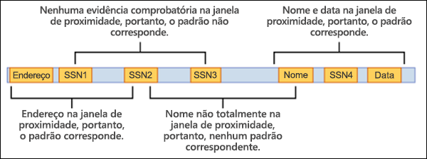

# <a name="learn-about-sensitive-information-types"></a><span data-ttu-id="11b81-102">Aprenda sobre os tipos de informações confidenciais</span><span class="sxs-lookup"><span data-stu-id="11b81-102">Learn about sensitive information types</span></span>

<span data-ttu-id="11b81-103">Identificar e classificar itens confidenciais que estão sob o controle de suas organizações é a primeira etapa da disciplina [proteção de informações.](./information-protection.md)</span><span class="sxs-lookup"><span data-stu-id="11b81-103">Identifying and classifying sensitive items that are under your organizations control is the first step in the [Information Protection discipline](./information-protection.md).</span></span>  <span data-ttu-id="11b81-104">Microsoft 365 fornece três maneiras de identificar itens para que possam ser classificados:</span><span class="sxs-lookup"><span data-stu-id="11b81-104">Microsoft 365 provides three ways of identifying items so that they can be classified:</span></span>

- <span data-ttu-id="11b81-105">manualmente pelos usuários</span><span class="sxs-lookup"><span data-stu-id="11b81-105">manually by users</span></span>
- <span data-ttu-id="11b81-106">reconhecimento de padrão automatizado, como tipos de informações confidenciais</span><span class="sxs-lookup"><span data-stu-id="11b81-106">automated pattern recognition, like sensitive information types</span></span>
- [<span data-ttu-id="11b81-107">machine learning</span><span class="sxs-lookup"><span data-stu-id="11b81-107">machine learning</span></span>](classifier-learn-about.md)

<span data-ttu-id="11b81-108">Os tipos de informações confidenciais são classificadores baseados em padrão.</span><span class="sxs-lookup"><span data-stu-id="11b81-108">Sensitive information types are pattern-based classifiers.</span></span> <span data-ttu-id="11b81-109">Eles detectam informações confidenciais, como previdência social, cartão de crédito ou números de conta bancária para identificar itens confidenciais, consulte [Definições de entidades](sensitive-information-type-entity-definitions.md) de tipos de informações confidenciais</span><span class="sxs-lookup"><span data-stu-id="11b81-109">They detect sensitive information like social security, credit card, or bank account numbers to identify sensitive items, see [Sensitive information types entity definitions](sensitive-information-type-entity-definitions.md)</span></span>

## <a name="sensitive-information-types-are-used-in"></a><span data-ttu-id="11b81-110">Tipos de informações confidenciais são usados em</span><span class="sxs-lookup"><span data-stu-id="11b81-110">Sensitive information types are used in</span></span>

- [<span data-ttu-id="11b81-111">Políticas de prevenção contra perda de dados</span><span class="sxs-lookup"><span data-stu-id="11b81-111">Data loss prevention policies</span></span>](dlp-learn-about-dlp.md) 
- [<span data-ttu-id="11b81-112">Rótulos de confidencialidade</span><span class="sxs-lookup"><span data-stu-id="11b81-112">Sensitivity labels</span></span>](sensitivity-labels.md)
- [<span data-ttu-id="11b81-113">Rótulos de retenção</span><span class="sxs-lookup"><span data-stu-id="11b81-113">Retention labels</span></span>](retention.md)
- [<span data-ttu-id="11b81-114">Gerenciamento de riscos insider</span><span class="sxs-lookup"><span data-stu-id="11b81-114">Insider risk management</span></span>](insider-risk-management.md)
- [<span data-ttu-id="11b81-115">Conformidade em comunicações</span><span class="sxs-lookup"><span data-stu-id="11b81-115">Communication compliance</span></span>](communication-compliance.md)
- [<span data-ttu-id="11b81-116">Políticas de rotulagem automática</span><span class="sxs-lookup"><span data-stu-id="11b81-116">Auto-labelling policies</span></span>](apply-sensitivity-label-automatically.md#how-to-configure-auto-labeling-for-office-apps)

## <a name="fundamental-parts-of-a-sensitive-information-type"></a><span data-ttu-id="11b81-117">Partes fundamentais de um tipo de informação confidenciais</span><span class="sxs-lookup"><span data-stu-id="11b81-117">Fundamental parts of a sensitive information type</span></span>

<span data-ttu-id="11b81-118">Todas as entidades de tipo de informação confidenciais são definidas por esses campos:</span><span class="sxs-lookup"><span data-stu-id="11b81-118">Every sensitive information type entity is defined by these fields:</span></span>

- <span data-ttu-id="11b81-119">name: como o tipo de informação sensível é chamado</span><span class="sxs-lookup"><span data-stu-id="11b81-119">name: how the sensitive information type is referred to</span></span>
- <span data-ttu-id="11b81-120">description: descreve o que o tipo de informação confidenciais está procurando</span><span class="sxs-lookup"><span data-stu-id="11b81-120">description: describes what the sensitive information type is looking for</span></span>
- <span data-ttu-id="11b81-121">padrão: um padrão define o que um tipo de informação sensível detecta.</span><span class="sxs-lookup"><span data-stu-id="11b81-121">pattern: A pattern defines what a sensitive information type detects.</span></span> <span data-ttu-id="11b81-122">Ele consiste nos seguintes componentes</span><span class="sxs-lookup"><span data-stu-id="11b81-122">It consists of the following components</span></span>
    - <span data-ttu-id="11b81-123">Elemento principal – o elemento principal que o tipo de informação sensível está procurando.</span><span class="sxs-lookup"><span data-stu-id="11b81-123">Primary element – the main element that the sensitive information type is looking for.</span></span> <span data-ttu-id="11b81-124">Pode ser uma expressão **regular com** ou sem uma validação de verificação, uma lista de palavras-chave **,** um dicionário de palavras-chave **ou** uma **função**.</span><span class="sxs-lookup"><span data-stu-id="11b81-124">It can be a **regular expression** with or without a checksum validation, a **keyword list**, a **keyword dictionary**, or a **function**.</span></span>
    - <span data-ttu-id="11b81-125">Elemento de suporte – elementos que atuam como evidências de suporte que ajudam a aumentar a confiança da partida.</span><span class="sxs-lookup"><span data-stu-id="11b81-125">Supporting element – elements that act as supporting evidence that help in increasing the confidence of the match.</span></span> <span data-ttu-id="11b81-126">Por exemplo, palavra-chave "SSN" na proximidade de um número SSN.</span><span class="sxs-lookup"><span data-stu-id="11b81-126">For example, keyword “SSN” in proximity of an SSN number.</span></span> <span data-ttu-id="11b81-127">Pode ser uma expressão regular com ou sem uma validação de verificação, lista de palavras-chave, dicionário de palavras-chave.</span><span class="sxs-lookup"><span data-stu-id="11b81-127">It can be a regular expression with or without a checksum validation, keyword list, keyword dictionary.</span></span>
    - <span data-ttu-id="11b81-128">Nível de confiança - níveis de confiança (alto, médio, baixo) refletem a quanta evidência de suporte foi detectada juntamente com o elemento principal.</span><span class="sxs-lookup"><span data-stu-id="11b81-128">Confidence Level - Confidence levels (high, medium, low) reflect how much supporting evidence was detected along with the primary element.</span></span> <span data-ttu-id="11b81-129">Quanto mais evidências de suporte um item contiver, maior será a confiança de que um item matched contém as informações confidenciais que você está procurando.</span><span class="sxs-lookup"><span data-stu-id="11b81-129">The more supporting evidence an item contains, the higher the confidence that a matched item contains the sensitive info you're looking for.</span></span>
    - <span data-ttu-id="11b81-130">Proximidade – Número de caracteres entre o elemento principal e o elemento de suporte</span><span class="sxs-lookup"><span data-stu-id="11b81-130">Proximity – Number of characters between primary and supporting element</span></span>



<span data-ttu-id="11b81-132">Saiba mais sobre níveis de confiança neste vídeo</span><span class="sxs-lookup"><span data-stu-id="11b81-132">Learn more about confidence levels in this video</span></span>


 > [!VIDEO https://www.microsoft.com/videoplayer/embed/RE4Hx60]  

### <a name="example-sensitive-information-type"></a><span data-ttu-id="11b81-133">Exemplo de tipo de informação confidenciais</span><span class="sxs-lookup"><span data-stu-id="11b81-133">Example sensitive information type</span></span>


## <a name="argentina-national-identity-dni-number"></a><span data-ttu-id="11b81-134">Número DNI (identidade nacional da Argentina)</span><span class="sxs-lookup"><span data-stu-id="11b81-134">Argentina national identity (DNI) number</span></span>

### <a name="format"></a><span data-ttu-id="11b81-135">Formatar</span><span class="sxs-lookup"><span data-stu-id="11b81-135">Format</span></span>

<span data-ttu-id="11b81-136">Oito dígitos separados por pontos</span><span class="sxs-lookup"><span data-stu-id="11b81-136">Eight digits separated by periods</span></span>

### <a name="pattern"></a><span data-ttu-id="11b81-137">Padrão</span><span class="sxs-lookup"><span data-stu-id="11b81-137">Pattern</span></span>

<span data-ttu-id="11b81-138">Oito dígitos:</span><span class="sxs-lookup"><span data-stu-id="11b81-138">Eight digits:</span></span>
- <span data-ttu-id="11b81-139">dois dígitos</span><span class="sxs-lookup"><span data-stu-id="11b81-139">two digits</span></span>
- <span data-ttu-id="11b81-140">um ponto</span><span class="sxs-lookup"><span data-stu-id="11b81-140">a period</span></span>
- <span data-ttu-id="11b81-141">três dígitos</span><span class="sxs-lookup"><span data-stu-id="11b81-141">three digits</span></span>
- <span data-ttu-id="11b81-142">um ponto</span><span class="sxs-lookup"><span data-stu-id="11b81-142">a period</span></span>
- <span data-ttu-id="11b81-143">três dígitos</span><span class="sxs-lookup"><span data-stu-id="11b81-143">three digits</span></span>

### <a name="checksum"></a><span data-ttu-id="11b81-144">Soma de verificação</span><span class="sxs-lookup"><span data-stu-id="11b81-144">Checksum</span></span>

<span data-ttu-id="11b81-145">Não</span><span class="sxs-lookup"><span data-stu-id="11b81-145">No</span></span>

### <a name="definition"></a><span data-ttu-id="11b81-146">Definição</span><span class="sxs-lookup"><span data-stu-id="11b81-146">Definition</span></span>

<span data-ttu-id="11b81-147">Uma política de DLP tem confiança média de que detectou esse tipo de informação confidenciais se, dentro de uma proximidade de 300 caracteres:</span><span class="sxs-lookup"><span data-stu-id="11b81-147">A DLP policy has medium confidence that it's detected this type of sensitive information if, within a proximity of 300 characters:</span></span>
- <span data-ttu-id="11b81-148">A expressão regular Regex_argentina_national_id encontra conteúdo que corresponde ao padrão.</span><span class="sxs-lookup"><span data-stu-id="11b81-148">The regular expression Regex_argentina_national_id finds content that matches the pattern.</span></span>
- <span data-ttu-id="11b81-149">Uma palavra-chave Keyword_argentina_national_id é encontrada.</span><span class="sxs-lookup"><span data-stu-id="11b81-149">A keyword from Keyword_argentina_national_id is found.</span></span>

```xml
<!-- Argentina National Identity (DNI) Number -->
<Entity id="eefbb00e-8282-433c-8620-8f1da3bffdb2" recommendedConfidence="75" patternsProximity="300">
   <Pattern confidenceLevel="75">
      <IdMatch idRef="Regex_argentina_national_id"/>
      <Match idRef="Keyword_argentina_national_id"/>
  </Pattern>
</Entity>
```

### <a name="keywords"></a><span data-ttu-id="11b81-150">Palavras-chave</span><span class="sxs-lookup"><span data-stu-id="11b81-150">Keywords</span></span>

#### <a name="keyword_argentina_national_id"></a><span data-ttu-id="11b81-151">Keyword_argentina_national_id</span><span class="sxs-lookup"><span data-stu-id="11b81-151">Keyword_argentina_national_id</span></span>

- <span data-ttu-id="11b81-152">Número de Identidade Nacional da Argentina</span><span class="sxs-lookup"><span data-stu-id="11b81-152">Argentina National Identity number</span></span> 
- <span data-ttu-id="11b81-153">Identidade</span><span class="sxs-lookup"><span data-stu-id="11b81-153">Identity</span></span> 
- <span data-ttu-id="11b81-154">Identificação do Cartão de Identidade Nacional</span><span class="sxs-lookup"><span data-stu-id="11b81-154">Identification National Identity Card</span></span> 
- <span data-ttu-id="11b81-155">DNI</span><span class="sxs-lookup"><span data-stu-id="11b81-155">DNI</span></span> 
- <span data-ttu-id="11b81-156">Registro Nacional de Pessoas da NIC</span><span class="sxs-lookup"><span data-stu-id="11b81-156">NIC National Registry of Persons</span></span> 
- <span data-ttu-id="11b81-157">Documento Nacional de Identidad</span><span class="sxs-lookup"><span data-stu-id="11b81-157">Documento Nacional de Identidad</span></span> 
- <span data-ttu-id="11b81-158">Registro Nacional de las Personas</span><span class="sxs-lookup"><span data-stu-id="11b81-158">Registro Nacional de las Personas</span></span> 
- <span data-ttu-id="11b81-159">Identidad</span><span class="sxs-lookup"><span data-stu-id="11b81-159">Identidad</span></span> 
- <span data-ttu-id="11b81-160">Identificación</span><span class="sxs-lookup"><span data-stu-id="11b81-160">Identificación</span></span> 

### <a name="more-on-confidence-levels"></a><span data-ttu-id="11b81-161">Mais sobre níveis de confiança</span><span class="sxs-lookup"><span data-stu-id="11b81-161">More on confidence levels</span></span>

<span data-ttu-id="11b81-162">Em uma definição de entidade de tipo de informação **confidenciais,** o nível de confiança reflete a quanta evidência de suporte é detectada além do elemento principal.</span><span class="sxs-lookup"><span data-stu-id="11b81-162">In a sensitive information type entity definition, **confidence level** reflects how much supporting evidence is detected in addition to the primary element.</span></span> <span data-ttu-id="11b81-163">Quanto mais evidências de suporte um item contiver, maior será a confiança de que um item matched contém as informações confidenciais que você está procurando.</span><span class="sxs-lookup"><span data-stu-id="11b81-163">The more supporting evidence an item contains, the higher the confidence that a matched item contains the sensitive info you're looking for.</span></span> <span data-ttu-id="11b81-164">Por exemplo, as combinações com um alto nível de confiança conterão mais evidências de suporte na proximidade do elemento principal, enquanto as combinações com um nível de confiança baixo conteriam pouca ou nenhuma evidência de suporte próxima.</span><span class="sxs-lookup"><span data-stu-id="11b81-164">For example, matches with a high confidence level will contain more supporting evidence in close proximity of the primary element, whereas matches with a low confidence level would contain little to no supporting evidence in close proximity.</span></span> 

<span data-ttu-id="11b81-165">Um nível de confiança alto retorna o menor número de falsos positivos, mas pode resultar em mais falsos negativos.</span><span class="sxs-lookup"><span data-stu-id="11b81-165">A high confidence level returns the fewest false positives but might result in more false negatives.</span></span> <span data-ttu-id="11b81-166">Níveis de confiança baixos ou médios retornam mais falsos positivos, mas poucos a zero falsos negativos.</span><span class="sxs-lookup"><span data-stu-id="11b81-166">Low or medium confidence levels returns more false positives but few to zero false negatives.</span></span>

- <span data-ttu-id="11b81-167">**baixa confiança**: o valor de 65 itens matched conterá o menor número de falsos negativos, mas os mais falsos positivos.</span><span class="sxs-lookup"><span data-stu-id="11b81-167">**low confidence**: Value of 65, matched items will contain the fewest false negatives but the most false positives.</span></span> <span data-ttu-id="11b81-168">Baixa confiança retorna todas as partidas de baixa, média e alta confiança.</span><span class="sxs-lookup"><span data-stu-id="11b81-168">Low confidence returns all low, medium, and high confidence matches.</span></span>
- <span data-ttu-id="11b81-169">**confiança média**: Valor de 75, itens matched conterão uma quantidade média de falsos positivos e falsos negativos.</span><span class="sxs-lookup"><span data-stu-id="11b81-169">**medium confidence**: Value of 75, matched items will contain an average amount of false positives and false negatives.</span></span> <span data-ttu-id="11b81-170">A confiança média retorna todas as combinações médias e de alta confiança.</span><span class="sxs-lookup"><span data-stu-id="11b81-170">Medium confidence returns all medium, and high confidence matches.</span></span>  
- <span data-ttu-id="11b81-171">**alta confiança**: o valor de 85 itens matched conterá o menor número de falsos positivos, mas os mais falsos negativos.</span><span class="sxs-lookup"><span data-stu-id="11b81-171">**high confidence**: Value of 85, matched items will contain the fewest false positives but the most false negatives.</span></span> <span data-ttu-id="11b81-172">A alta confiança só retorna as partidas de alta confiança.</span><span class="sxs-lookup"><span data-stu-id="11b81-172">High confidence only returns high confidence matches.</span></span>  

<span data-ttu-id="11b81-173">Você deve usar padrões de alto nível de confiança com contagens baixas, digamos cinco a dez e padrões de baixa confiança com contagens mais altas, digamos 20 ou mais.</span><span class="sxs-lookup"><span data-stu-id="11b81-173">You should use high confidence level patterns with low counts, say five to ten, and low confidence patterns with higher counts, say 20 or more.</span></span>

> [!NOTE]
> <span data-ttu-id="11b81-174">Se você tiver políticas existentes ou SITs (tipos de informações confidenciais personalizados) definidos usando níveis de confiança baseados em número (também sabem como precisão), eles serão automaticamente mapeados para os três níveis de confiança discretos; baixa confiança, confiança média e alta confiança na interface do usuário do Centro de Conformidade e Segurança.</span><span class="sxs-lookup"><span data-stu-id="11b81-174">If you have existing policies or custom sensitive information types (SITs) defined using number-based confidence levels (also know as accuracy), they will automatically be mapped to the three discrete confidence levels; low confidence, medium confidence, and high confidence, across the Security @ Compliance Center UI.</span></span>
> - <span data-ttu-id="11b81-175">Todas as políticas com precisão mínima ou padrões SIT personalizados com níveis de confiança entre 76 e 100 serão mapeadas para alta confiança.</span><span class="sxs-lookup"><span data-stu-id="11b81-175">All policies with minimum accuracy or custom SIT patterns with confidence levels of between 76 and 100 will be mapped to high confidence.</span></span> 
> - <span data-ttu-id="11b81-176">Todas as políticas com precisão mínima ou padrões SIT personalizados com níveis de confiança entre 66 e 75 serão mapeadas para confiança média.</span><span class="sxs-lookup"><span data-stu-id="11b81-176">All policies with minimum accuracy or custom SIT patterns with confidence levels of between 66 and 75 will be mapped to medium confidence.</span></span>
> - <span data-ttu-id="11b81-177">Todas as políticas com precisão mínima ou padrões SIT personalizados com níveis de confiança menores ou iguais a 65 serão mapeadas para baixa confiança.</span><span class="sxs-lookup"><span data-stu-id="11b81-177">All policies with minimum accuracy or custom SIT patterns with confidence levels less than or equal to 65 will be mapped to low confidence.</span></span> 

## <a name="creating-custom-sensitive-information-types"></a><span data-ttu-id="11b81-178">Criando tipos de informações confidenciais personalizadas</span><span class="sxs-lookup"><span data-stu-id="11b81-178">Creating custom sensitive information types</span></span>

<span data-ttu-id="11b81-179">Para criar tipos de informações confidenciais personalizadas no Centro de Conformidade e Segurança, você pode escolher entre várias opções:</span><span class="sxs-lookup"><span data-stu-id="11b81-179">To create custom sensitive information types in the Security & Compliance Center, you can choose from several options:</span></span>

- <span data-ttu-id="11b81-180">**Usar a interface do usuário** Você pode configurar um tipo de informações confidenciais personalizadas usando o a interface do usuário do Centro de Conformidade e Segurança.</span><span class="sxs-lookup"><span data-stu-id="11b81-180">**Use the UI** You can set up a custom sensitive information type using the Security & Compliance Center UI.</span></span> <span data-ttu-id="11b81-181">Com esse método, você pode usar expressões comuns, palavras-chave e dicionários de palavras-chave.</span><span class="sxs-lookup"><span data-stu-id="11b81-181">With this method, you can use regular expressions, keywords, and keyword dictionaries.</span></span> <span data-ttu-id="11b81-182">Para saber mais, confira [Criar um tipo de informações confidenciais personalizadas](create-a-custom-sensitive-information-type.md).</span><span class="sxs-lookup"><span data-stu-id="11b81-182">To learn more, see [Create a custom sensitive information type](create-a-custom-sensitive-information-type.md).</span></span>

- <span data-ttu-id="11b81-183">**Use EDM** Você pode configurar tipos de informações confidenciais personalizadas usando a classificação baseada em EDM (Exact Data Match).</span><span class="sxs-lookup"><span data-stu-id="11b81-183">**Use EDM** You can set up custom sensitive information types using Exact Data Match (EDM)-based classification.</span></span> <span data-ttu-id="11b81-184">Esse método permite criar um tipo de informações confidenciais dinâmico usando um banco de dados seguro que você pode atualizar periodicamente.</span><span class="sxs-lookup"><span data-stu-id="11b81-184">This method enables you to create a dynamic sensitive information type using a secure database that you can refresh periodically.</span></span> <span data-ttu-id="11b81-185">Confira [Criar um tipo de informações confidenciais personalizadas com classificação baseada em Exact Data Match](create-custom-sensitive-information-types-with-exact-data-match-based-classification.md).</span><span class="sxs-lookup"><span data-stu-id="11b81-185">See [Create a custom sensitive information type with Exact Data Match based classification](create-custom-sensitive-information-types-with-exact-data-match-based-classification.md).</span></span>

- <span data-ttu-id="11b81-186">**Use o PowerShell** Você pode configurar tipos de informações confidenciais personalizadas usando o PowerShell.</span><span class="sxs-lookup"><span data-stu-id="11b81-186">**Use PowerShell** You can set up custom sensitive information types using PowerShell.</span></span> <span data-ttu-id="11b81-187">Embora esse método seja mais complexo do que usar a interface do usuário, você tem mais opções de configuração.</span><span class="sxs-lookup"><span data-stu-id="11b81-187">Although this method is more complex than using the UI, you have more configuration options.</span></span> <span data-ttu-id="11b81-188">Consulte [Criar um tipo de informações confidenciais personalizadas no Centro de Conformidade e Segurança do PowerShell](create-a-custom-sensitive-information-type-in-scc-powershell.md).</span><span class="sxs-lookup"><span data-stu-id="11b81-188">See [Create a custom sensitive information type in Security & Compliance Center PowerShell](create-a-custom-sensitive-information-type-in-scc-powershell.md).</span></span>


> [!NOTE]
> <span data-ttu-id="11b81-189">Níveis de confiança aprimorados estão disponíveis para uso imediato na Prevenção contra Perda de Dados para serviços Microsoft 365, Proteção de Informações da Microsoft para serviços Microsoft 365, Conformidade de Comunicação, Governança de Informações e Gerenciamento de Registros.</span><span class="sxs-lookup"><span data-stu-id="11b81-189">Improved confidence levels are available for immediate use within Data Loss Prevention for Microsoft 365 services, Microsoft Information Protection for Microsoft 365 services, Communication Compliance, Information Governance, and Records Management.</span></span>

> <span data-ttu-id="11b81-190">A Proteção de Informações do Microsoft 365 agora oferece suporte a idiomas de conjunto de caracteres de byte duplo de visualização:</span><span class="sxs-lookup"><span data-stu-id="11b81-190">Microsoft 365 Information Protection now  supports in preview double byte character set languages for:</span></span>
> - <span data-ttu-id="11b81-191">Chinês (simplificado)</span><span class="sxs-lookup"><span data-stu-id="11b81-191">Chinese (simplified)</span></span>
> - <span data-ttu-id="11b81-192">Chinês (tradicional)</span><span class="sxs-lookup"><span data-stu-id="11b81-192">Chinese (traditional)</span></span>
> - <span data-ttu-id="11b81-193">Coreano</span><span class="sxs-lookup"><span data-stu-id="11b81-193">Korean</span></span>
> - <span data-ttu-id="11b81-194">Japonês</span><span class="sxs-lookup"><span data-stu-id="11b81-194">Japanese</span></span>

><span data-ttu-id="11b81-195">Este suporte está disponível para tipos de informações confidenciais.</span><span class="sxs-lookup"><span data-stu-id="11b81-195">This support is available for sensitive information types.</span></span> <span data-ttu-id="11b81-196">Para obter mais informações, confira [Suporte à proteção de informações para notas de versão de conjuntos de caracteres de byte duplo (visualização)](mip-dbcs-relnotes.md).</span><span class="sxs-lookup"><span data-stu-id="11b81-196">See, [Information protection support for double byte character sets release notes (preview)](mip-dbcs-relnotes.md) for more information.</span></span>

## <a name="for-further-information"></a><span data-ttu-id="11b81-197">Para obter mais informações</span><span class="sxs-lookup"><span data-stu-id="11b81-197">For further information</span></span>
- [<span data-ttu-id="11b81-198">Definições da entidade do tipo de informações confidenciais</span><span class="sxs-lookup"><span data-stu-id="11b81-198">Sensitive information type entity definitions</span></span>](sensitive-information-type-entity-definitions.md)
- [<span data-ttu-id="11b81-199">Criar um tipo de informação confidencial personalizado</span><span class="sxs-lookup"><span data-stu-id="11b81-199">Create a custom sensitive information type</span></span>](create-a-custom-sensitive-information-type.md)
- [<span data-ttu-id="11b81-200">Criar um tipo personalizado de informações confidenciais no PowerShell</span><span class="sxs-lookup"><span data-stu-id="11b81-200">Create a custom sensitive information type in PowerShell</span></span>](create-a-custom-sensitive-information-type-in-scc-powershell.md)

<span data-ttu-id="11b81-201">Para saber como usar tipos de informações confidenciais para estar em conformidade com os regulamentos de privacidade de dados, consulte [Deploy information protection for data privacy regulations with Microsoft 365](../solutions/information-protection-deploy.md) (aka.ms/m365dataprivacy).</span><span class="sxs-lookup"><span data-stu-id="11b81-201">To learn how to use sensitive information types to comply with data privacy regulations, see [Deploy information protection for data privacy regulations with Microsoft 365](../solutions/information-protection-deploy.md)  (aka.ms/m365dataprivacy).</span></span>

<!-- fwlink for this topic https://go.microsoft.com/fwlink/?linkid=2135644-->