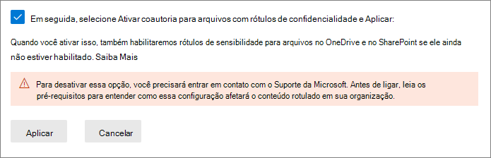
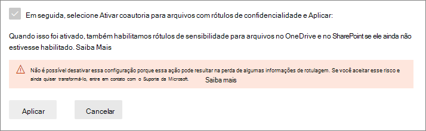

# <a name="enable-co-authoring-for-files-encrypted-with-sensitivity-labels"></a>Ativar a coautoria para arquivos criptografados com rótulos de confidencialidade

>*[Diretrizes de licenciamento do Microsoft 365 para segurança e conformidade](/office365/servicedescriptions/microsoft-365-service-descriptions/microsoft-365-tenantlevel-services-licensing-guidance/microsoft-365-security-compliance-licensing-guidance).*

> [!NOTE]
> Este recurso está em versão prévia e sujeito a alterações. 
>
> Habilite este recurso em um locatário de teste em vez de um locatário de produção porque:
> - Este recurso faz alterações na rotulagem de metadados e nem todos os aplicativos em todas as plataformas suportam essa alteração
> - Você não pode desabilitar esse recurso depois de ativá-lo

Habilite a configuração para suportar a [coautoria](https://support.office.com/article/ee1509b4-1f6e-401e-b04a-782d26f564a4) de aplicativos da área de trabalho do Office para que, quando os documentos forem rotulados e criptografados por [rótulos de confidencialidade](sensitivity-labels.md), vários usuários possam editar esses documentos ao mesmo tempo.

Sem essa configuração habilitada no seu locatário, os usuários deverão fazer check-out de um documento criptografado armazenado no SharePoint ou no OneDrive quando usarem aplicativos da área de trabalho do Office. Como resultado, eles não podem colaborar em tempo real. Ou então, eles devem usar o Office na Web quando os [rótulos de confidencialidade estão habilitados para arquivos do Office no SharePoint e no OneDrive](sensitivity-labels-sharepoint-onedrive-files.md).

Além disso, a habilitação desse recurso resulta no suporte da funcionalidade [Salvamento Automático](https://support.office.com/article/what-is-autosave-6d6bd723-ebfd-4e40-b5f6-ae6e8088f7a5) para estes arquivos rotulados e criptografados.

Para ler o comunicado de lançamento, veja a postagem no blog [Anunciando a coautoria nas atualizações de rótulos e em documentos criptografados da Proteção de Informações da Microsoft.](https://techcommunity.microsoft.com/t5/microsoft-security-and/announcing-co-authoring-on-microsoft-information-protection/ba-p/2164162)

## <a name="metadata-changes-for-sensitivity-labels"></a>Alterações de metadados para rótulos de confidencialidade

> [!IMPORTANT]
> Depois que você habilitar a configuração para coautoria, as informações de rotulagem de arquivos não criptografados não são mais salvas nas propriedades personalizadas.
> 
> Não habilite essa configuração se você tiver aplicativos, serviços, scripts ou ferramentas que leem ou gravem metadados de rotulagem no local antigo.

Antes de habilitar a configuração para suportar a coautoria para aplicativos da área de trabalho do Office, é importante compreender que essa ação faz alterações nos metadados de rotulagem salvos e lidos dos arquivos do Office.

Os metadados de rotulagem incluem informações que identificam seu locatário e o rótulo de confidencialidade aplicado. A alteração que essa configuração faz é no formato de metadados e no local de arquivos não criptografados para o Word, Excel e PowerPoint. Não há nenhuma alteração nos metadados de rolatuagem para arquivos criptografados ou emails.

Essa alteração afeta tanto os arquivos que foram rotulados recentemente quanto os arquivos que já estão rotulados. Quando você usa aplicativos e serviços dão suporte à configuração de coautoria:
- Para arquivos rotulados recentemente, apenas o novo formato e local são usados para os metadados de rotulagem.
- Para arquivos que já estão rotulados, na próxima vez que o arquivo for aberto e salvo, se o arquivo tiver metadados no formato e local antigos, ele será copiado para o novo formato e local.

Você pode ler mais sobre essa alteração de metadados nos seguintes recursos:

- Postagem no blog: [Futuras alterações no armazenamento de metadados da Proteção de Informações da Microsoft](https://techcommunity.microsoft.com/t5/microsoft-security-and/upcoming-changes-to-microsoft-information-protection-metadata/ba-p/1904418)

- Open Specifications: [2.6.3 LabelInfo versus Propriedades personalizadas do documento](/openspecs/office_file_formats/ms-offcrypto/13939de6-c833-44ab-b213-e0088bf02341)

Por causa dessas mudanças, não habilite essa configuração se você tiver aplicativos, serviços, scripts ou ferramentas em sua organização que leem ou gravem metadados de rotulagem no local antigo. Se você fizer isso, aqui estão alguns exemplos de consequências:

- Um documento rotulado parece não estar rotulado para os usuários

- Um documento exibe um rótulo desatualizado para os usuários

- A coautoria e o Salvamento Automático não funcionarão em um documento rotulado e criptografado se outro usuário o tiver aberto em um aplicativo da área de trabalho do Office que não suporta os novos metadados de rotulagem

- Uma regra de fluxo de emails do Exchange Online que [identifica rótulos como propriedades personalizadas em anexos do Office](/azure/information-protection/configure-exo-rules#example-2-rule-that-applies-the-encrypt-only-option-to-emails-when-they-have-attachments-that-are-labeled-confidential--partners-and-these-emails-are-sent-outside-the-organization) falha ao criptografar o email e o anexo ou os criptografa da forma incorreta

Verifique na seção seguinte uma lista de aplicativos e serviços que suportam essa configuração e as alterações nos metadados de rotulagem.

## <a name="prerequisites"></a>Pré-requisitos

Tenha certeza de que entende os seguintes pré-requisitos antes de ativar esse recurso.

- Você deve usar um locatário de teste para essa versão prévia.

- Você deve ser administrador global para ativar este recurso.

- Os rótulos de confidencialidade devem ser [habilitados para arquivos do Office no SharePoint e no OneDrive](sensitivity-labels-sharepoint-onedrive-files.md) para o locatário. Se esse recurso ainda não estiver habilitado, ele será automaticamente habilitado quando você selecionar a configuração para ativar a coautoria de arquivos com rótulos de confidencialidade.

- Microsoft 365 Apps para Grandes Empresas:
    - **Windows**: Visualização: [Canal Atual (Visualização)](https://office.com/insider)
    - **macOS**: Visualização: [Canal Beta](https://office.com/insider)
    - **iOS**: ainda sem suporte
    - **Android**: ainda sem suporte

- Todos os aplicativos, serviços e ferramentas operacionais em seu locatário devem ser compatíveis com os novos [metadados de rotulagem](#metadata-changes-for-sensitivity-labels). Se você usar qualquer um dos seguintes recursos, verifique as versões mínimas necessárias:
    
    - **Cliente e scanner de rotulagem unificada da Proteção de Informações do Azure:**
        - Uma versão prévia pública (nome de instalação do AzInfoProtection_2.10.46_CoAuthoring_PublicPreview.exe) que você pode instalar a partir do [Centro de Download da Microsoft](https://www.microsoft.com/en-us/download/details.aspx?id=53018)
    
    - **Aplicativo de sincronização do OneDrive para Windows ou macOS:**
        - Versão mínima de 19.002.0121.0008
    
    - **Prevenção contra Perda de Dados de Ponto de Extremidade (DLP do ponto de extremidade):**
        - Windows 10 1809 com KB 4601383
        - Windows 10 1903 e 1909 com KB 4601380
        - Windows 10 2004 com KB 4601382
    
    - **Aplicativos e serviços que usam o SDK da Proteção de Informações da Microsoft:** 
        - Versão mínima de 1.7 

Os serviços do Microsoft 365 suportam automaticamente os novos metadados de rotulagem quando você ativa esse recurso. Por exemplo:

- [Políticas de rotulagem automática](apply-sensitivity-label-automatically.md#how-to-configure-auto-labeling-policies-for-sharepoint-onedrive-and-exchange)
- [Políticas DLP que usam rótulos de confidencialidade como condições](dlp-sensitivity-label-as-condition.md)
- [Microsoft Cloud App Security configurado para aplicar rótulos de confidencialidade](/cloud-app-security/best-practices#discover-classify-label-and-protect-regulated-and-sensitive-data-stored-in-the-cloud)

## <a name="limitations"></a>Limitações

Antes de habilitar a configuração do locatário para coautoria de arquivos criptografados com rótulos de confidencialidade, certifique-se de que você compreenda as seguintes limitações deste recurso.

- Devido às [alterações nos metadados de rotulagem](#metadata-changes-for-sensitivity-labels), todos os aplicativos, serviços e ferramentas operacionais em seu locatário devem suportar os novos metadados de rotulagem para uma experiência de rotulagem consistente e confiável.
    
    Específica para o Excel: os metadados de um rótulo de confidencialidade que não aplica criptografia podem ser excluídos de um arquivo se alguém editar e salvar este arquivo usando uma versão do Excel que não suporta as alterações de metadados para rótulos de confidencialidade.

- A coautoria e o Salvamento Automático não são suportados e não funcionam em documentos do Office rotulados e criptografados que usam qualquer uma das seguintes configurações de [criptografia](encryption-sensitivity-labels.md#configure-encryption-settings):
    - **Permitir que os usuários atribuam permissões quando aplicarem o rótulo** e a caixa de seleção **no Word, PowerPoint e Excel, solicitar que os usuários especifiquem as permissões** está selecionada. Essa configuração às vezes é chamada de "permissões definidas pelo usuário".
    - **O acesso do usuário ao conteúdo expira** é definido como um valor diferente de **Nunca**.
    - **Criptografia de Chave Dupla** é selecionada.
    
    Para rótulos com qualquer uma dessas configurações de criptografia, os rótulos são exibidos nos aplicativos do Office. No entanto, quando os usuários selecionam esses rótulos e ninguém mais está editando o documento, eles são avisados de que a coautoria e o Salvamento Automático não estarão disponíveis. Se outra pessoa estiver editando o documento, os usuários verão uma mensagem informando que os rótulos não podem ser aplicados.

- Se você usa o cliente de rotulagem unificada da Proteção de Informações do Azure: Verifique a documentação desse cliente de rotulagem para [mais requisitos ou limitações](/azure/information-protection/known-issues#known-issues-for-co-authoring-public-preview).

## <a name="known-issues-for-this-preview"></a>Problemas conhecidos para esta versão prévia

Esta versão prévia da coautoria para arquivos criptografados com rótulos de confidencialidade tem os seguintes problemas conhecidos:

- Os usuários não poderão aplicar rótulos no Office para a Web para arquivos do Word, Excel e PowerPoint maiores que 300 MB. Para esses arquivos, você pode usar os aplicativos da área de trabalho do Office para aplicar um rótulo, mas deve ser a única pessoa que está com o arquivo aberto.

- Quando você usa [políticas DLP que usam rótulos de confidencialidade como condições](dlp-sensitivity-label-as-condition.md), não há suporte para anexos não criptografados para emails.

- Não há suporte para aplicativos do Office para iOS e Android.

## <a name="how-to-enable-co-authoring-for-files-with-sensitivity-labels"></a>Como ativar a coautoria para arquivos com rótulos de confidencialidade

> [!CAUTION]
> Ativar essa configuração é uma ação unidirecional. Enquanto o recurso estiver em versão preliminar, teste-o somente em um ambiente de não produção e apenas depois que você ler e compreender as alterações de metadados, pré-requisitos, limitações e quaisquer problemas conhecidos documentados nesta página.

Durante a versão preliminar, você deve usar uma URL específica para acessar essa configuração no Centro de conformidade do Microsoft 365.

1. Entre no Centro de conformidade do Microsoft 365 como um administrador global para seu locatário de teste, usando link a seguir:
    
    ```http
    https://compliance.microsoft.com/co-authoring_for_files_with_sensitivity_labels
    ```
    Esse link leva você diretamente para a configuração do locatário, **Coautoria para arquivos com rótulos de confidencialidade**.

    > [!IMPORTANT]
    > Antes de continuar, verifique se você está conectado em um locatário de teste que não afetará seus usuários: 
    >
    > Selecione o círculo com as iniciais da sua conta no canto superior direito do centro de conformidade e confirme se o nome do locatário exibe o locatário de teste desejado.
    
2. Leia a descrição resumida, os pré-requisitos, o que esperar e o aviso de que você não poderá desativar essa configuração depois de ativá-la. Em seguida, selecione **Ativar coautoria para arquivos com rótulos de confidencialidade** e **Aplicar**:
    
    

3. Espere 24 horas para que essa configuração seja replicada no seu ambiente antes de testar esse novo recurso para coautoria.

## <a name="contact-support-if-you-need-to-disable-this-feature"></a>Entre em contato com o suporte se precisar desabilitar este recurso

> [!IMPORTANT]
> Se você precisar desabilitar esse recurso, saiba que as informações de rotulagem podem ser perdidas.

Depois de habilitar a coautoria para arquivos com rótulos de confidencialidade para seu locatário, você não poderá desabilitar essa configuração por conta própria. É por isso que é tão importante que você verifique e entenda os pré-requisitos, as consequências e as limitações antes de habilitar essa configuração. É também por isso que recomendamos que você teste esse recurso com um locatário de teste em vez de um locatário de produção.



Como você pode ver na captura de tela, quando esta configuração tiver sido ativada, você pode entrar em contato com o [Suporte da Microsoft](/office365/admin/contact-support-for-business-products) e solicitar a desativação dessa configuração. Essa solicitação pode levar alguns dias e você precisará provar que você é um administrador global do seu locatário. Espere que taxas de suporte habituais sejam aplicadas. 

Se um engenheiro de suporte desabilitar essa configuração no seu locatário:

- Para aplicativos e serviços que suportam os novos metadados de rotulagem, eles agora são revertidos para o formato e local de metadados originais quando os rótulos são lidos ou salvos.

- O novo formato e local de metadados dos documentos do Office que foram usados enquanto a configuração estava habilitada não serão copiados para o formato e o local originais. Como resultado, essas informações de rotulagem para arquivos não criptografados do Word, do Excel e do PowerPoint serão perdidas.

- A coautoria e o Salvar Automático não funcionam mais no seu locatário.

- Os rótulos de confidencialidade permanecem habilitados para arquivos do Office no OneDrive e no SharePoint.