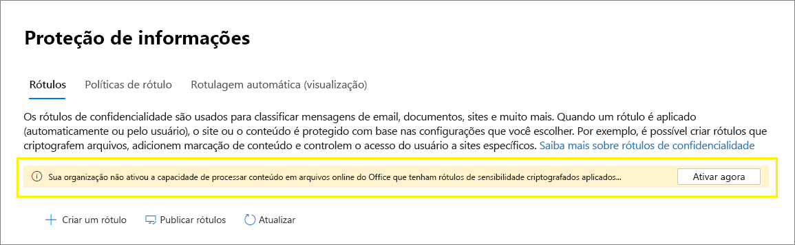

# <a name="enable-sensitivity-labels-for-office-files-in-sharepoint-and-onedrive"></a>Habilitar rótulos de confidencialidade para arquivos do Office no SharePoint e no OneDrive

>*[Diretrizes de licenciamento do Microsoft 365 para segurança e conformidade](https://aka.ms/ComplianceSD).*

Antes de habilitar os rótulos de confidencialidade para arquivos do Office no SharePoint e no OneDrive, você não pode aplicar seus [Rótulos de confidencialidade](sensitivity-labels.md) no Office na Web. Você não vê o botão **sensibilidade** na faixa de opções ou o nome do rótulo aplicado na barra de status. Além disso, se você usar aplicativos de área de trabalho para rotular seus arquivos e salvá-los no SharePoint ou no OneDrive, o serviço não poderá processar o conteúdo desses arquivos se o rótulo estiver aplicado. A coautoria, eDiscovery, prevenção de perda de dados, pesquisa e outros recursos colaborativos não funcionará nessas circunstâncias.

Quando você habilita rótulos de confidencialidade para arquivos do Office no SharePoint e no OneDrive, todos esses recursos são habilitados. Além de exibir rótulos de confidencialidade aos usuários, para arquivos novos e alterados que tenham um rótulo de sensibilidade aplicado que inclua criptografia com uma chave baseada na nuvem:

- O SharePoint reconhece rótulos de confidencialidade aplicados aos arquivos do Word, Excel e PowerPoint no SharePoint e no OneDrive: enquanto o arquivo é armazenado no SharePoint, a criptografia da proteção de informações do Azure é removida para que o conteúdo do arquivo possa ser processado. Para obter informações sobre como os documentos são protegidos enquanto estão armazenados no SharePoint, consulte [criptografia de dados no onedrive for Business e no SharePoint Online](data-encryption-in-odb-and-spo.md).

- Quando você baixa ou acessa esse arquivo do SharePoint ou do OneDrive, o rótulo de confidencialidade e todas as configurações de criptografia do rótulo são reaplicadas com o arquivo e essas configurações permanecem impostas sempre que o arquivo é salvo. Devido a esse comportamento, certifique-se de fornecer orientação do usuário para usar apenas os rótulos para proteger documentos. Para obter mais informações, consulte [Opções de gerenciamento de direitos de informação (IRM) e rótulos de confidencialidade](sensitivity-labels-office-apps.md#information-rights-management-irm-options-and-sensitivity-labels).

- Para o SharePoint remover a criptografia do arquivo no carregamento, o usuário que carrega o arquivo rotulado e criptografado deve ter direitos de uso para, pelo menos, exibir o arquivo. O SharePoint não removerá a criptografia de arquivos se o usuário não puder abri-lo fora do SharePoint.

- Use o Office na Web (Word, Excel, PowerPoint) para abrir e editar arquivos do Office com rótulos de confidencialidade que aplicam criptografia. As permissões que foram atribuídas com a criptografia são aplicadas. Com o Word na Web, você também pode usar o rotulamento automático ao editar esses documentos.

- O Office 365 eDiscovery oferece suporte à pesquisa de texto completo desses arquivos. As políticas de prevenção de perda de dados (DLP) abrangem conteúdo nesses arquivos.

> [!NOTE]
> Se a criptografia não tiver sido aplicada com uma chave baseada na nuvem, mas uma chave local, uma topologia de gerenciamento de chave freqüentemente chamada de "conter sua própria chave" (HYOK), o comportamento do SharePoint para processamento do conteúdo do arquivo não será alterado.
>
> O comportamento do SharePoint também não é alterado para arquivos criptografados e rotulados existentes no SharePoint. Para que esses arquivos se beneficiem dos novos recursos, eles devem ser baixados e carregados ou editados depois que você executar o comando para habilitar rótulos de confidencialidade para o SharePoint e o OneDrive. Por exemplo, eles serão retornados em resultados de pesquisa e de descoberta eletrônica.

Após habilitar os rótulos de confidencialidade para arquivos do Office no SharePoint e no OneDrive, três novos [eventos de auditoria](search-the-audit-log-in-security-and-compliance.md#sensitivity-label-activities) estão disponíveis para monitoramento de rótulos de sensibilidade aplicados a documentos no SharePoint e no onedrive:
- **Rótulo de sensibilidade aplicado ao site**
- **Rótulo de sensibilidade alterado aplicado ao arquivo**
- **Rótulo de sensibilidade removido do site**

Assista ao vídeo a seguir (sem áudio) para ver os novos recursos em ação:

> [!VIDEO https://www.microsoft.com/videoplayer/embed//RE4ornZ]

Você sempre tem a opção de desabilitar rótulos de confidencialidade para arquivos do Office no SharePoint e no OneDrive ([recusar](#how-to-disable-sensitivity-labels-for-sharepoint-and-onedrive-opt-out) a qualquer momento.

## <a name="requirements"></a>Requirements

Esses novos recursos funcionam somente com [Rótulos de confidencialidade](sensitivity-labels.md) . Se, no momento, você tiver rótulos de proteção de informações do Azure, primeiro migre-os para os rótulos de confidencialização para que você possa habilitar esses recursos para novos arquivos que você carregar. Para obter instruções, consulte [como migrar rótulos de proteção de informações do Azure para rótulos de sensibilidade unificada](https://docs.microsoft.com/azure/information-protection/configure-policy-migrate-labels)

Use o aplicativo de sincronização do OneDrive versão 19.002.0121.0008 ou posterior no Windows, e versão 19.002.0107.0008 ou posterior no Mac. Essas duas versões foram lançadas em 28 de janeiro de 2019 e foram lançadas atualmente para todos os toques. Para obter mais informações, consulte as [notas de versão do onedrive](https://support.office.com/article/845dcf18-f921-435e-bf28-4e24b95e5fc0). Após habilitar os rótulos de confidencialidade para arquivos do Office no SharePoint e no OneDrive, os usuários que executam uma versão mais antiga do aplicativo de sincronização são solicitados a atualizá-lo.

## <a name="limitations"></a>Limitações

- O SharePoint não aplica automaticamente rótulos de sensibilidade a arquivos existentes que você já criptografou usando rótulos de proteção de informações do Azure. Em vez disso, para fazer com que os recursos funcionem após habilitar os rótulos de confidencialidade dos arquivos do Office no SharePoint e no OneDrive, conclua estas tarefas:
    
    1. Certifique-se [de ter migrado os rótulos de proteção de informações do Azure](https://docs.microsoft.com/azure/information-protection/configure-policy-migrate-labels) para os rótulos de confidencialidade e [publicá-los](create-sensitivity-labels.md#publish-sensitivity-labels-by-creating-a-label-policy) no centro de conformidade do Microsoft 365 ou no centro de administração de rótulo equivalente.
    
    2. Baixe os arquivos e carregue-os no SharePoint.

- O SharePoint não pode processar arquivos criptografados quando o rótulo que aplicou a criptografia tem uma das seguintes [configurações de criptografia](encryption-sensitivity-labels.md#configure-encryption-settings):
    - **Permitir que os usuários atribuam permissões quando aplicarem o rótulo** e a caixa de seleção **no Word, PowerPoint e Excel, solicitar que os usuários especifiquem permissões** está selecionado. Essa configuração às vezes é chamada de "permissões definidas pelo usuário".
    - O **acesso do usuário ao conteúdo expira** é definido como um valor diferente de **nunca**.
    
    Para rótulos com qualquer uma dessas configurações de criptografia, os rótulos não são exibidos aos usuários no Office na Web. Além disso, os novos recursos não podem ser usados com documentos rotulados que já possuem essas configurações de criptografia. Por exemplo, esses documentos não serão retornados nos resultados da pesquisa, mesmo que sejam atualizados.

- Para um documento criptografado que concede permissões de edição para um usuário, a cópia não pode ser bloqueada nas versões Web dos aplicativos do Office.

- O site de acompanhamento de documentos da proteção de informações do Azure não é suportado.

- Aplicativos de área de trabalho do Office e aplicativos móveis não oferecem suporte à coautoria de arquivos rotulados com criptografia. Esses aplicativos continuam a abrir arquivos rotulados e criptografados no modo de edição exclusivo.

- Se um administrador alterar as configurações de um rótulo publicado que já tenha sido aplicado aos arquivos baixados para o cliente de sincronização dos usuários, os usuários poderão não conseguir salvar as alterações feitas no arquivo na pasta de sincronização do OneDrive. Este cenário se aplica a arquivos que são rotulados com criptografia e também quando a alteração do rótulo é de um rótulo que não aplicou criptografia a um rótulo que aplica criptografia. Os usuários vêem um [círculo vermelho com um erro de ícone de cruz branco](https://support.office.com/article/what-do-the-onedrive-icons-mean-11143026-8000-44f8-aaa9-67c985aa49b3)e são solicitados a salvar novas alterações como uma cópia separada. Em vez disso, eles podem fechar e reabrir o arquivo ou usar o Office na Web.

- Se um documento rotulado for carregado no SharePoint e a criptografia aplicada usando uma conta de um nome de entidade de serviço, o documento não poderá ser aberto no Office na Web. Exemplos de cenários incluem o Microsoft Cloud app Security e um arquivo enviado para o Teams por email.

- Os usuários podem enfrentar problemas de salvamento após entrar offline ou em um modo de suspensão ao invés de usar o Office para a Web, eles usam a área de trabalho e os aplicativos móveis para Word, Excel ou PowerPoint. Para esses usuários, quando retomarem sua sessão de aplicativo do Office e tentarem salvar as alterações, eles verão uma mensagem de falha de carregamento com uma opção para salvar uma cópia em vez de salvar o arquivo original. 

- Documentos que foram criptografados das seguintes maneiras não podem ser abertos no Office na Web:
    - Criptografia que usa uma chave local ("conter sua própria chave" ou HYOK)
    - Criptografia que foi aplicada independentemente de um rótulo, por exemplo, aplicando diretamente um modelo de proteção de gerenciamento de direitos.

- Se você excluir um rótulo que tenha sido aplicado a um documento no SharePoint, em vez de remover o rótulo da política de rótulo aplicável, o documento quando baixado não será rotulado nem criptografado. Em comparação, se o documento rotulado estiver armazenado fora do SharePoint, o documento permanecerá criptografado se o rótulo for excluído. Observe que, embora você possa excluir rótulos durante uma fase de teste, é muito raro excluir um rótulo em um ambiente de produção.

## <a name="how-to-enable-sensitivity-labels-for-sharepoint-and-onedrive-opt-in"></a>Como habilitar rótulos de confidencialidade para o SharePoint e o OneDrive (aceitação)

Você pode habilitar os novos recursos usando o centro de conformidade do Microsoft 365 ou usando o PowerShell.

### <a name="use-the-compliance-center-to-enable-support-for-sensitivity-labels"></a>Usar o centro de conformidade para habilitar o suporte a rótulos de confidencialidade

Essa opção é a maneira mais fácil de habilitar rótulos de confidencialidade para o SharePoint e o OneDrive.

O administrador global da sua organização tem permissões completas para criar e gerenciar todos os aspectos de rótulos de sensibilidade. Se você não estiver entrando como um administrador global do, confira [permissões necessárias para criar e gerenciar os rótulos de confidencialidade](get-started-with-sensitivity-labels.md#permissions-required-to-create-and-manage-sensitivity-labels).

1. Entre no centro de [conformidade da Microsoft 365](https://compliance.microsoft.com/)e navegue até **soluções**de  >  **proteção de informações**
    
    Se você não vir essa opção imediatamente, selecione primeiro **Mostrar tudo**. 

2. Se você vir uma mensagem para ativar a capacidade de processar o conteúdo em arquivos do Office Online, selecione **Ativar agora**:
    
    
    
    O comando é executado imediatamente e quando a página é atualizada da próxima vez, não é mais possível ver a mensagem ou o botão. 

> [!NOTE]
> Se você tiver o Microsoft 365 multigeográfico, deverá usar o PowerShell para habilitar esses recursos para todos os locais geográficos. Veja mais detalhes na próxima seção.

### <a name="use-powershell-to-enable-support-for-sensitivity-labels"></a>Usar o PowerShell para habilitar o suporte a rótulos de confidencialidade

Como alternativa ao uso do centro de conformidade, é possível habilitar o suporte para rótulos de confidencialidade usando o cmdlet [set-SPOTenant](https://docs.microsoft.com/powershell/module/sharepoint-online/set-spotenant?view=sharepoint-ps) do SharePoint Online PowerShell. 

Se você tiver o Microsoft 365 multigeográfico, deverá usar o PowerShell para habilitar esse suporte para todos os locais geográficos.

#### <a name="prepare-the-sharepoint-online-management-shell"></a>Preparar o Shell de gerenciamento do SharePoint Online

Antes de executar o comando do PowerShell para habilitar os rótulos de confidencialidade dos arquivos do Office no SharePoint e no OneDrive, verifique se você está executando o Shell de gerenciamento do SharePoint Online versão 16.0.19418.12000 ou posterior. Se você já tiver a versão mais recente, poderá pular para o [próximo procedimento](#run-the-powershell-command-to-enable-support-for-sensitivity-labels) para executar o comando do PowerShell.

1. Se você tiver instalado uma versão anterior do Shell de Gerenciamento do SharePoint Online na galeria do PowerShell, poderá atualizar o módulo executando o cmdlet a seguir.

    ```PowerShell
    Update-Module -Name Microsoft.Online.SharePoint.PowerShell
    ```

2. Como alternativa, se você tiver instalado uma versão anterior do Shell de gerenciamento do SharePoint Online no centro de download da Microsoft, também poderá ir para **Adicionar ou remover programas** e desinstalar o Shell de gerenciamento do SharePoint Online.

3. Em um navegador da Web, acesse a página do centro de download e [Baixe o Shell de gerenciamento do SharePoint Online mais recente](https://go.microsoft.com/fwlink/p/?LinkId=255251).

4. Escolha o idioma e clique em **Salvar**.

5. Escolha entre o arquivo .msi x64 e x86. Baixe o arquivo x64 se você executar a versão de 64 bits do Windows ou o arquivo x86, se você executar a versão de 32 bits. Se não souber, confira [qual versão do sistema operacional Windows estou executando?](https://support.microsoft.com/help/13443/windows-which-operating-system)

6. Depois de baixar o arquivo, execute o arquivo e siga as etapas no assistente de instalação.

#### <a name="run-the-powershell-command-to-enable-support-for-sensitivity-labels"></a>Executar o comando do PowerShell para habilitar o suporte a rótulos de confidencialidade

Para habilitar os novos recursos, use o cmdlet [set-SPOTenant](https://docs.microsoft.com/powershell/module/sharepoint-online/set-spotenant?view=sharepoint-ps) com o parâmetro *EnableAIPIntegration* :

1. Usando uma conta corporativa ou de estudante que tenha privilégios de administrador global ou de administrador do SharePoint no Microsoft 365, conecte-se ao SharePoint. Veja como em [Introdução ao Shell de Gerenciamento do SharePoint Online](https://docs.microsoft.com/powershell/sharepoint/sharepoint-online/connect-sharepoint-online).
    
    Observação: se você tiver o Microsoft 365 multigeográfico, use o parâmetro-URL com [Connect-SPOService](https://docs.microsoft.com/powershell/module/sharepoint-online/connect-sposervice?view=sharepoint-ps)e ESPECIFIQUE a URL do site do centro de administração do SharePoint Online para um de seus locais geográficos.

2. Execute o seguinte comando e pressione **Y** para confirmar:

    ```PowerShell
    Set-SPOTenant -EnableAIPIntegration $true  
    ```
3. Para o Microsoft 365 multigeo: Repita as etapas 1 e 2 para cada um dos locais geográficos restantes.

## <a name="schedule-roll-out-after-you-create-or-change-a-sensitivity-label"></a>Agendar a distribuição após criar ou alterar um rótulo de confidencialidade

Após criar ou alterar um rótulo de confidencialidade no centro de conformidade do Microsoft 365, publique-o em estágios. Se você publicar rótulos que não estão totalmente sincronizados, quando os usuários aplicam os rótulos aos arquivos e os carregam no SharePoint, os arquivos não podem ser abertos nas versões Web dos aplicativos do Office. A pesquisa e a descoberta eletrônica também não funcionam para os arquivos.

Recomendamos que você siga estas etapas:

1. Publicar o rótulo de confidencialidade novo ou modificado somente para uma ou duas pessoas.

2. Aguarde pelo menos 24 horas após a publicação inicial. Verifique se o rótulo foi totalmente sincronizado.

3. Publique o rótulo de forma mais ampla.

## <a name="how-to-disable-sensitivity-labels-for-sharepoint-and-onedrive-opt-out"></a>Como desabilitar rótulos de confidencialidade para o SharePoint e o OneDrive (recusar)

Se você desabilitar esses novos recursos, os arquivos carregados após a habilitação dos rótulos de sensibilidade do SharePoint e do OneDrive continuam a ser protegidos pelo rótulo, pois as configurações de rótulo continuam a ser impostas. Quando você aplica rótulos de sensibilidade a novos arquivos depois de desabilitar esses novos recursos, a pesquisa de texto completo, a descoberta eletrônica e a coautoria não funcionarão mais.

Para desabilitar esses novos recursos, você deve usar o PowerShell. Usando o Shell de gerenciamento do SharePoint Online e o cmdlet [set-SPOTenant](https://docs.microsoft.com/powershell/module/sharepoint-online/set-spotenant?view=sharepoint-ps) , especifique o mesmo parâmetro *EnableAIPIntegration* , conforme descrito na seção [usar o PowerShell para habilitar o suporte para rótulos de confidencialidade](#use-powershell-to-enable-support-for-sensitivity-labels) . Mas, desta vez, defina o valor do parâmetro como false e pressione **Y** para confirmar:

```PowerShell
Set-SPOTenant -EnableAIPIntegration $false
```

Se você tiver o Microsoft 365 multigeográfico, deverá executar este comando para cada um dos seus locais geográficos.

## <a name="next-steps"></a>Próximas etapas

Depois de habilitar os rótulos de confidencialidade para arquivos do Office no SharePoint e no OneDrive, considere rotular automaticamente esses arquivos usando políticas de rotulação automática. Para obter mais informações, consulte [aplicar um rótulo de confidencialidade ao conteúdo automaticamente](apply-sensitivity-label-automatically.md).