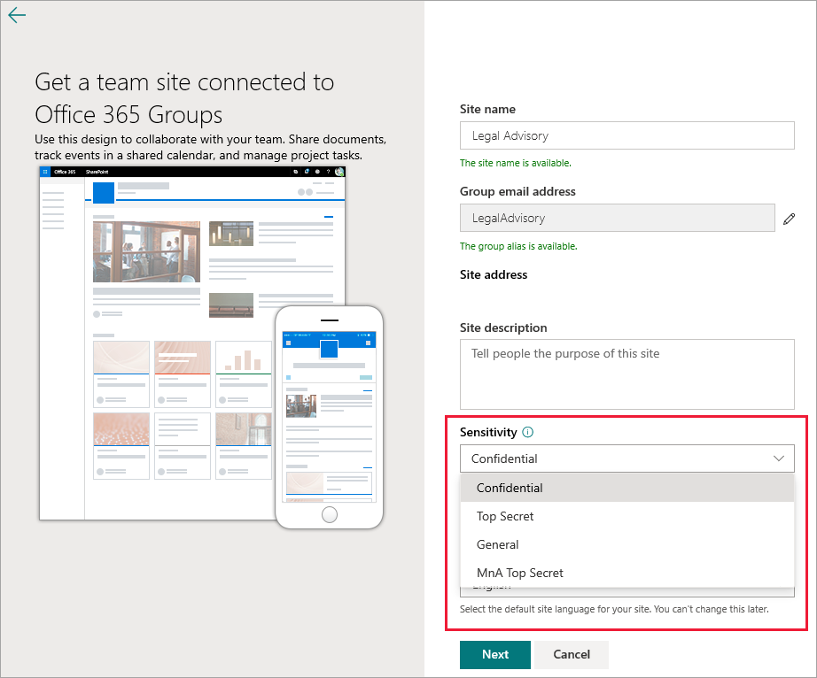
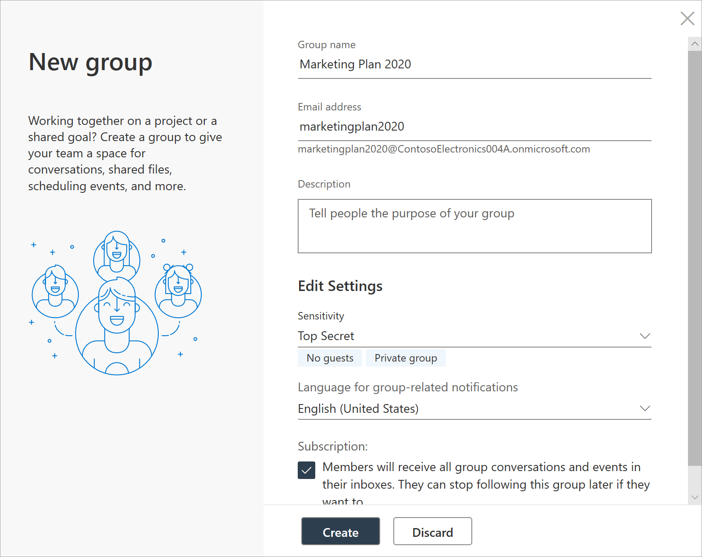

# <a name="use-sensitivity-labels-with-microsoft-teams-office-365-groups-and-sharepoint-sites-public-preview"></a><span data-ttu-id="d0c2a-103">Use etiquetas de confidencialidade com o Microsoft Teams, grupos do Office 365 e sites do SharePoint (visualização pública)</span><span class="sxs-lookup"><span data-stu-id="d0c2a-103">Use sensitivity labels with Microsoft Teams, Office 365 groups, and SharePoint sites (public preview)</span></span>

<span data-ttu-id="d0c2a-104">Ao criar rótulos de confidencialidade no [centro de conformidade do Microsoft 365](https://protection.office.com/), você pode aplicá-los ao Microsoft Teams, grupos do Office 365 e sites do SharePoint.</span><span class="sxs-lookup"><span data-stu-id="d0c2a-104">When you create sensitivity labels in the [Microsoft 365 compliance center](https://protection.office.com/), you can now apply them to Microsoft Teams, Office 365 groups, and SharePoint sites.</span></span> <span data-ttu-id="d0c2a-105">Você pode associar políticas a rótulos para controlar:</span><span class="sxs-lookup"><span data-stu-id="d0c2a-105">You can associate policies with the labels to control:</span></span>

- <span data-ttu-id="d0c2a-106">Configurações público/privada</span><span class="sxs-lookup"><span data-stu-id="d0c2a-106">Public/private settings</span></span>
- <span data-ttu-id="d0c2a-107">Acesso de convidados</span><span class="sxs-lookup"><span data-stu-id="d0c2a-107">Guest access</span></span>
- <span data-ttu-id="d0c2a-108">Acesso de dispositivos não gerenciados</span><span class="sxs-lookup"><span data-stu-id="d0c2a-108">Access from unmanaged devices</span></span>

<span data-ttu-id="d0c2a-109">Quando você aplica um rótulo a uma equipe ou grupo, o rótulo se aplica automaticamente ao site de equipe do SharePoint conectada e vice-versa.</span><span class="sxs-lookup"><span data-stu-id="d0c2a-109">When you apply a label to a team or group, the label automatically applies to the connected SharePoint team site and the other way around.</span></span>

<span data-ttu-id="d0c2a-110">Agora você também pode habilitar rótulos de confidencialidade para arquivos do Office no SharePoint e no OneDrive.</span><span class="sxs-lookup"><span data-stu-id="d0c2a-110">You can now also enable sensitivity labels for Office files in SharePoint and OneDrive.</span></span> <span data-ttu-id="d0c2a-111">Para saber mais, confira [Habilitar rótulos de confidencialidade para arquivos do Office no SharePoint e no OneDrive (visualização pública)](sensitivity-labels-sharepoint-onedrive-files.md)</span><span class="sxs-lookup"><span data-stu-id="d0c2a-111">For more information, see [Enable sensitivity labels for Office files in SharePoint and OneDrive (public preview)](sensitivity-labels-sharepoint-onedrive-files.md).</span></span>

## <a name="about-the-public-preview-for-microsoft-teams-office-365-groups-and-sharepoint-sites"></a><span data-ttu-id="d0c2a-112">Sobre a visualização pública do Microsoft Teams, grupos do Office 365 e sites do SharePoint</span><span class="sxs-lookup"><span data-stu-id="d0c2a-112">About the public preview for Microsoft Teams, Office 365 groups, and SharePoint sites</span></span>

<span data-ttu-id="d0c2a-113">Os rótulos de confidencialidade do Microsoft Teams, grupos do Office 365 e de sites do SharePoint são gradualmente implementados para locatários e podem ser alterados antes do lançamento final.</span><span class="sxs-lookup"><span data-stu-id="d0c2a-113">Sensitivity labels for Microsoft Teams, Office 365 groups, and SharePoint sites are gradually rolling out to tenants and might change before final release.</span></span>

<span data-ttu-id="d0c2a-114">Esta versão pública não funciona com as CDNs (redes de distribuição de conteúdo do Office 365).</span><span class="sxs-lookup"><span data-stu-id="d0c2a-114">This public preview doesn't work with Office 365 Content Delivery Networks (CDNs).</span></span>

## <a name="overview"></a><span data-ttu-id="d0c2a-115">Visão Geral</span><span class="sxs-lookup"><span data-stu-id="d0c2a-115">Overview</span></span>

<span data-ttu-id="d0c2a-116">Quando você publica rótulos de confidencialidade, os usuários do Office 365 têm acesso à mesma lista de etiquetas.</span><span class="sxs-lookup"><span data-stu-id="d0c2a-116">When you publish sensitivity labels, users across Office 365 have access to the same list of labels.</span></span>

<span data-ttu-id="d0c2a-117">Essas imagens são exibidas:</span><span class="sxs-lookup"><span data-stu-id="d0c2a-117">These images show:</span></span>

- <span data-ttu-id="d0c2a-118">Como a lista é exibida quando você cria um novo site de equipe do SharePoint</span><span class="sxs-lookup"><span data-stu-id="d0c2a-118">How the list appears when you create a new team site from SharePoint</span></span>

- <span data-ttu-id="d0c2a-119">Quando você visualiza a lista no Word</span><span class="sxs-lookup"><span data-stu-id="d0c2a-119">When you view the list in Word</span></span>

<span data-ttu-id="d0c2a-120">Por exemplo:</span><span class="sxs-lookup"><span data-stu-id="d0c2a-120">For example:</span></span>




## <a name="enable-this-preview"></a><span data-ttu-id="d0c2a-123">Habilitar esta visualização</span><span class="sxs-lookup"><span data-stu-id="d0c2a-123">Enable this preview</span></span>

<span data-ttu-id="d0c2a-124">Você deve usar a versão de visualização do [Azure Active Directory PowerShell for Graph (AzureAD)](https://docs.microsoft.com/powershell/azure/active-directory/overview?view=azureadps-2.0) (nome do módulo **AzureADPreview**) para habilitar essa visualização de rótulos de confidencialidade no Microsoft Teams, nos grupos do Office 365 e sites do SharePoint:</span><span class="sxs-lookup"><span data-stu-id="d0c2a-124">You must use the preview version of [Azure Active Directory PowerShell for Graph (AzureAD)](https://docs.microsoft.com/powershell/azure/active-directory/overview?view=azureadps-2.0) (module name **AzureADPreview**) to enable this preview of sensitivity labels with Microsoft Teams, Office 365 groups, and SharePoint sites:</span></span>

- <span data-ttu-id="d0c2a-125">Caso ainda não tenha instalado uma versão do módulo Azure AD PowerShell antes, confira [instalando o módulo Azure AD](https://docs.microsoft.com/powershell/azure/active-directory/install-adv2?view=azureadps-2.0-preview#installing-the-azure-ad-module) e siga as instruções para instalar a versão de visualização pública.</span><span class="sxs-lookup"><span data-stu-id="d0c2a-125">If you haven't installed any version of the Azure AD PowerShell module before, see [Installing the Azure AD Module](https://docs.microsoft.com/powershell/azure/active-directory/install-adv2?view=azureadps-2.0-preview#installing-the-azure-ad-module) and follow the instructions to install the public preview release.</span></span>

- <span data-ttu-id="d0c2a-126">Se você tiver a versão de disponibilidade geral 2.0 do módulo do Azure AD PowerShell (AzureAD) instalada, desinstale-a executando `Uninstall-Module AzureAD` em sua sessão do PowerShell e instale a versão de visualização executando `Install-Module AzureADPreview`.</span><span class="sxs-lookup"><span data-stu-id="d0c2a-126">If you have the 2.0 general availability version of the Azure AD PowerShell module (AzureAD) installed, you must uninstall it by running `Uninstall-Module AzureAD` in your PowerShell session, and then install the preview version by running `Install-Module AzureADPreview`.</span></span>

- <span data-ttu-id="d0c2a-127">Se você já tiver instalado a versão de visualização, execute `Install-Module AzureADPreview` para ter certeza de que esta é a versão mais recente deste módulo.</span><span class="sxs-lookup"><span data-stu-id="d0c2a-127">If you have already installed the preview version, run `Install-Module AzureADPreview` to make sure it's the latest version of this module.</span></span>

<span data-ttu-id="d0c2a-128">Agora você está pronto para habilitar a visualização de etiquetas de confidencialidade com o Microsoft Teams, grupos do Office 365 e sites do SharePoint:</span><span class="sxs-lookup"><span data-stu-id="d0c2a-128">You're now ready to enable the preview of sensitivity labels with Microsoft Teams, Office 365 groups, and SharePoint sites:</span></span>

1. <span data-ttu-id="d0c2a-129">Em uma sessão do PowerShell, usando uma conta corporativa ou de estudante com privilégios de administrador global, conecte-se ao Azure Active Directory.</span><span class="sxs-lookup"><span data-stu-id="d0c2a-129">In a PowerShell session, using a work or school account that has global admin privileges, connect to Azure Active Directory.</span></span> <span data-ttu-id="d0c2a-130">Por exemplo, execute:</span><span class="sxs-lookup"><span data-stu-id="d0c2a-130">For example, run:</span></span>
    
    ```powershell
    Connect-AzureAD
    ````
    
    <span data-ttu-id="d0c2a-131">Para obter instruções completas, confira [Conectar ao Azure AD](https://docs.microsoft.com/powershell/azure/active-directory/install-adv2?view=azureadps-2.0-preview#connect-to-azure-ad).</span><span class="sxs-lookup"><span data-stu-id="d0c2a-131">For full instructions, see [Connect to Azure AD](https://docs.microsoft.com/powershell/azure/active-directory/install-adv2?view=azureadps-2.0-preview#connect-to-azure-ad).</span></span>

2. <span data-ttu-id="d0c2a-132">Execute os seguintes comandos:</span><span class="sxs-lookup"><span data-stu-id="d0c2a-132">Run the following commands:</span></span>
    
    ```powershell
    $setting=(Get-AzureADDirectorySetting | where -Property DisplayName -Value "Group.Unified" -EQ)
    if ($setting -eq $null)
    {
    $template = Get-AzureADDirectorySettingTemplate -Id 62375ab9-6b52-47ed-826b-58e47e0e304b
    $setting = $template.CreateDirectorySetting()
    $setting["EnableMIPLabels"] = "True"
    New-AzureADDirectorySetting -DirectorySetting $setting
    }
    else
    {
    $setting["EnableMIPLabels"] = "True"
    Set-AzureADDirectorySetting -Id $setting.Id -DirectorySetting $setting
    }
    ```
    
    > [!NOTE]
    > <span data-ttu-id="d0c2a-133">O Office 365 não usará mais as classificações antigas para novos grupos e sites do SharePoint quando você habilitar essa visualização.</span><span class="sxs-lookup"><span data-stu-id="d0c2a-133">Office 365 no longer uses the old classifications for new groups and SharePoint sites when you enable this preview.</span></span> <span data-ttu-id="d0c2a-134">Se você usar a [classificação de sites do Azure AD](/sharepoint/dev/solution-guidance/modern-experience-site-classification) ($setting["ClassificationList"]), os grupos e sites existentes ainda exibirão as classificações antigas.</span><span class="sxs-lookup"><span data-stu-id="d0c2a-134">If you used [Azure AD site classification](/sharepoint/dev/solution-guidance/modern-experience-site-classification) ($setting["ClassificationList"]), existing groups and sites still display the old classifications.</span></span> <span data-ttu-id="d0c2a-135">Para exibir as novas classificações, converta-as.</span><span class="sxs-lookup"><span data-stu-id="d0c2a-135">To display the new classifications, convert them.</span></span> <span data-ttu-id="d0c2a-136">Para obter informações sobre como convertê-los, consulte [Se você usou a classificação clássica do site do Azure AD](#if-you-used-classic-azure-ad-site-classification).</span><span class="sxs-lookup"><span data-stu-id="d0c2a-136">For information about how to convert them, see [If you used classic Azure AD site classification](#if-you-used-classic-azure-ad-site-classification).</span></span> 

3. <span data-ttu-id="d0c2a-137">Na mesma sessão do PowerShell, conecte-se ao Centro de Conformidade e Segurança usando uma conta corporativa ou de estudante com privilégios de administrador global.</span><span class="sxs-lookup"><span data-stu-id="d0c2a-137">In the same PowerShell session, now connect to the Security & Compliance Center by using a work or school account that has global admin privileges.</span></span> <span data-ttu-id="d0c2a-138">Para mais instruções, confira [conecte-se ao PowerShell do Centro de Conformidade e Segurança do Office 365](/powershell/exchange/office-365-scc/connect-to-scc-powershell/connect-to-scc-powershell).</span><span class="sxs-lookup"><span data-stu-id="d0c2a-138">For instructions, see [Connect to Office 365 Security & Compliance Center PowerShell](/powershell/exchange/office-365-scc/connect-to-scc-powershell/connect-to-scc-powershell).</span></span>

4. <span data-ttu-id="d0c2a-139">Execute os seguintes comandos para sincronizar os rótulos com o Azure AD, para que eles possam ser usados com grupos do Office 365:</span><span class="sxs-lookup"><span data-stu-id="d0c2a-139">Run the following commands to synchronize your labels to Azure AD, so that they can used with Office 365 groups:</span></span>
    
    ```powershell
    Set-ExecutionPolicy RemoteSigned
    $UserCredential = Get-Credential
    $Session = New-PSSession -ConfigurationName Microsoft.Exchange -ConnectionUri https://ps.compliance.protection.outlook.com/powershell-liveid/ -Credential $UserCredential -Authentication Basic -AllowRedirection
    Import-PSSession $Session -DisableNameChecking
    Execute-AzureAdLabelSync
    ```
## <a name="set-site-and-group-settings-when-you-create-or-edit-sensitivity-labels"></a><span data-ttu-id="d0c2a-140">Definir as configurações de site e grupo quando ao criar ou editar rótulos de confidencialidade</span><span class="sxs-lookup"><span data-stu-id="d0c2a-140">Set site and group settings when you create or edit sensitivity labels</span></span>

<span data-ttu-id="d0c2a-141">Depois de habilitar a visualização, use as etapas a seguir para criar ou editar rótulos de confidencialidade.</span><span class="sxs-lookup"><span data-stu-id="d0c2a-141">After you enable the preview, use the following steps to create or edit sensitivity labels.</span></span> <span data-ttu-id="d0c2a-142">Você deve concluir essas etapas para os novos rótulos de confidencialidade para trabalhar com sites e grupos, mesmo que você já tenha os rótulos definidos.</span><span class="sxs-lookup"><span data-stu-id="d0c2a-142">You must complete these steps for the new sensitivity labels to work with sites and groups, even if you already have labels defined.</span></span> <span data-ttu-id="d0c2a-143">As alterações nessas configurações podem levar até 24 horas para serem sincronizadas.</span><span class="sxs-lookup"><span data-stu-id="d0c2a-143">Changes to these settings might take up to 24 hours to synchronize.</span></span>

1. <span data-ttu-id="d0c2a-144">No Centro de Conformidade do Microsoft 365, selecione **Classificação** > **Rótulos de confidencialidade**.</span><span class="sxs-lookup"><span data-stu-id="d0c2a-144">In the Microsoft 365 compliance center, select **Classification** > **Sensitivity labels**.</span></span>

2. <span data-ttu-id="d0c2a-145">Selecione **Criar um rótulo**.</span><span class="sxs-lookup"><span data-stu-id="d0c2a-145">Select **Create a label**.</span></span> <span data-ttu-id="d0c2a-146">Se você já tiver um rótulo, vá para a próxima etapa.</span><span class="sxs-lookup"><span data-stu-id="d0c2a-146">If you already have a label, skip to the next step.</span></span>

3. <span data-ttu-id="d0c2a-147">Selecione as opções desejadas e, em seguida, na guia **Configurações de site e grupo**, escolha:</span><span class="sxs-lookup"><span data-stu-id="d0c2a-147">Select the options you want, and then on the **Site and group settings** tab, choose:</span></span>
    
    - <span data-ttu-id="d0c2a-148">Privacidade (pública/privada): Privada significa que somente membros aprovados da sua organização podem ver o que está dentro do grupo.</span><span class="sxs-lookup"><span data-stu-id="d0c2a-148">Privacy (Public/Private): Private means that only approved members in your organization can see what's inside the group.</span></span> <span data-ttu-id="d0c2a-149">Outras pessoas em sua organização não conseguem ver o que há no grupo.</span><span class="sxs-lookup"><span data-stu-id="d0c2a-149">Anyone else in your organization can't see what's in the group.</span></span> [<span data-ttu-id="d0c2a-150">Saiba mais</span><span class="sxs-lookup"><span data-stu-id="d0c2a-150">Learn more</span></span>](https://support.office.com/article/36236e39-26d3-420b-b0ac-8072d2d2bedc)
    - <span data-ttu-id="d0c2a-151">Acesso de convidados: você pode controlar se os convidados podem ser adicionados a um grupo.</span><span class="sxs-lookup"><span data-stu-id="d0c2a-151">Guest access: You can control if guests can be added to a group.</span></span> [<span data-ttu-id="d0c2a-152">Saiba mais sobre como gerenciar o acesso de convidados em grupos do Office 365</span><span class="sxs-lookup"><span data-stu-id="d0c2a-152">Learn about managing guest access in Office 365 Groups</span></span>](/office365/admin/create-groups/manage-guest-access-in-groups)
    - <span data-ttu-id="d0c2a-153">Dispositivos não gerenciados: essa configuração permite bloquear ou limitar o acesso ao conteúdo do SharePoint de dispositivos que não são híbridos ao AD ou compatíveis com o Intune.</span><span class="sxs-lookup"><span data-stu-id="d0c2a-153">Unmanaged devices: This setting lets you block or limit access to SharePoint content from devices that aren't hybrid AD joined or compliant in Intune.</span></span> <span data-ttu-id="d0c2a-154">Se você selecionar dispositivos não gerenciados, deverá ir para o Azure AD para concluir a configuração da política.</span><span class="sxs-lookup"><span data-stu-id="d0c2a-154">If you select Unmanaged devices, you must go to Azure AD to finish setting up the policy.</span></span> <span data-ttu-id="d0c2a-155">Para mais informações, confira [Controlar o acesso de dispositivos não gerenciados](/sharepoint/control-access-from-unmanaged-devices).</span><span class="sxs-lookup"><span data-stu-id="d0c2a-155">For info, see [Control access from unmanaged devices](/sharepoint/control-access-from-unmanaged-devices).</span></span>
    
    

> [!IMPORTANT]
> <span data-ttu-id="d0c2a-157">Somente as configurações de site e grupo entrarão em vigor quando você aplicar um rótulo a uma equipe, grupo ou site.</span><span class="sxs-lookup"><span data-stu-id="d0c2a-157">Only the site and group settings take effect when you apply a label to a team, group, or site.</span></span> <span data-ttu-id="d0c2a-158">Outras configurações, como a criptografia e a marcação de conteúdo, não são aplicadas a todo o conteúdo na equipe, grupo ou site.</span><span class="sxs-lookup"><span data-stu-id="d0c2a-158">Other settings, such as encryption and content marking, aren't applied to all content within the team, group, or site.</span></span>
> 
> <span data-ttu-id="d0c2a-159">Da mesma forma, se você criar um rótulo e não ativar as configurações de site e grupo, ele continuará disponível quando os usuários criarem equipes, grupos e sites, mas será classificado sem aplicar nenhuma configuração.</span><span class="sxs-lookup"><span data-stu-id="d0c2a-159">Similarly, if you create a label and don't turn on site and group settings, the label will still be available when users create teams, groups, and sites, but it will classify without applying any settings.</span></span>

[<span data-ttu-id="d0c2a-160">Saiba mais sobre como publicar rótulos de confidencialidade</span><span class="sxs-lookup"><span data-stu-id="d0c2a-160">Learn more about publishing sensitivity labels</span></span>](/microsoft-365/compliance/sensitivity-labels#what-label-policies-can-do)

## <a name="sensitivity-label-management"></a><span data-ttu-id="d0c2a-161">Gerenciamento de rótulo de confidencialidade</span><span class="sxs-lookup"><span data-stu-id="d0c2a-161">Sensitivity label management</span></span>

> [!WARNING]
> <span data-ttu-id="d0c2a-162">Criar, modificar e excluir rótulos de confidencialidade que você usa para o Microsoft Teams, grupos do Office 365 e sites do SharePoint exige uma coordenação cuidadosa com as políticas de rótulo de publicação para os usuários.</span><span class="sxs-lookup"><span data-stu-id="d0c2a-162">Creating, modifying, and deleting sensitivity labels that you use for Microsoft Teams, Office 365 groups, and SharePoint sites requires careful coordination with publishing label policies to users.</span></span> 

<span data-ttu-id="d0c2a-163">Evite erros de criação para sites e grupos que possam afetar todos os usuários usando as diretrizes a seguir.</span><span class="sxs-lookup"><span data-stu-id="d0c2a-163">Avoid creation errors for sites and groups that can affect all users by using the following guidance.</span></span>

<span data-ttu-id="d0c2a-164">**Criar e publicar rótulos:**</span><span class="sxs-lookup"><span data-stu-id="d0c2a-164">**Creating and publishing labels:**</span></span>

<span data-ttu-id="d0c2a-165">Depois de criar e publicar um rótulo de confidencialidade, pode levar até 24 horas para que o rótulo se torne visível para usuários em equipes, grupos e sites.</span><span class="sxs-lookup"><span data-stu-id="d0c2a-165">After a sensitivity label is created and published, it can take up to 24 hours for the label to become visible for users in teams, groups, and sites.</span></span> <span data-ttu-id="d0c2a-166">Use as etapas a seguir para publicar um rótulo para todos os usuários no locatário:</span><span class="sxs-lookup"><span data-stu-id="d0c2a-166">Use the following steps to publish a label for all users in the tenant:</span></span>

1. <span data-ttu-id="d0c2a-167">Crie o rótulo de confidencialidade e publique-o para apenas algumas contas de usuários no locatário.</span><span class="sxs-lookup"><span data-stu-id="d0c2a-167">Create the sensitivity label and publish it for just a few user accounts in the tenant.</span></span>

2. <span data-ttu-id="d0c2a-168">Aguarde 24 horas.</span><span class="sxs-lookup"><span data-stu-id="d0c2a-168">Wait for 24 hours.</span></span>

3. <span data-ttu-id="d0c2a-169">Após essas 24 horas, use uma das contas de usuário especificadas na etapa 1 para criar uma equipe, um grupo do Office 365 ou um site do SharePoint com o rótulo que você criou na etapa 1.</span><span class="sxs-lookup"><span data-stu-id="d0c2a-169">After this 24 hours wait, use one of the user accounts you specified in step 1 to create a team, Office 365 group, or SharePoint site with the label that you created in step 1.</span></span>

4. <span data-ttu-id="d0c2a-170">Se não houver erros durante a operação de criação da etapa 3, publique o rótulo para todos os usuários em seu locatário.</span><span class="sxs-lookup"><span data-stu-id="d0c2a-170">If there are no errors during the creation operation for step 3, publish the label for all users in your tenant.</span></span> <span data-ttu-id="d0c2a-171">Se houver erros, contate o suporte da Microsoft.</span><span class="sxs-lookup"><span data-stu-id="d0c2a-171">If there are errors, contact Microsoft Support.</span></span>

<span data-ttu-id="d0c2a-172">**Modificar e excluir rótulos publicados:**</span><span class="sxs-lookup"><span data-stu-id="d0c2a-172">**Modifying and deleting published labels:**</span></span>

<span data-ttu-id="d0c2a-173">Se você modificar ou excluir um rótulo de confidencialidade incluído em uma ou mais políticas de rótulo, essas ações poderão resultar em falhas de criação para todas as equipes, grupos e sites.</span><span class="sxs-lookup"><span data-stu-id="d0c2a-173">If you modify or delete a sensitivity label that is included in one or more label policies, these actions can result in creation failures for all teams, groups, and sites.</span></span> <span data-ttu-id="d0c2a-174">Para evitar essa situação, use as instruções a seguir:</span><span class="sxs-lookup"><span data-stu-id="d0c2a-174">To avoid this situation, use the following guidance:</span></span>

1. <span data-ttu-id="d0c2a-175">Remova o rótulo de confidencialidade de todas as políticas de rótulo que incluam o rótulo.</span><span class="sxs-lookup"><span data-stu-id="d0c2a-175">Remove the sensitivity label from all label policies that include the label.</span></span>

2. <span data-ttu-id="d0c2a-176">Aguarde por 48 horas.</span><span class="sxs-lookup"><span data-stu-id="d0c2a-176">Wait for 48 hours.</span></span>

3. <span data-ttu-id="d0c2a-177">Após as 48 horas de espera, experimente criar uma equipe, grupo ou site e confirme se o rótulo não está mais visível.</span><span class="sxs-lookup"><span data-stu-id="d0c2a-177">After the 48 hours wait, try creating a team, group, or site and confirm that the label is no longer visible.</span></span>

4. <span data-ttu-id="d0c2a-178">Se a etiqueta de confidencialidade não estiver visível, agora você pode modificá-la ou excluí-la com segurança.</span><span class="sxs-lookup"><span data-stu-id="d0c2a-178">If the sensitivity label isn't visible, you can now safely modify or delete the label.</span></span> <span data-ttu-id="d0c2a-179">Se o rótulo ainda estiver visível, contate o suporte da Microsoft.</span><span class="sxs-lookup"><span data-stu-id="d0c2a-179">If the label is still visible, contact Microsoft Support.</span></span>

## <a name="troubleshoot-sensitivity-label-deployment"></a><span data-ttu-id="d0c2a-180">Solucionar problemas de implantação de rótulo de confidencialidade</span><span class="sxs-lookup"><span data-stu-id="d0c2a-180">Troubleshoot sensitivity label deployment</span></span>

### <a name="labels-not-visible-after-publishing"></a><span data-ttu-id="d0c2a-181">Rótulos não visíveis após a publicação</span><span class="sxs-lookup"><span data-stu-id="d0c2a-181">Labels not visible after publishing</span></span>
<span data-ttu-id="d0c2a-182">Se você tiver problemas ao criar uma equipe ou grupo do Office 365 depois de habilitar essas configurações ou modificar a descrição de uma etiqueta de confidencialidade, salve o rótulo, aguarde algumas horas e, em seguida, tente criar a equipe ou o grupo novamente.</span><span class="sxs-lookup"><span data-stu-id="d0c2a-182">If you experience issues when you create a team or Office 365 group after you enable these settings or modify a sensitivity label's description, save the label, wait a few hours, and then try to create the team or group again.</span></span> <span data-ttu-id="d0c2a-183">Para saber mais, confira [Agendar a distribuição após criar ou alterar um rótulo de confidencialidade](sensitivity-labels-sharepoint-onedrive-files.md#schedule-roll-out-after-you-create-or-change-a-sensitivity-label).</span><span class="sxs-lookup"><span data-stu-id="d0c2a-183">For information, see [Schedule roll-out after you create or change a sensitivity label](sensitivity-labels-sharepoint-onedrive-files.md#schedule-roll-out-after-you-create-or-change-a-sensitivity-label).</span></span>

<span data-ttu-id="d0c2a-184">Se você ainda não conseguir ver a nova etiqueta de confidencialidade do SharePoint Online, contate o suporte da Microsoft.</span><span class="sxs-lookup"><span data-stu-id="d0c2a-184">If you are still not able to see the new sensitivity label from SharePoint Online, contact Microsoft Support.</span></span>

### <a name="team-group-or-sharepoint-site-creation-errors"></a><span data-ttu-id="d0c2a-185">Erros de criação de site de equipe, grupo ou SharePoint</span><span class="sxs-lookup"><span data-stu-id="d0c2a-185">Team, group, or SharePoint site creation errors</span></span>
<span data-ttu-id="d0c2a-186">Se ocorrerem erros de criação durante a visualização pública, você tem duas opções:</span><span class="sxs-lookup"><span data-stu-id="d0c2a-186">If you experience creation errors during the public preview, you have two options:</span></span>

- <span data-ttu-id="d0c2a-187">Certifique-se de que os rótulos de confidencialidade não sejam obrigatórios para qualquer usuário.</span><span class="sxs-lookup"><span data-stu-id="d0c2a-187">Ensure that sensitivity labels are not mandatory for any user.</span></span>

- <span data-ttu-id="d0c2a-188">Você pode desativar os rótulos de confidencialidade do Microsoft Teams, dos grupos do Office 365 e de sites do SharePoint, usando as mesmas instruções de[Habilite esta seção de visualização](#enable-this-preview) nesta página.</span><span class="sxs-lookup"><span data-stu-id="d0c2a-188">You can turn off sensitivity labels for Microsoft Teams, Office 365 groups, and SharePoint sites by using the same instructions from the [Enable this preview](#enable-this-preview) section on this page.</span></span> <span data-ttu-id="d0c2a-189">No entanto, para desativar a visualização, procure a linha `$setting["EnableMIPLabels"] = "True"` e altere o valor de **Verdadeiro** para **Falso**.</span><span class="sxs-lookup"><span data-stu-id="d0c2a-189">However, to disable the preview, search for the line `$setting["EnableMIPLabels"] = "True"`, and change the **True** value to **False**.</span></span>

## <a name="apply-a-sensitivity-label-to-a-new-team"></a><span data-ttu-id="d0c2a-190">Aplicar um rótulo de confidencialidade a uma nova equipe</span><span class="sxs-lookup"><span data-stu-id="d0c2a-190">Apply a sensitivity label to a new team</span></span>

<span data-ttu-id="d0c2a-191">Os usuários podem selecionar os rótulos de confidencialidade ao criar novas equipes no Microsoft Teams.</span><span class="sxs-lookup"><span data-stu-id="d0c2a-191">Users can select sensitivity labels when they create new teams in Microsoft Teams.</span></span> <span data-ttu-id="d0c2a-192">Quando eles selecionam o nível de confidencialidade, a configuração de privacidade é alterada conforme necessário.</span><span class="sxs-lookup"><span data-stu-id="d0c2a-192">When they select the sensitivity level, the privacy setting changes as necessary.</span></span> <span data-ttu-id="d0c2a-193">Dependendo da configuração de acesso de convidado que você selecionou para a etiqueta, os usuários podem ou não adicionar pessoas de fora da organização para a equipe.</span><span class="sxs-lookup"><span data-stu-id="d0c2a-193">Depending on the guest access setting you selected for the label, users can or can't add people outside the organization to the team.</span></span>

[<span data-ttu-id="d0c2a-194">Saiba mais sobre Rótulos de confidencialidade</span><span class="sxs-lookup"><span data-stu-id="d0c2a-194">Learn more about sensitivity labels for Teams</span></span>](https://docs.microsoft.com/microsoftteams/sensitivity-labels)


<span data-ttu-id="d0c2a-196">Depois de criar a equipe, o rótulo de confidencialidade aparecerá no canto superior direito de todos os canais.</span><span class="sxs-lookup"><span data-stu-id="d0c2a-196">After you create the team, the sensitivity label appears in the upper-right corner of all channels.</span></span>


<span data-ttu-id="d0c2a-198">O serviço aplica automaticamente o mesmo rótulo de confidencialidade ao grupo do Office 365 e ao site de equipe do SharePoint conectado.</span><span class="sxs-lookup"><span data-stu-id="d0c2a-198">The service automatically applies the same sensitivity label to the Office 365 group and the connected SharePoint team site.</span></span>

## <a name="apply-a-sensitivity-label-to-a-new-group"></a><span data-ttu-id="d0c2a-199">Aplicar um rótulo de confidencialidade a um novo grupo</span><span class="sxs-lookup"><span data-stu-id="d0c2a-199">Apply a sensitivity label to a new group</span></span>

<span data-ttu-id="d0c2a-200">No Outlook na Web, a nova caixa de **confidencialidade** contém rótulos publicados.</span><span class="sxs-lookup"><span data-stu-id="d0c2a-200">In Outlook on the web, the new **Sensitivity** box contains published labels.</span></span> <span data-ttu-id="d0c2a-201">Se os usuários quiserem mais informações, eles poderão clicar no ícone ajuda para ler detalhes sobre os rótulos disponíveis e políticas associadas.</span><span class="sxs-lookup"><span data-stu-id="d0c2a-201">If users want more info, they can click the help icon to read details about the available labels and associated policies.</span></span>



## <a name="apply-a-sensitivity-label-to-a-new-site"></a><span data-ttu-id="d0c2a-203">Aplicar um rótulo de confidencialidade a um novo site</span><span class="sxs-lookup"><span data-stu-id="d0c2a-203">Apply a sensitivity label to a new site</span></span>

<span data-ttu-id="d0c2a-204">Os administradores e os usuários finais podem selecionar os rótulos de confidencialidade ao criar sites de equipe e sites de comunicação modernos.</span><span class="sxs-lookup"><span data-stu-id="d0c2a-204">Admins and end users can select sensitivity labels when they create modern team sites and communication sites.</span></span>

<span data-ttu-id="d0c2a-205">Saiba como [Criar um site no novo centro de administração do SharePoint](/sharepoint/create-site-collection)</span><span class="sxs-lookup"><span data-stu-id="d0c2a-205">[Learn how to create a site in the new SharePoint admin center](/sharepoint/create-site-collection)</span></span>

<span data-ttu-id="d0c2a-206">Quando os usuários criam sites modernos de comunicação e equipe, um rótulo de confidencialidade já estará selecionado por padrão.</span><span class="sxs-lookup"><span data-stu-id="d0c2a-206">When users create modern team and communication sites, a sensitivity label is already selected by default.</span></span> <span data-ttu-id="d0c2a-207">Os usuários podem selecionar o ícone de ajuda para saber mais sobre os rótulos.</span><span class="sxs-lookup"><span data-stu-id="d0c2a-207">Users can select the help icon to learn more about the labels.</span></span>


<span data-ttu-id="d0c2a-209">Quando os usuários acessam o site, eles podem ver o nome do rótulo e as políticas aplicadas.</span><span class="sxs-lookup"><span data-stu-id="d0c2a-209">When users browse to the site, they can see the name of the label and applied policies.</span></span>


## <a name="manage-sensitivity-labels-in-the-sharepoint-admin-center"></a><span data-ttu-id="d0c2a-211">Gerenciar rótulos de confidencialidade no centro de administração do SharePoint</span><span class="sxs-lookup"><span data-stu-id="d0c2a-211">Manage sensitivity labels in the SharePoint admin center</span></span>

<span data-ttu-id="d0c2a-212">Para exibir e editar os rótulos, use a página de sites ativas no novo centro de administração do SharePoint.</span><span class="sxs-lookup"><span data-stu-id="d0c2a-212">To view and edit the labels, use the Active sites page in the new SharePoint admin center.</span></span>


<span data-ttu-id="d0c2a-214">[Saiba mais sobre como gerenciar sites no novo centro de administração do SharePoint](/sharepoint/manage-sites-in-new-admin-center).</span><span class="sxs-lookup"><span data-stu-id="d0c2a-214">[Learn more about managing sites in the new SharePoint admin center](/sharepoint/manage-sites-in-new-admin-center).</span></span>

## <a name="change-site-and-group-settings-for-a-label"></a><span data-ttu-id="d0c2a-215">Alterar as configurações de um título</span><span class="sxs-lookup"><span data-stu-id="d0c2a-215">Change site and group settings for a label</span></span>

<span data-ttu-id="d0c2a-216">Sempre que você alterar as configurações de site e grupo de um rótulo, deverá executar os seguintes comandos do PowerShell para que suas equipes, sites e grupos possam usar as novas configurações.</span><span class="sxs-lookup"><span data-stu-id="d0c2a-216">Whenever you make a change to site and group settings for a label, you must run the following PowerShell commands so that your teams, sites, and groups can use the new settings.</span></span> <span data-ttu-id="d0c2a-217">Como prática recomendada, não altere as configurações de site e grupo de um rótulo após aplicá-lo a várias equipes, grupos ou sites.</span><span class="sxs-lookup"><span data-stu-id="d0c2a-217">As a best practice, don't the change site and group settings for a label after you've applied the label to several teams, groups, or sites.</span></span>

1. <span data-ttu-id="d0c2a-218">Execute os seguintes comandos para se conectar ao PowerShell do Centro de Conformidade e Segurança do Office 365, e obter a lista de rótulos de confidencialidade e seus GUIDs.</span><span class="sxs-lookup"><span data-stu-id="d0c2a-218">Run the following commands to connect to Office 365 Security & Compliance Center PowerShell and get the list of sensitivity labels and their GUIDs.</span></span>
    
    ```powershell
    Set-ExecutionPolicy RemoteSigned
    $UserCredential = Get-Credential
    $Session = New-PSSession -ConfigurationName Microsoft.Exchange -ConnectionUri https://ps.compliance.protection.outlook.com/powershell-liveid -Authentication Basic -AllowRedirection -Credential $UserCredential
    Import-PSSession $Session
    Get-Label |ft Name, Guid
    ```

2. <span data-ttu-id="d0c2a-219">Anote o GUID do rótulo ou os rótulos que você alterou.</span><span class="sxs-lookup"><span data-stu-id="d0c2a-219">Make a note of the GUID for the label or labels you have changed.</span></span>

3. <span data-ttu-id="d0c2a-220">Conecte-se agora ao PowerShell do Exchange Online e execute o cmdlet Get-UnifiedGroup, especificando o GUID do rótulo no lugar do GUID de exemplo de "e48058ea-98e8-4940-8db0-ba1310fd955e":</span><span class="sxs-lookup"><span data-stu-id="d0c2a-220">Now connect to Exchange Online PowerShell and run the Get-UnifiedGroup cmdlet, specifying your label GUID in place of the example GUID of "e48058ea-98e8-4940-8db0-ba1310fd955e":</span></span> 
    
    ```powershell
    Set-ExecutionPolicy RemoteSigned
    $UserCredential = Get-Credential
    $Session = New-PSSession -ConfigurationName Microsoft.Exchange -ConnectionUri https://outlook.office365.com/powershell-liveid/ -Credential $UserCredential -Authentication Basic -AllowRedirection
    Import-PSSession $Session
    $Groups= Get-UnifiedGroup | Where {$_.SensitivityLabel  -eq "e48058ea-98e8-4940-8db0-ba1310fd955e"}
    ```

4. <span data-ttu-id="d0c2a-221">Para cada grupo, aplique novamente o rótulo de confidencialidade, especificando o GUID do rótulo no lugar do GUID de exemplo de "e48058ea-98e8-4940-8db0-ba1310fd955e":</span><span class="sxs-lookup"><span data-stu-id="d0c2a-221">For each group, reapply the sensitivity label, specifying your label GUID in place of the example GUID of "e48058ea-98e8-4940-8db0-ba1310fd955e":</span></span>
    
    ```powershell
    foreach ($g in $groups)
    {Set-UnifiedGroup -Identity $g.Identity -SensitivityLabelId "e48058ea-98e8-4940-8db0-ba1310fd955e"}
    ```

## <a name="support-for-the-new-sensitivity-labels"></a><span data-ttu-id="d0c2a-222">Suporte para os novos rótulos de confidencialidade</span><span class="sxs-lookup"><span data-stu-id="d0c2a-222">Support for the new sensitivity labels</span></span>

<span data-ttu-id="d0c2a-223">Os seguintes aplicativos e serviços oferecem suporte a rótulos de confidencialidade nesta visualização:</span><span class="sxs-lookup"><span data-stu-id="d0c2a-223">The following apps and services support the sensitivity labels in this preview:</span></span>

- <span data-ttu-id="d0c2a-224">Centro de conformidade do Microsoft 365</span><span class="sxs-lookup"><span data-stu-id="d0c2a-224">Microsoft 365 compliance center</span></span>
- <span data-ttu-id="d0c2a-225">SharePoint</span><span class="sxs-lookup"><span data-stu-id="d0c2a-225">SharePoint</span></span>
- <span data-ttu-id="d0c2a-226">Outlook na Web</span><span class="sxs-lookup"><span data-stu-id="d0c2a-226">Outlook on the web</span></span>
- <span data-ttu-id="d0c2a-227">Teams</span><span class="sxs-lookup"><span data-stu-id="d0c2a-227">Teams</span></span>
- <span data-ttu-id="d0c2a-228">Centro de administração do SharePoint</span><span class="sxs-lookup"><span data-stu-id="d0c2a-228">SharePoint admin center</span></span>
- <span data-ttu-id="d0c2a-229">Centro de Administração do Microsoft Azure AD</span><span class="sxs-lookup"><span data-stu-id="d0c2a-229">Azure AD admin center</span></span>

<span data-ttu-id="d0c2a-230">Não é possível usar os seguintes aplicativos e serviços para criar grupos do Office 365 com os novos rótulos de confidencialidade:</span><span class="sxs-lookup"><span data-stu-id="d0c2a-230">You can't use the following apps and services to create Office 365 groups with the new sensitivity labels:</span></span>

- <span data-ttu-id="d0c2a-231">Outlook para Mac</span><span class="sxs-lookup"><span data-stu-id="d0c2a-231">Outlook for the Mac</span></span>
- <span data-ttu-id="d0c2a-232">Outlook Mobile</span><span class="sxs-lookup"><span data-stu-id="d0c2a-232">Outlook mobile</span></span>  
- <span data-ttu-id="d0c2a-233">Área de trabalho do Outlook para Windows</span><span class="sxs-lookup"><span data-stu-id="d0c2a-233">Outlook desktop for Windows</span></span>
- <span data-ttu-id="d0c2a-234">Forms</span><span class="sxs-lookup"><span data-stu-id="d0c2a-234">Forms</span></span>  
- <span data-ttu-id="d0c2a-235">Dynamics 365</span><span class="sxs-lookup"><span data-stu-id="d0c2a-235">Dynamics 365</span></span>  
- <span data-ttu-id="d0c2a-236">Yammer</span><span class="sxs-lookup"><span data-stu-id="d0c2a-236">Yammer</span></span>  
- <span data-ttu-id="d0c2a-237">Stream</span><span class="sxs-lookup"><span data-stu-id="d0c2a-237">Stream</span></span>  
- <span data-ttu-id="d0c2a-238">Planner</span><span class="sxs-lookup"><span data-stu-id="d0c2a-238">Planner</span></span>  
- <span data-ttu-id="d0c2a-239">Project</span><span class="sxs-lookup"><span data-stu-id="d0c2a-239">Project</span></span>  
- <span data-ttu-id="d0c2a-240">PowerBI</span><span class="sxs-lookup"><span data-stu-id="d0c2a-240">PowerBI</span></span>  
- <span data-ttu-id="d0c2a-241">Centro de administração do Teams</span><span class="sxs-lookup"><span data-stu-id="d0c2a-241">Teams admin center</span></span>  
- <span data-ttu-id="d0c2a-242">Centro de administração do Microsoft 365</span><span class="sxs-lookup"><span data-stu-id="d0c2a-242">Microsoft 365 admin center</span></span>  
- <span data-ttu-id="d0c2a-243">Centro de administração do Exchange</span><span class="sxs-lookup"><span data-stu-id="d0c2a-243">Exchange admin center</span></span>

## <a name="if-you-used-classic-azure-ad-site-classification"></a><span data-ttu-id="d0c2a-244">Se você usou a classificação clássica do site do Azure AD</span><span class="sxs-lookup"><span data-stu-id="d0c2a-244">If you used classic Azure AD site classification</span></span>

<span data-ttu-id="d0c2a-245">O Office 365 já não será mais compatível com as classificações antigas para novos grupos e sites do SharePoint quando você habilitar essa visualização.</span><span class="sxs-lookup"><span data-stu-id="d0c2a-245">Office 365 no longer supports the old classifications for new groups and SharePoint sites when you enable this preview.</span></span> <span data-ttu-id="d0c2a-246">No entanto, os grupos e sites existentes ainda exibem as classificações antigas, a menos que você as converta.</span><span class="sxs-lookup"><span data-stu-id="d0c2a-246">However, existing groups and sites still display the old classifications unless you convert them.</span></span> <span data-ttu-id="d0c2a-247">As classificações antigas incluem a classificação de sites "modernos" que você configurou, possivelmente por meio do Azure AD PowerShell ou da biblioteca PnP Core, que definiu valores para a configuração do `ClassificationList`.</span><span class="sxs-lookup"><span data-stu-id="d0c2a-247">Old classifications include the "modern" sites classification you set up, possibly through Azure AD PowerShell or the PnP Core library, that defined values for the `ClassificationList` setting.</span></span>

<span data-ttu-id="d0c2a-248">Por exemplo, no PowerShell:</span><span class="sxs-lookup"><span data-stu-id="d0c2a-248">For example, in PowerShell:</span></span>

```powershell
   ($setting["ClassificationList"])
```

<span data-ttu-id="d0c2a-249">Para obter mais informações sobre o método antigo de classificação, confira [Classificação de sites "modernos" do SharePoint](https://docs.microsoft.com/sharepoint/dev/solution-guidance/modern-experience-site-classification).</span><span class="sxs-lookup"><span data-stu-id="d0c2a-249">For more information about the old classification method, see [SharePoint "modern" sites classification](https://docs.microsoft.com/sharepoint/dev/solution-guidance/modern-experience-site-classification).</span></span>

<span data-ttu-id="d0c2a-250">Com base na implantação atual, você tem duas opções para converter as classificações antigas em novas classificações.</span><span class="sxs-lookup"><span data-stu-id="d0c2a-250">Based on your current deployment, you have two options to convert your old classifications to the new classifications.</span></span>

### <a name="if-you-never-used-sensitivity-labels-unified-microsoft-information-protection-labels-for-files-and-email"></a><span data-ttu-id="d0c2a-251">Caso nunca tenha usado rótulos de confidencialidade (rótulos de proteção de informações unificados da Microsoft) para arquivos e e-mail</span><span class="sxs-lookup"><span data-stu-id="d0c2a-251">If you never used sensitivity labels (unified Microsoft Information Protection labels) for files and email</span></span>

<span data-ttu-id="d0c2a-252">Recomendamos que você:</span><span class="sxs-lookup"><span data-stu-id="d0c2a-252">We recommend that you:</span></span>

1. <span data-ttu-id="d0c2a-253">Crie novos rótulos de confidencialidade no centro de conformidade do Microsoft 365 que tenham os mesmos nomes das suas classificações existentes.</span><span class="sxs-lookup"><span data-stu-id="d0c2a-253">Create new sensitivity labels in the Microsoft 365 compliance center that have the same names as your existing classifications.</span></span>
2. <span data-ttu-id="d0c2a-254">Use o PowerShell para aplicar os novos rótulos aos grupos existentes do Office 365 e aos sites do SharePoint usando mapeamento de nomes.</span><span class="sxs-lookup"><span data-stu-id="d0c2a-254">Use PowerShell to apply the new labels to existing Office 365 groups and SharePoint sites using name mapping.</span></span>
3. <span data-ttu-id="d0c2a-255">Exclua as classificações antigas.</span><span class="sxs-lookup"><span data-stu-id="d0c2a-255">Delete the old classifications.</span></span>

<span data-ttu-id="d0c2a-256">Os aplicativos e serviços que oferecem suporte aos novos rótulos de confidencialidade serão mostrados.</span><span class="sxs-lookup"><span data-stu-id="d0c2a-256">Apps and services that support the new sensitivity labels will show them.</span></span> <span data-ttu-id="d0c2a-257">Você cria novas equipes, grupos e sites com os novos rótulos.</span><span class="sxs-lookup"><span data-stu-id="d0c2a-257">You create new teams, groups, and sites with the new labels.</span></span> <span data-ttu-id="d0c2a-258">Os usuários ainda podem criar grupos de aplicativos e serviços que não têm suporte para os novos rótulos.</span><span class="sxs-lookup"><span data-stu-id="d0c2a-258">Users can still create groups from apps and services that don't support the new labels.</span></span> <span data-ttu-id="d0c2a-259">No entanto, os usuários não podem aplicar um rótulo a esses grupos.</span><span class="sxs-lookup"><span data-stu-id="d0c2a-259">However, users can't apply a label to these groups.</span></span> <span data-ttu-id="d0c2a-260">Use o PowerShell para aplicar os novos rótulos de confidencialidade para esses grupos.</span><span class="sxs-lookup"><span data-stu-id="d0c2a-260">Use PowerShell to apply the new sensitivity labels to these groups.</span></span>

<span data-ttu-id="d0c2a-261">Você pode manter suas classificações antigas. no entanto, é altamente recomendável usar o PowerShell para aplicar os novos rótulos de confidencialidade a esses grupos.</span><span class="sxs-lookup"><span data-stu-id="d0c2a-261">You can keep your old classifications; however, we highly recommend using PowerShell to apply the new sensitivity labels to these groups.</span></span>

<span data-ttu-id="d0c2a-262">Os aplicativos e serviços que oferecem suporte aos novos rótulos de confidencialidade serão criados com os novos rótulos.</span><span class="sxs-lookup"><span data-stu-id="d0c2a-262">Apps and services that support the new sensitivity labels will get created with the new labels.</span></span> <span data-ttu-id="d0c2a-263">Quando os usuários criam grupos de aplicativos e serviços que não têm suporte para os novos rótulos, eles podem selecionar uma classificação.</span><span class="sxs-lookup"><span data-stu-id="d0c2a-263">When users create groups from apps and services that don't support the new labels, they can select a classification.</span></span>

### <a name="if-you-use-sensitivity-labels-unified-microsoft-information-protection-labels-for-files-and-email"></a><span data-ttu-id="d0c2a-264">Se você usa rótulos de confidencialidade(rótulos de proteção de informações unificados da Microsoft) para arquivos e e-mail</span><span class="sxs-lookup"><span data-stu-id="d0c2a-264">If you use sensitivity labels (unified Microsoft Information Protection labels) for files and email</span></span>

<span data-ttu-id="d0c2a-265">Assim que você habilitar essa visualização, vá para cada etiqueta no centro de conformidade do Microsoft 365 e aplique as políticas desejadas para sites e grupos.</span><span class="sxs-lookup"><span data-stu-id="d0c2a-265">As soon as you enable this preview, go to each label in the Microsoft 365 compliance center and apply the policies you want for sites and groups.</span></span> <span data-ttu-id="d0c2a-266">Os usuários começarão a ver seus rótulos existentes disponíveis para sites e grupos.</span><span class="sxs-lookup"><span data-stu-id="d0c2a-266">Users will start seeing your existing labels available for sites and groups.</span></span>

### <a name="prepare-the-sharepoint-online-management-shell-before-you-relabel-office-365-groups"></a><span data-ttu-id="d0c2a-267">Preparar o Shell de gerenciamento do SharePoint Online antes de rotular novamente os grupos do Office 365</span><span class="sxs-lookup"><span data-stu-id="d0c2a-267">Prepare the SharePoint Online Management Shell before you relabel Office 365 groups</span></span>

<span data-ttu-id="d0c2a-268">Antes de aplicar novos rótulos, certifique-se de estar executando o Shell de gerenciamento do SharePoint Online mais recente.</span><span class="sxs-lookup"><span data-stu-id="d0c2a-268">Before you apply new labels, ensure that you're running the latest SharePoint Online Management Shell.</span></span> <span data-ttu-id="d0c2a-269">Se você já tem a versão mais recente, é possível prosseguir e [Rotular novamente os grupos do Office 365 com novos rótulos de confidencialidade](#relabel-office-365-groups-with-new-sensitivity-labels).</span><span class="sxs-lookup"><span data-stu-id="d0c2a-269">If you already have the latest version, you can go ahead and [Relabel Office 365 groups with new sensitivity labels](#relabel-office-365-groups-with-new-sensitivity-labels).</span></span>

<span data-ttu-id="d0c2a-270">Para preparar o Shell de Gerenciamento do SharePoint Online para a visualização:</span><span class="sxs-lookup"><span data-stu-id="d0c2a-270">To prepare the SharePoint Online Management Shell for the preview:</span></span>

1. <span data-ttu-id="d0c2a-271">Se você tiver instalado uma versão anterior do Shell de Gerenciamento do SharePoint Online, vá para **Adicionar ou remover programas** e desinstale o “Shell de Gerenciamento do SharePoint Online”.</span><span class="sxs-lookup"><span data-stu-id="d0c2a-271">If you installed a previous version of the SharePoint Online Management Shell, go to **Add or remove programs** and uninstall “SharePoint Online Management Shell”.</span></span>

2. <span data-ttu-id="d0c2a-272">Em um navegador da Web, acesse a página do centro de download e [Baixe o Shell de gerenciamento do SharePoint Online mais recente](https://go.microsoft.com/fwlink/p/?LinkId=255251).</span><span class="sxs-lookup"><span data-stu-id="d0c2a-272">In a web browser, go to the Download Center page and [Download the latest SharePoint Online Management Shell](https://go.microsoft.com/fwlink/p/?LinkId=255251).</span></span>

3. <span data-ttu-id="d0c2a-273">Escolha o idioma e clique em **Salvar**.</span><span class="sxs-lookup"><span data-stu-id="d0c2a-273">Select your language and then click **Download**.</span></span>

4. <span data-ttu-id="d0c2a-274">Escolha entre o arquivo .msi x64 e x86.</span><span class="sxs-lookup"><span data-stu-id="d0c2a-274">Choose between the x64 and x86 .msi file.</span></span> <span data-ttu-id="d0c2a-275">Baixe o arquivo x64 se você estiver executando a versão de 64 bits do Windows ou o arquivo x86 se estiver executando a versão de 32 bits.</span><span class="sxs-lookup"><span data-stu-id="d0c2a-275">Download the x64 file if you run the 64-bit version of Windows or the x86 file if you’re run the 32-bit version.</span></span> <span data-ttu-id="d0c2a-276">Se não souber, confira [Qual versão do sistema operacional Windows estou executando?](https://support.microsoft.com/help/13443/windows-which-operating-system).</span><span class="sxs-lookup"><span data-stu-id="d0c2a-276">If you don’t know, see [Which version of Windows operating system am I running?](https://support.microsoft.com/help/13443/windows-which-operating-system).</span></span>

5. <span data-ttu-id="d0c2a-277">Depois de baixar o arquivo, execute o arquivo e siga as etapas no assistente de configuração.</span><span class="sxs-lookup"><span data-stu-id="d0c2a-277">After you download the file, run the file and follow the steps in the Setup Wizard.</span></span>

### <a name="relabel-office-365-groups-with-new-sensitivity-labels"></a><span data-ttu-id="d0c2a-278">Rotule novamente os grupos do Office 365 com novas etiquetas de confidencialidade</span><span class="sxs-lookup"><span data-stu-id="d0c2a-278">Relabel Office 365 groups with new sensitivity labels</span></span>

1. <span data-ttu-id="d0c2a-279">Verifique se você está usando a versão mais recente do Shell de gerenciamento do SharePoint Online.</span><span class="sxs-lookup"><span data-stu-id="d0c2a-279">Ensure that you're using the latest version of the SharePoint Online Management Shell.</span></span> <span data-ttu-id="d0c2a-280">Para obter instruções, confira [Preparar o Shell de gerenciamento do SharePoint Online antes de rotular novamente os grupos do Office 365](#prepare-the-sharepoint-online-management-shell-before-you-relabel-office-365-groups).</span><span class="sxs-lookup"><span data-stu-id="d0c2a-280">For instructions, see [Prepare the SharePoint Online Management Shell before you relabel Office 365 groups](#prepare-the-sharepoint-online-management-shell-before-you-relabel-office-365-groups).</span></span>

2. <span data-ttu-id="d0c2a-281">Usando uma conta corporativa ou de estudante com privilégios de administrador global ou de administrador do SharePoint no Office 365, conecte-se ao Shell de gerenciamento do SharePoint Online.</span><span class="sxs-lookup"><span data-stu-id="d0c2a-281">Using a work or school account that has global administrator or SharePoint admin privileges in Office 365, connect to SharePoint Online Management Shell.</span></span> <span data-ttu-id="d0c2a-282">Veja como em [Introdução ao Shell de Gerenciamento do SharePoint Online](/powershell/sharepoint/sharepoint-online/connect-sharepoint-online).</span><span class="sxs-lookup"><span data-stu-id="d0c2a-282">To learn how, see [Getting started with SharePoint Online Management Shell](/powershell/sharepoint/sharepoint-online/connect-sharepoint-online).</span></span>

3. <span data-ttu-id="d0c2a-283">Execute o seguinte comando para obter a lista de rótulos de confidencialidade e suas GUIDs.</span><span class="sxs-lookup"><span data-stu-id="d0c2a-283">Run the following command to get the list of sensitivity labels and their GUIDs.</span></span>

    ```PowerShell
    Set-ExecutionPolicy RemoteSigned
    $UserCredential = Get-Credential
    $Session = New-PSSession -ConfigurationName Microsoft.Exchange -ConnectionUri https://ps.compliance.protection.outlook.com/powershell-liveid -Authentication Basic -AllowRedirection -Credential $UserCredential
    Import-PSSession $Session
    Get-Label |ft Name, Guid  
    ```

4. <span data-ttu-id="d0c2a-284">Anote o GUID do rótulo que você deseja substituir.</span><span class="sxs-lookup"><span data-stu-id="d0c2a-284">Make a note of the GUID for the label you want to overwrite.</span></span> <span data-ttu-id="d0c2a-285">Por exemplo, o rótulo "geral".</span><span class="sxs-lookup"><span data-stu-id="d0c2a-285">For example, the "General" label.</span></span>

5. <span data-ttu-id="d0c2a-286">Use o seguinte comando para obter a lista de grupos que têm a classificação "geral".</span><span class="sxs-lookup"><span data-stu-id="d0c2a-286">Use the following command to get the list of groups that have the “General” classification.</span></span> <span data-ttu-id="d0c2a-287">Ao executar esse comando, você se conectará ao PowerShell do Exchange Online e executará o cmdlet Get-UnifiedGroup.</span><span class="sxs-lookup"><span data-stu-id="d0c2a-287">When you run this command, you'll connect to Exchange Online PowerShell and run the Get-UnifiedGroup cmdlet.</span></span>

   ```PowerShell
   Set-ExecutionPolicy RemoteSigned
   $UserCredential = Get-Credential
   $Session = New-PSSession -ConfigurationName Microsoft.Exchange -ConnectionUri https://outlook.office365.com/powershell-liveid/ -Credential $UserCredential -Authentication Basic -AllowRedirection
   Import-PSSession $Session
   $Groups= Get-UnifiedGroup | Where {$_.classification -eq "General"}
   ```

6. <span data-ttu-id="d0c2a-288">Para cada grupo, adicione o novo GUID de rótulo de confidencialidade.</span><span class="sxs-lookup"><span data-stu-id="d0c2a-288">For each group, add the new sensitivity label GUID.</span></span>

    ```PowerShell
    foreach ($g in $groups)
    {Set-UnifiedGroup -Identity $g.Identity -SensitivityLabelId "457fa763-7c59-461c-b402-ad1ac6b703cc"}
    ```
