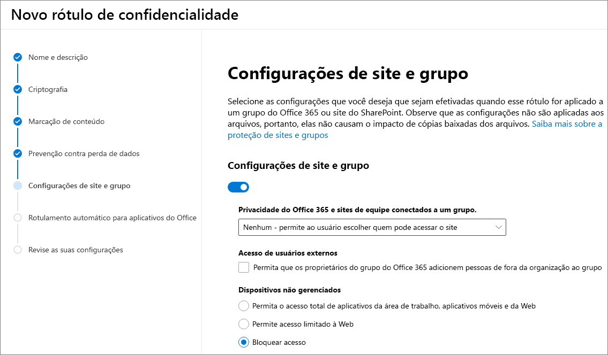

# <a name="use-sensitivity-labels-to-protect-content-in-microsoft-teams-microsoft-365-groups-and-sharepoint-sites-public-preview"></a>Use rótulos de confidencialidade para proteger o conteúdo do Microsoft Teams, grupos do Microsoft 365 e sites do SharePoint (visualização pública)

>*[Diretrizes de licenciamento do Microsoft 365 para segurança e conformidade](https://aka.ms/ComplianceSD).*

Quando você cria rótulos de confidencialidade no [Centro de conformidade do Microsoft 365](https://protection.office.com/), você pode aplicar aos seguintes contêineres: sites do Microsoft Teams, grupos do Microsoft 365 (anteriormente denominado Grupos do Microsoft 365) e sites do SharePoint. Use as configurações de rótulo a seguir para ajudar a proteger o conteúdo desses contêineres:

- Privacidade (pública ou privada) dos sites de equipes conectadas ao grupo do Microsoft 365
- Acesso de usuários externos
- Acesso de dispositivos não gerenciados 

Quando você aplica esse rótulo a um contêiner suportado, o rótulo aplica automaticamente as opções configuradas ao site ou grupo conectado. 

O conteúdo desses contêineres, no entanto, não herda os rótulos das configurações como nome, marcações visuais ou criptografia. Para que os usuários possam rotular seus documentos em sites do SharePoint ou em sites de equipe, [habilite rótulos de confidencialidade para arquivos do Office no SharePoint e OneDrive](sensitivity-labels-sharepoint-onedrive-files.md).

## <a name="about-the-public-preview-for-microsoft-teams-microsoft-365-groups-and-sharepoint-sites"></a>Sobre a visualização pública do Microsoft Teams, Grupos do Microsoft 365 e sites do SharePoint

Os rótulos de confidencialidade do Microsoft Teams, Grupos do Microsoft 365 e sites do SharePoint são gradualmente implementados para locatários e podem ser alterados antes do lançamento final. Esta versão pública não funciona com as CDNs (redes de distribuição de conteúdo do Office 365).

Antes de habilitar essa visualização e definir os rótulos de confidencialidade das novas configurações, os usuários podem ver e aplicar rótulos de confidencialidade em seus aplicativos. Por exemplo, no Word:


Depois de habilitar e configurar essa visualização, os usuários também podem ver e aplicar rótulos de confidencialidade do Microsoft Teams, Grupos do Microsoft 365 e sites do SharePoint. Por exemplo, quando você cria um novo site de equipe no SharePoint:


## <a name="enable-this-preview-and-synchronize-labels"></a>Habilitar esta visualização e sincronizar rótulos

1. Como esse recurso usa a funcionalidade do Azure AD, siga as instruções na documentação do Azure AD para habilitar a visualização: [Atribuir rótulos de confidencialidade aos grupos do Microsoft 365 no Azure Active Directory (visualização)](https://docs.microsoft.com/azure/active-directory/users-groups-roles/groups-assign-sensitivity-labels).

2. Agora, [conecte-se ao PowerShell do Centro de Conformidade e Segurança do Office 365](/powershell/exchange/office-365-scc/connect-to-scc-powershell/connect-to-scc-powershell). 
    
    Por exemplo, em uma sessão do PowerShell que você executa como administrador, entre com uma conta de administrador global:
    
    ```powershell
    Set-ExecutionPolicy RemoteSigned
    $UserCredential = Get-Credential
    $Session = New-PSSession -ConfigurationName Microsoft.Exchange -ConnectionUri https://ps.compliance.protection.outlook.com/powershell-liveid/ -Credential $UserCredential -Authentication Basic -AllowRedirection
    Import-PSSession $Session -DisableNameChecking
    ```

3. Execute o seguinte comando para sincronizar seus rótulos de confidencialidade com o Azure AD, para que eles possam ser usados com os Grupos do Microsoft 365:
    
    ```powershell
    Execute-AzureAdLabelSync
    ```

## <a name="how-to-configure-site-and-group-settings-when-you-create-or-edit-sensitivity-labels"></a>Como definir configurações de site e grupo ao criar ou editar rótulos de confidencialidade

Agora você está pronto para criar ou editar os rótulos de confidencialidade que deseja disponibilizar para sites e grupos. Habilitar a visualização torna uma nova página visível nas assistentes de rotulagem de confidencialidade: **Configurações de site e grupo**

Se precisar de ajuda para criar ou editar um rótulo de confidencialidade, confira as instruções em [Criar e configurar os rótulos de confidencialidade](create-sensitivity-labels.md#create-and-configure-sensitivity-labels).

Nesta nova página **Configurações de site e grupo**, defina as configurações:

- **Privacidade dos sites de equipes conectadas ao grupo do Office 365**: A configuração padrão de **Nenhum - permite que o usuário escolha quem pode acessar o site** está sendo implementado no momento para os locatários. Mantenha essa configuração padrão quando desejar proteger o conteúdo no contêiner usando o rótulo de confidencialidade, mas ainda permita que os usuários configurem eles mesmos a privacidade.
    
    Selecione **Pública** ou**Privada** para definir e bloquear a configuração de privacidade quando você aplicar esse rótulo ao contêiner. Escolha **Pública** se desejar que alguém da sua organização acesse o site de equipe ou grupo no qual esse rótulo é aplicado ou **Privada** se desejar que o acesso seja restrito apenas a membros aprovados em sua organização. 
    
    A configuração **Pública** ou **Privada** substitui qualquer configuração de privacidade anterior que possa ser definida para a equipe ou grupo e bloqueia o valor da privacidade, para que ele possa ser alterado apenas removendo primeiramente o rótulo de confidencialidade do contêiner. Depois de remover o rótulo de confidencialidade, a configuração de privacidade do rótulo permanece e os usuários agora podem alterá-lo novamente.

- **Acesso de usuários externos**: Controle se o proprietário do grupo pode [adicionar convidados ao grupo](/office365/admin/create-groups/manage-guest-access-in-groups).

- **Dispositivos não gerenciados**: Para [dispositivos não gerenciados](/sharepoint/control-access-from-unmanaged-devices), permita acesso total, acesso somente Web ou bloqueio total de acesso. 



> [!IMPORTANT]
> Somente essas configurações de site e grupo entrarão em vigor quando você aplicar um rótulo a uma equipe, grupo ou site. Outras configurações de rótulo, como criptografia e marcação de conteúdo, não são aplicadas ao conteúdo da equipe, grupo ou site.
> 
> Implementação gradual para locatários: Somente os rótulos com as configurações de site e grupo estarão disponíveis para seleção quando os usuários criarem equipes, grupos e sites. Se você pode aplicar um rótulo a um contêiner quando o rótulo não possui as configurações de site e grupo ativadas, apenas o nome do rótulo é aplicado ao contêiner.

Se o seu rótulo de confidencialidade ainda não estiver publicado, publique-o agora [adicionando-o a uma política de rótulo de confidencialidade](create-sensitivity-labels.md#publish-sensitivity-labels-by-creating-a-label-policy). Os usuários aos quais tenha sido atribuída uma política de rótulo de confidencialidade que inclua esse rótulo poderão selecioná-lo para sites e grupos.

Na política de rótulo, apenas a configuração de política **Aplicar esta etiqueta por padrão aos documentos e o email** é válida quando você aplica esse rótulo aos contêineres. Outras configurações de política não são aplicadas, as que incluem rotulagem obrigatória, exigindo justificativa do usuário e um link para a página de ajuda personalizada.

## <a name="sensitivity-label-management"></a>Gerenciamento de rótulo de confidencialidade

> [!WARNING]
> Criar, modificar e excluir rótulos de confidencialidade usados no Microsoft Teams, Grupos do Microsoft 365 e sites do SharePoint exige uma coordenação cuidadosa com a publicação de políticas de rótulo para os usuários. 

Evite erros de criação para sites e grupos que possam afetar todos os usuários usando as diretrizes a seguir.

**Criar e publicar rótulos:**

Depois de criar e publicar um rótulo de confidencialidade, pode levar até 24 horas para que o rótulo se torne visível para usuários em equipes, grupos e sites. Use as etapas a seguir para publicar um rótulo para todos os usuários no locatário:

1. Crie o rótulo de confidencialidade e publique-o para apenas algumas contas de usuários no locatário.

2. Aguarde 24 horas.

3. Após essas 24 horas de espera, use uma das contas de usuário especificadas na etapa 1 para criar uma equipe, grupo do Microsoft 365 ou site do SharePoint com o rótulo que você criou na etapa 1.

4. Se não houver erros durante a operação de criação da etapa 3, publique o rótulo para todos os usuários em seu locatário. Se houver erros, contate o [suporte da Microsoft](https://docs.microsoft.com/office365/admin/contact-support-for-business-products).

**Modificar e excluir rótulos publicados:**

Se você modificar ou excluir um rótulo de confidencialidade com as configurações de site e grupo ativadas e esse rótulo estiver incluído em uma ou mais políticas de rótulo, essas ações poderão resultar em falhas na criação de todas as equipes, grupos e sites. Para evitar essa situação, use as instruções a seguir:

1. Remova o rótulo de confidencialidade de todas as políticas de rótulo que incluam o rótulo.

2. Aguarde por 48 horas.

3. Após as 48 horas de espera, experimente criar uma equipe, grupo ou site e confirme se o rótulo não está mais visível.

4. Se a etiqueta de confidencialidade não estiver visível, agora você pode modificá-la ou excluí-la com segurança. Se o rótulo ainda estiver visível, contate o [suporte da Microsoft](https://docs.microsoft.com/office365/admin/contact-support-for-business-products).

## <a name="assign-sensitivity-labels-to-microsoft-365-groups"></a>Atribuir rótulos de confidencialidade aos Grupos do Microsoft 365

Agora você está pronto para aplicar os rótulos ou rótulos de confidencialidade aos grupos do Microsoft 365. Retorne à documentação do Azure AD para obter instruções:

- [Atribuir um rótulo a um novo grupo no portal do Azure](https://docs.microsoft.com/azure/active-directory/users-groups-roles/groups-assign-sensitivity-labels#assign-a-label-to-a-new-group-in-azure-portal)

-  [Atribuir um rótulo a um grupo existente no portal do Azure](https://docs.microsoft.com/azure/active-directory/users-groups-roles/groups-assign-sensitivity-labels#assign-a-label-to-an-existing-group-in-azure-portal)

-  [Remover um rótulo de um grupo existente no portal do Azure](https://docs.microsoft.com/azure/active-directory/users-groups-roles/groups-assign-sensitivity-labels#remove-a-label-from-an-existing-group-in-azure-portal).

## <a name="apply-a-sensitivity-label-to-a-new-team"></a>Aplicar um rótulo de confidencialidade a uma nova equipe

Os usuários podem selecionar os rótulos de confidencialidade ao criar novas equipes no Microsoft Teams. Quando eles selecionam o rótulo na lista suspensa **Confidencialidade**, a configuração de privacidade pode mudar para refletir a configuração de rótulo. Dependendo da configuração de acesso de usuários externos que você selecionou para o rótulo, os usuários podem ou não adicionar pessoas de fora da organização à equipe.

[Saiba mais sobre Rótulos de confidencialidade](https://docs.microsoft.com/microsoftteams/sensitivity-labels)


Depois de criar a equipe, o rótulo de confidencialidade aparecerá no canto superior direito de todos os canais.


O serviço aplica automaticamente o mesmo rótulo de confidencialidade ao grupo do Microsoft 365 e ao site de equipe do SharePoint conectado.

## <a name="apply-a-sensitivity-label-to-a-new-group-in-outlook-on-the-web"></a>Aplicar um rótulo de confidencialidade a um novo grupo no Outlook na Web

No Outlook na Web, ao criar um novo grupo, você pode selecionar ou alterar a opção de **Confidencialidade** para rótulos publicados:


## <a name="apply-a-sensitivity-label-to-a-new-site"></a>Aplicar um rótulo de confidencialidade a um novo site

Os administradores e os usuários finais podem selecionar os rótulos de confidencialidade ao [criar sites de equipe e sites de comunicação modernos](/sharepoint/create-site-collection) e expandir as **Configurações avançadas**:


A caixa suspensa exibe os nomes dos rótulos para a seleção e o ícone de ajuda exibe todos os nomes dos rótulos com a dica de ferramenta, o que pode ajudar os usuários a determinar o rótulo correto a ser aplicado.

Quando o rótulo é aplicado e os usuários navegam no site, eles veem o nome do rótulo e as políticas aplicadas. Por exemplo, este site foi rotulado como **Confidencial** e a configuração de privacidade está definida como **Privada**:


## <a name="view-sensitivity-labels-in-the-sharepoint-admin-center"></a>Exibir os rótulos de confidencialidade no centro de administração do SharePoint

Para exibir e editar os rótulos de confidencialidade, use a página de **Sites ativos** no novo centro de administração do SharePoint. Talvez seja necessário adicionar primeiro a coluna **Confidencialidade**:


[Saiba mais sobre como gerenciar sites no novo centro de administração do SharePoint](/sharepoint/manage-sites-in-new-admin-center).

## <a name="change-site-and-group-settings-for-a-label"></a>Alterar as configurações de um título

Sempre que você alterar as configurações de site e grupo de um rótulo, deverá executar os seguintes comandos do PowerShell para que suas equipes, sites e grupos possam usar as novas configurações. Como prática recomendada, não altere as configurações de site e grupo de um rótulo após aplicá-lo a várias equipes, grupos ou sites.

1. Primeiro, [conecte-se ao PowerShell do Centro de Conformidade e Segurança do Office 365](/powershell/exchange/office-365-scc/connect-to-scc-powershell/connect-to-scc-powershell). 
    
    Por exemplo, em uma sessão do PowerShell que você executa como administrador, entre com uma conta de administrador global:
    
    ```powershell
    Set-ExecutionPolicy RemoteSigned
    $UserCredential = Get-Credential
    $Session = New-PSSession -ConfigurationName Microsoft.Exchange -ConnectionUri https://ps.compliance.protection.outlook.com/powershell-liveid/ -Credential $UserCredential -Authentication Basic -AllowRedirection
    Import-PSSession $Session -DisableNameChecking
    ```

2. Obtenha a lista de rótulos de confidencialidade e suas GUIDs usando o cmdlet [Get-Label](https://docs.microsoft.com/powershell/module/exchange/policy-and-compliance/get-label?view=exchange-ps):
    
    ```powershell
    Get-Label |ft Name, Guid
    ```

3. Anote a GUID do rótulo ou os rótulos que você alterou.

4. Agora, [conecte-se ao PowerShell do Exchange Online](https://docs.microsoft.com/powershell/exchange/exchange-online/connect-to-exchange-online-powershell/connect-to-exchange-online-powershell?view=exchange-ps).
    
    Por exemplo:
    
    ```powershell
    $UserCredential = Get-Credential
    $Session = New-PSSession -ConfigurationName Microsoft.Exchange -ConnectionUri https://outlook.office365.com/powershell-liveid/ -Credential $UserCredential -Authentication Basic -AllowRedirection
    Import-PSSession $Session
    ```
    
5. Execute o cmdlet [Get-UnifiedGroup](https://docs.microsoft.com/powershell/module/exchange/users-and-groups/get-unifiedgroup?view=exchange-ps), especificando a GUID do rótulo no lugar da GUID de exemplo de "e48058ea-98e8-4940-8db0-ba1310fd955e": 
    
    ```powershell
    $Groups= Get-UnifiedGroup | Where {$_.SensitivityLabel  -eq "e48058ea-98e8-4940-8db0-ba1310fd955e"}
    ```

6. Para cada grupo, aplique novamente o rótulo de confidencialidade, especificando o GUID do rótulo no lugar do GUID de exemplo de "e48058ea-98e8-4940-8db0-ba1310fd955e":
    
    ```powershell
    foreach ($g in $groups)
    {Set-UnifiedGroup -Identity $g.Identity -SensitivityLabelId "e48058ea-98e8-4940-8db0-ba1310fd955e"}
    ```

## <a name="support-for-the-sensitivity-labels"></a>Suporte para os rótulos de confidencialidade

Você pode usar os rótulos de confidencialidade definidos para as configurações de site e grupo com os seguintes aplicativos e serviços:

- SharePoint Online
- Teams
- Outlook na Web
- Centro de administração do SharePoint
- Centro de Administração do Microsoft Azure AD

Outros aplicativos e serviços onde você não pode usar atualmente os rótulos de confidencialidade definidos para as configurações de site e grupo incluem:

- Outlook para Mac
- Outlook Mobile
- Área de trabalho do Outlook para Windows
- Forms
- Dynamics 365
- Yammer
- Stream
- Planner
- Project
- PowerBI
- Centro de administração do Teams
- Centro de administração do Microsoft 365
- Centro de administração do Exchange


## <a name="classic-azure-ad-group-classification"></a>Classificação clássica de grupo do Azure AD

O Microsoft 365 não oferece mais suporte às classificações antigas para novos grupos do Microsoft 365 e sites do SharePoint quando você habilita essa visualização. No entanto, os grupos e sites existentes ainda exibem os valores de classificação antigos, a menos que você os converta para usar rótulos de confidencialidade.

Como um exemplo de como você pode ter usado a classificação de grupo antiga do SharePoint, confira [Classificação de sites “moderna”](https://docs.microsoft.com/sharepoint/dev/solution-guidance/modern-experience-site-classification).

Essas classificações foram configuradas usando o Azure AD PowerShell ou a biblioteca Principal do PnP e definindo valores para a configuração do `ClassificationList`. Se seu locatário tiver valores de classificação definidos, eles serão mostrados quando você executar o seguinte comando no [módulo AzureADPreview PowerShell](https://www.powershellgallery.com/packages/AzureADPreview):

```powershell
   ($setting["ClassificationList"])
```

Para converter suas classificações antigas em rótulos de confidencialidade, siga um destes procedimentos:

- Usar rótulos existentes: Especifique as configurações de rótulo desejadas para sites e grupos editando rótulos de confidencialidade existentes que já foram publicados.

- Criar novos rótulos: Especifique as configurações de rótulos desejados para sites e grupos, criando e publicando novos rótulos de confidencialidade que tenham os mesmos nomes das suas classificações existentes.

Depois: 

1. Use o PowerShell para aplicar os rótulos de confidencialidade a grupos existentes do Microsoft 365 e sites do SharePoint usando o mapeamento de nomes. Confira a seção a seguir para obter instruções.

2. Remova as classificações antigas dos grupos e sites existentes.

Embora você não possa impedir que os usuários criem novos grupos em aplicativos e serviços que ainda não suportam rótulos de confidencialidade, é possível executar um script recorrente do PowerShell para procurar novos grupos que os usuários criaram com as classificações antigas e convertê-los para uso de rótulos de confidencialidade. 

#### <a name="use-powershell-to-convert-classifications-for-microsoft-365-groups-to-sensitivity-labels"></a>Use o PowerShell para converter classificações de grupos do Microsoft 365 em rótulos de confidencialidade

1. Primeiro, [conecte-se ao PowerShell do Centro de Conformidade e Segurança do Office 365](/powershell/exchange/office-365-scc/connect-to-scc-powershell/connect-to-scc-powershell). 
    
    Por exemplo, em uma sessão do PowerShell que você executa como administrador, entre com uma conta de administrador global:
    
    ```powershell
    Set-ExecutionPolicy RemoteSigned
    $UserCredential = Get-Credential
    $Session = New-PSSession -ConfigurationName Microsoft.Exchange -ConnectionUri https://ps.compliance.protection.outlook.com/powershell-liveid/ -Credential $UserCredential -Authentication Basic -AllowRedirection
    Import-PSSession $Session -DisableNameChecking
    ```

2. Obtenha a lista de rótulos de confidencialidade e suas GUIDs usando o cmdlet [Get-Label](https://docs.microsoft.com/powershell/module/exchange/policy-and-compliance/get-label?view=exchange-ps):
    
    ```powershell
    Get-Label |ft Name, Guid
    ```

3. Anote o GUIDe dos rótulos de confidencialidade que você deseja aplicar a seus grupos do Microsoft 365.

4. Agora, [conecte-se ao PowerShell do Exchange Online](https://docs.microsoft.com/powershell/exchange/exchange-online/connect-to-exchange-online-powershell/connect-to-exchange-online-powershell?view=exchange-ps).
    
    Por exemplo:
    
    ```powershell
    $UserCredential = Get-Credential
    $Session = New-PSSession -ConfigurationName Microsoft.Exchange -ConnectionUri https://outlook.office365.com/powershell-liveid/ -Credential $UserCredential -Authentication Basic -AllowRedirection
    Import-PSSession $Session
    ```

5. Use o seguinte comando como exemplo para obter a lista de grupos que atualmente têm a classificação "Geral":

   ```PowerShell
   $Groups= Get-UnifiedGroup | Where {$_.classification -eq "General"}
   ```

6. Para cada grupo, adicione o novo GUID de rótulo de confidencialidade. Por exemplo:

    ```PowerShell
    foreach ($g in $groups)
    {Set-UnifiedGroup -Identity $g.Identity -SensitivityLabelId "457fa763-7c59-461c-b402-ad1ac6b703cc"}
    ```

7. Repita as etapas 5 e 6 para as classificações de grupo restantes.

## <a name="auditing-sensitivity-label-activities"></a>Atividades de rótulo de confidencialidade de auditoria

Se alguém enviar um documento para um site protegido por um rótulo de confidencialidade e o documento tiver um rótulo de confidencialidade com [prioridade mais alta](sensitivity-labels.md#label-priority-order-matters) que o rótulo de confidencialidade aplicado ao site, essa ação não será bloqueada. Por exemplo, você aplicou o rótulo **Geral** a um site do SharePoint e alguém carrega neste site um documento chamado **Confidencial**. Como um rótulo de confidencialidade com prioridade mais alta identifica o conteúdo que é mais confidencial do que o conteúdo com ordem de prioridade mais baixa, essa situação pode ser um problema de segurança.

Embora a ação não seja bloqueada, ela é auditada, para que você possa identificar documentos com esse desalinhamento da prioridade do rótulo e tomar medidas, se necessário. Por exemplo, excluir ou mover o documento carregado do site. 

Não seria um problema de segurança se o documento tivesse um rótulo de confidencialidade de prioridade mais baixa que o rótulo de confidencialidade aplicado ao site. Por exemplo, um documento chamado **Geral** é carregado em um site chamado **Confidencial**. Neste cenário, um evento de auditoria não é gerado.

Para pesquisar o log de auditoria para esse evento, procure por **Incompatibilidade de confidencialidade em documento detectada** na categoria **Atividades de arquivo e página**. 

Quando alguém adiciona ou remove um rótulo de confidencialidade para ou de um site ou grupo, essas atividades também são auditadas. Esses eventos podem ser encontrados na categoria [Atividades de rótulo de confidencialidade](search-the-audit-log-in-security-and-compliance.md#sensitivity-label-activities). 

Para obter instruções sobre como pesquisar o log de auditoria, confira [Pesquisar o log de auditoria no Centro de Conformidade e Segurança](search-the-audit-log-in-security-and-compliance.md).

## <a name="troubleshoot-sensitivity-label-deployment"></a>Solucionar problemas de implantação de rótulo de confidencialidade

Está tendo problemas com os rótulos de confidencialidade dos Microsoft Teams, grupos do Microsoft 365 e sites do SharePoint? Verifique o seguinte:

### <a name="labels-not-visible-after-publishing"></a>Rótulos não visíveis após a publicação
Se você tiver problemas ao criar um site ou grupo do Microsoft 365 depois de habilitar essas configurações ou modificar o nome ou a dica de ferramenta de um rótulo de confidencialidade, aguarde algumas horas após salvar as alterações no rótulo e tente criar a equipe ou o grupo novamente. Para saber mais, confira [Agendar a distribuição após criar ou alterar um rótulo de confidencialidade](sensitivity-labels-sharepoint-onedrive-files.md#schedule-roll-out-after-you-create-or-change-a-sensitivity-label).

Se você ainda não conseguir ver o novo rótulo de confidencialidade do SharePoint Online, contate o [Suporte da Microsoft](https://docs.microsoft.com/office365/admin/contact-support-for-business-products).

### <a name="team-group-or-sharepoint-site-creation-errors"></a>Erros de criação de equipe, grupo ou site do SharePoint
Se você encontrar erros de criação durante a visualização pública, poderá desativar os rótulos de confidencialidade para Microsoft Teams, grupos do Microsoft 365 e sites do SharePoint usando as mesmas instruções de [Habilitar o suporte ao rótulo de confidencialidade no PowerShell](https://docs.microsoft.com/azure/active-directory/users-groups-roles/groups-assign-sensitivity-labels#enable-sensitivity-label-support-in-powershell). No entanto, para desabilitar a visualização, na etapa 5, desabilite o recurso usando o `$setting["EnableMIPLabels"] = "False"`.

## <a name="additional-resources"></a>Recursos adicionais

Consulte a gravação do seminário on-line e as perguntas respondidas para [Usar rótulos de sensibilidade nos sites Microsoft Teams, O365 Groups e SharePoint Online](https://techcommunity.microsoft.com/t5/security-privacy-and-compliance/using-sensitivity-labels-with-microsoft-teams-o365-groups-and/ba-p/1221885#M1380).

