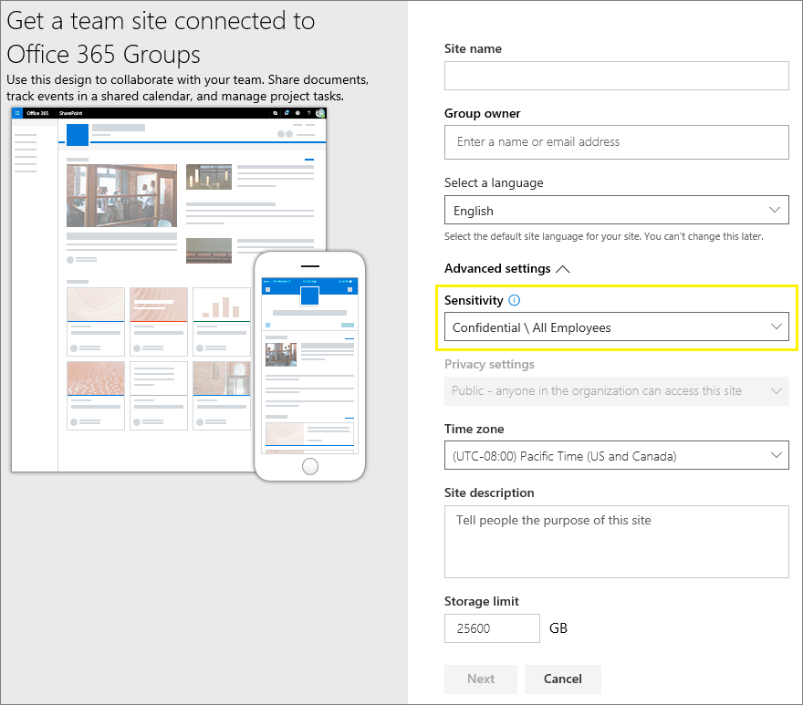

# <a name="use-sensitivity-labels-to-protect-content-in-microsoft-teams-microsoft-365-groups-and-sharepoint-sites"></a>Use rótulos de confidencialidade para proteger o conteúdo do Microsoft Teams, grupos do Microsoft 365 e sites do SharePoint

>*[Diretrizes de licenciamento do Microsoft 365 para segurança e conformidade](/office365/servicedescriptions/microsoft-365-service-descriptions/microsoft-365-tenantlevel-services-licensing-guidance/microsoft-365-security-compliance-licensing-guidance).*

Além de usar [rótulos de confidencialidade](sensitivity-labels.md) para classificar e proteger documentos e emails, você também pode usar rótulos de confidencialidade para proteger o conteúdo nos seguintes contêineres: sites de Microsoft Teams, grupos de Microsoft 365 groups ([antigos grupos do Office 365](https://techcommunity.microsoft.com/t5/microsoft-365-blog/office-365-groups-will-become-microsoft-365-groups/ba-p/1303601)) e sites do SharePoint. Para a classificação e a proteção de nível de contêiner, use as seguintes configurações de etiqueta:

- Privacidade (pública ou privada) de sites de equipes e grupos do Microsoft 365
- Acesso de usuários externos
- Compartilhamento externo de sites do Microsoft Office SharePoint Online
- Acesso de dispositivos não gerenciados
- Contextos de autenticação (em versão prévia)

> [!IMPORTANT]
> As configurações para dispositivos não gerenciados e contextos de autenticação funcionam em conjunto com o acesso condicional do Azure Active Directory. Você deve configurar este recurso dependente se quiser usar um rótulo de confidencialidade para essas configurações. Informações adicionais estão incluídas nas instruções abaixo.

Quando você aplica esse rótulo de confidencialidade a um contêiner compatível, o rótulo aplica automaticamente a classificação e as configurações de proteção configuradas ao site ou grupo.

O conteúdo nesses contêineres, no entanto, não herda os rótulos para a classificação ou configurações de arquivos e emails, como marcações visuais e criptografia. Para que os usuários possam rotular seus documentos em sites do SharePoint ou em sites de equipe, [habilite rótulos de confidencialidade para arquivos do Office no Microsoft Office SharePoint Online e OneDrive](sensitivity-labels-sharepoint-onedrive-files.md).

> [!NOTE]
> Os rótulos de confidencialidade de contêineres não têm suporte com o CDNs (redes de distribuição de conteúdo) do Office 365.

## <a name="using-sensitivity-labels-for-microsoft-teams-microsoft-365-groups-and-sharepoint-sites"></a>Use rótulos de confidencialidade para Microsoft Teams, grupos do Microsoft 365 e sites do SharePoint

Antes de habilitar rótulos de confidencialidade para recipientes e configurar rótulos de confidencialidade para as novas configurações, os usuários podem ver e aplicar rótulos de confidencialidade em seus aplicativos. Por exemplo, do Word:


Depois de habilitar e configurar os rótulos de confidencialidade dos contêineres, os usuários também poderão ver e aplicar rótulos de confidencialidade ao Microsoft Teams, Grupos do Microsoft 365 e sites do SharePoint. Po exemplo, quando você cria um novo site de equipe a partir do SharePoint:



## <a name="how-to-enable-sensitivity-labels-for-containers-and-synchronize-labels"></a>Como habilitar rótulos de confidencialidade para contêineres e sincronizar rótulos

Se você ainda não ativou os rótulos de confidencialidade para contêineres, execute o seguinte conjunto de etapas como um procedimento único:

1. Como esse recurso usa a funcionalidade do Azure Active Directory, siga as instruções na documentação do Azure Active Directory para habilitar o suporte de rótulos de confidencialidade: [Atribuir rótulos de confidencialidade aos grupos do Microsoft 365 no Azure Active Directory](/azure/active-directory/users-groups-roles/groups-assign-sensitivity-labels).

2. Agora, você precisa sincronizar seus rótulos de sensibilidade com o Azure Active Directory. Primeiro, [conecte-se ao Centro de Conformidade e Segurança do PowerShell](/powershell/exchange/office-365-scc/connect-to-scc-powershell/connect-to-scc-powershell).

   Por exemplo, em uma sessão do PowerShell que você executa como administrador, entre com uma conta de administrador global.

3. Execute o seguinte comando para assegurar seus rótulos de confidencialidade possam ser usados com os grupos do Microsoft 365:

    ```powershell
    Execute-AzureAdLabelSync
    ```

## <a name="how-to-configure-groups-and-site-settings"></a>Como definir grupos e configurações de site

Depois que os rótulos de confidencialidade são habilitados para contêineres conforme descrito na seção anterior, você pode definir as configurações de proteção para grupos e sites no assistente de rotulagem de confidencialidade. Até que os rótulos de confidencialidade sejam habilitados para contêineres, as configurações ficam visíveis no assistente, mas você não pode defini-las.

1. Siga as instruções gerais para [criar ou editar um rótulo de confidencialidade](create-sensitivity-labels.md#create-and-configure-sensitivity-labels) e certifique-se de selecionar **Grupos e sites** para o escopo do rótulo: 
    
    
    
    Quando apenas este escopo é selecionado para o rótulo, o rótulo não será exibido em aplicativos do Office que oferecem suporte a rótulos de confidencialidade e não pode ser aplicado a arquivos e emails. Ter essa separação de rótulos pode ser útil para usuários e administradores, mas também pode aumentar a complexidade da implantação de rótulos.
    
    Por exemplo, você precisa revisar cuidadosamente seu [pedido de rótulo](sensitivity-labels.md#label-priority-order-matters)porque o SharePoint detecta quando um documento rotulado é carregado em um site rotulado. Nesse cenário, um evento de auditoria e um email são gerados automaticamente quando o documento tem um rótulo de confidencialidade de prioridade mais alta do que o rótulo do site. Para obter mais informações, confira a seção [Atividades de rótulo de confidencialidade de auditoria](#auditing-sensitivity-label-activities) nesta página. 

2. Em seguida, na página **Definir configurações de proteção para grupos e sites**, selecione uma ou ambas as opções disponíveis:
    
    - **Configurações de privacidade e acesso de usuário externo** para definir as configurações de **Privacidade** e **Acesso de usuários externos**. 
    - **Configurações de compartilhamento externo e acesso condicional** para definir a configuração **Controlar compartilhamento externo de sites rotulados do Microsoft Office SharePoint Online** e **Usar o acesso condicional do Azure Active Directory para proteger sites rotulados do Microsoft Office SharePoint Online**.

3. Se você selecionou **Privacidade e configurações de acesso de usuário externo**, agora defina as seguintes configurações:
    
    - **Privacidade**: Mantenha o padrão do **Público** se desejar que qualquer pessoa em sua organização acesse o site de equipe ou grupo onde este rótulo é aplicado.
        
        Selecione **Particular** se desejar que o acesso seja restrito apenas a membros aprovados da sua organização.
        
        Selecione **Nenhum** quando quiser proteger o conteúdo no contêiner usando o rótulo de confidencialidade, mas ainda permitir que os próprios usuários definam a configuração de privacidade.
        
        Selecione **Pública** ou **Privada** para definir e bloquear a configuração de privacidade quando você aplicar esse rótulo ao contêiner. A configuração escolhida substituirá qualquer configuração de privacidade anterior que possa ser configurada para a equipe ou grupo, e bloqueará o valor de privacidade para que ele possa ser alterado apenas pela primeira remoção da etiqueta de confidencialidade do contêiner. Depois de remover o rótulo de confidencialidade, a configuração de privacidade do rótulo permanece e os usuários agora podem alterá-lo novamente.
    
    - **Acesso de usuário externo**: Controle se o proprietário do grupo pode [adicionar convidados ao grupo](/office365/admin/create-groups/manage-guest-access-in-groups).

4. Se você selecionou **Compartilhamento externo do dispositivo e configurações de acesso ao dispositivo**, agora defina as seguintes configurações:
    
    - **Controle o compartilhamento externo de sites rotulados do Microsoft Office SharePoint Online**: Selecione esta opção para selecionar o compartilhamento externo para qualquer pessoa, convidados novos e existentes, convidados existentes ou apenas pessoas em sua organização. pessoas em sua organização. Para obter mais informações sobre essa configuração e definições, confira a documentação do Microsoft Office SharePoint Online, [Ativar ou desativar o compartilhamento externo para um site](/sharepoint/change-external-sharing-site).
    
    - **Use o Acesso Condicional do Azure Active Directory para proteger sites rotulados do Microsoft Office SharePoint Online**: selecione essa opção apenas se sua organização tiver configurado e estiver usando o [Acesso Condicional do Azure Active Directory](/azure/active-directory/conditional-access/overview). Em seguida, selecione uma das seguintes configurações:
    
        - **Determine se os usuários podem acessar sites do Microsoft Office SharePoint Online de dispositivos não gerenciados**: esta opção usa o recurso do Microsoft Office SharePoint Online que usa o acesso condicional do Azure Active Directory para bloquear ou limitar o acesso ao conteúdo do Microsoft Office SharePoint Online e OneDrive de dispositivos não gerenciados. Para obter mais informações, consulte [Controle de acesso de dispositivos não gerenciados](/sharepoint/control-access-from-unmanaged-devices) na documentação do Microsoft Office SharePoint Online. A opção que você especifica para esta configuração de rótulo é o equivalente a executar um comando Windows PowerShell para um site, conforme descrito nas etapas 3 a 5 de [Bloquear ou limitar o acesso a um site específico do Microsoft Office SharePoint Online ou seção OneDrive](/sharepoint/control-access-from-unmanaged-devices#block-or-limit-access-to-a-specific-sharepoint-site-or-onedrive) das instruções do Microsoft Office SharePoint Online.
            
            Para obter informações adicionais de configuração, confira [Mais informações sobre as dependências da opção de dispositivos não gerenciados](#more-information-about-the-dependencies-for-the-unmanaged-devices-option) no final desta seção.
            
        - **Escolha um contexto de autenticação existente**: atualmente na prévia, esta opção permite que você aplique condições de acesso mais rigorosas quando os usuários acessam sites do Microsoft Office SharePoint Online que têm este rótulo aplicado. Essas condições são aplicadas quando você seleciona um contexto de autenticação existente que foi criado e publicado para a implantação de Acesso Condicional da sua organização. Se os usuários não atenderem às condições configuradas ou se usarem aplicativos que não oferecem suporte a contextos de autenticação, o acesso será negado.
            
            Para obter informações adicionais de configuração, confira [Mais informações sobre as dependências da opção de contexto de autenticação](#more-information-about-the-dependencies-for-the-authentication-context-option) no final desta seção.
            
            Exemplos para esta configuração de rótulo:
            
             - Você escolhe um contexto de autenticação configurado para exigir [autenticação multifator (MFA)](/azure/active-directory/conditional-access/untrusted-networks). Esse rótulo é então aplicado a um site do Microsoft Office SharePoint Online que contém itens altamente confidenciais. Como resultado, quando os usuários de uma rede não confiável tentam acessar um documento neste site, eles veem o prompt do MFA que devem ser preenchidos antes de acessar o documento.
             
             - Você escolhe um contexto de autenticação que é configurado para políticas de [termos de uso (ToU)](/azure/active-directory/conditional-access/terms-of-use). Esse rótulo é então aplicado a um site do Microsoft Office SharePoint Online que contém itens que exigem a aceitação dos termos de uso por motivos legais ou de conformidade. Como resultado, quando os usuários tentam acessar um documento neste site, eles veem um documento de termos de uso que devem aceitar antes de acessar o documento original.

> [!IMPORTANT]
> Só essas configurações de site e grupo entrarão em vigor quando você aplicar um rótulo a uma equipe, grupo ou site. Se o [escopo do rótulo](sensitivity-labels.md#label-scopes) inclui arquivos e emails, outras configurações de rótulo, como criptografia e marcação de conteúdo, não são aplicadas ao conteúdo da equipe, grupo ou site.

Se o seu rótulo de confidencialidade ainda não estiver publicado, publique-o agora [adicionando-o a uma política de rótulo de confidencialidade](create-sensitivity-labels.md#publish-sensitivity-labels-by-creating-a-label-policy). Os usuários aos quais tenha sido atribuída uma política de rótulo de confidencialidade que inclua esse rótulo poderão selecioná-lo para sites e grupos.

##### <a name="more-information-about-the-dependencies-for-the-unmanaged-devices-option"></a>Mais informações sobre as dependências da opção de dispositivos não gerenciados

Se você não configurar a política de acesso condicional dependente conforme documentado em [Usar restrições impostas do aplicativo](/sharepoint/app-enforced-restrictions), a opção que você especificar aqui não terá efeito. Além disso, não terá efeito se for menos restritivo do que a configuração definida ao nível do locatário. Se você definiu uma configuração em toda a organização para dispositivos não gerenciados, escolha uma configuração de rótulo que seja igual ou mais restritiva

Por exemplo, se seu locatário estiver configurado para **Permitir acesso limitado apenas à Web**, a configuração de rótulo que permite acesso total não terá efeito porque é menos restritiva. Para esta configuração de nível de locatário, escolha a configuração de rótulo para bloquear o acesso (mais restritiva) ou a configuração de rótulo para acesso limitado (a mesma que a configuração do locatário).

Como você pode configurar o SharePoint separadamente da configuração do rótulo, não há verificação no assistente do rótulo de confidencialidade de que as dependências estejam no lugar. Essas dependências podem ser configuradas depois que o rótulo é criado e publicado, e mesmo depois que o rótulo é aplicado. No entanto, se o rótulo já estiver aplicado, a configuração do rótulo não entrará em vigor até a próxima autenticação do usuário.

##### <a name="more-information-about-the-dependencies-for-the-authentication-context-option"></a>Mais informações sobre as dependências da opção de contexto de autenticação

Para exibir na lista suspensa para seleção, os contextos de autenticação devem ser criados, configurados e publicados como parte de sua configuração de acesso de condição do Azure Active Directory. Para obter mais informações e instruções, confira a seção [Configurar contextos de autenticação](/azure/active-directory/conditional-access/concept-conditional-access-cloud-apps#configure-authentication-contexts) da documentação de Acesso Condicional do Azure Active Directory.

Nem todos os aplicativos suportam contextos de autenticação. Se um usuário com um aplicativo sem suporte se conectar ao site configurado para um contexto de autenticação, ele verá uma mensagem de acesso negado ou será solicitado a autenticar, mas foi rejeitado. Os aplicativos que atualmente suportam os contextos de autenticação:

- Office na Web, que inclui Outlook para a web

- Microsoft Teams para Windows e macOS (exclui o aplicativo Web do Teams)

- Microsoft Planner

- Microsoft 365 Apps para Word, Excel e PowerPoint; versões mínimas:
    - Windows: 2103
    - macOS: 16.45.1202
    - iOS: 2.48.303
    - Android: 16.0.13924.10000

- Microsoft 365 Apps para Outlook; versões mínimas:
    - Windows: 2103
    - macOS: 16.45.1202
    - iOS: 4.2109.0
    - Android: 4.2025.1

- Aplicativo de Sincronização do Microsoft OneDrive, versões mínimas:
    - Windows: 21.002
    - macOS: 21.002
    - iOS: lançamento em 12h30
    - Android: ainda sem suportado

Limitações conhecidas para esta prévia:

- Para o aplicativo de Sincronização do Microsoft OneDrive, compatível apenas com OneDrive e não para outros sites.

- Os seguintes recursos e aplicativos podem ser incompatíveis com contextos de autenticação, portanto, recomendamos que você verifique se eles continuam a funcionar depois que um usuário acessar um site usando um contexto de autenticação:
    
    - Fluxos de trabalho que usam PowerApps ou Power Automate
    - Aplicativos de terceiros

## <a name="sensitivity-label-management"></a>Gerenciamento de rótulo de confidencialidade

Use as diretrizes a seguir para criar, modificar ou excluir rótulos de confidencialidade que estão configurados para sites e grupos.

### <a name="creating-and-publishing-labels-that-are-configured-for-sites-and-groups"></a>Criar e publicar rótulos configurados para sites e grupos

Quando um novo rótulo de confidencialidade é criado e publicado, torna-se visível para os usuários em equipes, grupos e sites dentro de uma hora. No entanto, se tiver modificado um rótulo existente será preciso aguardar até 24 horas. Use as diretrizes a seguir para publicar um rótulo para seus usuários quando esse rótulo estiver configurado para as configurações de site e de grupo:

1. Depois de criar e configurar o rótulo de confidencialidade, adicione esse rótulo a uma política de rótulo que se aplica a apenas alguns usuários de teste.

2. Aguarde o seguinte prazo para que a alteração seja replicada:

   - Rótulo novo: aguarde uma hora.
   - Rótulo existente: aguarde 24 horas.

3. Após esse período de espera, use uma das contas de usuário de teste para criar uma equipe, grupo do Microsoft 365 ou site do SharePoint com o rótulo que você criou na etapa 1.

4. Se não houver erros durante a operação de criação, você saberá que é seguro publicar o rótulo para todos os usuários em seu locatário.

### <a name="modifying-published-labels-that-are-configured-for-sites-and-groups"></a>Modificar rótulos publicados que estão configurados para sites e grupos

Como prática recomendada, não altere as configurações de site e grupo de um rótulo de confidencialidade após aplicá-lo a várias equipes, grupos ou sites. Se decidir fazer isso, lembre-se de aguardar até 24 horas para que as alterações sejam replicadas para todos os contêineres que têm o rótulo aplicado.

Além disso, se suas alterações incluírem a configuração de **Acesso de usuários externos**:

- A nova configuração se aplica a novos usuários, mas não aos usuários existentes. Por exemplo, se essa configuração foi selecionada anteriormente e, como resultado, os usuários convidados acessaram o site, esses usuários convidados ainda poderão acessar o site depois que essa configuração for desmarcada na configuração do rótulo.

- As configurações de privacidade para as propriedades do grupo hiddenMembership e roleEnabled não são atualizadas.

### <a name="deleting-published-labels-that-are-configured-for-sites-and-groups"></a>Excluindo rótulos publicados que estão configurados para sites e grupos

Se você excluir um rótulo de confidencialidade que tem as configurações de site e grupo habilitadas e esse rótulo estiver incluído em uma ou mais políticas de rótulo, essa ação poderá resultar em falhas na criação de novas equipes, grupos e sites. Para evitar essa situação, use as seguintes orientações:

1. Remova o rótulo de confidencialidade de todas as políticas de rótulo que incluam o rótulo.

2. Aguarde uma hora.

3. Após esse período de espera, tente criar uma equipe, grupo ou site e confirme se o rótulo não está mais visível.

4. Se a etiqueta de confidencialidade não estiver visível, agora você pode excluí-la com segurança.

## <a name="how-to-apply-sensitivity-labels-to-containers"></a>Como aplicar rótulos de confidencialidade aos contêineres

Agora você está pronto para aplicar os rótulos ou rótulos de confidencialidade aos seguintes contêineres:

- [Grupo do Microsoft 365 no Azure Active Directory](#apply-sensitivity-labels-to-microsoft-365-groups)
- [Site de equipe do Microsoft Teams](#apply-a-sensitivity-label-to-a-new-team)
- [Grupo do Microsoft 365 no Outlook na Web](#apply-a-sensitivity-label-to-a-new-group-in-outlook-on-the-web)
- [Site do Microsoft Office SharePoint Online](#apply-a-sensitivity-label-to-a-new-site)

Você pode usar o Windows PowerShell se precisar [aplicar um rótulo de confidencialidade a vários sites](#use-powershell-to-apply-a-sensitivity-label-to-multiple-sites).

### <a name="apply-sensitivity-labels-to-microsoft-365-groups"></a>Aplicar rótulos de confidencialidade aos grupos do Microsoft 365

Agora você está pronto para aplicar os rótulos ou rótulos de confidencialidade aos grupos do Microsoft 365. Retorne à documentação do Azure AD para obter instruções:

- [Atribuir um rótulo a um novo grupo no portal do Azure](/azure/active-directory/users-groups-roles/groups-assign-sensitivity-labels#assign-a-label-to-a-new-group-in-azure-portal)

- [Atribuir um rótulo a um grupo existente no portal do Azure](/azure/active-directory/users-groups-roles/groups-assign-sensitivity-labels#assign-a-label-to-an-existing-group-in-azure-portal)

- [Remover um rótulo de um grupo existente no portal do Azure](/azure/active-directory/users-groups-roles/groups-assign-sensitivity-labels#remove-a-label-from-an-existing-group-in-azure-portal).

### <a name="apply-a-sensitivity-label-to-a-new-team"></a>Aplicar um rótulo de confidencialidade a uma nova equipe

Os usuários podem selecionar os rótulos de confidencialidade ao criar novas equipes no Microsoft Teams. Quando eles selecionam o rótulo na lista suspensa **Confidencialidade**, a configuração de privacidade pode mudar para refletir a configuração de rótulo. Dependendo da configuração de acesso de usuários externos que você selecionou para o rótulo, os usuários podem ou não adicionar pessoas de fora da organização à equipe.

[Saiba mais sobre Rótulos de confidencialidade](/microsoftteams/sensitivity-labels)


Depois de criar a equipe, o rótulo de confidencialidade aparecerá no canto superior direito de todos os canais.


O serviço aplica automaticamente o mesmo rótulo de confidencialidade ao grupo do Microsoft 365 e ao site de equipe do SharePoint conectado.

### <a name="apply-a-sensitivity-label-to-a-new-group-in-outlook-on-the-web"></a>Aplicar um rótulo de confidencialidade a um novo grupo no Outlook na Web

No Outlook na Web, ao criar um novo grupo, você pode selecionar ou alterar a opção de **Confidencialidade** para rótulos publicados:


### <a name="apply-a-sensitivity-label-to-a-new-site"></a>Aplicar um rótulo de confidencialidade a um novo site

Os administradores e os usuários finais podem selecionar os rótulos de confidencialidade ao [criar sites de equipe e sites de comunicação modernos](/sharepoint/create-site-collection) e expandir as **Configurações avançadas**:


A caixa suspensa exibe os nomes dos rótulos para a seleção e o ícone de ajuda exibe todos os nomes dos rótulos com a dica de ferramenta, o que pode ajudar os usuários a determinar o rótulo correto a ser aplicado.

Quando o rótulo é aplicado e os usuários navegam no site, eles veem o nome do rótulo e as políticas aplicadas. Por exemplo, este site foi rotulado como **Confidencial** e a configuração de privacidade está definida como **Privada**:


### <a name="use-powershell-to-apply-a-sensitivity-label-to-multiple-sites"></a>Usar o Windows PowerShell para aplicar um rótulo de confidencialidade a vários sites

Você pode usar o cmdlet [Set-SPOSite](/powershell/module/sharepoint-online/set-sposite) e [Set-SPOTenant](/powershell/module/sharepoint-online/set-spotenant) com o parâmetro *SensitivityLabel* do atual [SharePoint Online Management Shell](/powershell/sharepoint/sharepoint-online/connect-sharepoint-online) para aplicar um rótulo de confidencialidade a vários sites. Os sites podem ser um conjunto de sites do Microsoft Office SharePoint Online ou um site do OneDrive.

Verifique se você tem a versão 16.0.19418.12000 ou posterior do Shell de gerenciamento do SharePoint Online.

1. Abra uma sessão do Windows PowerShell com a opção **Executar como administrador**.

2. Se você não souber o GUID de seu rótulo: [Conectar ao Centro de Segurança e Conformidade do PowerShell](/powershell/exchange/connect-to-scc-powershell) e obter a lista de rótulos de confidencialidade e seus GUIDs.

   ```powershell
   Get-Label |ft Name, Guid
   ```

3. Agora [conectar-se ao SharePoint Online PowerShell](/powershell/sharepoint/sharepoint-online/connect-sharepoint-online) e armazenar o GUID de seu rótulo como uma variável. Por exemplo:

   ```powershell
   $Id = [GUID]("e48058ea-98e8-4940-8db0-ba1310fd955e")
   ```

4. Crie uma nova variável que identifique vários sites que possuem uma cadeia de caracteres de identificação em comum com a URL. Por exemplo:

   ```powershell
   $sites = Get-SPOSite -IncludePersonalSite $true -Limit all -Filter "Url -like 'documents"
   ```

5. Execute o seguinte comando para aplicar o rótulo a esses sites. Usando nossos exemplos:

   ```powershell
   $sites | ForEach-Object {Set-SPOTenant $_.url -SensitivityLabel $Id}
   ```

Esta série de comandos permite rotular vários sites em seu locatário com o mesmo rótulo de confidencialidade, é por isso que você usa o cmdlet Set-SPOTenant, em vez do cmdlet Set-SPOSite que é usado para configuração por site. No entanto, use o cmdlet Set-SPOSite quando precisar aplicar um rótulo diferente a sites específicos, repetindo o seguinte comando para cada um desses sites: `Set-SPOSite -Identity <URL> -SensitivityLabel "<labelguid>"`

## <a name="view-and-manage-sensitivity-labels-in-the-sharepoint-admin-center"></a>Exibir e gerenciar rótulos de confidencialidade no Centro de Administração do SharePoint Online

Para exibir, classificar e pesquisar os rótulos de confidencialidade aplicados, use a página de **Sites ativos** no novo Centro de Administração do SharePoint Online. Talvez seja necessário adicionar primeiro a coluna **Confidencialidade**:


Para obter mais informações sobre como gerenciar sites na página de sites ativos, inclusive como adicionar uma coluna, confira [Gerenciar sites no novo Centro de Administração do SharePoint Online](/sharepoint/manage-sites-in-new-admin-center).

Você também pode alterar e aplicar um rótulo da seguinte página:

1. Selecione o nome do site para abrir o painel de detalhes.

2. Selecione a guia **Políticas** e, em seguida, selecione **Editar** para a configuração de **Confidencialidade**.

3. No painel **Editar configuração de confidencialidade**, selecione o rótulo de confidencialidade que você deseja aplicar ao site e, em seguida, selecione **Salvar**.

## <a name="support-for-sensitivity-labels"></a>Suporte de rótulos de confidencialidade.

Os seguintes aplicativos e serviços oferecem suporte as etiquetas de confidencialidade configuradas para configurações de sites e grupos:

- Centros de administração:

  - Centro de administração do SharePoint
  - Portal do Azure Active Directory
  - Centro de administração do Microsoft 365
  - Centro de conformidade do Microsoft 365, Centro de segurança do Microsoft 365, Centro de Conformidade e Segurança.

- Aplicativos e serviços do usuário:

  - Microsoft Office SharePoint Online
  - Teams
  - Outlook na Web e para Windows, macOS, iOS e Android
  - Formulários
  - Stream
  - Planner 

Os seguintes aplicativos e serviços não oferecem suporte as etiquetas de confidencialidade configuradas para configurações de sites e grupos:

- Centros de administração:

  - Centro de administração do Teams
  - Centro de administração do Exchange

- Aplicativos e serviços do usuário:

  - Dynamics 365
  - Yammer
  - Project
  - Power BI

## <a name="classic-azure-ad-group-classification"></a>Classificação clássica de grupo do Azure Active Directory

O Microsoft 365 não oferece mais suporte às classificações antigas para novos grupos do Microsoft 365 e sites do SharePoint quando você habilita os rótulos de confidencialidade para contêineres. No entanto, os grupos e sites existentes que oferecem suporte a rótulos de confidencialidade ainda exibem os valores de classificação antigos, até que você os converta para usar rótulos de confidencialidade.

Como um exemplo de como você pode ter usado a classificação de grupo antiga do SharePoint, confira [Classificação de sites “moderna”](/sharepoint/dev/solution-guidance/modern-experience-site-classification).

Essas classificações foram configuradas usando o Azure AD PowerShell ou a biblioteca Principal do PnP e definindo valores para a configuração do `ClassificationList`. Se seu locatário tiver valores de classificação definidos, eles serão mostrados quando você executar o seguinte comando no [módulo AzureADPreview PowerShell](https://www.powershellgallery.com/packages/AzureADPreview):

```powershell
($setting["ClassificationList"])
```

Para converter suas classificações antigas em rótulos de confidencialidade, siga um destes procedimentos:

- Usar rótulos existentes: Especifique as configurações de rótulo desejadas para sites e grupos editando rótulos de confidencialidade existentes que já foram publicados.

- Criar novos rótulos: Especifique as configurações de rótulos desejados para sites e grupos, criando e publicando novos rótulos de confidencialidade que tenham os mesmos nomes das suas classificações existentes.

Depois:

1. Use o PowerShell para aplicar rótulos de confidencialidade a Grupos do Microsoft 365 e sites do SharePoint existentes usando o mapeamento de nomes. Confira a próxima seção para obter instruções.

2. Remova as classificações antigas dos grupos e sites existentes.

Embora você não possa impedir que os usuários criem novos grupos em aplicativos e serviços que ainda não suportam rótulos de confidencialidade, é possível executar um script recorrente do PowerShell para procurar novos grupos que os usuários criaram com as classificações antigas e convertê-los para uso de rótulos de confidencialidade.

Para ajudar você a gerenciar a coexistência de rótulos de sensibilidade e classificações do Azure Active Directory para sites e grupos, confira [rótulos de classificação e confidencialidade do Azure Active Directory para grupos do Microsoft 365](migrate-aad-classification-sensitivity-labels.md).

### <a name="use-powershell-to-convert-classifications-for-microsoft-365-groups-to-sensitivity-labels"></a>Use o PowerShell para converter classificações de grupos do Microsoft 365 em rótulos de confidencialidade

1. Primeiro, [conecte-se ao Centro de Conformidade e Segurança do PowerShell](/powershell/exchange/office-365-scc/connect-to-scc-powershell/connect-to-scc-powershell).

   Por exemplo, em uma sessão do PowerShell que você executa como administrador, entre com uma conta de administrador global:

2. Obtenha a lista de rótulos de confidencialidade e suas GUIDs usando o cmdlet [Get-Label](/powershell/module/exchange/get-label):

   ```powershell
   Get-Label |ft Name, Guid
   ```

3. Anote o GUIDe dos rótulos de confidencialidade que você deseja aplicar a seus grupos do Microsoft 365.

4. Agora [conecte-se ao Exchange Online PowerShell](/powershell/exchange/connect-to-exchange-online-powershell) em uma janela separada do Windows PowerShell.

5. Use o seguinte comando como exemplo para obter a lista de grupos que atualmente têm a classificação "Geral":

   ```PowerShell
   $Groups= Get-UnifiedGroup | Where {$_.classification -eq "General"}
   ```

6. Para cada grupo, adicione o novo GUID de rótulo de confidencialidade. Por exemplo:

    ```PowerShell
    foreach ($g in $groups)
    {Set-UnifiedGroup -Identity $g.Identity -SensitivityLabelId "457fa763-7c59-461c-b402-ad1ac6b703cc"}
    ```

7. Repita as etapas 5 e 6 para as classificações de grupo restantes.

## <a name="auditing-sensitivity-label-activities"></a>Atividades de rótulo de confidencialidade de auditoria

> [!IMPORTANT]
> Se você usar a separação de rótulos selecionando apenas o escopo **Grupos e sites** para rótulos que protegem os contêineres: Por causa do evento de auditoria de **Incompatibilidade de confidencialidade do documento detectado** e email descrito nesta seção, considere [ordenar esses rótulos](sensitivity-labels.md#label-priority-order-matters)antes dos rótulos que têm um escopo para **Arquivos e emails**. 

Se alguém enviar um documento para um site protegido por um rótulo de confidencialidade e o documento tiver um rótulo de confidencialidade com [prioridade mais alta](sensitivity-labels.md#label-priority-order-matters) que o rótulo de confidencialidade aplicado ao site, essa ação não será bloqueada. Por exemplo, você aplicou o rótulo **Geral** a um site do SharePoint e alguém carrega neste site um documento chamado **Confidencial**. Como um rótulo de confidencialidade com prioridade mais alta identifica o conteúdo que é mais confidencial do que o conteúdo com ordem de prioridade mais baixa, essa situação pode ser um problema de segurança.

Embora a ação não seja bloqueada, ela é auditada e, por padrão, gera automaticamente um email para a pessoa que carregou o documento e para o administrador do site. Como resultado, tanto o usuário como os administradores podem identificar documentos que tenham esse desalinhamento da prioridade do rótulo e tomar medidas, se necessário. Por exemplo, excluir ou mover o documento carregado do site.

Não seria um problema de segurança se o documento tivesse um rótulo de confidencialidade de prioridade mais baixa que o rótulo de confidencialidade aplicado ao site. Por exemplo, um documento chamado **Geral** é carregado em um site chamado **Confidencial**. Neste cenário, um evento de auditoria e email não são gerados.

Para pesquisar o log de auditoria para esse evento, procure por **Incompatibilidade de confidencialidade em documento detectada** na categoria **Atividades de arquivo e página**.

O email gerado automaticamente tem o assunto **Rótulo de confidencialidade incompatível detectado** e a mensagem do email explica a incompatibilidade de rótulo com um link para o documento e o site carregados. Ele também contém um link de documentação que explica como os usuários podem alterar o rótulo de confidencialidade. Esses emails automatizados não podem ser personalizados, mas você pode evitar que sejam enviados ao usar o seguinte comando do PowerShell do [Set-SPOTenant](/powershell/module/sharepoint-online/set-spotenant):

```PowerShell
Set-SPOTenant -BlockSendLabelMismatchEmail $True
```

Quando alguém adiciona ou remove um rótulo de confidencialidade para ou de um site ou grupo, essas atividades também são auditadas, mas não geram um email automático.

Todos esses eventos podem ser encontrados na categoria [Atividades de rótulo de confidencialidade](search-the-audit-log-in-security-and-compliance.md#sensitivity-label-activities). Para obter instruções sobre como pesquisar o log de auditoria, confira [Pesquisar o log de auditoria no Centro de Conformidade e Segurança](search-the-audit-log-in-security-and-compliance.md).

## <a name="how-to-disable-sensitivity-labels-for-containers"></a>Como desabilitar os rótulos de confidencialidade para contêineres

Você pode desativar os rótulos de confidencialidade do Microsoft Teams, grupos do Microsoft 365 e sites do SharePoint usando as mesmas instruções de [Habilitar o suporte a rótulo de confidencialidade no PowerShell](/azure/active-directory/users-groups-roles/groups-assign-sensitivity-labels#enable-sensitivity-label-support-in-powershell). No entanto, para desabilitar o recurso, na etapa 5, especifique `$setting["EnableMIPLabels"] = "False"`.

Além de tornar todas as configurações não disponíveis para grupos e sites ao criar ou editar rótulos de confidencialidade, esta ação reverte a propriedade que os contêineres usam para sua configuração. Habilitar rótulos de confidencialidade para o Microsoft Teams, o Microsoft 365 Groups, e os sites do SharePoint altera a propriedade usada de **Classificação** (usada para [classificação de grupo do Azure Active Direcroty](#classic-azure-ad-group-classification)) para **Confidencialidade**. Quando você desabilita os rótulos de confidencialidade para contêineres, os contêineres ignoram a propriedade Confidencialidade e usam novamente a propriedade de Classificação.

Isso significa que todas as configurações de rótulo de sites e grupos aplicados anteriormente aos contêineres não serão forçadas e os contêineres não exibirão mais os rótulos.

Se esses contêineres tiverem valores de classificação do Azure Active Directory aplicados, eles voltarão a usar as classificações novamente. Lembre-se de que todos os novos sites ou grupos criados depois de habilitar o recurso não exibirão um rótulo ou terão uma classificação. Para esses contêineres e todos os novos contêineres, você pode aplicar valores de classificação. Para saber mais, confira [Classificação de sites modernos do Microsoft Office SharePoint Online](/sharepoint/dev/solution-guidance/modern-experience-site-classification) e [Criar classificações para grupos do Office em sua organização](../enterprise/manage-microsoft-365-groups-with-powershell.md).

## <a name="additional-resources"></a>Recursos adicionais

Consulte a gravação do seminário on-line e as perguntas respondidas para [Usar rótulos de sensibilidade nos sites Microsoft Teams, O365 Groups e SharePoint Online](https://techcommunity.microsoft.com/t5/security-privacy-and-compliance/using-sensitivity-labels-with-microsoft-teams-o365-groups-and/ba-p/1221885#M1380).

Esse webinar foi gravado quando o recurso ainda estava na visualização, para que você possa observar algumas discrepâncias na interface do usuário. No entanto, as informações para esse recurso ainda são precisas, com todos os novos recursos documentados nesta página.