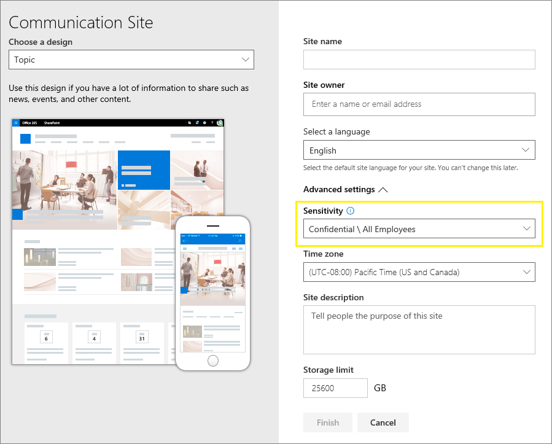

# <a name="use-sensitivity-labels-to-protect-content-in-microsoft-teams-microsoft-365-groups-and-sharepoint-sites-public-preview"></a><span data-ttu-id="08b3c-103">Use rótulos de confidencialidade para proteger o conteúdo do Microsoft Teams, grupos do Microsoft 365 e sites do SharePoint (visualização pública)</span><span class="sxs-lookup"><span data-stu-id="08b3c-103">Use sensitivity labels to protect content in Microsoft Teams, Microsoft 365 groups, and SharePoint sites (public preview)</span></span>

><span data-ttu-id="08b3c-104">*[Diretrizes de licenciamento do Microsoft 365 para segurança e conformidade](https://aka.ms/ComplianceSD).*</span><span class="sxs-lookup"><span data-stu-id="08b3c-104">*[Microsoft 365 licensing guidance for security & compliance](https://aka.ms/ComplianceSD).*</span></span>

<span data-ttu-id="08b3c-105">Agora, ao criar rótulos de confidencialidade no [Centro de conformidade do Microsoft 365](https://protection.office.com/), você pode aplicá-los aos seguintes contêineres: sites do Microsoft Teams, grupos do Microsoft 365 ([anteriormente grupos do Office 365](https://techcommunity.microsoft.com/t5/microsoft-365-blog/office-365-groups-will-become-microsoft-365-groups/ba-p/1303601)) e sites do SharePoint.</span><span class="sxs-lookup"><span data-stu-id="08b3c-105">When you create sensitivity labels in the [Microsoft 365 compliance center](https://protection.office.com/), you can now apply them to the following containers: Microsoft Teams sites, Microsoft 365 groups ([formerly Office 365 groups](https://techcommunity.microsoft.com/t5/microsoft-365-blog/office-365-groups-will-become-microsoft-365-groups/ba-p/1303601)), and SharePoint sites.</span></span> <span data-ttu-id="08b3c-106">Use as configurações de rótulo a seguir para ajudar a proteger o conteúdo desses contêineres:</span><span class="sxs-lookup"><span data-stu-id="08b3c-106">Use the following label settings to help protect the content in those containers:</span></span>

- <span data-ttu-id="08b3c-107">Privacidade (pública ou privada) dos sites de equipes conectadas ao grupo do Microsoft 365</span><span class="sxs-lookup"><span data-stu-id="08b3c-107">Privacy (public or private) of Microsoft 365 group-connected teams sites</span></span>
- <span data-ttu-id="08b3c-108">Acesso de usuários externos</span><span class="sxs-lookup"><span data-stu-id="08b3c-108">External users access</span></span>
- <span data-ttu-id="08b3c-109">Acesso de dispositivos não gerenciados</span><span class="sxs-lookup"><span data-stu-id="08b3c-109">Access from unmanaged devices</span></span> 

<span data-ttu-id="08b3c-110">Quando você aplica esse rótulo a um contêiner suportado, o rótulo aplica automaticamente as opções configuradas ao site ou grupo conectado.</span><span class="sxs-lookup"><span data-stu-id="08b3c-110">When you apply this label to a supported container, the label automatically applies the configured options to the connected site or group.</span></span> 

<span data-ttu-id="08b3c-111">O conteúdo desses contêineres, no entanto, não herda os rótulos das configurações como nome, marcações visuais ou criptografia.</span><span class="sxs-lookup"><span data-stu-id="08b3c-111">Content in those containers however, do not inherit the labels for settings such as the label name, visual markings, or encryption.</span></span> <span data-ttu-id="08b3c-112">Para que os usuários possam rotular seus documentos em sites do SharePoint ou em sites de equipe, [habilite rótulos de confidencialidade para arquivos do Office no SharePoint e OneDrive](sensitivity-labels-sharepoint-onedrive-files.md).</span><span class="sxs-lookup"><span data-stu-id="08b3c-112">So that users can label their documents in SharePoint sites or team sites, [enable sensitivity labels for Office files in SharePoint and OneDrive](sensitivity-labels-sharepoint-onedrive-files.md).</span></span>

## <a name="about-the-public-preview-for-microsoft-teams-microsoft-365-groups-and-sharepoint-sites"></a><span data-ttu-id="08b3c-113">Sobre a visualização pública do Microsoft Teams, Grupos do Microsoft 365 e sites do SharePoint</span><span class="sxs-lookup"><span data-stu-id="08b3c-113">About the public preview for Microsoft Teams, Microsoft 365 groups, and SharePoint sites</span></span>

<span data-ttu-id="08b3c-114">Os rótulos de confidencialidade do Microsoft Teams, Grupos do Microsoft 365 e sites do SharePoint são gradualmente implementados para locatários e podem ser alterados antes do lançamento final.</span><span class="sxs-lookup"><span data-stu-id="08b3c-114">Sensitivity labels for Microsoft Teams, Microsoft 365 groups, and SharePoint sites is in preview and might change before final release.</span></span> <span data-ttu-id="08b3c-115">Esta versão pública não funciona com as CDNs (redes de distribuição de conteúdo do Office 365).</span><span class="sxs-lookup"><span data-stu-id="08b3c-115">This public preview doesn't work with Office 365 Content Delivery Networks (CDNs).</span></span>

<span data-ttu-id="08b3c-116">Antes de habilitar essa visualização e definir os rótulos de confidencialidade das novas configurações, os usuários podem ver e aplicar rótulos de confidencialidade em seus aplicativos.</span><span class="sxs-lookup"><span data-stu-id="08b3c-116">Before you enable this preview and configure sensitivity labels for the new settings, users can see and apply sensitivity labels in their apps.</span></span> <span data-ttu-id="08b3c-117">Por exemplo, no Word:</span><span class="sxs-lookup"><span data-stu-id="08b3c-117">For example, from Word:</span></span>


<span data-ttu-id="08b3c-119">Depois de habilitar e configurar essa visualização, os usuários também podem ver e aplicar rótulos de confidencialidade do Microsoft Teams, Grupos do Microsoft 365 e sites do SharePoint.</span><span class="sxs-lookup"><span data-stu-id="08b3c-119">After you enable and configure this preview, users can additionally see and apply sensitivity labels to Microsoft Teams, Microsoft 365 groups, and SharePoint sites.</span></span> <span data-ttu-id="08b3c-120">Por exemplo, quando você cria um novo site de equipe no SharePoint:</span><span class="sxs-lookup"><span data-stu-id="08b3c-120">For example, when you create a new team site from SharePoint:</span></span>


## <a name="enable-this-preview-and-synchronize-labels"></a><span data-ttu-id="08b3c-122">Habilitar esta visualização e sincronizar rótulos</span><span class="sxs-lookup"><span data-stu-id="08b3c-122">Enable this preview and synchronize labels</span></span>

1. <span data-ttu-id="08b3c-123">Como esse recurso usa a funcionalidade do Azure AD, siga as instruções na documentação do Azure AD para habilitar a visualização: [Atribuir rótulos de confidencialidade aos grupos do Microsoft 365 no Azure Active Directory (visualização)](https://docs.microsoft.com/azure/active-directory/users-groups-roles/groups-assign-sensitivity-labels).</span><span class="sxs-lookup"><span data-stu-id="08b3c-123">Because this feature uses Azure AD functionality, follow the instructions in the Azure AD documentation to enable the preview: [Assign sensitivity labels to Microsoft 365 groups in Azure Active Directory (preview)](https://docs.microsoft.com/azure/active-directory/users-groups-roles/groups-assign-sensitivity-labels).</span></span>

2. <span data-ttu-id="08b3c-124">Agora, [conecte-se ao PowerShell do Centro de Conformidade e Segurança do Office 365](/powershell/exchange/office-365-scc/connect-to-scc-powershell/connect-to-scc-powershell).</span><span class="sxs-lookup"><span data-stu-id="08b3c-124">Now [connect to Office 365 Security & Compliance Center PowerShell](/powershell/exchange/office-365-scc/connect-to-scc-powershell/connect-to-scc-powershell).</span></span> 
    
    <span data-ttu-id="08b3c-125">Por exemplo, em uma sessão do PowerShell que você executa como administrador, entre com uma conta de administrador global:</span><span class="sxs-lookup"><span data-stu-id="08b3c-125">For example, in a PowerShell session that you run as administrator, sign in with a global administrator account:</span></span>
    
    ```powershell
    Set-ExecutionPolicy RemoteSigned
    $UserCredential = Get-Credential
    $Session = New-PSSession -ConfigurationName Microsoft.Exchange -ConnectionUri https://ps.compliance.protection.outlook.com/powershell-liveid/ -Credential $UserCredential -Authentication Basic -AllowRedirection
    Import-PSSession $Session -DisableNameChecking
    ```

3. <span data-ttu-id="08b3c-126">Execute o seguinte comando para sincronizar seus rótulos de confidencialidade com o Azure AD, para que eles possam ser usados com os Grupos do Microsoft 365:</span><span class="sxs-lookup"><span data-stu-id="08b3c-126">Run the following command to synchronize your sensitivity labels to Azure AD, so that they can be used with Microsoft 365 groups:</span></span>
    
    ```powershell
    Execute-AzureAdLabelSync
    ```

## <a name="how-to-configure-site-and-group-settings-when-you-create-or-edit-sensitivity-labels"></a><span data-ttu-id="08b3c-127">Como definir configurações de site e grupo ao criar ou editar rótulos de confidencialidade</span><span class="sxs-lookup"><span data-stu-id="08b3c-127">How to configure site and group settings when you create or edit sensitivity labels</span></span>

<span data-ttu-id="08b3c-128">Agora você está pronto para criar ou editar os rótulos de confidencialidade que deseja disponibilizar para sites e grupos.</span><span class="sxs-lookup"><span data-stu-id="08b3c-128">You're now ready to create or edit sensitivity labels that you want to be available for sites and groups.</span></span> <span data-ttu-id="08b3c-129">Habilitar a visualização torna uma nova página visível nas assistentes de rotulagem de confidencialidade: **Configurações de site e grupo**</span><span class="sxs-lookup"><span data-stu-id="08b3c-129">Enabling the preview makes a new page visible in the sensitivity labeling wizards: **Site and group settings**</span></span>

<span data-ttu-id="08b3c-130">Se precisar de ajuda para criar ou editar um rótulo de confidencialidade, confira as instruções em [Criar e configurar os rótulos de confidencialidade](create-sensitivity-labels.md#create-and-configure-sensitivity-labels).</span><span class="sxs-lookup"><span data-stu-id="08b3c-130">If you need help with creating or editing a sensitivity label, see the instructions from [Create and configure sensitivity labels](create-sensitivity-labels.md#create-and-configure-sensitivity-labels).</span></span>

<span data-ttu-id="08b3c-131">Nesta nova página **Configurações de site e grupo**, defina as configurações:</span><span class="sxs-lookup"><span data-stu-id="08b3c-131">On this new **Site and group settings** page, configure the settings:</span></span>

- <span data-ttu-id="08b3c-132">**Privacidade dos sites de equipes conectados ao grupo do Office 365**: Manter a configuração padrão de \*\*Público - qualquer pessoa em sua organização pode acessar o site \*\*se você quiser que todos na sua organização acessem o site de equipe ou grupo no qual o rótulo foi aplicado.</span><span class="sxs-lookup"><span data-stu-id="08b3c-132">**Privacy of Office 365 group-connected teams sites**: Keep the default of **Public - anyone in the organization can access the site** if you want anyone in your organization to access the team site or group where this label is applied.</span></span>
    
    <span data-ttu-id="08b3c-133">Selecione **Particular** se desejar que o acesso seja restrito apenas a membros aprovados da sua organização.</span><span class="sxs-lookup"><span data-stu-id="08b3c-133">Select **Private** if you want access to be restricted to only approved members in your organization.</span></span>
    
    <span data-ttu-id="08b3c-134">Selecione **Nenhuma - permita que o usuário tenha acesso ao site** quando desejar proteger o conteúdo do contêiner usando o rótulo de confidencialidade, mas ainda permita que os usuários configurem a própria configuração de privacidade.</span><span class="sxs-lookup"><span data-stu-id="08b3c-134">Select **None - let user chose who can access the site** when you want to protect content in the container by using the sensitivity label, but still let users configure the privacy setting themselves.</span></span>
    
    <span data-ttu-id="08b3c-135">Selecione **Pública** ou **Privada** para definir e bloquear a configuração de privacidade quando você aplicar esse rótulo ao contêiner.</span><span class="sxs-lookup"><span data-stu-id="08b3c-135">The settings of **Public** or **Private** set and lock the privacy setting when you apply this label to the container.</span></span> <span data-ttu-id="08b3c-136">A configuração escolhida substituirá qualquer configuração de privacidade anterior que possa ser configurada para a equipe ou grupo, e bloqueará o valor de privacidade para que ele possa ser alterado apenas pela primeira vez pela remoção da etiqueta de confidencialidade do contêiner.</span><span class="sxs-lookup"><span data-stu-id="08b3c-136">Your chosen seting replaces any previous privacy setting that might be configured for the team or group, and locks the privacy value so it can be changed only by first removing the sensitivity label from the container.</span></span> <span data-ttu-id="08b3c-137">Depois de remover o rótulo de confidencialidade, a configuração de privacidade do rótulo permanece e os usuários agora podem alterá-lo novamente.</span><span class="sxs-lookup"><span data-stu-id="08b3c-137">After you remove the sensitivity label, the privacy setting from the label remains and users can now change it again.</span></span>

- <span data-ttu-id="08b3c-138">**Acesso de usuários externos**: Controle se o proprietário do grupo pode [adicionar convidados ao grupo](/office365/admin/create-groups/manage-guest-access-in-groups).</span><span class="sxs-lookup"><span data-stu-id="08b3c-138">**External users access**: Control whether the group owner can [add guests to the group](/office365/admin/create-groups/manage-guest-access-in-groups).</span></span>

- <span data-ttu-id="08b3c-139">**Dispositivos não gerenciados**: Para [dispositivos não gerenciados](/sharepoint/control-access-from-unmanaged-devices), permita acesso total, acesso somente Web ou bloqueio total de acesso.</span><span class="sxs-lookup"><span data-stu-id="08b3c-139">**Unmanaged devices**: For [unmanaged devices](/sharepoint/control-access-from-unmanaged-devices), allow full access, web only access, or block access completely.</span></span> 


> [!IMPORTANT]
> <span data-ttu-id="08b3c-141">Somente essas configurações de site e grupo entrarão em vigor quando você aplicar um rótulo a uma equipe, grupo ou site.</span><span class="sxs-lookup"><span data-stu-id="08b3c-141">Only these site and group settings take effect when you apply a label to a team, group, or site.</span></span> <span data-ttu-id="08b3c-142">Outras configurações de rótulo, como criptografia e marcação de conteúdo, não são aplicadas ao conteúdo da equipe, grupo ou site.</span><span class="sxs-lookup"><span data-stu-id="08b3c-142">Other label settings, such as encryption and content marking, aren't applied to the content within the team, group, or site.</span></span>
> 
> <span data-ttu-id="08b3c-143">Implementação gradual para locatários: Somente os rótulos com as configurações de site e grupo estarão disponíveis para seleção quando os usuários criarem equipes, grupos e sites.</span><span class="sxs-lookup"><span data-stu-id="08b3c-143">Gradually rolling out to tenants: Only labels with the site and group settings will be available to select when users create teams, groups, and sites.</span></span> <span data-ttu-id="08b3c-144">Se você pode aplicar um rótulo a um contêiner quando o rótulo não possui as configurações de site e grupo ativadas, apenas o nome do rótulo é aplicado ao contêiner.</span><span class="sxs-lookup"><span data-stu-id="08b3c-144">If you can currently apply a label to a container when the label doesn't have the site and group settings enabled, only the label name is applied to the container.</span></span>

<span data-ttu-id="08b3c-145">Se o seu rótulo de confidencialidade ainda não estiver publicado, publique-o agora [adicionando-o a uma política de rótulo de confidencialidade](create-sensitivity-labels.md#publish-sensitivity-labels-by-creating-a-label-policy).</span><span class="sxs-lookup"><span data-stu-id="08b3c-145">If your sensitivity label isn't already published, now publish it by [adding it to a sensitivity label policy](create-sensitivity-labels.md#publish-sensitivity-labels-by-creating-a-label-policy).</span></span> <span data-ttu-id="08b3c-146">Os usuários aos quais tenha sido atribuída uma política de rótulo de confidencialidade que inclua esse rótulo poderão selecioná-lo para sites e grupos.</span><span class="sxs-lookup"><span data-stu-id="08b3c-146">The users who are assigned a sensitivity label policy that includes this label will be able to select it for sites and groups.</span></span>

<span data-ttu-id="08b3c-147">Na política de rótulo, apenas a configuração de política **Aplicar esta etiqueta por padrão aos documentos e o email** é válida quando você aplica esse rótulo aos contêineres.</span><span class="sxs-lookup"><span data-stu-id="08b3c-147">From the label policy, only the policy setting **Apply this label by default to documents and email** is applicable when you apply this label to containers.</span></span> <span data-ttu-id="08b3c-148">Outras configurações de política não são aplicadas, as que incluem rotulagem obrigatória, exigindo justificativa do usuário e um link para a página de ajuda personalizada.</span><span class="sxs-lookup"><span data-stu-id="08b3c-148">Other policy settings are not applied, which include mandatory labeling, requiring user justification, and a link to the custom help page.</span></span>

## <a name="sensitivity-label-management"></a><span data-ttu-id="08b3c-149">Gerenciamento de rótulo de confidencialidade</span><span class="sxs-lookup"><span data-stu-id="08b3c-149">Sensitivity label management</span></span>

> [!WARNING]
> <span data-ttu-id="08b3c-150">Criar, modificar e excluir rótulos de confidencialidade usados no Microsoft Teams, Grupos do Microsoft 365 e sites do SharePoint exige uma coordenação cuidadosa com a publicação de políticas de rótulo para os usuários.</span><span class="sxs-lookup"><span data-stu-id="08b3c-150">Creating, modifying, and deleting sensitivity labels that you use for Microsoft Teams, Microsoft 365 groups, and SharePoint sites requires careful coordination with publishing label policies to users.</span></span> 

<span data-ttu-id="08b3c-151">Evite erros de criação para sites e grupos que possam afetar todos os usuários usando as diretrizes a seguir.</span><span class="sxs-lookup"><span data-stu-id="08b3c-151">Avoid creation errors for sites and groups that can affect all users by using the following guidance.</span></span>

<span data-ttu-id="08b3c-152">**Criar e publicar rótulos:**</span><span class="sxs-lookup"><span data-stu-id="08b3c-152">**Creating and publishing labels:**</span></span>

<span data-ttu-id="08b3c-153">Depois de criar e publicar um rótulo de confidencialidade, pode levar até 24 horas para que o rótulo se torne visível para usuários em equipes, grupos e sites.</span><span class="sxs-lookup"><span data-stu-id="08b3c-153">After a sensitivity label is created and published, it can take up to 24 hours for the label to become visible for users in teams, groups, and sites.</span></span> <span data-ttu-id="08b3c-154">Use as etapas a seguir para publicar um rótulo para todos os usuários no locatário:</span><span class="sxs-lookup"><span data-stu-id="08b3c-154">Use the following steps to publish a label for all users in the tenant:</span></span>

1. <span data-ttu-id="08b3c-155">Crie o rótulo de confidencialidade e publique-o para apenas algumas contas de usuários no locatário.</span><span class="sxs-lookup"><span data-stu-id="08b3c-155">Create the sensitivity label and publish it for just a few user accounts in the tenant.</span></span>

2. <span data-ttu-id="08b3c-156">Aguarde 24 horas.</span><span class="sxs-lookup"><span data-stu-id="08b3c-156">Wait for 24 hours.</span></span>

3. <span data-ttu-id="08b3c-157">Após essas 24 horas de espera, use uma das contas de usuário especificadas na etapa 1 para criar uma equipe, grupo do Microsoft 365 ou site do SharePoint com o rótulo que você criou na etapa 1.</span><span class="sxs-lookup"><span data-stu-id="08b3c-157">After this 24 hours wait, use one of the user accounts you specified in step 1 to create a team, Microsoft 365 group, or SharePoint site with the label that you created in step 1.</span></span>

4. <span data-ttu-id="08b3c-158">Se não houver erros durante a operação de criação da etapa 3, publique o rótulo para todos os usuários em seu locatário.</span><span class="sxs-lookup"><span data-stu-id="08b3c-158">If there are no errors during the creation operation for step 3, publish the label for all users in your tenant.</span></span> <span data-ttu-id="08b3c-159">Se houver erros, contate o [suporte da Microsoft](https://docs.microsoft.com/office365/admin/contact-support-for-business-products).</span><span class="sxs-lookup"><span data-stu-id="08b3c-159">If there are errors, contact [Microsoft Support](https://docs.microsoft.com/office365/admin/contact-support-for-business-products).</span></span>

<span data-ttu-id="08b3c-160">**Modificar e excluir rótulos publicados:**</span><span class="sxs-lookup"><span data-stu-id="08b3c-160">**Modifying and deleting published labels:**</span></span>

<span data-ttu-id="08b3c-161">Se você modificar ou excluir um rótulo de confidencialidade com as configurações de site e grupo ativadas e esse rótulo estiver incluído em uma ou mais políticas de rótulo, essas ações poderão resultar em falhas na criação de todas as equipes, grupos e sites.</span><span class="sxs-lookup"><span data-stu-id="08b3c-161">If you modify or delete a sensitivity label with the site and group settings enabled, and that label is included in one or more label policies, these actions can result in creation failures for all teams, groups, and sites.</span></span> <span data-ttu-id="08b3c-162">Para evitar essa situação, use as instruções a seguir:</span><span class="sxs-lookup"><span data-stu-id="08b3c-162">To avoid this situation, use the following guidance:</span></span>

1. <span data-ttu-id="08b3c-163">Remova o rótulo de confidencialidade de todas as políticas de rótulo que incluam o rótulo.</span><span class="sxs-lookup"><span data-stu-id="08b3c-163">Remove the sensitivity label from all label policies that include the label.</span></span>

2. <span data-ttu-id="08b3c-164">Aguarde por 48 horas.</span><span class="sxs-lookup"><span data-stu-id="08b3c-164">Wait for 48 hours.</span></span>

3. <span data-ttu-id="08b3c-165">Após as 48 horas de espera, experimente criar uma equipe, grupo ou site e confirme se o rótulo não está mais visível.</span><span class="sxs-lookup"><span data-stu-id="08b3c-165">After the 48 hours wait, try creating a team, group, or site and confirm that the label is no longer visible.</span></span>

4. <span data-ttu-id="08b3c-166">Se a etiqueta de confidencialidade não estiver visível, agora você pode modificá-la ou excluí-la com segurança.</span><span class="sxs-lookup"><span data-stu-id="08b3c-166">If the sensitivity label isn't visible, you can now safely modify or delete the label.</span></span> <span data-ttu-id="08b3c-167">Se o rótulo ainda estiver visível, contate o [suporte da Microsoft](https://docs.microsoft.com/office365/admin/contact-support-for-business-products).</span><span class="sxs-lookup"><span data-stu-id="08b3c-167">If the label is still visible, contact [Microsoft Support](https://docs.microsoft.com/office365/admin/contact-support-for-business-products).</span></span>

## <a name="assign-sensitivity-labels-to-microsoft-365-groups"></a><span data-ttu-id="08b3c-168">Atribua rótulos de confidencialidade aos Grupos do Microsoft 365</span><span class="sxs-lookup"><span data-stu-id="08b3c-168">Assign sensitivity labels to Microsoft 365 groups</span></span>

<span data-ttu-id="08b3c-169">Agora você está pronto para aplicar os rótulos ou rótulos de confidencialidade aos grupos do Microsoft 365.</span><span class="sxs-lookup"><span data-stu-id="08b3c-169">You're now ready to apply the sensitivity label or labels to Microsoft 365 groups.</span></span> <span data-ttu-id="08b3c-170">Retorne à documentação do Azure AD para obter instruções:</span><span class="sxs-lookup"><span data-stu-id="08b3c-170">Return to the Azure AD documentation for instructions:</span></span>

- [<span data-ttu-id="08b3c-171">Atribuir um rótulo a um novo grupo no portal do Azure</span><span class="sxs-lookup"><span data-stu-id="08b3c-171">Assign a label to a new group in Azure portal</span></span>](https://docs.microsoft.com/azure/active-directory/users-groups-roles/groups-assign-sensitivity-labels#assign-a-label-to-a-new-group-in-azure-portal)

-  [<span data-ttu-id="08b3c-172">Atribuir um rótulo a um grupo existente no portal do Azure</span><span class="sxs-lookup"><span data-stu-id="08b3c-172">Assign a label to an existing group in Azure portal</span></span>](https://docs.microsoft.com/azure/active-directory/users-groups-roles/groups-assign-sensitivity-labels#assign-a-label-to-an-existing-group-in-azure-portal)

-  <span data-ttu-id="08b3c-173">[Remover um rótulo de um grupo existente no portal do Azure](https://docs.microsoft.com/azure/active-directory/users-groups-roles/groups-assign-sensitivity-labels#remove-a-label-from-an-existing-group-in-azure-portal).</span><span class="sxs-lookup"><span data-stu-id="08b3c-173">[Remove a label from an existing group in Azure portal](https://docs.microsoft.com/azure/active-directory/users-groups-roles/groups-assign-sensitivity-labels#remove-a-label-from-an-existing-group-in-azure-portal).</span></span>

## <a name="apply-a-sensitivity-label-to-a-new-team"></a><span data-ttu-id="08b3c-174">Aplicar um rótulo de confidencialidade a uma nova equipe</span><span class="sxs-lookup"><span data-stu-id="08b3c-174">Apply a sensitivity label to a new team</span></span>

<span data-ttu-id="08b3c-175">Os usuários podem selecionar os rótulos de confidencialidade ao criar novas equipes no Microsoft Teams.</span><span class="sxs-lookup"><span data-stu-id="08b3c-175">Users can select sensitivity labels when they create new teams in Microsoft Teams.</span></span> <span data-ttu-id="08b3c-176">Quando eles selecionam o rótulo na lista suspensa **Confidencialidade**, a configuração de privacidade pode mudar para refletir a configuração de rótulo.</span><span class="sxs-lookup"><span data-stu-id="08b3c-176">When they select the label from the **Sensitivity** dropdown, the privacy setting might change to reflect the label configuration.</span></span> <span data-ttu-id="08b3c-177">Dependendo da configuração de acesso de usuários externos que você selecionou para o rótulo, os usuários podem ou não adicionar pessoas de fora da organização à equipe.</span><span class="sxs-lookup"><span data-stu-id="08b3c-177">Depending on the external users access setting you selected for the label, users can or can't add people outside the organization to the team.</span></span>

[<span data-ttu-id="08b3c-178">Saiba mais sobre Rótulos de confidencialidade</span><span class="sxs-lookup"><span data-stu-id="08b3c-178">Learn more about sensitivity labels for Teams</span></span>](https://docs.microsoft.com/microsoftteams/sensitivity-labels)


<span data-ttu-id="08b3c-180">Depois de criar a equipe, o rótulo de confidencialidade aparecerá no canto superior direito de todos os canais.</span><span class="sxs-lookup"><span data-stu-id="08b3c-180">After you create the team, the sensitivity label appears in the upper-right corner of all channels.</span></span>


<span data-ttu-id="08b3c-182">O serviço aplica automaticamente o mesmo rótulo de confidencialidade ao grupo do Microsoft 365 e ao site de equipe do SharePoint conectado.</span><span class="sxs-lookup"><span data-stu-id="08b3c-182">The service automatically applies the same sensitivity label to the Microsoft 365 group and the connected SharePoint team site.</span></span>

## <a name="apply-a-sensitivity-label-to-a-new-group-in-outlook-on-the-web"></a><span data-ttu-id="08b3c-183">Aplicar um rótulo de confidencialidade a um novo grupo no Outlook na Web</span><span class="sxs-lookup"><span data-stu-id="08b3c-183">Apply a sensitivity label to a new group in Outlook on the web</span></span>

<span data-ttu-id="08b3c-184">No Outlook na Web, ao criar um novo grupo, você pode selecionar ou alterar a opção de **Confidencialidade** para rótulos publicados:</span><span class="sxs-lookup"><span data-stu-id="08b3c-184">In Outlook on the web, when you create a new group, you can select or change the **Sensitivity** option for published labels:</span></span>


## <a name="apply-a-sensitivity-label-to-a-new-site"></a><span data-ttu-id="08b3c-186">Aplicar um rótulo de confidencialidade a um novo site</span><span class="sxs-lookup"><span data-stu-id="08b3c-186">Apply a sensitivity label to a new site</span></span>

<span data-ttu-id="08b3c-187">Os administradores e os usuários finais podem selecionar os rótulos de confidencialidade ao [criar sites de equipe e sites de comunicação modernos](/sharepoint/create-site-collection) e expandir as **Configurações avançadas**:</span><span class="sxs-lookup"><span data-stu-id="08b3c-187">Admins and end users can select sensitivity labels when they [create modern team sites and communication sites](/sharepoint/create-site-collection), and expand **Advanced settings**:</span></span>



<span data-ttu-id="08b3c-189">A caixa suspensa exibe os nomes dos rótulos para a seleção e o ícone de ajuda exibe todos os nomes dos rótulos com a dica de ferramenta, o que pode ajudar os usuários a determinar o rótulo correto a ser aplicado.</span><span class="sxs-lookup"><span data-stu-id="08b3c-189">The dropdown box displays the label names for the selection, and the help icon displays all the label names with their tooltip, which can help users determine the correct label to apply.</span></span>

<span data-ttu-id="08b3c-190">Quando o rótulo é aplicado e os usuários navegam no site, eles veem o nome do rótulo e as políticas aplicadas.</span><span class="sxs-lookup"><span data-stu-id="08b3c-190">When the label is applied, and users browse to the site, they see the name of the label and applied policies.</span></span> <span data-ttu-id="08b3c-191">Por exemplo, este site foi rotulado como **Confidencial** e a configuração de privacidade está definida como **Privada**:</span><span class="sxs-lookup"><span data-stu-id="08b3c-191">For example, this site has been labeled as **Confidential**, and the privacy setting is set to **Private**:</span></span>


## <a name="view-sensitivity-labels-in-the-sharepoint-admin-center"></a><span data-ttu-id="08b3c-193">Exibir os rótulos de confidencialidade no centro de administração do SharePoint</span><span class="sxs-lookup"><span data-stu-id="08b3c-193">View sensitivity labels in the SharePoint admin center</span></span>

<span data-ttu-id="08b3c-194">Para exibir e editar os rótulos de confidencialidade, use a página de **Sites ativos** no novo centro de administração do SharePoint.</span><span class="sxs-lookup"><span data-stu-id="08b3c-194">To view the applied sensitivity labels, use the **Active sites** page in the new SharePoint admin center.</span></span> <span data-ttu-id="08b3c-195">Talvez seja necessário adicionar primeiro a coluna **Confidencialidade**:</span><span class="sxs-lookup"><span data-stu-id="08b3c-195">You might need to first add the **Sensitivity** column:</span></span>


<span data-ttu-id="08b3c-197">[Saiba mais sobre como gerenciar sites no novo centro de administração do SharePoint](/sharepoint/manage-sites-in-new-admin-center).</span><span class="sxs-lookup"><span data-stu-id="08b3c-197">[Learn more about managing sites in the new SharePoint admin center](/sharepoint/manage-sites-in-new-admin-center).</span></span>

## <a name="change-site-and-group-settings-for-a-label"></a><span data-ttu-id="08b3c-198">Alterar as configurações de um título</span><span class="sxs-lookup"><span data-stu-id="08b3c-198">Change site and group settings for a label</span></span>

<span data-ttu-id="08b3c-199">Sempre que você alterar as configurações de site e grupo de um rótulo, deverá executar os seguintes comandos do PowerShell para que suas equipes, sites e grupos possam usar as novas configurações.</span><span class="sxs-lookup"><span data-stu-id="08b3c-199">Whenever you make a change to site and group settings for a label, you must run the following PowerShell commands so that your teams, sites, and groups can use the new settings.</span></span> <span data-ttu-id="08b3c-200">Como prática recomendada, não altere as configurações de site e grupo de um rótulo após aplicá-lo a várias equipes, grupos ou sites.</span><span class="sxs-lookup"><span data-stu-id="08b3c-200">As a best practice, don't the change site and group settings for a label after you've applied the sensitivity label to several teams, groups, or sites.</span></span>

1. <span data-ttu-id="08b3c-201">Primeiro, [conecte-se ao PowerShell do Centro de Conformidade e Segurança do Office 365](/powershell/exchange/office-365-scc/connect-to-scc-powershell/connect-to-scc-powershell).</span><span class="sxs-lookup"><span data-stu-id="08b3c-201">First, [connect to Office 365 Security & Compliance Center PowerShell](/powershell/exchange/office-365-scc/connect-to-scc-powershell/connect-to-scc-powershell).</span></span> 
    
    <span data-ttu-id="08b3c-202">Por exemplo, em uma sessão do PowerShell que você executa como administrador, entre com uma conta de administrador global:</span><span class="sxs-lookup"><span data-stu-id="08b3c-202">For example, in a PowerShell session that you run as administrator, sign in with a global administrator account:</span></span>
    
    ```powershell
    Set-ExecutionPolicy RemoteSigned
    $UserCredential = Get-Credential
    $Session = New-PSSession -ConfigurationName Microsoft.Exchange -ConnectionUri https://ps.compliance.protection.outlook.com/powershell-liveid/ -Credential $UserCredential -Authentication Basic -AllowRedirection
    Import-PSSession $Session -DisableNameChecking
    ```

2. <span data-ttu-id="08b3c-203">Obtenha a lista de rótulos de confidencialidade e suas GUIDs usando o cmdlet [Get-Label](https://docs.microsoft.com/powershell/module/exchange/get-label?view=exchange-ps):</span><span class="sxs-lookup"><span data-stu-id="08b3c-203">Get the list of sensitivity labels and their GUIDs by using the [Get-Label](https://docs.microsoft.com/powershell/module/exchange/get-label?view=exchange-ps) cmdlet:</span></span>
    
    ```powershell
    Get-Label |ft Name, Guid
    ```

3. <span data-ttu-id="08b3c-204">Anote a GUID do rótulo ou os rótulos que você alterou.</span><span class="sxs-lookup"><span data-stu-id="08b3c-204">Make a note of the GUID for the label or labels you have changed.</span></span>

4. <span data-ttu-id="08b3c-205">Agora, [conecte-se ao PowerShell do Exchange Online](https://docs.microsoft.com/powershell/exchange/exchange-online/connect-to-exchange-online-powershell/connect-to-exchange-online-powershell?view=exchange-ps).</span><span class="sxs-lookup"><span data-stu-id="08b3c-205">Now [connect to Exchange Online PowerShell](https://docs.microsoft.com/powershell/exchange/exchange-online/connect-to-exchange-online-powershell/connect-to-exchange-online-powershell?view=exchange-ps).</span></span>
    
    <span data-ttu-id="08b3c-206">Por exemplo:</span><span class="sxs-lookup"><span data-stu-id="08b3c-206">For example:</span></span>
    
    ```powershell
    $UserCredential = Get-Credential
    $Session = New-PSSession -ConfigurationName Microsoft.Exchange -ConnectionUri https://outlook.office365.com/powershell-liveid/ -Credential $UserCredential -Authentication Basic -AllowRedirection
    Import-PSSession $Session
    ```
    
5. <span data-ttu-id="08b3c-207">Execute o cmdlet [Get-UnifiedGroup](https://docs.microsoft.com/powershell/module/exchange/get-unifiedgroup?view=exchange-ps), especificando a GUID do rótulo no lugar da GUID de exemplo de "e48058ea-98e8-4940-8db0-ba1310fd955e":</span><span class="sxs-lookup"><span data-stu-id="08b3c-207">Run the [Get-UnifiedGroup](https://docs.microsoft.com/powershell/module/exchange/get-unifiedgroup?view=exchange-ps) cmdlet, specifying your label GUID in place of the example GUID of "e48058ea-98e8-4940-8db0-ba1310fd955e":</span></span> 
    
    ```powershell
    $Groups= Get-UnifiedGroup | Where {$_.SensitivityLabel  -eq "e48058ea-98e8-4940-8db0-ba1310fd955e"}
    ```

6. <span data-ttu-id="08b3c-208">Para cada grupo, aplique novamente o rótulo de confidencialidade, especificando o GUID do rótulo no lugar do GUID de exemplo de "e48058ea-98e8-4940-8db0-ba1310fd955e":</span><span class="sxs-lookup"><span data-stu-id="08b3c-208">For each group, reapply the sensitivity label, specifying your label GUID in place of the example GUID of "e48058ea-98e8-4940-8db0-ba1310fd955e":</span></span>
    
    ```powershell
    foreach ($g in $groups)
    {Set-UnifiedGroup -Identity $g.Identity -SensitivityLabelId "e48058ea-98e8-4940-8db0-ba1310fd955e"}
    ```

## <a name="support-for-the-sensitivity-labels"></a><span data-ttu-id="08b3c-209">Suporte para os rótulos de confidencialidade</span><span class="sxs-lookup"><span data-stu-id="08b3c-209">Support for the sensitivity labels</span></span>

<span data-ttu-id="08b3c-210">Você pode usar os rótulos de confidencialidade definidos para as configurações de site e grupo com os seguintes aplicativos e serviços:</span><span class="sxs-lookup"><span data-stu-id="08b3c-210">You can use the sensitivity labels that you've configured for site and group settings with the following apps and services:</span></span>

- <span data-ttu-id="08b3c-211">SharePoint Online</span><span class="sxs-lookup"><span data-stu-id="08b3c-211">SharePoint Online</span></span>
- <span data-ttu-id="08b3c-212">Teams</span><span class="sxs-lookup"><span data-stu-id="08b3c-212">Teams</span></span>
- <span data-ttu-id="08b3c-213">Outlook na Web</span><span class="sxs-lookup"><span data-stu-id="08b3c-213">Outlook on the web</span></span>
- <span data-ttu-id="08b3c-214">Centro de administração do SharePoint</span><span class="sxs-lookup"><span data-stu-id="08b3c-214">SharePoint admin center</span></span>
- <span data-ttu-id="08b3c-215">Centro de Administração do Microsoft Azure AD</span><span class="sxs-lookup"><span data-stu-id="08b3c-215">Azure AD admin center</span></span>

<span data-ttu-id="08b3c-216">Outros aplicativos e serviços onde você não pode usar atualmente os rótulos de confidencialidade definidos para as configurações de site e grupo incluem:</span><span class="sxs-lookup"><span data-stu-id="08b3c-216">Other apps and services that you can't currently use the sensitivity labels that you've configured for site and group settings include:</span></span>

- <span data-ttu-id="08b3c-217">Outlook para Mac</span><span class="sxs-lookup"><span data-stu-id="08b3c-217">Outlook for the Mac</span></span>
- <span data-ttu-id="08b3c-218">Outlook Mobile</span><span class="sxs-lookup"><span data-stu-id="08b3c-218">Outlook mobile</span></span>
- <span data-ttu-id="08b3c-219">Área de trabalho do Outlook para Windows</span><span class="sxs-lookup"><span data-stu-id="08b3c-219">Outlook desktop for Windows</span></span>
- <span data-ttu-id="08b3c-220">Forms</span><span class="sxs-lookup"><span data-stu-id="08b3c-220">Forms</span></span>
- <span data-ttu-id="08b3c-221">Dynamics 365</span><span class="sxs-lookup"><span data-stu-id="08b3c-221">Dynamics 365</span></span>
- <span data-ttu-id="08b3c-222">Yammer</span><span class="sxs-lookup"><span data-stu-id="08b3c-222">Yammer</span></span>
- <span data-ttu-id="08b3c-223">Stream</span><span class="sxs-lookup"><span data-stu-id="08b3c-223">Stream</span></span>
- <span data-ttu-id="08b3c-224">Planner</span><span class="sxs-lookup"><span data-stu-id="08b3c-224">Planner</span></span>
- <span data-ttu-id="08b3c-225">Project</span><span class="sxs-lookup"><span data-stu-id="08b3c-225">Project</span></span>
- <span data-ttu-id="08b3c-226">PowerBI</span><span class="sxs-lookup"><span data-stu-id="08b3c-226">PowerBI</span></span>
- <span data-ttu-id="08b3c-227">Centro de administração do Teams</span><span class="sxs-lookup"><span data-stu-id="08b3c-227">Teams admin center</span></span>
- <span data-ttu-id="08b3c-228">Centro de administração do Microsoft 365</span><span class="sxs-lookup"><span data-stu-id="08b3c-228">Microsoft 365 admin center</span></span>
- <span data-ttu-id="08b3c-229">Centro de administração do Exchange</span><span class="sxs-lookup"><span data-stu-id="08b3c-229">Exchange admin center</span></span>


## <a name="classic-azure-ad-group-classification"></a><span data-ttu-id="08b3c-230">Classificação clássica de grupo do Azure AD</span><span class="sxs-lookup"><span data-stu-id="08b3c-230">Classic Azure AD group classification</span></span>

<span data-ttu-id="08b3c-231">O Microsoft 365 não oferece mais suporte às classificações antigas para novos grupos do Microsoft 365 e sites do SharePoint quando você habilita essa visualização.</span><span class="sxs-lookup"><span data-stu-id="08b3c-231">Microsoft 365 no longer supports the old classifications for new Microsoft 365 groups and SharePoint sites when you enable this preview.</span></span> <span data-ttu-id="08b3c-232">No entanto, os grupos e sites existentes ainda exibem os valores de classificação antigos, a menos que você os converta para usar rótulos de confidencialidade.</span><span class="sxs-lookup"><span data-stu-id="08b3c-232">However, existing groups and sites still display the old classification values unless you convert them to use sensitivity labels.</span></span>

<span data-ttu-id="08b3c-233">Como um exemplo de como você pode ter usado a classificação de grupo antiga do SharePoint, confira [Classificação de sites “moderna”](https://docs.microsoft.com/sharepoint/dev/solution-guidance/modern-experience-site-classification).</span><span class="sxs-lookup"><span data-stu-id="08b3c-233">As an example of how you might have used the old group classification for SharePoint, see [SharePoint "modern" sites classification](https://docs.microsoft.com/sharepoint/dev/solution-guidance/modern-experience-site-classification).</span></span>

<span data-ttu-id="08b3c-234">Essas classificações foram configuradas usando o Azure AD PowerShell ou a biblioteca Principal do PnP e definindo valores para a configuração do `ClassificationList`.</span><span class="sxs-lookup"><span data-stu-id="08b3c-234">These classifications were configured by using Azure AD PowerShell or the PnP Core library and defining values for the `ClassificationList` setting.</span></span> <span data-ttu-id="08b3c-235">Se seu locatário tiver valores de classificação definidos, eles serão mostrados quando você executar o seguinte comando no [módulo AzureADPreview PowerShell](https://www.powershellgallery.com/packages/AzureADPreview):</span><span class="sxs-lookup"><span data-stu-id="08b3c-235">If your tenant has classification values defined, they are shown when you run the following command from the [AzureADPreview PowerShell module](https://www.powershellgallery.com/packages/AzureADPreview):</span></span>

```powershell
   ($setting["ClassificationList"])
```

<span data-ttu-id="08b3c-236">Para converter suas classificações antigas em rótulos de confidencialidade, siga um destes procedimentos:</span><span class="sxs-lookup"><span data-stu-id="08b3c-236">To convert your old classifications to sensitivity labels, do one of the following:</span></span>

- <span data-ttu-id="08b3c-237">Usar rótulos existentes: Especifique as configurações de rótulo desejadas para sites e grupos editando rótulos de confidencialidade existentes que já foram publicados.</span><span class="sxs-lookup"><span data-stu-id="08b3c-237">Use existing labels: Specify the label settings you want for sites and groups by editing existing sensitivity labels that are already published.</span></span>

- <span data-ttu-id="08b3c-238">Criar novos rótulos: Especifique as configurações de rótulos desejados para sites e grupos, criando e publicando novos rótulos de confidencialidade que tenham os mesmos nomes das suas classificações existentes.</span><span class="sxs-lookup"><span data-stu-id="08b3c-238">Create new labels: Specify the label settings you want for sites and groups by creating and publishing new sensitivity labels that have the same names as your existing classifications.</span></span>

<span data-ttu-id="08b3c-239">Depois:</span><span class="sxs-lookup"><span data-stu-id="08b3c-239">Then:</span></span> 

1. <span data-ttu-id="08b3c-240">Use o PowerShell para aplicar os rótulos de confidencialidade a grupos existentes do Microsoft 365 e sites do SharePoint usando o mapeamento de nomes.</span><span class="sxs-lookup"><span data-stu-id="08b3c-240">Use PowerShell to apply the sensitivity labels to existing Microsoft 365 groups and SharePoint sites by using name mapping.</span></span> <span data-ttu-id="08b3c-241">Confira a seção a seguir para obter instruções.</span><span class="sxs-lookup"><span data-stu-id="08b3c-241">See the next section for instructions.</span></span>

2. <span data-ttu-id="08b3c-242">Remova as classificações antigas dos grupos e sites existentes.</span><span class="sxs-lookup"><span data-stu-id="08b3c-242">Remove the old classifications from the existing groups and sites.</span></span>

<span data-ttu-id="08b3c-243">Embora você não possa impedir que os usuários criem novos grupos em aplicativos e serviços que ainda não suportam rótulos de confidencialidade, é possível executar um script recorrente do PowerShell para procurar novos grupos que os usuários criaram com as classificações antigas e convertê-los para uso de rótulos de confidencialidade.</span><span class="sxs-lookup"><span data-stu-id="08b3c-243">Although you can't prevent users from creating new groups in apps and services that don't yet support sensitivity labels, you can run a recurring PowerShell script to look for new groups that users have created with the old classifications, and convert these to use sensitivity labels.</span></span> 

#### <a name="use-powershell-to-convert-classifications-for-microsoft-365-groups-to-sensitivity-labels"></a><span data-ttu-id="08b3c-244">Use o PowerShell para converter classificações de grupos do Microsoft 365 em rótulos de confidencialidade</span><span class="sxs-lookup"><span data-stu-id="08b3c-244">Use PowerShell to convert classifications for Microsoft 365 groups to sensitivity labels</span></span>

1. <span data-ttu-id="08b3c-245">Primeiro, [conecte-se ao PowerShell do Centro de Conformidade e Segurança do Office 365](/powershell/exchange/office-365-scc/connect-to-scc-powershell/connect-to-scc-powershell).</span><span class="sxs-lookup"><span data-stu-id="08b3c-245">First, [connect to Office 365 Security & Compliance Center PowerShell](/powershell/exchange/office-365-scc/connect-to-scc-powershell/connect-to-scc-powershell).</span></span> 
    
    <span data-ttu-id="08b3c-246">Por exemplo, em uma sessão do PowerShell que você executa como administrador, entre com uma conta de administrador global:</span><span class="sxs-lookup"><span data-stu-id="08b3c-246">For example, in a PowerShell session that you run as administrator, sign in with a global administrator account:</span></span>
    
    ```powershell
    Set-ExecutionPolicy RemoteSigned
    $UserCredential = Get-Credential
    $Session = New-PSSession -ConfigurationName Microsoft.Exchange -ConnectionUri https://ps.compliance.protection.outlook.com/powershell-liveid/ -Credential $UserCredential -Authentication Basic -AllowRedirection
    Import-PSSession $Session -DisableNameChecking
    ```

2. <span data-ttu-id="08b3c-247">Obtenha a lista de rótulos de confidencialidade e suas GUIDs usando o cmdlet [Get-Label](https://docs.microsoft.com/powershell/module/exchange/get-label?view=exchange-ps):</span><span class="sxs-lookup"><span data-stu-id="08b3c-247">Get the list of sensitivity labels and their GUIDs by using the [Get-Label](https://docs.microsoft.com/powershell/module/exchange/get-label?view=exchange-ps) cmdlet:</span></span>
    
    ```powershell
    Get-Label |ft Name, Guid
    ```

3. <span data-ttu-id="08b3c-248">Anote o GUIDe dos rótulos de confidencialidade que você deseja aplicar a seus grupos do Microsoft 365.</span><span class="sxs-lookup"><span data-stu-id="08b3c-248">Make a note of the GUIDs for the sensitivity labels you want to apply to your Microsoft 365 groups.</span></span>

4. <span data-ttu-id="08b3c-249">Agora, [conecte-se ao PowerShell do Exchange Online](https://docs.microsoft.com/powershell/exchange/exchange-online/connect-to-exchange-online-powershell/connect-to-exchange-online-powershell?view=exchange-ps).</span><span class="sxs-lookup"><span data-stu-id="08b3c-249">Now [connect to Exchange Online PowerShell](https://docs.microsoft.com/powershell/exchange/exchange-online/connect-to-exchange-online-powershell/connect-to-exchange-online-powershell?view=exchange-ps).</span></span>
    
    <span data-ttu-id="08b3c-250">Por exemplo:</span><span class="sxs-lookup"><span data-stu-id="08b3c-250">For example:</span></span>
    
    ```powershell
    $UserCredential = Get-Credential
    $Session = New-PSSession -ConfigurationName Microsoft.Exchange -ConnectionUri https://outlook.office365.com/powershell-liveid/ -Credential $UserCredential -Authentication Basic -AllowRedirection
    Import-PSSession $Session
    ```

5. <span data-ttu-id="08b3c-251">Use o seguinte comando como exemplo para obter a lista de grupos que atualmente têm a classificação "Geral":</span><span class="sxs-lookup"><span data-stu-id="08b3c-251">Use the following command as an example to get the list of groups that currently have the classification of "General":</span></span>

   ```PowerShell
   $Groups= Get-UnifiedGroup | Where {$_.classification -eq "General"}
   ```

6. <span data-ttu-id="08b3c-252">Para cada grupo, adicione o novo GUID de rótulo de confidencialidade.</span><span class="sxs-lookup"><span data-stu-id="08b3c-252">For each group, add the new sensitivity label GUID.</span></span> <span data-ttu-id="08b3c-253">Por exemplo:</span><span class="sxs-lookup"><span data-stu-id="08b3c-253">For example:</span></span>

    ```PowerShell
    foreach ($g in $groups)
    {Set-UnifiedGroup -Identity $g.Identity -SensitivityLabelId "457fa763-7c59-461c-b402-ad1ac6b703cc"}
    ```

7. <span data-ttu-id="08b3c-254">Repita as etapas 5 e 6 para as classificações de grupo restantes.</span><span class="sxs-lookup"><span data-stu-id="08b3c-254">Repeat steps 5 and 6 for your remaining group classifications.</span></span>

## <a name="auditing-sensitivity-label-activities"></a><span data-ttu-id="08b3c-255">Atividades de rótulo de confidencialidade de auditoria</span><span class="sxs-lookup"><span data-stu-id="08b3c-255">Auditing sensitivity label activities</span></span>

<span data-ttu-id="08b3c-256">Se alguém enviar um documento para um site protegido por um rótulo de confidencialidade e o documento tiver um rótulo de confidencialidade com [prioridade mais alta](sensitivity-labels.md#label-priority-order-matters) que o rótulo de confidencialidade aplicado ao site, essa ação não será bloqueada.</span><span class="sxs-lookup"><span data-stu-id="08b3c-256">If somebody uploads a document to a site that's protected with a sensitivity label and their document has a [higher priority](sensitivity-labels.md#label-priority-order-matters) sensitivity label than the sensitivity label applied to the site, this action isn't blocked.</span></span> <span data-ttu-id="08b3c-257">Por exemplo, você aplicou o rótulo **Geral** a um site do SharePoint e alguém carrega neste site um documento chamado **Confidencial**.</span><span class="sxs-lookup"><span data-stu-id="08b3c-257">For example, you've applied the **General** label to a SharePoint site, and somebody uploads to this site a document labeled **Confidential**.</span></span> <span data-ttu-id="08b3c-258">Como um rótulo de confidencialidade com prioridade mais alta identifica o conteúdo que é mais confidencial do que o conteúdo com ordem de prioridade mais baixa, essa situação pode ser um problema de segurança.</span><span class="sxs-lookup"><span data-stu-id="08b3c-258">Because a sensitivity label with a higher priority identifies content that is more sensitivity than content that has a lower priority order, this situation could be a security concern.</span></span>

<span data-ttu-id="08b3c-259">Embora a ação não seja bloqueada, ela é auditada e gera automaticamente um email para a pessoa que carregou o documento e para o administrador do site.</span><span class="sxs-lookup"><span data-stu-id="08b3c-259">Although the action isn't blocked, it is audited and automatically generates an email to the person who uploaded the document and the site administrator.</span></span> <span data-ttu-id="08b3c-260">Como resultado, tanto o usuário como os administradores podem identificar documentos que tenham esse desalinhamento da prioridade do rótulo e tomar medidas, se necessário.</span><span class="sxs-lookup"><span data-stu-id="08b3c-260">As a result, both the user and administrators can identify documents that have this misalignment of label priority and take action if needed.</span></span> <span data-ttu-id="08b3c-261">Por exemplo, excluir ou mover o documento carregado do site.</span><span class="sxs-lookup"><span data-stu-id="08b3c-261">For example, delete or move the uploaded document from the site.</span></span> 

<span data-ttu-id="08b3c-262">Não seria um problema de segurança se o documento tivesse um rótulo de confidencialidade de prioridade mais baixa que o rótulo de confidencialidade aplicado ao site.</span><span class="sxs-lookup"><span data-stu-id="08b3c-262">It wouldn't be a security concern if the document has a lower priority sensitivity label than the sensitivity label applied to the site.</span></span> <span data-ttu-id="08b3c-263">Por exemplo, um documento chamado **Geral** é carregado em um site chamado **Confidencial**.</span><span class="sxs-lookup"><span data-stu-id="08b3c-263">For example, a document labeled **General** is uploaded to a site labeled **Confidential**.</span></span> <span data-ttu-id="08b3c-264">Neste cenário, um evento de auditoria e email não são gerados.</span><span class="sxs-lookup"><span data-stu-id="08b3c-264">In this scenario, an auditing event and email isn't generated.</span></span>

<span data-ttu-id="08b3c-265">Para pesquisar o log de auditoria para esse evento, procure por **Incompatibilidade de confidencialidade em documento detectada** na categoria **Atividades de arquivo e página**.</span><span class="sxs-lookup"><span data-stu-id="08b3c-265">To search the audit log for this event, look for **Detected document sensitivity mismatch** from the **File and page activities** category.</span></span> 

<span data-ttu-id="08b3c-266">O email gerado automaticamente tem o assunto **Rótulo de confidencialidade incompatível detectado** e a mensagem do email explica a incompatibilidade de rótulo com um link para o documento e o site carregados.</span><span class="sxs-lookup"><span data-stu-id="08b3c-266">The automatically generated email has the subject **Incompatible sensitivity label detected** and the email message explains the labeling mismatch with a link to the uploaded document and site.</span></span> <span data-ttu-id="08b3c-267">Ele também contém um link de documentação que explica como os usuários podem alterar o rótulo de confidencialidade.</span><span class="sxs-lookup"><span data-stu-id="08b3c-267">It also contains a documentation link that explains how users can change the sensitivity label.</span></span> <span data-ttu-id="08b3c-268">Atualmente, não é possível desabilitar ou personalizar esses emails.</span><span class="sxs-lookup"><span data-stu-id="08b3c-268">Currently, these automated emails cannot be disabled or customized.</span></span>

<span data-ttu-id="08b3c-269">Quando alguém adiciona ou remove um rótulo de confidencialidade para ou de um site ou grupo, essas atividades também são auditadas, mas não geram um email automático.</span><span class="sxs-lookup"><span data-stu-id="08b3c-269">When somebody adds or removes a sensitivity label to or from a site or group, these activities are also audited but without automatically generating an email.</span></span> 

<span data-ttu-id="08b3c-270">Todos esses eventos podem ser encontrados na categoria [Atividades de rótulo de confidencialidade](search-the-audit-log-in-security-and-compliance.md#sensitivity-label-activities).</span><span class="sxs-lookup"><span data-stu-id="08b3c-270">All these auditing events can be found in the [Sensitivity label activities](search-the-audit-log-in-security-and-compliance.md#sensitivity-label-activities) category.</span></span> <span data-ttu-id="08b3c-271">Para obter instruções sobre como pesquisar o log de auditoria, confira [Pesquisar o log de auditoria no Centro de Conformidade e Segurança](search-the-audit-log-in-security-and-compliance.md).</span><span class="sxs-lookup"><span data-stu-id="08b3c-271">For instructions to search the audit log, see [Search the audit log in the Security & Compliance Center](search-the-audit-log-in-security-and-compliance.md).</span></span>

## <a name="troubleshoot-sensitivity-label-deployment"></a><span data-ttu-id="08b3c-272">Solucionar problemas de implantação de rótulo de confidencialidade</span><span class="sxs-lookup"><span data-stu-id="08b3c-272">Troubleshoot sensitivity label deployment</span></span>

<span data-ttu-id="08b3c-273">Está tendo problemas com os rótulos de confidencialidade dos Microsoft Teams, grupos do Microsoft 365 e sites do SharePoint?</span><span class="sxs-lookup"><span data-stu-id="08b3c-273">Having problems with sensitivity labels for Microsoft Teams, Microsoft 365 groups, and SharePoint sites?</span></span> <span data-ttu-id="08b3c-274">Verifique o seguinte:</span><span class="sxs-lookup"><span data-stu-id="08b3c-274">Check the following:</span></span>

### <a name="labels-not-visible-after-publishing"></a><span data-ttu-id="08b3c-275">Rótulos não visíveis após a publicação</span><span class="sxs-lookup"><span data-stu-id="08b3c-275">Labels not visible after publishing</span></span>
<span data-ttu-id="08b3c-276">Se você tiver problemas ao criar um site ou grupo do Microsoft 365 depois de habilitar essas configurações ou modificar o nome ou a dica de ferramenta de um rótulo de confidencialidade, aguarde algumas horas após salvar as alterações no rótulo e tente criar a equipe ou o grupo novamente.</span><span class="sxs-lookup"><span data-stu-id="08b3c-276">If you experience issues when you create a site or Microsoft 365 group after you enable these settings or modify a sensitivity label's name or tooltip, wait a few hours after saving the label changes, and then try to create the team or group again.</span></span> <span data-ttu-id="08b3c-277">Para saber mais, confira [Agendar a distribuição após criar ou alterar um rótulo de confidencialidade](sensitivity-labels-sharepoint-onedrive-files.md#schedule-roll-out-after-you-create-or-change-a-sensitivity-label).</span><span class="sxs-lookup"><span data-stu-id="08b3c-277">For information, see [Schedule roll-out after you create or change a sensitivity label](sensitivity-labels-sharepoint-onedrive-files.md#schedule-roll-out-after-you-create-or-change-a-sensitivity-label).</span></span>

<span data-ttu-id="08b3c-278">Se você ainda não conseguir ver o novo rótulo de confidencialidade do SharePoint Online, contate o [Suporte da Microsoft](https://docs.microsoft.com/office365/admin/contact-support-for-business-products).</span><span class="sxs-lookup"><span data-stu-id="08b3c-278">If you still can't see the new sensitivity label from SharePoint Online, contact [Microsoft Support](https://docs.microsoft.com/office365/admin/contact-support-for-business-products).</span></span>

### <a name="team-group-or-sharepoint-site-creation-errors"></a><span data-ttu-id="08b3c-279">Erros de criação de equipe, grupo ou site do SharePoint</span><span class="sxs-lookup"><span data-stu-id="08b3c-279">Team, group, or SharePoint site creation errors</span></span>
<span data-ttu-id="08b3c-280">Se você encontrar erros de criação durante a visualização pública, poderá desativar os rótulos de confidencialidade para Microsoft Teams, grupos do Microsoft 365 e sites do SharePoint usando as mesmas instruções de [Habilitar o suporte ao rótulo de confidencialidade no PowerShell](https://docs.microsoft.com/azure/active-directory/users-groups-roles/groups-assign-sensitivity-labels#enable-sensitivity-label-support-in-powershell).</span><span class="sxs-lookup"><span data-stu-id="08b3c-280">If you experience creation errors during the public preview, you can turn off sensitivity labels for Microsoft Teams, Microsoft 365 groups, and SharePoint sites by using the same instructions from [Enable sensitivity label support in PowerShell](https://docs.microsoft.com/azure/active-directory/users-groups-roles/groups-assign-sensitivity-labels#enable-sensitivity-label-support-in-powershell).</span></span> <span data-ttu-id="08b3c-281">No entanto, para desabilitar a visualização, na etapa 5, desabilite o recurso usando o `$setting["EnableMIPLabels"] = "False"`.</span><span class="sxs-lookup"><span data-stu-id="08b3c-281">However, to disable the preview, in step 5, disable the feature by using `$setting["EnableMIPLabels"] = "False"`.</span></span>

## <a name="additional-resources"></a><span data-ttu-id="08b3c-282">Recursos adicionais</span><span class="sxs-lookup"><span data-stu-id="08b3c-282">Additional resources</span></span>

<span data-ttu-id="08b3c-283">Consulte a gravação do seminário on-line e as perguntas respondidas para [Usar rótulos de sensibilidade nos sites Microsoft Teams, O365 Groups e SharePoint Online](https://techcommunity.microsoft.com/t5/security-privacy-and-compliance/using-sensitivity-labels-with-microsoft-teams-o365-groups-and/ba-p/1221885#M1380).</span><span class="sxs-lookup"><span data-stu-id="08b3c-283">See the webinar recording and answered questions for [Using Sensitivity labels with Microsoft Teams, O365 Groups and SharePoint Online sites](https://techcommunity.microsoft.com/t5/security-privacy-and-compliance/using-sensitivity-labels-with-microsoft-teams-o365-groups-and/ba-p/1221885#M1380).</span></span>

