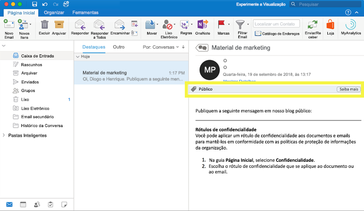
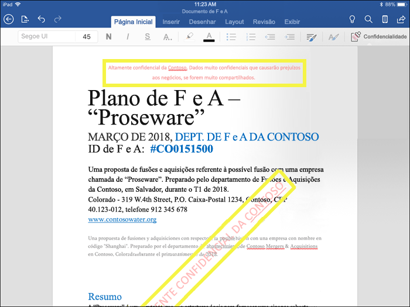
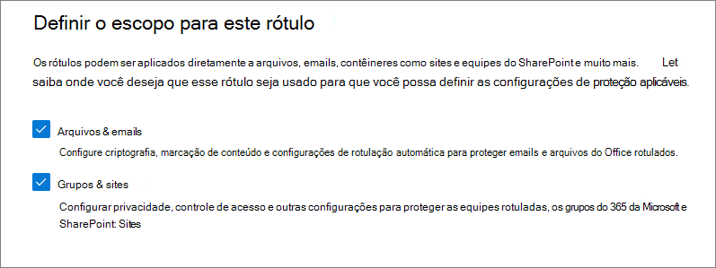
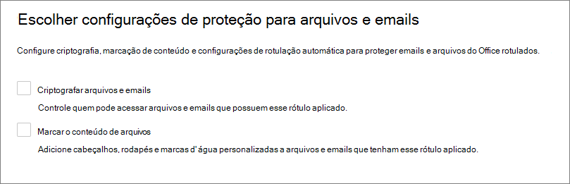
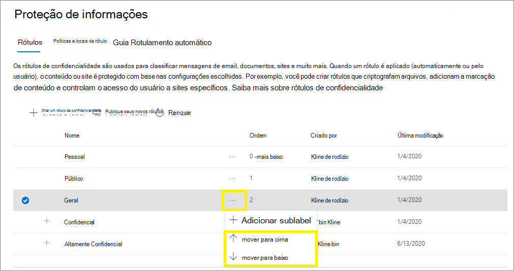
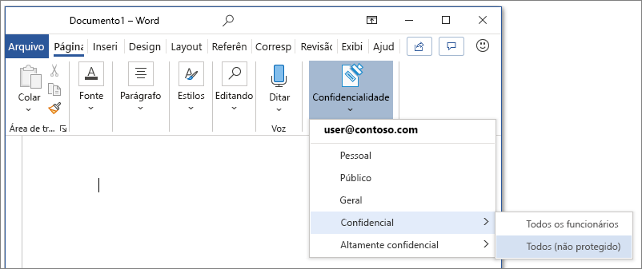
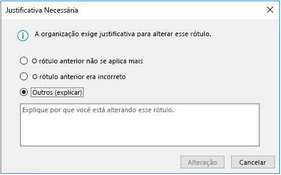
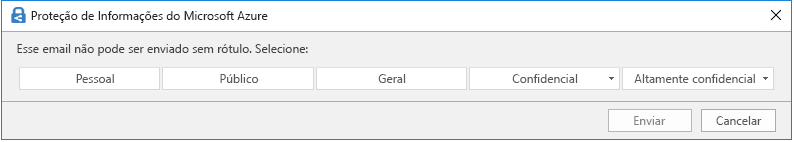
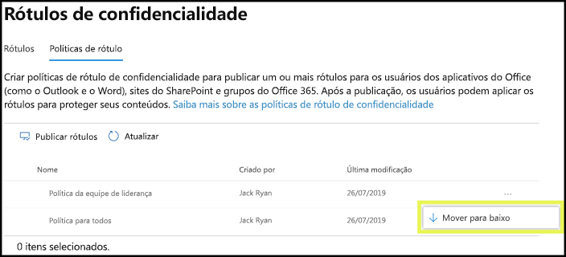

# Saiba mais sobre rótulos de confidencialidade

>*[Diretrizes de licenciamento do Microsoft 365 para segurança e conformidade](/office365/servicedescriptions/microsoft-365-service-descriptions/microsoft-365-tenantlevel-services-licensing-guidance/microsoft-365-security-compliance-licensing-guidance).*

> [!NOTE]
> Se você estiver procurando informações sobre o rótulos de confidencialidade que está vendo nos seus aplicativos do Office, consulte [Aplicar rótulos de sensibilidade em seus arquivos e email no Office](https://support.microsoft.com/topic/apply-sensitivity-labels-to-your-files-and-email-in-office-2f96e7cd-d5a4-403b-8bd7-4cc636bae0f9).
>
> As informações nesta página são para administradores de TI que podem criar e configurar esses rótulos.

Para realizar o trabalho, as pessoas da organização colaboram com outras pessoas dentro e fora da organização. Isso significa que o conteúdo não fica mais atrás de um firewall, ele pode circular em qualquer lugar, em dispositivos, aplicativos e serviços. E quando estiver em roaming, você quer fazê-lo de uma maneira segura e protegida que atenda às políticas de negócios e conformidade da organização.

Os rótulos de confidencialidade da solução de Proteção de Informações da Microsoft permitem que você classifique e proteja os dados da organização, ao mesmo tempo que garante que a produtividade do usuário e sua capacidade de colaboração não sejam prejudicadas.

Exemplo mostrando os rótulos de confidencialidade disponíveis no Excel, na guia **Página Inicial** na faixa de opções. Neste exemplo, o rótulo aplicado exibe na barra de status:

Para aplicar rótulos de confidencialidade, os usuários devem ter entrado com sua conta Microsoft 365 do trabalho ou da escola.

> [!NOTE]
> Rótulos de confidencialidade são recentemente suportados para locatários do governo dos EUA (GCC e GCC-H). Para obter mais informações, confira as notas de lançamento do Microsoft 365 Apps para Grandes Empresas, [Versão 2101: 26 de janeiro](/officeupdates/current-channel#version-2101-january-26).
>
> Para o cliente e scanner de rotulagem unificada da Proteção de Informações do Azure, confira [Descrição do serviço governamental premium da Proteção de Informações do Azure](/enterprise-mobility-security/solutions/ems-aip-premium-govt-service-description).

Você pode usar rótulos de confidencialidade para:
  
- **Forneça configurações de proteção que incluam criptografia e marcações de conteúdo.** Por exemplo, aplique um rótulo "Confidencial" a um documento ou email, e esse rótulo criptografa o conteúdo e aplica uma marca d' água "Confidencial". As marcações de conteúdo incluem cabeçalhos e rodapés, bem como marcas d' água, e a criptografia também pode restringir quais ações as pessoas autorizadas podem realizar no conteúdo.

- **Proteja o conteúdo nos aplicativos do Office em diferentes plataformas e dispositivos.** Suportado pelo Word, Excel, PowerPoint e Outlook nos aplicativos da área de trabalho do Office e no Office na Web. Suportado no Windows, macOS, iOS e Android.

- **Proteger o conteúdo em aplicativos e serviços de terceiros** usando o Microsoft Cloud App Security. Com o Cloud App Security, você pode detectar, classificar, rotular e proteger o conteúdo em serviços e aplicativos de terceiros, como SalesForce, Box ou Dropbox, mesmo que o aplicativo ou serviço de terceiros não leia nem ofereça suporte a rótulos de confidencialidade.

- **Proteja contêineres** que incluem o Teams, grupos do Microsoft 365 e sites do Microsoft Office SharePoint Online. Por exemplo, defina as configurações de privacidade, acesso de usuário externo e compartilhamento externo e acesso de dispositivos não gerenciados.

- **Estenda os rótulos de confidencialidade ao Power BI**: quando você ativa essa funcionalidade, é possível aplicar e exibir rótulos no Power BI e proteger os dados quando eles forem salvos fora do serviço.

- **Estenda os rótulos de confidencialidade aos ativos no Azure Purview**: ao ativar esse recurso, atualmente em pré-visualização, você pode aplicar os rótulos de confidencialidade aos ativos, como colunas SQL, arquivos Armazenamento de Blobs do Azure e muito mais. 

- **Estender os rótulos de confidencialidade a aplicativos e serviços de terceiros.** Usando o SDK de Proteção de informações da Microsoft, os aplicativos e os serviços de terceiros podem ler os rótulos de confidencialidade e aplicar as configurações de proteção.

- **Classificar conteúdo sem usar nenhuma configuração de proteção.** Você também pode simplesmente atribuir um rótulo como resultado da classificação do conteúdo. Isso oferece aos usuários um mapeamento visual da classificação para os nomes de rótulos da sua organização e pode usar os rótulos para gerar relatórios de uso e ver os dados de atividades do seu conteúdo confidencial. Com base nessas informações, você pode optar por aplicar as configurações de proteção mais tarde.

Em todos esses casos, os rótulos de confidencialidade no Microsoft 365 podem ajudá-o a executar as ações diretamente no conteúdo certo. Com os rótulos de confidencialidade, você pode classificar dados em toda a organização e impor configurações de proteção com base nessa classificação.

Para saber mais sobre esses e outros cenários compatíveis com rótulos de confidencialidade, confira [Cenários comuns de rótulos de confidencialidade](get-started-with-sensitivity-labels.md#common-scenarios-for-sensitivity-labels). Novos recursos estão sendo desenvolvidos o tempo todo que oferecem suporte a rótulos de confidencialidade, então você também pode achar útil conferir o [Roteiro da Microsoft 365](https://aka.ms/MIPC/Roadmap).

## O que é um rótulo de confidencialidade

Quando você atribui um rótulo de confidencialidade a um conteúdo, isso é como um carimbo aplicado e é:

- **Personalizável.** Específico para sua organização e necessidades comerciais, você pode criar categorias para diferentes níveis de conteúdo confidencial na sua organização. Por exemplo, Pessoal, Público, Geral, Confidencial e Altamente Confidencial.

- **Texto não criptografado.** Como um rótulo é armazenado em texto não criptografado nos metadado para arquivos e emails, aplicativos e serviços de terceiros podem lê-lo e aplicar suas próprias ações de proteção, se necessário.

- **Persistente.** Como o rótulo é armazenado nos metadados para arquivos e emails, o rótulo fica se move com o conteúdo, não importa onde ele esteja salvo ou armazenado. A identificação de rótulos exclusivos torna-se a base para a aplicação e a imposição das políticas que você configura.

Quando visualizado pelos usuários, um rótulo de confidencialidade é exibido como uma etiqueta nos aplicativos que eles usam e podem ser facilmente integrados aos fluxos de trabalho existentes.

Cada item que oferece suporte a rótulos de confidencialidade pode ter um único rótulo de confidencialidade aplicado a ele. Documentos e emails podem ter um rótulo de confidencialidade e uma [marca de retenção](retention.md#retention-labels) aplicado a eles.

> [!div class="mx-imgBorder"]
> 

## O que rótulos de confidencialidade podem fazer

Depois que um rótulo de confidencialidade é aplicado a um email ou documento, todas as definições de proteção definidas para esse rótulo são aplicadas no conteúdo. Você pode configurar um rótulo de confidencialidade para:

- **Criptografe** emails e documentos para impedir que pessoas não autorizadas acessem esses dados. Além disso, você pode escolher quais ações determinados usuários ou grupos têm permissões para executar e por quanto tempo. Por exemplo, você pode optar por permitir que todos os usuários na sua organização modifiquem um documento, enquanto um grupo específico de outra organização só poderá visualizá-lo. Como alternativa, em vez de atribuir permissões definidas pelo administrador, você pode permitir que os usuários atribuam permissões ao conteúdo quando eles aplicam o rótulo. 
    
    Para obter mais informações sobre as configurações de **Criptografia** quando você cria ou edita um rótulo de confidencialidade, consulte [Restringir o acesso ao conteúdo usando criptografia nos rótulos de confidencialidade](encryption-sensitivity-labels.md).

- **Marque o conteúdo** quando usar aplicativos do Office, adicionando marcas d’água, cabeçalhos ou rodapés a emails ou documentos que tenham o rótulo aplicado. As marcas d’água podem ser aplicadas a documentos, mas não a emails. Exemplo de cabeçalho e marca d' água:
    
    
    
    Precisa verificar quando as marcações de conteúdo são aplicadas? Confira [Quando os aplicativos do Office aplicam a marcação e criptografia de conteúdo](sensitivity-labels-office-apps.md#when-office-apps-apply-content-marking-and-encryption).
    
    Alguns, mas nem todos os aplicativos oferecem suporte a marcações dinâmicas usando variáveis. Por exemplo, insira o nome do rótulo ou o nome do documento no cabeçalho, rodapé ou marca d'água. Para saber mais, confira [marcações dinâmicas com variáveis](sensitivity-labels-office-apps.md#dynamic-markings-with-variables).
    
    Comprimentos de cadeias de caracteres: as marcas d' água estão limitadas a 255 caracteres. Os cabeçalhos e rodapés estão limitados a 1024 caracteres, exceto no Excel. O Excel tem um limite total de 255 caracteres para cabeçalhos e rodapés, mas esse limite inclui caracteres que não estão visíveis, como códigos de formatação. Se esse limite for alcançado, a cadeia de caracteres inserida não será exibida no Excel.

- **Proteja o conteúdo em contêineres, como sites e grupos**, quando você habilita a capacidade de [usar rótulos de confidencialidade no Microsoft Teams, grupos do Microsoft 365 e sites do SharePoint](sensitivity-labels-teams-groups-sites.md).
    
    Você não pode definir as configurações de proteção para grupos e sites até ativar esse recurso. Essa configuração de rótulo não resulta em documentos ou emails sendo automaticamente rotulados, mas em vez disso, as configurações de rótulo protegem o conteúdo, controlando o acesso ao contêiner onde o conteúdo pode ser armazenado. Essas configurações incluem configurações de privacidade, acesso de usuário externo e acesso de dispositivos não gerenciados.

- **Aplicar o rótulo automaticamente a arquivos e emails ou recomendar um rótulo.** Escolha quais tipos de informações confidenciais deseja rotular, e o rótulo poderá ser aplicado automaticamente ou será solicitado aos usuários que apliquem o rótulo recomendado. Caso recomende um rótulo, um texto de alerta escolhido por você será exibido. Por exemplo:
    
    
    
    Para obter mais informações sobre o **rotulamento automático de arquivos e emails configurações do** quando você cria ou edita um rótulo de sensibilidade, confira [aplicar um rótulo de sensibilidade ao conteúdo automaticamente](apply-sensitivity-label-automatically.md) para os aplicativos do Office e [rotular os dados automaticamente no Azure Purview](/azure/purview/create-sensitivity-label).

### Escopos de rótulo

Ao criar um rótulo de confidencialidade, você é solicitado a configurar o escopo do rótulo, que determina duas coisas:
- Quais configurações de rótulo você pode definir para esse rótulo
- Onde o rótulo ficará visível para os usuários

Esta configuração de escopo permite que você tenha rótulos de confidencialidade que são apenas para documentos e emails e não podem ser selecionados para containers. E da mesma forma, rótulos de confidencialidade que são apenas para contêineres e não podem ser selecionados para documentos e emails. Novo e atualmente em pré-visualização, você também pode selecionar o escopo para ativos do Azure Purview:

Por padrão, o escopo **Arquivos e emails** sempre é selecionado. Os outros escopos são selecionados por padrão quando os recursos são habilitados para o seu locatário:

- **Grupos e sites**: [habilite rótulos de sensibilidade para contêineres e sincronize rótulos](sensitivity-labels-teams-groups-sites.md#how-to-enable-sensitivity-labels-for-containers-and-synchronize-labels)

- **Ativos do Azure Purview (pré-visualização)**: [rotule automaticamente o conteúdo no Azure Purview](/azure/purview/create-sensitivity-label)

Se você alterar os padrões para que nem todos os escopos sejam selecionados, você verá a primeira página das definições de configuração dos escopos que não selecionou, mas não poderá definir as configurações. Por exemplo, se o escopo para arquivos e emails não for selecionado, você não pode selecionar as opções na próxima página:

Para essas páginas que têm opções indisponíveis, selecione **Avançar** para continuar. Ou selecione **Voltar** para alterar o escopo do rótulo.

### Prioridade de rótulo (a ordem importa)

Quando você cria seus rótulos de confidencialidade no centro de administração, eles aparecem em uma lista na guia **Confidencialidade**, na página **Rótulos**. Nessa lista, a ordem dos rótulos é importante porque reflete sua prioridade. Você quer que seu rótulo de confidencialidade mais restritivo, como o Altamente Confidencial, apareça na **parte inferior** da lista, e que seu rótulo de confidencialidade menos restritivo, como o Público, apareça na **parte superior**.

Você pode aplicar apenas um rótulo de confidencialidade a um item, como um documento, email ou container. Se você definir uma opção que exija que os usuários forneçam uma justificativa para alterar um rótulo para uma classificação inferior, a ordem desta lista identificará as classificações inferiores. No entanto, essa opção não se aplica aos sub-rótulos.

Embora a ordem dos sub-rótulos seja usada com [rotulagem automática](apply-sensitivity-label-automatically.md). Ao configurar rótulos para que sejam aplicados automaticamente ou como uma recomendação, várias correspondências podem resultar em mais de um rótulo. A ordem dos rótulos é usada para determinar qual rótulo será aplicado ou recomendado: o último rótulo de confidencialidade é selecionado e, se aplicável, o último sub-rótulo.

### Sub-rótulos (agrupamento de rótulos)

Com os sub-rótulos, você pode agrupar um ou mais rótulos abaixo de um rótulo pai que o usuário verá em um aplicativo do Office. Por exemplo, em Confidencial, sua organização pode usar várias etiquetas diferentes para tipos específicos dessa classificação. Nesse exemplo, o rótulo pai confidencial é simplesmente um rótulo de texto sem as configurações de proteção, e por ser um subrótulo, não pode ser aplicado ao conteúdo. Em vez disso, os usuários deverão escolher Confidencial para visualizar os sub-rótulos e, em seguida, eles podem escolher um sub-rótulo para aplicar o conteúdo.

Os sub-rótulos são simplesmente uma maneira de apresentar as etiquetas aos usuários em grupos lógicos. Os subrótulos não herdam nenhuma configuração do rótulo pai. Quando você publica um sub-rótulo para um usuário, esse usuário pode aplicá-lo ao conteúdo, mas não pode aplicar apenas o rótulo pai.

Não escolha um rótulo pai como rótulo padrão nem configure-o para ser aplicado automaticamente (ou recomendado). Se o fizer, o rótulo principal não será aplicado ao conteúdo.

Exemplo de como os sub-rótulos são exibidos para os usuários:

### Editar ou excluir um rótulo de confidencialidade

Se você excluir um rótulo de confidencialidade do centro de administração, o rótulo não será removido automaticamente do conteúdo, e todas as configurações de proteção continuarão impostas ao conteúdo que tinha o rótulo aplicado.

Se você editar um rótulo de sensibilidade, a versão do rótulo que foi aplicada ao conteúdo será aplicado nesse conteúdo.

## O que as políticas de rótulo podem fazer

Depois de criar os rótulos de confidencialidade, você precisa publicá-los para disponibilizá-los às pessoas e serviços em sua organização. Os rótulos de confidencialidade podem então ser aplicados a documentos e emails do Office e outros itens que suportam rótulos de confidencialidade. 

Diferentemente de rótulos de retenção, que são publicados em locais como todas as caixas de correio do Exchange, os rótulos de confidencialidade são publicados para usuários ou grupos. Os aplicativos que oferecem suporte a rótulos de confidencialidade podem então exibi-los para esses usuários e grupos como rótulos aplicados ou como rótulos que eles podem aplicar.

Ao configurar uma política de rótulo, você pode:

- **Escolha quais usuários e grupos verão os rótulos.** Os rótulos podem ser publicados para qualquer usuário específico ou grupo de segurança habilitado para email, grupo de distribuição ou grupo do Microsoft 365 (que podem ter [associação dinâmica](/azure/active-directory/users-groups-roles/groups-create-rule)) no Azure AD.

- **Aplique um rótulo padrão** a todos os novos documentos e emails sem rótulo criados pelos usuários e grupos incluídos na política de rótulo, e o mesmo ou diferente rótulo padrão para contêineres (se você [habilitou rótulos de sensibilidade para Microsoft Teams, Grupos do Microsoft 365 e sites do Microsoft Office SharePoint Online](sensitivity-labels-teams-groups-sites.md)). Com essa configuração, o cliente de rotulagem unificada do Proteção de Informações do Azure também aplica o rótulo padrão a documentos existentes que não estão rotulados. Os usuários sempre poderão alterar o rótulo padrão se ele não for o rótulo certo para o documento ou o e-mail.
    
    Considere usar um rótulo padrão para definir um nível de base de configurações de proteção que você deseja aplicar a todo o seu conteúdo. No entanto, sem o treinamento do usuário e outros controles, essa configuração também pode resultar em rotulagem inexata. Geralmente, não é uma boa ideia selecionar um rótulo que aplica a criptografia como um rótulo padrão para documentos. Por exemplo, muitas organizações precisam enviar e compartilhar emails com usuários externos que podem não ter aplicativos compatíveis com a criptografia ou talvez não usem uma conta que possa ser autorizada. Para obter mais informações sobre esse cenário, consulte [Compartilhar documentos criptografados com usuários externos](sensitivity-labels-office-apps.md#sharing-encrypted-documents-with-external-users).

- **Exigir uma justificativa para alterar um rótulo.** Se um usuário tentar remover um rótulo ou substituí-lo por um rótulo com um número de pedido menor, você poderá pedir que o usuário forneça uma justificativa para executar essa ação. Por exemplo, um usuário abre um documento rotulado como confidencial (número de pedido 3) e substitui esse rótulo por um denominado público (número 1). Os administradores podem ler o motivo da justificativa junto com a mudança de rótulo em [explorador de atividades](data-classification-activity-explorer.md).

    

- **Exigir que os usuários apliquem um rótulo** com uma opção para email e documentos e outra para contêineres. Também conhecido como rotulagem obrigatória, estas opções garantem que uma etiqueta deve ser aplicada antes que os usuários possam salvar documentos, enviar emails e criar novos grupos ou sites.
    
    Para documentos e emails, um rótulo pode ser atribuído manualmente pelo usuário, automaticamente como resultado de uma condição que você configurar, ou ser atribuído por padrão (a opção de rótulo padrão descrita anteriormente). Um exemplo de aviso mostrado no Outlook quando um usuário é obrigado a atribuir um rótulo:

    
    
    > [!NOTE]
    > A rotulagem obrigatória para documentos e emails não se encontra disponível para todos os aplicativos ou todas as plataformas. Para mais informações, consulte [Exigir que os usuários apliquem um rótulo em seus emails e documentos](sensitivity-labels-office-apps.md#require-users-to-apply-a-label-to-their-email-and-documents).
    
    Para contêineres, um rótulo deve ser atribuído no momento em que o grupo ou local é criado.
    
    Considere usar essa opção para ajudar a aumentar a cobertura de rótulos. No entanto, sem treinamento do usuário, essas configurações podem resultar em rotulagem imprecisa. Além disso, a menos que você também defina um rótulo padrão correspondente, o rótulo obrigatório pode frustrar seus usuários com as solicitações frequentes.

- **Fornecer um link de ajuda para uma página de ajuda personalizada** Se os usuários não tiverem certeza do significado dos rótulos de sensibilidade ou de como devem ser usados, você pode fornecer um URL Saiba mais que aparece na parte inferior do menu do **Rótulo de sensibilidade** nos aplicativos do Office:

    

Depois de criar uma política de rótulo que atribui novos rótulos de confidencialidade a usuários e grupos, os usuários começam a ver esses rótulos em seus aplicativos do Office. Aguarde até 24 horas para que as alterações mais recentes sejam replicadas em sua organização.

Não há limite para o número de rótulos de confidencialidade que você pode criar e publicar, com uma exceção: se o rótulo aplicar criptografia, o máximo que pode ser criado é de 500 rótulos. No entanto, como prática recomendada para diminuir as despesas gerais do administrador e reduzir a complexidade para seus usuários, tente manter o número mínimo de rótulos. As implantações no mundo real provaram que a eficácia é visivelmente reduzida quando os usuários têm mais de cinco rótulos principais ou mais de cinco sub-rótulos por rótulo principal.

### Prioridade das políticas de rótulos (a ordem é importante)

Você disponibiliza seus rótulos de confidencialidade aos usuários ao publicá-los em uma política de rótulos de confidencialidade, que aparece em uma lista na guia **Políticas de confidencialidade** na página **Políticas de rótulos**. Assim como rótulos de confidencialidade (veja[Prioridade de rótulo (importância da ordem)](#label-priority-order-matters)), a ordem das políticas de rótulos de confidencialidade é importante porque reflete sua prioridade. A política de rótulo com prioridade mais baixa aparece na **parte superior** e a política de rótulo com a prioridade mais alta aparece na **parte inferior**.

Uma política de rótulo consiste em:

- Um conjunto de rótulos.
- Os usuários e grupos que serão atribuídos à política com rótulos.
- O escopo da política e configurações de política para esse escopo (como rótulo padrão para arquivos e emails).

Você pode incluir um usuário em várias políticas de rótulos e esse usuário verá todas os rótulos de confidencialidade dessas políticas. Entretanto, um usuário só obtém as configurações de política da política de rótulo com a prioridade mais alta.

Se você não estiver vendo o rótulo ou configuração de política de rótulo que você espera para um usuário ou grupo, verifique a ordem das políticas de rótulo de confidencialidade. Para reordenar as políticas de rótulo, selecione uma política de rótulo de sensibilidade > escolha as reticências à direita > **Mover para baixo** ou **Mover para cima**.

Se você usa rótulos de confidencialidade e rótulos de retenção, é importante lembrar que a prioridade é importante em políticas de rótulo de confidencialidade, mas não em [rótulo de retenção](retention.md#the-principles-of-retention-or-what-takes-precedence).

## Rótulos de confidencialidade e Proteção de Informações do Azure

Se você tiver implantado rótulos com a Proteção de Informações do Azure, use as seções a seguir para obter diretrizes antes de começar a usar o rótulos de confidencialidade.

### Rótulos da Proteção de Informações do Azure

> [!NOTE]
> O gerenciamento de rótulos para os rótulos da Proteção de Informações do Azure no portal do Azure será substituído em **31 de março de 2021**. Saiba mais no [aviso de substituição](https://techcommunity.microsoft.com/t5/azure-information-protection/announcing-timelines-for-sunsetting-label-management-in-the/ba-p/1226179) oficial.

Se você estiver usando os rótulos da Proteção de Informações do Azure porque o locatário ainda não está na [plataforma de rotulagem unificada](/azure/information-protection/faqs#how-can-i-determine-if-my-tenant-is-on-the-unified-labeling-platform), recomendamos que você evite criar novos rótulos de confidencialidade até ativar a rotulagem unificada. Neste cenário, os rótulos que você vê no portal do Azure são rótulos da Proteção de Informações do Azure, em vez de rótulos de confidencialidade. Esses rótulos podem ser usados pelo cliente da Proteção de Informações do Azure (clássico) em computadores com Windows, mas não podem ser usados por dispositivos que executam o macOS, iOS ou Android. Para resolver esse problema, [migre esses rótulos](/azure/information-protection/configure-policy-migrate-labels) para rótulos de confidencialidade. 

Os metadados aplicados por ambos os conjuntos de rótulos são compatíveis, então não é necessário rotular novamente os documentos e os emails quando a migração estiver concluída.

### Clientes da Proteção de Informações do Azure

Ao usar rótulos de confidencialidade nos Aplicativos do Microsoft 365 para empresas em computadores Windows, você pode optar por usar um cliente da Proteção de Informações do Azure ou usar rótulos internos do Office.

Por padrão, a rotulagem interna é desativada nesses aplicativos quando o cliente da Proteção de Informações do Azure é instalado. Para obter mais informações, incluindo como alterar esse comportamento padrão, confira [Cliente da rotulagem interna do Office e cliente da Proteção de Informações do Azure](sensitivity-labels-office-apps.md#office-built-in-labeling-client-and-the-azure-information-protection-client).

Mesmo quando você usa rótulos internos nos aplicativos do Office, também poderá usar o cliente de rotulagem unificada da Proteção de Informações do Azure com rótulos de confidencialidade nos seguintes casos:

- Um scanner para descobrir informações confidenciais armazenadas no local e, opcionalmente, rotular o conteúdo

- Opções de clique com o botão direito do mouse no Explorador de Arquivos para que os usuários apliquem rótulos a todos os tipos de arquivo

- Um visualizador para exibir arquivos criptografados para textos, imagens ou documentos PDF

- Um módulo do PowerShell para descobrir informações confidenciais em arquivos no local, e aplicar ou remover rótulos e criptografia desses arquivos.

Se você é novo na Proteção de Informações do Azure ou se já é um cliente da Proteção de Informações do Azure que acabou de migrar seus rótulos, consulte [Escolher a solução de rotulagem do Windows](/azure/information-protection/rms-client/use-client#choose-your-windows-labeling-solution) na documentação da Proteção de Informações do Azure.

## Rótulos de confidencialidade e Microsoft Cloud App Security

Usando o CAS (Cloud App Security), é possível descobrir, classificar, rotular e proteger o conteúdo em serviços e aplicativos de terceiros, como SalesForce, Box ou Dropbox. 

O Cloud App Security funciona com os rótulos de confidencialidade e rótulos da Proteção de Informações do Azure:

- Se o centro de administração de etiquetas tiver um ou mais rótulos de confidencialidade [publicados](create-sensitivity-labels.md#publish-sensitivity-labels-by-creating-a-label-policy) por pelo menos um usuário, os rótulos de confidencialidade serão usados.

- Se os centros de administração de etiquetagem não tiverem rótulos de confidencialidade publicados, os rótulos de proteção de informações do Azure serão usados.

Para obter instruções sobre como usar o Cloud App Security com esses rótulos, confira [Integração da proteção de informações do Azure](/cloud-app-security/azip-integration).

## Rótulos de confidencialidade e SDK da Proteção de informações da Microsoft

Como um rótulo de confidencialidade é armazenado como texto não criptografado nos metadados de um documento, aplicativos e serviços de terceiros podem ler e gravar nos metadados de rotulagem para complementar sua implantação de rotulagem. Além disso, os desenvolvedores de software podem usar o [SDK da Proteção de Informações da Microsoft](/information-protection/develop/overview#microsoft-information-protection-sdk) para oferecer suporte total aos recursos de rotulagem e criptografia em várias plataformas. Para saber mais, confira o [Comunicado de Disponibilidade Geral no Blog da Comunidade Técnica](https://techcommunity.microsoft.com/t5/Microsoft-Information-Protection/Microsoft-Information-Protection-SDK-Now-Generally-Available/ba-p/263144). 

Você também pode saber mais sobre [soluções de parceiro que estão integradas à Proteção de Informações da Microsoft](https://techcommunity.microsoft.com/t5/Azure-Information-Protection/Microsoft-Information-Protection-showcases-integrated-partner/ba-p/262657).

## Guia de implantação

Para planejamento de implantação e orientação que inclui informações de licenciamento, permissões, estratégia de implantação, uma lista de cenários com suporte e documentação do usuário final, confira [Introdução aos rótulos de sensibilidade](get-started-with-sensitivity-labels.md).