# Visão geral de rótulos de confidencialidade

Para realizar seus trabalhos, as pessoas em sua organização colaboram com outras pessoas dentro e fora da organização. Isso significa que o conteúdo deixa de estar protegido por um firewall – ele percorre todos os lugares, entre dispositivos, aplicativos e serviços. E você quer que esses percursos sejam feitos de modo seguro e protegido, atendendo às políticas de conformidade dos negócios da sua organização.

Com os rótulos de confidencialidade, você pode classificar e ajudar a proteger seu conteúdo confidencial, sem atrapalhar a produtividade e a capacidade de colaboração de seu pessoal.

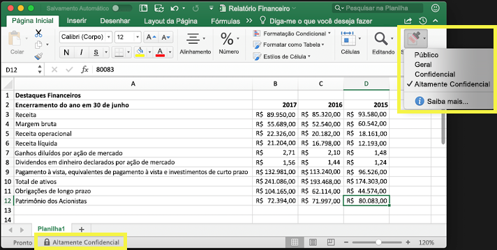

Os rótulos de confidencialidade só têm suporte para locatários na nuvem global (pública). Os rótulos de confidencialidade não têm suporte para locatários em outras nuvens, como as [nuvens nacionais](https://docs.microsoft.com/azure/active-directory/develop/authentication-national-cloud).

Para aplicar rótulos de confidencialidade, os usuários devem entrar no Office com sua conta corporativa ou de estudante.

Você pode usar rótulos de confidencialidade para:
  
- **Impor configurações de proteção, como criptografia ou marcas d'água no conteúdo rotulado. **Por exemplo, os usuários podem aplicar um rótulo confidencial a um documento ou email, e esse rótulo pode criptografar o conteúdo e aplicar uma marca d'água confidencial.

- **Proteja o conteúdo nos aplicativos do Office em diferentes plataformas e dispositivos.** Para obter uma lista de aplicativos com suporte, confira [Rótulos de confidencialidade nos aplicativos do Office](sensitivity-labels-office-apps.md).

- **Impedir que conteúdo confidencial saia da organização em dispositivos com Windows** usando a proteção do ponto de extremidade do Microsoft Intune. Depois de um rótulo de confidencialidade ter sido aplicado a um conteúdo presente em um dispositivo Windows, a proteção de ponto de extremidade pode impedir que o material seja copiado para um aplicativo de terceiros, como Twitter ou Gmail, ou um armazenamento removível, como uma unidade USB.

- **Proteger o conteúdo em aplicativos e serviços de terceiros** usando o Microsoft Cloud App Security. Com o Cloud App Security, você pode detectar, classificar, rotular e proteger o conteúdo em serviços e aplicativos de terceiros, como SalesForce, Box ou Dropbox, mesmo que o aplicativo ou serviço de terceiros não leia nem ofereça suporte a rótulos de confidencialidade.

- **Estender rótulos de confidencialidade a aplicativos e serviços de terceiros.** Com o SDK de Proteção de Informações da Microsoft, os aplicativos de terceiros [nessas plataformas](https://docs.microsoft.com/information-protection/develop/overview#microsoft-information-protection-sdk) podem ler rótulos de confidencialidade e aplicar configurações de proteção.

- **Classificar conteúdo sem usar nenhuma configuração de proteção.** Você também pode simplesmente atribuir uma classificação ao conteúdo (como uma etiqueta) que se mantém e se desloca com o conteúdo conforme ele é usado e compartilhado. Você pode usar essa classificação para gerar relatórios de uso e ver dados de atividade para seu conteúdo confidencial. Com base nessas informações, você pode optar por aplicar as configurações de proteção mais tarde.

Em todos esses casos, os rótulos de confidencialidade do Office 365 podem ajudar você a adotar as ações certas no conteúdo certo. Com os rótulos de confidencialidade, você pode classificar dados em toda a organização e impor configurações de proteção com base nessa classificação.
  
Você cria rótulos de confidencialidade no centro de conformidade do Microsoft 365, no centro de segurança do Microsoft 365 ou no Centro de Conformidade e Segurança do Office 365 em **Classificação** > **Rótulos de confidencialidade**. Esses rótulos de confidencialidade podem ser usados pela Proteção de Informações do Azure, pelos aplicativos do Office e serviços do Office 365.

Para clientes da Proteção de Informações do Azure, você pode usar seus rótulos de Proteção de Informações do Azure nos outros centros de administração e seus rótulos serão sincronizados com o portal do Azure, caso você opte por executar configurações adicionais ou avançadas. **Os rótulos de Proteção de Informações do Azure e os rótulos de confidencialidade do Office 365 são totalmente compatíveis entre si.** Isso significa, por exemplo, se você tiver um conteúdo marcado pela Proteção de Informações do Azure, não precisará reclassificar ou rotular novamente seu conteúdo.

## O que é um rótulo de confidencialidade

Atribuir um rótulo de confidencialidade a um documento ou email é simplesmente como ter uma marca:

- **Personalizável.** Você pode criar categorias para diferentes níveis de conteúdo confidencial em sua organização, como Pessoal, Público, Geral, Confidencial e Altamente Confidencial.

- **Não criptografada.** Já que o rótulo não está criptografado, ele fica disponível para aplicativos e serviços de terceiros para aplicar ações de proteção a conteúdos rotulados.

- **Persistente.** Após um rótulo de confidencialidade ser aplicado ao conteúdo, ele persiste nos metadados do email ou do documento. Isso significa que o rótulo vai junto com o conteúdo, incluindo as configurações de proteção, e se torna a base para aplicar e impor políticas.

Nos aplicativos do Office, um rótulo de confidencialidade simplesmente aparece como uma marca em um email ou documento.

Cada item de conteúdo pode ter um único rótulo de confidencialidade aplicado a ele. Um item pode ter tanto um rótulo de confidencialidade único quanto um [rótulo de retenção](labels.md) único aplicado a ele.

## O que rótulos de confidencialidade podem fazer

Além de email e documentos, os rótulos de confidencialidade estão disponíveis em várias versões de visualização pública. Para saber mais sobre o que os rótulos de confidencialidade podem fazer para arquivos, equipes, grupos e sites, confira estes artigos:

- [Habilitar rótulos de confidencialidade para arquivos do Office no SharePoint e no OneDrive (visualização pública)](sensitivity-labels-sharepoint-onedrive-files.md)

- [Usar etiquetas de confidencialidade com o Microsoft Teams, grupos do Office 365 e sites do SharePoint (visualização pública)](sensitivity-labels-teams-groups-sites.md)

Depois que um rótulo de confidencialidade é aplicado a um email ou documento, as configurações de proteção desse rótulo são aplicadas no conteúdo. Com um rótulo de confidencialidade, você pode:

- **Criptografar** apenas emails ou emails e documentos. Você pode escolher quais ações determinados usuários ou grupos possuem permissões para executar e a duração das permissões. Por exemplo, você pode optar por permitir que os usuários, em um domínio específico fora da sua organização, tenham permissões para revisar o conteúdo por apenas sete dias após o conteúdo ser rotulado. Como alternativa, em vez de você atribuir permissões, você pode permitir que os usuários atribuam permissões ao conteúdo quando eles aplicam o rótulo. Para saber mais informações, confira [Restringir o acesso ao conteúdo usando criptografia nos rótulos de confidencialidade](encryption-sensitivity-labels.md).

- **Marque o conteúdo** adicionando marcas d' água personalizadas, cabeçalhos ou rodapés a emails ou documentos que tenham o rótulo aplicado. Você aplica somente marcas d' água a documentos e não a email e eles estão limitados a 255 caracteres. Além disso, os cabeçalhos e rodapés estão limitados a 1024 caracteres (exceto no Excel, em que estão limitados a 255 caracteres ou menos, dependendo se o documento contém outros cabeçalhos ou rodapés e outros fatores.)

    

- **Evitar a perda de dados** ativando o Endpoint Protection no Intune. Se o conteúdo confidencial for baixado, você pode ajudar a evitar a perda de dados de dispositivos Windows. Por exemplo, não é possível copiar o conteúdo rotulado para o Dropbox, Gmail ou para uma unidade USB. Para que seus rótulos de confidencialidade possam usar a proteção de informações do Windows (WIP), primeiro é necessário criar uma política de proteção de aplicativos no portal do Azure. Para obter mais informações, confira [Como a proteção de informações do Windows protege arquivos com uma etiqueta de confidencialidade](https://docs.microsoft.com/windows/security/information-protection/windows-information-protection/how-wip-works-with-labels?branch=vsts17546553).

- **Aplique o rótulo automaticamente ao conteúdo que contém informações confidenciais. ** Você pode escolher quais tipos de informações confidenciais que você deseja rotuladas e o rótulo pode ser aplicado automaticamente ou você pode solicitar aos usuários a aplicarem o rótulo recomendável. Se você recomendar um rótulo, o prompt exibe qualquer texto que você escolher. Para saber mais, confira [aplicar um rótulo de confidencialidade ao conteúdo automaticamente](apply-sensitivity-label-automatically.md).

    

Todas essas opções estão disponíveis quando você cria um rótulo de confidencialidade.

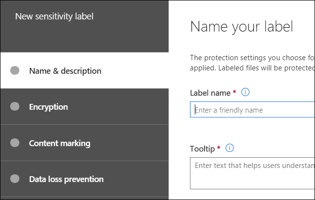

### Prioridade de rótulo (a ordem importa)

Quando você cria seus rótulos de confidencialidade, eles aparecem em uma lista na guia **Confidencialidade**, na página **Rótulos**. Nessa lista, a ordem dos rótulos é importante porque reflete sua prioridade. Você quer que seu rótulo de confidencialidade mais restritivo, como o Altamente Confidencial, apareça na **parte inferior** da lista, e que seu rótulo de confidencialidade menos restritivo, como o Público, apareça na **parte superior**.

Você só pode aplicar um único rótulo de confidencialidade a um documento ou email. Se você precisar que seus usuários forneçam uma justificativa para alterar o rótulo para uma classificação menor, a ordem dessa lista identifica as classificações inferiores.

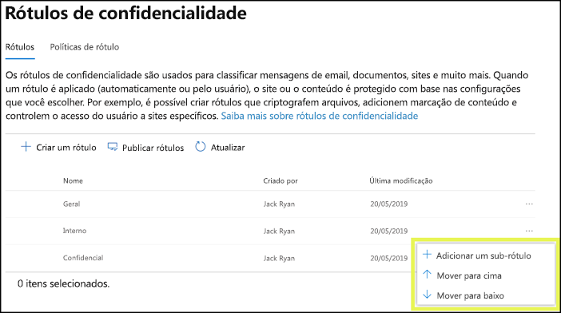

### Sub-rótulos (agrupamento de rótulos)

Com os sub-rótulos, você pode agrupar um ou mais rótulos abaixo de um rótulo pai que o usuário verá em um aplicativo do Office. Por exemplo, em Confidencial, sua organização pode usar várias etiquetas diferentes para tipos específicos dessa classificação. Neste exemplo, o rótulo pai Confidencial é simplesmente um rótulo de texto sem as configurações de proteção e por ser um sub-rótulo, não pode ser aplicado ao conteúdo. Em vez disso, os usuários deverão escolher Confidencial para visualizar os sub-rótulos e, em seguida, eles podem escolher um sub-rótulo para aplicar o conteúdo.

Os sub-rótulos são simplesmente uma maneira de apresentar as etiquetas aos usuários em grupos lógicos. Os sub-rótulos não herdam as configurações da sua etiqueta pai. Você pode aplicar sub etiquetas ao conteúdo. Não é possível aplicar rótulos pai.

Não escolha um rótulo pai como rótulo padrão (confira a próxima seção) ou configurar uma etiqueta pai para aplicação automática ou para a opção recomendada, pois a etiqueta pai não será aplicada ao conteúdo em aplicativos do Office que usam o cliente de rotulagem unificada da Proteção de Informações do Azure.

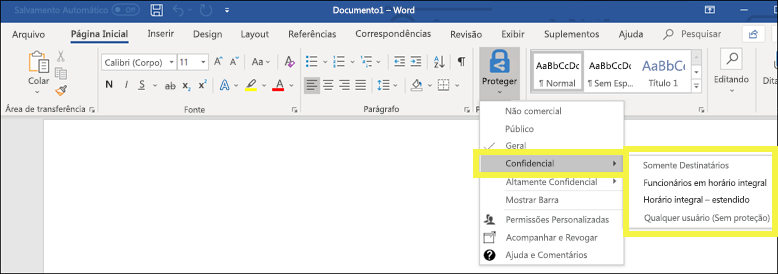

### Editar ou excluir um rótulo de confidencialidade

Se você excluir um rótulo de confidencialidade, o rótulo não é removido do conteúdo, e as configurações de proteção continuam a ser aplicadas ao conteúdo.

Se você editar um rótulo de confidencialidade, a versão do rótulo que foi aplicada ao conteúdo é a que será imposta a esse conteúdo.

## O que as políticas de rótulo podem fazer

Depois de criar rótulos de confidencialidade, você precisa publicá-los para disponibilizá-los às pessoas em sua organização, as quais, então, poderão aplicá-los ao conteúdo. Ao contrário dos rótulos de retenção, que são publicados em locais, como todas as caixas de correio do Exchange, os rótulos de confidencialidade são publicados a usuários ou grupos. Os rótulos de confidencialidade aparecem nos aplicativos do Office para esses usuários e grupos.

Com uma política de rótulos, você pode:

- **Escolher quais usuários e grupos veem os rótulos.** Rótulos podem ser publicados em quaisquer grupos de segurança habilitados para email, grupos de distribuição, grupos do Office 365 ou grupos de distribuição dinâmica.

- **Aplicar um rótulo padrão** a todos os novos documentos e email criados pelos usuários e grupos incluídos na política de rótulo. Esse rótulo padrão pode definir um nível de base de configurações de proteção que deve ser aplicado a todo o conteúdo.

- **Exigir uma justificativa para alterar um rótulo.** Se o conteúdo estiver marcado como confidencial e o usuário quiser remover esse rótulo ou substituí-lo por uma classificação menor, como um rótulo denominado público, você pode exigir que o usuário forneça uma justificativa ao executar essa ação. Essas justificativas estarão disponíveis para que o administrador examine.

    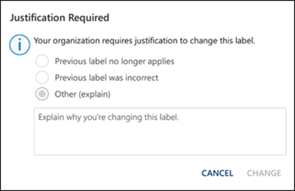

- **É preciso aplicar um rótulo a emails e documentos. ** Se você quiser todo o conteúdo de um usuário a ser rotulado, você pode exigir que um rótulo deva ser aplicado a todos os documentos salvos e emails enviados. O rótulo pode ser atribuído manualmente por usuário, automaticamente como uma condição ou atribuído por padrão (a opção de rótulo padrão descrita acima). Aqui está o prompt mostrado no Outlook quando um usuário deve atribuir um rótulo.

    > [!NOTE]
    > O rotulamento obrigatório exige uma assinatura de proteção de informações do Azure. Para usar esse recurso, você deve baixar e instalar o [Cliente de proteção de informações do Azure](https://www.microsoft.com/download/details.aspx?id=53018) ou a mais recente [rotulagem unificada de proteção de informações do Azure](https://docs.microsoft.com/azure/information-protection/rms-client/install-unifiedlabelingclient-app)cliente. Além disso, o cliente só é executado no Windows, portanto esse recurso ainda não é compatível com Mac, iOS e Android.

    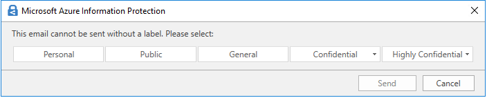

- **Fornecer um link de ajuda para uma página de ajuda personalizada** Se os usuários não tiverem certeza do que significam os rótulos de confidencialidade ou como eles devem ser usados, você pode fornecer uma URL do tipo Saiba mais na parte inferior do menu de **Rótulo de Confidencialidade** nos aplicativos do Office.

    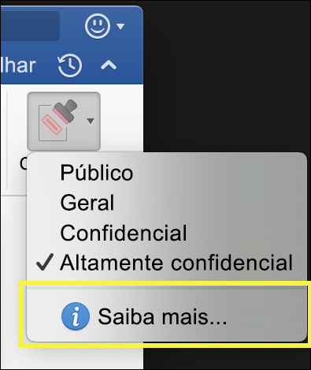

Depois de criar uma política de rótulos e atribuir rótulos de confidencialidade para usuários e grupos, essas pessoas podem ver os rótulos disponíveis nos aplicativos do Office em uma hora ou menos.

### Prioridade das políticas de rótulos (a ordem é importante)

Você disponibiliza seus rótulos de confidencialidade aos usuários ao publicá-los em uma política de rótulos de confidencialidade, que aparece em uma lista na guia **Políticas de confidencialidade** na página **Políticas de rótulos**. Assim como rótulos de confidencialidade (veja[Prioridade de rótulo (importância da ordem)](#label-priority-order-matters)), a ordem das políticas de rótulos de confidencialidade é importante porque reflete sua prioridade. A política de rótulo com prioridade mais baixa aparece na **parte superior** e a política de rótulo com a prioridade mais alta aparece na **parte inferior**.

Uma política de rótulo consiste em:

- Um conjunto de rótulos.
- O escopo da política de rótulos, que são os usuários e grupos incluídos na política.
- As configurações da política de rótulo descritas acima (rótulo padrão, justificativa, rótulo obrigatório e link de ajuda).

Você pode incluir um usuário em várias políticas de rótulos e o usuário verá todas os rótulos de confidencialidade dessas políticas. Entretanto, um usuário só verá as configurações de políticas da política de rótulo com a prioridade mais alta.

Se um usuário ou grupo na organização não estiver vendo uma opção na política de rótulo que você pretendia, como um rótulo padrão ou obrigatório, verifique a ordem das políticas de rótulos de confidencialidade. Para reordenar as políticas de rótulos, selecione uma política de rótulo de confidencialidade > escolha as reticências à direita > **Mover para baixo** ou **Mover para cima**.

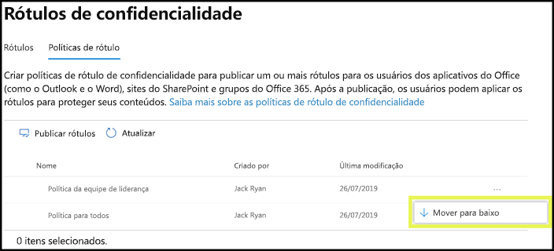

Embora a prioridade seja importante para políticas de rótulos de confidencialidade, ela **não** é importante para políticas de rótulo de retenção. Conforme explicado em [Os princípios de retenção ou o que tem precedência?](labels.md#the-principles-of-retention-or-what-takes-precedence), o conteúdo pode estar sujeito a várias políticas de retenção.

## Como começar a usar os rótulos de confidencialidade

A introdução aos rótulos de confidencialidade é um processo rápido:

1. **Defina os rótulos.** Primeiro, você deve estabelecer a taxonomia para definir níveis diferentes de conteúdo confidencial. Use nomes comuns ou termos que façam sentido para os usuários. Por exemplo, comece com rótulos como Pessoal, Público, Geral, Confidencial e Altamente Confidencial. Você pode usar sub-rótulos para agrupar rótulos semelhantes por categoria. Além disso, ao criar um rótulo, é exigida uma dica de ferramenta, que é exibida nos aplicativos do Office quando um usuário passa o mouse sobre uma opção de rótulo na faixa de opções.

1. **Defina o que cada rótulo pode fazer. ** Depois defina as configurações de proteção que você quer associar a cada rótulo. Por exemplo, para uma confidencialidade menor de conteúdo (um rótulo “Geral”) pode ter apenas um cabeçalho ou rodapé aplicado a ele, enquanto uma confidencialidade maior de conteúdo (um rótulo de “Confidencial”) pode ter uma marca d'água, criptografia e WIP aplicados a ela para ajudar a garantir que apenas usuários com privilégios possam acessá-la.

1. **Defina quem receberá os rótulos.** Depois de definir os rótulos da sua organização, publique-os em uma política de rótulos que controla quais usuários e grupos os veem. Um rótulo único é reutilizável – você o define uma vez, depois pode incluí-lo em várias políticas de rótulo atribuídas a diferentes usuários. Mas, para que um rótulo seja atribuído ao conteúdo, primeiro você deve publicá-lo para que fique disponível nos aplicativos do Office e outros serviços. Ao começar, você pode controlar seus rótulos de confidencialidade atribuindo-os a apenas algumas pessoas.

Eis o fluxo básico com o que o administrador, o usuário e o aplicativo do Office fazem para os rótulos de confidencialidade funcionarem.

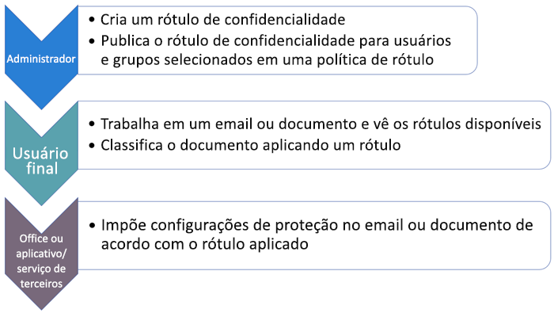

## Onde rótulos de confidencialidade podem aparecer

Os rótulos de confidencialidade aparecem na interface do usuário dos aplicativos do Office. Para exibir a disponibilidade atual para aplicativos e plataformas específicos, confira **[Onde o recurso está disponível hoje?](https://support.office.com/article/2f96e7cd-d5a4-403b-8bd7-4cc636bae0f9)**

### Aplicativos do Office no Windows

Nos aplicativos do Office em dispositivos com Windows, os rótulos de confidencialidade aparecem no botão **Confidencialidade**, na guia **Início** na faixa de opções. O rótulo aplicado também aparece na barra de status na parte inferior da janela.

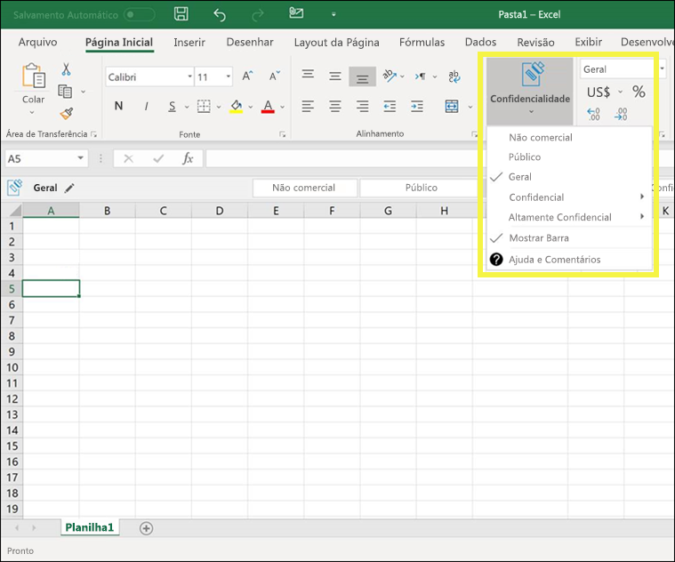

### Aplicativos do Office na Web

Para obter mais informações sobre como usar os aplicativos do Office na Web, confira [aplicar rótulos de confidencialidade a seus documentos e emails no Office Web](https://support.office.com/article/2f96e7cd-d5a4-403b-8bd7-4cc636bae0f9).

### Aplicativos do Office no Mac

Nos aplicativos do Office em dispositivos Mac, os rótulos de confidencialidade aparecem no botão **Confidencialidade**, na guia **Início** na faixa de opções. O rótulo aplicado também aparece na barra de status na parte inferior da janela.

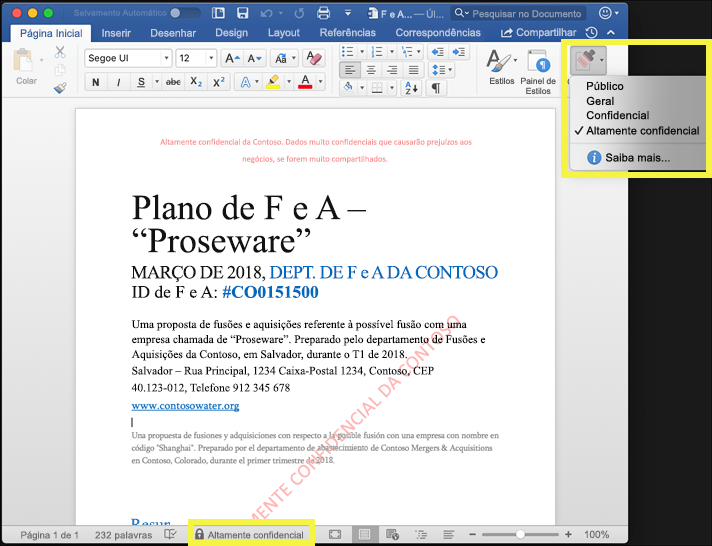

### Aplicativos do Office no iOS

Nos aplicativos do Office em dispositivos iOS, os rótulos de confidencialidade aparecem no botão **Confidencialidade**, na guia **Início** na faixa de opções. O rótulo aplicado também aparece na barra de status na parte inferior da janela.

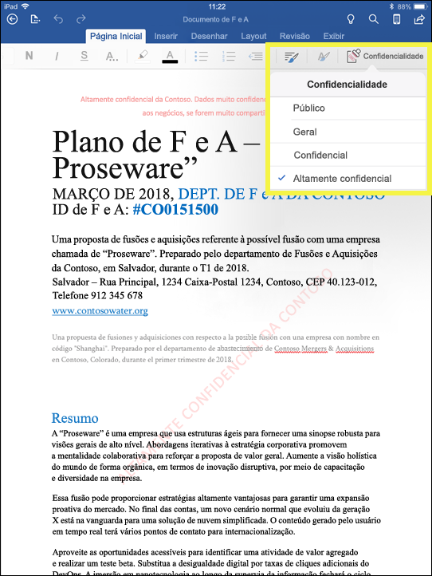

### Aplicativos do Office no Android

Nos aplicativos do Office em dispositivos Android, os rótulos de confidencialidade aparecem no botão **Confidencialidade**, na guia **Início** na faixa de opções. O rótulo aplicado também aparece na barra de status na parte inferior da janela.

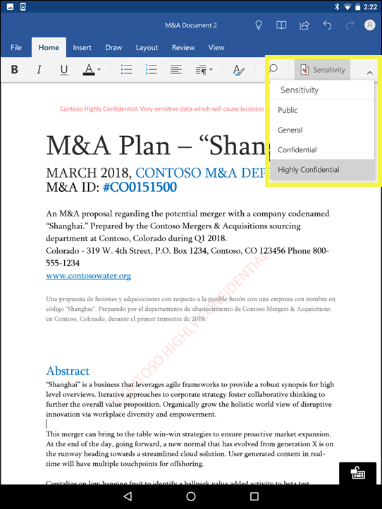

### Mais informações sobre rótulos de confidencialidade nos aplicativos do Office

- [Aplicar rótulos de confidencialidade aos seus documentos e email no Office](https://support.office.com/article/apply-sensitivity-labels-to-your-documents-and-email-within-office-2f96e7cd-d5a4-403b-8bd7-4cc636bae0f9)
- [Problemas conhecidos ao aplicar rótulos de confidencialidade aos arquivos do Office](https://support.office.com/article/known-issues-when-you-apply-sensitivity-labels-to-your-office-files-b169d687-2bbd-4e21-a440-7da1b2743edc)
- [Rótulos de confidencialidade em aplicativos do Office](sensitivity-labels-office-apps.md)

## Como os rótulos de confidencialidade funcionam com rótulos existentes da Proteção de Informações do Azure

Atualmente, os usuários da Proteção de Informações do Azure conseguem classificar e rotular o conteúdo no Windows usando o cliente de rotulagem unificado dessa Proteção. Rótulos existentes da Proteção de Informações do Azure funcionam perfeitamente com os novos rótulos de confidencialidade. Isso significa que você pode:

- Manter os rótulos existentes da Proteção de Informações do Azure em documentos e email.
- Manter a configuração de rótulo da Proteção de Informações do Azure.

Se você estiver usando rótulos de Proteção de Informações do Azure, por enquanto, é recomendável evitar a criação de novos rótulos em outros centros de administração até que você tenha concluído sua migração. O [tópico de migração da Proteção de Informações do Azure](https://docs.microsoft.com/azure/information-protection/configure-policy-migrate-labels) contém informações importantes e algumas advertências específicas. Se você ainda não estiver pronto para migrar seus locatários de produção para rótulos de confidencialidade, não há motivos para preocupação: por enquanto, seus usuários podem continuar usando o cliente da Proteção de Informações do Azure, e os administradores podem continuar usando o portal do Azure para gerenciamento.

## Rótulos de sensibilidade e cliente de Proteção de Informações do Azure

O Office 365 desativa automaticamente os rótulos de sensibilidade se você tiver instalado o cliente de proteção de informações do Azure no Office para Windows.
Para saber mais sobre como corrigir o problema, confira [Sobre o cliente de rotulagem interna do Office](sensitivity-labels-office-apps.md#about-the-office-built-in-labeling-client).

## Proteger o conteúdo em dispositivos Windows usando a proteção do ponto de extremidade no Microsoft Intune

Quando cria um rótulo de confidencialidade, você tem a opção de informar ao Windows que arquivos com esse rótulo são confidenciais e precisam ser protegidos contra vazamento de dados quando armazenados em dispositivos Windows. Essa opção pode ajudar a garantir que o conteúdo com esse rótulo só possa ser compartilhado ou copiado para locais aprovados, mesmo quando armazenado em um ponto de extremidade. Basicamente, ativar essa opção para um rótulo de confidencialidade informa o Windows de que se tratam de dados muito importantes que garantem restrições de uso adicionais.

Ao habilitar essa opção, o Windows pode ler, entender e agir em rótulos de confidencialidade em documentos e aplicar automaticamente a WIP no conteúdo, não importando como ele atinge um dispositivo Windows gerenciado. Isso ajuda a proteger os arquivos rotulados contra vazamento acidental, aplicando ou não uma criptografia.

Por exemplo, o Windows pode entender que um documento do Word que reside no computador de um usuário tem um rótulo confidencial aplicado a ele, e a WIP pode aplicar uma política de proteção de aplicativo para evitar a cópia ou o compartilhamento dos dados fora do local de trabalho a partir desse dispositivo (como um OneDrive pessoal, contas de email pessoal, mídias sociais ou unidades USB).

Se um usuário tentar carregar o conteúdo rotulado para uma conta pessoal do Gmail, será exibida esta mensagem.

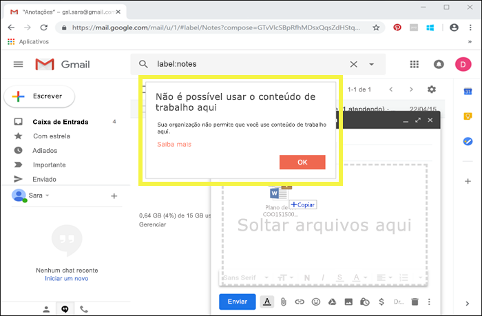

E se um usuário tentar salvar o conteúdo rotulado em uma unidade USB, será exibida esta mensagem.

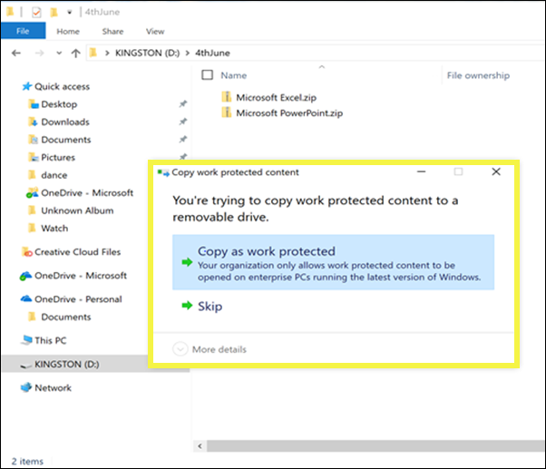

### Pré-requisitos importantes para usar o WIP

Antes que seus rótulos de confidencialidade possam usar a WIP, é necessário atender aos pré-requisitos descritos aqui: [Como a Proteção de Informações do Windows protege arquivos com um rótulo de confidencialidade](https://docs.microsoft.com/windows/security/information-protection/windows-information-protection/how-wip-works-with-labels?branch=vsts17546553). Este tópico descreve os seguintes pré-requisitos:

- Verifique se você tem o Windows 10, versão 1809 ou posterior.
- [Configure a Proteção Avançada contra Ameaças do Microsoft Defender (Microsoft Defender ATP)](https://docs.microsoft.com/windows/security/threat-protection/), que examina o conteúdo de um rótulo e aplica a proteção WIP correspondente. A ATP executa algumas ações de forma independente do WIP, como a geração de relatórios de anormalidades.
- Crie uma política de WIP que se aplique aos dispositivos de ponto de extremidade. Você pode fazer isso em qualquer um destes locais:

  - [Crie uma política de WIP com MDM usando o portal do Azure para o Microsoft Intune](https://docs.microsoft.com/windows/security/information-protection/windows-information-protection/create-wip-policy-using-intune-azure)
  - [Crie e implante uma política de WIP usando o System Center Configuration Manager](https://docs.microsoft.com/windows/security/information-protection/windows-information-protection/create-wip-policy-using-sccm)

## Proteger o conteúdo em aplicativos e serviços de terceiros usando o Microsoft Cloud App Security

Proteger o conteúdo em aplicativos e serviços de terceiros usando o Cloud App Security (CAS). Com o CAS, é possível detectar, classificar, rotular e proteger o conteúdo em serviços e aplicativos de terceiros, como SalesForce, Box ou Dropbox. Por exemplo, Dropbox não pode entender um rótulo de confidencialidade, mas o CAS pode se destacar e proteger o conteúdo rotulado nessa localização.

Para obter mais informações, consulte [Aplicar automaticamente rótulos de classificação da Proteção de Informações do Azure](https://docs.microsoft.com/cloud-app-security/use-case-information-protection).

### Pré-requisitos importantes para usar o CAS

Antes que seus rótulos de confidencialidade possam usar a CAS, é necessário atender aos pré-requisitos descritos aqui: [Aplicar automaticamente os rótulos de classificação da Proteção de Informações do Azure](https://docs.microsoft.com/cloud-app-security/use-case-information-protection). Esse tópico descreve os seguintes pré-requisitos:

- [Habilitar a Segurança no Aplicativo na Nuvem e a Proteção de Informações do Azure](https://docs.microsoft.com/cloud-app-security/azip-integration) para seu locatário.
- [Conectar o aplicativo](https://docs.microsoft.com/cloud-app-security/enable-instant-visibility-protection-and-governance-actions-for-your-apps) à Segurança no Aplicativo na Nuvem.

## Estender rótulos de confidencialidade a aplicativos e serviços de terceiros usando o SDK de Proteção de Informações da Microsoft

Como um rótulo de confidencialidade é mantido como texto não criptografado nos metadados de um documento, serviços e aplicativos de terceiros podem escolher dar suporte à identificação e proteção do conteúdo que contém esse rótulo. O suporte em outros aplicativos e serviços está sempre em expansão.

Com o [SDK de Proteção de Informações da Microsoft](https://docs.microsoft.com/information-protection/develop/), os aplicativos e os serviços de terceiros podem ler e aplicar os rótulos de confidencialidade e proteção aos documentos. O SDK oferece suporte a aplicativos [nessas plataformas](https://docs.microsoft.com/information-protection/develop/overview#microsoft-information-protection-sdk).

Usando o SDK, você pode rotular e proteger o conteúdo de uma forma que funcione em outros aplicativos e serviços de Proteção de Informações da Microsoft, como aplicativos do Office, serviços do Office 365, verificação da Proteção de Informações do Azure, Microsoft Cloud App Security e várias outras soluções de parceiros. Por exemplo, saiba mais sobre o [suporte para rótulos de confidencialidade no Adobe Acrobat](https://techcommunity.microsoft.com/t5/Azure-Information-Protection/Starting-October-use-Adobe-Acrobat-Reader-for-PDFs-protected-by/ba-p/262738).

Para saber mais sobre o SDK da Proteção de Informações da Microsoft, consulte o [anúncio no blog Tech Community](https://techcommunity.microsoft.com/t5/Microsoft-Information-Protection/Microsoft-Information-Protection-SDK-Now-Generally-Available/ba-p/263144). Também é possível saber mais sobre [soluções de parceiros integradas à Proteção de Informações da Microsoft](https://techcommunity.microsoft.com/t5/Azure-Information-Protection/Microsoft-Information-Protection-showcases-integrated-partner/ba-p/262657).

## Permissões necessárias para criar rótulos de sensibilidade

Os membros da sua equipe de conformidade que forem criar rótulos de confidencialidade precisam de permissões para o Centro de conformidade do Microsoft 365, o Centro de segurança do Microsoft 365 ou o Centro de Conformidade e Segurança do Office 365. Por padrão, seu administrador de locatários tem acesso a esses centros de administração e poderá fornecer acesso aos diretores de conformidade e a outras pessoas sem fornecer a eles todas as permissões de um administrador de locatários. Para isso, recomenda-se o acesso à página **Permissões** de um desses centros de administração e, em seguida, a adição de membros grupo de funções **Administrador de Conformidade** ou **Administrador de Segurança**.

Para obter mais informações, consulte [Fornecer aos usuários acesso ao Centro de Conformidade e Segurança do Office 365](https://docs.microsoft.com/microsoft-365/security/office-365-security/grant-access-to-the-security-and-compliance-center).

-Essas permissões só serão necessárias para criar e aplicar rótulos. A imposição da política não exige acesso ao conteúdo.
