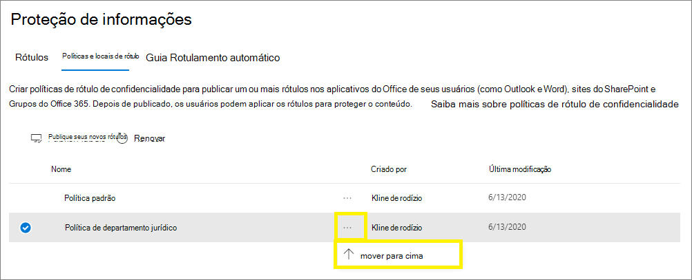

# Saiba mais sobre rótulos de confidencialidade

Para realizar seus trabalhos, as pessoas em sua organização colaboram com outras pessoas dentro e fora da organização. Isso significa que o conteúdo deixa de estar protegido por um firewall, podendo circular em qualquer lugar, entre dispositivos, aplicativos e serviços. E quando em roaming, é importante que esse processo seja feito de modo seguro e protegido, atendendo às políticas de conformidade dos negócios da organização.

Use rótulos de confidencialidade da estrutura de Proteção de Informações da Microsoft permitem a classificação e proteção dos dados da sua organização, enquanto garante que a produtividade e a capacidade de colaboração do usuário não sejam prejudicadas.

Exemplo mostrando os rótulos de confidencialidade disponíveis no Excel, na guia **Página Inicial** na faixa de opções. Neste exemplo, o rótulo aplicado exibe na barra de status:

Os rótulos de confidencialidade só têm suporte para locatários na nuvem global (pública). Atualmente, os rótulos de confidencialidade não têm suporte para locatários em outras nuvens, como as [nuvens nacionais](https://docs.microsoft.com/azure/active-directory/develop/authentication-national-cloud).

> [!NOTE]
> Os rótulos de confidencialidade ainda não estão disponíveis em organizações da Comunidade Governamental (GCC) dos EUA.

Para aplicar rótulos de confidencialidade, os usuários devem entrar no Office com sua conta corporativa ou de estudante.

Você pode usar rótulos de confidencialidade para:
  
- **Impor configurações de proteção, como criptografia ou marcas d'água no conteúdo rotulado. **Por exemplo, os usuários podem aplicar um rótulo confidencial a um documento ou email, e esse rótulo pode criptografar o conteúdo e aplicar uma marca d'água confidencial.

- **Proteja o conteúdo nos aplicativos do Office em diferentes plataformas e dispositivos.** Para obter uma lista de aplicativos com suporte, confira [Uso de rótulos de confidencialidade nos aplicativos do Office](sensitivity-labels-office-apps.md).

- **Evitar que conteúdo confidencial saia de sua organização em dispositivos executando o Windows**, usando a proteção de pontos de extremidade no Microsoft Intune. Depois que um rótulo de confidencialidade for aplicado ao conteúdo que está em um dispositivo do Windows, a proteção de ponto de extremidade pode evitar que o conteúdo seja copiado para um aplicativo de terceiros, como o Twitter ou o Gmail. Ou de ser copiado para armazenamento removível, como uma unidade USB.

- **Proteger o conteúdo em aplicativos e serviços de terceiros** usando o Microsoft Cloud App Security. Com o Cloud App Security, você pode detectar, classificar, rotular e proteger o conteúdo em serviços e aplicativos de terceiros, como SalesForce, Box ou Dropbox, mesmo que o aplicativo ou serviço de terceiros não leia nem ofereça suporte a rótulos de confidencialidade.

- **Estender os rótulos de confidencialidade a aplicativos e serviços de terceiros.** Usando o SDK de Proteção de informações da Microsoft, os aplicativos e os serviços de terceiros podem ler os rótulos de confidencialidade e aplicar as configurações de proteção.

- **Classificar conteúdo sem usar nenhuma configuração de proteção.** Você também pode simplesmente atribuir uma classificação ao conteúdo (como uma etiqueta) que se mantém e se desloca com o conteúdo conforme ele é usado e compartilhado. Você pode usar essa classificação para gerar relatórios de uso e ver dados de atividade para seu conteúdo confidencial. Com base nessas informações, você pode optar por aplicar as configurações de proteção mais tarde.

Em todos esses casos, os rótulos de confidencialidade no Microsoft 365 podem ajudá-o a executar as ações diretamente no conteúdo certo. Com os rótulos de confidencialidade, você pode classificar dados em toda a organização e impor configurações de proteção com base nessa classificação.

## O que é um rótulo de confidencialidade

Quando você atribui um rótulo de confidencialidade a um documento ou email, é como um carimbo que aplicado ao conteúdo que é:

- **Personalizável.** Você pode criar categorias para diferentes níveis de conteúdo confidencial em sua organização, como Pessoal, Público, Geral, Confidencial e Altamente Confidencial.

- **Texto não criptografado.** Como o rótulo é armazenado em texto não criptografado nos metadados do conteúdo, aplicativos e serviços de terceiros podem lê-lo e aplicar suas próprias ações de proteção, se necessário.

- **Persistente.** Depois de aplicar um rótulo de confidencialidade ao conteúdo, o rótulo é armazenado nos metadados desse email ou documento. Isso significa que o rótulo acompanha o conteúdo, incluindo as configurações de proteção, e esses dados tornam-se a base para a aplicação e imposição de políticas.

Em aplicativos do Office, um rótulo de confidencialidade simplesmente aparece como uma marca em um email ou documento.

Cada item de conteúdo pode ter um único rótulo de confidencialidade aplicado a ele. Um item pode ter tanto um rótulo de confidencialidade único quanto um [rótulo de retenção](labels.md) único aplicado a ele.

> [!div class="mx-imgBorder"]
> 

## O que rótulos de confidencialidade podem fazer

> [!NOTE]
> Além de aplicar rótulos a e-mails e documentos em aplicativos do Office, os rótulos de confidencialidade agora também estão disponíveis nas seguintes versões de visualização pública:
> 
> - [Habilitar rótulos de confidencialidade para arquivos do Office no SharePoint e no OneDrive (visualização pública)](sensitivity-labels-sharepoint-onedrive-files.md)
> - [Usar etiquetas de confidencialidade com o Microsoft Teams, grupos do Office 365 e sites do SharePoint (visualização pública)](sensitivity-labels-teams-groups-sites.md)

Depois que um rótulo de confidencialidade é aplicado a um email ou documento, todas as definições de proteção definidas para esse rótulo são aplicadas no conteúdo. Com um rótulo de confidencialidade, você pode:

- **Criptografar** apenas emails ou emails e documentos. Você pode escolher quais ações determinados usuários ou grupos possuem permissões para executar e a duração das permissões. Por exemplo, você pode optar por permitir que os usuários, em um grupo específico em outra organização, tenham permissões para revisar o conteúdo por apenas sete dias após o conteúdo ser rotulado. Como alternativa, em vez de atribuir permissões definidas pelo administrador, você pode permitir que os usuários atribuam permissões ao conteúdo quando eles aplicam o rótulo. 
    
    Para obter mais informações sobre as configurações de **Criptografia** quando você cria ou edita um rótulo de confidencialidade, consulte [Restringir o acesso ao conteúdo usando criptografia nos rótulos de confidencialidade](encryption-sensitivity-labels.md).

- **Marque o conteúdo** quando usar aplicativos do Office, adicionando marcas d’água, cabeçalhos ou rodapés a emails ou documentos que tenham o rótulo aplicado. As marcas d’água podem ser aplicadas a documentos, mas não a emails. Exemplo de cabeçalho e marca d' água:
    
    
    
    Precisa verificar quando as marcações de conteúdo são aplicadas? Confira [quando o Office 365 aplica a marcação de conteúdo e a criptografia ao conteúdo](sensitivity-labels-office-apps.md#when-office-365-applies-content-marking-and-encryption).
    
    Comprimentos de cadeias de caracteres: as marcas d' água estão limitadas a 255 caracteres. Os cabeçalhos e rodapés estão limitados a 1024 caracteres, exceto no Excel. O Excel tem um limite total de 255 caracteres para cabeçalhos e rodapés, mas esse limite inclui caracteres que não estão visíveis, como códigos de formatação. Se esse limite for alcançado, a cadeia de caracteres inserida não será exibida no Excel.

- **Evitar a perda de dados** ativando o Endpoint Protection no Intune. Se o conteúdo confidencial for baixado, você pode ajudar a evitar a perda de dados de dispositivos Windows. Por exemplo, não é possível copiar o conteúdo rotulado para o Dropbox, Gmail ou para uma unidade USB. Para que seus rótulos de confidencialidade possam usar a proteção de informações do Windows (WIP), primeiro é necessário criar uma política de proteção de aplicativos no portal do Azure. 
    
    Para obter mais informações sobre as configurações de**ponto de extremidade de prevenção contra perda de dados **, quando você cria ou edita um rótulo de confidencialidade, incluindo pré-requisitos importantes, consulte [Como a proteção de informações do Windows protege arquivos com um rótulo de confidencialidade](https://docs.microsoft.com/windows/security/information-protection/windows-information-protection/how-wip-works-with-labels?branch=vsts17546553).

- **Proteja o conteúdo em contêineres, como sites e grupos**, ao optar pela visualização do [uso de rótulos de confidencialidade no Microsoft Teams, em grupos do Office 365 e em sites do SharePoint (visualização pública)](sensitivity-labels-teams-groups-sites.md).
    
    As opções de configuração para **Configurações de site e grupo** não são exibidas até você optar pela visualização. Lembre-se de que essa configuração de rótulo não resulta na rotulação automática de documentos. Em vez disso, as configurações de rótulo protegem o conteúdo controlando o acesso ao contêiner onde os documentos estão armazenados. Essas configurações incluem o nível de privacidade, se um proprietário de grupo do Office 365 pode adicionar convidados ao grupo e o nível de acesso concedido a um dispositivo não gerenciado.

- **Aplique o rótulo automaticamente nos aplicativos do Office ou recomende um rótulo.** Escolha quais tipos de informações confidenciais deseja rotular, e o rótulo poderá ser aplicado automaticamente ou será solicitado aos usuários que apliquem o rótulo recomendado. Caso recomende um rótulo, um texto de alerta escolhido por você será exibido. Por exemplo:
    
    
    
    Para obter mais informações sobre as configurações de **Rótulo automático para aplicativos do Office** quando você cria ou edita um rótulo de confidencialidade, consulte [Aplicar um rótulo de confidencialidade ao conteúdo automaticamente](apply-sensitivity-label-automatically.md).

### Prioridade de rótulo (a ordem importa)

Quando você cria seus rótulos de confidencialidade no centro de administração, eles aparecem em uma lista na guia **Confidencialidade**, na página **Rótulos**. Nessa lista, a ordem dos rótulos é importante porque reflete sua prioridade. Você quer que seu rótulo de confidencialidade mais restritivo, como o Altamente Confidencial, apareça na **parte inferior** da lista, e que seu rótulo de confidencialidade menos restritivo, como o Público, apareça na **parte superior**.

Você pode aplicar apenas um rótulo de confidencialidade a um documento ou email. Se você definir uma opção que exija que os usuários forneçam uma justificativa para alterar um rótulo para uma classificação inferior, a ordem desta lista identificará as classificações inferiores. No entanto, essa opção não se aplica aos sub-rótulos.

Embora a ordem dos sub-rótulos seja usada com [rotulagem automática](apply-sensitivity-label-automatically.md). Ao configurar rótulos para que sejam aplicados automaticamente ou como uma recomendação, várias correspondências podem resultar em mais de um rótulo. A ordem dos rótulos é usada para determinar qual rótulo será aplicado ou recomendado: o último rótulo de confidencialidade é selecionado e, se aplicável, o último sub-rótulo.

### Sub-rótulos (agrupamento de rótulos)

Com os sub-rótulos, você pode agrupar um ou mais rótulos abaixo de um rótulo pai que o usuário verá em um aplicativo do Office. Por exemplo, em Confidencial, sua organização pode usar várias etiquetas diferentes para tipos específicos dessa classificação. Neste exemplo, o rótulo pai Confidencial é simplesmente um rótulo de texto sem as configurações de proteção e por ser um sub-rótulo, não pode ser aplicado ao conteúdo. Em vez disso, os usuários deverão escolher Confidencial para visualizar os sub-rótulos e, em seguida, eles podem escolher um sub-rótulo para aplicar o conteúdo.

Os sub-rótulos são simplesmente uma maneira de apresentar as etiquetas aos usuários em grupos lógicos. Os sub-rótulos não herdam as configurações da sua etiqueta pai. Quando você publica um sub-rótulo para um usuário, esse usuário pode aplicá-lo ao conteúdo, mas não pode aplicar apenas o rótulo pai.

Não escolha um rótulo pai como rótulo padrão ou configure um rótulo pai para ser aplicado automaticamente ou recomendado, pois a etiqueta pai não será aplicada ao conteúdo em aplicativos do Office que usam o cliente de rotulagem unificada da Proteção de Informações do Azure.

Exemplo de como os sub-rótulos são exibidos para os usuários:

### Editar ou excluir um rótulo de confidencialidade

Se você excluir um rótulo de confidencialidade do centro de administração, o rótulo não será removido automaticamente do conteúdo, e todas as configurações de proteção continuarão impostas ao conteúdo que tinha o rótulo aplicado.

Se você editar um rótulo de confidencialidade, a versão do rótulo que foi aplicada ao conteúdo é a que será imposta a esse conteúdo.

## O que as políticas de rótulo podem fazer

Depois de criar seus rótulos de confidencialidade, você precisa publicá-los para disponibilizá-los às pessoas e serviços em sua organização. Os rótulos de confidencialidade podem ser aplicados a documentos e emails. Diferentemente de rótulos de retenção, que são publicados em locais como todas as caixas de correio do Exchange, os rótulos de confidencialidade são publicados para usuários ou grupos. Os rótulos de confidencialidade serão exibidos nos aplicativos do Office para esses usuários e grupos.

Com uma política de rótulos, você pode:

- **Escolha quais usuários e grupos verão os rótulos.** Os rótulos podem ser publicados em todos os grupos de segurança habilitados por email, grupos do Office 365, ou grupos dinâmicos de distribuição.

- **Aplicar um rótulo padrão** para todos os novos documentos e email criados pelos usuários e grupos incluídos na política de rótulo. Essa opção também se aplica aos recipientes, se você tiver [habilitado os rótulos de confidencialidade do Microsoft Teams, do Office 365 Groups e de sites do SharePoint](sensitivity-labels-teams-groups-sites.md). Os usuários sempre poderão alterar o rótulo padrão se ele não for o rótulo certo para o documento ou o e-mail. Considere usar um rótulo padrão para definir um nível de base de configurações de proteção que você deseja aplicar a todo o seu conteúdo. No entanto, sem o treinamento do usuário e outros controles, essa configuração também pode resultar em rotulagem inexata. 

- **Exigir uma justificativa para alterar um rótulo.** Se um usuário tentar remover um rótulo ou substituí-lo por um rótulo que tenha um número de pedido menor, você poderá solicitar que o usuário forneça uma justificativa para executar essa ação. Por exemplo, um usuário abre um documento rotulado como confidencial (número de pedido 3) e substitui esse rótulo por um denominado público (número 1). Atualmente, a justificativa não é enviada para a [análise de rótulo](label-analytics.md) para que o administrador examine. No entanto, o [Cliente de rotulagem unificado de Proteção de Informações do Azure](https://docs.microsoft.com/azure/information-protection/rms-client/aip-clientv2) envia essas informações para a [Análise de Proteção de Informações do Azure](https://docs.microsoft.com/azure/information-protection/reports-aip).

    

- **Exigir que os usuários apliquem um rótulo a seus emails e documentos.** Também conhecido como rotulagem obrigatória, você pode exigir que um rótulo seja aplicado antes que os usuários possam salvar documentos e enviar emails. Use esta opção para ajudar a aumentar a cobertura de rótulo. O rótulo pode ser atribuído manualmente pelo usuário, automaticamente como resultado de uma condição configurada ou por padrão (a opção de rótulo padrão descrita acima). O prompt exibido no Outlook quando um usuário é solicitado a atribuir um rótulo:

    
    
    > [!NOTE]
    > O rotulamento obrigatório exige uma assinatura de proteção de informações do Azure. Para usar esse recurso, você deve instalar o [Cliente de rotulagem unificado de Proteção de Informações do Azure](https://docs.microsoft.com/azure/information-protection/rms-client/install-unifiedlabelingclient-app). O cliente só é executado no Windows, portanto esse recurso ainda não é compatível com Mac, iOS e Android.

- **Fornecer um link de ajuda para uma página de ajuda personalizada** Se os usuários não tiverem certeza do que significam os rótulos de confidencialidade como eles devem ser usados, você pode fornecer uma URL do tipo Saiba mais na parte inferior do menu de **Rótulo de Confidencialidade** nos aplicativos do Office:

    

Depois de criar um política de rótulo que atribui rótulos de confidencialidade a usuários e grupos, aguarde 24 horas para que esses usuários vejam os rótulos em seus aplicativos do Office.

Não há limite para o número de rótulos de confidencialidade que você pode criar e publicar, com uma exceção: se o rótulo aplicar criptografia, haverá no máximo 500 rótulos. No entanto, como prática recomendada para diminuir as despesas gerais do administrador e reduzir a complexidade para seus usuários, tente manter o número mínimo de rótulos. As implantações de palavras reais provaram que a eficácia é reduzida quando os usuários têm mais de cinco rótulos principais e mais de cinco sub-rótulos por rótulo principal.

### Prioridade das políticas de rótulos (a ordem é importante)

Você disponibiliza seus rótulos de confidencialidade aos usuários ao publicá-los em uma política de rótulos de confidencialidade, que aparece em uma lista na guia **Políticas de confidencialidade** na página **Políticas de rótulos**. Assim como rótulos de confidencialidade (veja[Prioridade de rótulo (importância da ordem)](#label-priority-order-matters)), a ordem das políticas de rótulos de confidencialidade é importante porque reflete sua prioridade. A política de rótulo com prioridade mais baixa aparece na **parte superior** e a política de rótulo com a prioridade mais alta aparece na **parte inferior**.

Uma política de rótulo consiste em:

- Um conjunto de rótulos.
- O escopo da política de rótulos, que são os usuários e grupos incluídos na política.
- As configurações da política de rótulo descritas acima (rótulo padrão, justificativa, rótulo obrigatório e link de ajuda).

Você pode incluir um usuário em várias políticas de rótulos e esse usuário verá todas os rótulos de confidencialidade dessas políticas. Entretanto, um usuário só obtém as configurações de política da política de rótulo com a prioridade mais alta.

Se você não estiver vendo a configuração de política de rótulo ou rótulo que espera para um usuário ou grupo e tiver aguardado 24 horas, verifique a ordem das políticas de rótulo de confidencialidade. Para reordenar as políticas de rótulos, selecione uma política de rótulo de confidencialidade > escolha as reticências à direita > **Mover para baixo** ou **Mover para cima**.

Se você usa rótulos de confidencialidade e rótulos de retenção, é importante lembrar que a prioridade é importante em políticas de rótulo de confidencialidade, mas não em [políticas de rótulo de retenção](labels.md#the-principles-of-retention-or-what-takes-precedence).

## Rótulos de confidencialidade e Proteção de Informações do Azure

Se você tiver implantado rótulos com a Proteção de Informações do Azure, use as seções a seguir para obter diretrizes antes de começar a usar o rótulos de confidencialidade.

### Rótulos da Proteção de Informações do Azure

> [!NOTE]
> O gerenciamento de rótulos para os rótulos da Proteção de Informações do Azure no portal do Azure será substituído em **31 de março de 2021**. Saiba mais no [aviso de substituição](https://techcommunity.microsoft.com/t5/azure-information-protection/announcing-timelines-for-sunsetting-label-management-in-the/ba-p/1226179) oficial.

Se você estiver usando os rótulos da Proteção de Informações do Azure porque o locatário ainda não está na [plataforma de rotulagem unificada](https://docs.microsoft.com/azure/information-protection/faqs#how-can-i-determine-if-my-tenant-is-on-the-unified-labeling-platform), recomendamos que você evite criar novos rótulos de confidencialidade até ativar a rotulagem unificada. Neste cenário, os rótulos que você vê no portal do Azure são rótulos da Proteção de Informações do Azure, em vez de rótulos de confidencialidade. Esses rótulos podem ser usados pelo cliente da Proteção de Informações do Azure (clássico) em computadores com Windows, mas não podem ser usados por dispositivos que executam o macOS, iOS ou Android. Para resolver esse problema, [migre esses rótulos](/azure/information-protection/configure-policy-migrate-labels) para rótulos de confidencialidade. 

Os metadados aplicados por ambos os conjuntos de rótulos são compatíveis, então não é necessário rotular novamente os documentos e os emails quando a migração estiver concluída.

### Clientes da Proteção de Informações do Azure

Quando você usa rótulos de confidencialidade nos aplicativos do Office 365 ProPlus em computadores com Windows, você tem a opção de usar um cliente da Proteção de Informações do Azure ou usar a rotulagem interna do Office.

Por padrão, a rotulagem interna é desativada nesses aplicativos quando o cliente da Proteção de Informações do Azure é instalado. Para obter mais informações, incluindo como alterar esse comportamento padrão, confira [Cliente da rotulagem interna do Office e cliente da Proteção de Informações do Azure](sensitivity-labels-office-apps.md#office-built-in-labeling-client-and-the-azure-information-protection-client).

Mesmo quando você usa rótulos internos nos aplicativos do Office, também poderá usar o cliente de rotulagem unificada da Proteção de Informações do Azure com rótulos de confidencialidade nos seguintes casos:

- Um scanner para descobrir informações confidenciais armazenadas no local e, opcionalmente, rotular o conteúdo

- Opções de clique com o botão direito do mouse no Explorador de Arquivos para que os usuários apliquem rótulos a todos os tipos de arquivo

- Um visualizador para exibir arquivos criptografados para textos, imagens ou documentos PDF

- Um módulo do PowerShell para descobrir informações confidenciais em arquivos no local, e aplicar ou remover rótulos e criptografia desses arquivos.

Se você é novo na Proteção de Informações do Azure ou se já é um cliente da Proteção de Informações do Azure que acabou de migrar seus rótulos, consulte [Escolher qual cliente de rotulagem usar para computadores Windows na documentação da Proteção de Informações do Azure](https://docs.microsoft.com/azure/information-protection/rms-client/use-client#choose-which-labeling-client-to-use-for-windows-computers).

## Rótulos de confidencialidade e Microsoft Cloud App Security

Usando o CAS (Cloud App Security), é possível descobrir, classificar, rotular e proteger o conteúdo em serviços e aplicativos de terceiros, como SalesForce, Box ou Dropbox. 

O Cloud App Security funciona com os rótulos de confidencialidade e rótulos da Proteção de Informações do Azure:

- Se o centro de administração de etiquetas tiver um ou mais rótulos de confidencialidade [publicados](create-sensitivity-labels.md#publish-sensitivity-labels-by-creating-a-label-policy) por pelo menos um usuário, os rótulos de confidencialidade serão usados.

- Se os centros de administração de etiquetagem não tiverem rótulos de confidencialidade publicados, os rótulos de proteção de informações do Azure serão usados.

Para obter instruções sobre como usar o Cloud App Security com esses rótulos, confira [Integração da proteção de informações do Azure](https://docs.microsoft.com/cloud-app-security/azip-integration).

## Rótulos de confidencialidade e SDK da Proteção de informações da Microsoft

Como um rótulo de confidencialidade é armazenado como texto não criptografado nos metadados de um documento, aplicativos e serviços de terceiros podem ler e gravar nos metadados de rotulagem para complementar sua implantação de rotulagem. Além disso, os desenvolvedores de software podem usar o [SDK da Proteção de Informações da Microsoft](https://docs.microsoft.com/information-protection/develop/overview#microsoft-information-protection-sdk) para oferecer suporte total aos recursos de rotulagem e criptografia em várias plataformas. Para saber mais, confira o [Comunicado de Disponibilidade Geral no Blog da Comunidade Técnica](https://techcommunity.microsoft.com/t5/Microsoft-Information-Protection/Microsoft-Information-Protection-SDK-Now-Generally-Available/ba-p/263144). 

Você também pode saber mais sobre [soluções de parceiro que estão integradas à Proteção de Informações da Microsoft](https://techcommunity.microsoft.com/t5/Azure-Information-Protection/Microsoft-Information-Protection-showcases-integrated-partner/ba-p/262657).

## Guia de implantação

Confira [Introdução ao rótulos de confidencialidade](get-started-with-sensitivity-labels.md).

