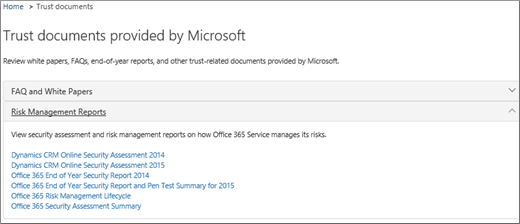
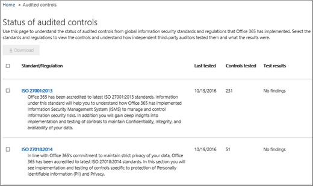

# Garantia de serviço no Centro de Segurança e ConformidadeService assurance in the Security & Compliance Center

Use a Garantia de Serviço no Centro de Conformidade & segurança para acessar documentos que descrevem uma variedade de tópicos, incluindo:Use Service assurance in the Security & Compliance Center to access documents that describe a variety of topics, including: 
  
- Práticas de segurança da Microsoft para dados de clientes armazenados no Office 365.Microsoft security practices for customer data that is stored in Office 365. 
    
- Relatórios de auditoria independentes de terceiros do Office 365.Independent third-party audit reports of Office 365. 
    
- Detalhes de implementação e teste para controles de segurança, privacidade e conformidade que o Office 365 usa para proteger seus dados.Implementation and testing details for security, privacy, and compliance controls that Office 365 uses to protect your data. 
    
Você também pode descobrir como o Office 365 pode ajudar os clientes a cumprir normas, leis e regulamentos em todos os setores, como:You can also find out how Office 365 can help customers comply with standards, laws, and regulations across industries, such as the:
  
-  International Organization for Standardization (ISO) 27001 and 27018International Organization for Standardization (ISO) 27001 and 27018 
    
- Health Insurance Portability and Accountability Act de 1996 (HIPAA)Health Insurance Portability and Accountability Act of 1996 (HIPAA)
    
- FedRAMP (Programa Federal de Gerenciamento de Autorização e Risco)Federal Risk and Authorization Management Program (FedRAMP)
    
## Quem pode acessar a garantia de serviço do Office 365 e como?Who can access Office 365 Service assurance, and how?

 **Novos clientes** e clientes que avaliam os serviços online da Microsoft podem acessar a garantia de serviço que está incluída nos planos do Office 365 Enterprise E3 e E5 (assinaturas pagas e de avaliação).**New customers, and customers evaluating Microsoft online services** can access Service assurance which is included with Office 365 Enterprise E3 and E5 plans (both trial and paid subscriptions). Se você não tiver um desses planos e quiser experimentar a Garantia de Serviço, inscreva-se para uma avaliação do [Office 365 Enterprise E5.](https://go.microsoft.com/fwlink/p/?LinkID=698279)If you don't have one of these plans and want to try Service assurance, you can [sign-up for a trial of Office 365 Enterprise E5](https://go.microsoft.com/fwlink/p/?LinkID=698279).
  
 Os membros da assinatura do **O365** podem acessar a seção Garantia de serviço no Centro de Proteção do Office 365 por padrão.**O365 Subscription Members** can access the Service assurance section in the Office 365 Protection Center by default. A garantia de serviço fornece relatórios e documentos que descrevem as práticas de segurança da Microsoft para dados do cliente armazenados no Office 365.Service assurance provides reports and documents that describe Microsoft's security practices for customer data that's stored in Office 365. Ele também fornece relatórios de auditoria independentes de terceiros no Office 365.It also provides independent third-party audit reports on Office 365.
 
## Escolha suas configurações regionais e do setorChoose your industry and regional settings

Quando você acessa a Garantia de Serviço pela primeira vez, a primeira etapa é definir suas configurações regionais e do setor.When you access Service assurance for the first time, the first step is to configure your industry and regional settings. Você pode alterar essas configurações a qualquer momento.You can change these settings at any time. A definição dessas configurações permite que a Garantia do Serviço forneça o conteúdo mais relevante à sua organização.Configuring these settings enables Service assurance to provide you with content that is most relevant to your organization. Para definir as configurações do setor e da região:To configure your industry and region settings:
  
1. Depois de acessar a Garantia de Serviço, selecione **Configurações** e a página Configurações da região e do setor será exibida, conforme mostrado na captura de tela a seguir.After you access Service assurance, select **Settings** and the Region and industry settings page displays as shown in the following screenshot. 
    
    
  
2. Na página **Configurações,** selecione a seta para baixo ao lado de **Região** e verifique as regiões apropriadas para sua organização.On the **Settings** page, select the down arrow next to **Region** and check the appropriate regions for your organization. 
    
3. Selecione a seta para baixo ao lado **de Industry** e verifique os setores apropriados para sua organização.Select the down arrow next to **Industry** and check the appropriate industries for your organization. 
    
4. Depois de selecionar regiões e setores, selecione **Salvar**.Once you have selected regions and industries, select **Save**.
    
## Encontrar, revisar e baixar conteúdo de conformidade e confiançaFind, review, and download compliance and trust content

Para revisar e baixar conteúdo, selecione uma opção no painel de navegação:To review and download content, select an option from the navigation pane:
  
- **Relatórios de** conformidade para exibir auditorias e avaliações independentes do Office 365 e de outros serviços em nuvem da Microsoft, conforme mostrado na captura de tela a seguir.**Compliance reports** to view independent audits and assessments of Office 365 and other Microsoft cloud services as shown in the following screen shot. 
    
    
  
- **Confie em** documentos para exibir informações sobre como a Microsoft opera o Office 365, conforme mostrado na captura de tela a seguir.**Trust documents** to view information about how Microsoft operates Office 365 as shown in the following screen shot. 
    
    
  
- **Controles auditados** para exibir informações sobre como os controles do Office 365 atendem aos requisitos de segurança, conformidade e privacidade, conforme mostrado na captura de tela a seguir.**Audited controls** to view information about how Office 365 controls meet security, compliance, and privacy requirements, as shown in the following screen shot. 
    
    
  
Selecione o relatório que você deseja baixar e selecione **Salvar** para baixá-lo em seu computador.Select the report you want to download, and select **Save** to download it to your computer. Para controles auditados, selecione o relatório que você deseja e selecione **Baixar.**For Audited controls, select the report you want and then select **Download**. A tabela a seguir descreve os relatórios que você pode encontrar em cada página de garantia de serviço.The table below describes the reports you can find on each Service assurance page. 
  
> [!NOTE]
> Relatórios e documentos de garantia de serviço estão disponíveis para download por pelo menos doze meses após a publicação ou até que uma nova versão do documento fique disponível.Service assurance reports and documents are available to download for at least twelve months after publishing or until a new version of the document becomes available. 
  
|**Página de garantia de serviço****Service assurance page**|**Conteúdo disponível****Content available**|**Descrição****Description**|
|:-----|:-----|:-----|
|Relatórios de conformidadeCompliance reports    | FedRampFedRamp     Avaliação da GRCGRC Assessment     ISOISO     SOC/SSAESOC/SSAE    |Use relatórios de conformidade do serviço para revisar as avaliações de auditoria realizadas por auditores independentes de terceiros das Operações de Entrega de Serviços do Office 365.Use service compliance reports to review audit assessments performed by third-party independent auditors of Office 365 Service Delivery Operations.    |
|Documentos de confiançaTrust documents    | Perguntas frequentes e white papersFAQ and White Papers     Relatórios de Gerenciamento de RiscosRisk Management Reports    |Use white papers, perguntas frequentes, relatórios de fim do ano e outros recursos confidenciais da Microsoft que são disponibilizados para você sob um contrato de confidencialidade para suas avaliações de revisão/risco.Use white papers, FAQs, end-of-year reports and other Microsoft Confidential resources that are made available to you under non-disclosure agreement for your review / risk assessments.    |
|Controles auditadosAudited controls    |Padrões globais e regulamentos que o Office 365 implementou.Global standards and regulations that Office 365 has implemented.    | Ajuda na avaliação de risco ao avaliar, integração ou usar serviços do Office 365.Help with risk-assessment when you're evaluating, onboarding, or using Office 365 services. Descubra:Find out:     – Como os controles do Office 365 atendem aos requisitos de segurança, conformidade e privacidade.- How Office 365 controls meet security, compliance, and privacy requirements.   - Sobre o teste de controles no Office 365, os resultados desses testes e quando eles foram concluídos.-  About testing of controls in Office 365, results of these tests, and when they were completed.    |
   
Dependendo da configuração específica, as opções incluídas na exibição podem ter algumas diferenças.Depending on your specific set-up, options included in your view might have some differences.
    
## Obter ajuda com a garantia de serviçoGet help with Service assurance

[Entre em contato com o suporte para produtos empresariais - ajuda para administradores](https://docs.microsoft.com/microsoft-365/admin/contact-support-for-business-products).[Contact support for business products - Admin Help](https://docs.microsoft.com/microsoft-365/admin/contact-support-for-business-products).
  
## Perguntas FrequentesFrequently Asked Questions

 **Por que estou recebendo um erro dizendo que os documentos da Garantia do Serviço estão corrompidos?****Why am I getting an error saying that documents from Service assurance are corrupted?**
  
A maioria dos documentos de garantia de serviço está no formato PDF.Most Service assurance documents are in PDF format. Choose **Save** to save these files to, and then open them up from, your local computer.Choose **Save** to save these files to, and then open them up from, your local computer. 
