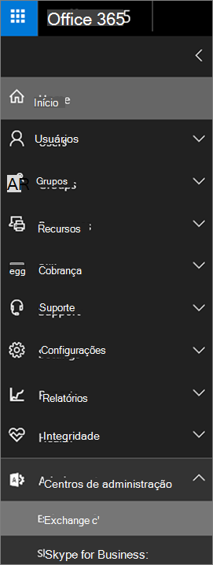
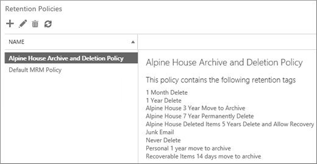

# <a name="set-up-an-archive-and-deletion-policy-for-mailboxes-in-your-organization"></a><span data-ttu-id="66354-103">Configurar uma política de arquivamento e exclusão para caixas de correio em sua organização</span><span class="sxs-lookup"><span data-stu-id="66354-103">Set up an archive and deletion policy for mailboxes in your organization</span></span>

<span data-ttu-id="66354-104">No Microsoft 365, os administradores podem criar uma política de arquivamento e exclusão que move automaticamente os itens para a caixa de correio de arquivo morto de um usuário e exclui automaticamente os itens da caixa de correio.</span><span class="sxs-lookup"><span data-stu-id="66354-104">In Microsoft 365, admins can create an archiving and deletion policy that automatically moves items to a user's archive mailbox and automatically deletes items from the mailbox.</span></span> <span data-ttu-id="66354-105">O administrador faz isso criando uma política de retenção que é atribuída às caixas de correio e move itens para a caixa de correio de arquivo morto de um usuário depois de um determinado período de tempo e que também exclui itens da caixa de correio depois que eles atingem um determinado limite de idade.</span><span class="sxs-lookup"><span data-stu-id="66354-105">The admin does this by creating a retention policy that's assigned to mailboxes, and moves items to a user's archive mailbox after a certain period of time and that also deletes items from the mailbox after they reach a certain age limit.</span></span> <span data-ttu-id="66354-106">As regras reais que determinam quais itens são movidos ou excluídos e quando isso acontece é chamado de marcas de retenção.</span><span class="sxs-lookup"><span data-stu-id="66354-106">The actual rules that determine what items are moved or deleted and when that happens are called retention tags.</span></span> <span data-ttu-id="66354-107">As marcas de retenção são vinculadas a uma política de retenção, que, por sua vez, é atribuída à caixa de correio de um usuário.</span><span class="sxs-lookup"><span data-stu-id="66354-107">Retention tags are linked to a retention policy, that in turn is assigned to a user's mailbox.</span></span> <span data-ttu-id="66354-108">Uma marca de retenção aplica configurações de retenção a mensagens e pastas individuais na caixa de correio de um usuário.</span><span class="sxs-lookup"><span data-stu-id="66354-108">A retention tag applies retention settings to individual messages and folders in a user's mailbox.</span></span> <span data-ttu-id="66354-109">Define por quanto tempo uma mensagem permanece na caixa de correio e qual ação é executada quando a mensagem atinge a idade de retenção especificada.</span><span class="sxs-lookup"><span data-stu-id="66354-109">It defines how long a message remains in the mailbox and what action is taken when the message reaches the specified retention age.</span></span> <span data-ttu-id="66354-110">Quando uma mensagem atinge sua idade de retenção, ela é movida para a caixa de correio de arquivo morto do usuário ou ela é excluída.</span><span class="sxs-lookup"><span data-stu-id="66354-110">When a message reaches its retention age, it's either moved to the user's archive mailbox or it's deleted.</span></span>
  
<span data-ttu-id="66354-111">As etapas deste artigo definirão uma política de arquivamento e de retenção para uma organização fictícia chamada Alpine House.</span><span class="sxs-lookup"><span data-stu-id="66354-111">The steps in this article will set up an archiving and retention policy for a fictitious organization named Alpine House.</span></span> <span data-ttu-id="66354-112">A configuração dessa política inclui as seguintes tarefas:</span><span class="sxs-lookup"><span data-stu-id="66354-112">Setting up this policy includes the following tasks:</span></span>
  
- <span data-ttu-id="66354-113">Habilitar uma caixa de correio de arquivo morto para cada usuário da organização.</span><span class="sxs-lookup"><span data-stu-id="66354-113">Enabling an archive mailbox for every user in the organization.</span></span> <span data-ttu-id="66354-114">Isso fornece aos usuários a adição de armazenamento de caixa de correio e é necessário para que uma política de retenção possa mover itens para a caixa de correio de arquivo morto.</span><span class="sxs-lookup"><span data-stu-id="66354-114">This gives users addition mailbox storage, and is required so that a retention policy can move items to the archive mailbox.</span></span> <span data-ttu-id="66354-115">Também permite que um usuário armazene informações de arquivamento movendo itens para a caixa de correio de arquivo morto.</span><span class="sxs-lookup"><span data-stu-id="66354-115">It also lets a user store archival information by moving items to their archive mailbox.</span></span>

- <span data-ttu-id="66354-116">Criar três marcas de retenção personalizadas que fazem o seguinte:</span><span class="sxs-lookup"><span data-stu-id="66354-116">Creating three custom retention tags that do the following:</span></span>

  - <span data-ttu-id="66354-117">Move automaticamente os itens que têm 3 anos de idade para a caixa de correio de arquivo morto do usuário.</span><span class="sxs-lookup"><span data-stu-id="66354-117">Automatically moves items that are 3 years old to the user's archive mailbox.</span></span> <span data-ttu-id="66354-118">Mover itens para a caixa de correio de arquivo morto libera espaço na caixa de correio principal de um usuário.</span><span class="sxs-lookup"><span data-stu-id="66354-118">Moving items to the archive mailbox frees up space in a user's primary mailbox.</span></span>

  - <span data-ttu-id="66354-119">Exclui automaticamente os itens que têm 5 anos de idade da pasta itens excluídos.</span><span class="sxs-lookup"><span data-stu-id="66354-119">Automatically deletes items that are 5 years old from the Deleted Items folder.</span></span> <span data-ttu-id="66354-120">Isso também libera espaço na caixa de correio principal do usuário.</span><span class="sxs-lookup"><span data-stu-id="66354-120">This also frees up space in the user's primary mailbox.</span></span> <span data-ttu-id="66354-121">O usuário terá a oportunidade de recuperar esses itens, se necessário.</span><span class="sxs-lookup"><span data-stu-id="66354-121">User's will have the opportunity to recover these items if necessary.</span></span> <span data-ttu-id="66354-122">Consulte a nota de rodapé na seção [mais informações](#more-information) para obter mais detalhes.</span><span class="sxs-lookup"><span data-stu-id="66354-122">See the footnote in the [More information](#more-information) section for more details.</span></span> 

  - <span data-ttu-id="66354-123">Automaticamente (e permanentemente) exclui itens que têm 7 anos de idade da caixa de correio principal e de arquivo morto.</span><span class="sxs-lookup"><span data-stu-id="66354-123">Automatically (and permanently) deletes items that are 7 years old from both the primary and archive mailbox.</span></span> <span data-ttu-id="66354-124">Devido às normas de conformidade, algumas organizações precisam reter o email por um determinado período de tempo.</span><span class="sxs-lookup"><span data-stu-id="66354-124">Because of compliance regulations, some organization's are required to retain email for a certain period of time.</span></span> <span data-ttu-id="66354-125">Após expirar esse período de tempo, uma organização pode querer remover permanentemente essas caixas de correio de usuário dos itens.</span><span class="sxs-lookup"><span data-stu-id="66354-125">After this time period expires, an organization might want to permanently remove these items user mailboxes.</span></span>

- <span data-ttu-id="66354-126">Criar uma nova política de retenção e adicionar novas marcas de retenção personalizadas a ela.</span><span class="sxs-lookup"><span data-stu-id="66354-126">Creating a new retention policy and adding the new custom retention tags to it.</span></span> <span data-ttu-id="66354-127">Além disso, você também adicionará marcas de retenção internas à nova política de retenção.</span><span class="sxs-lookup"><span data-stu-id="66354-127">Additionally, you'll also add built-in retention tags to the new retention policy.</span></span> <span data-ttu-id="66354-128">Isso inclui marcas pessoais que os usuários podem atribuir a itens em suas caixas de correio.</span><span class="sxs-lookup"><span data-stu-id="66354-128">This includes personal tags that users can assign to items in their mailbox.</span></span> <span data-ttu-id="66354-129">Você também adicionará uma marca de retenção que move itens da pasta itens recuperáveis na caixa de correio principal do usuário para a pasta itens recuperáveis em suas caixas de correio de arquivo morto.</span><span class="sxs-lookup"><span data-stu-id="66354-129">You'll also add a retention tag that moves items from the Recoverable Items folder in the user's primary mailbox to the Recoverable Items folder in their archive mailbox.</span></span> <span data-ttu-id="66354-130">Isso ajuda a liberar espaço na pasta itens recuperáveis de um usuário quando a caixa de correio é colocada em espera.</span><span class="sxs-lookup"><span data-stu-id="66354-130">This helps free up space in a user's Recoverable Items folder when their mailbox is placed on hold.</span></span>

<span data-ttu-id="66354-131">Você pode seguir algumas ou todas as etapas deste artigo para configurar uma política de arquivo morto e exclusão para caixas de correio em sua própria organização.</span><span class="sxs-lookup"><span data-stu-id="66354-131">You can follow some or all of the steps in this article to set up an archive and deletion policy for mailboxes in your own organization.</span></span> <span data-ttu-id="66354-132">Recomendamos que você teste esse processo em algumas caixas de correio antes de implementá-lo em todas as caixas de correio da sua organização.</span><span class="sxs-lookup"><span data-stu-id="66354-132">We recommend that you test this process on a few mailboxes before implementing it on all mailboxes in your organization.</span></span>
  
## <a name="before-you-set-up-an-archive-and-deletion-policy"></a><span data-ttu-id="66354-133">Antes de configurar uma política de arquivo morto e exclusão</span><span class="sxs-lookup"><span data-stu-id="66354-133">Before you set up an archive and deletion policy</span></span>

- <span data-ttu-id="66354-134">Você deve ser um administrador global em sua organização para executar as etapas neste tópico.</span><span class="sxs-lookup"><span data-stu-id="66354-134">You have to be a global administrator in your organization to perform the steps in this topic.</span></span> 

- <span data-ttu-id="66354-135">Quando você cria uma nova conta de usuário e atribui ao usuário uma licença do Exchange Online, uma caixa de correio é automaticamente criada para o usuário.</span><span class="sxs-lookup"><span data-stu-id="66354-135">When you create a new user account and assign the user an Exchange Online license, a mailbox is automatically created for the user.</span></span> <span data-ttu-id="66354-136">Quando a caixa de correio é criada, ela recebe automaticamente uma política de retenção padrão, denominada política de MRM padrão.</span><span class="sxs-lookup"><span data-stu-id="66354-136">When the mailbox is created, it's automatically assigned a default retention policy, named Default MRM Policy.</span></span> <span data-ttu-id="66354-137">Neste artigo, você criará uma nova política de retenção e a atribuirá às caixas de correio do usuário, substituindo a política padrão do MRM.</span><span class="sxs-lookup"><span data-stu-id="66354-137">In this article, you will create a new retention policy and then assign it to user mailboxes, replacing the Default MRM policy.</span></span> <span data-ttu-id="66354-138">Uma caixa de correio pode ter apenas uma política de retenção atribuída a ela a qualquer momento.</span><span class="sxs-lookup"><span data-stu-id="66354-138">A mailbox can have only one retention policy assigned to it at any one time.</span></span>

- <span data-ttu-id="66354-139">Para saber mais sobre marcas de retenção e políticas de retenção no Exchange Online, confira [marcas de retenção e políticas de retenção](https://go.microsoft.com/fwlink/p/?LinkId=404424).</span><span class="sxs-lookup"><span data-stu-id="66354-139">To learn more about retention tags and retention policies in Exchange Online, see [Retention tags and retention policies](https://go.microsoft.com/fwlink/p/?LinkId=404424).</span></span>

## <a name="step-1-enable-archive-mailboxes-for-users"></a><span data-ttu-id="66354-140">Etapa 1: habilitar caixas de correio de arquivo morto para usuários</span><span class="sxs-lookup"><span data-stu-id="66354-140">Step 1: Enable archive mailboxes for users</span></span>

<span data-ttu-id="66354-141">A primeira etapa é habilitar a caixa de correio de arquivo morto para cada usuário da sua organização.</span><span class="sxs-lookup"><span data-stu-id="66354-141">The first step is to enable the archive mailbox for each user in your organization.</span></span> <span data-ttu-id="66354-142">A caixa de correio de arquivo morto de um usuário deve ser habilitada para que uma marca de retenção com uma ação de retenção "mover para arquivo morto" possa mover o item após a expiração da idade da retenção.</span><span class="sxs-lookup"><span data-stu-id="66354-142">A user's archive mailbox has to be enabled so that a retention tag with a "Move to Archive" retention action can move the item after the retention age expires.</span></span>
  
> [!NOTE]
> <span data-ttu-id="66354-143">Você pode habilitar as caixas de correio de arquivo em qualquer momento durante esse processo, desde que estejam habilitadas em algum momento antes de concluir o processo.</span><span class="sxs-lookup"><span data-stu-id="66354-143">You can enable archive mailboxes any time during this process, just as long as they're enabled at some point before you complete the process.</span></span> <span data-ttu-id="66354-144">Se uma caixa de correio de arquivo morto não estiver habilitada, nenhuma ação será tomada em qualquer item que tenha uma política de arquivo morto ou exclusão atribuída a ela.</span><span class="sxs-lookup"><span data-stu-id="66354-144">If an archive mailbox isn't enabled, no action is taken on any items that have an archive or deletion policy assigned to it.</span></span>
  
1. <span data-ttu-id="66354-145">Acesse [https://protection.office.com](https://protection.office.com).</span><span class="sxs-lookup"><span data-stu-id="66354-145">Go to [https://protection.office.com](https://protection.office.com).</span></span>

2. <span data-ttu-id="66354-146">Entre usando sua conta de administrador global.</span><span class="sxs-lookup"><span data-stu-id="66354-146">Sign in using your global administrator account.</span></span>
    
3. <span data-ttu-id="66354-147">No centro de conformidade & segurança, vá para o arquivo de **governança de informações** \> **Archive** .</span><span class="sxs-lookup"><span data-stu-id="66354-147">In the Security & Compliance Center, go to **Information governance** \> **Archive** .</span></span>

    <span data-ttu-id="66354-148">Uma lista das caixas de correio em sua organização é exibida e se a caixa de correio de arquivo morto correspondente está habilitada ou desabilitada.</span><span class="sxs-lookup"><span data-stu-id="66354-148">A list of the mailboxes in your organization is displayed and whether the corresponding archive mailbox is enabled or disabled.</span></span>

4. <span data-ttu-id="66354-149">Selecione todas as caixas de correio clicando no primeiro nome da lista, mantendo pressionada a tecla **Shift** e clicando no último da lista.</span><span class="sxs-lookup"><span data-stu-id="66354-149">Select all the mailboxes by clicking on the first one in the list, holding down the **Shift** key, and then clicking the last one in the list.</span></span>

    > [!TIP]
    > <span data-ttu-id="66354-150">Esta etapa pressupõe que nenhuma caixa de correio de arquivo morto esteja habilitada.</span><span class="sxs-lookup"><span data-stu-id="66354-150">This step assumes that no archive mailboxes are enabled.</span></span> <span data-ttu-id="66354-151">Se você tiver caixas de correio com o arquivo morto habilitado, pressione a tecla **Ctrl** e clique em cada caixa de correio que possui uma caixa de correio de arquivo morto desabilitada.</span><span class="sxs-lookup"><span data-stu-id="66354-151">If you have any mailboxes with the archive enabled, hold down the **Ctrl** key and click each mailbox that has a disabled archive mailbox.</span></span> <span data-ttu-id="66354-152">Ou você pode clicar no cabeçalho de coluna **caixa de correio de arquivo morto** para classificar as linhas com base em se a caixa de correio de arquivo morto está habilitada ou desabilitada para facilitar a seleção de caixas de correio.</span><span class="sxs-lookup"><span data-stu-id="66354-152">Or you can click the **Archive mailbox** column header to sort the rows based on whether the archive mailbox is enabled or disabled to make it easier to select mailboxes.</span></span>
  
5. <span data-ttu-id="66354-153">No painel de detalhes, em **Editar em massa** , clique em **habilitar** .</span><span class="sxs-lookup"><span data-stu-id="66354-153">In the details pane, under **Bulk Edit** , click **Enable** .</span></span>

    <span data-ttu-id="66354-154">Um aviso é exibido dizendo que os itens com mais de dois anos serão movidos para a nova caixa de correio de arquivo morto.</span><span class="sxs-lookup"><span data-stu-id="66354-154">A warning is displayed saying that items that are older than two years will be moved to the new archive mailbox.</span></span> <span data-ttu-id="66354-155">Isso ocorre porque a política de retenção padrão atribuída a uma nova caixa de correio de usuário quando criada tem uma marca de política padrão de arquivo morto com uma idade de retenção de dois anos.</span><span class="sxs-lookup"><span data-stu-id="66354-155">This is because the default retention policy that's assigned a new user mailbox when it's created has an archive default policy tag that has a retention age of 2 years.</span></span> <span data-ttu-id="66354-156">A marca de política padrão de arquivo morto personalizada que você criará na etapa 2 tem um tempo de retenção de 3 anos.</span><span class="sxs-lookup"><span data-stu-id="66354-156">The custom archive default policy tag that you'll create in Step 2 has a retention age of 3 years.</span></span> <span data-ttu-id="66354-157">Isso significa que os itens que são 3 anos ou mais antigos serão movidos para a caixa de correio de arquivo morto.</span><span class="sxs-lookup"><span data-stu-id="66354-157">That means items that are 3 years or older will be moved to the archive mailbox.</span></span>

6. <span data-ttu-id="66354-158">Clique em **Sim** para fechar a mensagem de aviso e iniciar o processo para habilitar a caixa de correio de arquivo morto para cada caixa de correio selecionada.</span><span class="sxs-lookup"><span data-stu-id="66354-158">Click **Yes** to close the warning message and start the process to enable the archive mailbox for each selected mailbox.</span></span>

7. <span data-ttu-id="66354-159">Quando o processo estiver concluído, clique em **Atualizar**  para atualizar a lista na página **arquivo morto** .</span><span class="sxs-lookup"><span data-stu-id="66354-159">When the process is complete, click **Refresh**  to update the list on the **Archive** page.</span></span> 

    <span data-ttu-id="66354-160">A caixa de correio de arquivo morto está habilitada para todos os usuários em sua organização.</span><span class="sxs-lookup"><span data-stu-id="66354-160">The archive mailbox is enabled for all user's in your organization.</span></span>

    
  
8. <span data-ttu-id="66354-162">Deixe o centro de conformidade & segurança aberto.</span><span class="sxs-lookup"><span data-stu-id="66354-162">Leave the Security & Compliance Center open.</span></span> <span data-ttu-id="66354-163">Você precisará usá-las na próxima etapa.</span><span class="sxs-lookup"><span data-stu-id="66354-163">You'll use it in the next step.</span></span>

## <a name="step-2-create-new-retention-tags-for-the-archive-and-deletion-policies"></a><span data-ttu-id="66354-164">Etapa 2: criar novas marcas de retenção para as políticas de arquivo morto e exclusão</span><span class="sxs-lookup"><span data-stu-id="66354-164">Step 2: Create new retention tags for the archive and deletion policies</span></span>

<span data-ttu-id="66354-165">Nesta etapa, você criará as três marcas de retenção personalizadas descritas anteriormente.</span><span class="sxs-lookup"><span data-stu-id="66354-165">In this step, you'll create the three custom retention tags that were previously described.</span></span>
  
- <span data-ttu-id="66354-166">Alpine House 3 anos mover para arquivo morto (política de arquivo morto personalizada)</span><span class="sxs-lookup"><span data-stu-id="66354-166">Alpine House 3 Year Move to Archive (custom archive policy)</span></span>

- <span data-ttu-id="66354-167">Alpine House 7 ano excluir permanentemente (política de exclusão personalizada)</span><span class="sxs-lookup"><span data-stu-id="66354-167">Alpine House 7 Year Permanently Delete (custom deletion policy)</span></span>

- <span data-ttu-id="66354-168">Alpine House itens excluídos 5 anos excluir e permitir a recuperação (marca personalizada para a pasta itens excluídos)</span><span class="sxs-lookup"><span data-stu-id="66354-168">Alpine House Deleted Items 5 Years Delete and Allow Recovery (custom tag for the Deleted Items folder)</span></span>

<span data-ttu-id="66354-169">Para criar novas marcas de retenção, você usará o centro de administração do Exchange (Eat) em sua organização do Exchange Online.</span><span class="sxs-lookup"><span data-stu-id="66354-169">To create new retention tags, you'll use the Exchange admin center (EAC) in your Exchange Online organization.</span></span>
  
1. <span data-ttu-id="66354-170">No centro de conformidade & segurança, clique no inicializador de aplicativos no canto superior esquerdo e, em seguida, clique no bloco **administrador** .</span><span class="sxs-lookup"><span data-stu-id="66354-170">In the Security & Compliance Center, click the app launcher  in the upper left corner, and then click the **Admin** tile.</span></span>

2. <span data-ttu-id="66354-171">No painel de navegação esquerdo do centro de administração do Microsoft 365, clique em **centros de administração** e, em seguida, clique em **Exchange** .</span><span class="sxs-lookup"><span data-stu-id="66354-171">In the left navigation pane of the Microsoft 365 admin center, click **Admin centers** , and then click **Exchange** .</span></span>

    
  
3. <span data-ttu-id="66354-173">No Eat, vá para **Compliance management** \> **marcas de retenção** de gerenciamento de conformidade</span><span class="sxs-lookup"><span data-stu-id="66354-173">In the EAC, go to **Compliance management** \> **Retention tags**</span></span>

    <span data-ttu-id="66354-174">É exibida uma lista das marcas de retenção da sua organização.</span><span class="sxs-lookup"><span data-stu-id="66354-174">A list of the retention tags for your organization is displayed.</span></span>

### <a name="create-a-custom-archive-default-policy-tag"></a><span data-ttu-id="66354-175">Criar uma marca de política padrão de arquivo morto personalizado</span><span class="sxs-lookup"><span data-stu-id="66354-175">Create a custom archive default policy tag</span></span>
  
<span data-ttu-id="66354-176">Primeiro, você criará uma marca de política padrão de arquivo morto personalizada (DPT) que moverá itens para a caixa de correio de arquivo morto após 3 anos.</span><span class="sxs-lookup"><span data-stu-id="66354-176">First, you'll create a custom archive default policy tag (DPT) that will move items to the archive mailbox after 3 years.</span></span>
  
1. <span data-ttu-id="66354-177">Na página **marcas de retenção** , clique em Nova **marca**  e selecione **aplicada automaticamente à caixa de correio inteira (padrão)** .</span><span class="sxs-lookup"><span data-stu-id="66354-177">On the **Retention tags** page, click **New tag**, and then select **applied automatically to entire mailbox (default)** .</span></span>

2. <span data-ttu-id="66354-178">Na página **nova marca aplicada automaticamente à caixa de correio inteira (padrão)** , preencha os seguintes campos:</span><span class="sxs-lookup"><span data-stu-id="66354-178">On the **New tag applied automatically to entire mailbox (default)** page, complete the following fields:</span></span> 

    
  
   1. <span data-ttu-id="66354-180">**Nome** Digite um nome para a nova marca de retenção.</span><span class="sxs-lookup"><span data-stu-id="66354-180">**Name** Type a name for the new retention tag.</span></span> 

   2. <span data-ttu-id="66354-181">**Ação de retenção** Selecione **mover para o arquivo morto** para mover itens para a caixa de correio de arquivo morto quando o período de retenção expirar.</span><span class="sxs-lookup"><span data-stu-id="66354-181">**Retention action** Select **Move to Archive** to move items to the archive mailbox when the retention period expires.</span></span>

   3. <span data-ttu-id="66354-182">**Período de retenção** Selecione **quando o item atinge a seguinte idade (em dias)** e, em seguida, insira a duração do período de retenção.</span><span class="sxs-lookup"><span data-stu-id="66354-182">**Retention period** Select **When the item reaches the following age (in days)** , and then enter the duration of the retention period.</span></span> <span data-ttu-id="66354-183">Neste cenário, os itens serão movidos para a caixa de correio de arquivo morto após 1095 dias (3 anos).</span><span class="sxs-lookup"><span data-stu-id="66354-183">For this scenario, items will be moved to the archive mailbox after 1095 days (3 years).</span></span>

   4. <span data-ttu-id="66354-184">**Comentário** (opcional) digite um comentário que explique o objetivo da marca de retenção personalizada.</span><span class="sxs-lookup"><span data-stu-id="66354-184">**Comment** (Optional) Type a comment that explains the purpose of the custom retention tag.</span></span>

3. <span data-ttu-id="66354-185">Clique em **salvar** para criar a DPT de arquivo morto personalizada.</span><span class="sxs-lookup"><span data-stu-id="66354-185">Click **Save** to create the custom archive DPT.</span></span>

    <span data-ttu-id="66354-186">O novo arquivo morto DPT é exibido na lista de marcas de retenção.</span><span class="sxs-lookup"><span data-stu-id="66354-186">The new archive DPT is displayed in the list of retention tags.</span></span>

### <a name="create-a-custom-deletion-default-policy-tag"></a><span data-ttu-id="66354-187">Criar uma marca de política padrão de exclusão personalizada</span><span class="sxs-lookup"><span data-stu-id="66354-187">Create a custom deletion default policy tag</span></span>
  
<span data-ttu-id="66354-188">Em seguida, você criará outro DPT personalizado, mas ele será uma política de exclusão que exclui permanentemente os itens após 7 anos.</span><span class="sxs-lookup"><span data-stu-id="66354-188">Next, you'll create another custom DPT but this one will be a deletion policy that permanently deletes items after 7 years.</span></span>
  
1. <span data-ttu-id="66354-189">Na página **marcas de retenção** , clique em Nova **marca**  e selecione **aplicada automaticamente à caixa de correio inteira (padrão)** .</span><span class="sxs-lookup"><span data-stu-id="66354-189">On the **Retention tags** page, click **New tag**, and then select **applied automatically to entire mailbox (default)** .</span></span>

2. <span data-ttu-id="66354-190">Na página **nova marca aplicada automaticamente à caixa de correio inteira (padrão)** , preencha os seguintes campos:</span><span class="sxs-lookup"><span data-stu-id="66354-190">On the **New tag applied automatically to entire mailbox (default)** page, complete the following fields:</span></span> 

    
  
   1. <span data-ttu-id="66354-192">**Nome** Digite um nome para a nova marca de retenção.</span><span class="sxs-lookup"><span data-stu-id="66354-192">**Name** Type a name for the new retention tag.</span></span> 

   2. <span data-ttu-id="66354-193">**Ação de retenção** Selecione **excluir permanentemente** para limpar itens da caixa de correio quando o período de retenção expirar.</span><span class="sxs-lookup"><span data-stu-id="66354-193">**Retention action** Select **Permanently Delete** to purge items from the mailbox when the retention period expires.</span></span>

   3. <span data-ttu-id="66354-194">**Período de retenção** Selecione **quando o item atinge a seguinte idade (em dias)** e, em seguida, insira a duração do período de retenção.</span><span class="sxs-lookup"><span data-stu-id="66354-194">**Retention period** Select **When the item reaches the following age (in days)** , and then enter the duration of the retention period.</span></span> <span data-ttu-id="66354-195">Para este cenário, os itens serão removidos após 2555 dias (sete anos).</span><span class="sxs-lookup"><span data-stu-id="66354-195">For this scenario, items will be purged after 2555 days (7 years).</span></span>

   4. <span data-ttu-id="66354-196">**Comentário** (opcional) digite um comentário que explique o objetivo da marca de retenção personalizada.</span><span class="sxs-lookup"><span data-stu-id="66354-196">**Comment** (Optional) Type a comment that explains the purpose of the custom retention tag.</span></span> 

3. <span data-ttu-id="66354-197">Clique em **salvar** para criar a DPT de exclusão personalizada.</span><span class="sxs-lookup"><span data-stu-id="66354-197">Click **Save** to create the custom deletion DPT.</span></span> 

    <span data-ttu-id="66354-198">O novo DPT de exclusão é exibido na lista de marcas de retenção.</span><span class="sxs-lookup"><span data-stu-id="66354-198">The new deletion DPT is displayed in the list of retention tags.</span></span>

### <a name="create-a-custom-retention-policy-tag-for-the-deleted-items-folder"></a><span data-ttu-id="66354-199">Criar uma marca de política de retenção personalizada para a pasta itens excluídos</span><span class="sxs-lookup"><span data-stu-id="66354-199">Create a custom retention policy tag for the Deleted Items folder</span></span>
  
<span data-ttu-id="66354-200">A última marca de retenção que você criará é uma marca de política de retenção personalizada (RPT) para a pasta itens excluídos.</span><span class="sxs-lookup"><span data-stu-id="66354-200">The last retention tag that you'll create is a custom retention policy tag (RPT) for the Deleted Items folder.</span></span> <span data-ttu-id="66354-201">Essa marca excluirá itens na pasta itens excluídos após 5 anos e fornecerá um período de recuperação quando os usuários puderem usar a ferramenta recuperar itens excluídos para recuperar um item.</span><span class="sxs-lookup"><span data-stu-id="66354-201">This tag will delete items in the Deleted Items folder after 5 years, and provides a recovery period when users can use the Recover Deleted Items tool to recover an item.</span></span>
  
1. <span data-ttu-id="66354-202">Na página **marcas de retenção** , clique em Nova **marca**  e selecione **aplicada automaticamente a uma pasta padrão** .</span><span class="sxs-lookup"><span data-stu-id="66354-202">On the **Retention tags** page, click **New tag** , and then select **applied automatically to a default folder** .</span></span>

2. <span data-ttu-id="66354-203">Na página **nova marca aplicada automaticamente a uma pasta padrão** , preencha os seguintes campos:</span><span class="sxs-lookup"><span data-stu-id="66354-203">On the **New tag applied automatically to a default folder** page, complete the following fields:</span></span>

    
  
   1. <span data-ttu-id="66354-205">**Nome** Digite um nome para a nova marca de retenção.</span><span class="sxs-lookup"><span data-stu-id="66354-205">**Name** Type a name for the new retention tag.</span></span> 

   2. <span data-ttu-id="66354-206">**Aplicar esta marca à seguinte pasta padrão** Na lista suspensa, selecione **itens excluídos** .</span><span class="sxs-lookup"><span data-stu-id="66354-206">**Apply this tag to the following default folder** In the drop-down list, select **Deleted Items** .</span></span>

   3. <span data-ttu-id="66354-207">**Ação de retenção** Selecione **excluir e permitir que a recuperação** exclua itens quando o período de retenção expirar, mas permitir que os usuários recuperem um item excluído dentro do período de retenção de itens excluídos (que por padrão é 14 dias).</span><span class="sxs-lookup"><span data-stu-id="66354-207">**Retention action** Select **Delete and Allow Recovery** to delete items when the retention period expires, but allow users to recover a deleted item within the deleted item retention period (which by default is 14 days).</span></span>

   4. <span data-ttu-id="66354-208">**Período de retenção** Selecione **quando o item atinge a seguinte idade (em dias)** e, em seguida, insira a duração do período de retenção.</span><span class="sxs-lookup"><span data-stu-id="66354-208">**Retention period** Select **When the item reaches the following age (in days)** , and then enter the duration of the retention period.</span></span> <span data-ttu-id="66354-209">Para este cenário, os itens serão excluídos após 1825 dias (5 anos).</span><span class="sxs-lookup"><span data-stu-id="66354-209">For this scenario, items will be deleted after 1825 days (5 years).</span></span>

   5. <span data-ttu-id="66354-210">**Comentário** (opcional) digite um comentário que explique o objetivo da marca de retenção personalizada.</span><span class="sxs-lookup"><span data-stu-id="66354-210">**Comment** (Optional) Type a comment that explains the purpose of the custom retention tag.</span></span> 

3. <span data-ttu-id="66354-211">Clique em **salvar** para criar o relatório personalizado para a pasta itens excluídos.</span><span class="sxs-lookup"><span data-stu-id="66354-211">Click **Save** to create the custom RPT for the Deleted Items folder.</span></span>

    <span data-ttu-id="66354-212">O novo relatório é exibido na lista de marcas de retenção.</span><span class="sxs-lookup"><span data-stu-id="66354-212">The new RPT is displayed in the list of retention tags.</span></span>

## <a name="step-3-create-a-new-retention-policy"></a><span data-ttu-id="66354-213">Etapa 3: criar uma nova política de retenção</span><span class="sxs-lookup"><span data-stu-id="66354-213">Step 3: Create a new retention policy</span></span>

<span data-ttu-id="66354-214">Após criar as marcas de retenção personalizadas, a próxima etapa é criar uma nova política de retenção e adicionar as marcas de retenção.</span><span class="sxs-lookup"><span data-stu-id="66354-214">After you create the custom retention tags, the next step is to create a new retention policy and add the retention tags.</span></span> <span data-ttu-id="66354-215">Você adicionará as três marcas de retenção personalizadas que você criou na etapa 2 e as marcas internas que foram mencionadas na primeira seção.</span><span class="sxs-lookup"><span data-stu-id="66354-215">You'll add the three custom retention tags that you created in Step 2, and the built-in tags that were mentioned in the first section.</span></span> <span data-ttu-id="66354-216">Na etapa 4, você atribuirá essa nova política de retenção a caixas de correio do usuário.</span><span class="sxs-lookup"><span data-stu-id="66354-216">In Step 4, you'll assign this new retention policy to user mailboxes.</span></span>
  
1. <span data-ttu-id="66354-217">No Eat, vá para políticas de retenção de **Gerenciamento de conformidade** \> **Retention policies** .</span><span class="sxs-lookup"><span data-stu-id="66354-217">In the EAC, go to **Compliance management** \> **Retention policies** .</span></span>

2. <span data-ttu-id="66354-218">Na página **políticas de retenção** , clique em **novo**  .</span><span class="sxs-lookup"><span data-stu-id="66354-218">On the **Retention policies** page, click **New** .</span></span>

3. <span data-ttu-id="66354-219">Na caixa **nome** , digite um nome para a nova política de retenção; por exemplo, **política de arquivo morto e exclusão da Alpine Ski** .</span><span class="sxs-lookup"><span data-stu-id="66354-219">In the **Name** box, type a name for the new retention policy; for example, **Alpine House Archive and Deletion Policy** .</span></span>

4. <span data-ttu-id="66354-220">Em **marcas de retenção** , clique em **Adicionar**  .</span><span class="sxs-lookup"><span data-stu-id="66354-220">Under **Retention tags** , click **Add** .</span></span>

    <span data-ttu-id="66354-221">É exibida uma lista das marcas de retenção em sua organização.</span><span class="sxs-lookup"><span data-stu-id="66354-221">A list of the retention tags in your organization is displayed.</span></span> <span data-ttu-id="66354-222">Observação as marcas personalizadas que você criou na etapa 2 são exibidas.</span><span class="sxs-lookup"><span data-stu-id="66354-222">Note the custom tags that you created in Step 2 are displayed.</span></span>

5. <span data-ttu-id="66354-223">Adicione as 9 marcas de retenção realçadas na captura de tela a seguir (essas marcas são descritas em mais detalhes na seção [mais informações](#more-information) ).</span><span class="sxs-lookup"><span data-stu-id="66354-223">Add the 9 retention tags that are highlighted in the following screenshot (these tags are described in more detail in the [More information](#more-information) section).</span></span> <span data-ttu-id="66354-224">Para adicionar uma marca de retenção, selecione-a e clique em **Adicionar** .</span><span class="sxs-lookup"><span data-stu-id="66354-224">To add a retention tag, select it and then click **Add** .</span></span>

    
  
    > [!TIP]
    > <span data-ttu-id="66354-226">Você pode selecionar várias marcas de retenção mantendo pressionada a tecla **Ctrl** e clicando em cada marca.</span><span class="sxs-lookup"><span data-stu-id="66354-226">You can select multiple retention tags by holding down the **Ctrl** key and then clicking each tag.</span></span> 
  
6. <span data-ttu-id="66354-227">Depois de adicionar as marcas de retenção, clique em **OK** .</span><span class="sxs-lookup"><span data-stu-id="66354-227">After you've added the retention tags, click **OK** .</span></span>

7. <span data-ttu-id="66354-228">Na página **nova política de retenção** , clique em **salvar** para criar a nova política.</span><span class="sxs-lookup"><span data-stu-id="66354-228">On the **New retention policy** page, click **Save** to create the new policy.</span></span>

    <span data-ttu-id="66354-229">A nova política de retenção é exibida na lista.</span><span class="sxs-lookup"><span data-stu-id="66354-229">The new retention policy is displayed in the list.</span></span> <span data-ttu-id="66354-230">Selecione-o para exibir as marcas de retenção vinculadas a ela no painel de detalhes.</span><span class="sxs-lookup"><span data-stu-id="66354-230">Select it to display the retention tags linked to it in the details pane.</span></span>

    
  
## <a name="step-4-assign-the-new-retention-policy-to-user-mailboxes"></a><span data-ttu-id="66354-232">Etapa 4: atribuir a nova política de retenção a caixas de correio do usuário</span><span class="sxs-lookup"><span data-stu-id="66354-232">Step 4: Assign the new retention policy to user mailboxes</span></span>

<span data-ttu-id="66354-233">Quando uma nova caixa de correio é criada, uma política de retenção chamada Default MRM Policy é atribuída por padrão.</span><span class="sxs-lookup"><span data-stu-id="66354-233">When a new mailbox is created, a retention policy named Default MRM policy is assigned to it by default.</span></span> <span data-ttu-id="66354-234">Nesta etapa, você substituirá essa política de retenção (porque uma caixa de correio pode ter apenas uma política de retenção atribuída a ela), atribuindo a nova política de retenção que você criou na etapa 3 às caixas de correio do usuário em sua organização.</span><span class="sxs-lookup"><span data-stu-id="66354-234">In this step, you'll replace this retention policy (because a mailbox can have only one retention policy assigned to it) by assigning the new retention policy that you created in Step 3 to the user mailboxes in your organization.</span></span> <span data-ttu-id="66354-235">Esta etapa pressupõe que você atribuirá a nova política a todas as caixas de correio em sua organização.</span><span class="sxs-lookup"><span data-stu-id="66354-235">This step assumes that you'll assign the new policy to all mailboxes in your organization.</span></span>
  
1. <span data-ttu-id="66354-236">No EAC, vá até **Destinatários** \> **Caixas de Correio** .</span><span class="sxs-lookup"><span data-stu-id="66354-236">In the EAC, go to **Recipients** \> **Mailboxes** .</span></span>

    <span data-ttu-id="66354-237">É exibida uma lista de todas as caixas de correio de usuário em sua organização.</span><span class="sxs-lookup"><span data-stu-id="66354-237">A list of all user mailboxes in your organization is displayed.</span></span>

2. <span data-ttu-id="66354-238">Selecione todas as caixas de correio clicando no primeiro nome da lista, mantendo pressionada a tecla **Shift** e clicando no último da lista.</span><span class="sxs-lookup"><span data-stu-id="66354-238">Select all the mailboxes by clicking on the first one in the list, holding down the **Shift** key, and then clicking the last one in the list.</span></span> 

3. <span data-ttu-id="66354-239">No painel de detalhes no lado direito do Eat, em **edição em massa** , clique em **mais opções** .</span><span class="sxs-lookup"><span data-stu-id="66354-239">In the details pane on the right side of the EAC, under **Bulk Edit** , click **More options** .</span></span>

4. <span data-ttu-id="66354-240">Em **Política de Retenção** , clique em **Atualizar** .</span><span class="sxs-lookup"><span data-stu-id="66354-240">Under **Retention Policy** , click **Update** .</span></span>

5. <span data-ttu-id="66354-241">Na página **atribuir política de retenção em massa** , na lista suspensa **Selecione a política de retenção** , selecione a política de retenção que você criou na etapa 3; por exemplo, a **política de retenção e arquivo morto da Alpine Ski** .</span><span class="sxs-lookup"><span data-stu-id="66354-241">On the **Bulk assign retention policy** page, in the **Select the retention policy** drop-down list, select the retention policy that you created in Step 3; for example, **Alpine House Archive and Retention Policy** .</span></span>

6. <span data-ttu-id="66354-242">Clique em **salvar** para salvar a nova atribuição de política de retenção.</span><span class="sxs-lookup"><span data-stu-id="66354-242">Click **Save** to save the new retention policy assignment.</span></span>

7. <span data-ttu-id="66354-243">Para verificar se a nova política de retenção foi atribuída às caixas de correio, você pode fazer o seguinte:</span><span class="sxs-lookup"><span data-stu-id="66354-243">To verify that the new retention policy was assigned to mailboxes, you can do the following:</span></span>

   1. <span data-ttu-id="66354-244">Selecione uma caixa de correio na página **caixas de correio** e clique em **Editar**  .</span><span class="sxs-lookup"><span data-stu-id="66354-244">Select a mailbox on the **Mailboxes** page, and then click **Edit** .</span></span>

   2. <span data-ttu-id="66354-245">Na página de propriedades da caixa de correio do usuário selecionado, clique em **recursos da caixa de correio** .</span><span class="sxs-lookup"><span data-stu-id="66354-245">On the mailbox properties page for the selected user, click **Mailbox features** .</span></span>

   <span data-ttu-id="66354-246">O nome da nova política atribuída à caixa de correio é exibida na lista suspensa **política de retenção** .</span><span class="sxs-lookup"><span data-stu-id="66354-246">The name of the new policy assigned to the mailbox is displayed in the **Retention policy** drop-down list.</span></span>

## <a name="optional-step-5-run-the-managed-folder-assistant-to-apply-the-new-settings"></a><span data-ttu-id="66354-247">Opcion Etapa 5: executar o assistente de pasta gerenciada para aplicar as novas configurações</span><span class="sxs-lookup"><span data-stu-id="66354-247">(Optional) Step 5: Run the Managed Folder Assistant to apply the new settings</span></span>

<span data-ttu-id="66354-248">Após aplicar a nova política de retenção às caixas de correio na etapa 4, pode levar até 7 dias no Exchange Online para que as novas configurações de retenção sejam aplicadas às caixas de correio.</span><span class="sxs-lookup"><span data-stu-id="66354-248">After you apply the new retention policy to mailboxes in Step 4, it can take up to 7 days in Exchange Online for the new retention settings to be applied to the mailboxes.</span></span> <span data-ttu-id="66354-249">Isso ocorre porque um processo chamado *Assistente de pasta gerenciada* processa caixas de correio pelo menos uma vez a cada 7 dias.</span><span class="sxs-lookup"><span data-stu-id="66354-249">This is because a process called the *Managed Folder Assistant* processes mailboxes at least once every 7 days.</span></span> <span data-ttu-id="66354-250">Em vez de aguardar a execução do assistente de pasta gerenciada, você pode forçar isso a acontecer executando o cmdlet **Start-ManagedFolderAssistant** no PowerShell do Exchange Online.</span><span class="sxs-lookup"><span data-stu-id="66354-250">Instead of waiting for the Managed Folder Assistant to run, you can force this to happen by running the **Start-ManagedFolderAssistant** cmdlet in Exchange Online PowerShell.</span></span>

 <span data-ttu-id="66354-251">**O que acontece quando você executa o assistente de pasta gerenciada?**</span><span class="sxs-lookup"><span data-stu-id="66354-251">**What happens when you run the Managed Folder Assistant?**</span></span> <span data-ttu-id="66354-252">Aplica as configurações da política de retenção inspecionando itens na caixa de correio e determinando se estão sujeitos à retenção.</span><span class="sxs-lookup"><span data-stu-id="66354-252">It applies the settings in the retention policy by inspecting items in the mailbox and determining whether they're subject to retention.</span></span> <span data-ttu-id="66354-253">Em seguida, ele carimba os itens sujeitos à retenção com a marca de retenção apropriada e, em seguida, executa a ação de retenção especificada em itens além da idade da retenção.</span><span class="sxs-lookup"><span data-stu-id="66354-253">It then stamps items subject to retention with the appropriate retention tag, and then takes the specified retention action on items past their retention age.</span></span>
  
<span data-ttu-id="66354-254">Aqui estão as etapas para se conectar ao PowerShell do Exchange Online e, em seguida, executar o assistente de pasta gerenciada em todas as caixas de correio em sua organização.</span><span class="sxs-lookup"><span data-stu-id="66354-254">Here are the steps to connect to Exchange Online PowerShell, and then run the Managed Folder Assistant on every mailbox in your organization.</span></span>

1. <span data-ttu-id="66354-255">[Conectar-se ao Exchange Online PowerShell](https://go.microsoft.com/fwlink/p/?LinkId=517283).</span><span class="sxs-lookup"><span data-stu-id="66354-255">[Connect to Exchange Online PowerShell](https://go.microsoft.com/fwlink/p/?LinkId=517283).</span></span>
  
2. <span data-ttu-id="66354-256">Execute os dois comandos a seguir para iniciar o assistente de pasta gerenciada para todas as caixas de correio de usuário em sua organização.</span><span class="sxs-lookup"><span data-stu-id="66354-256">Run the following two commands to start the Managed Folder Assistant for all user mailboxes in your organization.</span></span>

    ```powershell
    $Mailboxes = Get-Mailbox -ResultSize Unlimited -Filter {RecipientTypeDetails -eq "UserMailbox"}
    ```

    ```powershell
    $Mailboxes.Identity | Start-ManagedFolderAssistant
    ```

<span data-ttu-id="66354-257">Isso é tudo.</span><span class="sxs-lookup"><span data-stu-id="66354-257">That's it!</span></span> <span data-ttu-id="66354-258">Você configurou uma política de arquivamento e exclusão para a organização Alpine House.</span><span class="sxs-lookup"><span data-stu-id="66354-258">You've set up an archive and deletion policy for the Alpine House organization.</span></span>

> [!NOTE]
> <span data-ttu-id="66354-259">Conforme mencionado anteriormente, o assistente de pasta gerenciada processa caixas de correio pelo menos uma vez a cada 7 dias.</span><span class="sxs-lookup"><span data-stu-id="66354-259">As previously stated, the Managed Folder Assistant processes mailboxes at least once every 7 days.</span></span> <span data-ttu-id="66354-260">Portanto, é possível que uma caixa de correio possa ser processada pelo assistente de pasta gerenciada com mais frequência.</span><span class="sxs-lookup"><span data-stu-id="66354-260">So it's possible that a mailbox can be processed by the Managed Folder Assistant more frequently.</span></span> <span data-ttu-id="66354-261">Além disso, os administradores não podem prever na próxima vez que uma caixa de correio é processada pelo assistente de pasta gerenciada, que é um dos motivos pelos quais você pode querer executá-la manualmente.</span><span class="sxs-lookup"><span data-stu-id="66354-261">Also, admins can't predict the next time a mailbox is processed by the Managed Folder Assistant, which is one reason why you may want to run it manually.</span></span> <span data-ttu-id="66354-262">No entanto, se você deseja impedir temporariamente que o assistente de pasta gerenciada aplique as novas configurações de retenção a uma caixa de correio, é possível executar o `Set-Mailbox -ElcProcessingDisabled $true` comando para desabilitar temporariamente o assistente de pasta gerenciada do processamento de uma caixa de correio.</span><span class="sxs-lookup"><span data-stu-id="66354-262">However, if you want to temporarily prevent the Managed Folder Assistant from applying the new retention settings to a mailbox, you can run the `Set-Mailbox -ElcProcessingDisabled $true` command to temporarily disable the the Managed Folder Assistant from processing a mailbox.</span></span> <span data-ttu-id="66354-263">Para reabilitar o assistente de pasta gerenciada para uma caixa de correio, execute o `Set-Mailbox -ElcProcessingDisabled $false` comando.</span><span class="sxs-lookup"><span data-stu-id="66354-263">To re-enable the Managed Folder Assistant for a mailbox, run the `Set-Mailbox -ElcProcessingDisabled $false` command.</span></span>
  
## <a name="optional-step-6-make-the-new-retention-policy-the-default-for-your-organization"></a><span data-ttu-id="66354-264">Opcion Etapa 6: tornar a nova política de retenção o padrão para sua organização</span><span class="sxs-lookup"><span data-stu-id="66354-264">(Optional) Step 6: Make the new retention policy the default for your organization</span></span>

<span data-ttu-id="66354-265">Na etapa 4, você precisa atribuir a nova política de retenção a caixas de correio existentes.</span><span class="sxs-lookup"><span data-stu-id="66354-265">In Step 4, you have to assign the new retention policy to existing mailboxes.</span></span> <span data-ttu-id="66354-266">Mas você pode configurar o Exchange Online para que a nova política de retenção seja atribuída a novas caixas de correio criadas no futuro.</span><span class="sxs-lookup"><span data-stu-id="66354-266">But you can configure Exchange Online so that the new retention policy is assigned to new mailboxes that are created in the future.</span></span> <span data-ttu-id="66354-267">Faça isso usando o PowerShell do Exchange Online para atualizar o plano de caixa de correio padrão da sua organização.</span><span class="sxs-lookup"><span data-stu-id="66354-267">You do this by using Exchange Online PowerShell to update your organization's default mailbox plan.</span></span> <span data-ttu-id="66354-268">Um *plano de caixa de correio* é um modelo que configura automaticamente as propriedades em novas caixas de correio.</span><span class="sxs-lookup"><span data-stu-id="66354-268">A *mailbox plan* is a template that automatically configures properties on new mailboxes.</span></span>  <span data-ttu-id="66354-269">Nesta etapa opcional, você pode substituir a política de retenção atual atribuída ao plano de caixa de correio (por padrão, a política padrão do MRM) com a política de retenção que você criou na etapa 3.</span><span class="sxs-lookup"><span data-stu-id="66354-269">In this optional step, you can replace the current retention policy that's assigned to the mailbox plan (by default, the Default MRM Policy) with the retention policy that you created in Step 3.</span></span> <span data-ttu-id="66354-270">Depois de atualizar o plano de caixa de correio, a nova política de retenção será atribuída a novas caixas de correio.</span><span class="sxs-lookup"><span data-stu-id="66354-270">After you update the mailbox plan, the new retention policy will be assigned to new mailboxes.</span></span>

1. <span data-ttu-id="66354-271">[Conectar-se ao Exchange Online PowerShell](https://go.microsoft.com/fwlink/p/?LinkId=517283).</span><span class="sxs-lookup"><span data-stu-id="66354-271">[Connect to Exchange Online PowerShell](https://go.microsoft.com/fwlink/p/?LinkId=517283).</span></span>

2. <span data-ttu-id="66354-272">Execute o comando a seguir para exibir informações sobre os planos de caixa de correio em sua organização.</span><span class="sxs-lookup"><span data-stu-id="66354-272">Run the following command to display information about the mailbox plans in your organization.</span></span>

    ```powershell
    Get-MailboxPlan | Format-Table DisplayName,RetentionPolicy,IsDefault
    ```

    <span data-ttu-id="66354-273">Observe o plano de caixa de correio definido como o padrão.</span><span class="sxs-lookup"><span data-stu-id="66354-273">Note the mailbox plan that's set as the default.</span></span>

3. <span data-ttu-id="66354-274">Execute o comando a seguir para atribuir a nova política de retenção que você criou na etapa 3 (por exemplo, a **política de retenção e arquivo morto da Alpine Ski House** ) ao plano de caixa de correio padrão.</span><span class="sxs-lookup"><span data-stu-id="66354-274">Run the following command to assign the new retention policy that you created in Step 3 (for example, **Alpine House Archive and Retention Policy** ) to the default mailbox plan.</span></span> <span data-ttu-id="66354-275">Este exemplo assume que o nome do plano de caixa de correio padrão é **ExchangeOnlineEnterprise** .</span><span class="sxs-lookup"><span data-stu-id="66354-275">This example assumes the name of the default mailbox plan is **ExchangeOnlineEnterprise** .</span></span>

    ```powershell
    Set-MailboxPlan "ExchangeOnlineEnterprise" -RetentionPolicy "Alpine House Archive and Retention Policy"
    ```

4. <span data-ttu-id="66354-276">Você pode executar novamente o comando na etapa 2 para verificar se a política de retenção atribuída ao plano de caixa de correio padrão foi alterada.</span><span class="sxs-lookup"><span data-stu-id="66354-276">You can rerun the command in step 2 to verify that the retention policy assigned to the default mailbox plan was changed.</span></span>

## <a name="more-information"></a><span data-ttu-id="66354-277">Mais informações</span><span class="sxs-lookup"><span data-stu-id="66354-277">More information</span></span>

- <span data-ttu-id="66354-278">Como a idade de retenção é calculada?</span><span class="sxs-lookup"><span data-stu-id="66354-278">How is retention age calculated?</span></span> <span data-ttu-id="66354-279">A idade de retenção de itens de caixa de correio é calculada a partir da data de entrega ou da data de criação de itens como mensagens de rascunho que não são enviadas, mas são criadas pelo usuário.</span><span class="sxs-lookup"><span data-stu-id="66354-279">The retention age of mailbox items is calculated from the date of delivery or the date of creation for items such as draft messages that aren't sent but are created by the user.</span></span> <span data-ttu-id="66354-280">Quando o Assistente de Pasta Gerenciada processa itens em uma caixa de correio, ele insere uma data inicial e uma data de expiração para todos os itens com marcas de retenção com a ação de retenção Excluir e Permitir Recuperação ou Excluir Permanentemente.</span><span class="sxs-lookup"><span data-stu-id="66354-280">When the Managed Folder Assistant processes items in a mailbox, it stamps a start date and an expiration date for all items that have retention tags with the Delete and Allow Recovery or Permanently Delete retention action.</span></span> <span data-ttu-id="66354-281">Os itens que têm uma marca de arquivo morto são carimbados com uma data de movimentação.</span><span class="sxs-lookup"><span data-stu-id="66354-281">Items that have an archive tag are stamped with a move date.</span></span> 

- <span data-ttu-id="66354-282">A tabela a seguir fornece mais informações sobre cada marca de retenção que é adicionada à política de retenção personalizada que foi criada seguindo as etapas deste tópico.</span><span class="sxs-lookup"><span data-stu-id="66354-282">The following table provides more information about each retention tag that is added to the custom retention policy that was created by following the steps in this topic.</span></span>

    | <span data-ttu-id="66354-283">Marca de retenção</span><span class="sxs-lookup"><span data-stu-id="66354-283">Retention tag</span></span> | <span data-ttu-id="66354-284">O que essa marca faz</span><span class="sxs-lookup"><span data-stu-id="66354-284">What this tag does</span></span> | <span data-ttu-id="66354-285">Interno ou personalizado?</span><span class="sxs-lookup"><span data-stu-id="66354-285">Built-in or custom?</span></span> | <span data-ttu-id="66354-286">Tipo</span><span class="sxs-lookup"><span data-stu-id="66354-286">Type</span></span> |
    |:-----|:-----|:-----|:-----|
    |<span data-ttu-id="66354-287">Mover para arquivo morto da Alpine House 3 anos</span><span class="sxs-lookup"><span data-stu-id="66354-287">Alpine House 3 Year Move to Archive</span></span>  <br/> |<span data-ttu-id="66354-288">Move itens que são 1095 dias (3 anos) de idade para a caixa de correio de arquivo morto.</span><span class="sxs-lookup"><span data-stu-id="66354-288">Moves items that are 1095 days (3 years) old to the archive mailbox.</span></span>  <br/> |<span data-ttu-id="66354-289">Personalizado (consulte [etapa 2: criar novas marcas de retenção para as políticas de arquivo morto e exclusão](#step-2-create-new-retention-tags-for-the-archive-and-deletion-policies))</span><span class="sxs-lookup"><span data-stu-id="66354-289">Custom (See [Step 2: Create new retention tags for the archive and deletion policies](#step-2-create-new-retention-tags-for-the-archive-and-deletion-policies))</span></span>  <br/> |<span data-ttu-id="66354-290">Marca de política padrão (arquivo morto); Essa marca é aplicada automaticamente à caixa de correio inteira.</span><span class="sxs-lookup"><span data-stu-id="66354-290">Default Policy Tag (archive); this tag is automatically applied to the entire mailbox.</span></span>  <br/> |
    |<span data-ttu-id="66354-291">Alpine House 7 ano excluir permanentemente</span><span class="sxs-lookup"><span data-stu-id="66354-291">Alpine House 7 Year Permanently Delete</span></span>  <br/> |<span data-ttu-id="66354-292">Exclui permanentemente os itens na caixa de correio principal ou na caixa de correio de arquivo morto quando eles têm 7 anos de idade.</span><span class="sxs-lookup"><span data-stu-id="66354-292">Permanently deletes items in the primary mailbox or the archive mailbox when they are 7 years old.</span></span>  <br/> |<span data-ttu-id="66354-293">Personalizado (consulte [etapa 2: criar novas marcas de retenção para as políticas de arquivo morto e exclusão](#step-2-create-new-retention-tags-for-the-archive-and-deletion-policies))</span><span class="sxs-lookup"><span data-stu-id="66354-293">Custom (See [Step 2: Create new retention tags for the archive and deletion policies](#step-2-create-new-retention-tags-for-the-archive-and-deletion-policies))</span></span>  <br/> |<span data-ttu-id="66354-294">Marca de política padrão (exclusão); Essa marca é aplicada automaticamente à caixa de correio inteira.</span><span class="sxs-lookup"><span data-stu-id="66354-294">Default Policy Tag (deletion); this tag is automatically applied to the entire mailbox.</span></span>  <br/> |
    |<span data-ttu-id="66354-295">Alpine House itens excluídos 5 anos excluir e permitir recuperação</span><span class="sxs-lookup"><span data-stu-id="66354-295">Alpine House Deleted Items 5 Years Delete and Allow Recovery</span></span>  <br/> |<span data-ttu-id="66354-296">Exclui itens da pasta itens excluídos que têm 5 anos de idade.</span><span class="sxs-lookup"><span data-stu-id="66354-296">Deletes items from the Deleted Items folder that are 5 years old.</span></span> <span data-ttu-id="66354-297">Os usuários podem recuperar esses itens por até 14 dias após serem excluídos.<sup>\*</sup></span><span class="sxs-lookup"><span data-stu-id="66354-297">Users can recover these items for up 14 days after they're deleted.<sup>\*</sup></span></span> <br/> |<span data-ttu-id="66354-298">Personalizado (consulte [etapa 2: criar novas marcas de retenção para as políticas de arquivo morto e exclusão](#step-2-create-new-retention-tags-for-the-archive-and-deletion-policies))</span><span class="sxs-lookup"><span data-stu-id="66354-298">Custom (See [Step 2: Create new retention tags for the archive and deletion policies](#step-2-create-new-retention-tags-for-the-archive-and-deletion-policies))</span></span>  <br/> |<span data-ttu-id="66354-299">Marca de política de retenção (itens excluídos); Essa marca é aplicada automaticamente a itens na pasta itens excluídos.</span><span class="sxs-lookup"><span data-stu-id="66354-299">Retention Policy Tag (Deleted Items); this tag is automatically applied to items in the Deleted items folder.</span></span>  <br/> |
    |<span data-ttu-id="66354-300">Itens recuperáveis 14 dias mover para o arquivo morto</span><span class="sxs-lookup"><span data-stu-id="66354-300">Recoverable Items 14 days Move to Archive</span></span>  <br/> |<span data-ttu-id="66354-301">Move itens que estão na pasta itens recuperáveis por 14 dias para a pasta itens recuperáveis na caixa de correio de arquivo morto.</span><span class="sxs-lookup"><span data-stu-id="66354-301">Moves items that have been in the Recoverable Items folder for 14 days to the Recoverable Items folder in the archive mailbox.</span></span>  <br/> |<span data-ttu-id="66354-302">Interno</span><span class="sxs-lookup"><span data-stu-id="66354-302">Built-in</span></span>  <br/> |<span data-ttu-id="66354-303">Marca de política de retenção (itens recuperáveis); Essa marca é aplicada automaticamente a itens na pasta itens recuperáveis.</span><span class="sxs-lookup"><span data-stu-id="66354-303">Retention Policy Tag (Recoverable Items); this tag is automatically applied to items in the Recoverable Items folder.</span></span>  <br/> |
    |<span data-ttu-id="66354-304">Lixo eletrônico</span><span class="sxs-lookup"><span data-stu-id="66354-304">Junk Email</span></span>  <br/> |<span data-ttu-id="66354-305">Exclui permanentemente os itens que estão na pasta lixo eletrônico por 30 dias.</span><span class="sxs-lookup"><span data-stu-id="66354-305">Permanently deletes items that have been in the Junk Email folder for 30 days.</span></span> <span data-ttu-id="66354-306">Os usuários podem recuperar esses itens por até 14 dias após serem excluídos.<sup>\*</sup></span><span class="sxs-lookup"><span data-stu-id="66354-306">Users can recover these items for up 14 days after they're deleted.<sup>\*</sup></span></span> <br/> |<span data-ttu-id="66354-307">Interno</span><span class="sxs-lookup"><span data-stu-id="66354-307">Built-in</span></span>  <br/> |<span data-ttu-id="66354-308">Marca de política de retenção (lixo eletrônico); Essa marca é aplicada automaticamente a itens na pasta lixo eletrônico.</span><span class="sxs-lookup"><span data-stu-id="66354-308">Retention Policy Tag (Junk Email); this tag is automatically applied to items in Junk Email folder.</span></span>  <br/> |
    |<span data-ttu-id="66354-309">Exclusão de 1 mês</span><span class="sxs-lookup"><span data-stu-id="66354-309">1 Month Delete</span></span>  <br/> |<span data-ttu-id="66354-310">Exclui permanentemente os itens que têm 30 dias de idade.</span><span class="sxs-lookup"><span data-stu-id="66354-310">Permanently deletes items that are 30 days old.</span></span> <span data-ttu-id="66354-311">Os usuários podem recuperar esses itens por até 14 dias após serem excluídos.<sup>\*</sup></span><span class="sxs-lookup"><span data-stu-id="66354-311">Users can recover these items for up 14 days after they're deleted.<sup>\*</sup></span></span> <br/> |<span data-ttu-id="66354-312">Interno</span><span class="sxs-lookup"><span data-stu-id="66354-312">Built-in</span></span>  <br/> |<span data-ttu-id="66354-313">PCs Essa marca pode ser aplicada pelos usuários.</span><span class="sxs-lookup"><span data-stu-id="66354-313">Personal; this tag can be applied by users.</span></span>  <br/> |
    |<span data-ttu-id="66354-314">Exclusão de 1 ano</span><span class="sxs-lookup"><span data-stu-id="66354-314">1 Year Delete</span></span>  <br/> |<span data-ttu-id="66354-315">Exclui permanentemente os itens que têm 365 dias de idade.</span><span class="sxs-lookup"><span data-stu-id="66354-315">Permanently deletes items that are 365 days old.</span></span> <span data-ttu-id="66354-316">Os usuários podem recuperar esses itens por até 14 dias após serem excluídos.<sup>\*</sup></span><span class="sxs-lookup"><span data-stu-id="66354-316">Users can recover these items for up 14 days after they're deleted.<sup>\*</sup></span></span> <br/> |<span data-ttu-id="66354-317">Interno</span><span class="sxs-lookup"><span data-stu-id="66354-317">Built-in</span></span>  <br/> |<span data-ttu-id="66354-318">PCs Essa marca pode ser aplicada pelos usuários.</span><span class="sxs-lookup"><span data-stu-id="66354-318">Personal; this tag can be applied by users.</span></span>  <br/> |
    |<span data-ttu-id="66354-319">Nunca excluir</span><span class="sxs-lookup"><span data-stu-id="66354-319">Never Delete</span></span>  <br/> |<span data-ttu-id="66354-320">Essa marca impede que itens sejam excluídos por uma política de retenção.</span><span class="sxs-lookup"><span data-stu-id="66354-320">This tag prevents items from being deleted by a retention policy.</span></span>  <br/> |<span data-ttu-id="66354-321">Interno</span><span class="sxs-lookup"><span data-stu-id="66354-321">Built-in</span></span>  <br/> |<span data-ttu-id="66354-322">PCs Essa marca pode ser aplicada pelos usuários.</span><span class="sxs-lookup"><span data-stu-id="66354-322">Personal; this tag can be applied by users.</span></span>  <br/> |
    |<span data-ttu-id="66354-323">Movimentação de 1 anos para arquivo pessoal</span><span class="sxs-lookup"><span data-stu-id="66354-323">Personal 1 year move to archive</span></span>  <br/> |<span data-ttu-id="66354-324">Move itens para a caixa de correio de arquivo morto após 1 ano.</span><span class="sxs-lookup"><span data-stu-id="66354-324">Moves items to the archive mailbox after 1 year.</span></span>  <br/> |<span data-ttu-id="66354-325">Interno</span><span class="sxs-lookup"><span data-stu-id="66354-325">Built-in</span></span>  <br/> |<span data-ttu-id="66354-326">PCs Essa marca pode ser aplicada pelos usuários.</span><span class="sxs-lookup"><span data-stu-id="66354-326">Personal; this tag can be applied by users.</span></span>  <br/> |

    > <span data-ttu-id="66354-327"><sup>\*</sup> Os usuários podem usar a ferramenta recuperar itens excluídos no Outlook e no Outlook na Web (anteriormente conhecido como Outlook Web App) para recuperar um item excluído dentro do período de retenção de itens excluídos, que por padrão é de 14 dias no Exchange Online.</span><span class="sxs-lookup"><span data-stu-id="66354-327"><sup>\*</sup> Users can use the Recover Deleted Items tool in Outlook and Outlook on the web (formerly known as Outlook Web App) to recover a deleted item within the deleted item retention period, which by default is 14 days in Exchange Online.</span></span> <span data-ttu-id="66354-328">Um administrador pode usar o Windows PowerShell para aumentar o período de retenção de itens excluídos para no máximo 30 dias.</span><span class="sxs-lookup"><span data-stu-id="66354-328">An administrator can use Windows PowerShell to increase the deleted item retention period to a maximum of 30 days.</span></span> <span data-ttu-id="66354-329">Para obter mais informações, consulte: [recuperar itens excluídos no Outlook para Windows](https://support.office.com/article/49e81f3c-c8f4-4426-a0b9-c0fd751d48ce) e [alterar o período de retenção de itens excluídos para uma caixa de correio no Exchange Online](https://www.microsoft.com/?ref=go)</span><span class="sxs-lookup"><span data-stu-id="66354-329">For more information, see: [Recover deleted items in Outlook for Windows](https://support.office.com/article/49e81f3c-c8f4-4426-a0b9-c0fd751d48ce) and [Change the deleted item retention period for a mailbox in Exchange Online](https://www.microsoft.com/?ref=go)</span></span>
  
- <span data-ttu-id="66354-330">Usando os **itens recuperáveis 14 dias mover para arquivo morto** a marca de retenção ajuda a liberar espaço de armazenamento na pasta itens recuperáveis na caixa de correio principal do usuário.</span><span class="sxs-lookup"><span data-stu-id="66354-330">Using the **Recoverable Items 14 days Move to Archive** retention tag helps free up storage space in the Recoverable Items folder in the user's primary mailbox.</span></span> <span data-ttu-id="66354-331">Isso é útil quando a caixa de correio de um usuário é colocada em espera, o que significa que nada é permanentemente excluído da caixa de correio do usuário.</span><span class="sxs-lookup"><span data-stu-id="66354-331">This is useful when a user's mailbox is placed on hold, which means nothing is ever permanently deleted the user's mailbox.</span></span> <span data-ttu-id="66354-332">Sem mover itens para a caixa de correio de arquivo morto, é possível que a cota de armazenamento da pasta itens recuperáveis na caixa de correio principal seja atingida.</span><span class="sxs-lookup"><span data-stu-id="66354-332">Without moving items to the archive mailbox, it's possible the storage quota for the Recoverable Items folder in the primary mailbox will be reached.</span></span> <span data-ttu-id="66354-333">Para obter mais informações sobre isso e como evitá-la, consulte [aumentar a cota de itens recuperáveis para caixas de correio em espera](https://go.microsoft.com/fwlink/p/?LinkId=786479).</span><span class="sxs-lookup"><span data-stu-id="66354-333">For more information about this and how to avoid it, see [Increase the Recoverable Items quota for mailboxes on hold](https://go.microsoft.com/fwlink/p/?LinkId=786479).</span></span>
