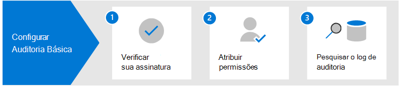

# Configurar auditoria básica em Microsoft 365

A Auditoria Básica em Microsoft 365 permite pesquisar registros de auditoria para atividades realizadas nos diferentes serviços Microsoft 365 pelos usuários e administradores. Como a Auditoria Básica é ativada por padrão para a maioria das organizações Microsoft 365 e Office 365, há apenas algumas coisas que você precisa fazer antes que você e outros da sua organização possam pesquisar no registro de auditoria.

Este artigo discute as seguintes etapas necessárias para a configuração da Auditoria Básica.

Essas etapas incluem garantir as assinaturas organizacionais adequadas e o licenciamento de usuários necessários para gerar e preservar registros de auditoria e atribuir permissões aos membros da equipe de suas operações de segurança, TI, conformidade e equipes legais para que possam pesquisar o registro de auditoria.

Para obter mais informações, consulte [Auditoria Básica em Microsoft 365](auditing-solutions-overview.md#basic-audit).

## Passo 1: Verifique a assinatura da organização e o licenciamento do usuário

O licenciamento para auditoria básica requer a assinatura de organização apropriada que fornece acesso à ferramenta de pesquisa de log de auditoria e licenciamento por usuário que é necessário para registrar e reter registros de auditoria.

Quando uma atividade auditada é realizada por um usuário ou administrador, um registro de auditoria é gerado e armazenado no log de auditoria para a sua organização. Na Auditoria Básica, os registros de auditoria são retidos e pesquisáveis no registro de auditoria por 90 dias.

Para obter uma lista de requisitos de assinatura e licenciamento para auditoria básica, consulte [soluções de auditoria em Microsoft 365](auditing-solutions-overview.md#licensing-requirements).

## Passo 2: Atribuir permissões para pesquisar no registro de auditoria

Os administradores e membros das equipes de investigação devem ser designados para a função View-Only Audit Logs ou Audit Logs em Exchange Online para pesquisar o registro de auditoria. Por padrão, essas funções são atribuídas aos grupos de funções Gerenciamento de Conformidade e Gerenciamento de Organização na página **Permissões** do centro de administração do Exchange. Os administradores globais em Office 365 e Microsoft 365 são automaticamente adicionados como membros do grupo de papel de Gestão da Organização em Exchange Online. Para que um usuário tenha a capacidade de pesquisar o log de auditoria com o nível mínimo de privilégios, você pode criar um grupo de funções personalizado no Exchange Online, adicionar a função Logs de Auditoria Somente para Exibição ou Logs de Auditoria e, em seguida, adicionar o usuário como um membro do novo grupo de funções. Para saber mais, confira [Gerenciar Grupos de Funções do Exchange Online](/Exchange/permissions-exo/role-groups).

A captura de tela a seguir mostra as duas funções relacionadas à auditoria atribuídas ao grupo de funções de Gestão da Organização no centro administrativo Exchange.

## Passo 3: Pesquise o registro de auditoria

Agora você está pronto para pesquisar o login de auditoria no Microsoft 365 centro de conformidade.

1. Vá <https://compliance.microsoft.com> e faça login usando uma conta que recebeu as permissões de auditoria apropriadas.

2. No painel de navegação esquerdo do centro de conformidade Microsoft 365, clique **em Mostrar tudo** e, em seguida, clique em **Auditoria**.

3. Na página **Auditoria,** configure a pesquisa usando as seguintes condições na guia **Pesquisar.** 

   

   1. **Faixa de data e hora**. Selecione um intervalo de datas e horas para exibir os eventos ocorridos durante esse período. A data e hora são apresentadas na horário local. Os últimos sete dias são selecionados por padrão.
  
   2. **Atividades**. Selecione as atividades para procurar. Use a caixa de pesquisa para procurar atividades para adicionar à lista. Para uma lista parcial de atividades auditadas, consulte [atividades auditadas.](search-the-audit-log-in-security-and-compliance.md#audited-activities) Deixe esta caixa em branco para retornar as entradas para todas as atividades auditadas.
  
   3. **Usuários**.  Clique nesta caixa e comece a digitar o nome dos usuários para exibir os resultados de pesquisa. As entradas de registro de auditoria para as atividades selecionadas realizadas pelos usuários selecionados nesta caixa são exibidas na lista de resultados. Deixe essa caixa em branco para retornar entradas para todos os usuários (e contas de serviço) na sua organização.
  
   4. **Arquivo, pasta ou site**. Digite alguns ou todos os nomes de um arquivo ou pasta para procurar atividades relacionadas ao arquivo da pasta que contenha a palavra-chave especificada. Você também pode especificar uma URL de um arquivo ou pasta. Se você usar uma URL de um arquivo ou pasta, certifique-se de digitar o caminho completo da URL ou se você digitar uma parte da URL, não inclua nenhum caractere ou espaço especial. Deixe essa caixa em branco para retornar entradas para todos os arquivos e pastas em sua organização.

4. Clique em **Pesquisar** para executar a pesquisa.

Uma nova página é exibida que mostra que a pesquisa de log de auditoria está sendo feita. Quando a pesquisa é concluída, os registros de auditoria são exibidos na página. Clique em um registro para exibir uma página de flyout com propriedades detalhadas.

Para obter instruções mais detalhadas, consulte [Pesquisar o login de auditoria no centro de conformidade](search-the-audit-log-in-security-and-compliance.md).
