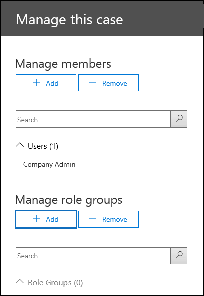

# <a name="set-up-compliance-boundaries-for-ediscovery-investigations"></a>Configurar limites de conformidade para investigações de Descobertas EDiscovery

As diretrizes neste artigo podem ser aplicadas ao usar a Descoberta Básica eDiscovery ou a Descoberta Avançada para gerenciar investigações.

Os limites de conformidade criam limites lógicos em uma organização que controla os locais de conteúdo do usuário (como caixas de correio, contas do OneDrive e sites do SharePoint) que os gerentes de Descoberta Eletrônico podem pesquisar. Além disso, os limites de conformidade controlam quem pode acessar os casos de Descobertas Escobertas usados para gerenciar as investigações legais, de recursos humanos ou de outras investigações em sua organização. A necessidade de limites de conformidade geralmente é necessária para corporações multi-nacionais que precisam respeitar os tabuleiros geográficos e os regulamentos e para os governos, que geralmente são divididos em agências diferentes. No Microsoft 365, os limites de conformidade ajudam você a atender a esses requisitos ao executar pesquisas de conteúdo e gerenciar investigações com casos de Descoberta eDiscovery.
  
Usamos o exemplo na ilustração a seguir para explicar como funcionam os limites de conformidade.
  

  
Neste exemplo, Contoso LTD é uma organização que consiste em duas subsidiárias, Fourth Coffee e Coho Winery. A empresa exige que os agentes de Descoberta Eletrônico e os investigadores só possam pesquisar as caixas de correio do Exchange, contas do OneDrive e sites do SharePoint em sua agência. Além disso, os gerentes e os investigadores de Descoberta Desdiscovery só podem ver casos de Descoberta eDiscovery em sua agência, e eles só podem acessar os casos dos quais são membros. Além disso, neste cenário, os investigadores não podem colocar locais de conteúdo em espera ou exportar conteúdo de um caso. Veja como os limites de conformidade atendem a esses requisitos.
  
- A funcionalidade de filtragem de permissões de pesquisa de conteúdo controla os locais de conteúdo que os gerentes e investigadores de Descoberta De Descoberta De Conteúdo podem pesquisar. Isso significa que os gerentes e investigadores de Descobertas e Descobertas Na Quarta Agência de Café só podem pesquisar locais de conteúdo na subsidiária quarto café. A mesma restrição se aplica à subsidiária coho Winery.

- Os grupos de funções fornecem as seguintes funções para limites de conformidade:

  - Controle quem pode ver os casos de Descoberta Digital no Centro de Conformidade & Segurança. Isso significa que os gerentes e os investigadores de Descobertas Desdiscovery só podem ver os casos de Descoberta eDiscovery em sua agência.

  - Controle quem pode atribuir membros a um caso de Descoberta E. Isso significa que os gerentes e os investigadores de Descobertas E.C.S. só podem atribuir membros a casos dos quais eles próprios são membros.

  - Controle as tarefas relacionadas à Descoberta e que os membros podem executar adicionando ou removendo funções que atribuem permissões específicas.

Este é o processo de configuração de limites de conformidade:
  
[Etapa 1: identificar um atributo de usuário para definir suas agências](#step-1-identify-a-user-attribute-to-define-your-agencies)

[Etapa 2: Arquivar uma solicitação com o Suporte da Microsoft para sincronizar o atributo do usuário às contas do OneDrive](#step-2-file-a-request-with-microsoft-support-to-synchronize-the-user-attribute-to-onedrive-accounts)

[Etapa 3: Criar um grupo de funções para cada agência](#step-3-create-a-role-group-for-each-agency)

[Etapa 4: Criar um filtro de permissões de pesquisa para impor o limite de conformidade](#step-4-create-a-search-permissions-filter-to-enforce-the-compliance-boundary)

[Etapa 5: Criar um caso de Descoberta e Para investigações dentro da agência](#step-5-create-an-ediscovery-case-for-intra-agency-investigations)

## <a name="before-you-set-up-compliance-boundaries"></a>Antes de configurar limites de conformidade

Você precisa atender aos seguintes pré-requisitos antes que o atributo do Azure Active Directory (Azure AD) que você identidade (na Etapa 1) possa ser sincronizado com êxito com a conta do OneDrive de um usuário (na Etapa 2):

- Os usuários devem ter uma licença do Exchange Online e uma licença do SharePoint Online.

- As caixas de correio de usuário devem ter pelo menos 10 MB de tamanho. Se a caixa de correio de um usuário for menor que 10 MB, o atributo usado para definir suas agências não será sincronizado com a conta do OneDrive do usuário.

- Os limites de conformidade e os atributos usados para criar filtros de permissões de pesquisa exigem que os atributos do Azure Active Directory (Azure AD) sejam sincronizados com caixas de correio de usuário. Para verificar se os atributos que você deseja usar foram sincronizados, execute o cmdlet [Get-User](/powershell/module/exchange/get-user) no PowerShell do Exchange Online. A saída deste cmdlet exibe os atributos do Azure AD sincronizados com o Exchange Online.

## <a name="step-1-identify-a-user-attribute-to-define-your-agencies"></a>Etapa 1: identificar um atributo de usuário para definir suas agências

A primeira etapa é escolher um atributo do Azure AD a ser usado que definirá suas agências. Esse atributo é usado para criar o filtro de permissões de pesquisa que limita um gerente de Descoberta e para pesquisar apenas os locais de conteúdo dos usuários que têm um valor específico para esse atributo. Por exemplo, digamos que a Contoso decida usar o **atributo Department.** O valor para esse atributo para usuários na subsidiária Quarto Café seria e o valor para usuários na  `FourthCoffee`  subsidiária coho Winery seria `CohoWinery` . Na Etapa 4, você usa esse  `attribute:value`  par (por exemplo, *Department:FourthCoffee*) para limitar os locais de conteúdo do usuário que os gerentes de Descobertas Públicas podem pesquisar. 
  
Aqui está uma lista de atributos de usuário do Azure AD que você pode usar para limites de conformidade:
  
- Empresa

- CustomAttribute1 - CustomAttribute15

- Departamento

- Escritório

- C (Código de país de duas letras) <sup>*</sup>

  > [!NOTE]
  > <sup>*</sup> Esse atributo é mapeado para a propriedade CountryOrRegion retornada executando o cmdlet **Get-User** no PowerShell do Exchange Online. O cmdlet retorna o nome de país localizado, que é traduzido do código de país de duas letras. Para obter mais informações, consulte a descrição do parâmetro CountryOrRegion no artigo de referência do cmdlet [Set-User.](/powershell/module/exchange/set-user)

Embora mais atributos de usuário estão disponíveis, especialmente para caixas de correio do Exchange, os atributos listados acima são os únicos atualmente suportados pelo OneDrive.
  
## <a name="step-2-file-a-request-with-microsoft-support-to-synchronize-the-user-attribute-to-onedrive-accounts"></a>Etapa 2: Arquivar uma solicitação com o Suporte da Microsoft para sincronizar o atributo do usuário às contas do OneDrive

A próxima etapa é arquivar uma solicitação com o Suporte da Microsoft para sincronizar o atributo do Azure AD que você escolheu na Etapa 1 para todas as contas do OneDrive em sua organização. Depois que essa sincronização ocorrer, o atributo (e seu valor) escolhido na Etapa 1 será mapeado para uma propriedade gerenciada oculta chamada `ComplianceAttribute` . Use esse atributo para criar o filtro de permissões de pesquisa do OneDrive na Etapa 4.
  
Inclua as seguintes informações ao enviar a solicitação para o suporte da Microsoft:
  
- O nome de domínio padrão da sua organização

- O nome do atributo Azure AD (da Etapa 1)

- O seguinte título ou descrição da finalidade da solicitação de suporte: "Habilitar a sincronização do OneDrive for Business com o Azure AD para filtros de segurança de conformidade". Isso ajuda a encaminhar a solicitação para a equipe de engenharia de Descoberta e Que implementa a solicitação.

Depois que a alteração de engenharia for feita e o atributo for sincronizado com o OneDrive, o Suporte da Microsoft enviará o número de com build no qual a alteração foi feita e uma data de implantação estimada. O processo de implantação geralmente leva de 4 a 6 semanas após você enviar a solicitação de suporte.
  
> [!IMPORTANT]
> Você pode concluir a Etapa 3 até a Etapa 5 antes que essa alteração de atributo seja implantada. Mas a execução de pesquisas de conteúdo não retornará documentos de contas do OneDrive especificados em um filtro de permissões de pesquisa até depois que a sincronização de atributos for implantada.
  
## <a name="step-3-create-a-role-group-for-each-agency"></a>Etapa 3: Criar um grupo de funções para cada agência

A próxima etapa é criar os grupos de função no Centro de Conformidade & segurança que se alinhará às suas agências. Recomendamos que você crie um grupo de funções copiando o grupo de Gerentes de Descoberta eDiscovery integrado, adicionando os membros apropriados e removendo funções que podem não ser aplicáveis às suas necessidades. Para obter mais informações sobre funções relacionadas à Descoberta Digital, consulte [Assign eDiscovery permissions in the Office 365 Security & Compliance Center](assign-ediscovery-permissions.md).
  
Para criar os grupos de  função &, vá para a página Permissões no Centro de Conformidade e Segurança e crie um grupo de função para cada equipe em cada agência que usará limites de conformidade e casos de Descobertas E Para gerenciar investigações.
  
Usando o cenário de limites de conformidade da Contoso, quatro grupos de funções precisam ser criados e os membros apropriados adicionados a cada um.
  
- Quatro Gerentes de Descoberta De Café

- Quarto Coffee Investigators

- Coho Winery eDiscovery Managers

- Coho Winery Investigators
  
Para atender aos requisitos do cenário de limites  de  conformidade da Contoso, você também removeria as funções de Remoção e Exportação dos grupos de função de investigadores para impedir que os investigadores colocarem regiões de conteúdo e exportar conteúdo de um caso.

## <a name="step-4-create-a-search-permissions-filter-to-enforce-the-compliance-boundary"></a>Etapa 4: Criar um filtro de permissões de pesquisa para impor o limite de conformidade

Depois de criar grupos de função para cada agência, a próxima etapa é criar os filtros de permissões de pesquisa que associam cada grupo de funções à sua agência específica e define o próprio limite de conformidade. Você precisa criar um filtro de permissões de pesquisa para cada agência. Para obter mais informações sobre como criar filtros de permissões de segurança, consulte [Configure permissions filtering for Content Search](permissions-filtering-for-content-search.md).
  
Esta é a sintaxe usada para criar um filtro de permissões de pesquisa usado para limites de conformidade.

```powershell
New-ComplianceSecurityFilter -FilterName <name of filter> -Users <role groups> -Filters "Mailbox_<ComplianceAttribute>  -eq '<AttributeVale> '", "Site_<ComplianceAttribute>  -eq '<AttributeValue>' -or Site_Path -like '<SharePointURL>*'" -Action <Action >
```

Aqui está uma descrição de cada parâmetro no comando:
  
- `FilterName`: Especifica o nome do filtro. Use um nome que descreva ou identifique a agência em que o filtro é usado.

- `Users`: Especifica os usuários ou grupos que têm esse filtro aplicado às ações de Pesquisa de Conteúdo que executam. Para limites de conformidade, este parâmetro especifica os grupos de função (que você criou na Etapa 3) na agência para a que você está criando o filtro. Observe que este é um parâmetro de vários valores para que você possa incluir um ou mais grupos de função, separados por vírgulas.

- `Filters`: Especifica os critérios de pesquisa do filtro. Para os limites de conformidade, você define os seguintes filtros. Cada uma se aplica a um local de conteúdo. 

    - `Mailbox`: Especifica as caixas de correio que os grupos de função definidos no  `Users` parâmetro podem pesquisar. Para limites de conformidade,  *ComplianceAttribute*  é o mesmo atributo identificado na Etapa 1 e  *AttributeValue*  especifica a agência. Esse filtro permite que os membros do grupo de funções pesquisem apenas as caixas de correio em uma agência específica; por exemplo, `"Mailbox_Department -eq 'FourthCoffee'"` . 

    - `Site`: Especifica as contas do OneDrive que os grupos de função definidos no `Users` parâmetro podem pesquisar. Para o filtro do OneDrive, use a cadeia de caracteres  `ComplianceAttribute` real . Isso mapeia para o mesmo atributo que você identificou na Etapa 1 e que é sincronizado com contas do OneDrive como resultado da solicitação de suporte que você enviou na Etapa 2; *AttributeValue*  especifica a agência. Esse filtro permite que os membros do grupo de funções pesquisem apenas as contas do OneDrive em uma agência específica; por exemplo,  `"Site_ComplianceAttribute -eq 'FourthCoffee'"` .

    - `Site_Path`: Especifica os sites do SharePoint que os grupos de função definidos no  `Users` parâmetro podem pesquisar. O  *SharePointURL*  especifica os sites na agência que os membros do grupo de função podem pesquisar. Por exemplo, `"Site_Path -like 'https://contoso.sharepoint.com/sites/FourthCoffee*'"`. Observe que `Site` os `Site_Path` filtros e são conectados por **um operador -ou.**

     > [!NOTE]
     > A sintaxe do `Filters` parâmetro inclui uma lista de *filtros*. Uma lista de filtros é um filtro que inclui um filtro de caixa de correio e um filtro de site separado por uma vírgula. No exemplo anterior, observe que uma vírgula separa Mailbox_ComplianceAttribute **e** **Site_ComplianceAttribute**: `-Filters "Mailbox_<ComplianceAttribute>  -eq '<AttributeVale> '", "Site_ComplianceAttribute  -eq '<AttributeValue>' -or Site_Path -like '<SharePointURL>*'"` . Quando esse filtro é processado durante a execução de uma pesquisa de conteúdo, dois filtros de permissões de pesquisa são criados a partir da lista de filtros: um filtro de caixa de correio e um filtro de site. Uma alternativa ao uso de uma lista de filtros seria criar dois filtros de permissões de pesquisa separados para cada agência: um filtro de permissões de pesquisa para o atributo de caixa de correio e um filtro para os atributos do site. Em ambos os casos, os resultados serão os mesmos. Usar uma lista de filtros ou criar filtros de permissões de pesquisa separados é uma questão de preferência.

- `Action`: Especifica o tipo de ação de Pesquisa de Conformidade ao qual o filtro é aplicado. Por exemplo, só aplicaria o filtro quando membros do grupo de funções  `-Action Search` definidos no `Users` parâmetro executarem uma pesquisa de conteúdo. Nesse caso, o filtro não seria aplicado ao exportar resultados da pesquisa. Para limites de conformidade, use  `-Action All` para que o filtro se aplique a todas as ações de pesquisa. 

    Para ver uma lista das ações de Pesquisa de Conteúdo, consulte a seção "New-ComplianceSecurityFilter" em [Configure permissions filtering for Content Search](permissions-filtering-for-content-search.md#new-compliancesecurityfilter).

Aqui estão exemplos dos dois filtros de permissões de pesquisa que seriam criados para dar suporte ao cenário de limites de conformidade da Contoso. Ambos os exemplos incluem uma lista de filtros separados por vírgulas, na qual a caixa de correio e os filtros de site são incluídos no mesmo filtro de permissões de pesquisa e são separados por uma vírgula.
  
### <a name="fourth-coffee"></a>Quarto Café

```powershell
New-ComplianceSecurityFilter -FilterName "Fourth Coffee Security Filter" -Users "Fourth Coffee eDiscovery Managers", "Fourth Coffee Investigators" -Filters "Mailbox_Department -eq 'FourthCoffee'", "Site_ComplianceAttribute -eq 'FourthCoffee' -or Site_Path -like 'https://contoso.sharepoint.com/sites/FourthCoffee*'" -Action ALL
```

### <a name="coho-winery"></a>Vinícola Coho

```powershell
New-ComplianceSecurityFilter -FilterName "Coho Winery Security Filter" -Users "Coho Winery eDiscovery Managers", "Coho Winery Investigators" -Filters "Mailbox_Department -eq 'CohoWinery'", "Site_ComplianceAttribute -eq 'CohoWinery' -or Site_Path -like 'https://contoso.sharepoint.com/sites/CohoWinery*'" -Action ALL
```

## <a name="step-5-create-an-ediscovery-case-for-intra-agency-investigations"></a>Etapa 5: Criar um caso de Descoberta Interna para investigações dentro da agência

A etapa final é criar um caso core de Descoberta eDiscovery ou Descoberta Avançada no Centro de conformidade do Microsoft 365 e, em seguida, adicionar o grupo de função que você criou na Etapa 3 como membro do caso. Isso resulta em duas características importantes do uso de limites de conformidade:
  
- Somente os membros do grupo de função adicionados ao caso poderão ver e acessar o caso no Centro de Conformidade & Segurança. Por exemplo, se o grupo de função Quatro Investigadores de Café for o único membro de um caso, os membros do grupo de função Quatro Gerentes de Descoberta De Café (ou membros de qualquer outro grupo de funções) não poderão ver ou acessar o caso.

- Quando um membro do grupo de função atribuído a um caso executa uma pesquisa associada ao caso, ele só poderá pesquisar os locais de conteúdo em sua agência (que é definido pelo filtro de permissões de pesquisa que você criou na Etapa 4.)

Para criar uma ocorrência e atribuir membros:

1. Vá para a página Descoberta Básica **da Descoberta** e Ou **Descoberta** Avançada no centro de conformidade do Microsoft 365 e crie uma ocorrência.

2. Na lista de casos, clique no nome do caso criado.

3. Na página Gerenciar sub-subsistência, em Gerenciar grupos **de função,** clique em Adicionar ícone   **Adicionar**.

    
  
4. Na lista de grupos de funções, selecione um dos grupos de função que você criou na Etapa 3 e clique em **Adicionar**.

5. Clique **em Salvar** no **sobrevoo Gerenciar esse caso** para salvar a alteração.

> [!NOTE]
> Ao adicionar um grupo de função a um caso, você só pode adicionar os grupos de função dos que você é membro.

## <a name="searching-and-exporting-content-in-multi-geo-environments"></a>Pesquisar e exportar conteúdo em ambientes multi-geo

Os filtros de permissões de pesquisa também permitem controlar onde o conteúdo é roteado para exportação e qual datacenter pode ser pesquisado ao pesquisar locais de conteúdo em um ambiente [Multi-Geo do SharePoint.](../enterprise/multi-geo-capabilities-in-onedrive-and-sharepoint-online-in-microsoft-365.md)
  
- **Exportar resultados da pesquisa:** Você pode exportar os resultados da pesquisa de caixas de correio do Exchange, sites do SharePoint e contas do OneDrive de um datacenter específico. Isso significa que você pode especificar o local do datacenter do qual os resultados da pesquisa serão exportados.

    Use o parâmetro **Region** para cmdlets **New-ComplianceSecurityFilter** ou **Set-ComplianceSecurityFilter** para criar ou alterar o datacenter pelo qual a exportação será roteada.
  
    |**Valor do parâmetro**|**Local do datacenter**|
    |:-----|:-----|
    |NAM  <br/> |Norte-americano (datacenters estão nos EUA)  <br/> |
    |EUR  <br/> |Europa  <br/> |
    |APC  <br/> |Pacífico Asiático  <br/> |
    |CAN <br/> |Canadá|
    |||

- **Roteia pesquisas de conteúdo:** Você pode rotear as pesquisas de conteúdo de sites do SharePoint e contas do OneDrive para um datacenter via satélite. Isso significa que você pode especificar o local do datacenter onde as pesquisas serão executados.

    Use um dos seguintes valores para o parâmetro **Region** para controlar o local do datacenter em que as pesquisas serão executados ao pesquisar sites do SharePoint e contas do OneDrive. 
  
    |**Valor do parâmetro**|**Locais de roteamento de datacenter para SharePoint**|
    |:-----|:-----|
    |NAM  <br/> |EUA  <br/> |
    |EUR  <br/> |Europa  <br/> |
    |APC  <br/> |Pacífico Asiático  <br/> |
    |CAN  <br/> |EUA  <br/> |
    |AUS  <br/> |Pacífico Asiático  <br/> |
    |KOR  <br/> |Datacenter padrão da organização  <br/> |
    |GBR  <br/> |Europa  <br/> |
    |JPN  <br/> |Pacífico Asiático  <br/> |
    |IND  <br/> |Pacífico Asiático  <br/> |
    |LAM  <br/> |EUA  <br/> |
    |NOR  <br/> |Europa |
    |BRA  <br/> |Datacenters norte-americanos |
    |||

   Se você não especificar o parâmetro **Region** para um filtro de permissões de pesquisa, a região principal do SharePoint da organização será pesquisada. Os resultados da pesquisa são exportados para o datacenter mais próximo.

   Para simplificar o conceito, o parâmetro **Region** controla o datacenter usado para pesquisar conteúdo no SharePoint e no OneDrive. Isso não se aplica à pesquisa de conteúdo no Exchange porque as pesquisas de conteúdo do Exchange não estão vinculadas à localização geográfica dos datacenters. Além disso, o mesmo **valor do** parâmetro Region também pode ditar o datacenter pelo o que as exportações são roteados. Isso geralmente é necessário para controlar a movimentação de dados entre os boarders geográficos.

> [!NOTE]
> Se você estiver usando a Descoberta Técnica Avançada, o parâmetro **Region** não controlará a região de onde os dados são exportados. Os dados são exportados do datacenter principal da organização. Além disso, a pesquisa de conteúdo no SharePoint e no OneDrive não está vinculada à localização geográfica dos datacenters. Todos os datacenters são pesquisados. Para obter mais informações sobre a Descoberta Avançada, consulte [Overview of the Advanced eDiscovery solution in Microsoft 365](overview-ediscovery-20.md).

Aqui estão exemplos de uso do parâmetro **Region** ao criar filtros de permissão de pesquisa para limites de conformidade. Isso pressupo que a subsidiária quarto café está localizada na América do Norte e que Coho Winery está na Europa. 
  
```powershell
New-ComplianceSecurityFilter -FilterName "Fourth Coffee Security Filter" -Users "Fourth Coffee eDiscovery Managers", "Fourth Coffee Investigators" -Filters "Mailbox_Department -eq 'FourthCoffee'", "Site_Department -eq 'FourthCoffee' -or Site_Path -like 'https://contoso.sharepoint.com/sites/FourthCoffee*'" -Action ALL -Region NAM
```

```powershell
New-ComplianceSecurityFilter -FilterName "Coho Winery Security Filter" -Users "Coho Winery eDiscovery Managers", "Coho Winery Investigators" -Filters "Mailbox_Department -eq 'CohoWinery'", "Site_Department -eq 'CohoWinery' -or Site_Path -like 'https://contoso.sharepoint.com/sites/CohoWinery*'" -Action ALL -Region EUR
```

Lembre-se das seguintes coisas ao pesquisar e exportar conteúdo em ambientes multi-geo.
  
- O parâmetro **Região** não controla as pesquisas de caixas de correio do Exchange. Todos os datacenters serão pesquisados quando você pesquisar caixas de correio. Para limitar o escopo do qual as caixas de correio do Exchange são pesquisadas, use o parâmetro **Filters** ao criar ou alterar um filtro de permissões de pesquisa. 

- Se for necessário que um Gerenciador de Descobertas Digitais pesquise em várias regiões do SharePoint, você precisará criar uma conta de usuário diferente para que o gerente de Descoberta Digital use no filtro de permissões de pesquisa para especificar a região onde os sites do SharePoint ou contas do OneDrive estão localizados. Para obter mais informações sobre como configurar isso, consulte a seção "Pesquisar conteúdo em um ambiente Multi-Geo do SharePoint" em [Pesquisa de Conteúdo](content-search.md#searching-for-content-in-a-sharepoint-multi-geo-environment).

- Ao pesquisar conteúdo no SharePoint e no OneDrive, o parâmetro **Region** direciona as pesquisas para a localização principal ou por satélite onde o gerente de Descoberta eDiscovery conduzirá investigações de Descoberta e. Se um gerente de Descoberta Externa pesquisar sites do SharePoint e do OneDrive fora da região especificada no filtro de permissões de pesquisa, nenhum resultado de pesquisa será retornado.

- Ao exportar resultados da pesquisa, o conteúdo de todos os locais de conteúdo (incluindo Exchange, Skype for Business, SharePoint, OneDrive e outros serviços que você pode pesquisar usando a ferramenta pesquisa de conteúdo) é carregado para o local de Armazenamento do Azure no datacenter especificado pelo parâmetro **Region.** Isso ajuda as organizações a permanecer em conformidade, não permitindo que o conteúdo seja exportado entre bordas controladas. Se nenhuma região for especificada no filtro de permissões de pesquisa, o conteúdo será carregado no datacenter principal da organização.

- Você pode editar um filtro de permissões de pesquisa existente para adicionar ou alterar a região executando o seguinte comando:

    ```powershell
    Set-ComplianceSecurityFilter -FilterName <Filter name>  -Region <Region>
    ```

## <a name="using-compliance-boundaries-for-sharepoint-hub-sites"></a>Usando limites de conformidade para sites de hub do SharePoint

[Os sites de hub](/sharepoint/dev/features/hub-site/hub-site-overview) do SharePoint geralmente se alinham com os mesmos limites geográficos ou de agência que os limites de conformidade da Descoberta Online seguem. Isso significa que você pode usar a propriedade ID do site do hub para criar um limite de conformidade. Para fazer isso, use o cmdlet [Get-SPOHubSite](/powershell/module/sharepoint-online/get-spohubsite#examples) no PowerShell do SharePoint Online para obter o SiteId para o site do hub e, em seguida, use esse valor para a propriedade ID do departamento para criar um filtro de permissões de pesquisa.

Use a sintaxe a seguir para criar um filtro de permissões de pesquisa para um site de hub do SharePoint:

```powershell
New-ComplianceSecurityFilter -FilterName <Filter Name> -Users <User or Group> -Filters "Site_Departmentid -eq '{SiteId of hub site}'" -Action ALL
```

Veja um exemplo de criação de um filtro de permissões de pesquisa para um site de hub para a agência Coho Winery:

```powershell
New-ComplianceSecurityFilter -FilterName "Coho Winery Hub Site Security Filter" -Users "Coho Winery eDiscovery Managers", "Coho Winery Investigators" -Filters "Site_Departmentid -eq '44252d09-62c4-4913-9eb0-a2a8b8d7f863'" -Action ALL
```

## <a name="compliance-boundary-limitations"></a>Limitações de limite de conformidade

Tenha em mente as seguintes limitações ao gerenciar casos e investigações de Descobertas e Descobertas Que usam limites de conformidade.
  
- Ao criar e executar uma pesquisa, você pode selecionar locais de conteúdo que estão fora da sua agência. No entanto, devido ao filtro de permissões de pesquisa, o conteúdo desses locais não está incluído nos resultados da pesquisa.

- Os limites de conformidade não se aplicam a resções em casos de Descoberta E. Isso significa que um gerente de Descoberta De eDiscovery em uma agência pode colocar um usuário em uma agência diferente em espera. No entanto, o limite de conformidade será imposto se o gerenciador de Descobertas esdiscovery pesquisar os locais de conteúdo do usuário que foi colocado em espera. Isso significa que o gerente de Descobertas E Não poderá pesquisar os locais de conteúdo do usuário, mesmo que ele tenha sido capaz de colocar o usuário em espera.

    Além disso, as estatísticas de espera só se aplicarão a locais de conteúdo na agência.

- Os filtros de permissões de pesquisa não são aplicados a pastas públicas do Exchange.

## <a name="more-information"></a>Mais informações

- Se uma caixa de correio for des licenciada ou excluída de forma suave, os atributos do Azure AD não serão mais sincronizados com a caixa de correio. Se uma espera foi colocada na caixa de correio quando foi excluída, o conteúdo preservado na caixa de correio ainda está sujeito a um limite de conformidade ou filtro de permissões de pesquisa com base na última vez em que os atributos do Azure AD foram sincronizados antes da caixa de correio ser excluída. 

    Além disso, a sincronização entre a caixa de correio do usuário e a conta do OneDrive será cessada se a caixa de correio for des licenciada ou excluída. O último valor carimbado do atributo de conformidade da conta do OneDrive permanecerá em vigor.

- O atributo de conformidade é sincronizado da caixa de correio do Exchange de um usuário com sua conta do OneDrive a cada sete dias. Conforme mencionado anteriormente, essa sincronização só ocorre quando o usuário recebe uma licença do Exchange Online e do SharePoint Online e a caixa de correio do usuário é de pelo menos 10 MB.

- Se os limites de conformidade e os filtros de permissões de pesquisa são implementados para a caixa de correio de um usuário e a conta do OneDrive, recomendamos que você não exclua a caixa de correio de um usuário e não a conta do OneDrive. Em outras palavras, se você excluir a caixa de correio de um usuário, também deverá remover a conta do OneDrive do usuário.

- Há situações (como um funcionário que retorna) em que um usuário pode ter duas ou mais contas do OneDrive. Nesses casos, somente a conta principal do OneDrive associada ao usuário no Azure AD será sincronizada.

- Os limites de conformidade e os filtros de permissões de pesquisa dependem dos atributos que estão sendo carimbados no conteúdo no Exchange, no OneDrive e no SharePoint e na indexação subsequente desse conteúdo carimbado. 

- Não recomendamos o uso de filtros de exclusão (como o uso em um filtro de permissões de pesquisa) para um limite `-not()` de conformidade baseado em conteúdo. O uso de um filtro de exclusão pode ter resultados inesperados se o conteúdo com atributos atualizados recentemente não tiver sido indexado. 

## <a name="frequently-asked-questions"></a>Perguntas frequentes

**Quem pode criar e gerenciar filtros de permissões de pesquisa (usando New-ComplianceSecurityFilter e Set-ComplianceSecurityFilter cmdlets)?**
  
Para criar, exibir e modificar filtros de permissões de pesquisa &, você precisa ser membro do grupo de função Gerenciamento da Organização no Centro de Conformidade e Segurança.
  
**Se um gerente de Descoberta De eDiscovery for atribuído a mais de um grupo de funções que abrange várias agências, como eles pesquisam conteúdo em uma agência ou em outra?**
  
O gerente de Descoberta Desdiscovery pode adicionar parâmetros à consulta de pesquisa que restringem a pesquisa a uma agência específica. Por exemplo, se uma organização especificou a propriedade **CustomAttribute10** para diferenciar agências, elas poderão anexar o seguinte à consulta de pesquisa para caixas de correio de pesquisa e contas do OneDrive em uma agência específica:  `CustomAttribute10:<value> AND Site_ComplianceAttribute:<value>` .
  
**O que acontece se o valor do atributo usado como atributo de conformidade em um filtro de permissões de pesquisa for alterado?**
  
Leva até três dias para um filtro de permissões de pesquisa impor o limite de conformidade se o valor do atributo usado no filtro for alterado. Por exemplo, no cenário Contoso, digamos que um usuário na agência Quarto Café seja transferido para a agência de Vinícola Coho. Como resultado, o valor do atributo **Department** no objeto user é alterado de *FourthCoffee* para *CohoWinery*. Nessa situação, a Descoberta EDiscovery do Quarto Café e os investidores obterão resultados de pesquisa para esse usuário por até três dias após a alteração do atributo. Da mesma forma, leva até três dias para que os gerentes e investigadores de Descoberta e Descoberta De Coho Winery recebam resultados de pesquisa para o usuário.
  
**Um gerente de Descoberta E pode ver o conteúdo de dois limites de conformidade separados?**
  
Sim, isso pode ser feito ao pesquisar caixas de correio do Exchange adicionando o gerente de Descoberta Eletrônico a grupos de funções que têm visibilidade para ambas as agências. No entanto, ao pesquisar sites do SharePoint e contas do OneDrive, um gerente de Descoberta Geográfica pode pesquisar conteúdo em diferentes limites de conformidade somente se as agências estão na mesma região ou localização geográfica. **Observação:** Essa limitação para sites não se aplica à Descoberta Avançada de EDiscovery porque a pesquisa de conteúdo no SharePoint e no OneDrive não está vinculada à localização geográfica.
  
**Os filtros de permissões de pesquisa funcionam para retenções de caso de Descoberta eDiscovery, políticas de retenção do Microsoft 365 ou DLP?**
  
Não, não neste momento.
  
**Se eu especificar uma região para controlar onde o conteúdo é exportado, mas não tenho uma organização do SharePoint nessa região, ainda posso pesquisar no SharePoint?**
  
Se a região especificada no filtro de permissões de pesquisa não existir em sua organização, a região padrão será pesquisada.
  
**Qual é o número máximo de filtros de permissões de pesquisa que podem ser criados em uma organização?**
  
Não há limite para o número de filtros de permissões de pesquisa que podem ser criados em uma organização. No entanto, o desempenho da pesquisa será afetado quando houver mais de 100 filtros de permissões de pesquisa. Para manter o número de filtros de permissões de pesquisa em sua organização o menor possível, crie filtros que combinem regras para Exchange, SharePoint e OneDrive em um único filtro de permissões de pesquisa sempre que possível.