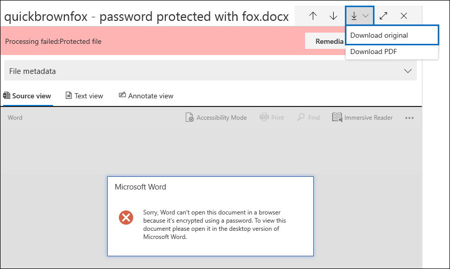
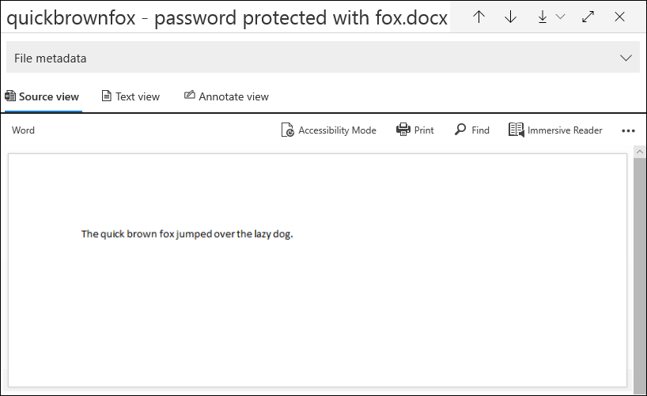

# Correção de erros de item único

A correção de erros oferece aos usuários avançados a capacidade de corrigir problemas de dados que impedem o eDiscovery avançado de processar corretamente o conteúdo. Por exemplo, arquivos que são protegidos por senha não podem ser processados porque esses arquivos estão bloqueados ou criptografados. Anteriormente, você só podia corrigir erros em massa usando [esse fluxo de trabalho](error-remediation-when-processing-data-in-advanced-ediscovery.md). Mas, às vezes, não faz sentido corrigir erros em vários arquivos quando você não tem certeza se qualquer um desses arquivos está respondendo ao caso que você está investigando. Também pode não fazer sentido corrigir os erros antes que você tenha a oportunidade de revisar os metadados do arquivo (como o local do arquivo ou quem teve acesso) para ajudá-lo a tomar decisões mais antecipadas sobre a capacidade de resposta. Um novo recurso chamado *correção de erro de item único* oferece aos gerentes de descoberta eletrônica a capacidade de exibir os metadados de arquivos com um erro de processamento e, se necessário, corrigir o erro diretamente no conjunto de revisão. O artigo discute como identificar, ignorar e corrigir arquivos com erros de processamento em um conjunto de revisão.

## Identificar documentos com erros

Os documentos com erros de processamento em um conjunto de revisão agora são identificados (com uma faixa). Você pode corrigir ou ignorar o erro. A captura de tela a seguir mostra a faixa de erro de processamento para um documento do Word em um conjunto de revisão protegido por senha. Observe também que você pode exibir os metadados de arquivo de documentos com erros de processamento.

Você também pode pesquisar documentos que têm erros de processamento usando a condição de **status de processamento** ao [consultar os documentos em um conjunto de revisão](review-set-search.md).

### Ignorar erros

Você pode ignorar um erro de processamento clicando em **ignorar** na faixa de erro de processamento. Quando você ignorar um erro, o documento será removido do [fluxo de trabalho de correção de erros em massa](error-remediation-when-processing-data-in-advanced-ediscovery.md). Depois que um erro é ignorado, a faixa de documentos muda de cor e indica que o erro de processamento foi ignorado. A qualquer momento, você pode reverter a decisão de ignorar o erro clicando em **reverter**.

Você também pode pesquisar todos os documentos que tiveram um erro de processamento ignorado usando a condição de erro de *processamento ignorado* ao consultar documentos em um conjunto de revisão.

## Corrigir um documento com erros

Às vezes, talvez seja necessário corrigir um erro de processamento em documentos (removendo uma senha, descriptografando um arquivo criptografado ou recuperando um documento corrompido) e, em seguida, adicionar o documento corrigido ao conjunto de revisão. Isso permite que você revise e exporte o documento de erro junto com outros documentos no conjunto de revisão. 

Para corrigir um único documento, siga estas etapas:

1. Clique em **baixar** > o**original** para baixar uma cópia do arquivo para um computador local.

   

2. Corrigir o erro no arquivo offline. Para arquivos criptografados que exijam software de descriptografia, para remover a proteção por senha, forneça a senha e salve o arquivo ou use um decifrador de senha. Depois de corrigir o arquivo, vá para a próxima etapa.

3. No conjunto de revisão, selecione o arquivo com o erro de processamento que você corrigiu e clique em **correção**.

   

4. Clique em **procurar**, vá para o local do arquivo corrigido no computador local e selecione o arquivo.

   

    Depois de selecionar o arquivo corrigido, ele é carregado automaticamente para o conjunto de revisão. Você pode acompanhar o status de processamento do arquivo.

    

   Depois que o processamento for concluído, você poderá exibir o documento corrigido.

    

Para obter mais informações sobre o que acontece quando um documento é corrigido, consulte [o que acontece quando os arquivos são corrigidos](error-remediation.md#what-happens-when-files-are-remediated).

## Pesquisar documentos corrigidos

Você pode pesquisar todos os documentos em um conjunto de revisão que foram corrigidos usando a condição de **palavras-chave** e especificando a seguinte propriedade: par de valores: **IsFromErrorRemediation: true**. Essa propriedade também está disponível no arquivo exportar carregamento quando você exporta documentos de um conjunto de revisão.
