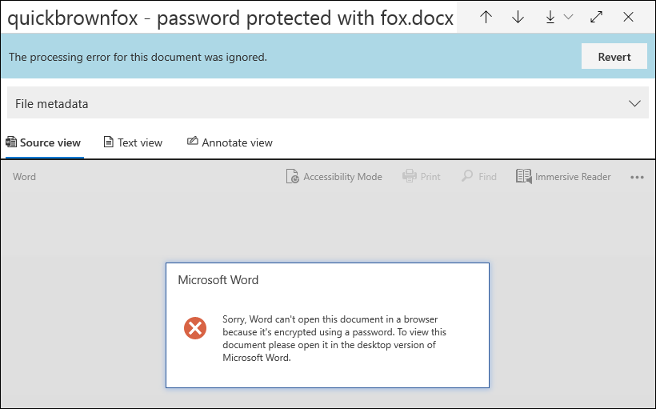

# Correção de erro de item único Advanced eDiscovery

A correção de erros Advanced eDiscovery aos usuários a capacidade de corrigir problemas de dados que impedem Advanced eDiscovery o processamento correto do conteúdo. Por exemplo, os arquivos protegidos por senha não podem ser processados porque esses arquivos são bloqueados ou criptografados. Anteriormente, você só poderia corrigir erros em massa usando [esse fluxo de trabalho](error-remediation-when-processing-data-in-advanced-ediscovery.md). Mas, às vezes, não faz sentido corrigir erros em vários arquivos quando você não tem certeza se algum desses arquivos está respondendo ao caso que você está investigando. Também pode não fazer sentido corrigir erros antes de você ter a chance de revisar os metadados de arquivo (como o local do arquivo ou quem tinha acesso) para ajudá-lo a tomar decisões in-locar sobre a capacidade de resposta. Um novo recurso chamado correção de erro de *item* único oferece aos gerentes de Descobertas Digitais a capacidade de exibir os metadados dos arquivos com um erro de processamento e, se necessário, corrigir o erro diretamente no conjunto de revisão. O artigo discute como identificar, ignorar e corrigir arquivos com erros de processamento em um conjunto de revisão.

## Identificar documentos com erros

Documentos com erros de processamento em um conjunto de revisão agora são identificados (com uma faixa). Você pode corrigir ou ignorar o erro. A captura de tela a seguir mostra a faixa de erro de processamento de um documento do Word em um conjunto de revisão protegido por senha. Observe também que você pode exibir os metadados de arquivo de documentos com erros de processamento.

Você também pode pesquisar documentos que tenham erros de processamento usando a condição de **status** processamento ao consultar os documentos em um conjunto [de revisão](review-set-search.md).

### Ignorar erros

Você pode ignorar um erro de processamento clicando em **Ignorar** na faixa de erro de processamento. Quando você ignora um erro, o documento é removido do fluxo de trabalho de correção de erros [em massa.](error-remediation-when-processing-data-in-advanced-ediscovery.md) Depois que um erro é ignorado, o banner do documento muda de cor e indica que o erro de processamento foi ignorado. A qualquer momento, você pode reverter a decisão de ignorar o erro clicando em **Reverter**.

Você também pode pesquisar todos os documentos que tiveram um erro de processamento ignorado usando a condição Erros de processamento *ignorados* ao consultar documentos em um conjunto de revisão.

## Corrigir um documento com erros

Às vezes, talvez seja necessário corrigir um erro de processamento em documentos (removendo uma senha, descriptografando um arquivo criptografado ou recuperando um documento corrompido) e, em seguida, adicione o documento remediado ao conjunto de revisão. Isso permite que você revise e exporte o documento de erro juntamente com os outros documentos no conjunto de revisão. 

Para correção de um único documento, siga estas etapas:

1. Clique **em Baixar** Baixar  >  **original** para baixar uma cópia do arquivo em um computador local.

   

2. Corrigir o erro no arquivo offline. Para arquivos criptografados, isso exigiria software de descriptografia, para remover a proteção de senha, fornecer a senha e salvar o arquivo ou usar um quebrador de senha. Depois de remediar o arquivo, vá para a próxima etapa.

3. No conjunto de revisão, selecione o arquivo com o erro de processamento que você correu e clique em **Correção**.

   

4. Clique **em** Procurar , vá para o local do arquivo remediado em seu computador local e selecione o arquivo.

   

    Depois de selecionar o arquivo remediado, ele é carregado automaticamente para o conjunto de revisão. Você pode rastrear o status de processamento do arquivo.

    

   Depois que o processamento for concluído, você poderá exibir o documento remediado.

    

Para obter mais informações sobre o que acontece quando um documento é remediado, consulte O que acontece quando os arquivos [são remediados](error-remediation-when-processing-data-in-advanced-ediscovery.md#what-happens-when-files-are-remediated).

## Pesquisar documentos remediados

Você pode pesquisar todos os documentos em um conjunto de revisão que foram remediados usando a condição **Keywords** e especificando o seguinte par de propriedades:valor: **IsFromErrorRemediation:true**. Essa propriedade também está disponível no arquivo de carga de exportação quando você exporta documentos de um conjunto de revisão.
